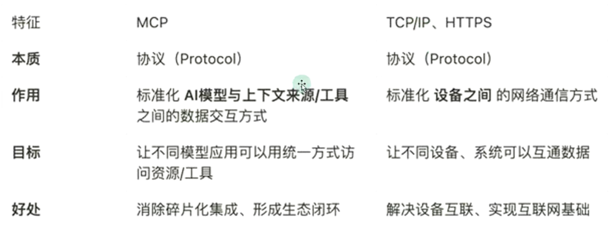
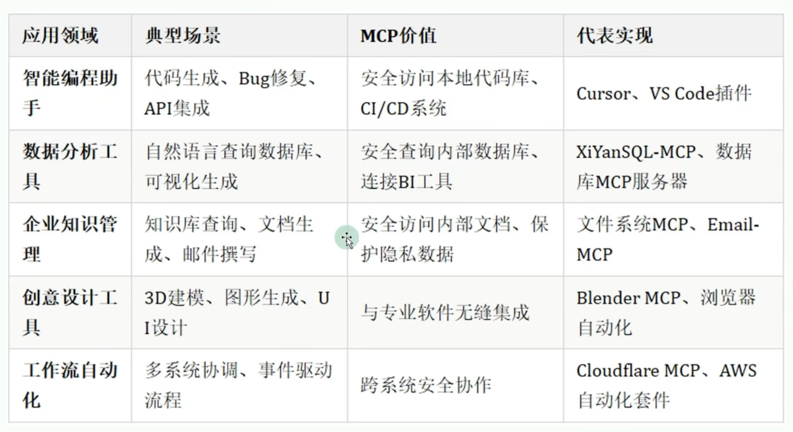
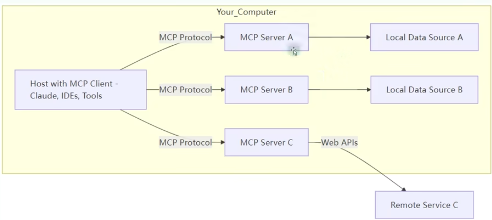
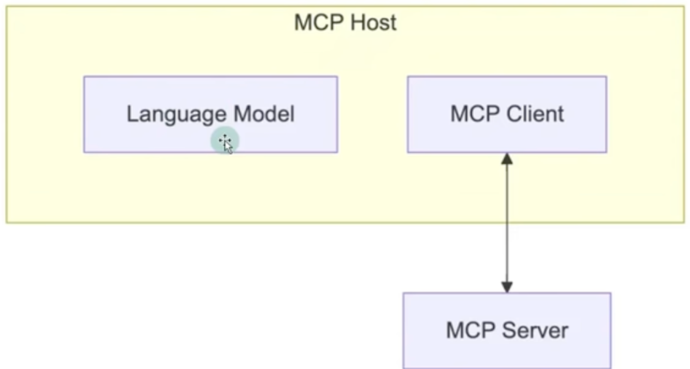
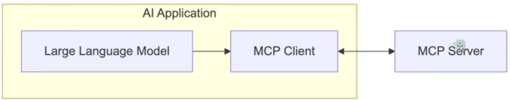
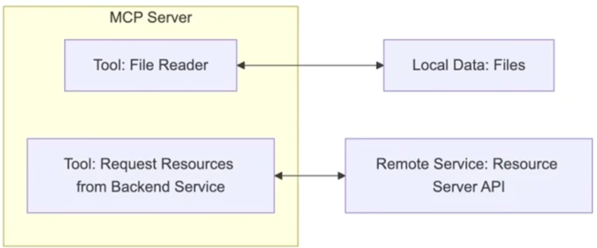
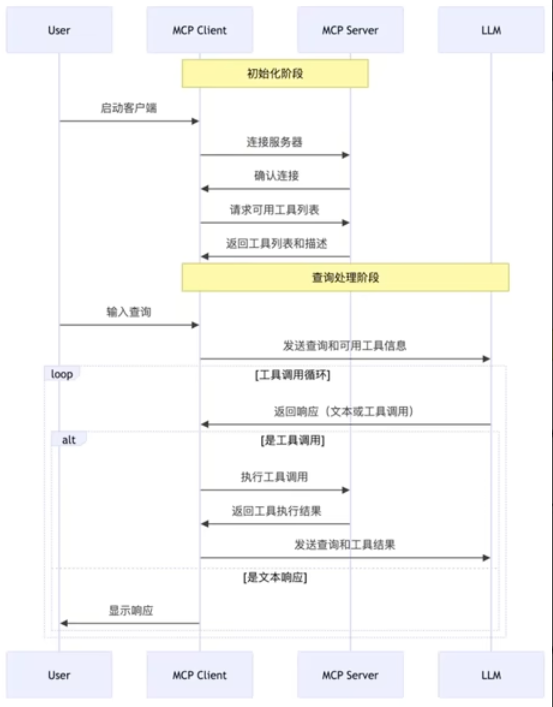
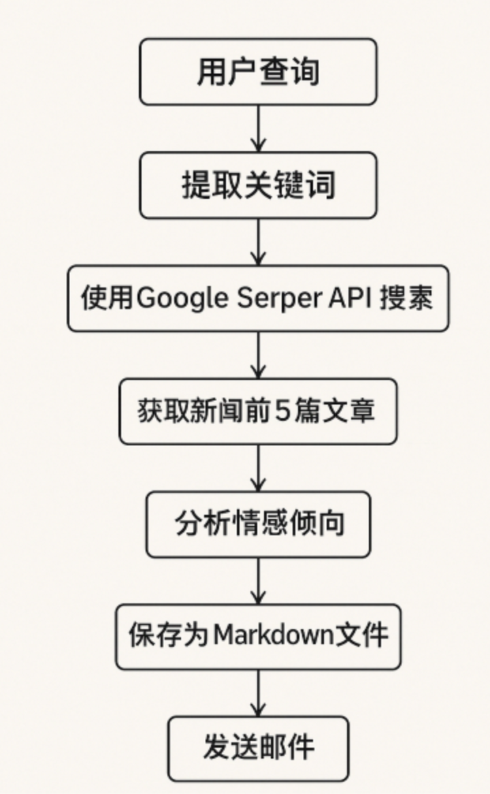

## MCP

### MCP 简介

#### 互联网领域两个重大的挑战

1、Agent 与 Tools（工具）的交互

- Agent 需要调用外部工具和API、范围内数据库、执行代码等。（MCP）

2、Agent 与 Agent （其他智能体或用户）的交互

- Agent 需要理解其他 Agent 的意图、协同完成任务，与用户进行自然的对话 （A2A）

 

#### **MCP 作用**

举例一：开发部署

- 开发者通过自然语言指令 "部署新版本到测试环境"，触发 MCP 链式调用 GitLab API（代码合并）、Jenkins API（构建镜像）、Slack API （通知团队）。

举例二：SQL 查询

- 开发者通过自然语言输入，比如 "查询某个集团部门上个季度销售额"，就能查询出数据库的数据，并结合大模型进行回答，不再需要编写 SQL，MCP 自动转换为精准SQL 语句并执行

举例三：manus智能体

- Manus 的每一次任务处理都至少需要调用网页搜索、网页访问、网页信息获取、本地文件创建、代码解释器等十几种外部工具

 

#### **MCP 的理解**

MCP（Model Context Protocol，模型上下文协议），2024年11月底，由 Anthropic 推出的一种开放标准。旨在为大语言模型的（LLM）提供统一的、标准化方式与外部数据源和工具之间进行通信

 

传统的 AI 集成的问题：这种每个数据源构建独立连接的方式，可以被视为一个 M*N 问题

问题：架构碎片化，难以扩展，限制了 AI 获取必要上下文信息的能力

MCP解决方案：提供统一可靠的方式来访问所需数据，克服了以往集成方法的局限性

 

MCP作为一种标准化协议，极大地简化了大语言模型与外部世界的交互方式，使得开发者能够以统一的方式为 AI 应用添加各种能力

 

官方文档：https://modelcontextprotocol.io/introduction



### MCP 使用

#### MCP的应用场景



#### MCP 的准备工作

1、MCP的通信机制

根据 MCP 的规范，当前支持两种通信机制（传输模式）：

- stdio（标准输入输出）：主要用在本地服务上， 操作你本地的软件或本地的文件。比如Blender 这种只能用 stdio 因为没有在线服务（MCP 默认通信方式）
- SEE（Server-Sent Events）：主要用在远程通信服务上，这个服务本身就有在线的 API，比如访问谷歌邮件，天气情况等。

 

2、stdio 方式

优点：

- 这种方式适用于客户端和服务器在同一台机器上运行的场景，简单。
- studio模式无需外部网络依赖，通信速度快，适合快速响应的本地应用
- 可靠性高，且易于调试

缺点：

- stdio的配置比较复杂，我们需要做一些准备工作，你需要提前安装需要的命令行工具。
- stdio 模式为单进程通信，无法并行处理多个客户端请求，同时由于进程资源开销大，不适合在本地运行大量服务

 

3、SSE 方式

场景

- SSE方式适用于客户端和服务器位于不同物理位置的场景。
- 适用于实时数据更新，消息推送，轻量级监控和实时日志流等场景
- 对于分布式或远程不是的场景，基于 HTTP 和 SSE 的传输方式更加合适

优点：

- 配置方式简单，一个链接就行

 

4、stdio 的本地环境安装

stdio 本地环境有两种

- Python编写的服务对应着 uvp 指令

```
// 安装 uv
pip install uv
// 检验是否安装正常
uv --version 
uvx --help
```

- TypeScript 编写的服务对应着 npx 指令

```
// 安装 nodejs
brew install node@22
```

 

### MCP 工作原理

#### MCP 的 C/S架构

MCP 遵循客户端-服务器架构（Client-server），其中包含以下几个核心概念：

- MCP 主机（MCP Hosts）
- MCP 客户端（MCP Client）
- MCP 服务器（MCP Servers）
- 本地资源（Local Resources）
- 远程资源（Remote Resources）

 

#### MCP Host

作为运行 MCP 的主应用程序，例如 Claude Desktop，Cursor，Cline 或 其他AI 工具、为用户提供与LLM 交互的接口，同时集成 MCP Client 以连接 MCP Server。



#### MCP Client

MCP client 充当 LLM 和 MCP server 之间的桥梁，嵌入在主机程序中，主要负责：

- 接受来自 LLM 的请求
- 将请求转发到相应的 MCP server
- 将 MCP server 的结果返回给 LLM 



 

#### MCP Server

每个 MCP 服务器都提供了一组特定的工具，负责从本地数据或远程服务中检索信息。是每个 MCP 架构中关键组件

- 与传统 API 的远程APi 服务器不同，MCP 服务器既可以作为本地应用程序在用户设备上运行，也可以部署至远程服务器
- 本质上是运行在电脑上的一个 nodejs 或 python程序。可以理解为客户端调用命令行调用了电脑上的 nodejs 或 python程序

 


#### MCP 的工作流程

API 主要有两个

- tools/list：列出 Server 支持的所有工具
- tools/call：Client 请求 Server 去执行某个工具，并将结果返回



 

### MCP 项目开发

#### 1、项目需求分析

本项目旨在构建一个本地智能舆情分析系统，通过自然语言处理与多工具协作，实现用户查询意图的自动理解、新闻检索、结构输出与邮件推送。具体如下



系统整体采用 Client-Server 结构，其中：

- 客户端（Client）作为用户的直接交互接口，负责接收输入，调用大语言模型进行语义解析与任务规划，并根据规划结果协调各类工具的执行流程；
- 服务器端（Server）作为工具能力提供者，内置多种独立模块，响应客户端的调用请求，完成实际的数据处理任务

**项目的执行流程**

1）在运行过程中，客户端会先加载本地模型配置，与服务器连接，并动态获取其可用工具列表

2）用户输入查询后，客户端会自动调用大语言模型，将自然语言请求转化为结构化的"工具调用链"

3）客户端依次驱动服务器端工具完成如：关键词搜索、新闻采集、情绪倾向分析、报告生成与邮件发送等操作

**项目特点**

整个系统运行于本地环境，通过标准输入输出通道进行进程间通信，无需依赖远程服务部署，确保了数据处理的私密性与可控性，适合用于敏感舆情检测，本地文本分析和低延迟的信息响应场景。

#### 2、MCP的环境准备

**安装 uv**

```
pip install uv
```

**创建 MCP 项目**

```
uv init mcp-project
```

在创建了这个空的 MCP 项目之后，我们需要创建两个 Python 文件，分别是 client.py 和 server.py

- client.py 是我们的客户端，用户与客户端进行交互
- server.py 是服务端，其中包含了多种工具函数，客户端会对其中的工具函数进行调用

#### 3、代码实现

**服务器端**

```python
import { Server } from '@modelcontextprotocol/sdk/server/index.js';
import { StdioServerTransport } from '@modelcontextprotocol/sdk/server/stdio.js';


// 创建服务器实例
const server = new Server({
  name: 'mysql-mcp-server',
  version: '1.0.0'
});


// 创建 stdio 传输层
const transport = new StdioServerTransport();


// 连接传输层
await server.connect(transport);
```

**客户端**

```python
import { Client } from '../node_modules/@modelcontextprotocol/sdk/dist/esm/client/index.js';
import { StdioClientTransport } from '../node_modules/@modelcontextprotocol/sdk/dist/esm/client/stdio.js';


// 创建客户端实例
const client = new Client({
  name: 'mysql-mcp-client',
  version: '1.0.0'
});


// 配置连接到服务器
const transport = new StdioClientTransport({
  command: '/opt/homebrew/bin/node',
  args: [path.resolve(__dirname, '../build/index.js')]
});


// 连接到服务器
await client.connect(transport);
```