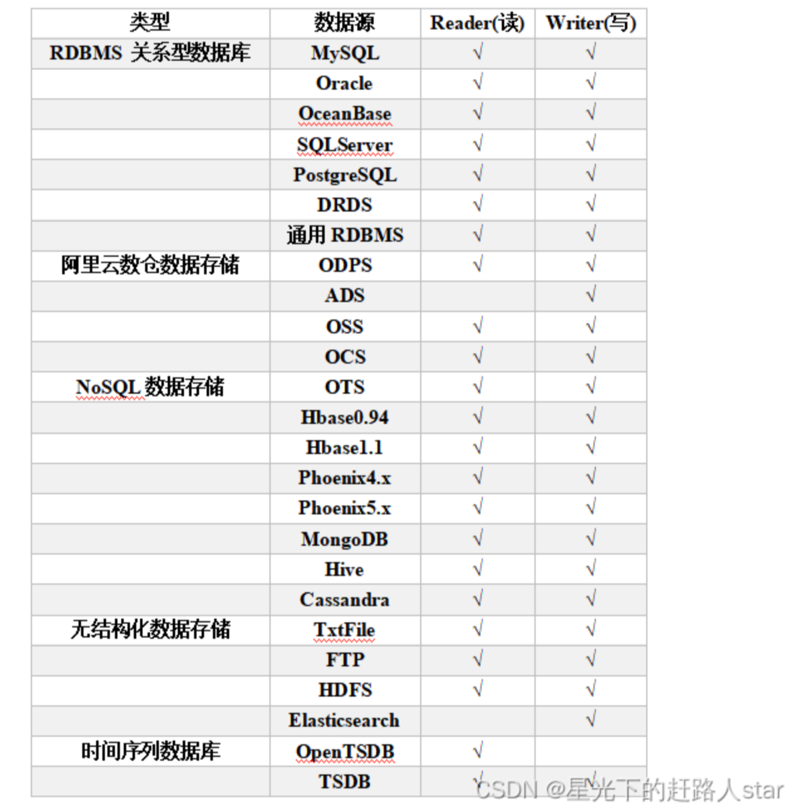
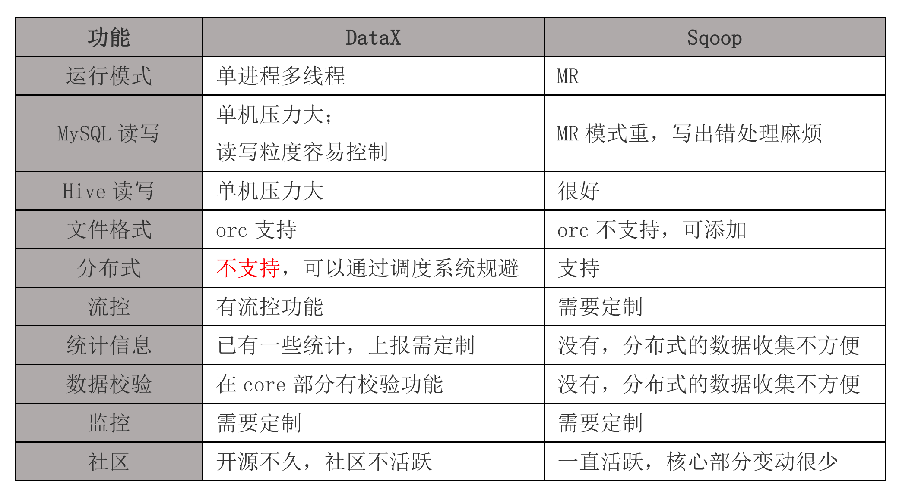
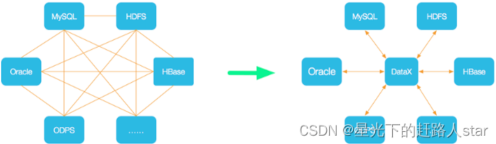
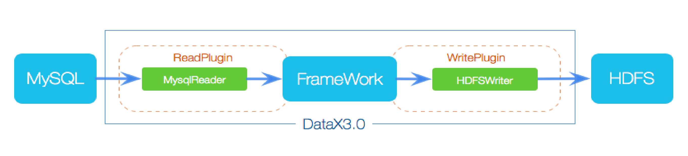
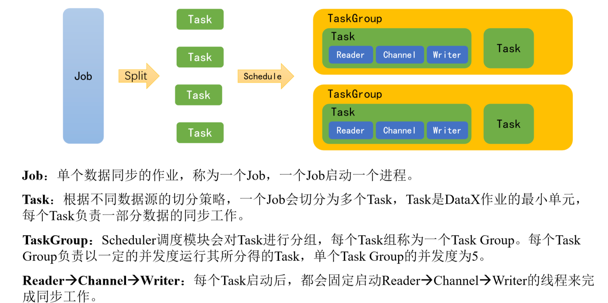
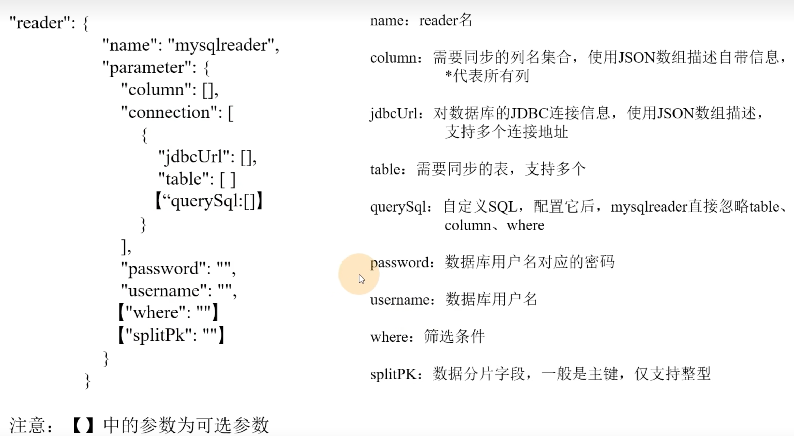
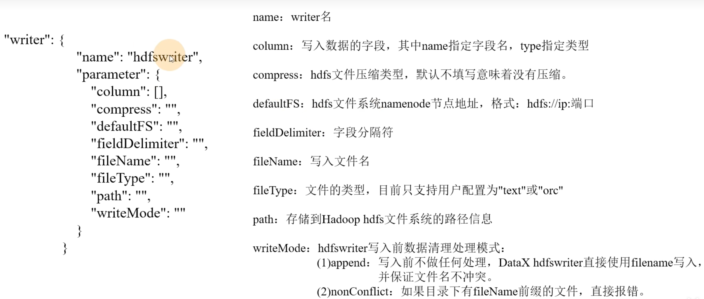

## 1、DataX 简介

### **1.1 DataX 概述**

DataX 是阿里巴巴开源的一个异构数据源离线同步工具，致力于实现包括关系型数据库(MySQL、Oracle等)、HDFS、Hive、ODPS、HBase、FTP等各种异构数据源之间稳定高效的数据同步功能。

源码地址：https://github.com/alibaba/DataX

### **1.2 DataX 支持的数据源**

DataX目前已经有了比较全面的插件体系，主流的[RDBMS](https://so.csdn.net/so/search?q=RDBMS&spm=1001.2101.3001.7020)数据库、NOSQL、大数据计算系统都已经接入，目前支持数据如下图。



### 1.3 与Sqoop 的对比




## 2、 DataX 架构原理

### 2.1 DataX 设计理念

为了解决异构数据源同步问题，DataX将复杂的网状的同步链路变成了星型数据链路，DataX作为中间传输载体负责连接各种数据源。当需要接入一个新的数据源的时候，只需要将此数据源对接到DataX，便能跟已有的数据源做到无缝数据同步



### 2.2 DataX 框架设计

DataX 本身作为离线数据同步框架，采用 Framework + plugin架构构建。将数据源读取和写入抽象成为 Reader/Writer 插件，纳入到整个同步框架中。



Reader：数据采集模块，负责采集数据源的数据，将数据发送给 Framework

Writer：数据写入模块，负责不断向 Framework 取数据，并将数据写入到目的端

Framework：用于连接Reader 和  Writer，作为两者数据传输通道，并处理缓存，流控，并发，数据转换等核心技术问题

### 2.3 DataX 运行流程

下面用一个DataX作业生命周期的时序图说明DataX的运行流程、核心概念以及每个概念之间的关系。



### 2.4 DataX 调度决策思路

举例来说，用户提交了一个DataX作业，并配置了总的并发度为20，目的是对一个有100张分表的 mysql数据源进行同步。DataX 的调度决策思路是：

1）DataX Job 根据分库分表切分策略，将同步工作分为100个 Task

2）根据配置的总并发度20，以及每个 Task Group的并发度5，DataX 计算共需要分配4个TaskGroup

3）4个 TaskGroup平分100个 Task，每个 TaskGroup 负责运行25个 Task

## 3、DataX 部署

### 3.1 环境准备

1. **系统要求**

- 操作系统：Linux（推荐 Centos 7 + /Ubuntu 16.04+），不建议在 Windows 上部署生产环境
- 硬件配置
  - 最低：2核 4G 内存，50G 磁盘空间
  - 推荐：4核 8G+，100GB+磁盘空间（根据同步数据量调整）

2. 软件依赖

- Java：JDK 1.8+（需要配置 JAVA_HOME 环境变量）

- Python：Python 2.7x 或 Pyhon 3.6+

### 3.2 下载与安装 DataX

1. 下载最新版本

```shell
# 从GitHub下载（推荐）
wget https://github.com/alibaba/DataX/archive/refs/heads/master.zip -O datax-master.zip
```

2. 解压并安装

```shell
# 解压文件
unzip datax-master.zip  # 或 tar -zxvf datax-0.0.1-incubating.tar.gz
cd DataX-master  # 进入解压目录

# 编译安装（需联网，下载依赖包）
mvn -U clean package assembly:assembly -Dmaven.test.skip=true

# 安装完成后，核心文件在target/datax目录下
mv target/datax /usr/local/  # 移动到指定目录
cd /usr/local/datax
```

### 3.3 配置 DataX （关键步骤）

1. 检查目录结构

```shell
tree /usr/local/datax -L 2  # 查看目录结构

# 核心目录说明：
bin/        # 启动脚本
conf/       # 全局配置
lib/        # 依赖库
log/        # 日志目录
plugin/     # 插件目录（reader/writer）
```

2. 配置 JVM 参数（可选）

```shell
# 修改 bin/datax.py，调整 JVM 内存参数（根据服务器内存调整）
# 找到以下行并修改：
JAVA_OPTS="${JAVA_OPTS} -Xms1g -Xmx1g"  # 默认1G，可改为 -Xms4g -Xmx4g
```

3. 配置插件（按需安装）

DataX 默认包含常用插件（如 `mysqlreader`、`mysqlwriter`），如需其他插件（如 SQL Server、Oracle），需手动安装：

```shell
# 示例：安装 SQL Server 插件
python bin/install_plugin.py reader sqlserverreader
python bin/install_plugin.py writer sqlserverwriter

# 查看已安装插件
ls -la plugin/reader/
ls -la plugin/writer/
```

### 3.4 验证安装

1. 执行自检脚本

```shell
python bin/datax.py --help  # 查看帮助信息

# 运行示例任务（本地测试）
python bin/datax.py job/http.json  # 执行内置的HTTP示例任务
```

2. 创建自定义同步任务

创建一个简单的 job.json文件示例（从 Mysql 到 本地文件）

```json
{
    "job": {
        "setting": {
            "speed": {
                "channel": 1  # 并发通道数
            }
        },
        "content": [
            {
                "reader": {
                    "name": "mysqlreader",
                    "parameter": {
                        "username": "root",
                        "password": "your_password",
                        "connection": [
                            {
                                "jdbcUrl": ["jdbc:mysql://localhost:3306/test"],
                                "table": ["user"]
                            }
                        ],
                        "querySql": ["SELECT id, name, age FROM user"]
                    }
                },
                "writer": {
                    "name": "streamwriter",
                    "parameter": {
                        "print": true
                    }
                }
            }
        ]
    }
}
```

执行任务：

```shell
python bin/datax.py job.json
```

### 3.5 高级配置 

1. **配置多数据源连接信息的**

将敏感信息（如数据库密码）存储在配置文件中，避免硬编码在任务JSON 中

```json
# 修改 conf/core.json，添加全局参数
{
    "core": {
        "transport": {
            "channel": {
                "class": "com.alibaba.datax.core.transport.channel.memory.MemoryChannel",
                "byteCapacity": "67108864",
                "recordCapacity": "1000"
            }
        },
        "job": {
            "setting": {
                "speed": {
                    "channel": "1"
                },
                "errorLimit": {
                    "record": "0",
                    "percentage": "0.02"
                }
            }
        },
        "plugin": {
            "reader": {
                "mysqlreader": {
                    "username": "root",
                    "password": "your_password"
                }
            },
            "writer": {
                "mysqlwriter": {
                    "username": "root",
                    "password": "your_password"
                }
            }
        }
    }
}
```

2. **配置日志（conf / logback.xml）**

调整日志级别和存储路径：

```xml
<appender name="FILE" class="ch.qos.logback.core.rolling.RollingFileAppender">
    <file>/var/log/datax/datax.log</file>  <!-- 修改日志存储路径 -->
    <rollingPolicy class="ch.qos.logback.core.rolling.TimeBasedRollingPolicy">
        <fileNamePattern>/var/log/datax/datax.%d{yyyy-MM-dd}.log</fileNamePattern>
        <maxHistory>30</maxHistory>  <!-- 保留30天日志 -->
    </rollingPolicy>
    <encoder>
        <pattern>%d{yyyy-MM-dd HH:mm:ss.SSS} [%thread] %-5level %logger{36} - %msg%n</pattern>
    </encoder>
</appender>
```

### 3.6 生产环境部署建议

1. 系统优化：

```shell
# 调整系统文件描述符限制（/etc/security/limits.conf）
datax hard nofile 65535
datax soft nofile 65535
```

2. 监控与告警

- 集成 Prometheus + Grafana 监控 DataX 任务状态
- 通过日志监控异常（如 OOM、任务失败）

3. 分布式部署

- 大规模同步时，可部署多台 DataX 节点，通过调度系统（如 Airflow、Azkaban）统一管理任务

### 3.7 故障排查

1. 查看日志

```shell
cat /usr/local/datax/log/launcher.log  # 查看启动日志
```

2. 常见问题

- 插件加载失败：检查插件目录权限和配置文件路径
- 网络连接问题：确保库和目标库网络可访问
- 内存溢出：调整 JVM 参数（-Xms 和 -Xmx）

## 4、DataX 使用

### 4.1 DataX 使用概况

**DataX 任务提交命令**

DataX 的使用十分简单，用户只需要根据自己同步数据的数据源和目的地选择相应的 Reader 和 Writer，并将 Reader 和 Writer 的信息配置在一个 json文件中，然后执行如下命令提交数据同步任务即可。

```shell
 python bin/datax.py path/to/your/job.json
```

**DataX 配置文件格式**

可以使用如下命令查看DataX 配置文件模板

```
python bin/datax.py -r mysqlreader -w hdfswriter
```

配置文件模板如下，json最外层是一个job，job包含setting和content两部分，其中setting用于对整个job进行配置，content用户配置数据源和目的地。

```json
{
        "job": {
        "content": [
            {
                "reader": {
                    "name": "streamreader",
                    "parameter": {
                        "column": [{
                        "type":"string",
                        "va lue":"zhangsan"
                        },
                        {          
                        "type":"int", 
                         "value":18}
                                  ],
                        "sliceRecordCount": "10  "
                    }
                },
                "writer": {
                    "name": "streamwriter",
                    "parameter": {
                        "encoding": "UTF-8",
                        "print": true
                    }
                }
            }
        ],
        "setting": {
            "speed": {
                "channel": "1"
            }
        }
    }
}
```

### 4.2 同步 MySQL 数据到 HDFS 案例

**案例要求**：同步gmall数据库中base_province表数据到HDFS的/base_province目录
**需求分析**：要实现该功能，需选用MySQLReader和HDFSWriter，MySQLReader具有两种模式分别是TableMode和QuerySQLMode，前者使用table，column，where等属性声明需要同步的数据；后者使用一条SQL查询语句声明需要同步的数据。
下面分别使用两种模式进行演示。

```json
{
    "job": {
        "content": [
            {
                "reader": {
                    "name": "mysqlreader",
                    "parameter": {
                        "column": [
                            "Findex",
                            "Fmessage_type",
                            "Fmessage_content",
                            "Fstatus",
                            "Fcreate_user",
                            "Fmodify_user",
                            "Fcreate_time",
                            "Fmodify_time",
                            "Fversion",
                            "Fjg_auto_test_id"
                        ],
                        "connection": [
                            {
                                "jdbcUrl": [
                                    "jdbc:mysql://10.9.21.107:20094/data_asset_db" 
                                ],
                                "table": [
                                    "t_message"
                                ]
                            }
                        ],
                        "password": "datasset_master",  
                        "username": "datasset_master@123",  
                        "where": ""  
                    }
                },
                "writer": {
                    "name": "hdfswriter",
                    "parameter": {
                        "column": [
                            {"name": "Findex", "type": "BIGINT"},
                            {"name": "Fmessage_type", "type": "INT"},
                            {"name": "Fmessage_content", "type": "STRING"},
                            {"name": "Fstatus", "type": "INT"},
                            {"name": "Fcreate_user", "type": "STRING"},
                            {"name": "Fmodify_user", "type": "STRING"},
                            {"name": "Fcreate_time", "type": "STRING"},
                            {"name": "Fmodify_time", "type": "STRING"},
                            {"name": "Fversion", "type": "INT"},
                            {"name": "Fjg_auto_test_id", "type": "STRING"}
                        ],
                        "compress": "",
                        "defaultFS": "hdfs://10.9.22.136:8020",
                        "fieldDelimiter": "\t",
                        "fileName": "t_message.txt",
                        "fileType": "text",
                        "path": "/test/",
                        "writeMode": "append"
                    }
                }
            }
        ],
        "setting": {
            "speed": {
                "channel": "1"
            }
        }
    }
}
```






