# Flink

## Flink 概述

### 什么是Flink

Flink 的官方主页地址：https://flink.apche.org/

Flink 核心目标，是 "数据流上的有状态计算"（Stateful Computations over Data Streams）

具体说明：Apache Flink 是一个框架和分布式处理引擎，用于对无界和有界数据流进行有状态计算

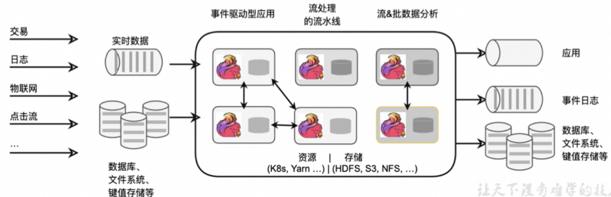

**有界流和无界流**

**1）无界数据流：**

- 有定义流的开始，但没有定义流的结束
- 它们会无休止的产生数据
- 无界流的数据必须持续处理，即数据被摄取后需要立刻处理，不能等待所有数据到达后再处理，因为输入是无限的

**2）有界数据流：**

- 有定义流的开始，也有定义流的结束
- 有界流可以在摄取所有数据后再进行计算
- 有界流所有数据可以被排序，所以并不需要有序摄取
- 有界流处理通常被称为批处理

**有状态的流处理**

把流处理需要的额外数据保存成一个 "状态"，然后针对这条数据进行处理，并且更新状态。这就是所谓的 "有状态的流处理"

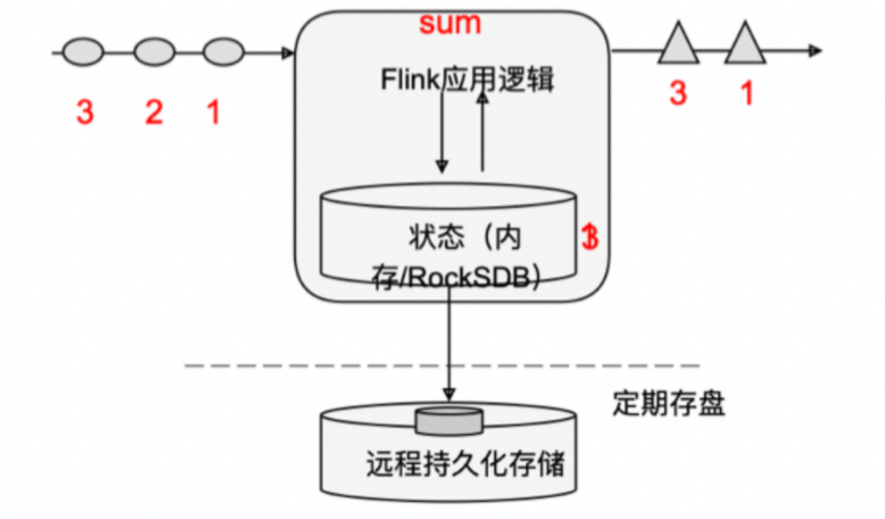

- 状态在内存中：速度快，但是可靠性差
- 状态在分布式系统中：可靠性高，速度慢

### Flink特点

处理数据的目标是：低延迟、高吞吐、结果的准确性和良好的容错性

Flink 主要特点如下：

- 高吞吐和低延迟：每秒处理数百万个事件，毫秒级延迟
- 顺序性：Flink 提供了事件时间（event-time）和处理时间（process-time）语义。对于乱序事件流，事件时间语义仍然能提供一致且准确的结果
- 精确性：状态一致性保证
- 适用性：可以连接到最常用的外部系统，如 Kafka、Hive、JDBC、Redis
- 高可用：本身高可用的设置，加上与K8s，Yarn 和 Mesos 的紧密集成，再加上故障中快速恢复和动态扩展任务的能力

### Flink vs SparkStreaming

Spark 以批处理为根本：

- Spark数据模型：Spark 采用 RDD 模型，Spark Streaming 的 DStream 实际上也就是一组组小批数据 RDD 的集合
- Spark运行时架构：Spark 是批处理，将 DAG 划分为不同的stage，一个完成才可以计算下一个


Flink 以流处理为根本：

- Flink数据模型：Flink 基本数据模型是数据流，以及事件（Event）序列
- Flink运行时架构：Flink 是标准的流执行模式，一个事件在一个节点处理完后可以直接发往下一个节点进行处理

|          | Flink              | Streaming                            |
| -------- | ------------------ | ------------------------------------ |
| 计算模型 | 流计算             | 微批处理                             |
| 时间语义 | 事件时间、处理时间 | 处理时间                             |
| 窗口     | 多、灵活           | 少、不灵活（窗口必须是批次的整数倍） |
| 状态     | 有                 | 没有                                 |
| 流式SQL  | 有                 | 没有                                 |

### Flink 分层 API

- 越顶层越抽象，表达含义越简明，使用越方便
- 越底层越具体，表达能力越丰富，使用越灵活


**有状态流处理**：通过底层 API （处理函数），对原始数据加工处理。底层 API 与 DataStream API 相集成，可以处理负责的计算

**DataStream API（流处理）和 DataSet API（批处理**）：封装了底层处理函数，提供了通用的模块，比如转换（transformations，包括map、flatmap 等）

**Table API**：以表为中心的声明式编程，其中表可能动态变化的。Table API遵循关系模型：表有二维数据结构，类似于关系数据库中表；同时 API提供可比较的操作，例如select、project、join、group-by、aggregate 等

**SQL**：这一层在语法和表达能力上与 Table API 类似，但是以SQL 查询表达式的形式表现程序。SQL 抽象与 Table API交互密切，同时SQL 查询可以直接在Table API定义的表上执行


## Flink 快速上手

### Flink MVN依赖

```xml
<properties>
        <flink.version>1.17.0</flink.version>
</properties>


    <dependencies>
        <dependency>
            <groupId>org.apache.flink</groupId>
            <artifactId>flink-streaming-java</artifactId>
            <version>${flink.version}</version>
        </dependency>

     <dependency>
            <groupId>org.apache.flink</groupId>
            <artifactId>flink-clients</artifactId>
            <version>${flink.version}</version>
     </dependency>
</dependencies>
```

### 批处理

**批处理的基本思路**：先逐行读取文件数据，然后将每一行文字拆分为单词；接着按照单词分组，统计每组数据的个数，就是对应单词的频次

```java
import org.apache.flink.api.common.typeinfo.Types;
import org.apache.flink.api.java.ExecutionEnvironment;
import org.apache.flink.api.java.operators.AggregateOperator;
import org.apache.flink.api.java.operators.DataSource;
import org.apache.flink.api.java.operators.FlatMapOperator;
import org.apache.flink.api.java.operators.UnsortedGrouping;
import org.apache.flink.api.java.tuple.Tuple2;
import org.apache.flink.util.Collector;

public class BatchWordCount {

    public static void main(String[] args) throws Exception {

        // 1. 创建执行环境
        ExecutionEnvironment env = ExecutionEnvironment.getExecutionEnvironment();
        
        // 2. 从文件读取数据  按行读取(存储的元素就是每行的文本)
        DataSource<String> lineDS = env.readTextFile("input/words.txt");
        
        // 3. 转换数据格式
        FlatMapOperator<String, Tuple2<String, Long>> wordAndOne = lineDS.flatMap(new FlatMapFunction<String, Tuple2<String, Long>>() {

            @Override
            public void flatMap(String line, Collector<Tuple2<String, Long>> out) throws Exception {

                String[] words = line.split(" ");

                for (String word : words) {
                    out.collect(Tuple2.of(word,1L));
                }
            }
        });

        // 4. 按照 word 进行分组
        UnsortedGrouping<Tuple2<String, Long>> wordAndOneUG = wordAndOne.groupBy(0);
        
        // 5. 分组内聚合统计
        AggregateOperator<Tuple2<String, Long>> sum = wordAndOneUG.sum(1);

        // 6. 打印结果
        sum.print();
    }
}
```

### 流处理

**流处理的基本思路**：对于Flink而言，流才是整个处理逻辑的底层核心，所以流批统一之后的DataStream API更加强大，可以直接处理批处理和流处理的所有场景。

``` java
import org.apache.flink.api.common.typeinfo.Types;
import org.apache.flink.api.java.tuple.Tuple2;
import org.apache.flink.streaming.api.datastream.DataStreamSource;
import org.apache.flink.streaming.api.datastream.SingleOutputStreamOperator;
import org.apache.flink.streaming.api.environment.StreamExecutionEnvironment;
import org.apache.flink.util.Collector;

import java.util.Arrays;

public class StreamWordCount {

    public static void main(String[] args) throws Exception {
    
        // 1. 创建流式执行环境
        StreamExecutionEnvironment env = StreamExecutionEnvironment.getExecutionEnvironment();
        
        // 2. 读取文件
        DataStreamSource<String> lineStream = env.readTextFile("input/words.txt");
        
        // 3. 转换、分组、求和，得到统计结果
        SingleOutputStreamOperator<Tuple2<String, Long>> sum = lineStream.flatMap(new FlatMapFunction<String, Tuple2<String, Long>>() {
            @Override
            public void flatMap(String line, Collector<Tuple2<String, Long>> out) throws Exception {

                String[] words = line.split(" ");

                for (String word : words) {
                    out.collect(Tuple2.of(word, 1L));
                }
            }
        }).keyBy(data -> data.f0)
           .sum(1);

        // 4. 打印
        sum.print();
        
        // 5. 执行
        env.execute();
    }
}
```

与批处理的不同：

- 创建执行环境的不同，流处理程序使用的是 StreamExecutionEnvironment
- 转换处理之后得到的数据对象类型不同
- 分组操作调用的是 keyBy 非方法，可以传入一个匿名函数作为键选择器（KeySelector），指定当前分组的 key 是什么
- 代码末尾需要调用 env 的 execute 方法，开始执行任务


**读取 Socket 文本流**

在实际的生产环境中，真正的数据流其实是无界的，有开始却没结束，这就要求我们需要持续地捕获的数据。为了模拟这种场景，可以监控 Socket 端口，然后不断向该端口发送数据

```java
import org.apache.flink.api.common.typeinfo.Types;
import org.apache.flink.api.java.tuple.Tuple2;
import org.apache.flink.streaming.api.datastream.DataStreamSource;
import org.apache.flink.streaming.api.datastream.SingleOutputStreamOperator;
import org.apache.flink.streaming.api.environment.StreamExecutionEnvironment;
import org.apache.flink.util.Collector;

import java.util.Arrays;

public class SocketStreamWordCount {

    public static void main(String[] args) throws Exception {

        // 1. 创建流式执行环境
        StreamExecutionEnvironment env = StreamExecutionEnvironment.getExecutionEnvironment();
        
        // 2. 读取文本流：hadoop102表示发送端主机名、7777表示端口号
        DataStreamSource<String> lineStream = env.socketTextStream("hadoop102", 7777);
        
        // 3. 转换、分组、求和，得到统计结果
        SingleOutputStreamOperator<Tuple2<String, Long>> sum = lineStream.flatMap((String line, Collector<Tuple2<String, Long>> out) -> {
            String[] words = line.split(" ");

            for (String word : words) {
                out.collect(Tuple2.of(word, 1L));
            }
        }).returns(Types.TUPLE(Types.STRING, Types.LONG))
                .keyBy(data -> data.f0)
                .sum(1);

        // 4. 打印
        sum.print();
        
        // 5. 执行
        env.execute();
    }
}
```

**1**、在 Linux 环境的主机上，执行下列命令，发送数据并进行测试

```shell
nc -lk 7777
```

`nc -lk 7777` 是使用 `netcat`（简称 `nc`）工具的一个命令，用于创建一个**持续监听指定端口的 TCP 服务**，具体含义如下：

**各参数解析：**

- **`nc`**：netcat 的缩写，是一款功能强大的网络工具，可用于建立 TCP/UDP 连接、传输数据、端口扫描等。
- **`-l`**：表示进入**监听模式**（Listening mode），即作为服务器端等待客户端连接，而非主动发起连接。
- **`-k`**：表示在**连接断开后保持监听**（Keep listening），默认情况下，`nc -l` 在一个连接结束后会退出监听，加上 `-k` 可持续接收新的连接。
- **`7777`**：指定监听的**端口号**（此处为 7777），客户端需通过该端口连接到当前服务。

**功能与用法：**

该命令会在当前机器的 7777 端口启动一个 TCP 监听服务，可用于：

1. **接收数据**：其他客户端（如另一台机器的 `nc` 或程序）可通过 `nc <服务器IP> 7777` 连接到此端口，并发送数据，当前终端会实时显示接收的内容。
2. **简单通信**：支持双向通信，当前终端输入的内容会发送给已连接的客户端。

**示例：**

1. 在服务器 A 执行 `nc -lk 7777`，启动监听。
2. 在客户端 B 执行 `nc 服务器A的IP 7777`，连接到服务器。
3. 此时在客户端 B 输入文字，服务器 A 的终端会显示；在服务器 A 输入文字，客户端 B 也会显示，实现简单的 TCP 通信。

**2**、启动程序启动之后没有任何输出、也不会退出。这是正常的，因为Flink的流处理是事件驱动的，当前程序会一直处于监听状态，只有接收到数据才会执行任务、输出统计结果。

**3**、从 Linux 环境的主机上发送消息


## Flink 部署

### 集群角色

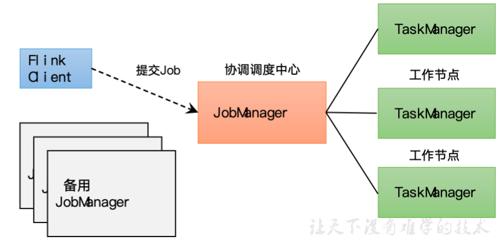

**Client：**代码由客户端获取并做转换，之后提交给JobManager

**JobManager：**就是 Flink 集群里的 "管事人"，对作业进行中央调度管理；而它获取到要执行的作业后，会进一步处理转换，然后分发任务给众多 TaskManager

**TaskManager：**就是真正 "干活的人"，数据的处理操作都是由他们来做

**注意：** Flink 是一个非常灵活的处理框架，它支持多种不同的部署场景，还可以和不同的资源管理平台方便地集成

### Flink集群搭建

**集群配置（JobManager）**

flink-conf.yaml

```yaml
# JobManager节点地址.
jobmanager.rpc.address: hadoop102
jobmanager.bind-host: 0.0.0.0
rest.address: hadoop102
rest.bind-address: 0.0.0.0
# TaskManager节点地址.需要配置为当前机器名
taskmanager.bind-host: 0.0.0.0
taskmanager.host: hadoop102
```

workers

``` 
hadoop102
hadoop103
hadoop104
```

masters

```
hadoop102:8081
```

flink-conf.yaml 文件的其他配置： 

- jobmanager.memory.process.size：对JobManager进程可使用到的全部内存进行配置，包括JVM元空间和其他开销，默认为1600M，可以根据集群规模进行适当调整。

-  taskmanager.memory.process.size：对TaskManager进程可使用到的全部内存进行配置，包括JVM元空间和其他开销，默认为1728M，可以根据集群规模进行适当调整。

-  taskmanager.numberOfTaskSlots：对每个TaskManager能够分配的Slot数量进行配置，默认为1，可根据TaskManager所在的机器能够提供给Flink的CPU数量决定。所谓Slot就是TaskManager中具体运行一个任务所分配的计算资源。

- parallelism.default：Flink任务执行的并行度，默认为1。优先级低于代码中进行的并行度配置和任务提交时使用参数指定的并行度数量。

**集群配置（taskmanager）**

flink-conf.yaml

```yaml
# TaskManager节点地址.需要配置为当前机器名
taskmanager.host: hadoop103
```

### 提交作业

**1）环境准备**

在 hadoop102 中执行命令启动 netcat

```shell
[atguigu@hadoop102 flink-1.17.0]$ nc -lk 7777
```

**2）程序打包**

```xml
<build>
    <plugins>
        <plugin>
            <groupId>org.apache.maven.plugins</groupId>
            <artifactId>maven-shade-plugin</artifactId>
            <version>3.2.4</version>
            <executions>
                <execution>
                    <phase>package</phase>
                    <goals>
                        <goal>shade</goal>
                    </goals>
                    <configuration>
                        <artifactSet>
                            <excludes>
                                <exclude>com.google.code.findbugs:jsr305</exclude>
                                <exclude>org.slf4j:*</exclude>
                                <exclude>log4j:*</exclude>
                            </excludes>
                        </artifactSet>
                        <filters>
                            <filter>
                                <!-- Do not copy the signatures in the META-INF folder.
                                Otherwise, this might cause SecurityExceptions when using the JAR. -->
                                <artifact>*:*</artifact>
                                <excludes>
                                    <exclude>META-INF/*.SF</exclude>
                                    <exclude>META-INF/*.DSA</exclude>
                                    <exclude>META-INF/*.RSA</exclude>
                                </excludes>
                            </filter>
                        </filters>
                        <transformers combine.children="append">
                            <transformer
                                    implementation="org.apache.maven.plugins.shade.resource.ServicesResourceTransformer">
                            </transformer>
                        </transformers>
                    </configuration>
                </execution>
            </executions>
        </plugin>
    </plugins>
</build>
```

**3）在 Web UI 上提交作业**

（1）任务打包完成后，我们打开Flink的WEB UI页面，在右侧导航栏点击“Submit New Job”，然后点击按钮“+ Add New”，选择要上传运行的JAR包，如下图所示。

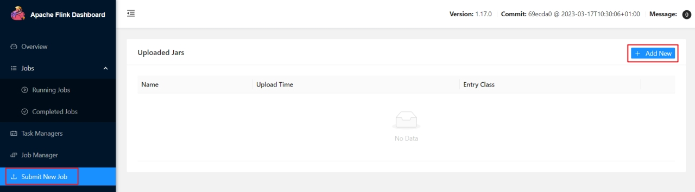

JAR包上传完成，如下图所示：

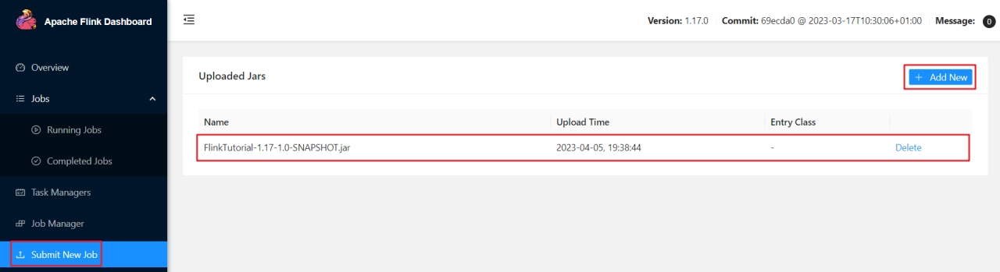

（2）点击该JAR包，出现任务配置页面，进行相应配置。

主要配置程序入口主类的全类名，任务运行的并行度，任务运行所需的配置参数和保存点路径等，如下图所示，配置完成后，即可点击按钮“Submit”，将任务提交到集群运行。

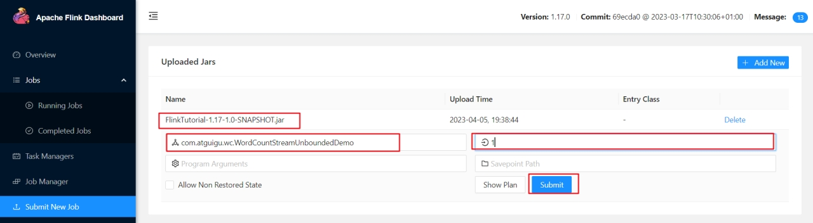 

（3）任务提交成功之后，可点击左侧导航栏的“Running Jobs”查看程序运行列表情况。

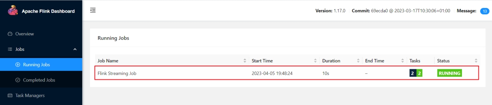 

（4）测试

​	①在socket端口中输入hello

``` shell
[atguigu@hadoop102 flink-1.17.0]$ nc -lk 7777

hello
```

②先点击Task Manager，然后点击右侧的192.168.10.104服务器节点

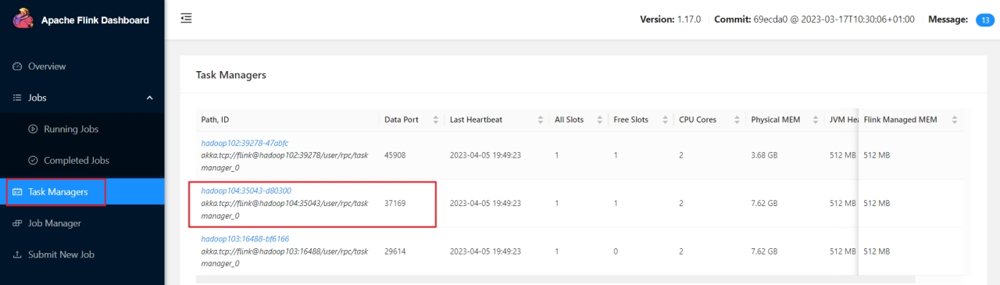 

​	③点击Stdout，就可以看到hello单词的统计

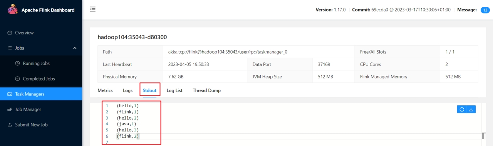 

​	注意：如果hadoop104节点没有统计单词数据，可以去其他TaskManager节点查看。

（4）点击该任务，可以查看任务运行的具体情况，也可以通过点击“Cancel Job”结束任务运行。

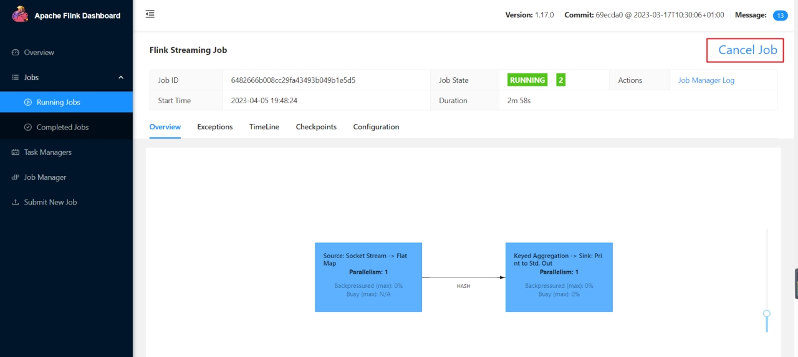 

**4）命令行提交作业**

除了通过WEB UI界面提交任务之外，也可以直接通过命令行来提交任务。这里为方便起见，我们可以先把jar包直接上传到目录flink-1.17.0下

（1）首先需要启动集群。

```shell
[atguigu@hadoop102 flink-1.17.0]$ bin/start-cluster.sh
```

（2）在hadoop102中执行以下命令启动netcat。

``` shell
[atguigu@hadoop102 flink-1.17.0]$ nc -lk 7777
```

（3）将flink程序运行jar包上传到/opt/module/flink-1.17.0路径。

（4）进入到flink的安装路径下，在命令行使用flink run命令提交作业。

```shell
[atguigu@hadoop102 flink-1.17.0]$ bin/flink run -m hadoop102:8081 -c com.atguigu.wc.SocketStreamWordCount ./FlinkTutorial-1.0-SNAPSHOT.jar
```

这里的参数 -m指定了提交到的JobManager，-c指定了入口类。

（5）在浏览器中打开Web UI，[http://hadoop102:8081查看应用执行情况](http://hadoop102:8081查看应用执行情况，)。

用netcat输入数据，可以在TaskManager的标准输出（Stdout）看到对应的统计结果。

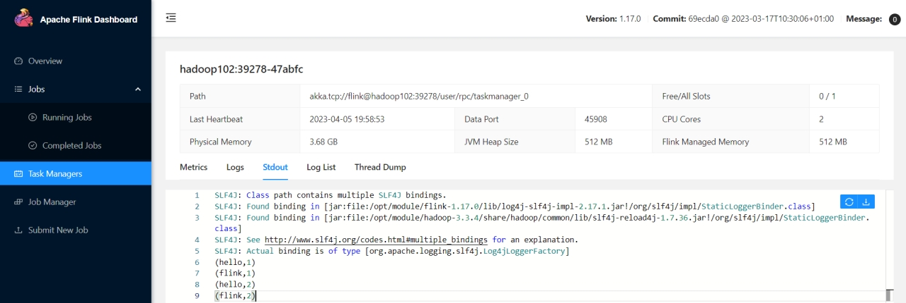 

（6）在/opt/module/flink-1.17.0/log路径中，可以查看TaskManager节点。

```shell
[atguigu@hadoop102 log]$ cat flink-atguigu-standalonesession-0-hadoop102.out
(hello,1)
(hello,2)
(flink,1)
(hello,3)
(scala,1)
```

### 部署模式

​	在一些应用场景中，对于集群资源分配和占用的方式，可能会有特定的需求。 Flink 为各种场景提供了不同的部署模式，主要分为以下三种：**会话模式**（Sesssion Mode）、**单作业模式**（Per-Job Mode）、**应用模式**（Application Mode）

​	主要区别主要在于：集群的生命周期以及资源的分配方式，以及应用的 main 方法到底在哪里执行---客户端（Client）还是 JobManager


**会话模式**

​	会话模式其实最符合常规思维。首先启动一个集群，保持一个会话，在这个会话中通过客户端的提交作业。集群启动时所有资源就都已经确定，所以所有提交的作业会竞争集群中的资源

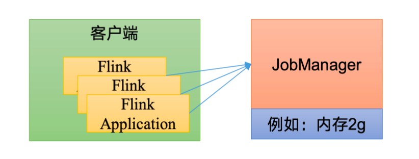

会话模式比较适合单个规模小，执行时间短的大量作业


**单作业模式**

​	模式会因为资源共享导致很多问题，所以为了更好隔离资源，可以考虑每个作业启动一个集群，这就是所谓的单作业模式

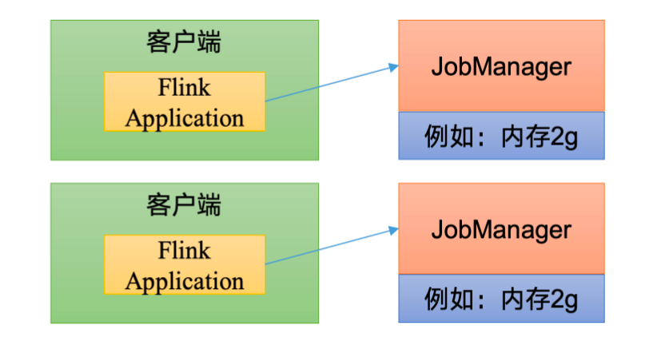

- 作业完成之后，集群就会关闭，所有资源也会释放

- 这些特性使得单作业模式在生产环境运行更加稳定，所以实际应用的首选模式
- 需要注意的是，Flink 无法直接这样运行，所以单作业模式通常借助一些资源管理框架来启动集群如 Yarn等


**应用模式**

​	前面提到的两种模式下，应用代码都在客户端执行的，然后由客户端提交给JobManager 的。但是这种方式客户端需要占用大量网络贷款，去下载依赖和把二进制数据发送给 JobManger，加上很多情况在我们提交作业用的是同一个客户端，就会加重客户端所在节点的资源消耗


### Yarn 运行模式

 Yarn上部署的过程是：客户端把 Flink 应用提交给 Yarn 的 `ResourceManger`，Yarn 的 `ResourceManager` 会向 Yarn 的 `NodeManager` 申请容器。在这些容器上， Flink 会部署 `JobManager`和 `TaskManager` 的实例。从而启动集群。Flink 会根据在 JobManager 上作业所需要 slot 数量冬天分配 `TaskManager` 资源


**相关配置**

需增加以下环境变量

```shell
export PATH=$PATH:$HADOOP_HOME/bin:$HADOOP_HOME/sbin
export HADOOP_CONF_DIR=${HADOOP_HOME}/etc/hadoop
export HADOOP_CLASSPATH=`hadoop classpath`
```


**核心角色**

- **Flink Client**：Flink 客户端，负责提交作业、与 YARN 交互；
- **YARN RM**：YARN ResourceManager，负责集群资源调度（分配 CPU / 内存）；
- **YARN NM**：YARN NodeManager，负责在节点上启动进程（JM/TM）；
- **Flink JM**：Flink JobManager（YARN 中扮演 **AppMaster** 角色），负责作业调度、TM 管理；
- **Flink TM**：Flink TaskManager，负责执行具体的计算任务；
- **HDFS**：分布式文件系统，存储 Flink JAR 包、依赖和作业配置。

**参数配置**

参数解读

- **-d**：后台运行
- **-jm**：配置 JobManager 所需内存，默认为 MB
- **-nm**：配置在 Yarn UI 界面显示的任务名
- **-qu**：指定 Yarn 队列名
- **-tm**：配置每个 TaskManager 所使用内存
- **-t**：指定作业的部署目标
- **-D**：用于设置Flink 的配置参数
- **-c**：作业的入口主类


**会话模式**

- **核心特点**：先启动一个 "共享 Flink 集群"（JM + 一组 TM），后续所有作业都提交到该集群，集群可复用直到手动关闭
- **适用场景**：小作业、短作业、追求集群资源复用

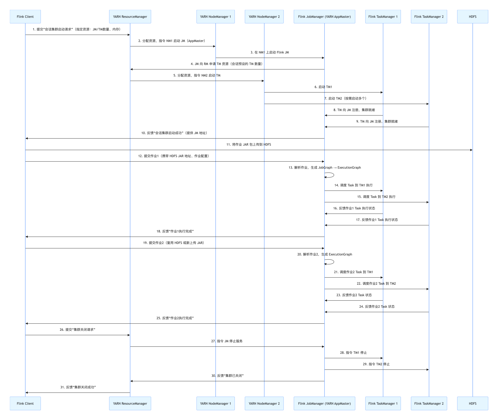

- **集群部署：**

​	（1）启动 Hadoop 集群（HDFS、YARN）

​	（2）执行脚本命令向 Yarn 集群申请资源，开启一个 Yarn 会话，启动 Flink 集群

```shell
[atguigu@hadoop102 flink-1.17.0]$ bin/yarn-session.sh -nm test
```

**注意**：Flink1.11.0版本不再使用-n参数和-s参数分别指定TaskManager数量和slot数量，YARN会按照需求动态分配TaskManager和slot。所以从这个意义上讲，YARN的会话模式也不会把集群资源固定，同样是动态分配的。


**单作业模式**

- **核心特点**：为每个作业单独启动一个专属的 Flink 集群（JM + 专属 TM），作业执行完之后集群自动销毁，资源释放
- **适用场景**：大作业、长作业、追求资源隔离（避免作业间干扰）

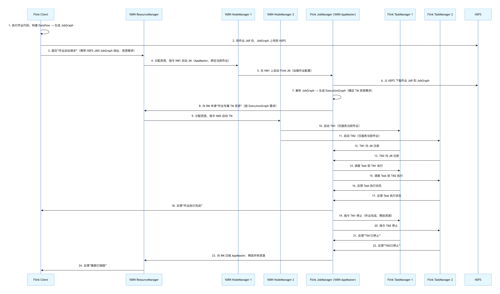

- **集群部署：**

​	在 YARN 环境中，由于有了外部平台做资源调度，所以我们也可以直接向 YARN 提交一个单独的作业，从而启动一个 Flink 集群

（1）执行命令提交作业

```shell
[atguigu@hadoop102 flink-1.17.0]$ bin/flink run -d -t yarn-per-job -c com.atguigu.wc.SocketStreamWordCount FlinkTutorial-1.0-SNAPSHOT.jar
```

（2）在 YARN 的ResourceManager 界面查看执行情况

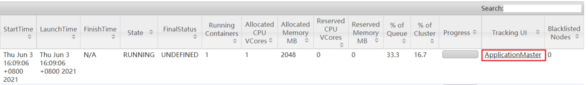

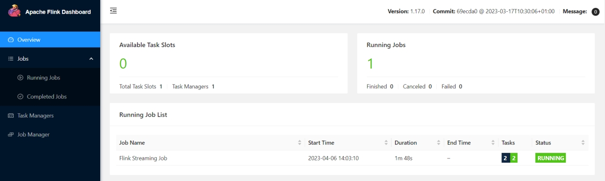

（3）可以使用命令行查看或取消作业，命令如下

```shell
[atguigu@hadoop102 flink-1.17.0]$ bin/flink list -t yarn-per-job -Dyarn.application.id=application_XXXX_YY

[atguigu@hadoop102 flink-1.17.0]$ bin/flink cancel -t yarn-per-job -Dyarn.application.id=application_XXXX_YY <jobId>
```


**应用模式**

- **核心特点**：客户端仅提交 "应用入口类"和依赖地址，作业代码在 JM 上执行（而非客户端），集群为应用专属，执行完成后自动销毁
- **适用场景**：生产环境大规模应用， 减少客户端压力

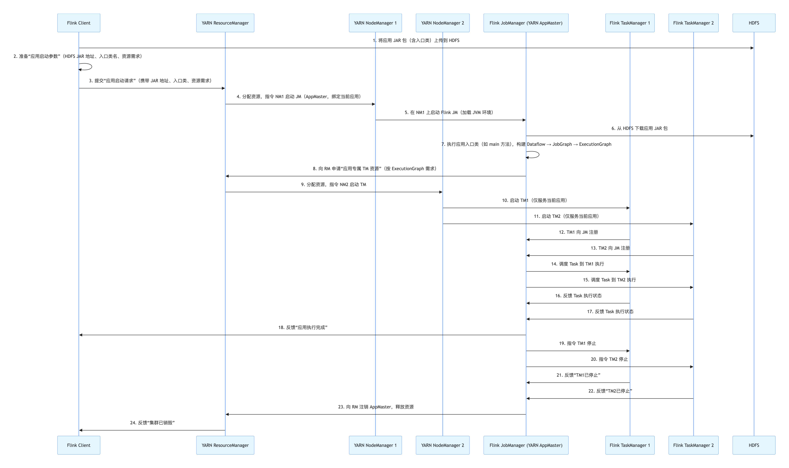

- **集群部署：**

**1）命令行提交**

（1）执行命令提交作业

```shell
[atguigu@hadoop102 flink-1.17.0]$ bin/flink run-application -t yarn-application -c com.atguigu.wc.SocketStreamWordCount FlinkTutorial-1.0-SNAPSHOT.jar 
```

（2）在命令行中查看或取消作业

```shell
[atguigu@hadoop102 flink-1.17.0]$ bin/flink list -t yarn-application -Dyarn.application.id=application_XXXX_YY

[atguigu@hadoop102 flink-1.17.0]$ bin/flink cancel -t yarn-application -Dyarn.application.id=application_XXXX_YY <jobId>
```

**2）上传 HDFS 提交**

​	可以通过 yarn.provided.lib.dirs 配置选项指定位置，将 flink 的依赖上传到远程

（1）上传 flink 的 lib 和 plugins 到 HDFS 上

```shell
[atguigu@hadoop102 flink-1.17.0]$ hadoop fs -mkdir /flink-dist
[atguigu@hadoop102 flink-1.17.0]$ hadoop fs -put lib/ /flink-dist
[atguigu@hadoop102 flink-1.17.0]$ hadoop fs -put plugins/ /flink-dist
```

（2）上传自己的 jar包 到HDFS 

```shell
[atguigu@hadoop102 flink-1.17.0]$ hadoop fs -mkdir /flink-jars
[atguigu@hadoop102 flink-1.17.0]$ hadoop fs -put FlinkTutorial-1.0-SNAPSHOT.jar /flink-jars
```

（3）提交作业

```shell
[atguigu@hadoop102 flink-1.17.0]$ bin/flink run-application -t yarn-application	-Dyarn.provided.lib.dirs="hdfs://hadoop102:8020/flink-dist"	-c com.atguigu.wc.SocketStreamWordCount  hdfs://hadoop102:8020/flink-jars/FlinkTutorial-1.0-SNAPSHOT.jar
```


### 三种模式对比

| 对比维度       | 会话模式（Session）         | 单作业模式（Per-Job）      | 应用模式（Application）       |
| -------------- | --------------------------- | -------------------------- | ----------------------------- |
| 集群生命周期   | 手动启动 / 关闭，多作业复用 | 作业绑定，作业完自动销毁   | 应用绑定，应用完自动销毁      |
| 作业图构建位置 | 客户端                      | 客户端                     | **JM（AppMaster）**           |
| 客户端角色     | 提交作业 + 启动集群         | 预处理（构建作业图）+ 提交 | 仅提交入口 + 依赖地址（轻量） |
| 资源隔离性     | 差（多作业共享 TM）         | 好（作业专属集群）         | 好（应用专属集群）            |
| 适用场景       | 小作业、短作业、调试        | 大作业、长作业、生产隔离   | 大规模应用、生产优化          |
| 网络带宽消耗   | 低（仅传作业配置）          | 中（传作业图 + JAR）       | 低（仅传入口地址）            |


### 历史服务器

**1）创建存储目录**

```shell
hadoop fs -mkdir -p /logs/flink-job
```

**2）在flink-config.yaml 中添加配置**

```shell
jobmanager.archive.fs.dir: hdfs://hadoop102:8020/logs/flink-job
historyserver.web.address: hadoop102
historyserver.web.port: 8082
historyserver.archive.fs.dir: hdfs://hadoop102:8020/logs/flink-job
historyserver.archive.fs.refresh-interval: 5000
```

**3）启动历史服务器**

```shell
bin/historyserver.sh start
```

**4）停止历史服务器**

```shell
bin/historyserver.sh stop
```


## Flink 运行时架构

### 系统架构

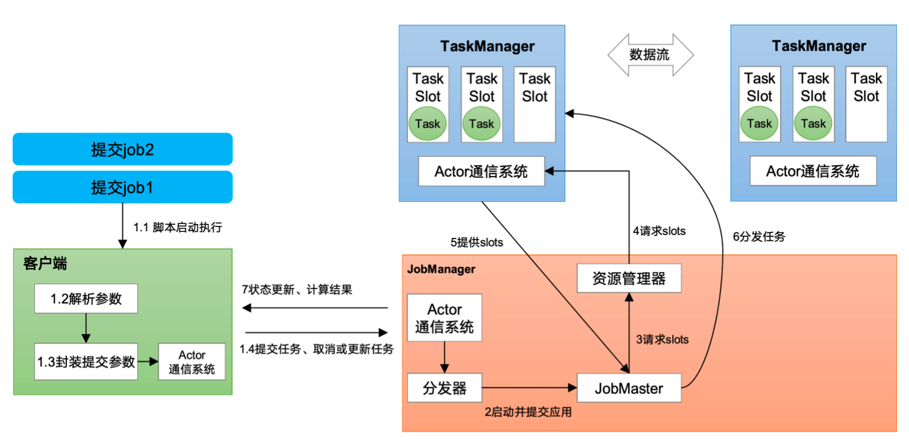

**1）作业管理器（JobManager）**

​	JobManager 是一个 Flink 集群中任务管理和调度的核心，是控制应用执行的主进程、也就是说每个应用都应该被唯一的 JobManager 所控制执行

​	**（1）JobMaster**

​	JobMaster 是 JobManager 中最核心的组件，负责处理单独的（Job），所以 JobMaster 和具体的 Job 是一一对应的，多个 Job 可以同时运行在同一个 Flink 集群中，每个 Job 都有一个自己的 JobMaster。需要注意在早期版本的 Flink中，没有 JobMaster 的概念；而 Job 都有自己的一个 JobMaster。

​	在作业提交时，JobMaster 会先接收到要执行的应用。JobMaster 会把 JobGraph 转换成一个物理层面的数据流图。这个图被叫做 "执行图"，它包含了所有可以并发执行的任务。JobMaster 会向资源管理器（ResourceManager）发出请求，申请执行任务必要的资源，一旦获取到了足够的资源，就将执行图分发到真正运行它们的 TaskManager

​	**（2）资源管理器（ResourceManager）**

​		ResourceManager 主要负责资源的分配和管理，在 Flink集群中只有一个。所谓 "资源" 主要是指 TaskManager 的任务槽（task slots）。任务槽就是 Flink 集群中的资源调配单元，包含了机器用来执行计算的一组 CPU和内存资源。每个任务都需要分配到一个 slot上执行

​	**（3）分发器（Dispatcher）**

​	Dispatcher 主要负责提供一个 Rest 接口，用来提交，并且负责为每一个新提交的作业启动一个新的 JobMaster 组件

**2）任务管理器（TaskManager）**

​	TaskManager 是 Flink 中的工作进程，数据流的具体计算就是它来做的。Flink 集群中必须至少有一个的 TaskManager；每一个 TaskManager都包含了一定数量的任务槽（task slot），Slot 是 资源调度的最小单位，slot限制了 TaskManager 能够并行处理的任务数量。

​	启动之后，TaskManager 会向资源管理器注册它的 slot；收到资源管理器的指令后，TaskManager 将会将一个或多个槽提供给 JobMaster 调用

