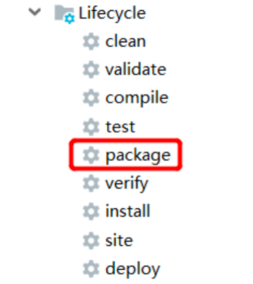

# FlinkCDC

## FlinkCDC 介绍

### FlinkCDC 简介

​	FlinkCDC（Flink Change Data Capture）是一个用于实时捕获数据库变更日志的工具，它可以将数据库（如 Mysql，PostgreSQL，MariaDB 等）的变更实时同步到 Apache Flink系统中

### FlinkCDC 发展史

- 1.x 提供 DataStream 以及 FlinkSQL 方式实现数据动态获取
- 2.x 丰富对接的数据库以及增加全量同步锁表问题的解决方案
- 3.x 提供StreamingETL 方式导入数据方案

### DataStream 和 Flink SQL 

在 Apache Flink 中，**DataStream API** 和 **Flink SQL** 是处理流数据的两种核心方式，分别面向不同的开发场景和用户需求。两者的核心目标都是实现流数据的实时处理，但在编程模型、灵活性、使用门槛等方面有显著区别。

**1. 核心定位与设计目标**

- **DataStream API**
  Flink 的**低级（Low-Level）流处理 API**，基于 Java/Scala 等编程语言，提供细粒度的流处理控制能力。
  设计目标：满足复杂业务逻辑需求，支持自定义状态管理、事件时间处理、窗口计算等底层操作，适合需要深度定制流处理逻辑的场景。
- **Flink SQL**
  Flink 的**高级（High-Level）声明式 API**，基于 SQL 语法，将流数据抽象为 “动态表（Dynamic Table）”，通过 SQL 语句实现数据处理。
  设计目标：降低流处理门槛，让熟悉 SQL 的用户（如数据分析师、业务开发者）无需了解 Flink 底层原理即可实现流处理，同时自动优化执行逻辑。

**2. 核心区别对比**

| 维度             | DataStream API                                               | Flink SQL                                                    |
| ---------------- | ------------------------------------------------------------ | ------------------------------------------------------------ |
| **编程模型**     | 命令式（Imperative）：通过调用算子（`map`、`keyBy`、`window` 等）定义 “如何做”，需要手动描述处理步骤。 | 声明式（Declarative）：通过 SQL 语句定义 “做什么”，只需描述目标结果，无需关心底层执行细节。 |
| **使用门槛**     | 较高：需要熟悉 Flink 底层概念（如状态、水印、检查点），以及 Java/Scala 编程。 | 较低：只需掌握 SQL 语法，适合非开发人员（如分析师）快速上手。 |
| **灵活性**       | 极高：支持自定义状态（`ValueState`、`ListState`）、事件时间提取、复杂窗口（滑动 / 会话窗口）、自定义序列化等，可处理任意复杂逻辑。 | 中等：受限于 SQL 语法，复杂逻辑（如多层嵌套状态、自定义窗口触发机制）难以实现，需依赖 UDF（用户自定义函数）扩展。 |
| **状态管理**     | 显式管理：需手动定义状态类型、生命周期（如过期时间）、状态后端（如 RocksDB），支持细粒度控制。 | 自动管理：Flink 内部自动维护状态（如聚合结果、Join 缓存），用户无需关心状态存储和更新细节。 |
| **时间特性处理** | 手动配置：需显式指定时间特性（事件时间 / 处理时间），通过 `assignTimestampsAndWatermarks` 定义水印（Watermark）生成逻辑。 | 自动处理：通过 DDL 声明时间属性（如 `WATERMARK FOR rowtime AS rowtime - INTERVAL '5' SECOND`），简化水印和事件时间配置。 |
| **优化能力**     | 依赖开发者：需手动优化执行逻辑（如调整并行度、状态后端、算子链），无自动优化。 | 自动优化：Flink SQL 优化器会自动生成最优执行计划（如谓词下推、算子合并、Join 重排序），提升执行效率。 |
| **适用场景**     | 复杂业务逻辑（如实时风控、动态规则引擎）、自定义状态计算、非标准数据格式处理。 | 简单 / 标准化流处理（如实时 ETL、实时报表、数据聚合统计）、快速原型开发、SQL 生态集成（如与 Hive 联动）。 |

**3. 示例对比**

**场景：实时统计每 5 分钟的订单总金额（按商品类别分组）**

- **DataStream API 实现**
  需要手动定义时间特性、水印、窗口、状态聚合等步骤：

  ```java
  // 1. 定义订单数据结构
  public class Order {
      private String category;
      private Double amount;
      private Long eventTime; // 事件时间戳
  }
  
  // 2. 配置执行环境，指定事件时间
  StreamExecutionEnvironment env = StreamExecutionEnvironment.getExecutionEnvironment();
  env.setStreamTimeCharacteristic(TimeCharacteristic.EventTime);
  
  // 3. 读取流数据，提取事件时间和水印
  DataStream<Order> orderStream = env.addSource(new OrderSource())
      .assignTimestampsAndWatermarks(
          WatermarkStrategy.<Order>forBoundedOutOfOrderness(Duration.ofSeconds(5))
              .withTimestampAssigner((order, timestamp) -> order.getEventTime())
      );
  
  // 4. 按类别分组，开 5 分钟滚动窗口，聚合总金额
  DataStream<Tuple2<String, Double>> result = orderStream
      .keyBy(Order::getCategory)
      .window(TumblingProcessingTimeWindows.of(Time.minutes(5)))
      .sum("amount") // 或自定义聚合逻辑
      .map(order -> Tuple2.of(order.getCategory(), order.getAmount()));
  
  result.print();
  env.execute("OrderAmountStat");
  ```

- **Flink SQL 实现**
  只需通过 SQL 声明目标，底层自动处理时间和聚合：

  ```sql
  -- 1. 创建动态表（绑定流数据源）
  CREATE TABLE orders (
      category STRING,
      amount DOUBLE,
      event_time TIMESTAMP(3),
      -- 声明事件时间和水印（允许 5 秒乱序）
      WATERMARK FOR event_time AS event_time - INTERVAL '5' SECOND
  ) WITH (
      'connector' = 'kafka',
      'topic' = 'order_topic',
      'properties.bootstrap.servers' = 'localhost:9092',
      'format' = 'json'
  );
  
  -- 2. 执行 5 分钟滚动窗口聚合
  SELECT
      category,
      TUMBLE_END(event_time, INTERVAL '5' MINUTE) AS window_end,
      SUM(amount) AS total_amount
  FROM orders
  GROUP BY
      category,
      TUMBLE(event_time, INTERVAL '5' MINUTE);
  ```

**4. 如何选择？**

- **优先用 Flink SQL** 当：
  - 业务逻辑简单（如过滤、聚合、Join、简单 ETL）；
  - 团队以 SQL 开发者为主，需要快速上线；
  - 依赖自动优化（如大状态场景下的性能优化）。
- **必须用 DataStream API** 当：
  - 业务逻辑复杂（如多层嵌套状态、自定义窗口触发、动态规则更新）；
  - 需要深度定制状态管理（如状态过期策略、自定义序列化）；
  - 处理非标准数据格式或集成第三方系统（如自定义 Source/Sink）。

**总结**

DataStream API 是 “全能工具”，提供极致灵活性但开发成本高；Flink SQL 是 “快捷工具”，降低门槛但受限于声明式语法。实际开发中，两者可结合使用（如用 DataStream 处理复杂逻辑，输出到 Flink SQL 表供报表查询），充分发挥各自优势。

## CDC介绍

### CDC 简介

​	CDC 是 ChangeDataCapture（变更数据获取）的简称。核心思想是，检测捕获数据库的变动（包括数据或数据表的插入、更新以及删除等），将这些变更按发生的顺序完整记录下来，写入到消息中间件中，以供其他服务进行订阅及消费

### CDC 种类

​	CDC 主要分为 基于查询 和 基于Binlog 两种方式，核心差异体现在 数据捕获方式、实时性、对源库影响等方面，适用于不同业务场景。以下是具体对比：

**一、核心原理与实现方式**

1. **基于查询的 CDC（轮询式 CDC）**

原理：通过定期查询数据库表，对比"增量标识字段"（如自增 ID、更新时间戳`update_time`）捕获数据变化。

- 依赖表中预设的"增量锚点"：例如通过 `select * from table where id > last_max_id 或 update_time > last_max_time`，获取上次查询后新增/修改的数据
- 典型工具：Flink JDBC Connector（定时增量查询模式）、Sqoop 增量导入、自定义定时任务

2. 基于 binglog 的 CDC（日志解析式 CDC）

原理：直接解析数据库的二进制日志（binlog）捕获数据变更

- 数据库执行 DML 操作（Insert、Update、Delete）时，会将变更记录写入 binlog（包含操作类型、数据前后值、时间戳等）
- CDC 工具通过监听 binlog日志，实时解析日志内容，还原数据变更
- 典型工具：Debezium、Canal、MaxWell、Flink CDC Connector（针对 MySQL、PostgreSQL 等支持 binlog 的数据库）。

**二、关键差异对比**

| 维度               | 基于查询的 CDC                                               | 基于 binlog 的 CDC                                           |
| ------------------ | ------------------------------------------------------------ | ------------------------------------------------------------ |
| **实时性**         | 准实时（延迟取决于查询周期，如分钟级）                       | 近实时（毫秒 / 秒级，随 binlog 生成实时捕获）                |
| **对源库影响**     | 较高：定期查询可能增加数据库读压力（尤其全表扫描时）         | 极低：仅需读取 binlog 日志，不影响业务 SQL 执行              |
| **支持的操作类型** | 主要支持新增 / 更新（依赖`update_time`），难捕获删除操作（需额外标记） | 完整支持 INSERT/UPDATE/DELETE，可获取数据前后镜像            |
| **数据准确性**     | 可能漏数（如查询间隔内数据被删除且无标记）或重复（如未去重） | 准确：binlog 完整记录所有变更，支持精确重放                  |
| **实现复杂度**     | 低：无需开启 binlog，仅需表设计增量字段                      | 中：需开启数据库 binlog（如 MySQL 需设`binlog_format=ROW`），配置日志权限 |
| **适用数据库**     | 所有支持 SQL 查询的数据库（如 StarRocks、ClickHouse、MySQL 等） | 仅限支持 binlog 的数据库（如 MySQL、PostgreSQL、MongoDB（ oplog ）等） |

**三、适用场景**

基于查询的 CDC：

- 源数据库不支持 binlog（如 StarRocks、Hive、ClickHouse）；
- 实时性要求低（如离线数仓同步、小时级监控）
- 数据量小，查询量压力可控（如业务表每日增量仅几千条）

基于 binlog 的 CDC：

- 高实时性需求（如实时数据大屏、交易监控、分钟级数据同步）
- 需要完整捕获增删改操作（如订单状态变更、用户信息修改）
- 源库支持 binlog 且可开启（如 Mysql、PostgreSQL ）

## FlinkCDC 实操

### 开启 Mysql Binlog 日志

**步骤 1：找到 MySQL 配置文件**

MySQL 的配置文件路径因操作系统和安装方式不同而有所差异：

- **Linux 系统**：常见路径为 `/etc/my.cnf`、`/etc/mysql/my.cnf` 或 `/usr/local/mysql/etc/my.cnf`。
- **Windows 系统**：通常在 MySQL 安装目录下（如 `C:\Program Files\MySQL\MySQL Server 8.0\my.ini`）。
- 可通过 `mysql --help | grep 'my.cnf'` 命令查看系统默认的配置文件搜索路径。

**步骤 2：修改配置文件开启 binlog**

在配置文件的 `[mysqld]` 段落中添加以下配置（若已有相关参数，修改即可）：

```ini
[mysqld]
# 开启 binlog 并指定日志文件前缀（路径可自定义，如 /var/lib/mysql/binlog）
log_bin = /var/lib/mysql/binlog

# 服务器唯一 ID（主从复制必需，取值范围 1-2^32-1，同一集群中需唯一）
server-id = 1

# binlog 日志格式（可选，推荐 ROW 模式，保证主从一致性）
binlog_format = ROW

# 可选：设置 binlog 过期时间（天），自动清理旧日志，避免磁盘占满
expire_logs_days = 7

# 可选：限制单个 binlog 文件大小（默认 1G，超过后自动生成新文件）
max_binlog_size = 100M
```

- 关键参数说明：
  - `log_bin`：指定 binlog 存储路径和前缀（如设置为 `binlog`，则日志文件名为 `binlog.000001`、`binlog.000002` 等）。
  - `server-id`：必须配置，否则 binlog 无法启用（即使开启 `log_bin` 也不会生成日志）。

**步骤 3：重启 MySQL 服务**

修改配置后需重启 MySQL 服务使配置生效：

- Linux 系统（使用 systemd）：

  ```bash
  sudo systemctl restart mysql
  # 或
  sudo systemctl restart mysqld
  ```

- Linux 系统（使用 service）：

  ```bash
  sudo service mysql restart
  ```

- Windows 系统：

  1. 打开 “服务” 管理器（`services.msc`）。
  2. 找到 “MySQL” 服务，右键选择 “重启”。

**步骤 4：验证 binlog 是否开启成功**

登录 MySQL 客户端，执行以下命令：

```sql
-- 查看 binlog 相关配置（log_bin 值为 ON 表示已开启）
SHOW VARIABLES LIKE 'log_bin';

-- 查看当前生成的 binlog 文件列表
SHOW BINARY LOGS;
```

- 若 `log_bin` 的值为 `ON`，且 `SHOW BINARY LOGS;` 能列出类似 `binlog.000001` 的文件，则表示 binlog 已成功开启。

**注意事项**

1. **权限问题**：确保 MySQL 进程对 `log_bin` 指定的目录有写入权限（如 `/var/lib/mysql/`），否则无法生成日志文件。
2. **性能影响**：binlog 会记录所有数据变更，可能对写入性能有轻微影响（通常可忽略），建议生产环境根据需求开启。
3. **主从复制场景**：若用于主从复制，主库和从库的 `server-id` 必须不同，且从库需配置主库的 binlog 同步信息。


### DataStream 方式的应用

**步骤1：导入依赖**

```xml
<properties>
        <maven.compiler.source>8</maven.compiler.source>
        <maven.compiler.target>8</maven.compiler.target>
        <flink-version>1.18.0</flink-version>
        <project.build.sourceEncoding>UTF-8</project.build.sourceEncoding>
    </properties>

    <dependencies>
        <dependency>
            <groupId>org.apache.flink</groupId>
            <artifactId>flink-java</artifactId>
            <version>${flink-version}</version>
        </dependency>
        <dependency>
            <groupId>org.apache.flink</groupId>
            <artifactId>flink-streaming-java</artifactId>
            <version>${flink-version}</version>
        </dependency>
        <dependency>
            <groupId>org.apache.flink</groupId>
            <artifactId>flink-clients</artifactId>
            <version>${flink-version}</version>
        </dependency>
        <dependency>
            <groupId>org.apache.flink</groupId>
            <artifactId>flink-table-planner_2.12</artifactId>
            <version>${flink-version}</version>
        </dependency>
        <dependency>
            <groupId>org.apache.flink</groupId>
            <artifactId>flink-table-runtime</artifactId>
            <version>${flink-version}</version>
        </dependency>
        <dependency>
            <groupId>org.apache.flink</groupId>
            <artifactId>flink-table-api-java-bridge</artifactId>
            <version>${flink-version}</version>
        </dependency>
        <dependency>
            <groupId>org.apache.flink</groupId>
            <artifactId>flink-connector-base</artifactId>
            <version>${flink-version}</version>
        </dependency>
        <dependency>
            <groupId>com.ververica</groupId>
            <artifactId>flink-connector-mysql-cdc</artifactId>
            <version>3.0.0</version>
        </dependency>
        <dependency>
            <groupId>mysql</groupId>
            <artifactId>mysql-connector-java</artifactId>
            <version>8.0.31</version>
        </dependency>
    </dependencies>

    <build>
        <plugins>
            <plugin>
                <groupId>org.apache.maven.plugins</groupId>
                <artifactId>maven-assembly-plugin</artifactId>
                <version>3.0.0</version>
                <configuration>
                    <descriptorRefs>
                        <descriptorRef>jar-with-dependencies</descriptorRef>
                    </descriptorRefs>
                </configuration>
                <executions>
                    <execution>
                        <id>make-assembly</id>
                        <phase>package</phase>
                        <goals>
                            <goal>single</goal>
                        </goals>
                    </execution>
                </executions>
            </plugin>
        </plugins>
    </build>
```

**步骤2：编写代码**

```java
import com.ververica.cdc.connectors.mysql.source.MySqlSource;
import com.ververica.cdc.connectors.mysql.table.StartupOptions;
import com.ververica.cdc.debezium.JsonDebeziumDeserializationSchema;
import org.apache.flink.api.common.eventtime.WatermarkStrategy;
import org.apache.flink.api.common.restartstrategy.RestartStrategies;
import org.apache.flink.api.common.time.Time;
import org.apache.flink.runtime.state.hashmap.HashMapStateBackend;
import org.apache.flink.streaming.api.CheckpointingMode;
import org.apache.flink.streaming.api.datastream.DataStreamSource;
import org.apache.flink.streaming.api.environment.CheckpointConfig;
import org.apache.flink.streaming.api.environment.StreamExecutionEnvironment;

import java.util.Properties;

public class FlinkCDCDataStreamTest {
    public static void main(String[] args) throws Exception {
        // TODO 1. 准备流处理环境
        StreamExecutionEnvironment env = StreamExecutionEnvironment.getExecutionEnvironment();
        env.setParallelism(1);

        // TODO 2. 开启检查点   Flink-CDC将读取binlog的位置信息以状态的方式保存在CK,如果想要做到断点续传,
        // 需要从Checkpoint或者Savepoint启动程序
        // 2.1 开启Checkpoint,每隔5秒钟做一次CK  ,并指定CK的一致性语义
        env.enableCheckpointing(3000L, CheckpointingMode.EXACTLY_ONCE);
        // 2.2 设置超时时间为 1 分钟
        env.getCheckpointConfig().setCheckpointTimeout(60 * 1000L);
        // 2.3 设置两次重启的最小时间间隔
        env.getCheckpointConfig().setMinPauseBetweenCheckpoints(3000L);
        // 2.4 设置任务关闭的时候保留最后一次 CK 数据
        env.getCheckpointConfig().enableExternalizedCheckpoints(
                CheckpointConfig.ExternalizedCheckpointCleanup.RETAIN_ON_CANCELLATION);
        // 2.5 指定从 CK 自动重启策略
        env.setRestartStrategy(RestartStrategies.failureRateRestart(
                3, Time.days(1L), Time.minutes(1L)
        ));
        // 2.6 设置状态后端
        env.setStateBackend(new HashMapStateBackend());
        env.getCheckpointConfig().setCheckpointStorage(
                "hdfs://hadoop102:8020/flinkCDC"
        );
        // 2.7 设置访问HDFS的用户名
        System.setProperty("HADOOP_USER_NAME", "atguigu");

        // TODO 3. 创建 Flink-MySQL-CDC 的 Source
		// initial:Performs an initial snapshot on the monitored database tables upon first startup, and continue to read the latest binlog.
// earliest:Never to perform snapshot on the monitored database tables upon first startup, just read from the beginning of the binlog. This should be used with care, as it is only valid when the binlog is guaranteed to contain the entire history of the database.
// latest:Never to perform snapshot on the monitored database tables upon first startup, just read from the end of the binlog which means only have the changes since the connector was started.
// specificOffset:Never to perform snapshot on the monitored database tables upon first startup, and directly read binlog from the specified offset.
// timestamp:Never to perform snapshot on the monitored database tables upon first startup, and directly read binlog from the specified timestamp.The consumer will traverse the binlog from the beginning and ignore change events whose timestamp is smaller than the specified timestamp.
                MySqlSource<String> mySqlSource = MySqlSource.<String>builder()
                .hostname("hadoop103")
                .port(3306)
                .databaseList("test ") // set captured database
                .tableList("test.t1") // set captured table
                .username("root")
                .password("000000")
                .deserializer(new JsonDebeziumDeserializationSchema()) // converts SourceRecord to JSON String
                .startupOptions(StartupOptions.initial())
                .build();

        // TODO 4.使用CDC Source从MySQL读取数据
        DataStreamSource<String> mysqlDS =
                env.fromSource(
                        mySqlSource,
                        WatermarkStrategy.noWatermarks(),
                        "MysqlSource");

        // TODO 5.打印输出
        mysqlDS.print();

        // TODO 6.执行任务
        env.execute();
    }
}
```

**步骤三：案例测试**

1）打包并上传到 Linux



2）启动 HDFS 集群

```shell
[atguigu@hadoop102 flink-1.18.0]$ start-dfs.sh
```

3）启动 Flink 集群

```shell
[atguigu@hadoop102 flink-1.18.0]$ bin/start-cluster.sh
```

4）启动程序

```shell
[atguigu@hadoop102 flink-1.18.0]$ bin/flink run -m hadoop102:8081 -c com.atguigu.cdc.FlinkCDCDataStreamTest ./flink-cdc-test.jar
```

5）观察 TaskManager日志，会从头读取表数据

6）给当前的 Flink 程序创建 SavePoint

```shell
[atguigu@hadoop102 flink-local]$ bin/flink savepoint JobId hdfs://hadoop102:8020/flinkCDC/save
```

7）从SavePoint 重启程序

```shell
[atguigu@hadoop102 flink-standalone]$ bin/flink run -s hdfs://hadoop102:8020/flinkCDC/save/savepoint-5dadae-02c69ee54885 -c com.atguigu.cdc. FlinkCDCDataStreamTest ./gmall-flink-cdc.jar
```


###  FlinkSQL 方式的应用

```java
package com.atguigu;

import org.apache.flink.streaming.api.environment.StreamExecutionEnvironment;
import org.apache.flink.table.api.Table;
import org.apache.flink.table.api.bridge.java.StreamTableEnvironment;

public class FlinkSQLTest {

    public static void main(String[] args) {

        StreamExecutionEnvironment env = StreamExecutionEnvironment.getExecutionEnvironment();
        env.setParallelism(1);
        StreamTableEnvironment tableEnv = StreamTableEnvironment.create(env);

        tableEnv.executeSql("" +
                "create table t1(\n" +
                "    id string primary key NOT ENFORCED,\n" +
                "    name string
                ") WITH (\n" +
                " 'connector' = 'mysql-cdc',\n" +
                " 'hostname' = 'hadoop103',\n" +
                " 'port' = '3306',\n" +
                " 'username' = 'root',\n" +
                " 'password' = '000000',\n" +
                " 'database-name' = 'test',\n" +
                " 'table-name' = 't1'\n" +
                ")");

        Table table = tableEnv.sqlQuery("select * from t1");

        table.execute().print();

    }
}
```

