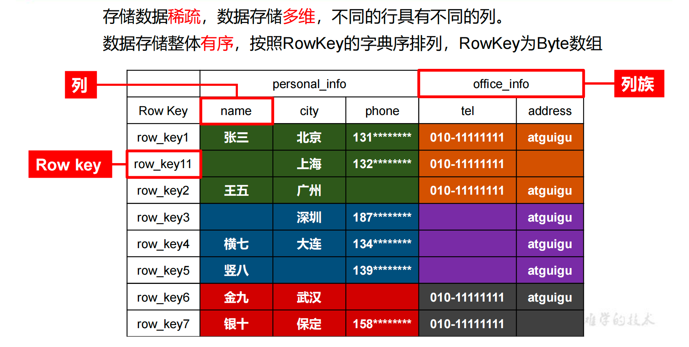
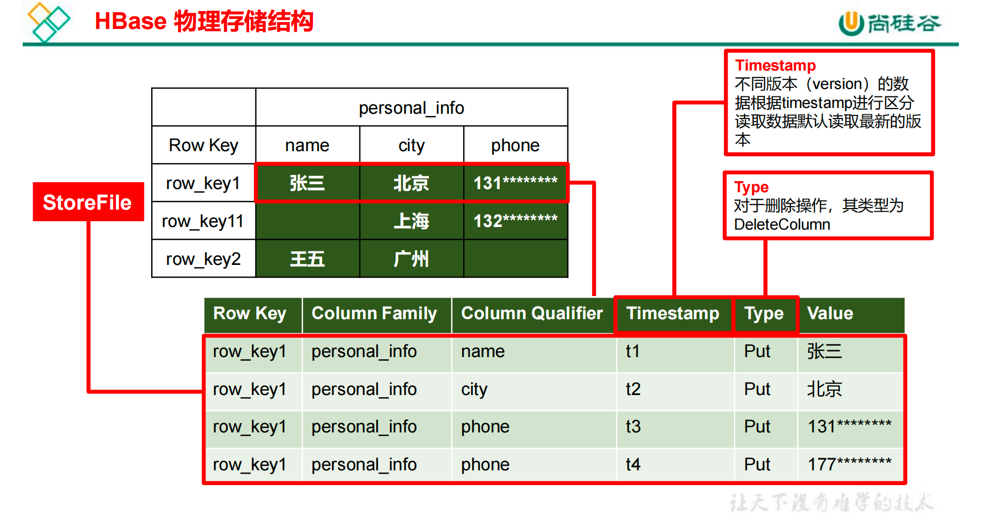
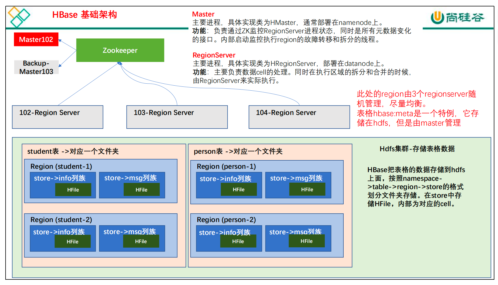
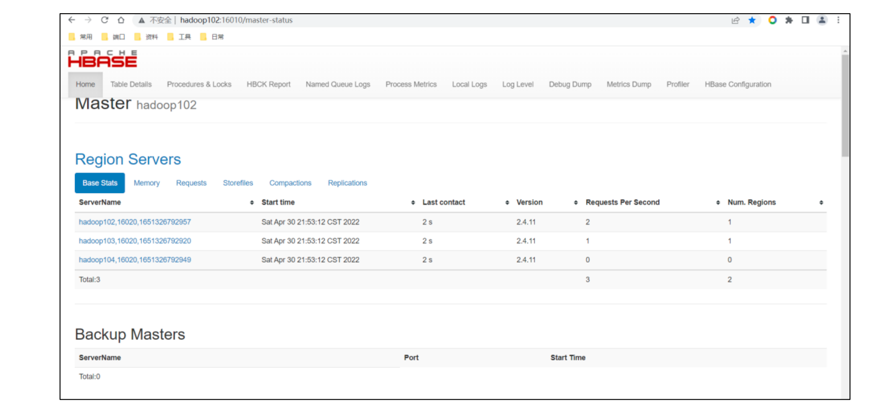

# HBase

## HBase 简介

### HBase 定义

Apache HBase™ 是以 hdfs 为数据存储的，一种分布式、可扩展的 NoSQL 数据库。

### HBase 数据模型

HBase 数据模型的关键在于**稀疏、分布式、多维、排序**的映射。其中映射map指代关系型数据库的 key-value结构

**Hbase 逻辑结构**

HBase可以用于存储多种结构的数据，以 JSON 为例，存储的数据原貌为：

```json
{
  "row_key1":{
    "personal_info":{
      "name":"zhangsan",
      "city":"北京",
      "phone":"131********"
    },
    "office_info":{
      "tel":"010-1111111",
      "address":"atguigu"
    }
	}
}
```



**HBase 物理存储结构**

物理存储结构即数据映射关系，而在概念视图的空单元格，底层实际根本不存在



**数据模型**

**1）Name Space**

​	命名空间，类似于关系型数据库的 database 概念，每个命名空间下有多个表。HBase 两个自带的命名空间，分别是 hbase 和 default，hbase 中存放的是 HBase 内置的表，default表是用户默认使用的命名空间

**2）Table**

​	类似于关系型数据库的表概念。不同的是，HBase 定义表时只需要声明列族即可，不需要声明具体的列。因为数据存储时稀疏的，所有往 HBase 写入数据时，字段可以动态、按需指定。因此，和关系型数据库相比，HBase 能够轻松应对字段变更的场景。

**3）Row**

​	HBase表中的每行数据都由RowKey和多个Column（列）组成，数据是按照RowKey的字典顺序存储的，并且查询数据时只能根据RowKey进行检索，所以 RowKey 的设计十分重要

**4）Column**

​	HBase 中每个列都由Column Family（列簇）和 Column Qualifier（列限定符）进行限定，例如 info：name，info：age。建表时，只需指明列簇，而列限定符无需预先定义

**5）TimeStamp**

​	用于标识数据的不同版本（version），每条数据写入时，系统会自动为其加上该字段，其值为写入 HBase 的时间

**6）Cell**

​	由{rowkey, column Family：column Qualifier, timestamp} 唯一确定的单元。cell 中的数据全部是字节码形式存贮。

### HBase 基本架构



**架构角色：**

**1）Master** 

实现类为 HMaster，负责监控集群中所有的 RegionServer 实例。主要作用如下：

（1）管理元数据表格 hbase:meta，接收用户对表格创建修改删除的命令并执行

（2）监控 region 是否需要进行负载均衡，故障转移和 region 的拆分。

通过启动多个后台线程监控实现上述功能：

​	①LoadBalancer 负载均衡器

- 周期性监控 region 分布在 regionServer 上面是否均衡，由参数 hbase.balancer.period 控制周期时间，默认 5 分钟。

​	②CatalogJanitor 元数据管理器

- 定期检查和清理 hbase:meta 中的数据。meta 表内容在进阶中介绍。

③MasterProcWAL master 预写日志处理器

- 把 master 需要执行的任务记录到预写日志 WAL 中，如果 master 宕机，让 backupMaster读取日志继续干。

**2）Region Server** 

 Region Server 实现类为 HRegionServer，主要作用如下:

（1）负责数据 cell 的处理，例如写入数据 put，查询数据 get 等

（2）拆分合并 region 的实际执行者，有 master 监控，有 regionServer 执行。

**3）Zookeeper** 

​	HBase 通过 Zookeeper来做master 的高可用、记录RegionServer 的部署信息、并且存储有 meta 表的位置信息

**4）HDFS**

​	HDFS 为 Hbase 提供最终的底层数据存储服务，同时为Hbase提供高容错的支持

## HBase 快速入门

### HBase 安装部署

**Zookeeper 正常部署**

```shell
[atguigu@hadoop102 zookeeper-3.5.7]$ bin/zkServer.sh start
[atguigu@hadoop103 zookeeper-3.5.7]$ bin/zkServer.sh start
[atguigu@hadoop104 zookeeper-3.5.7]$ bin/zkServer.sh start
```

**Hadoop 正常部署**

```shell
[atguigu@hadoop102 hadoop-3.1.3]$ sbin/start-dfs.sh
[atguigu@hadoop103 hadoop-3.1.3]$ sbin/start-yarn.sh
```

**HBase 正常部署**

1）解压到指定目录

```shell
[atguigu@hadoop102 software]$ tar -zxvf hbase-2.4.11-bin.tar.gz -C /opt/module/
[atguigu@hadoop102 software]$ mv /opt/module/hbase-2.4.11/opt/module/hbase
```

2）配置环境变量

```shell
[atguigu@hadoop102 ~]$ sudo vim /etc/profile.d/my_env.sh
```

添加

```sh
#HBASE_HOME
export HBASE_HOME=/opt/module/hbase
export PATH=$PATH:$HBASE_HOME/bin
```

3）使用 source 让配置的环境变量生效

```sh
[atguigu@hadoop102 module]$ source /etc/profile.d/my_env.sh
```

4）hbase-env.sh 修改内容，添加在最后

```shell
export HBASE_MANAGES_ZK=false
```

5）hbase-site.xml 修改内容：

```xml
<?xml version="1.0"?>
<?xml-stylesheet type="text/xsl" href="configuration.xsl"?>
<configuration>
   <property>
     <name>hbase.zookeeper.quorum</name>
     <value>hadoop102,hadoop103,hadoop104</value>
     <description>The directory shared by RegionServers.</description>
   </property>
  <!-- <property>-->
  <!-- <name>hbase.zookeeper.property.dataDir</name>-->
  <!-- <value>/export/zookeeper</value>-->
  <!-- <description> 记得修改 ZK 的配置文件 -->
  <!-- ZK 的信息不能保存到临时文件夹-->
  <!-- </description>-->
  <!-- </property>-->
   <property>
     <name>hbase.rootdir</name>
     <value>hdfs://hadoop102:8020/hbase</value>
     <description>The directory shared by RegionServers.</description>
   </property>
   <property>
     <name>hbase.cluster.distributed</name>
     <value>true</value>
   </property>
</configuration>
```

6）regionservers

```
hadoop102
hadoop103
hadoop104
```

7）解决 HBase 和 Haddoop 的 log4j兼容性问题，修改 HBase 的 Jar包，使用 Hadoop的 jar 包

```shell
[atguigu@hadoop102 hbase]$ mv /opt/module/hbase/lib/client-facing thirdparty/slf4j-reload4j-1.7.33.jar /opt/module/hbase/lib/clientfacing-thirdparty/slf4j-reload4j-1.7.33.jar.bak
```

8）集群分发

```shell
[atguigu@hadoop102 module]$ xsync hbase/
```

9）单点启动

```shell
[atguigu@hadoop102 hbase]$ bin/hbase-daemon.sh start master
[atguigu@hadoop102 hbase]$ bin/hbase-daemon.sh start regionserver
```

10）群启

```shell
[atguigu@hadoop102 hbase]$ bin/start-hbase.sh
```

11）查看 Hbase 页面

启动成功后，可以通过"host：port" 的方式来访问Hbase 管理页面，例如：http://hadoop102:16010



### HBase 的高可用

在 HBase 中 HMaster 负责监控 HRegionServer 的生命周期，均衡 RegionServer 的负载，如果 HMaster 挂掉了，那么整个 HBase 集群将陷入不健康的状态，并且此时的工作状态并不会维持太久。所以 HBase 支持对 HMaster 的高可用配置。

**1）关闭 HBase 集群（如果没有开启则跳过此步）**

```shell
[atguigu@hadoop102 hbase]$ bin/stop-hbase.sh
```

**2）在 conf 目录下创建 backup-masters 文件**

```shell
[atguigu@hadoop102 hbase]$ touch conf/backup-masters
```

**3）在 backup-masters文件中配置高可用 HMaster节点**

```shell
[atguigu@hadoop102 hbase]$ echo hadoop103 > conf/backup-masters
```

**4）将整个 conf 目录 scp 到其他节点**

```
[atguigu@hadoop102 hbase]$ xsync conf
```

**5）重启hbase，打开页面测试查看**

## HBase shell 操作

### 基本操作

**1）进入 HBase 客户端命令行**

```shell
[atguigu@hadoop102 hbase]$ bin/hbase shell
```

**2）查看帮助命令**

​	能够展示HBase 中所有能使用的命令

```mysql
hbase:001:0> help
```

### namespace

**1）创建命名空间**

​	使用特定的help语法能够查看命令如何使用

```mysql
hbase:002:0> help 'create_namespace'
```

**2）创建命名空间 bigdata**

```mysql
hbase:003:0> create_namespace 'bigdata'
```

**3）查看所有命名空间**

```mysql
hbase:004:0> list_namespace
```

### DDL

**1）创建表**

在 bigdata 命名空间中创建表格 student，两个列族。info 列族数据维护的版本数为 5 个，如果不写默认版本数为 1。

```mysql
hbase:005:0> create 'bigdata:student', {NAME => 'info', VERSIONS => 5}, {NAME => 'msg'}
```

如果创建表格只有一个列簇，没有列簇属性，可以简写

如果不写命名空间，使用默认的命名空间 default

```mysql
hbase:009:0> create 'student1','info'
```

**2）查看表**

查看表有两个命令：list 和 describe

**List**：查看所有的表名

```mysql
hbase:013:0> list
```

**Describe**：查看一个表的详情

```mysql
hbase:014:0> describe 'student1'
```

**3）修改表**

表名创建时写的所有和列簇相关的信息，都可以后续通过 alter 修改，包括增加删除列簇

（1）增加列簇和修改信息都使用覆盖的方法

```mysql
hbase:015:0> alter 'student1', {NAME => 'f1', VERSIONS => 3}
```

（2）删除信息使用特殊的语法

```mysql
hbase:015:0> alter 'student1', NAME => 'f1', METHOD => 'delete'
hbase:016:0> alter 'student1', 'delete' => 'f1'
```

**4）删除表**

shell 中删除表格，需要先将表格状态设置为不可用

```mysql
hbase:017:0> disable 'student1'
hbase:018:0> drop 'student1'
```

### DML

**1）写入数据**

在 HBase 中如果想要写入数据，只能添加结构中最底层的 cell，可以手动写入时间戳指定 cell 的版本，推荐不写默认使用当前的系统时间。

```mysql
hbase:019:0> put 'bigdata:student','1001','info:name','zhangsan'
hbase:020:0> put 'bigdata:student','1001','info:name','lisi'
hbase:021:0> put 'bigdata:student','1001','info:age','18'
```

**2）读取数据**

读取数据的方法有两个：get 和 scan

get 最大范围是一行数据，也可以进行列的过滤，读取数据的结果为多行 cell

```mysql
hbase:022:0> get 'bigdata:student','1001'
hbase:023:0> get 'bigdata:student','1001' , {COLUMN => 'info:name'}
```

也可以修改读取cell 的版本数，默认读取一个。最多就能够读取当前列簇设置的维护版本数。

```mysql
hbase:024:0>get 'bigdata:student','1001' , {COLUMN => 'info:name', VERSIONS => 6}
```

scan 是扫描数据，能够读取多行数据，不建议扫描过多的数据，推荐使用 startRow 和 stopRow来控制读取的数据，默认范围左闭右开。

```mysql
hbase:025:0> scan 'bigdata:student',{STARTROW => '1001',STOPROW => '1002'}
```

**3）删除数据**

删除数据的方法有两个：delete 和 deleteall

delete 表示删除一个版本的数据，即为 1 个 cell，不填写版本默认删除最新的一个版本。

```mysql
hbase:026:0> delete 'bigdata:student','1001','info:name'
```

deleteall 表示删除所有版本的数据，即为当前行当前列的多个 cell。（执行命令会标记

数据为要删除，不会直接将数据彻底删除，删除数据只在特定时期清理磁盘时进行）

```mysql
hbase:027:0> deleteall 'bigdata:student','1001','info:name'
```

## HBase API

### 环境准备

新建项目后，在 pom.xml 中添加依赖

```xml
<dependencies>
   <dependency>
     <groupId>org.apache.hbase</groupId>
     <artifactId>hbase-server</artifactId>
     <version>2.4.11</version>
     <exclusions>
       <exclusion>
         <groupId>org.glassfish</groupId>
         <artifactId>javax.el</artifactId>
       </exclusion>
     </exclusions>
   </dependency>
  
   <dependency>
     <groupId>org.glassfish</groupId>
     <artifactId>javax.el</artifactId>
     <version>3.0.1-b06</version>
   </dependency>
</dependencies>
```

### 创建连接

根据官方 API 介绍，HBase 的客户端连接由 ConnectionFactory 类来创建，用户使用完成之后需要手动关闭连接。同时连接是一个重量级的，推荐一个进程使用一个连接，对 HBase的命令通过连接中的两个属性 Admin 和 Table 来实现。

**单线程创建连接**

```java
package com.atguigu.hbase;

import org.apache.hadoop.conf.Configuration;
import org.apache.hadoop.hbase.client.AsyncConnection;
import org.apache.hadoop.hbase.client.Connection;
import org.apache.hadoop.hbase.client.ConnectionFactory;
import java.io.IOException;
import java.util.concurrent.CompletableFuture;

public class HBaseConnect {
 public static void main(String[] args) throws IOException {
   // 1. 创建配置对象
   Configuration conf = new Configuration();
   // 2. 添加配置参数
  conf.set("hbase.zookeeper.quorum","hadoop102,hadoop103,hadoop104"
  );
   // 3. 创建 hbase 的连接
   // 默认使用同步连接
   Connection connection = 
  ConnectionFactory.createConnection(conf);
   // 可以使用异步连接
   // 主要影响后续的 DML 操作
   CompletableFuture<AsyncConnection> asyncConnection = 
  ConnectionFactory.createAsyncConnection(conf);
   // 4. 使用连接
   System.out.println(connection);
   // 5. 关闭连接
   connection.close();
 }
}
```

**多线程创建连接**

使用类单例模式，确保使用一个连接，可以同时用于多个线程

```java
package com.atguigu;

import org.apache.hadoop.conf.Configuration;
import org.apache.hadoop.hbase.client.AsyncConnection;
import org.apache.hadoop.hbase.client.Connection;
import org.apache.hadoop.hbase.client.ConnectionFactory;
import java.io.IOException;
import java.util.concurrent.CompletableFuture;

public class HBaseConnect {
   // 设置静态属性 hbase 连接
   public static Connection connection = null;
   static {
   // 创建 hbase 的连接
   try {
   // 使用配置文件的方法
     connection = ConnectionFactory.createConnection();
   } catch (IOException e) {
     System.out.println("连接获取失败");
     e.printStackTrace();
 }
 }
 /**
 * 连接关闭方法,用于进程关闭时调用
 * @throws IOException
 */
 public static void closeConnection() throws IOException {
   if (connection != null) {
     connection.close();
   }
   }
}
```

在 Resources 文件夹中创建配置文件 hbase-site.xml

```xml
<?xml version="1.0"?>
<?xml-stylesheet type="text/xsl" href="configuration.xsl"?>
<configuration>
   <property>
     <name>hbase.zookeeper.quorum</name>
     <value>hadoop102,hadoop103,hadoop104</value>
   </property>
</configuration>
```

### DDL

创建HBaseDDL类，添加静态方法即可作为工具类

```java
public class HBaseDDL {
 // 添加静态属性 connection 指向单例连接
 public static Connection connection = HBaseConnect.connection;
}
```

**1）创建命名空间**

```java
/**
 * 创建命名空间
 * @param namespace 命名空间名称
 */
 public static void createNamespace(String namespace) throws 
IOException {
   // 1. 获取 admin
   // 此处的异常先不要抛出 等待方法写完 再统一进行处理
   // admin 的连接是轻量级的 不是线程安全的 不推荐池化或者缓存这个连接
   Admin admin = connection.getAdmin();
   // 2. 调用方法创建命名空间
   // 代码相对 shell 更加底层 所以 shell 能够实现的功能 代码一定能实现
   // 所以需要填写完整的命名空间描述
   // 2.1 创建命令空间描述建造者 => 设计师
   NamespaceDescriptor.Builder builder = NamespaceDescriptor.create(namespace);
   // 2.2 给命令空间添加需求
   builder.addConfiguration("user","atguigu");
   // 2.3 使用 builder 构造出对应的添加完参数的对象 完成创建
   // 创建命名空间出现的问题 都属于本方法自身的问题 不应该抛出
   try {
	   admin.createNamespace(builder.build());
   } catch (IOException e) {
     System.out.println("命令空间已经存在");
     e.printStackTrace();
   }
   // 3. 关闭 admin
   admin.close();
 }
```

**2）判断表是否存在**

```java
/**
 * 判断表格是否存在
 * @param namespace 命名空间名称
 * @param tableName 表格名称
 * @return ture 表示存在
 */
 public static boolean isTableExists(String namespace,String tableName) throws IOException {
   // 1. 获取 admin
   Admin admin = connection.getAdmin();
   // 2. 使用方法判断表格是否存在
   boolean b = false;
   try {
   	b = admin.tableExists(TableName.valueOf(namespace, tableName));
   } catch (IOException e) {
	   e.printStackTrace();
   }
   // 3. 关闭 admin
   admin.close();
   // 3. 返回结果
   return b;
   // 后面的代码不能生效
 }
```

**3）创建表**

```java
/**
 * 创建表格
 * @param namespace 命名空间名称
 * @param tableName 表格名称
 * @param columnFamilies 列族名称 可以有多个
 */
 public static void createTable(String namespace , String 
tableName , String... columnFamilies) throws IOException {
     // 判断是否有至少一个列族
     if (columnFamilies.length == 0){
       System.out.println("创建表格至少有一个列族");
       return;
     }
     // 判断表格是否存在
     if (isTableExists(namespace,tableName)){
       System.out.println("表格已经存在");
       return;
     }
     // 1.获取 admin
     Admin admin = connection.getAdmin();
     // 2. 调用方法创建表格
     // 2.1 创建表格描述的建造者
     TableDescriptorBuilder tableDescriptorBuilder = TableDescriptorBuilder.newBuilder(TableName.valueOf(namespace, 
    tableName));
     // 2.2 添加参数
     for (String columnFamily : columnFamilies) {
       // 2.3 创建列族描述的建造者
       ColumnFamilyDescriptorBuilder columnFamilyDescriptorBuilder = 				      ColumnFamilyDescriptorBuilder.newBuilder(Bytes.toBytes(columnFamily));
       // 2.4 对应当前的列族添加参数
       // 添加版本参数
       columnFamilyDescriptorBuilder.setMaxVersions(5);
       // 2.5 创建添加完参数的列族描述

      tableDescriptorBuilder.setColumnFamily(columnFamilyDescriptorBuil
      der.build());
     }
     // 2.6 创建对应的表格描述
     try {
     		admin.createTable(tableDescriptorBuilder.build());
     } catch (IOException e) {
        e.printStackTrace();
     }
     // 3. 关闭 admin
     admin.close();
 }
```

**4）修改表**

```java
/**
 * 修改表格中一个列族的版本
 * @param namespace 命名空间名称
 * @param tableName 表格名称
 * @param columnFamily 列族名称
 * @param version 版本
 */
 public static void modifyTable(String namespace ,String 
tableName,String columnFamily,int version) throws IOException {
   // 判断表格是否存在
   if (!isTableExists(namespace,tableName)){
   System.out.println("表格不存在无法修改");
   return;
   }
   // 1. 获取 admin
   Admin admin = connection.getAdmin();
   try {
     // 2. 调用方法修改表格
     // 2.0 获取之前的表格描述
     TableDescriptor descriptor = 
    admin.getDescriptor(TableName.valueOf(namespace, tableName));
     // 2.1 创建一个表格描述建造者
     // 如果使用填写 tableName 的方法 相当于创建了一个新的表格描述建造
    者 没有之前的信息
     // 如果想要修改之前的信息 必须调用方法填写一个旧的表格描述
     TableDescriptorBuilder tableDescriptorBuilder = 
    TableDescriptorBuilder.newBuilder(descriptor);
     // 2.2 对应建造者进行表格数据的修改
     ColumnFamilyDescriptor columnFamily1 = 
    descriptor.getColumnFamily(Bytes.toBytes(columnFamily));
     // 创建列族描述建造者
     // 需要填写旧的列族描述
     ColumnFamilyDescriptorBuilder 
    columnFamilyDescriptorBuilder = 
    ColumnFamilyDescriptorBuilder.newBuilder(columnFamily1);
     // 修改对应的版本
     columnFamilyDescriptorBuilder.setMaxVersions(version);
     // 此处修改的时候 如果填写的新创建 那么别的参数会初始化

    tableDescriptorBuilder.modifyColumnFamily(columnFamilyDescriptorB
    uilder.build());
     admin.modifyTable(tableDescriptorBuilder.build());
   } catch (IOException e) {
  	 e.printStackTrace();
   }
   // 3. 关闭 admin
   admin.close();
 }
```


