## Hadoop

### 大数据简介

**概念：**大数据是指无法在一定时间范围内用常规软件工具捕捉、管理和处理的数据集合，是需要新处理模式才能具有更强的决策力、洞察发现力和流程优化能力的海量、高增长率和多样化的信息资产。主要解决的是海量数据的采集、存储和分析计算问题。

**特点：**数据量大（Volume）、高速（Velocity）、多样（Variety）、低价值密度（Value）

**应用场景：**推荐、物流仓储、保险、金融、房产

**大数据组织结构：**

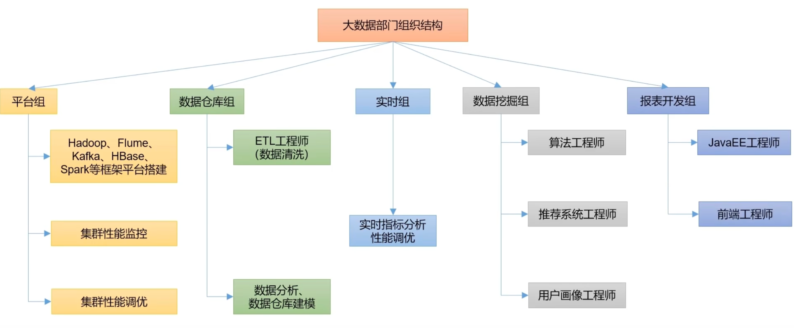

 

### Hadoop简介

#### Hadoop **概念**

- Hadoop是一个由Apache 基金会所开发的分布式系统基础框架
- 主要解决，海量数据的存储和海量数据的分析计算问题
- 广义来说，Hadoop 通常是指一个更广泛的概念---Hadoop 生态圈

#### **Hadoop 优势**

 1、高可靠性：Hadoop 底层维护多个数据副本，所以即使 Hadoop某个计算元素或存储出现故障，也不会导致数据的丢失

 2、高扩展性：在集群间分配任务数据，可方便的扩展数以千计的节点

 3、高效性：在 MapReduce 的思想下，Hadoop 是并行工作的，以加快任务处理速度

 3、高容错型：能够自动将失败的任务重新分配

**Hadoop 1.x 2.x 3.x 的区别**

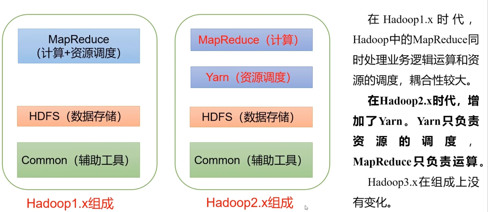

#### **Hadoop 架构**

1、HDFS架构（Hadoop Distributed File System，是一个分布式文件系统）

- NameNode（nn）：存储文件的元数据，如文件名，文件目录结构，文件属性（生成时间、副本数、文件权限）
- DataNode（dn）：在本地文件系统存储文件块数据，以及快数据的校验和
- Secondary NameNode（2nn）：每隔一段时间对NameNode 元数据备份

2、Yarn结构（Yet Another Resource Negotiate，资源协调者，是 Hadoop 的资源管理器）

- ResourceManager（RM）：整个集群资源（内存，CPU等）管理者
- NodeManager（NM）：单个节点服务器资源管理者
- ApplicationMaster（AM）：单个任务的管理者
- Container：容器，相当一台独立的服务器，里面封装了任务所需要的资源，如内存，CPU 等

 3、MapReduce 架构

- Map阶段并行处理输入数据
- Reduce 阶段对 Map 结果进行汇总

4、三者关系

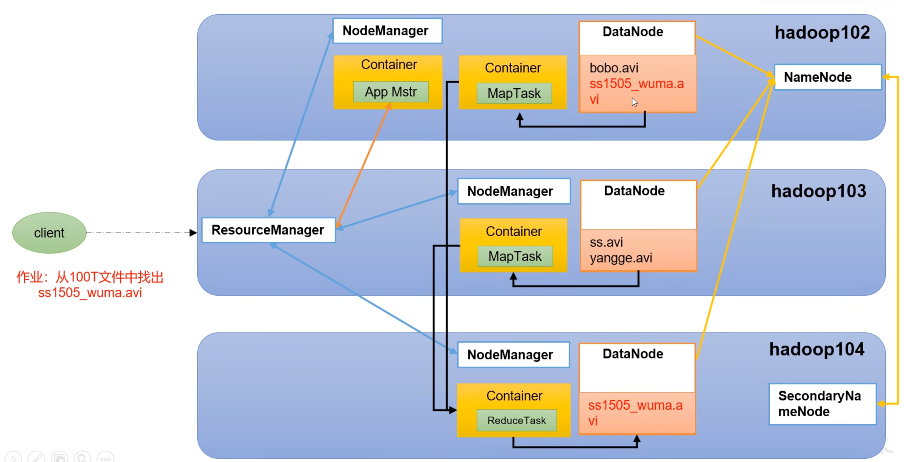5、大数据技术生态体系

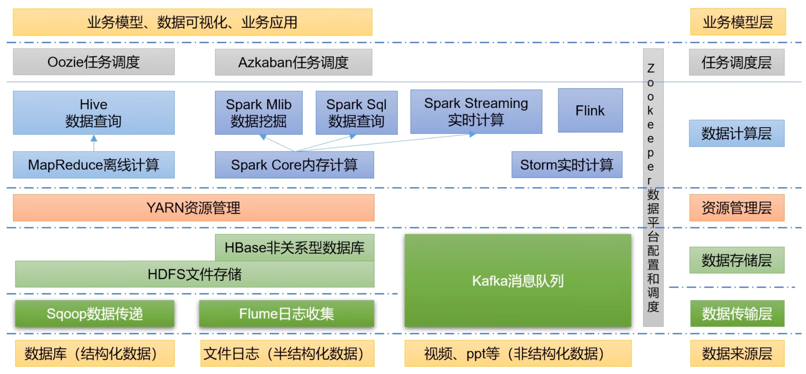

1）Sqoop：Sqoop是一款开源的工具，主要用于在Hadoop、Hive与传统的数据库（MySQL）间进行数据的传递，可以将一个关系型数据库（例如 ：MySQL，Oracle 等）中的数据导进到Hadoop的HDFS中，也可以将HDFS的数据导进到关系型数据库中。

2）Flume：Flume是一个高可用的，高可靠的，分布式的海量日志采集、聚合和传输的系统，Flume支持在日志系统中定制各类数据发送方，用于收集数据； 

3）Kafka：Kafka是一种高吞吐量的分布式发布订阅消息系统； 

4）Spark：Spark是当前最流行的开源大数据内存计算框架。可以基于Hadoop上存储的大数据进行计算。

5）Flink：Flink是当前最流行的开源大数据内存计算框架。用于实时计算的场景较多。

6）Oozie：Oozie是一个管理Hadoop作业（job）的工作流程调度管理系统。

7）Hbase：HBase是一个分布式的、面向列的开源数据库。HBase不同于一般的关系数据库，它是一个适合于非结构化数据存储的数据库。

8）Hive：Hive是基于Hadoop的一个数据仓库工具，可以将结构化的数据文件映射为一张数据库表，并提供简单的SQL查询功能，可以将SQL语句转换为MapReduce任务进行运行。其优点是学习成本低，可以通过类SQL语句快速实现简单的MapReduce统计，不必开发专门的MapReduce应用，十分适合数据仓库的统计分析。

9）ZooKeeper：它是一个针对大型分布式系统的可靠协调系统，提供的功能包括：配置维护、名字服务、分布式同步、组服务等。

#### Hadoop 序列化

1）**什么是序列化**

​	**序列化**就是把内存中的对象，转换成字节序列（或其他数据传输协议）以便于存储到磁盘（持久化）和网络传输。 

​	**反序列化**就是将收到字节序列（或其他数据传输协议）或者是磁盘的持久化数据，转换成内存中的对象。

2）**为什么要序列化**

​	一般来说，“活的”对象只生存在内存里，关机断电就没有了。而且“活的”对象只能由本地的进程使用，不能被发送到网络上的另外一台计算机。 然而序列化可以存储“活的”对象，可以将“活的”对象发送到远程计算机。

3）**为什么不用Java的序列化**

​	Java的序列化是一个重量级序列化框架（Serializable），一个对象被序列化后，会附带很多额外的信息（各种校验信息，Header，继承体系等），不便于在网络中高效传输。所以，Hadoop自己开发了一套序列化机制（Writable）。

4）**Hadoop序列化特点：**

​	**（1）紧凑 ：**高效使用存储空间。

​	**（2）快速：**读写数据的额外开销小。

**（3）互操作：**支持多语言的交互  


### **HDFS**

#### **HDFS简介** 

**背景**：随着数据量越来越大，在一个操作系统存不下所有的数据，那么就分配到更多的操作系统管理的磁盘中，但是不方便管理和维护，迫切需要一种系统来管理多台机器上的文件，这就是分布式[文件管理系统](https://so.csdn.net/so/search?q=文件管理系统&spm=1001.2101.3001.7020)。HDFS只是分布式文件管理系统中的一种。

**设计目标**：

- 运行在大量廉价商用机器上：硬件错误是常态 ，提供容错机制
- 简答一致性模型：一次写入多次读取，支持追加，不允许修改，保证数据一致性
- 流式数据访问：批量读而非随机读，关注吞吐量而非时间
- 存储大规模数据集：典型文件大小GB-TB

**优点**：

1）高容错性

- 数据自动保存多个副本，通过增加副本的形式，提高容错性
- 某一个副本丢失后，都可以自动恢复

2）适合处理大数据

- 数据规模：能够处理数据规模达到 GB、TB、甚至PB级别的数据
- 文件规模：能够处理百万规模以上的文件数量

3）可构建在廉价机器上，通过多副本机制，提高可靠性

**缺点**：

1）不适合低延时数据访问，比如毫秒级的存储数据，是做不到的

2）无法高效地对大量小文件进行存储

- 存储大量小文件的话，它会占用NameNode 大量的内存来存储文件目录和块信息
- 小文件存储的寻址时间会超过读取时间

3）不支持并发写入

- 一个文件只能有一个写入，不允许多个线程同事写
- 仅支持数据 append


#### **HDFS组成架构**

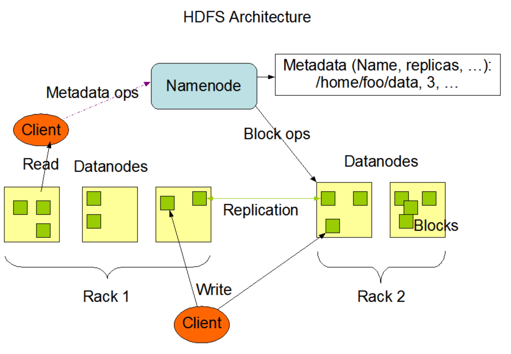

- **NameNode**：就是master管理者
  - 管理HDFS的名称空间
  - 配置副本策略
  - 管理数据块的映射信息
  - 处理客户端读写请求
- **DataNode**：就是Slave，NameNode下达命令，DataNode执行实际操作
  -  存储实际数数据块
  - 执行数据块的读写操作
- **Client**：客户端
  -  文件切分：文件上传HDFS的时候，client将文件分成一个一个的block，如何再上传
  - 与NameNode交互，获取文件的位置信息
  - 与DataNode交互，读取或写入数据
  - Client提供一些命令来管理HDFS，比如对NameNode格式化
  - Client可以通过一些命令来访问HDFS，比如对HDFS增删改查操作
- **Secondary NameNode**：并非NameNode的热备，
  - 辅助NameNode，分担其工作量，比如定期合并，并推送给NameNode
  - 在紧急情况下，可辅助恢复NameNode


#### HDFS 文件块大小

HDFS 的文件在物理上是分块存储（Block），块的大可以通过配置参数来规定，默认大小在 Hadoop2.x/3.x 版本中是128M，1.x 版本中为64M

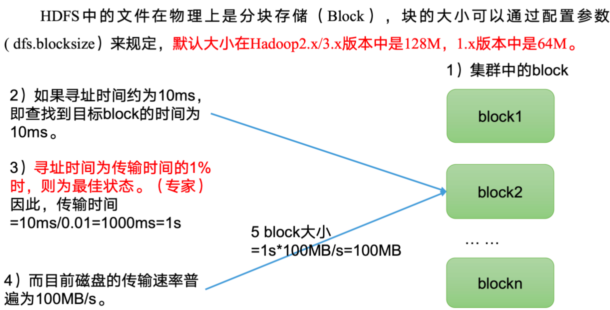

 

#### HDFS 的 Shell 操作

**命令大全**

```
[-appendToFile <localsrc> ... <dst>]
        [-cat [-ignoreCrc] <src> ...]
        [-chgrp [-R] GROUP PATH...]
        [-chmod [-R] <MODE[,MODE]... | OCTALMODE> PATH...]
        [-chown [-R] [OWNER][:[GROUP]] PATH...]
        [-copyFromLocal [-f] [-p] <localsrc> ... <dst>]
        [-copyToLocal [-p] [-ignoreCrc] [-crc] <src> ... <localdst>]
        [-count [-q] <path> ...]
        [-cp [-f] [-p] <src> ... <dst>]
        [-df [-h] [<path> ...]]
        [-du [-s] [-h] <path> ...]
        [-get [-p] [-ignoreCrc] [-crc] <src> ... <localdst>]
        [-getmerge [-nl] <src> <localdst>]
        [-help [cmd ...]]
        [-ls [-d] [-h] [-R] [<path> ...]]
        [-mkdir [-p] <path> ...]
        [-moveFromLocal <localsrc> ... <dst>]
        [-moveToLocal <src> <localdst>]
        [-mv <src> ... <dst>]
        [-put [-f] [-p] <localsrc> ... <dst>]
        [-rm [-f] [-r|-R] [-skipTrash] <src> ...]
        [-rmdir [--ignore-fail-on-non-empty] <dir> ...]
<acl_spec> <path>]]
        [-setrep [-R] [-w] <rep> <path> ...]
        [-stat [format] <path> ...]
        [-tail [-f] <file>]
        [-test -[defsz] <path>]
        [-text [-ignoreCrc] <src> ...]
```


#### **HDFS的读写流程**

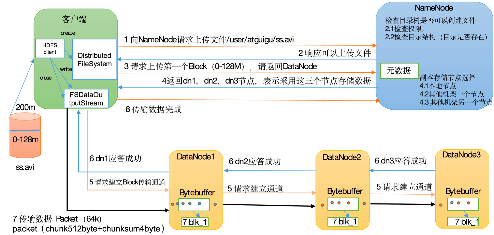

（1）客户端通过Distributed FileSystem模块向NameNode请求上传文件，NameNode检查目标文件是否已存在，父目录是否存在。

（2）NameNode返回是否可以上传。

（3）客户端请求第一个 Block上传到哪几个DataNode服务器上。

（4）NameNode返回3个DataNode节点，分别为dn1、dn2、dn3。

（5）客户端通过FSDataOutputStream模块请求dn1上传数据，dn1收到请求会继续调用dn2，然后dn2调用dn3，将这个通信管道建立完成。

（6）dn1、dn2、dn3逐级应答客户端。

（7）客户端开始往dn1上传第一个Block（先从磁盘读取数据放到一个本地内存缓存），以Packet为单位，dn1收到一个Packet就会传给dn2，dn2传给dn3；dn1每传一个packet会放入一个应答队列等待应答。

（8）当一个Block传输完成之后，客户端再次请求NameNode上传第二个Block的服务器。（重复执行3-7步）。

 

#### **HDFS节点距离计算**

在HDFS写数据的过程中，NameNode 会选择距离待上传数据最近的 DataNode 接收数据

节点距离：两个节点到达最近的共同祖先的距离总和

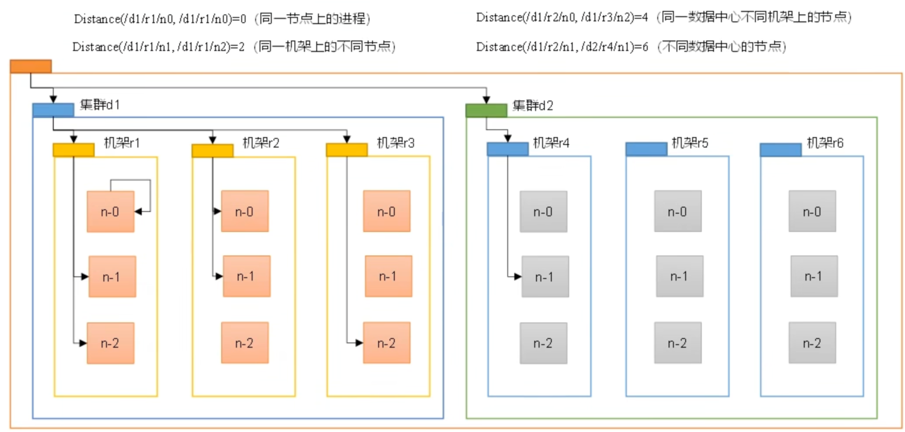 


#### **HDFS副本节点选择**

​	1、第一个副本在Client所处节点上，如果客户端在集群外，随机选一个

​	2、第二个副本在另一个机架的随机一个节点上

​	3、第三个副本在第二个副本所在机架的随机节点

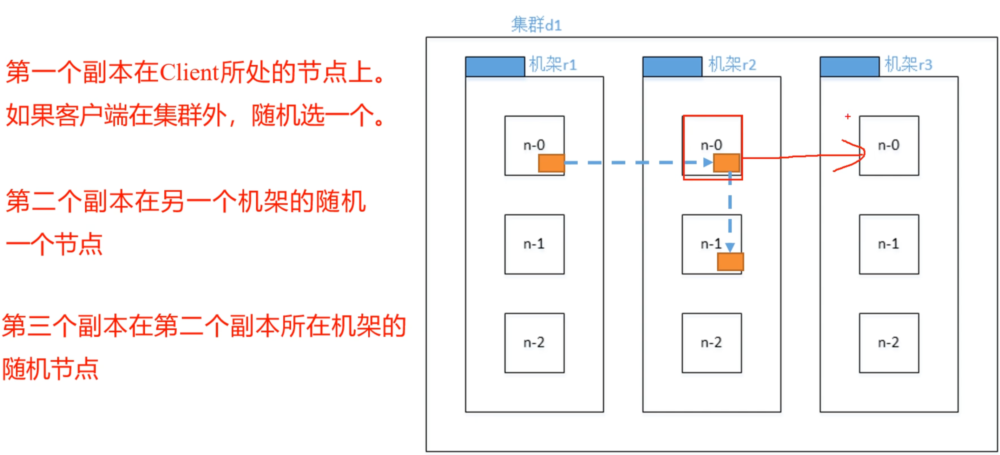

#### **HDFS的读数据流程**

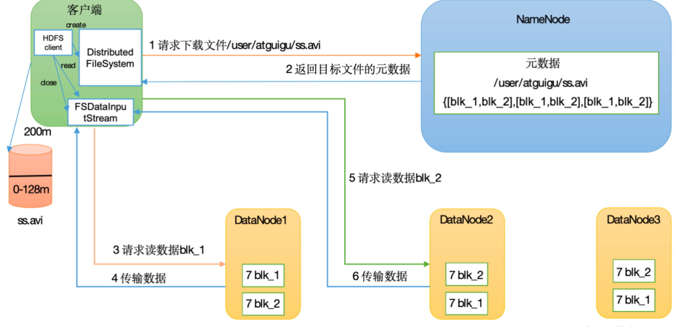

（1）客户端通过DistributedFileSystem向NameNode请求下载文件，NameNode通过查询元数据，找到文件块所在的DataNode地址。

（2）挑选一台DataNode（就近原则，然后随机）服务器，请求读取数据。

（3）DataNode开始传输数据给客户端（从磁盘里面读取数据输入流，以Packet为单位来做校验）。

（4）客户端以Packet为单位接收，先在本地缓存，然后写入目标文件

 

#### **NameNode和SecondaryNameNode**

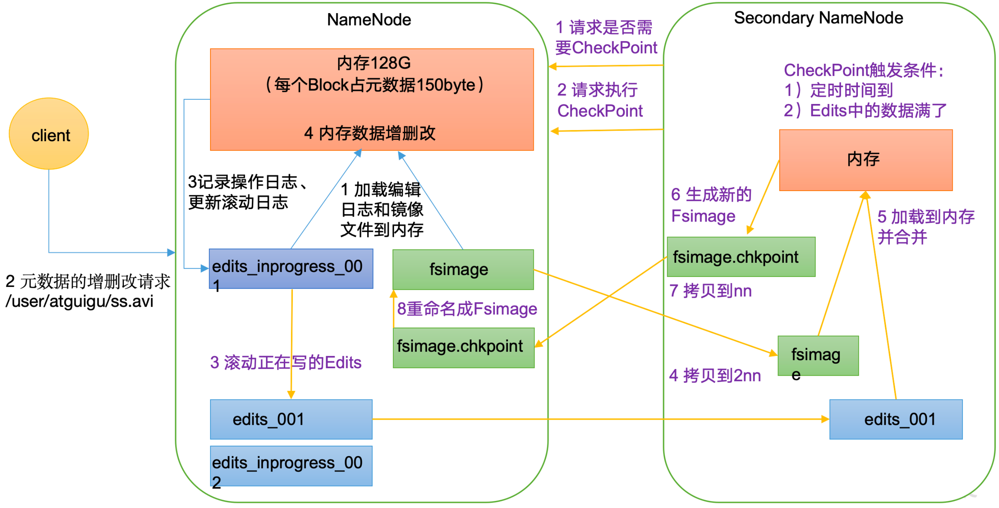

**一、NameNode核心元数据**

**1、命名空间**（NameSpace）

- **目录树结构**：文件和目录的层级关系（如 /user/data/file.txt），通过树状结构维护
- **文件属性**：权限、所有者、修改时间、副本数、块大小
- **扩展属性**：配额、快照、存储策略（如冷热数据分层）等，通过 `Inode`节点的 features 字段扩展

**2、数据块映射**（BlockManager）

- **块地址位置**：每个文件对应的块列表及其在 DataNode 上的存储位置（如块 blk_123 存储在 DataNode1 和 DataNode2）
- **副本管理**

**二、持久化存储（磁盘文件）**

1. **FsImage**

- **全量快照**：某一时间点的命名空间完整镜像，包含目录树、文件属性、块列表等。
- **存储格式**：二进制序列化文件，文件名形如 `fsimage_12345`（`12345` 为最大事务 ID）。
- **多目录存储**：通过 `dfs.namenode.name.dir` 配置多个路径，提高可靠性（如 `/data/dfs/name1,/data/dfs/name2`）。

2. **EditLog**

- **增量日志**：记录自最后一次 FsImage 生成后所有元数据变更操作（如文件创建、删除、副本调整）。
- **事务 ID**：每条操作记录分配唯一递增的事务 ID，确保顺序执行。
- **存储路径**：通过 `dfs.namenode.edits.dir` 配置，支持多目录同步写入。

3. **Checkpoint 机制**

- **合并 FsImage 和 EditLog**：由 SecondaryNameNode 或 CheckpointNode 定期将 EditLog 合并到 FsImage 中，生成新的快照（如 `fsimage_12345`），并清空旧的 EditLog。
- **高可用性（HA）**：在 HA 配置中，EditLog 通过 JournalNodes 集群同步，Standby NameNode 实时跟踪 Active NameNode 的变更。

**三、NameNode 和 SecondaryNameNode 的必要性**

​	NameNode因为要进行随机访问，还有响应客户请求，必然效率过低。因此，元数据需要存放在内存中。但如果只存在内存中，一旦断电，元数据丢失，整个集群就无法工作了。因此产生在磁盘中备份元数据的FsImage。这样又会带来新的问题，当在内存中的元数据更新时，如果同时更新FsImage，就会导致效率过低，但如果不更新，就会发生一致性问题，一旦NameNode节点断电，就会产生数据丢失。因此，引入Edits文件（只进行追加操作，效率很高）。每当元数据有更新或者添加元数据时，修改内存中的元数据并追加到Edits中。这样，一旦NameNode节点断电，可以通过FsImage和Edits的合并，合成元数据。但是，如果长时间添加数据到Edits中，会导致该文件数据过大，效率降低，而且一旦断电，恢复元数据需要的时间过长。因此，需要定期进行FsImage和Edits的合并，如果这个操作由NameNode节点完成，又会效率过低。因此，引入一个新的节点SecondaryNamenode，专门用于FsImage和Edits的合并。

1）第一阶段：NameNode启动

​	（1）第一次启动NameNode格式化后，创建Fsimage和Edits文件。如果不是第一次启动，直接加载编辑日志和镜像文件到内容。

​	（2）客户端对元数据进行增删改的请求

​	（3）NameNode在记录操作日志，更新滚动日志

​	（4）NameNode在内存中对元数据进行增删改

2）第二阶段：Secondary NameNode工作

​	（1）Secondary NameNode询问NameNode是否需要CheckPoint。直接带回NameNode是否检查结果。

​	（2）Secondary NameNode 请求执行CheckPoint

​	（3）NameNode滚动正在写的Edits日志。

​	（4）将滚动前的编辑日志和镜像文件拷贝到Secondary NameNode。

​	（5）Secondary NameNode加载编辑日志和镜像文件到内存，并合并。

​	（6）生成新的镜像文件fsimage.chkpoint。

​	（7）拷贝fsimage.chkpoint到NameNode。

​	（8）NameNode将fsimage.chkpoint重新命名成fsimage。

 

#### **Fsimage和Edits**


NameNode被格式化之后，会在目录中生成如下文件

​	（1）Fsimage文件：HDFS文件系统元数据的一个永久性的checkpoint，其中包含HDFS文件系统的所有目录和文件index的序列化信息。

​	（2）Edits文件：存放HDFS文件系统的所有更新操作的路径，文件系统客户端执行的所有写操作首先会被记录到Edits文件中

​	（3）seen_txid文件保存的是一个数字，就是最后一个edits数字

​	（4）每次NameNode启动的时候都会将Fsimage文件读入内容，加载Edits里面的更新操作，保证了内存中的元数据信息是最新的、同步的，可以看成NameNode启动的时候将Fsimage和Edits文件进行了合并

CheckPoint时间设置：

（1）通常情况下，SecondaryNameNode 每小时执行一次

（2）一分钟检查一次操作次数，当操作次数到达一百万时，SecondaryNameNode 执行一次

 

#### **DataNode**

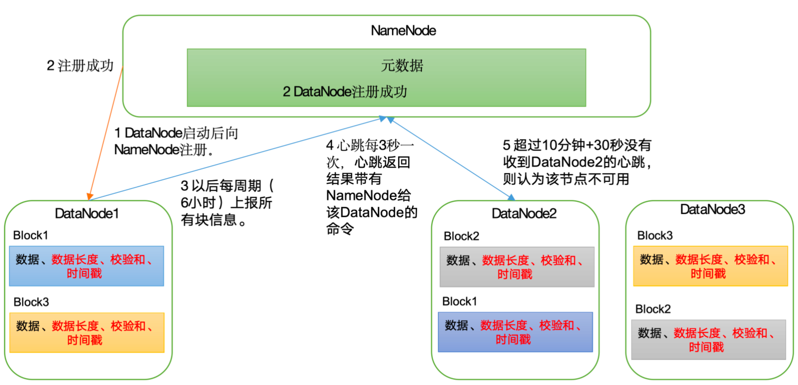（1)一个数据块在DataNode上以文件形式存储在磁盘上，包括两个文件，一个数据本身，一个是元数据包括数据块的长度，快数据的校验和，以及时间戳

（2）DataNode启动后向NameNode注册，通过后，向NameNode上报所有块信息

（3）心跳是每三秒一次，心跳返回结果带有NameNode给该DataNode的命令如复制块数据到另一台机器，或删除某个数据块。如果超过十分钟没有收到某个DataNode的心跳，则认为该节点不可用

（4）集群运行中可以安全加入和退出一些机器

 

**DataNode的数据完整性**

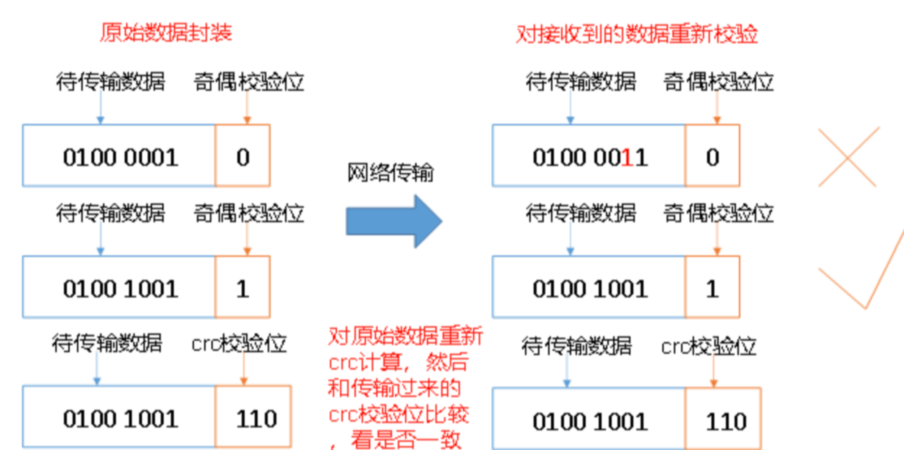

思考：如果电脑磁盘里面存储的数据是控制高铁信号灯的红灯信号（1）和绿灯信号（0），但是存储该数据的磁盘坏了，一直显示是绿灯，是否很危险？同理DataNode节点上的数据损坏了，却没有发现，是否也很危险，那么如何解决呢？

（1）当DataNode读取Block的时候，它会计算CheckSum

（2）如果计算后的CheckSum，与Block创建时值不一样，说明Block以及损坏

（3）Client读取其他DataNode上的Block

（4）常见校验算法crc（32），md5（128）

（5）DataNode在其文件创建后周期验证ChechSum


### MapReduce

#### MapReduce 简介

**定义：**MapReduce 是一个分布式运行程序的编程框架，是用户开发 "基于 Hadoop 的数据分析应用" 的核心框架

MapReduce 核心功能是将用户编写的业务逻辑代码和自带默认组件整合成一个完整的分布式运算程序，并发运行在一个 Hadoop 集群上

**优点：**

1）**MapReduce 易于编程**

简单实现一些接口，就可以完成一个分布式程序，这个分布式程序可以分布到大量廉价的 PC 机器上。	一个简单的串行程序是一模一样的。就是因为这个特点使得MapReduce编程变得非常流行。

**2）良好的扩展性**

​	当你的计算资源不能得到满足的时候，你可以通过简单的增加机器来扩展它的计算能力。

**3）高容错性**

​	MapReduce设计的初衷就是使程序能够部署在廉价的PC机器上，这就要求它具有很高的容错性。比如其中一台机器挂了，它可以把上面的计算任务转移到另外一个节点上运行，不至于这个任务运行失败，而且这个过程不需要人工参与，而完全是由Hadoop内部完成的。

**4）适合PB级以上海量数据的离线处理**

​	可以实现上千台服务器集群并发工作，提供数据处理能力。

**缺点：**

**1）不擅长实时计算**

​	MapReduce无法像MySQL一样，在毫秒或者秒级内返回结果。

**2）不擅长流式计算**

​	流式计算的输入数据是动态的，而MapReduce的输入数据集是静态的，不能动态变化。这是因为MapReduce自身的设计特点决定了数据源必须是静态的。

**3）不擅长DAG（有向无环图）计算**

​	多个应用程序存在依赖关系，后一个应用程序的输入为前一个的输出。在这种情况下，MapReduce并不是不能做，而是使用后，每个MapReduce作业的输出结果都会写入到磁盘，会造成大量的磁盘IO，导致性能非常的低下。

 

#### MapReduce 的核心思想

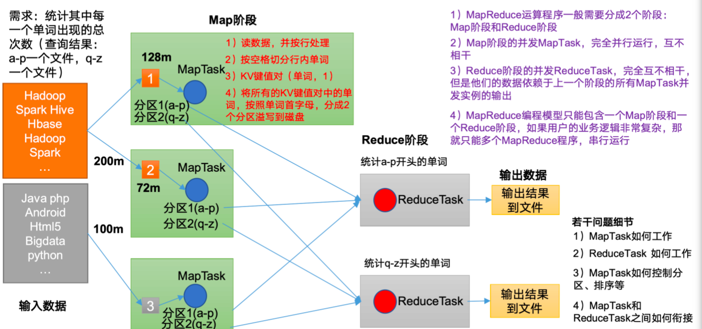（1)分布式的运算程序往往需要分成两个阶段

（2）第一阶段的 MapTask 并发实例，完全并发运行，互不相干

（3）第二阶段的 ReduceTask 并发实例互不相干，但是他们的数据依赖于上一个阶段的所有 MapTask 并发实例的输出

（4）MapReduce 编程模式只能包含一个 Map 阶段和 Reduce 阶段，如果用户的业务逻辑非常复杂，那就只能多个MapReduce 程序，串行运行

**MapReduce进程**

（1）MrAppMaster：负责整个程序的过程调度及状态协调

（2）MapTask：负责Map 阶段的整个数据处理流程

（3）ReduceTask：负责 Reduce 阶段的整个数据处理流程

 

#### MapReduce 编程规范

1、Mapper 阶段

（1）用户自定义的 Mapper 要继承自己的父类

（2）Mapper 的输入数据是 KV 对的形式（ KV 的类型可自定义）

（3）Mapper 中的业务逻辑写在 map() 方法中

（4）Mapper 的输出数据是 KV 对的形式

（5）map() 方法 （MapTask 进程）对每个<K,V>调用一次

2、Reduce 阶段

（1）用户自定义的 Reducer 要继承自己的父类

（2）Reducer 的输入数据类型对应 Mapper 的输出类型也是KV

（3）Reduce 的业务逻辑写在reduce（）方法中

（4）ReduceTask 进程对每一组相同 k 的<k, v>组调用一次 reduce() 方法

3、Driver阶段

  相当于Yarn 集群的客户端，用于提交我们整个程序到 YARN 集群，提交的是封装了 MapReduce程序相关参数的 Job 对象

**编写程序**

（1）编写 Mapper 类

```java
package com.atguigu.mapreduce.wordcount;
import java.io.IOException;
import org.apache.hadoop.io.IntWritable;
import org.apache.hadoop.io.LongWritable;
import org.apache.hadoop.io.Text;
import org.apache.hadoop.mapreduce.Mapper;
 
public class WordCountMapper extends Mapper<LongWritable, Text, Text, IntWritable>{
    Text k = new Text();
    IntWritable v = new IntWritable(1);
    @Override
    protected void map(LongWritable key, Text value, Context context) throws IOException, InterruptedException {
    // 1 获取一行
    String line = value.toString();
    // 2 切割
    String[] words = line.split(" ");
    // 3 输出
    for (String word : words) {
    k.set(word);
    context.write(k, v);
    }
  }
}
```

（2）编写 Reducer 类

```java
package com.atguigu.mapreduce.wordcount;
import java.io.IOException;
import org.apache.hadoop.io.IntWritable;
import org.apache.hadoop.io.Text;
import org.apache.hadoop.mapreduce.Reducer;
 
public class WordCountReducer extends Reducer<Text, IntWritable, Text, IntWritable>{
 
  int sum;
  IntWritable v = new IntWritable();
   
  @Override
  protected void reduce(Text key, Iterable<IntWritable> values,Context context) throws IOException, InterruptedException {
    // 1 累加求和
    sum = 0;
    for (IntWritable count : values) {
    sum += count.get();
    }
    // 2 输出
             v.set(sum);
    context.write(key,v);
  }
}
```

（3）编写Driver 类

```java
package com.atguigu.mapreduce.wordcount;
import java.io.IOException;
import org.apache.hadoop.conf.Configuration;
import org.apache.hadoop.fs.Path;
import org.apache.hadoop.io.IntWritable;
import org.apache.hadoop.io.Text;
import org.apache.hadoop.mapreduce.Job;
import org.apache.hadoop.mapreduce.lib.input.FileInputFormat;
import org.apache.hadoop.mapreduce.lib.output.FileOutputFormat;
 
public class WordCountDriver {
 
public static void main(String[] args) throws IOException, ClassNotFoundException, InterruptedException {
 
    // 1 获取配置信息以及获取job对象
    Configuration conf = new Configuration();
    Job job = Job.getInstance(conf);
     
    // 2 关联本Driver程序的jar
    job.setJarByClass(WordCountDriver.class);
     
    // 3 关联Mapper和Reducer的jar
    job.setMapperClass(WordCountMapper.class);
    job.setReducerClass(WordCountReducer.class);
     
    // 4 设置Mapper输出的kv类型
    job.setMapOutputKeyClass(Text.class);
    job.setMapOutputValueClass(IntWritable.class);
     
    // 5 设置最终输出kv类型
    job.setOutputKeyClass(Text.class);
    job.setOutputValueClass(IntWritable.class);
    // 6 设置输入和输出路径
    FileInputFormat.setInputPaths(job, new Path(args[0]));
    FileOutputFormat.setOutputPath(job, new Path(args[1]));
     
    // 7 提交job
    boolean result = job.waitForCompletion(true);
    System.exit(result ? 0 : 1);
    }
}
```

### Yarn

 

#### Yarn概念

**简介：**Yarn是一个资源调度平台，负责为运算程序提供服务器运算资源，相当于一个分布式的操作系统平台，而 MapReduce 等运算程序则相当于运行在操作系统之上的应用程序

 

#### Yarn的架构

YARN主要由ResourceManager、NodeManager、ApplicationMaster和Container等组件构成。

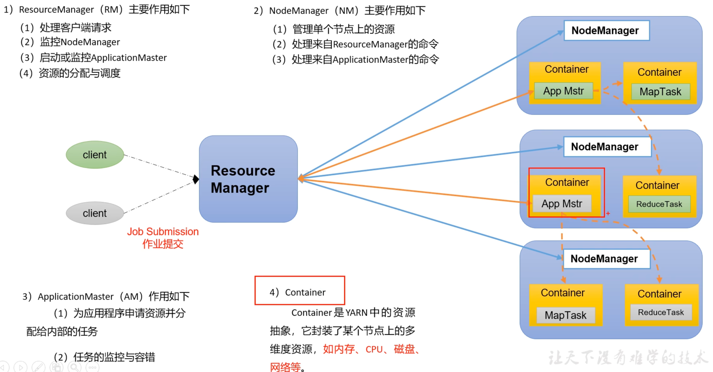

 

#### Yarn 的运行机制

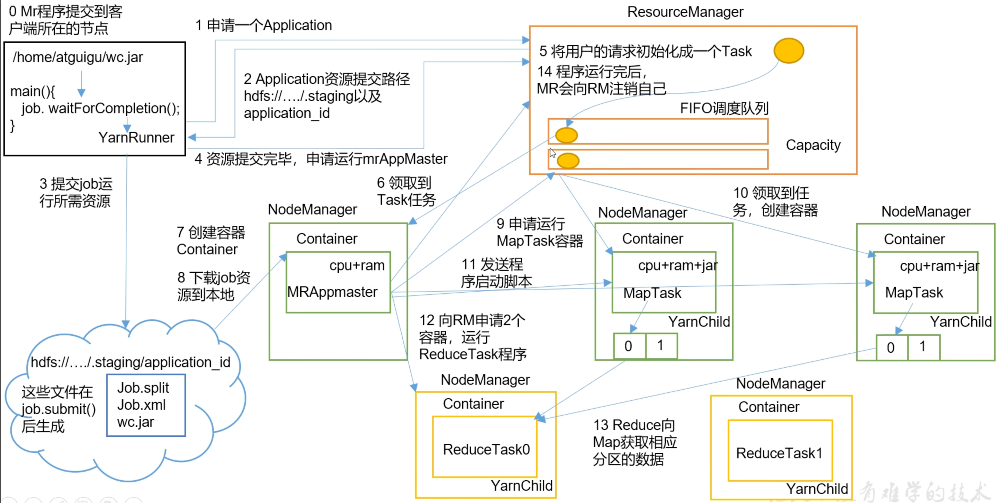 

1) MapReduce 程序提交到客户端所在节点
2) YarnRunner 向 ResourceManager 申请一个的Application
3) RM 将该应用程序的资源路径返回给 YarnRunner
4) 将程序运行所需资源提交到 HDFS 上
5) 程序资源提交完毕后，申请运行 MapReduceAppMaster
6) ResourceManager 将用户的请求初始化成一个任务
7) 其中一个 NodeManager 领取到 Task 任务
8) 该 NodeManager 创建容器 Container，并产生 MapReduceAppmaster
9) Container 从 HDFS 上拷贝资源到本地
10) MapReduceAppmaster 向 ResourceManager 申请运行 MapTask 资源
11) ResourceManager 将运行 MapTask 任务分配给另外两个 NodeManager，另两个NodeManager 分别领取任务并创建容器
12) MapReduce 向两个接收到任务的 NodeManager 发送程序启动脚本，这两个NodeManager分别启动MapTask
13) MapReduceAppMaster 等待所有 MapTask 运行完毕后，向 ResourceManager申请容器，运行 ReduceTask
14) ReduceTask 向 MapTask 获取相应分区的数据
15) 程序运行完毕后，MapReduce 向 ResourceManager 申请注销自己


#### Yarn 调度其和调度算法

目前，Hadoop 作业调度去主要有三种：FIFO、容量（Capacity Scheduler）和公平（Faire Scheduler）

1. **先进先出调度器（FIFO）**

FIFO调度器（First In First Out）：单队列，根据提交作业的先后顺序，先来先服务

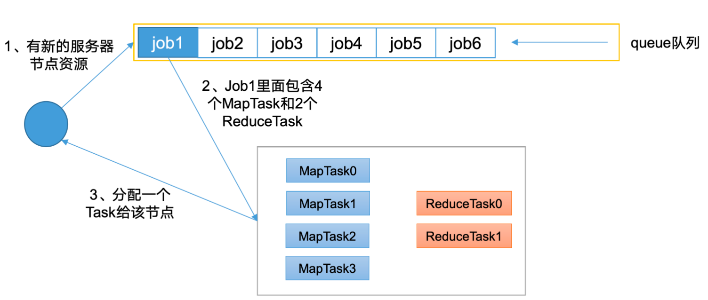

**优点**：简单

**缺点**：不支持多队列，生产环境很少使用


2. **容量调度器**

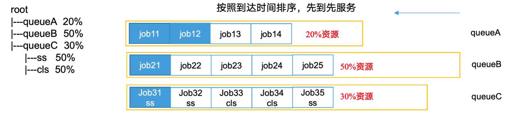

容量调度器（CapacityScheduler）是 Hadoop YARN（Yet Another Resource Negotiator）中的一个资源调度器，用于在多租户环境下高效地分配资源。它的设计目标是根据用户的需求和集群的资源，按照一定的规则（如公平性、容量要求、优先级等）分配资源。

**1、基本概念**

容量调度器是基于队列（Queue）的调度器，允许集群管理员为每个队列配置不同的资源容量。这些资源包括CPU，内存等

**核心要素**

- **队列**：集群的资源被分配到不同的队列，每个队列对应不同的用户组、应用或工作负载
- **队列容量**：每个队列有一个配置和资源容量，标识该队列可以使用集群资源的最大比例
- **资源分配规则**：容量调度器会根据队列的资源配置、队列中任务的需求以及队列的负载情况来动态分配资源

**2、容器调度器的工作原理**

容量调度器通过以下几个步骤来分配资源：

**（1）队列容量设置**

每个队列都能配置一个 最大资源容量，这是该队列在集群中能够占用的最大资源比例。例如，你可以为一个队列配置 50% 的资源，意味着该队列最多可以使用集群总资源的 50%

**（2）资源请求**

在一个集群中，用户提交作用（如 MapReduce作业、Spark 作业等）。每个作业会向 Yarn 提交一个 资源请求（如内存、CPU 核心等）

**（3）资源分配**

容量调度器会根据每个队列的资源配置和作业的需求来进行资源分配

- **队列的资源分配容量**：每个队列的配置容量决定了它在集群中最多能使用的资源量
- **队列的任务负载**：每个队列的任务负载决定了队列当前的资源需求，容量调度器会根据任务的需求动态调整需求动态分配资源
- **队列的优先级**：一些队列可能被设置为高优先级，允许它们在资源紧张时优先获得资源

**（4）资源分配策略**

容量调度器有不同的资源分配策略来确保资源的合理使用，常见的策略有：

- **硬性容量限制**：如果是一个队列已经占用了其配置的最大资源，那么其他队列就不能再占用这个队列的资源
- **超额资源分配**：如果某个队列的任务数量较少，队列可以暂时使用空闲的资源，但这种超额分配是有限制的，只有在资源充足的情况下才会发生
- **资源公平性**：容量调度通过公平性调度来保证资源不会过度集中在某个队列中，避免某些队列长时间没有资源。

**3、资源分配过程**

当 YARN 集群有多个作业提交时，容量调度器会按照以下顺序进行资源分配：

1. **计算各个队列的资源需求**：根据每个队列的资源配置和任务负载计算每个队列的资源需求。
2. **判断是否满足资源请求**：如果队列的资源需求超出了它的容量限制，容量调度器会为其分配可用资源，直到达到队列的最大容量。
3. **优先级与公平性调度**：如果某个队列需要的资源超过了其配置的容量限制，调度器会根据队列的优先级和资源公平性规则调整资源分配，以确保集群资源的公平使用。

**5. 容量调度器的优势**

- **资源隔离**：通过为不同队列分配资源容量，容量调度器能够在多租户环境下提供资源隔离，避免某个队列过度占用资源。
- **资源公平性**：能够确保不同队列之间的资源公平分配，防止某些队列由于资源不足而长时间没有任务得到执行。
- **灵活的队列配置**：管理员可以根据集群的负载需求灵活地配置不同队列的资源容量，满足不同用户和任务的需求。

**6. 常见问题与优化**

- **资源浪费**：如果某个队列资源分配过多，但没有足够的任务运行，可能会导致资源浪费。解决方法是动态调整队列的容量配置。
- **资源饥饿**：某些队列的任务可能得不到足够的资源，导致任务排队较长。解决方法是根据任务的优先级调整队列的资源分配策略。


3. **公平调度器**

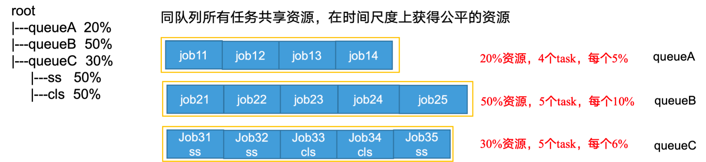

**公平调度器（Fair Scheduler）**Hadoop YARN 中的一种资源调度策略，旨在确保每个作业或任务能够公平地共享集群资源，而不会出现资源长期被某些作业或队列占用的情况。与容量调度器不同，公平调度器的核心思想是尽量保证每个作业获得公平的资源份额，避免某个作业占用过多资源，从而影响其他作业的执行

**公平调度器的基本原理：**

公平调度器的目标是 **公平地分配资源**，它的工作原理与容量调度器不同，主要基于以下几个原则：

1. **公平性**：
    公平调度器会根据作业的资源需求和当前集群的资源可用情况来分配资源。每个作业或队列（Job/Queue）都将尽量获得公平的资源份额，通常是按需分配的，但总资源不会超出集群的容量。
2. **动态资源分配**：
    公平调度器通过动态调整每个作业的资源分配，确保长时间没有执行的作业能优先获得资源。它会根据作业的等待时间和任务的资源需求，合理调度资源。
3. **资源权重**：
    公平调度器允许用户为作业指定权重，权重越高的作业，获得的资源越多。例如，一个需要更多资源的作业可以分配更高的权重，以保证它能够完成。
4. **最小资源保证**：
    公平调度器会为每个作业分配一个 **最小资源保证**，即使集群资源紧张，每个作业也能保证得到一些资源。
5. **负载均衡**：
    当集群中的某个队列或作业的资源使用率较低时，公平调度器会将空闲的资源分配给其他需要资源的作业，以保持集群资源的高效利用。

**公平调度器的特点：**

1. **负载均衡**：如果某个队列或作业的资源需求较低，空闲的资源会被其他作业所使用，避免了资源浪费。
2. **公平性**：公平调度器确保各个作业或队列得到相对公平的资源分配，避免了某些作业长期占用集群资源的情况。
3. **动态性**：公平调度器会根据作业的等待时间和资源需求，动态调整资源的分配方式，使集群中的所有作业在资源分配上保持公平。

**资源分配算法：**

公平调度器使用一种 **加权公平调度** 算法，该算法根据每个作业的资源需求和优先级分配资源。其核心思想是每个作业的资源分配尽量使得各个作业的资源使用率保持接近，避免某些作业占用过多资源而导致其他作业无法执行。

**公平调度器的工作过程：**

1. **任务提交**：当作业被提交到集群时，公平调度器会根据作业的资源需求以及队列的配置来确定资源的分配。
2. **资源分配**：调度器会将集群中的资源（如 CPU、内存等）根据队列的权重和作业的需求进行分配。
3. **空闲资源利用**：如果某些队列的资源使用率较低，调度器会动态调整，尽量将空闲资源分配给其他需要资源的队列或作业。
4. **任务执行**：作业启动后，调度器会根据任务的执行进度和集群负载情况调整资源的分配，确保公平分配资源并优化集群性能。

**总结：**

公平调度器通过动态调整资源分配、根据作业的资源需求和优先级确保公平性，避免了集群中资源分配的不均衡。与容量调度器相比，公平调度器更加灵活，适用于多租户环境中资源共享的场景。它能有效地保证集群中所有作业都能公平地使用集群资源，提高集群资源的利用率和作业执行的效率。


#### Yarn 的常用命令

**yarn application 查看任务**

```shell
yarn application -list # 列出所有 app
yarn application -list -appStates FINISHED # 过滤某状态 app
yarn application -kill application_1612577921195_0001 # kill掉app
```

**yarn logs 查看日志**

```shell
yarn logs -applicationId application_1612577921195_0001 # 查看app 日志 
yarn logs -applicationId application_1612577921195_0001 -containerId container_1612577921195_0001_01_000001 # 查看Container 日志
```

**yarn applicationattempt 查看尝试运行的任务**

```shell
yarn applicationattempt -list application_1612577921195_0001 # 查看所有 app 尝试运行的任务列表
yarn applicationattempt -status <ApplicationAttemptId> # 打印 appAttempt 状态
```

**yarn container 查看容器**

```shell
yarn container -list appattempt_1612577921195_0001_000001 # 查看容器
yarn container -status container_1612577921195_0001_01_000001 # 打印 Container 状态
```

**yarn node 查看节点状态**

```shell
yarn node -list -all # 查看节点状态
```

**yarn rmadmin 更新配置**

```shell
yarn rmadmin -refreshQueues # 更新配置
```

**yarn queue 查看队列**

```shell
yarn queue -status <QueueName> # 查看队列
```


###  HDFS 高可用

#### 概述

（1）所谓 HA（High Availability），即高可用（7*24小时不中断服务）

（2）实现高可用最关键的策略是消除单点故障。HA 严格来说应该分成各个组件的 HA 机制：HDFS  的 HA 和 YARN 的 HA

（3）NameNode 主要在以下两方面影响 HDFS 集群

- NameNode 机器发生以外，如宕机，集群将无法使用，直到管理员重启
- NameNode 机器需要升级，包括软件和硬件的升级

HDFS HA 功能通过配置多个NameNodes（Active/Standby）实现在集群中对 NameNode 的热备来解决上述问题。如果出现故障，如机器崩溃或机器需要升级维护，这时可通过这种方式将NameNode 很快的切换到另外一台机器上

  #### 核心问题

1）如何保持三台namenode 数据保持一致

- Fsimage：让一台 nn 生成数据，其他机器 nn 同步
- Edits：需要引入新的模块 JournalNode 来保证 edits 的文件的数据一致性

2）怎么让同时只有一台 nn 是 active，其他所有都是 standby 的

- 手动分配
- 自动分配

3）2nn 在 HA 架构中并不存在，定期合并 fsimage 和 edits 的活谁来干

- 由 standby 的 nn 来干

4）如果 nn 真的发生了问题，怎么让其他的 nn 上位干活

- 手动故障转移
- 自动故障转移

#### 高可用配置

**core-site.xml**

```xml
<configuration>
<!-- 把多个 NameNode 的地址组装成一个集群 mycluster -->
 <property>
   <name>fs.defaultFS</name>
   <value>hdfs://mycluster</value>
 </property>
<!-- 指定 hadoop 运行时产生文件的存储目录 -->
 <property>
   <name>hadoop.tmp.dir</name>
   <value>/opt/ha/hadoop-3.1.3/data</value>
 </property>
</configuration>
```

**hdfs-site.xml**

```xml
<configuration>
<!-- NameNode 数据存储目录 -->
 <property>
   <name>dfs.namenode.name.dir</name>
   <value>file://${hadoop.tmp.dir}/name</value>
 </property>
<!-- DataNode 数据存储目录 -->
 <property>
   <name>dfs.datanode.data.dir</name>
   <value>file://${hadoop.tmp.dir}/data</value>
 </property>
<!-- JournalNode 数据存储目录 -->
 <property>
   <name>dfs.journalnode.edits.dir</name>
   <value>${hadoop.tmp.dir}/jn</value>
 </property>    
<!-- 完全分布式集群名称 -->
 <property>
   <name>dfs.nameservices</name>
   <value>mycluster</value>
 </property>
<!-- 集群中 NameNode 节点都有哪些 -->
 <property>
   <name>dfs.ha.namenodes.mycluster</name>
   <value>nn1,nn2,nn3</value>
 </property>
<!-- NameNode 的 RPC 通信地址 -->
 <property>
   <name>dfs.namenode.rpc-address.mycluster.nn1</name>
   <value>hadoop102:8020</value>
 </property>
 <property>
   <name>dfs.namenode.rpc-address.mycluster.nn2</name>
   <value>hadoop103:8020</value>
 </property>
 <property>
   <name>dfs.namenode.rpc-address.mycluster.nn3</name>
   <value>hadoop104:8020</value>
 </property>
<!-- NameNode 的 http 通信地址 -->
 <property>
   <name>dfs.namenode.http-address.mycluster.nn1</name>
   <value>hadoop102:9870</value>
 </property>
 <property>
   <name>dfs.namenode.http-address.mycluster.nn2</name>
   <value>hadoop103:9870</value>
 </property>
 <property>
 <name>dfs.namenode.http-address.mycluster.nn3</name>
 <value>hadoop104:9870</value>
 </property>
<!-- 指定 NameNode 元数据在 JournalNode 上的存放位置 -->
 <property>
  <name>dfs.namenode.shared.edits.dir</name>
  <value>qjournal://hadoop102:8485;hadoop103:8485;hadoop104:8485/myclus
ter</value>
 </property>
<!-- 访问代理类：client 用于确定哪个 NameNode 为 Active -->
 <property>
 <name>dfs.client.failover.proxy.provider.mycluster</name>
  <value>org.apache.hadoop.hdfs.server.namenode.ha.ConfiguredFailoverProxyP
rovider</value>
 </property>
<!-- 配置隔离机制，即同一时刻只能有一台服务器对外响应 -->
 <property>
   <name>dfs.ha.fencing.methods</name>
   <value>sshfence</value>
 </property>
<!-- 使用隔离机制时需要 ssh 秘钥登录-->
 <property>
   <name>dfs.ha.fencing.ssh.private-key-files</name>
   <value>/home/atguigu/.ssh/id_rsa</value>
 </property>
</configuration>
```

#### HDFS-HA 自动模式

​	自动故障转移为 HDFS 部署增加了两个新组件：ZooKeeper 和 ZKFailoverController（ZKFC）进程，如图所示。Zookeeper 是维护少量协调数据，通知客户端这些数据的改变和监控客户端故障的高可用服务。

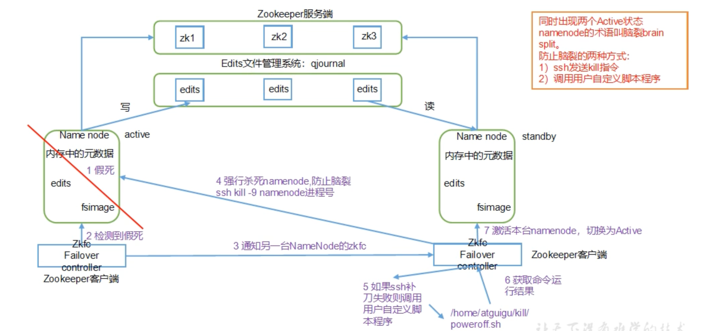

#### 故障转移配置

（1）hdfs-site.xml

```xml
<!-- 启用 nn 故障自动转移 -->
<property>
  <name>dfs.ha.automatic-failover.enabled</name>
  <value>true</value>
</property>
```

（2）core-site.xml

```xml
<property>
  <name>ha.zookeeper.quorum</name>
  <value>hadoop102:2181,hadoop103:2181,hadoop104:2181</value>
</property> 
```

### Yarn 高可用

#### Yarn 高可用的工作机制

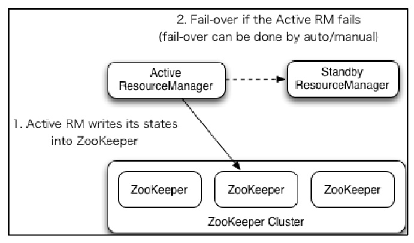

#### 核心问题

1）如果当前 active  rm 挂了，其他 rm 怎么将其他的 standby rm 上位

- 核心原理跟 HDFS 一样，利用了 zk 的临时节点

2）当前 rm 上有很多的计算程序在等待运行，其他的 rm 怎么将这些程序接手过来接着跑

- rm 会将当前的所有计算程序的状态存储在 zk 中,其他 rm 上位后会去读取，然后接

  着跑

#### 配置 Yarn-HA 集群

**yarn-site.xml**

```xml
<configuration>
 <property>
     <name>yarn.nodemanager.aux-services</name>
     <value>mapreduce_shuffle</value>
 </property>
 <!-- 启用 resourcemanager ha -->
 <property>
     <name>yarn.resourcemanager.ha.enabled</name>
     <value>true</value>
 </property>
 <!-- 声明两台 resourcemanager 的地址 -->
 <property>
     <name>yarn.resourcemanager.cluster-id</name>
     <value>cluster-yarn1</value>
 </property>
 <!--指定 resourcemanager 的逻辑列表-->
 <property>
     <name>yarn.resourcemanager.ha.rm-ids</name>
     <value>rm1,rm2,rm3</value>
</property>
<!-- ========== rm1 的配置 ========== -->
<!-- 指定 rm1 的主机名 -->
 <property>
     <name>yarn.resourcemanager.hostname.rm1</name>
     <value>hadoop102</value>
</property>
<!-- 指定 rm1 的 web 端地址 -->
<property>
     <name>yarn.resourcemanager.webapp.address.rm1</name>
     <value>hadoop102:8088</value>
</property>
<!-- 指定 rm1 的内部通信地址 -->
<property>
     <name>yarn.resourcemanager.address.rm1</name>
     <value>hadoop102:8032</value>
</property>
<!-- 指定 AM 向 rm1 申请资源的地址 -->
<property>
     <name>yarn.resourcemanager.scheduler.address.rm1</name> 
     <value>hadoop102:8030</value>
</property>
<!-- 指定供 NM 连接的地址 --> 
<property>
     <name>yarn.resourcemanager.resource-tracker.address.rm1</name>
     <value>hadoop102:8031</value>
</property>
<!-- ========== rm2 的配置 ========== -->
 <!-- 指定 rm2 的主机名 -->
 <property>
     <name>yarn.resourcemanager.hostname.rm2</name>
     <value>hadoop103</value>
</property>
<property>
 <name>yarn.resourcemanager.webapp.address.rm2</name>
 <value>hadoop103:8088</value>
</property>
<property>
     <name>yarn.resourcemanager.address.rm2</name>
     <value>hadoop103:8032</value>
</property>
<property>
     <name>yarn.resourcemanager.scheduler.address.rm2</name>
     <value>hadoop103:8030</value>
</property>
<property>
     <name>yarn.resourcemanager.resource-tracker.address.rm2</name>
     <value>hadoop103:8031</value>
</property>
<!-- ========== rm3 的配置 ========== -->
<!-- 指定 rm1 的主机名 -->
 <property>
     <name>yarn.resourcemanager.hostname.rm3</name>
     <value>hadoop104</value>
</property>
<!-- 指定 rm1 的 web 端地址 -->
<property>
     <name>yarn.resourcemanager.webapp.address.rm3</name>
     <value>hadoop104:8088</value>
</property>
<!-- 指定 rm1 的内部通信地址 -->
<property>
     <name>yarn.resourcemanager.address.rm3</name>
     <value>hadoop104:8032</value>
</property>
<!-- 指定 AM 向 rm1 申请资源的地址 -->
<property>
     <name>yarn.resourcemanager.scheduler.address.rm3</name> 
     <value>hadoop104:8030</value>
</property>
<!-- 指定供 NM 连接的地址 --> 
<property>
     <name>yarn.resourcemanager.resource-tracker.address.rm3</name>
     <value>hadoop104:8031</value>
</property>
 <!-- 指定 zookeeper 集群的地址 --> 
 <property>
     <name>yarn.resourcemanager.zk-address</name>
     <value>hadoop102:2181,hadoop103:2181,hadoop104:2181</value>
 </property>
 <!-- 启用自动恢复 --> 
 <property>
     <name>yarn.resourcemanager.recovery.enabled</name>
 <value>true</value>
 </property>
 <!-- 指定 resourcemanager 的状态信息存储在 zookeeper 集群 --> 
 <property>
     <name>yarn.resourcemanager.store.class</name> 
    <value>org.apache.hadoop.yarn.server.resourcemanager.recovery.ZKRMStateSt
ore</value>
</property>
<!-- 环境变量的继承 -->
<property>
 <name>yarn.nodemanager.env-whitelist</name>
 
<value>JAVA_HOME,HADOOP_COMMON_HOME,HADOOP_HDFS_HOME,HADOOP_CONF_DIR,CLAS
SPATH_PREPEND_DISTCACHE,HADOOP_YARN_HOME,HADOOP_MAPRED_HOME</value>
 </property>
</configuration>
```

## Hadoop部署

### 环境搭建

**1、设置静态 IP**

```
vim /etc/sysconfig/network-scripts/ifcfg-ens33改成

DEVICE=ens33
TYPE=Ethernet
ONBOOT=yes
BOOTPROTO=static
NAME="ens33"
IPADDR=192.168.10.102
PREFIX=24
GATEWAY=192.168.10.2
DNS1=192.168.10.2
```

**2、安装基础工具**

```shell
yum install -y epel-release // 额外软件包
yum install -y net-tools // 网络工具 
yum install -y vim //修改
```

**3、关闭防火墙**

```
systemctl stop firewalld
systemctl disable firewalld.service
```

### HDFS 配置

#### HDFS 生产环境核心参数

#### core-site.xml

主要用于定义 Hadoop 客户端与分布式文件系统（HDFS）、服务间通信（IPC）相关的基础参数，以及代理用户、日志、压缩等通用配置。以下是每个配置项的具体含义：

1. **基础文件系统配置**

```xml
<property>
    <name>fs.defaultFS</name>
    <value>hdfs://haclusterdev</value>
</property>
```

- 含义：指定 Hadoop 客户端默认使用的文件系统 URI
- 作用：这里配置为 `hdfs://haclusterdev`，表示默认使用 HDFS 集群，且 `haclusterdev`  是HDFS HA 集群的逻辑名称（客户端通过该名称自动关联 Active NameNode，无需指定具体节点）

2. **Zookeeper 集群地址（HA依赖）**

```xml
<property>
    <name>ha.zookeeper.quorum</name>
    <value>1.hadoopdev.com:2181,2.hadoopdev.com:2181,3.hadoopdev.com:2181</value>
</property>
```

- 含义：指定 HDFS HA（高可用）集群依赖的 Zookeeper 集群地址
- 作用：Zookeeper 用于存储 HDFS Active NameNode 的状态信息，实现自动故障转移，通过 Zookeeper 选举新的Active 节点）。这里配置了 3 个 Zookeeper节点（默认端口2181），保证高可用。

3. **IO缓冲区 大小**

```xml
<property>
    <name>io.file.buffer.size</name>
    <value>131072</value>
</property>
```

- 含义：定义 Hadoop 读写文件时的缓冲区大小，单位为字节
- 作用：缓冲区用于临时存储读写数据，减少磁盘 IO 次数，提高效率。

4. **Hadoop 临时目录**

```xml
<property>
    <name>hadoop.tmp.dir</name>
    <value>/data1/hadoop/tmp-hadoop-${user.name}</value>
</property>
```

- 含义：指定Hadoop 运行的临时文件存储目录，${user.name}标识替换成当前用户名
- 作用：Hadoop 的很多组件（如 HDFS、MapReduce）会产生临时文件（如中间结果、锁文件），默认路径依赖此配置。自定义路径可避免系统临时目录（如 /tmp）因空间不足或权限问题导致的故障

5. **启动原生库**

```xml
<property>
    <name>hadoop.native.lib</name>
    <value>true</value>
</property>
```

- 含义：是否启用 Hadoop 的原生库（通常是 C 语言实现的库，如压缩、IO 操作优化）
- 作用：原生库能够显著提升性能

6. **回收保留时间**

```xml
<property>
    <name>fs.trash.interval</name>
    <value>1440</value>
</property>
```

7. **代理用户配置（多服务访问 HDFS 需配置）**

以下配置用于允许特定服务（如 Hue、Oozie、Livy）**代理其他用户**操作 HDFS（因服务本身可能以自身账号运行，但需要访问不同用户的数据）。

```xml
<!-- 允许 biadmin 用户从任意主机代理其他用户，仅允许代理 biadmin 组 -->
<property>
    <name>hadoop.proxyuser.biadmin.hosts</name>
    <value>*</value>
</property>
<property>
    <name>hadoop.proxyuser.biadmin.groups</name>
    <value>biadmin</value>
</property>

<!-- 允许 livy（Spark 服务）从任意主机代理任意用户组 -->
<property>
    <name>hadoop.proxyuser.livy.groups</name>
    <value>*</value>
</property>
<property>
    <name>hadoop.proxyuser.livy.hosts</name>
    <value>*</value>
</property>

<!-- 允许 hue（UI 工具）从任意主机代理任意用户组 -->
<property>
    <name>hadoop.proxyuser.hue.hosts</name>
    <value>*</value>
</property>
<property>
    <name>hadoop.proxyuser.hue.groups</name>
    <value>*</value>
</property>

<!-- 允许 oozie（工作流调度）从任意主机代理任意用户组 -->
<property>
    <name>hadoop.proxyuser.oozie.hosts</name>
    <value>*</value>
</property>
<property>
    <name>hadoop.proxyuser.oozie.groups</name>
    <value>*</value>
</property>
```

- 参数说明：
  - `hadoop.proxyuser.XXX.hosts`：允许 XXX 服务从哪些主机发起代理
  - `hadoop.proxyuser.XXX.groups`：循序 XXX 服务代理哪些用户组
- 作用：例如，Hue 作为前端工具，用户通过 Hue 操作 HDFS 时，Hue 需以自身账号（如 hue）代理登录用户（如 user1）的身份，否则会因权限不足无法访问 user1 的文件。

8. **日志文件大小与数量限制**

```xml
<property>
    <name>hadoop.logfile.size</name>
    <value>104857600</value>
</property>
<property>
    <name>hadoop.logfile.count</name>
    <value>20</value>
</property>
```

- 含义：
  - `hadoop.logfile.size`：单个日志文件的最大大小，单位为字节
  - `hadoop.logfile.count`：日志文件的最大保存数量，超过后删除最旧的日志
- 作用：控制 Hadoop 服务（如DataNode、NameNode）日志文件的磁盘占用

9. **支持的压缩算法**

```xml
<property>
    <name>io.compression.codecs</name>
    <value>org.apache.hadoop.io.compress.GzipCodec,org.apache.hadoop.io.compress.DefaultCodec, org.apache.hadoop.io.compress.BZip2Codec, org.apache.hadoop.io.compress.SnappyCodec</value>
</property>
```

- 含义：Hadoop 支持的压缩算法（codec 类路径）
- 作用：在 MapReduce 输出、HDFS 文件存储等场景中，可指定使用这些算法压缩数据（如 `Snappy` 压缩速度快，`Gzip` 压缩率高），减少磁盘占用和网络传输量。

10. **IPC 客户端连接超时时间**

```xml
<property>
    <name>ipc.client.connect.timeout</name>
    <value>60000</value>
</property>
```

- 含义：Hadoop 进程间通信（IPC，如客户端连接 NameNode、DataNode 连接 NameNode）的连接超时时间，单位为毫秒
- 作用：避免客户端因网络故障或服务未启动而无限等待连接

#### hdfs-site.xml

1. **高可用（HA）基本配置**

```xml
<property>
    <name>dfs.nameservices</name>
    <value>haclusterdev</value>
</property>
```

- 含义：定义HDFS 集群的逻辑名称（如命名服务），客户端通过此名称访问集群，无需关心具体节点
- 作用：在 HA 模式下，客户端使用 hdfs://haclusterdev 访问 HDFS，而非直接连接 NameNode 主机

2. **NameNode 配置**

```xml
<property>
    <name>dfs.ha.namenodes.haclusterdev</name>
    <value>n1,n2</value>
</property>
```

- 含义：制定 haclusterdev 集群中两个 NameNode 的逻辑 ID
- 作用：两个NameNode 互为热备，一个 Active 处理请求，另一个 Standby 同步元数据

3. **共享编辑日志（JournalNode）配置**

```xml
<property>
    <name>dfs.namenode.shared.edits.dir</name>
    <value>qjournal://1.hadoopdev.com:8485;2.hadoopdev.com:8485;3.hadoopdev.com:8485/haclusterdev</value>
</property>
```

- 含义：指定 NameNode 间同步编辑日志的 JournalNode 集群地址
- 作用：Active NameNode 将编辑写入 JournalNode，Standby 从 JournalNode 读取以保持元数据同步

4. **故障转移配置**

```xml
<property>
    <name>dfs.client.failover.proxy.provider.haclusterdev</name>
    <value>org.apache.hadoop.hdfs.server.namenode.ha.ConfiguredFailoverProxyProvider</value>
</property>
```

- 含义：指定客户端故障转移代理类，用于自动发现 Active NameNode
- 作用：当 Active 节点故障时，客户端通过此代理重新连接到新的 Active 节点。

```xml
<property>
    <name>dfs.ha.fencing.methods</name>
    <value>sshfence(${user.name}:39000)</value>
</property>
```

- 含义：定义故障转移时隔离旧的 Active NameNode 方法（SSH 隔离）
- 作用：当发生故障转移时，通过 SSH 连接到 旧Active 节点并停止其服务，防止脑裂

5. **数据存储配置**

```xml
<property>
    <name>dfs.namenode.name.dir</name>
<value>file:/data1/haclusterdev/hadoop/dfs.namenode.name.dir,file:/data2/haclusterdev/hadoop/dfs.namenode.name.dir</value>
</property>
```

- 含义：NameNode 存储命令空间和块映射的本地路径（多目录提高可靠性）

```xml
<property>
    <name>dfs.datanode.data.dir</name>
    <value>file:/data1/haclusterdev/hadoop/datanode,file:/data2/haclusterdev/hadoop/datanode</value>
</property>
```

- 含义：DataNode 存储实际数据块的本地地址

6. **性能优化参数**

```xml
<property>
    <name>dfs.replication</name>
    <value>2</value>
</property>
```

- 含义：HDFS 数据块副本数（默认3，此处设置为2，会节省存储但是会降低容错性）

```xml
<property>
    <name>dfs.blocksize</name>
    <value>268435456</value>
</property>
```

- 含义：HDFS 块大小（256MB，默认128MB，大文件场景可提供吞吐量）

```xml
<property>
    <name>dfs.namenode.handler.count</name>
    <value>100</value>
</property>
```

- 含义：NameNode 处理客户端请求的线程数（默认为10，高并发场景需要调大）

7. **安全和权限配置**

```xml
<property>
    <name>dfs.permissions.enabled</name>
    <value>true</value>
</property>
<property>
    <name>dfs.namenode.acls.enabled</name>
    <value>true</value>
</property>
```

- 含义：启用 HDFS 文件权限检查和 ACL（访问控制列表）支持

- 作用：确保用户可访问或修改文件，ACL 提供更加细粒度的权限控制

8. **网络与超时配置**

```xml
<property>
    <name>dfs.datanode.socket.write.timeout</name>
    <value>800000</value>
</property>
```

- 含义：DataNode 写入超时时间（800秒，大文件传输武场景需延长）

```xml
<property>
    <name>heartbeat.recheck.interval</name>
    <value>300000</value>
</property>
<property>
    <name>dfs.heartbeat.interval</name>
    <value>3</value>
</property>
```

- 含义：NameNode 检查 DataNode 心跳的间隔（3秒）和重新检查的超时时间（300秒）

9. **Zookeeper 与自动故障转移**

```xml
<property>
    <name>ha.zookeeper.session-timeout.ms</name>
    <value>20000</value>
</property>
```

- 含义：Zookeeper绘绘画超过20秒后，认为连接失效

```xml
<property>
    <name>dfs.ha.automatic-failover.enabled</name>
    <value>true</value>
</property>
```

- 含义：启用自动故障转移（依赖 ZooKeeper），当 Active NameNode 故障时自动切换到 Standby。

#### mapred-site.xml

你提供的是 Hadoop MapReduce 运行在 YARN 上的核心配置（通常位于 `mapred-site.xml`），主要用于配置 MapReduce 与 YARN 的集成方式、资源分配（内存 / CPU）、作业历史记录存储等关键参数。以下是每个配置项的详细解释：

1. **基础框架配置**

```xml
<property>
    <name>mapreduce.framework.name</name>
    <value>yarn</value>
</property>
```

- **作用**：指定 MapReduce 运行的框架，`yarn` 表示 MapReduce 任务由 YARN 进行资源管理和调度（替代传统的 `local` 本地模式或 `classic` 独立模式）。
- **意义**：这是 MapReduce 与 YARN 集成的核心开关，开启后 YARN 会为 Map/Reduce 任务分配容器（Container），统一管理集群资源。

2. **内存资源配置**

**Map 任务内存**

```xml
<property>
    <name>mapreduce.map.memory.mb</name>
    <value>1024</value>
    <description>单个Map任务可用的内存（MB），需与YARN的yarn.scheduler.minimum-allocation-mb一致</description>
</property>
```

- **作用**：定义每个 Map 任务在 YARN 中申请的容器内存大小（1024MB）。
- **关联配置**：必须 ≥ YARN 的 `yarn.scheduler.minimum-allocation-mb`（YARN 最小容器内存，默认 1024MB），否则 YARN 无法分配资源。
- **注意**：内存不足会导致任务 OOM（内存溢出），需根据实际数据量调整（如处理大文件可设为 2048MB）。

**Reduce 任务内存**

```xml
<property>
    <name>mapreduce.reduce.memory.mb</name>
    <value>1024</value>
    <description>建议为2倍的mapreduce.map.memory.mb</description>
</property>
```

- **作用**：定义每个 Reduce 任务的容器内存大小（1024MB）。
- **实际建议**：Reduce 需处理多个 Map 的输出（排序、合并），通常需要更多内存，建议设为 Map 内存的 2-3 倍（如 2048MB），避免 Shuffle 阶段内存不足。

**Map/Reduce 任务的 JVM 堆内存**

```xml
<property>
    <name>mapreduce.map.java.opts</name>
    <value>-Xmx1024m</value>
    <description>建议为0.8倍的mapreduce.map.memory.mb</description>
</property>

<property>
    <name>mapreduce.reduce.java.opts</name>
    <value>-Xmx1024m</value>
    <description>建议为0.8倍的mapreduce.reduce.memory.mb</description>
</property>
```

- **作用**：指定 Map/Reduce 任务运行时的 JVM 堆内存上限（`-Xmx` 参数）。
- **最佳实践**：通常设为对应容器内存的 70%-80%（例如 Map 容器内存 1024MB 时，堆内存设为 819MB = 0.8×1024），预留部分内存给操作系统和其他进程，避免 OOM。
- **问题**：若堆内存 > 容器内存，会导致 YARN 杀死容器（资源超限）；若过小，会导致 JVM 频繁 GC 或堆溢出。

3. **CPU资源配置**

```xml
<property>
    <name>yarn.app.mapreduce.am.resource.cpu-vcores</name>
    <value>2</value>
    <description>MRAppMaster需要的虚拟CPU数量，默认1</description>
</property>
```

- **作用**：配置 MapReduce 应用主控（MRAppMaster）的 CPU 核心数。MRAppMaster 负责协调 Map/Reduce 任务（如任务分配、进度跟踪），通常需要比普通任务更多的 CPU 资源。
- **意义**：合理设置可避免 AM 成为瓶颈（尤其大作业时）。

4. **作业历史记录配置**

**历史服务器地址**

```xml
<property>
    <name>mapreduce.jobhistory.address</name>
    <value>1.hadoopdev.com:10020</value>
</property>

<property>
    <name>mapreduce.jobhistory.webapp.address</name>
    <value>1.hadoopdev.com:19888</value>
    <description>MapReduce JobHistory Server Web端口</description>
</property>
```

- **作用**：
  - `mapreduce.jobhistory.address`：JobHistory 服务器的 RPC 地址（用于接收作业历史数据）。
  - `mapreduce.jobhistory.webapp.address`：JobHistory Web 界面地址（通过浏览器查看作业日志、进度、统计信息）。
- **意义**：MapReduce 任务完成后，日志会汇总到 JobHistory 服务器，便于后续排查问题（如任务失败原因）。

**作业存储目录**

```xml
<property>
    <name>yarn.app.mapreduce.am.staging-dir</name>
    <value>/mapreduceLog</value>
</property>

<property>
    <name>mapreduce.jobhistory.done-dir</name>
    <value>${yarn.app.mapreduce.am.staging-dir}/history/done</value>
    <description>存放已经运行完的Hadoop作业记录</description>
</property>

<property>
    <name>mapreduce.jobhistory.intermediate-done-dir</name>
    <value>${yarn.app.mapreduce.am.staging-dir}/history/done_intermediate</value>
    <description>正在运行的Hadoop作业记录</description>
</property>
```

- **作用**：
  - `staging-dir`：作业的临时工作目录（存放配置文件、中间结果、日志等），默认是 `/tmp/hadoop-yarn/staging`，这里改为 `/mapreduceLog` 可避免 `/tmp` 目录定期清理导致的文件丢失。
  - `done-dir`：已完成作业的历史记录存储目录。
  - `intermediate-done-dir`：运行中作业的临时历史记录目录。
- **意义**：集中管理作业数据，确保历史记录可追溯。

5. **作业队列与监控**

```xml
<property>
    <name>mapreduce.job.queuename</name>
    <value>lx_realtime</value>
</property>
```

- **作用**：指定 MapReduce 作业提交到 YARN 的资源队列（`lx_realtime`）。
- **意义**：YARN 通过队列管理资源（如隔离生产 / 测试作业、分配资源配额），确保关键作业优先运行。

```xml
<property>
    <name>mapreduce.job.emit-timeline-data</name>
    <value>true</value>
    <description>是否向Timeline服务器发送数据</description>
</property>
```

- **作用**：开启后，MRAppMaster 会向 YARN Timeline Server 发送作业时间线数据（如任务启动 / 结束时间、资源使用情况）。
- **意义**：用于集群监控和作业诊断（需配合 Timeline Server 使用）。 

### Yarn 配置

#### **yarn 生产环境核心参数**

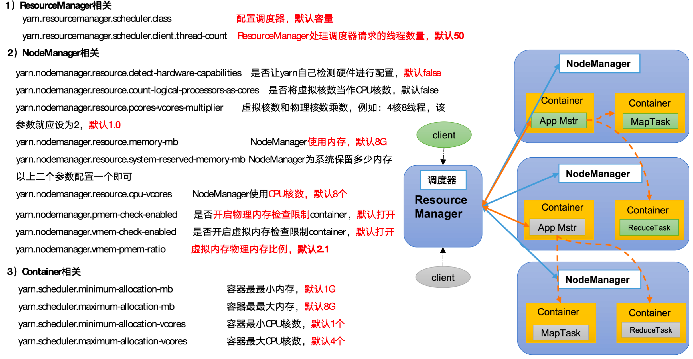

#### **yarn-site.xml**

```xml
<!-- 选择调度器，默认容量 -->
<property>
	<description>The class to use as the resource scheduler.</description>
	<name>yarn.resourcemanager.scheduler.class</name>
	<value>org.apache.hadoop.yarn.server.resourcemanager.scheduler.capacity.CapacityScheduler</value>
</property>

<!-- ResourceManager处理调度器请求的线程数量,默认50；如果提交的任务数大于50，可以增加该值，但是不能超过3台 * 4线程 = 12线程（去除其他应用程序实际不能超过8） -->
<property>
	<description>Number of threads to handle scheduler interface.</description>
	<name>yarn.resourcemanager.scheduler.client.thread-count</name>
	<value>8</value>
</property>

<!-- 是否让yarn自动检测硬件进行配置，默认是false，如果该节点有很多其他应用程序，建议手动配置。如果该节点没有其他应用程序，可以采用自动 -->
<property>
	<description>Enable auto-detection of node capabilities such as
	memory and CPU.
	</description>
	<name>yarn.nodemanager.resource.detect-hardware-capabilities</name>
	<value>false</value>
</property>

<!-- 是否将虚拟核数当作CPU核数，默认是false，采用物理CPU核数 -->
<property>
	<description>Flag to determine if logical processors(such as
	hyperthreads) should be counted as cores. Only applicable on Linux
	when yarn.nodemanager.resource.cpu-vcores is set to -1 and
	yarn.nodemanager.resource.detect-hardware-capabilities is true.
	</description>
	<name>yarn.nodemanager.resource.count-logical-processors-as-cores</name>
	<value>false</value>
</property>

<!-- 虚拟核数和物理核数乘数，默认是1.0 -->
<property>
	<description>Multiplier to determine how to convert phyiscal cores to
	vcores. This value is used if yarn.nodemanager.resource.cpu-vcores
	is set to -1(which implies auto-calculate vcores) and
	yarn.nodemanager.resource.detect-hardware-capabilities is set to true. The	number of vcores will be calculated as	number of CPUs * multiplier.
	</description>
	<name>yarn.nodemanager.resource.pcores-vcores-multiplier</name>
	<value>1.0</value>
</property>

<!-- NodeManager使用内存数，默认8G，修改为4G内存 -->
<property>
	<description>Amount of physical memory, in MB, that can be allocated 
	for containers. If set to -1 and
	yarn.nodemanager.resource.detect-hardware-capabilities is true, it is
	automatically calculated(in case of Windows and Linux).
	In other cases, the default is 8192MB.
	</description>
	<name>yarn.nodemanager.resource.memory-mb</name>
	<value>4096</value>
</property>

<!-- nodemanager的CPU核数，不按照硬件环境自动设定时默认是8个，修改为4个 -->
<property>
	<description>Number of vcores that can be allocated
	for containers. This is used by the RM scheduler when allocating
	resources for containers. This is not used to limit the number of
	CPUs used by YARN containers. If it is set to -1 and
	yarn.nodemanager.resource.detect-hardware-capabilities is true, it is
	automatically determined from the hardware in case of Windows and Linux.
	In other cases, number of vcores is 8 by default.</description>
	<name>yarn.nodemanager.resource.cpu-vcores</name>
	<value>4</value>
</property>

<!-- 容器最小内存，默认1G -->
<property>
	<description>The minimum allocation for every container request at the RM	in MBs. Memory requests lower than this will be set to the value of this	property. Additionally, a node manager that is configured to have less memory	than this value will be shut down by the resource manager.
	</description>
	<name>yarn.scheduler.minimum-allocation-mb</name>
	<value>1024</value>
</property>

<!-- 容器最大内存，默认8G，修改为2G -->
<property>
	<description>The maximum allocation for every container request at the RM	in MBs. Memory requests higher than this will throw an	InvalidResourceRequestException.
	</description>
	<name>yarn.scheduler.maximum-allocation-mb</name>
	<value>2048</value>
</property>

<!-- 容器最小CPU核数，默认1个 -->
<property>
	<description>The minimum allocation for every container request at the RM	in terms of virtual CPU cores. Requests lower than this will be set to the	value of this property. Additionally, a node manager that is configured to	have fewer virtual cores than this value will be shut down by the resource	manager.
	</description>
	<name>yarn.scheduler.minimum-allocation-vcores</name>
	<value>1</value>
</property>

<!-- 容器最大CPU核数，默认4个，修改为2个 -->
<property>
	<description>The maximum allocation for every container request at the RM	in terms of virtual CPU cores. Requests higher than this will throw an
	InvalidResourceRequestException.</description>
	<name>yarn.scheduler.maximum-allocation-vcores</name>
	<value>2</value>
</property>

<!-- 虚拟内存检查，默认打开，修改为关闭 -->
<property>
	<description>Whether virtual memory limits will be enforced for
	containers.</description>
	<name>yarn.nodemanager.vmem-check-enabled</name>
	<value>false</value>
</property>

<!-- 虚拟内存和物理内存设置比例,默认2.1 -->
<property>
	<description>Ratio between virtual memory to physical memory when	setting memory limits for containers. Container allocations are	expressed in terms of physical memory, and virtual memory usage	is allowed to exceed this allocation by this ratio.
	</description>
	<name>yarn.nodemanager.vmem-pmem-ratio</name>
	<value>2.1</value>
</property>
```


## Hadoop 生产调优

### 1 HDFS  核心参数

#### 1.1 NameNode 生产配置

**1）NameNode 内存计算**

​	每个文件块大概占用150byte，一台服务器128G内存为例，能存储多少文件块呢？

​	128 * 1024 * 1024 * 1024  / 150Byte ≈ 9.1亿

**2）配置NameNode 内存** 

在hadoop-env.sh 中添加

```shell
HADOOP_NAMENODE_OPTS=-Xmx3072m
```

#### 1.2 NameNode心跳并发配置

**1）hdfs-site.xml**

```xml
NameNode有一个工作线程池，用来处理不同DataNode的并发心跳以及客户端并发的元数据操作。
对于大集群或者有大量客户端的集群来说，通常需要增大该参数。默认值是10。
<property>
    <name>dfs.namenode.handler.count</name>
    <value>21</value>
</property>
```

#### 1.3 开启回收站配置

开启回收站功能，可以将删除的文件在不超时的情况下，恢复原数据，起到防止误删除、备份等作用。

**1）**回收站机制

 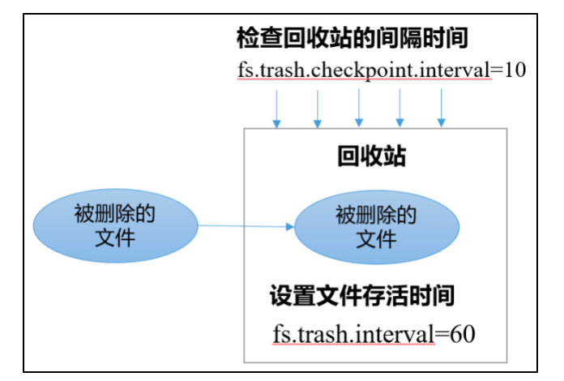

**2）**开启回收站功能参数说明

- 默认值fs.trash.interval = 0，0表示禁用回收站；其他值表示设置文件的存活时间。

- 默认值fs.trash.checkpoint.interval = 0，检查回收站的间隔时间。如果该值为0，则该值设置和fs.trash.interval的参数值相等。

- 要求fs.trash.checkpoint.interval <= fs.trash.interval。

**3）** 启用回收站

修改core-site.xml，配置垃圾回收为1分钟

```xml
<property>
    <name>fs.trash.interval</name>
    <value>1</value>
</property>
```

**4）**查看回收站

回收站目录在HDFS集群中的路径：/user/atguigu/.Trash/….

**5）**注意：通过网页上直接删除的文件也不会走回收站。

**6）**通过程序删除的文件不会经过回收站，需要调用moveToTrash()才进入回收站

```
Trash trash = New Trash(conf);
trash.moveToTrash(path);
```

**7）**只有在命令行利用hadoop fs -rm 命令删除才会走回收站

**8）**恢复回收站数据

```
[atguigu@hadoop102 hadoop-3.1.3]$ hadoop fs -mv
/user/atguigu/.Trash/Current/user/atguigu/input    /user/atguigu/input
```

 ### 2 HDFS - 集群压测

#### 2.1 测试 HDFS 写性能

1）测试内容：向 HDFS 集群写 10 个 128 M的文件

```shell
[atguigu@hadoop102 mapreduce]$ hadoop jar /opt/module/hadoop-3.1.3/share/hadoop/mapreduce/hadoop-mapreduce-client-jobclient-3.1.3-tests.jar TestDFSIO -write -nrFiles 10 -fileSize 128MB

2021-02-09 10:43:16,853 INFO fs.TestDFSIO: ----- TestDFSIO ----- : write
2021-02-09 10:43:16,854 INFO fs.TestDFSIO:             Date & time: Tue Feb 09 10:43:16 CST 2021
2021-02-09 10:43:16,854 INFO fs.TestDFSIO:         Number of files: 10
2021-02-09 10:43:16,854 INFO fs.TestDFSIO:  Total MBytes processed: 1280
2021-02-09 10:43:16,854 INFO fs.TestDFSIO:       Throughput mb/sec: 1.61
2021-02-09 10:43:16,854 INFO fs.TestDFSIO:  Average IO rate mb/sec: 1.9
2021-02-09 10:43:16,854 INFO fs.TestDFSIO:   IO rate std deviation: 0.76
2021-02-09 10:43:16,854 INFO fs.TestDFSIO:      Test exec time sec: 133.05
2021-02-09 10:43:16,854 INFO fs.TestDFSIO:
```

- Number of files：生成mapTask数量，一般是集群中（CPU核数-1），我们测试虚拟机就按照实际的物理内存-1分配即可

- Total MBytes processed：单个map处理的文件大小

- Throughput mb/sec：单个mapTak的吞吐量 
  - 计算方式：处理的总文件大小/每一个mapTask写数据的时间累加
  - 集群整体吞吐量：生成mapTask数量*单个mapTak的吞吐量

-  Average IO rate mb/sec::平均mapTak的吞吐量
  - 计算方式：每个mapTask处理文件大小/每一个mapTask写数据的时间 

 IO rate std deviation：方差、反映各个mapTask处理的差值，越小越均衡

#### 2.2 测试 HDFS 读性能

1）测试内容：读取 HDFS 集群 10 个 128M 的文件

```
[atguigu@hadoop102 mapreduce]$ hadoop jar /opt/module/hadoop-3.1.3/share/hadoop/mapreduce/hadoop-mapreduce-client-jobclient-3.1.3-tests.jar TestDFSIO -read -nrFiles 10 -fileSize 128MB

2021-02-09 11:34:15,847 INFO fs.TestDFSIO: ----- TestDFSIO ----- : read
2021-02-09 11:34:15,847 INFO fs.TestDFSIO:             Date & time: Tue Feb 09 11:34:15 CST 2021
2021-02-09 11:34:15,847 INFO fs.TestDFSIO:         Number of files: 10
2021-02-09 11:34:15,847 INFO fs.TestDFSIO:  Total MBytes processed: 1280
2021-02-09 11:34:15,848 INFO fs.TestDFSIO:       Throughput mb/sec: 200.28
2021-02-09 11:34:15,848 INFO fs.TestDFSIO:  Average IO rate mb/sec: 266.74
2021-02-09 11:34:15,848 INFO fs.TestDFSIO:   IO rate std deviation: 143.12
2021-02-09 11:34:15,848 INFO fs.TestDFSIO:      Test exec time sec: 20.83
```

