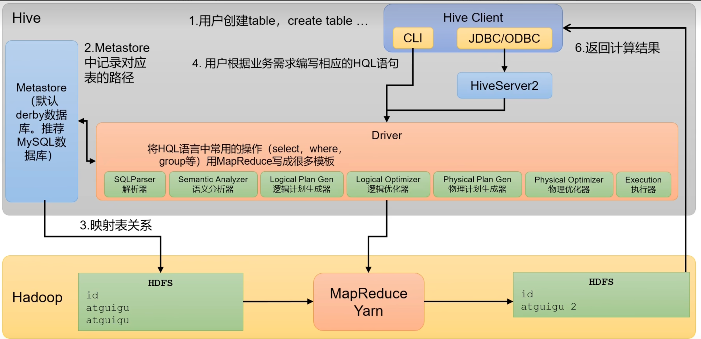
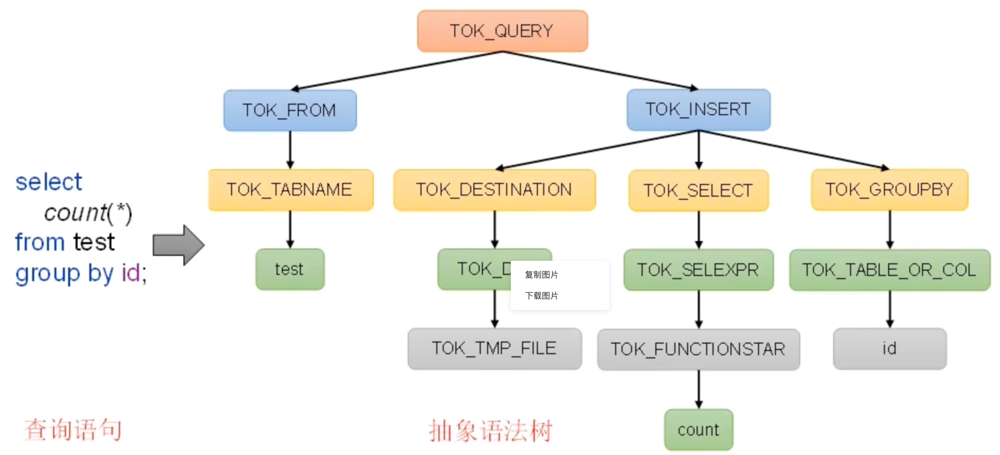
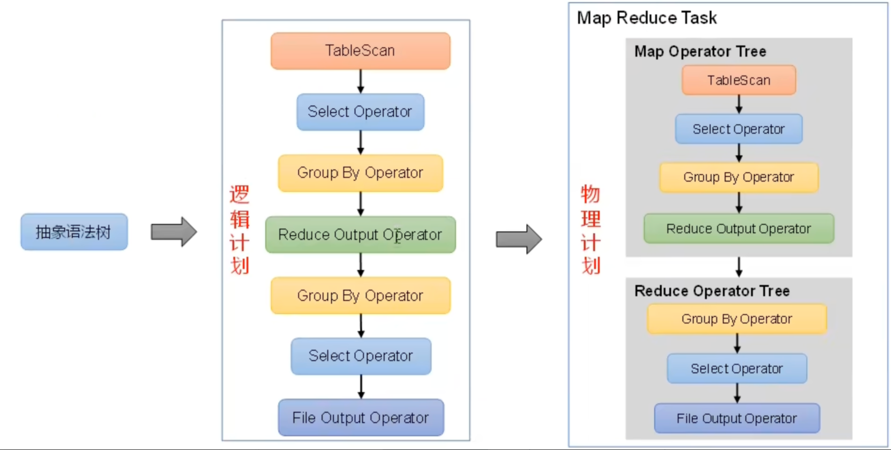
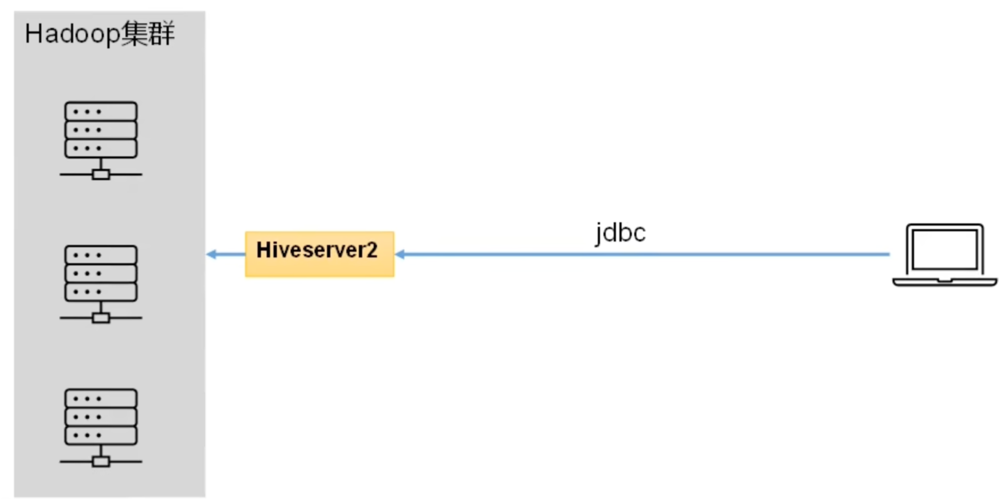
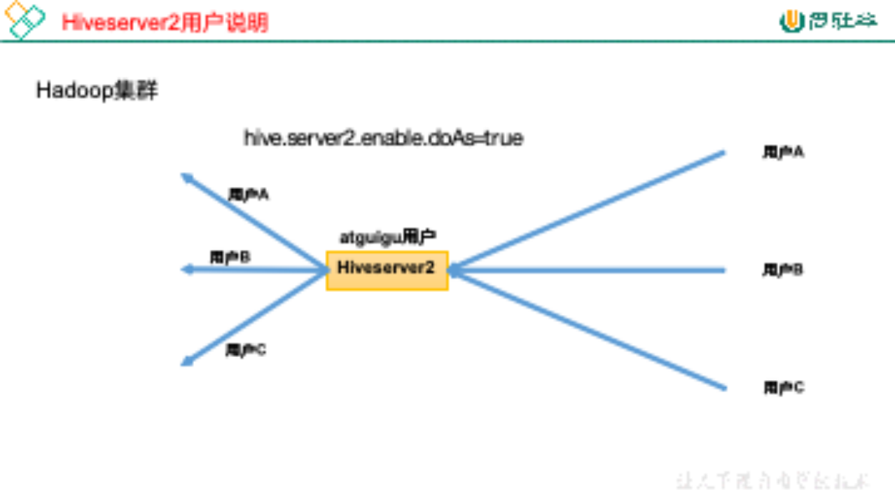

## Hive 基础

### Hive入门

#### 什么是Hive？

**1） Hive 简介**

Hive 是基于 Apache Hadoop 的数据仓库基础设施。Hadoop 在商用硬件（commodity hardware）上为数据存储和处理提供了大规模横向扩展（massive scale-out）和容错能力（fault tolerance）。

Hive 的设计目标是简化海量数据的汇总、即席查询（ad-hoc querying）和分析。它提供了 SQL 接口，使用户能够轻松执行即席查询、数据汇总和分析。同时，Hive 的 SQL 还支持用户在多个环节集成自定义功能，例如用户定义函数（UDFs, User Defined Functions），以实现更灵活的分析需求。 

**2）Hive 本质**

Hive是一个 Hadoop 客户端，用于将HQL（Hive SQL）转化为的 MapReduce 程序

（1）Hive 中每张表的数据存储在 HDFS

（2）Hive 分析数据底层的实现是 MapReduce

（3）执行程序运行在 Yarn 上

#### Hive 的架构原理



**1）用户接口：Client**

CLI（Command-line interface）、JDBC（Java DataBase Connector）

**2）元数据：MetaStore**

元数据包含：数据库、表名、表的拥有者、列/分区字段、表的类型以及表数据所在的目录

**3）驱动器：Driver**

（1）解析器（SQLParser）：将 SQL 字符串转换为抽象语法树

（2）语义分析（Semantic Analyzer）：将 AST 进一步划分为 QueryBlock

（3）逻辑计划生成器（Logical Plan Gen）：将语法树生成逻辑计划

（4）逻辑优化器（Logical Optimizer）：对逻辑计划进行计划

（5）物理计划生成器（Physical Plan Gen）：根据优化后的逻辑计划生成物理计划

（6）物理优化器（Physical Optimizer）：对物理计划进行优化

（7）执行器（Execution）：执行该计划，得到查询结果并返回给客户端

**4）抽象语法树**



**5）逻辑计划与物理计划**

###  Hive安装

#### Hive 安装地址

**1）Hive 官网地址**

https://hive.apache.org/

**2）文档查看地址**

https://cwiki.apache.org/confluence/display/Hive/GettingStarted

**3）下载地址**

http://archive.apache.org/dist/hive/

**4）github 地址**

https://github.com/apache/hive

#### Hive 服务部署

##### Hive的安装

1）把 apache-hive-3.1.3-bin.tar.gz 上传到目录下

2）解压到当前目录下

```shell
[atguigu@hadoop102 software]$ tar -zxvf /opt/software/apache-hive-3.1.3-bin.tar.gz -C /opt/module/
```

3）修改 /etc/profile.d/my_env.sh，添加环境变量

```shell
[atguigu@hadoop102 software]$ sudo vim /etc/profile.d/my_env.sh
#HIVE_HOME
export HIVE_HOME=/opt/module/hive
export PATH=$PATH:$HIVE_HOME/bin
[atguigu@hadoop102 hive]$ source /etc/profile.d/my_env.sh
```

4）初始化元数据库（默认是 derby 数据库）

```shell
[atguigu@hadoop102 hive]$ bin/schematool -dbType derby -initSchema
```

##### Metastore

1）新建 Hive 元数据库

```mysql
#登录MySQL
[atguigu@hadoop102 software]$ mysql -uroot -p123456

#创建Hive元数据库
mysql> create database metastore;
mysql> quit;
```

2）将 Mysql 的 JDBC 驱动拷贝到 Hive 的 lib 目录下

```shell
[atguigu@hadoop102 software]$ cp /opt/software/mysql-connector-java-5.1.37.jar $HIVE_HOME/lib
```

3）在 $HIVE_HOME/CONF 目录下新建 hive-site.xml 文件

```
[atguigu@hadoop102 software]$ vim $HIVE_HOME/conf/hive-site.xml
```

添加如下内容：

```xml
<?xml version="1.0"?>
<?xml-stylesheet type="text/xsl" href="configuration.xsl"?>

<configuration>
    <!-- jdbc连接的URL -->
    <property>
        <name>javax.jdo.option.ConnectionURL</name>
        <value>jdbc:mysql://hadoop102:3306/metastore?useSSL=false</value>
    </property>
    
    <!-- jdbc连接的Driver-->
    <property>
        <name>javax.jdo.option.ConnectionDriverName</name>
        <value>com.mysql.jdbc.Driver</value>
    </property>
    
	<!-- jdbc连接的username-->
    <property>
        <name>javax.jdo.option.ConnectionUserName</name>
        <value>root</value>
    </property>

    <!-- jdbc连接的password -->
    <property>
        <name>javax.jdo.option.ConnectionPassword</name>
        <value>123456</value>
    </property>

    <!-- Hive默认在HDFS的工作目录 -->
    <property>
        <name>hive.metastore.warehouse.dir</name>
        <value>/user/hive/warehouse</value>
    </property>
</configuration>
```

4）初始化 Hive 元数据库（修改为采用 Mysql 存储元数据）

```shell
[atguigu@hadoop102 hive]$ bin/schematool -dbType mysql -initSchema -verbose
```

##### hiveserver2

Hive 的 hiveserver2服务的作用是提供jdbc/odbc 接口，为用户提供远程访问 Hive 数据的功能，例如用户期望在个人电脑中访问远程服务中的Hive 数据，就需要用到 Hiveserver2



**1）用户说明**

在远程访问 Hive 数据时，客户端并未直接访问 Hadoop 集群，而是由 Hiveserver2 代理访问。由于 Hadoop 集群中的数据具备访问权限控制，所以需要开启 Hiveserver2 的 hive.server2.enable.doAs 参数，当启用此参数配置时，Hiveserver2会模拟成客户端的登录用户去访问 Hadoop 集群的数据。



生产环境，推荐开启用户模拟功能，因为开启后才能保证各用户之间的权限隔离。

**2）hiveserver2部署**

**Hadoop端配置**

Hiveserver2 的模拟用户功能，依赖于 Hadoop 提供的 proxy user（代理用户功能），只有 Hadoop中的代理用户才能模拟其他用户的身份访问 Hadoop 集群。因此hiveserver2的启动用户设置为 hadoop 的代理用户，配置方式如下：

修改配置文件core-site.xml，然后记得分发三台机器

```shell
[atguigu@hadoop102 ~]$ cd $HADOOP_HOME/etc/hadoop
[atguigu@hadoop102 hadoop]$ vim core-site.xml
```

增加如下配置：

```xml
<!--配置所有节点的atguigu用户都可作为代理用户-->
<property>
    <name>hadoop.proxyuser.atguigu.hosts</name>
    <value>*</value>
</property>

<!--配置atguigu用户能够代理的用户组为任意组-->
<property>
    <name>hadoop.proxyuser.atguigu.groups</name>
    <value>*</value>
</property>

<!--配置atguigu用户能够代理的用户为任意用户-->
<property>
    <name>hadoop.proxyuser.atguigu.users</name>
    <value>*</value>
</property>
```

**Hive端配置**

在 hive-site.xml 文件中添加如下信息

```xml
[atguigu@hadoop102 conf]$ vim hive-site.xml

<!-- 指定hiveserver2连接的host -->
<property>
	<name>hive.server2.thrift.bind.host</name>
	<value>hadoop102</value>
</property>

<!-- 指定hiveserver2连接的端口号 -->
<property>
	<name>hive.server2.thrift.port</name>
	<value>10000</value>
</property>
```

**测试**

（1）启动 hiveServer2 

```shell
[atguigu@hadoop102 hive]$ bin/hive --service hiveserver2
```

（2）使用命令行客户端 beeline 进行远程访问

```shell
[atguigu@hadoop102 hive]$ bin/beeline -u jdbc:hive2://hadoop102:10000 -n atguigu
```

##### Beeline

`Beeline` 是 **Hive 提供的一款交互式命令行客户端工具**，用于连接 Hive 服务器（HiveServer2）并执行 Hive SQL 语句，是操作 Hive 数据仓库的主要入口之一。它替代了早期 Hive 中的 `hive` 命令行工具（Hive CLI），是目前生产环境中推荐使用的 Hive 客户端。

**一、Beeline 的核心定位**

Beeline 基于 **JDBC 协议** 工作，通过 Thrift 协议与 HiveServer2（Hive 的服务端组件）通信，实现对 Hive 的远程访问和操作。其核心作用是：

- 作为用户与 Hive 之间的交互接口，支持执行 SQL 语句（查询、建表、插入数据等）；
- 支持批量执行 SQL 脚本、查看执行结果、导出数据等功能；
- 兼容 Hive 的安全认证机制（如 Kerberos），适合在生产环境中使用。

**二、与传统 Hive CLI 的区别**

早期 Hive 提供的 `hive` 命令行工具（Hive CLI）直接与 Hive Metastore 和 MapReduce 交互，而 Beeline 则通过 **HiveServer2** 间接操作 Hive，两者的核心区别如下：

| 特性           | Hive CLI（旧工具）             | Beeline（新工具）                        |
| -------------- | ------------------------------ | ---------------------------------------- |
| 通信方式       | 直接连接 Metastore 和计算引擎  | 通过 JDBC 连接 HiveServer2               |
| 安全性         | 不支持 Kerberos 等高级认证     | 支持 Kerberos、LDAP 等安全认证           |
| 远程访问       | 不支持（需在集群节点本地运行） | 支持（可从任意节点远程连接 HiveServer2） |
| 生产环境适用性 | 低（已逐渐被淘汰）             | 高（官方推荐）                           |

**三、Beeline 的主要特点**

1. **支持 JDBC 协议**：通过标准 JDBC 接口与 HiveServer2 通信，兼容性强，便于集成到其他工具（如 DataGrip、Sqoop 等）。
2. **安全认证**：支持 Kerberos、LDAP 等企业级安全认证机制，满足生产环境的权限管理需求。
3. **交互与批处理模式**：既可以通过命令行交互式输入 SQL，也可以批量执行本地 SQL 脚本。
4. **结果格式化**：支持对查询结果进行格式化显示（如表格、CSV 等），方便查看和导出。

**四、Beeline 的基本使用**

**1. 连接 HiveServer2**

Beeline 连接 HiveServer2 的基本语法：

```bash
beeline -u "jdbc:hive2://<HiveServer2主机名或IP>:<端口号>/<数据库名>;[可选参数]" -n <用户名> -p <密码>
```

- 默认端口：HiveServer2 的默认端口是 `10000`。
- 可选参数：如启用 Kerberos 认证时，需添加 `principal=hive/_HOST@REALM` 等参数。

**2. 示例：连接 Hive**

```bash
# 基本连接（无认证，默认数据库为default）
beeline -u "jdbc:hive2://node1:10000" -n hive -p 123456

# 连接指定数据库（如ods库）
beeline -u "jdbc:hive2://node1:10000/ods" -n hive -p 123456

# Kerberos认证环境（假设HiveServer2的principal为hive/node1@EXAMPLE.COM）
beeline -u "jdbc:hive2://node1:10000;principal=hive/node1@EXAMPLE.COM"
```

**3. 交互模式操作**

连接成功后，进入 Beeline 交互界面（提示符为 `0: jdbc:hive2://node1:10000>`），可直接执行 Hive SQL：

```sql
-- 查看数据库
show databases;

-- 切换数据库
use ods;

-- 查询表
select * from access_log limit 10;

-- 建表
create table if not exists test (id int, name string);

-- 退出Beeline
!quit
```

**4. 批处理模式（执行脚本）**

通过 `-f` 参数执行本地 SQL 脚本，或通过 `-e` 参数直接执行单条 SQL：

```bash
# 执行本地脚本（如 /home/hive/test.sql）
beeline -u "jdbc:hive2://node1:10000" -n hive -p 123456 -f /home/hive/test.sql

# 直接执行单条SQL并输出结果
beeline -u "jdbc:hive2://node1:10000" -n hive -p 123456 -e "select count(*) from ods.access_log;"
```

**5. 结果导出**

通过 `!record` 命令将查询结果导出到本地文件：

```sql
-- 在Beeline交互界面中，导出结果到 /home/hive/result.txt
!record /home/hive/result.txt;
select * from ods.access_log limit 100;  -- 执行查询，结果会被记录
!record off;  -- 关闭导出
```

**五、注意事项**

1. **HiveServer2 必须启动**：Beeline 依赖 HiveServer2 服务，连接前需确保 `hive --service hiveserver2` 已启动（或通过系统服务管理）。
2. **端口与网络**：确认 HiveServer2 的端口（默认 10000）未被防火墙屏蔽，客户端与服务器网络通畅。
3. **权限问题**：连接用户（如 `-n hive`）需有访问 Hive 数据库 / 表的权限，否则执行 SQL 会提示权限不足。
4. **版本兼容性**：Beeline 的版本需与 HiveServer2 的版本匹配，避免因版本差异导致连接失败。

**总结**

Beeline 是 Hive 官方推荐的命令行客户端，通过 JDBC 连接 HiveServer2，支持交互和批处理操作，兼容安全认证，是生产环境中操作 Hive 的主要工具。掌握 Beeline 的基本使用（连接、执行 SQL、脚本处理）是 Hive 数据开发和运维的基础技能。


## Hive DDL

### 数据库

#### **创建数据库**

```hive
CREATE DATABASE [IF NOT EXISTS] database_name
[COMMENT database_comment]
[LOCATION hdfs_path]
[WITH DBPROPERTIES (property_name=property_value, ...)];
```

**案例**

（1）创建一个数据库，不指定路径

```hive
hive (default)> create database db_hive1;
```

注：若不指定路径，其默认路径为${hive.metastore.warehouse.dir}/database_name.db

（2）创建一个数据库，指定路径

```hive
hive (default)> create database db_hive2 location '/db_hive2';
```

（2）创建一个数据库，带有dbproperties

```hive
hive (default)> create database db_hive3 with dbproperties('create_date'='2022-11-18');
```

#### 查询数据库

**展示所有数据库**

```hive
SHOW DATABASES [LIKE 'identifier_with_wildcards'];
```

**案例**

```hive
hive> show databases like 'db_hive*';
OK
db_hive_1
db_hive_2
```

**查看数据库详细信息**

```hive
DESCRIBE DATABASE [EXTENDED] db_name;
```

**案例**

1 **查看基本信息**

```hive
hive> desc database db_hive3;
OK
db_hive		hdfs://hadoop102:8020/user/hive/warehouse/db_hive.db	atguigu	USER
```

2 **查看更多信息**

```hive
hive> desc database extended db_hive3;
OK
db_name	comment	location	owner_name	owner_type	parameters
db_hive3		hdfs://hadoop102:8020/user/hive/warehouse/db_hive3.db	atguigu	USER	{create_date=2022-11-18}
```

#### 修改数据库

```hive
--修改dbproperties
ALTER DATABASE database_name SET DBPROPERTIES (property_name=property_value, ...);
--修改location
ALTER DATABASE database_name SET LOCATION hdfs_path;
--修改owner user
ALTER DATABASE database_name SET OWNER USER user_name;
```

**案例**

**1、修改 dbproperties**

```hive
hive> ALTER DATABASE db_hive3 SET DBPROPERTIES ('create_date'='2022-11-20');
```

#### 删除数据库

```hive
DROP DATABASE [IF EXISTS] database_name [RESTRICT|CASCADE];
```

- RESTRICT：严格模式，若数据库不为空，则会删除失败，默认为该模式。

- CASCADE：级联模式，若数据库不为空，则会将库中的表一并删除。

#### 切换数据库

```hive
use database_name;
```

### 表

#### 创建表

**1、正常建表**

```hive
CREATE [TEMPORARY] [EXTERNAL] TABLE [IF NOT EXISTS] [db_name.]table_name   
[(col_name data_type [COMMENT col_comment], ...)]
[COMMENT table_comment]
[PARTITIONED BY (col_name data_type [COMMENT col_comment], ...)]
[CLUSTERED BY (col_name, col_name, ...) 
[SORTED BY (col_name [ASC|DESC], ...)] INTO num_buckets BUCKETS]
[ROW FORMAT row_format] 
[STORED AS file_format]
[LOCATION hdfs_path]
[TBLPROPERTIES (property_name=property_value, ...)]
```

**2、Create Table As Select （CTAS）建表**

该语法允许用户利用select查询语句返回的结果，直接建表，表的结构和查询语句的结构保持一致，且保证包含select查询语句放回的内容。

```hive
CREATE [TEMPORARY] TABLE [IF NOT EXISTS] table_name 
[COMMENT table_comment] 
[ROW FORMAT row_format] 
[STORED AS file_format] 
[LOCATION hdfs_path]
[TBLPROPERTIES (property_name=property_value, ...)]
[AS select_statement]
```

**3、Create Table Like 语法**

该语法允许用户复刻一张已经存在的表结构，与上述的CTAS语法不同，该语法创建出来的表中不包含数据。

```hive
CREATE [TEMPORARY] [EXTERNAL] TABLE [IF NOT EXISTS] [db_name.]table_name
[LIKE exist_table_name]
[ROW FORMAT row_format] 
[STORED AS file_format] 
[LOCATION hdfs_path]
[TBLPROPERTIES (property_name=property_value, ...)]
```

##### EXTERNAL

在 Hive 中，**内部表（Managed Table）** 和 **外部表（External Table）** 是两种核心表类型，核心区别在于 **Hive 是否 “管理” 表的数据文件**（即数据的生命周期是否由 Hive 控制）。理解两者的差异对数据仓库设计、数据安全和运维至关重要。

**一、核心区别：数据管理权**

| **维度**         | **内部表（Managed Table）**                                  | **外部表（External Table）**                                 |
| ---------------- | ------------------------------------------------------------ | ------------------------------------------------------------ |
| **数据管理权**   | Hive 完全管理数据（元数据 + 数据文件）。                     | Hive 仅管理元数据（表结构），数据文件由外部系统管理。        |
| **删除表的影响** | 删除表时，**同时删除元数据和 HDFS 上的数据文件**。           | 删除表时，**仅删除元数据，HDFS 上的数据文件保留**。          |
| **默认存储路径** | 依赖数据库的 `LOCATION`（通常为 `/user/hive/warehouse/数据库名.db/表名`）。 | 需通过 `LOCATION` 显式指定（通常为外部系统路径，如 `/data/external/表名`）。 |
| **数据来源**     | 数据通常由 Hive 生成（如 `INSERT`、`LOAD DATA`）。           | 数据通常来自外部系统（如 Flume 采集的日志、Spark 生成的结果）。 |

**二、详细对比与示例**

**1. 内部表（默认表类型）**

- **特点**：Hive 拥有数据的完全控制权，数据存储在 Hive 仓库的默认路径下，适合 “仅由 Hive 处理” 的临时数据或中间结果。

- **创建语法**（无需 `EXTERNAL` 关键字）：

  ```sql
  -- 创建内部表（默认）
  CREATE TABLE IF NOT EXISTS dws.user_info (
    id INT COMMENT '用户ID',
    name STRING COMMENT '用户名'
  )
  ROW FORMAT DELIMITED FIELDS TERMINATED BY ','
  STORED AS TEXTFILE;  -- 数据默认存储在 /user/hive/warehouse/dws.db/user_info
  ```

- **删除行为**：

  ```sql
  DROP TABLE dws.user_info;  -- 元数据（表结构）和 HDFS 路径 /user/hive/warehouse/dws.db/user_info 下的数据会被同时删除
  ```

**2. 外部表**

- **特点**：Hive 不管理数据文件，数据存储在用户指定的外部路径（如 HDFS 独立目录、S3 等），适合 “多系统共享数据”（如 Hive、Spark、Flink 同时访问）或 “需长期保留” 的数据（如原始日志）。

- **创建语法**（需 `EXTERNAL` 关键字和 `LOCATION`）：

  ```sql
  -- 创建外部表（指定数据路径）
  CREATE EXTERNAL TABLE IF NOT EXISTS ods.access_log (
    ip STRING COMMENT '访问IP',
    url STRING COMMENT '访问URL'
  )
  ROW FORMAT DELIMITED FIELDS TERMINATED BY '\t'
  STORED AS TEXTFILE
  LOCATION '/data/logs/access_log';  -- 数据存储在外部路径 /data/logs/access_log
  ```

- **删除行为**：

  ```sql
  DROP TABLE ods.access_log;  -- 仅删除元数据（表结构），HDFS 路径 /data/logs/access_log 下的数据仍保留
  ```

**三、关键差异场景**

**1. 数据安全性**

- 内部表：风险较高，误删表会导致数据永久丢失（需依赖备份恢复）。
- 外部表：更安全，误删表仅丢失元数据，数据文件可通过重建表（指定原 `LOCATION`）恢复访问。

**2. 数据共享**

- 内部表：数据路径依赖 Hive 仓库，其他系统（如 Spark）访问需知道 Hive 仓库路径，且可能因权限问题受限。
- 外部表：数据路径独立，其他系统可直接访问（如 Spark 读取 `/data/logs/access_log`），无需依赖 Hive。

**3. 数据迁移**

- 内部表：迁移数据需同时移动 HDFS 文件并更新表的 `LOCATION`（否则查询会失败）。
- 外部表：迁移数据只需修改表的 `LOCATION` 指向新路径（数据文件移动后，元数据更新即可）。

**4. 适用场景**

| 表类型 | 适用场景                                   | 示例                           |
| ------ | ------------------------------------------ | ------------------------------ |
| 内部表 | 临时表、中间结果表（数据生命周期短）       | 数据清洗后的临时结果表         |
| 外部表 | 原始日志表、多系统共享表（数据需长期保留） | 用户行为日志表、业务系统同步表 |

**四、如何选择？**

- 若数据**仅由 Hive 处理**，且可接受 “删表即删数据”（如临时计算结果），选**内部表**。
- 若数据**需被多系统共享**，或**需长期保留**（即使表被删除），选**外部表**（生产环境中外部表更常用，尤其在数据治理严格的场景）。

**五、注意事项**

- 外部表的 `LOCATION` 路径必须在创建表时显式指定，且路径下的数据需符合表的格式（否则查询可能返回空或乱码）。
- 内部表的默认路径可通过 `hive.metastore.warehouse.dir` 配置修改，但不建议随意改动（可能影响已有表）。
- 可通过 `DESCRIBE EXTENDED 表名;` 查看表类型（`tableType: MANAGED_TABLE` 或 `EXTERNAL_TABLE`）。

总结：内部表和外部表的核心差异是 “数据管理权”，外部表通过分离元数据和数据文件，提供了更好的灵活性和安全性，是生产环境的首选；内部表适合简单场景或临时数据处理。

##### DataType

在 Hive 中，`DataType`（数据类型）用于定义表中列的**数据存储格式和取值范围**，决定了列可以存储什么样的数据（如整数、字符串、日期等）以及 Hive 如何处理这些数据（如计算、比较、函数操作）。

Hive 的数据类型可分为**基本数据类型**和**复杂数据类型**两大类，以下是详细说明：

**一、基本数据类型（Primitive Types）**

基本数据类型是 Hive 中最基础的类型，用于存储单一值，类似传统数据库的简单类型。

**1. 数值类型（Numeric Types）**

用于存储整数、小数等数值，支持算术运算（+、-、*、/ 等）。

| 类型           | 定义                               | 取值范围                                  | 示例                           |
| -------------- | ---------------------------------- | ----------------------------------------- | ------------------------------ |
| `TINYINT`      | 1 字节有符号整数                   | -128 ~ 127                                | `1`, `-5`                      |
| `SMALLINT`     | 2 字节有符号整数                   | -32768 ~ 32767                            | `100`, `-200`                  |
| `INT`          | 4 字节有符号整数（默认整数类型）   | -2^31 ~ 2^31 - 1                          | `1000`, `-5000`                |
| `BIGINT`       | 8 字节有符号整数                   | -2^63 ~ 2^63 - 1                          | `1000000000L`（加 L 标识）     |
| `FLOAT`        | 4 字节单精度浮点数                 | 约 ±3.4e-38 ~ ±3.4e38                     | `3.14f`, `-1.5f`               |
| `DOUBLE`       | 8 字节双精度浮点数（默认小数类型） | 约 ±1.7e-308 ~ ±1.7e308                   | `3.14159`, `-2.5`              |
| `DECIMAL(p,s)` | 高精度小数（自定义精度）           | `p`：总位数（1~38），`s`：小数位数（0~p） | `DECIMAL(10,2)`（如 12345.67） |

**2. 字符串类型（String Types）**

用于存储文本数据，Hive 对字符串长度没有严格限制（取决于存储格式和内存）。

| 类型         | 定义                             | 特点与示例                                   |
| ------------ | -------------------------------- | -------------------------------------------- |
| `STRING`     | 可变长度字符串（默认字符串类型） | 支持单引号或双引号：`'hello'`、`"world"`     |
| `VARCHAR(n)` | 可变长度字符串（指定最大长度 n） | `VARCHAR(20)` 表示最长 20 个字符，超出会截断 |
| `CHAR(n)`    | 固定长度字符串（指定长度 n）     | `CHAR(10)` 表示固定 10 个字符，不足补空格    |

**3. 日期与时间类型（Date/Time Types）**

用于存储日期和时间信息，支持日期函数（如 `date_add`、`to_date` 等）。

| 类型                             | 定义                      | 格式示例                    |
| -------------------------------- | ------------------------- | --------------------------- |
| `DATE`                           | 日期（年 - 月 - 日）      | `'2025-01-01'`              |
| `TIMESTAMP`                      | 日期 + 时间（精确到纳秒） | `'2025-01-01 12:30:45.123'` |
| `TIMESTAMP WITH LOCAL TIME ZONE` | 带本地时区的时间戳        | 需结合时区转换，较少用      |

**4. 布尔类型（Boolean Type）**

用于存储逻辑值（真 / 假）。

| 类型      | 定义   | 取值              | 示例            |
| --------- | ------ | ----------------- | --------------- |
| `BOOLEAN` | 布尔值 | `TRUE` 或 `FALSE` | `TRUE`, `FALSE` |

**5. 二进制类型（Binary Type）**

用于存储二进制数据（如图片、文件字节流），较少直接使用。

| 类型     | 定义           | 示例                              |
| -------- | -------------- | --------------------------------- |
| `BINARY` | 二进制字节数组 | 通常通过函数 `unhex('A1B2')` 生成 |

**二、复杂数据类型（Complex Types）**

复杂数据类型用于存储**多值组合**的数据，基于基本类型或其他复杂类型构建，适合处理嵌套结构的数据（如 JSON 中的数组、对象）。

**1. `ARRAY<T>`：数组**

存储**相同类型**的有序元素集合，元素通过索引访问（索引从 0 开始）。

- 定义：`ARRAY<元素类型>`（元素类型可以是基本类型或复杂类型）。

- 示例：

  ```sql
  -- 定义一个存储字符串数组的列（如用户标签）
  CREATE TABLE user_tags (
    id INT,
    tags ARRAY<STRING>  -- tags 是字符串数组，如 ['student', 'male']
  )
  ROW FORMAT DELIMITED
    FIELDS TERMINATED BY ','  -- 列分隔符
    COLLECTION ITEMS TERMINATED BY '|';  -- 数组元素分隔符（|）
  ```

  数据文件中一行示例：`1,student|male`（对应 `id=1`，`tags=['student', 'male']`）。

**2. `MAP<K,V>`：键值对映射**

存储**键值对集合**，键（K）和值（V）可以是任意基本类型（键通常为字符串），通过键访问值。

- 定义：`MAP<键类型, 值类型>`。

- 示例：

  ```sql
  -- 定义一个存储属性键值对的列（如商品属性）
  CREATE TABLE product_attrs (
    product_id INT,
    attrs MAP<STRING, STRING>  -- attrs 是键值对，如 {'color':'red', 'size':'L'}
  )
  ROW FORMAT DELIMITED
    FIELDS TERMINATED BY ','
    MAP KEYS TERMINATED BY ':'  -- 键值对分隔符（:）
    COLLECTION ITEMS TERMINATED BY '|';  -- 多个键值对之间的分隔符（|）
  ```

  数据文件中一行示例：`100,color:red|size:L`（对应 `attrs={'color':'red', 'size':'L'}`）

**3. `STRUCT<col1:type1, col2:type2, ...>`：结构体**

存储**不同类型的字段组合**，类似编程语言中的 “对象”，通过字段名访问成员。

- 定义：`STRUCT<字段名1:类型1, 字段名2:类型2, ...>`。

- 示例：

  ```sql
  -- 定义一个存储用户地址结构体的列
  CREATE TABLE user_address (
    id INT,
    address STRUCT<province:STRING, city:STRING, detail:STRING>  -- 地址结构体
  )
  ROW FORMAT DELIMITED
    FIELDS TERMINATED BY ','
    COLLECTION ITEMS TERMINATED BY '|';  -- 结构体字段之间的分隔符（|）
  ```

  数据文件中一行示例：`1,Guangdong|Shenzhen|Nanshan District`（对应 `address.province='Guangdong'` 等）。

**4. `UNIONTYPE<T1, T2, ...>`：联合类型**

存储**多种类型中的一种**（类似 C 语言的 union），一次只能存储一种类型的值，较少使用。

- 定义：`UNIONTYPE<类型1, 类型2, ...>`。

- 示例：

  ```sql
  CREATE TABLE union_demo (
    data UNIONTYPE<INT, STRING, BOOLEAN>  -- 可存储INT、STRING或BOOLEAN中的一种
  );
  ```

  插入数据时需指定类型索引（0:INT, 1:STRING, 2:BOOLEAN）：

  ```sql
  INSERT INTO union_demo VALUES (uniontype(100));  -- 存储INT类型
  INSERT INTO union_demo VALUES (uniontype('hello'));  -- 存储STRING类型
  ```

**三、使用注意事项**

1. **类型兼容性**：Hive 支持有限的自动类型转换（如 `INT` 可转为 `BIGINT`、`FLOAT` 可转为 `DOUBLE`），但需避免隐式转换导致精度丢失（如 `BIGINT` 转 `INT` 可能溢出）。
2. **字符串与其他类型**：`STRING` 可与数值 / 日期类型进行转换（需用函数 `cast('123' as INT)`），但格式不匹配时会返回 `NULL`（如 `cast('abc' as INT)` 结果为 `NULL`）。
3. **复杂类型的分隔符**：创建包含 `ARRAY`、`MAP`、`STRUCT` 的表时，必须通过 `ROW FORMAT DELIMITED` 配置内部分隔符（如 `COLLECTION ITEMS TERMINATED BY`），否则无法正确解析。
4. 选择原则：
   - 数值类型：根据数据范围选择最小合适类型（如存储年龄用 `TINYINT` 而非 `BIGINT`，节省空间）。
   - 日期类型：优先用 `DATE` 或 `TIMESTAMP` 而非 `STRING`，便于日期函数操作（如计算天数差）。
   - 复杂类型：适合存储嵌套数据（如 JSON 数组），但会增加查询复杂度，需权衡使用。

**总结**

Hive 的数据类型涵盖了基本的数值、字符串、日期类型，以及用于复杂结构的 `ARRAY`、`MAP`、`STRUCT` 等，灵活支持不同场景的数据存储需求。实际建表时，需根据数据的实际格式和业务操作（如计算、过滤、关联）选择合适的类型，以保证数据正确性和查询效率。

##### PARTITIONED BY

在 Hive 中，`PARTITIONED BY` 是**表分区的核心语法**，用于将表数据按**指定的 “分区列”** 进行逻辑拆分，实现数据的 “分目录存储”，从而大幅提升查询效率（通过过滤分区列减少扫描的数据量）。

**一、核心作用：数据按 “条件” 拆分，提升查询效率**

Hive 表通常存储海量数据（如 TB 级），若将所有数据存放在一个目录下，查询时需扫描全表，效率极低。`PARTITIONED BY` 通过**指定分区列**（如 `dt` 表示日期、`region` 表示地区），将数据按分区列的值拆分为多个子目录（如 `dt=2025-01-01`、`dt=2025-01-02`）。查询时，若通过 `WHERE 分区列=值` 过滤（如 `WHERE dt='2025-01-01'`），Hive 只会扫描对应分区目录下的数据，避免全表扫描，显著提升效率。

**二、语法与特点**

**1. 基本语法**

在 `CREATE TABLE` 语句中，通过 `PARTITIONED BY` 定义分区列：

```sql
CREATE TABLE 表名 (
  列名1 类型 [COMMENT '注释'],
  ...
)
PARTITIONED BY (分区列1 类型 [COMMENT '注释'], 分区列2 类型 [COMMENT '注释'], ...)
[其他配置：ROW FORMAT、STORED AS 等];
```

- **分区列**：是**逻辑列**（不实际存储在数据文件中），其值作为 HDFS 目录的一部分（如 `dt=2025-01-01`）。
- **支持多分区**：可定义多个分区列（如 `PARTITIONED BY (dt STRING, region STRING)`），对应 HDFS 目录层级为 `表名/dt=xxx/region=xxx/`。

**2. 示例：按日期 `dt` 分区的日志表**

```sql
-- 创建按日期 dt 分区的访问日志表
CREATE TABLE ods.access_log (
  ip STRING COMMENT '访问IP',
  url STRING COMMENT '访问URL',
  status INT COMMENT '响应状态码'
)
PARTITIONED BY (dt STRING COMMENT '日志日期，格式yyyy-MM-dd')  -- 分区列 dt
ROW FORMAT DELIMITED FIELDS TERMINATED BY '\t'
STORED AS TEXTFILE;
```

- 数据存储路径：

- HDFS 上的目录结构为：

  ```plaintext
  /user/hive/warehouse/ods.db/access_log/  -- 表主目录
  ├─ dt=2025-01-01/  -- 2025-01-01的日志数据文件
  ├─ dt=2025-01-02/  -- 2025-01-02的日志数据文件
  └─ dt=2025-01-03/  -- 2025-01-03的日志数据文件
  ```

**三、分区类型：静态分区 vs 动态分区**

向分区表插入数据时，根据分区值是否手动指定，分为两种方式：

**1. 静态分区（手动指定分区值）**

插入数据时，**显式指定分区列的值**，适用于已知分区值的场景（如批量插入某一天的数据）。

示例：向 `dt=2025-01-01` 分区插入数据

```sql
-- 方式1：LOAD DATA 加载本地文件到指定分区
LOAD DATA LOCAL INPATH '/home/logs/2025-01-01.log' 
INTO TABLE ods.access_log 
PARTITION (dt='2025-01-01');  -- 手动指定 dt 的值

-- 方式2：INSERT 插入查询结果到指定分区
INSERT INTO TABLE ods.access_log 
PARTITION (dt='2025-01-01')
SELECT ip, url, status FROM tmp.tmp_log WHERE log_date='2025-01-01';
```

**2. 动态分区（自动推断分区值）**

插入数据时，**不手动指定分区值**，而是由 Hive 根据查询结果中的列自动推断分区值，适用于批量插入多个分区（如一次性插入多天的数据）。

使用前需开启动态分区配置（默认关闭）：

```sql
-- 开启动态分区（默认false）
set hive.exec.dynamic.partition=true;
-- 允许所有分区列都是动态的（默认strict，要求至少一个静态分区）
set hive.exec.dynamic.partition.mode=nonstrict;
```

示例：动态插入 `dt` 分区（根据 `log_date` 列的值自动生成分区）

```sql
INSERT INTO TABLE ods.access_log 
PARTITION (dt)  -- 不指定具体值，动态推断
SELECT 
  ip, 
  url, 
  status, 
  log_date  -- 最后一列的值作为 dt 分区的值（顺序必须对应）
FROM tmp.tmp_log;
```

- 注意：查询结果中**最后一列必须是分区列的值**（如上例中 `log_date` 对应 `dt`），且类型需匹配。

**四、分区管理常用操作**

**1. 查看分区**

```sql
-- 查看表的所有分区
SHOW PARTITIONS ods.access_log;
-- 查看指定条件的分区（如 dt 大于2025-01-01）
SHOW PARTITIONS ods.access_log PARTITION (dt > '2025-01-01');
```

**2. 添加分区**

```sql
-- 新增一个空分区（仅创建目录，无数据）
ALTER TABLE ods.access_log ADD PARTITION (dt='2025-01-04') COMMENT '2025年1月4日日志';

-- 新增多个分区
ALTER TABLE ods.access_log ADD 
PARTITION (dt='2025-01-05') 
PARTITION (dt='2025-01-06');
```

**3. 删除分区（同时删除分区数据和元数据）**

```sql
-- 删除单个分区（数据和目录会被删除）
ALTER TABLE ods.access_log DROP PARTITION (dt='2025-01-01');

-- 删除多个分区
ALTER TABLE ods.access_log DROP 
PARTITION (dt='2025-01-02'), 
PARTITION (dt='2025-01-03');
```

**4. 修复分区（外部表常用）**

若直接向 HDFS 分区目录添加数据文件（而非通过 Hive 命令插入），Hive 元数据不会自动识别新分区，需执行修复：

```sql
-- 修复表的所有分区（扫描目录并更新元数据）
MSCK REPAIR TABLE ods.access_log;
```

**五、注意事项**

1. **分区列的选择**：需选择**查询中频繁过滤的字段**（如日期、地区、业务线），否则分区会失去意义（如很少用 `region` 过滤，却按 `region` 分区，反而增加目录复杂度）。
2. **分区粒度**：粒度不宜过粗（如按年分区，单分区数据量仍过大）或过细（如按分钟分区，导致分区数量过多，元数据压力大）。通常按 “天” 分区（日志类）或 “月” 分区（业务数据）。
3. **数据倾斜**：避免某一分区数据量过大（如大部分数据集中在 `dt=2025-01-01`，其他分区数据极少），否则查询该分区时仍需扫描大量数据。
4. **内部表 vs 外部表的分区删除**：
   - 内部表：`DROP PARTITION` 会同时删除 HDFS 分区目录和数据。
   - 外部表：`DROP PARTITION` 仅删除元数据，HDFS 分区目录和数据保留（需手动删除数据）。

**总结**

`PARTITIONED BY` 是 Hive 优化海量数据查询的核心手段，通过按分区列拆分数据为子目录，实现 “按需扫描”。合理选择分区列（如日期）、控制分区粒度，能显著提升查询效率。实际使用中需结合静态 / 动态分区插入数据，并通过 `SHOW PARTITIONS`、`MSCK REPAIR TABLE` 等命令管理分区。

##### CLUSTERED BY,SORTED BY INTO BUCKETS

在 Hive 中，`CLUSTERED BY ... SORTED BY ... INTO ... BUCKETS` 是**分桶表（Bucketed Table）** 的核心配置，用于将表数据按**分桶列的哈希值**拆分为固定数量的 “桶”（文件），并对每个桶内的数据按指定列排序。分桶是比分区更细粒度的数据拆分方式，主要用于**优化抽样查询、Join 性能和数据局部性**，是处理海量数据的重要优化手段。

**一、核心作用：细粒度数据拆分与排序**

分桶（Bucketing）与分区（Partitioning）的本质区别：

- 分区是**按 “分区列值” 拆分目录**（如 `dt=2025-01-01`），属于 “逻辑拆分”，分区数量可动态增长。
- 分桶是**按 “分桶列的哈希值” 拆分文件**（固定数量的桶），属于 “物理拆分”，桶数量创建表时固定，不可动态增减。

`CLUSTERED BY ... SORTED BY ... INTO ... BUCKETS` 的作用是：

1. **数据均匀拆分**：按分桶列的哈希值将数据分配到固定数量的桶（文件）中，保证每个桶的数据量相对均匀。
2. **桶内数据有序**：每个桶内的数据按 `SORTED BY` 指定的列排序，加速范围查询和聚合操作。
3. **优化查询性能**：支持抽样查询（只扫描部分桶）、减少 Join 时的 shuffle（同桶数据直接关联）。

**二、语法与核心参数解析**

**完整语法**

```sql
CREATE TABLE 表名 (
  列名1 类型 [COMMENT '注释'],
  列名2 类型 [COMMENT '注释'],
  ...
)
[PARTITIONED BY (分区列 类型, ...)]  -- 可与分区结合使用（先分区再分桶）
CLUSTERED BY (分桶列1, 分桶列2, ...)  -- 指定分桶列（决定数据分到哪个桶）
SORTED BY (排序列1 [ASC|DESC], 排序列2 [ASC|DESC], ...)  -- 每个桶内数据的排序规则
INTO N BUCKETS  -- 指定桶的数量（N为正整数，一旦确定不可轻易修改）
[其他配置：ROW FORMAT、STORED AS 等];
```

**各参数详解**

1. **`CLUSTERED BY (分桶列)`**
   - 作用：指定用于分桶的列（必须是表中已定义的列，不能是分区列），Hive 通过**分桶列的哈希值 % 桶数量**计算数据所属的桶索引（如哈希值为 100，桶数量为 10，则 100%10=0，数据进入第 0 号桶）。
   - 要求：分桶列通常选择**基数高（值分布均匀）** 的列（如 `user_id`、`order_id`），避免数据倾斜（某一桶数据过多）。
2. **`SORTED BY (排序列 [ASC|DESC])`**
   - 作用：指定每个桶内的数据按哪些列排序（升序 `ASC` 或降序 `DESC`），使桶内数据有序。
   - 优势：有序数据可加速查询（如 `WHERE 排序列 > 值` 可利用有序性快速定位）、优化聚合操作（如 `GROUP BY` 可减少排序开销）。
3. **`INTO N BUCKETS`**
   - 作用：指定桶的数量（N），创建表时固定，后续无法通过 `ALTER TABLE` 修改（若需修改，需重建表并重新加载数据）。
   - 数量选择：通常根据**表数据量**和**集群节点数**决定，建议为集群核心数的倍数（如 10、20、30），保证每个节点处理的桶数量均衡。

**三、示例：分桶表的创建与数据加载**

**场景**

创建一个用户行为表，按 `user_id` 分桶（确保同一用户的行为数据在同一桶），每个桶内按 `behavior_time` 降序排序（便于查询用户最新行为），共分 10 个桶，且按日期 `dt` 分区（先按日期分区，再在每个分区内分桶）。

**1. 创建分桶表**

```sql
CREATE TABLE dws.user_behavior (
  user_id STRING COMMENT '用户ID',
  behavior STRING COMMENT '行为类型（点击/购买）',
  behavior_time STRING COMMENT '行为时间',
  product_id STRING COMMENT '商品ID'
)
PARTITIONED BY (dt STRING COMMENT '日期，格式yyyy-MM-dd')  -- 先按日期分区
CLUSTERED BY (user_id)  -- 按user_id分桶（同一用户数据在同一桶）
SORTED BY (behavior_time DESC)  -- 桶内按行为时间倒序排序
INTO 10 BUCKETS  -- 分为10个桶
STORED AS ORC  -- 列式存储，配合分桶效率更高
TBLPROPERTIES ('orc.compress'='SNAPPY');  -- 启用压缩
```

**2. 向分桶表加载数据**

分桶表**不能通过 `LOAD DATA` 直接加载数据**（会导致数据未按分桶规则拆分），必须通过 `INSERT ... SELECT` 加载，且需开启分桶强制检查：

```sql
-- 开启动分桶强制检查（确保数据按分桶规则写入）
set hive.enforce.bucketing=true;

-- 从临时表插入数据到分桶表（按dt分区，自动分桶）
INSERT INTO TABLE dws.user_behavior 
PARTITION (dt='2025-01-01')
SELECT 
  user_id, 
  behavior, 
  behavior_time, 
  product_id 
FROM tmp.tmp_user_behavior  -- 临时表存储2025-01-01的原始数据
WHERE dt='2025-01-01';
```

- 数据存储路径：每个分区目录下包含 10 个桶文件（如 `000000_0`、`000001_0` ... `000009_0`），文件名中的数字对应桶索引。

**四、分桶表的核心优势**

**1. 高效抽样查询**

分桶表支持按 “桶比例” 抽样，无需扫描全表，适合数据探索（如查看数据分布）。示例：随机抽样 10% 的数据（扫描 10 个桶中的 1 个）：

```sql
-- 从10个桶中随机抽1个桶的数据（约10%）
SELECT * FROM dws.user_behavior TABLESAMPLE(BUCKET 1 OUT OF 10 ON user_id) WHERE dt='2025-01-01';
```

**2. 优化 Join 性能**

若两个表按**相同分桶列**分桶（且桶数量相同或成倍数），Join 时可直接按 “桶对桶” 关联，避免全表 shuffle（大幅减少网络传输）。示例：`user_behavior` 表与 `user_info` 表均按 `user_id` 分 10 个桶，Join 时直接关联相同桶的数据：

```sql
-- 同桶关联，减少shuffle
SELECT 
  b.user_id, 
  b.behavior, 
  i.name 
FROM dws.user_behavior b
JOIN dws.user_info i 
ON b.user_id = i.user_id 
WHERE b.dt='2025-01-01';
```

**3. 桶内有序加速查询**

每个桶内的数据按 `SORTED BY` 列有序，查询时可利用有序性快速定位（类似索引）。示例：查询用户 `u123` 在 `2025-01-01` 的最新行为（桶内按 `behavior_time` 倒序，第一条即为最新）：

```sql
SELECT * FROM dws.user_behavior 
WHERE dt='2025-01-01' AND user_id='u123'
LIMIT 1;  -- 直接取桶内第一条（最新）
```

**五、注意事项**

1. **桶数量不可修改**：创建表时指定的桶数量（`INTO N BUCKETS`）无法通过 `ALTER TABLE` 修改，若需调整，需重建表并重新加载数据。
2. **分桶列必须是表中列**：不能使用分区列作为分桶列（分区是目录级拆分，分桶是文件级拆分，分桶列需是表的实际字段）。
3. **数据加载必须用 `INSERT ... SELECT`**：`LOAD DATA` 会跳过分桶逻辑，导致数据未按规则拆分，查询结果错误。
4. **与分区结合使用**：分桶通常与分区配合（先分区再分桶），适合 “分区内数据量仍很大” 的场景（如每日分区数据达 TB 级，再分桶进一步拆分）。
5. **避免数据倾斜**：分桶列需选择值分布均匀的列（如 `user_id`），若分桶列基数低（如 `gender` 只有男女），会导致桶数据分布不均（某几个桶数据极多）。

**总结**

`CLUSTERED BY ... SORTED BY ... INTO ... BUCKETS` 是 Hive 中优化海量数据查询的核心手段，通过**固定数量的桶拆分**和**桶内排序**，实现了抽样高效、Join 加速和有序查询。分桶适合数据量极大、需频繁抽样或关联的场景，与分区结合使用可发挥更大价值。实际使用中需注意分桶列选择、桶数量设计和正确的数据加载方式。

##### ROW FORMAT

在 Hive 中，`ROW FORMAT` 是**定义数据文件中 “行” 的解析格式**的配置，用于告诉 Hive 如何将数据文件中的一行内容拆分为表的列，以及如何将表的列数据序列化为文件中的行。它是 Hive 解析数据（反序列化）和写入数据（序列化）的核心规则，直接决定了 Hive 能否正确识别数据文件中的字段。

**核心作用：数据与表结构的 “翻译器”**

Hive 本身不存储数据，数据存放在 HDFS 或其他存储系统中（如文本文件、ORC 文件等）。`ROW FORMAT` 的作用就是定义 “数据文件中的行” 与 “表的列” 之间的映射规则 —— 相当于一个 “翻译器”，让 Hive 知道：

- 如何从数据文件的一行中拆分出多个列（反序列化，读数据时用）；
- 如何将表的多列数据拼接成一行写入文件（序列化，写数据时用）。

**常见用法与语法**

`ROW FORMAT` 通常配合 **SerDe（Serializer/Deserializer，序列化 / 反序列化器）** 使用，语法有两种常见形式：

**1. 基础格式：`ROW FORMAT DELIMITED`（适用于简单文本文件）**

针对**普通文本文件**（如逗号分隔、制表符分隔的 CSV 类文件），Hive 提供了简化的配置，通过指定分隔符来解析行。语法：

```sql
ROW FORMAT DELIMITED
  [FIELDS TERMINATED BY '分隔符']  -- 列之间的分隔符（必填）
  [LINES TERMINATED BY '分隔符']  -- 行之间的分隔符（默认换行符'\n'，可选）
  [NULL DEFINED AS '字符串']       -- 空值在文件中的表示方式（可选，默认'\N'）
  [COLLECTION ITEMS TERMINATED BY '分隔符']  -- 数组/集合元素的分隔符（如Array类型）
  [MAP KEYS TERMINATED BY '分隔符']          -- Map类型的键值对分隔符
```

**示例**：解析逗号分隔的文本文件（如 `1,zhangsan,20` 对应 `id,name,age` 三列）

```sql
CREATE TABLE user (
  id INT,
  name STRING,
  age INT
)
ROW FORMAT DELIMITED
  FIELDS TERMINATED BY ','  -- 列用逗号分隔
  LINES TERMINATED BY '\n'  -- 行用换行分隔（默认，可省略）
  NULL DEFINED AS ''        -- 空值用空字符串表示（如`,,20`表示id和name为空）
STORED AS TEXTFILE;
```

**2. 高级格式：`ROW FORMAT SERDE 'SerDe类名'`（适用于复杂格式）**

当数据格式复杂（如 JSON、XML、带引号的 CSV 等），简单的分隔符无法解析时，需要指定**自定义 SerDe 类**（Hive 或第三方提供的解析器）。

常见场景：

- JSON 格式数据（需用 `JsonSerDe`）；
- 带引号的 CSV（如 `1,"zhangsan,20",male` 中逗号是内容的一部分，需特殊解析）；
- 自定义格式（如企业私有日志格式）。

**示例 1：解析 JSON 格式数据**JSON 数据每行是一个 JSON 对象（如 `{"id":1, "name":"zhangsan", "age":20}`），需用 Hive 提供的 `JsonSerDe`：

```sql
CREATE TABLE user_json (
  id INT,
  name STRING,
  age INT
)
ROW FORMAT SERDE 'org.apache.hive.hcatalog.data.JsonSerDe'  -- JSON专用SerDe
STORED AS TEXTFILE  -- JSON本质是文本文件
LOCATION '/data/json/user';  -- 指向JSON文件所在的HDFS路径
```

**示例 2：解析带引号的 CSV**中若字段包含分隔符（如 `name` 为 `zhangsan,wang`），会用引号包裹（如 `1,"zhangsan,wang",20`），需用 `CSVSerDe`：

```sql
CREATE TABLE user_csv (
  id INT,
  name STRING,
  age INT
)
ROW FORMAT SERDE 'org.apache.hadoop.hive.serde2.lazy.LazySimpleSerDe'
WITH SERDEPROPERTIES (
  'field.delim' = ',',         -- 列分隔符为逗号
  'serialization.format' = ',',
  'quoteChar' = '"',           -- 引号字符（用于包裹含分隔符的字段）
  'escapeChar' = '\\'          -- 转义字符（如\"表示字段内的引号）
)
STORED AS TEXTFILE;
```

**关键：SerDe 的作用**

`ROW FORMAT` 的核心是 **SerDe**—— 它是实现 “行 - 列映射” 的具体逻辑类。Hive 内置了多种 SerDe：

- `LazySimpleSerDe`：默认 SerDe，配合 `ROW FORMAT DELIMITED` 使用，处理简单分隔符文本。
- `JsonSerDe`：处理 JSON 格式数据（需 Hive 0.12+）。
- `OrcSerDe`：处理 ORC 格式文件（自动配合 `STORED AS ORC` 使用，无需手动指定）。
- `ParquetSerDe`：处理 Parquet 格式文件（自动配合 `STORED AS PARQUET` 使用）。

**注意事项**

1. **与存储格式配合**：`ROW FORMAT` 定义 “行解析规则”，`STORED AS` 定义 “文件物理格式”（如 TEXTFILE、ORC），两者需匹配。例如：
   - ORC/Parquet 是列式存储格式，自带 SerDe，无需手动指定 `ROW FORMAT`（但可通过 `TBLPROPERTIES` 配置压缩等）。
   - TEXTFILE 必须指定 `ROW FORMAT`（否则无法解析）。
2. **空值处理**：不同系统的空值表示可能不同（如 Hive 默认用 `\N`，MySQL 用 `NULL`），需通过 `NULL DEFINED AS` 统一，否则可能导致空值解析错误。
3. **复杂类型支持**：对于 `Array`、`Map`、`Struct` 等复杂类型，需通过 `COLLECTION ITEMS TERMINATED BY`、`MAP KEYS TERMINATED BY` 定义内部分隔符（如 `Array<String>` 用 `|` 分隔元素：`a|b|c`）。

**总结**

`ROW FORMAT` 是 Hive 解析数据文件的 “规则手册”，通过定义分隔符或指定 SerDe，告诉 Hive 如何将文件中的行拆分为表的列。简单文本用 `DELIMITED` 配置分隔符，复杂格式（JSON、CSV 带引号）用 `SERDE` 指定解析类。正确配置 `ROW FORMAT` 是 Hive 表能正常读写数据的前提。

##### STORED AS

在 Hive 中，`STORED AS` 是**指定表数据物理存储格式**的关键字，用于定义数据在 HDFS（或其他存储系统）上的**文件格式**（如文本、二进制列式存储等）。它直接决定了数据的存储结构、压缩效率、读写性能以及与其他计算引擎（如 Spark、Flink）的兼容性，是 Hive 表设计中影响性能的核心配置之一。

**一、核心作用：定义数据的物理存储格式**

Hive 本身不存储数据，数据以文件形式存放在底层存储系统（如 HDFS）中。`STORED AS` 的作用是告诉 Hive：

- 数据文件的**编码格式**（如文本、二进制列式存储）；
- 数据的**压缩方式**（如是否启用 SNAPPY、GZIP 压缩）；
- 如何与底层存储系统交互（如读取 ORC 格式文件需要对应的解析器）。

不同的存储格式在**读写速度**、**压缩率**（存储空间）、**兼容性**（是否支持其他引擎）等方面差异极大，选择合适的格式能显著提升 Hive 作业性能。

**二、常见存储格式及特点**

Hive 支持多种存储格式，以下是生产中最常用的几种，按适用场景分类说明：

**1. 文本格式：`STORED AS TEXTFILE`（默认格式）**

- **定义**：以纯文本形式存储数据，每行对应表中的一条记录，字段间通过 `ROW FORMAT` 定义的分隔符（如逗号、制表符）拆分。

- 特点： 据的场景。

- 示例

  ```sql
  CREATE TABLE ods.log_text (
    ip STRING,
    time STRING
  )
  ROW FORMAT DELIMITED FIELDS TERMINATED BY '\t'
  STORED AS TEXTFILE;  -- 文本格式
  ```

**2. 列式存储格式：`STORED AS ORC`（Optimized Row Columnar）**

- **定义**：ORC 是 Hive 自研的**列式存储格式**，将数据按列分组存储（同一列的数据连续存储），支持索引和高效压缩。

- 特点：

  - 优点：
    - 高压缩率（比 TextFile 压缩率高 3-5 倍，节省存储空间）；
    - 读写性能优异（查询时只扫描需要的列，减少 I/O）；
    - 支持行索引、列统计信息（加速过滤查询，如 `WHERE age > 30` 可快速定位符合条件的行）。
  - 缺点：文本可读性差（二进制格式），写入时需额外的编码开销（适合一次写入、多次读取的场景）。

- **适用场景**：生产环境核心表（如 DWD 层明细、DWS 层汇总表），尤其是查询频繁、字段多但每次查询只涉及少数列的场景。

- 示例

  （配合压缩配置）：

  ```sql
  CREATE TABLE dwd.user_detail (
    id INT,
    name STRING,
    age INT
  )
  STORED AS ORC  -- ORC列式存储
  TBLPROPERTIES (
    'orc.compress'='SNAPPY'  -- 启用SNAPPY压缩（平衡压缩率和速度）
  );
  ```

**3. 列式存储格式：`STORED AS PARQUET`**

- **定义**：Parquet 是另一种流行的**跨引擎列式存储格式**，由 Twitter 和 Cloudera 联合开发，支持 Hive、Spark、Flink 等多种引擎。

- 特点：

  - 优点：跨引擎兼容性强（可被 Spark、Flink 直接读写），压缩率和性能接近 ORC，支持复杂嵌套类型（如 `STRUCT`、`ARRAY`）。
  - 缺点：在 Hive 中的查询性能略逊于 ORC（Hive 对 ORC 有更深度的优化）。

- **适用场景**：需要多引擎（Hive + Spark + Flink）共享的数据表，或包含复杂嵌套类型的数据（如 JSON 解析后的表）。

- 示例：

  ```sql
  CREATE TABLE dws.order_parquet (
    order_id STRING,
    items ARRAY<STRUCT<product_id:STRING, price:DECIMAL(10,2)>>  -- 嵌套类型
  )
  STORED AS PARQUET  -- Parquet格式
  TBLPROPERTIES ('parquet.compression'='GZIP');  -- 启用GZIP压缩（压缩率高但速度慢）
  ```

**4. 二进制键值对格式：`STORED AS SEQUENCEFILE`**

- **定义**：SequenceFile 是 Hadoop 早期的**二进制键值对格式**，数据以 `<key, value>` 形式存储，支持压缩。

- 特点：

  - 优点：二进制存储，安全性高（不易被篡改），适合中间结果存储（如 MapReduce 作业输出）。
  - 缺点：可读性差，性能不如 ORC/Parquet，目前已逐渐被列式格式替代。

- **适用场景**：MapReduce 作业的中间数据存储，或需要加密 / 权限控制的敏感数据。

- 示例：

  ```sql
  CREATE TABLE mr_intermediate (
    key STRING,
    value STRING
  )
  STORED AS SEQUENCEFILE;  -- SequenceFile格式
  ```

**其他格式（较少用）**

- `STORED AS AVRO`：适合存储 schema 频繁变更的数据（支持 schema 演进），兼容性强但性能一般。
- `STORED AS RCFile`：早期列式格式，已被 ORC 替代，不建议新表使用。

**三、`STORED AS` 与 `ROW FORMAT` 的关系**

`STORED AS` 和 `ROW FORMAT` 是配合使用的，但职责不同：

- `ROW FORMAT`：定义**数据文件中 “行与列” 的映射规则**（如何从一行中拆分出列，如分隔符、SerDe），解决 “数据如何解析” 的问题。
- `STORED AS`：定义**数据文件的物理存储格式**（文本、ORC 等），解决 “数据如何存储” 的问题。

例如：

- 文本文件（`STORED AS TEXTFILE`）必须配合 `ROW FORMAT DELIMITED` 或自定义 SerDe 解析分隔符；
- ORC/Parquet 格式（`STORED AS ORC`）自带 SerDe（`OrcSerDe`/`ParquetSerDe`），无需手动指定 `ROW FORMAT`（Hive 会自动关联）。

**四、选择存储格式的核心原则**

1. **查询性能优先**：生产环境核心表优先选 `ORC`（Hive 专属）或 `Parquet`（多引擎共享），列式存储能大幅减少 I/O。
2. **压缩率平衡**：ORC/Parquet 建议启用 `SNAPPY` 压缩（平衡速度和压缩率），日志类文本文件可用 `GZIP`（压缩率高，适合冷数据）。
3. **兼容性需求**：若数据需被 Spark、Flink 等引擎访问，优先选 `Parquet`（跨引擎支持更好）。
4. **读写频率**：ORC/Parquet 写入时编码开销大，适合 “一次写入、多次读取” 的场景；TextFile 适合 “频繁写入、临时存储” 的场景。

**总结**

`STORED AS` 是 Hive 中定义数据物理存储格式的关键配置，直接影响表的读写性能、存储空间和兼容性。生产中推荐优先使用**列式存储格式（ORC/Parquet）**，尤其是核心业务表；原始日志或临时数据可使用 `TEXTFILE`。选择时需结合查询场景、引擎兼容性和读写频率综合判断。

##### TBLPROPERTIES

**1. 存储自定义元数据（最常用）**

用于记录表的**业务相关信息**，方便数据开发、运维或分析人员理解表的背景，属于 “表的说明书”。常见场景：

- 记录表的创建时间（如 `'create_date'='2022-11-18'`）。
- 记录表的负责人（如 `'owner'='zhangsan'`）。
- 记录表的业务含义（如 `'business_desc'='用户订单事实表，包含每日订单明细'`）。
- 记录数据来源（如 `'data_source'='ods.order_raw'`，表示数据来自 ods 层的 order_raw 表）。

这些信息会被 Hive 存储在**元数据库**（通常是 MySQL）的 `TBLS` 或 `TABLE_PARAMS` 表中，可通过 `DESCRIBE EXTENDED 表名;` 或 `SHOW TBLPROPERTIES 表名;` 查看。

**2. 配置 Hive 引擎的特殊行为**

Hive 内置了一些预定义的属性键，用于**控制表的存储、压缩、统计信息等行为**，这些键由 Hive 引擎识别并生效。例如：

- **压缩配置**：`'orc.compress'='SNAPPY'`（指定 ORC 格式表的压缩算法为 SNAPPY）。
- **外部表标记**：`'EXTERNAL'='TRUE'`（Hive 自动为外部表添加，标识该表是外部表）。
- **统计信息**：`'numRows'='1000000'`（记录表的预估行数，用于优化查询计划）。
- **分桶 / 分区配置**：`'bucketing_version'='2'`（指定分桶表的版本，Hive 2.x 后默认值）。

**3. 支持数据治理和工具集成**

很多数据治理平台（如 Apache Atlas、数据资产平台）会读取 `TBLPROPERTIES` 中的属性，用于：

- 表的生命周期管理（根据 `create_date` 计算表的存活时间）。
- 权限控制（结合 `owner` 属性判断表的负责人）。
- 数据血缘追踪（结合 `data_source` 记录数据来源链路）。

**查看和修改表属性**

- **查看**：通过 `SHOW TBLPROPERTIES 表名;` 查看所有属性，或 `SHOW TBLPROPERTIES 表名('create_date');` 查看指定属性。示例：

  ```sql
  SHOW TBLPROPERTIES dws.user_info;  -- 查看 dws.user_info 表的所有属性
  SHOW TBLPROPERTIES dws.user_info('create_date');  -- 仅查看 create_date 属性
  ```

- **修改**：通过 `ALTER TABLE` 语句修改已有属性或添加新属性：

  ```sql
  -- 添加新属性（如修改人）
  ALTER TABLE dws.user_info SET TBLPROPERTIES('modify_date'='2023-01-01', 'modify_by'='lisi');
  
  -- 修改已有属性（如更新创建日期）
  ALTER TABLE dws.user_info SET TBLPROPERTIES('create_date'='2022-11-19');
  ```

#### 查询表

**1. 展示所有表**

```hive
SHOW TABLES [IN database_name] LIKE ['identifier_with_wildcards'];
```

**2. 查看表信息**

```hive
DESCRIBE [EXTENDED | FORMATTED] [db_name.]table_name
```

#### 修改表

**1. 重名表**

```sql
ALTER TABLE table_name RENAME TO new_table_name
```

**2. 修改列信息**

**2.1 增加列**

```hive
ALTER TABLE table_name ADD COLUMNS (col_name data_type [COMMENT col_comment], ...)
```

**2.2 更新列**

```hive
ALTER TABLE table_name CHANGE [COLUMN] col_old_name col_new_name column_type [COMMENT col_comment] [FIRST|AFTER column_name]
```

**2.2 替换列**

```hive
ALTER TABLE table_name REPLACE COLUMNS (col_name data_type [COMMENT col_comment], ...)
```

#### 删除表

```hive
DROP TABLE [IF EXISTS] table_name;
```

## Hive DML

### Load

**1）语法**

```hive
hive> LOAD DATA [LOCAL] INPATH 'filepath' [OVERWRITE] INTO TABLE tablename [PARTITION (partcol1=val1, partcol2=val2 ...)];
```

**2）实操案例**

**1、创建一张表**

```hive
hive (default)> 
create table student(
    id int, 
    name string
) 
row format delimited fields terminated by '\t';
```

**2、加载本地文件到 hive**

```hive
hive (default)> load data local inpath '/opt/module/datas/student.txt' into table student;
```

**3、加载 HDFS 文件到 hive 中**

上传文件到 HDFS

```hive
[atguigu@hadoop102 ~]$ hadoop fs -put /opt/module/datas/student.txt /user/atguigu
```

加载 HDFS 上数据，导入完成后去 HDFS 上查看文件是否还存在

```hive
hive (default)> 
load data inpath '/user/atguigu/student.txt' 
into table student;
```

**4、加载数据覆盖表中已有的数据**

上传文件到 HDFS

```hive
hive (default)> dfs -put /opt/module/datas/student.txt /user/atguigu;
```

加载数据覆盖表中已有数据

```hive
hive (default)> 
load data inpath '/user/atguigu/student.txt' 
overwrite into table student;
```

### Insert

#### 将查询结果插入表中

**1）语法**

```hive
INSERT (INTO | OVERWRITE) TABLE tablename [PARTITION (partcol1=val1, partcol2=val2 ...)] select_statement;
```

关键字说明：

- INTO：将结果追加到目标表
- OVERWRITE：用结果覆盖原有数据

**2）案例**

**1、新建一张表** 

```hive
hive (default)> 
create table student1(
    id int, 
    name string
) 
row format delimited fields terminated by '\t';
```

**2、根据查询结果插入数据**

```hive
hive (default)> insert overwrite table student3 
select 
    id, 
    name 
from student;
```

#### 将给定 Values 插入表中

**1）语法**

```hive
INSERT (INTO | OVERWRITE) TABLE tablename [PARTITION (partcol1[=val1], partcol2[=val2] ...)] VALUES values_row [, values_row ...]
```

**2）案例**

```hive
hive (default)> insert into table  student1 values(1,'wangwu'),(2,'zhaoliu');
```

#### 将查询结果写入目标路径

**1）语法**

```hive
INSERT OVERWRITE [LOCAL] DIRECTORY directory
  [ROW FORMAT row_format] [STORED AS file_format] select_statement;
```

**2）案例**

```hive
insert overwrite local directory '/opt/module/datas/student' ROW FORMAT SERDE 'org.apache.hadoop.hive.serde2.JsonSerDe'
select id,name from student;
```

### Export & Import

Export 导出语句可将表的数据和元数据一并导出到 HDFS 路径，Import 可将 Export 导出的内容导入 Hive，表的数据和元数据信息都会恢复。Export 和 Import 可用于两个 Hive 实例之间的数据迁移

**1）语法**

```hive
--导出
EXPORT TABLE tablename TO 'export_target_path'

--导入
IMPORT [EXTERNAL] TABLE new_or_original_tablename FROM 'source_path' [LOCATION 'import_target_path']
```

**2）案例**

```hive
--导出
hive>
export table default.student to '/user/hive/warehouse/export/student';

--导入
hive>
import table student2 from '/user/hive/warehouse/export/student';
```

## Hive DQL

### 查询模板

```hive
SELECT [ALL | DISTINCT] select_expr, select_expr, ...
  FROM table_reference       -- 从什么表查
  [WHERE where_condition]   -- 过滤
  [GROUP BY col_list]        -- 分组查询
  [HAVING col_list]          -- 分组后过滤
  [ORDER BY col_list]        -- 排序
  [CLUSTER BY col_list] | [DISTRIBUTE BY col_list] [SORT BY col_list]
 [LIMIT number]                -- 限制输出的行数
```


