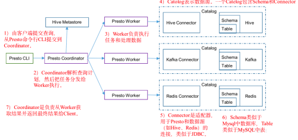
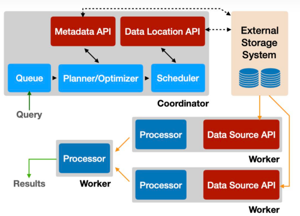
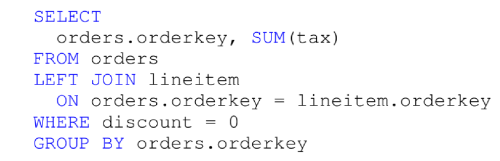
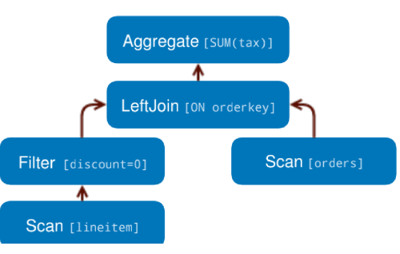
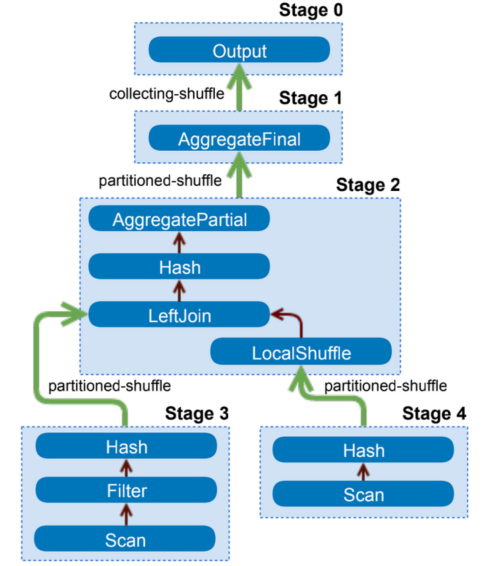
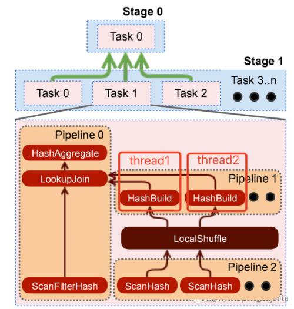
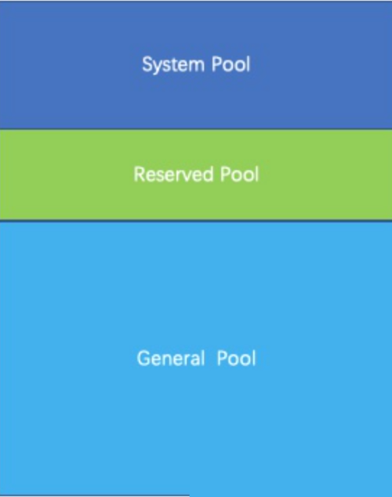
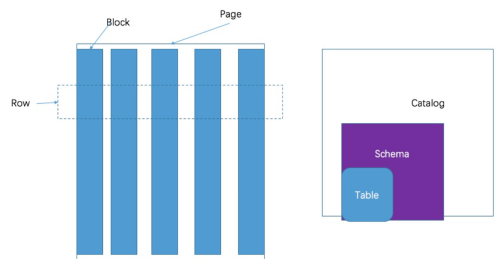

# Presto

## Presto 简介

### 基本介绍

Presto 是一款基于 Facebook 开源的 MPP架构 OLAP 查询引擎，可针对不同数据源执行大容量数据集的一款分布式 SQL 执行引擎，数据量支持GB 到 PB 字节，主要用来处理秒级查询场景。Presto本身并不存储数据，但是可以接入多种数据源，并支持跨数据源的的级联查询

**注意：**Presto可以解析SQL，但它不是一个标准数据库，适合用于PB 级海量数据复杂分析，交互式 SQL 查询，支持跨数据源进行数据查询和分析。不像 Hive只能从 HDFS 中读取数据，不适合多个大表join 操作，因为 presto 是基于内存的，多个大表在内存里可能放不下

### 优缺点

**优点：**

- 清晰的框架，是一个能独立运行的系统，不依赖于任何其他外部系统。例如调度，presto自身提供了对集群的监控，可以根据监控信息完成调度
- Presto 基于内存运算。减少了磁盘 IO，计算更快
- 能够连接多个数据源，跨数据源连表查，如从 Hive 中查询大量网络访问记录，然后从 mysql 中匹配出设备信息
- 丰富的插件接口

**缺点：**

- Presto能够 处理PB级别的海量数据分析，但Presto并不是把PB级数据都放在内存中计算的。而是根据场景，如Count，AVG等聚合运算，是边读数据边计算，再清内存，再读数据再计算，这种耗的内存并不高．但是连表查，就可能产生大量的临时数据，因此速度会变慢。

### Presto 和 Hive 的对比

hive是一个数据仓库（有hive表），是一个交互式比较弱的查询引擎，交互能力没有presto那么强，而且只能访问hdfs的数据(及数据源很单一)
presto是一个交互式查询引擎，可以在很短的时间内返回查询结果，秒级，分钟级，能访问很多数据源hive在查询100Gb级别的数据时，消耗时间已经是分钟级了

但是presto是取代不了hive的，因为presto全部的数据都是在内存中，限制了在内存中的数据集大小，比如多个大表的join，这些大表是不能完全放进内存的，所以presto不适合用在多个大表的join。

实际应用中，对于在presto的查询是有一定规定条件的：比如说一个查询在presto查询超过30分钟，那就kill掉吧，说明不适合在presto上使用，主要原因是，查询过大的话，会占用整个集群的资源，这会导致你后续的查询是没有资源的，这跟presto的设计理念是冲突的，就像是你进行一个查询，但是要等个5分钟才有资源给你用，这是很不合理的，交互式就变得弱了很多。我们理想的交互应该是实时的，速度越快越好。

Presto通过使用分布式查询，可以快速高效的完成海量数据的查询。如果你需要处理TB或者PB级别的数据，那么你可能更希望借助于Hadoop的HDFS来完成这些数据的处理。作为Hive和Pig（Hive和Pig都是通过MapReduce的管道流来完成HDFS数据的查询）的替代者，
Presto不仅可以访问HDFS，也可以操作不同的数据源，比如mysql。

## Presto原理

### 架构

##### **具体架构**

Presto采用典型的 master-slave模型，由一个Coordinator 和多个 Worker组成



1. Coordinator（master）负责meta管理，worker 管理，query的解析和调度。Coordinator 跟踪每个 Worker 的活动情况并协调查询语句的执行。Coordinator 为每个查询建立模型，模型包含多个 Stage，每个 Stage 再转为Task 分发到不同的 Worker 上执行。Coordinator 与 Worker、Client通信是通过 REST API
2. Worker 是负责执行任务和处理数据。Worker 从 Connector 获取数据。Worker 之间会交换中间数据。最终结果会传递给Coordinator。Coordinator 是负责从 Worker 获取结果并返回最终结果给 Client
3. Discovery server，通常内嵌于Coordinator节点中，也可以单独部署，用于节点心跳，是将 Coordinator 与 Worker 结合到一起的服务，Worker节点启动后向 Discovery Server服务注册，Coordinator从 Discover Server获取正常工作 Worker 节点
4. Catelog。一个Catelog 包含Schema 和 Connector。例如，你配置JMX 的 catelog，通过JXM Connector 访问 JXM 信息。当你执行一条 SQL 语句时，可以同时运行在多个 catelog。

Presto 处理table 时，是通过表的完全限定（fully-qualified）名来找到 catelog。例如，一个表的权限定是hive.test_data.test，则 test 是表名，test_data 是 schema，hive 是 catelog

5. Connector 是适配器，用于 Presto和数据源（如 hive、PDBMS）的连接。类似于 JDBC，但是Presto的 SPI 的实现，使用标准的 API来与不同的数据源交互。

Presto有几个内建 Connector：JMX 、Hive、System Connector等

每个Catalog都有一个特定的 Connector。如果你使用catelog配置文件，则会发现每个文件都必须包含connector.name属性，用于指定 catelog 管理器（创建特定的Connector 使用）。一个或多个 catelog 用同样的connector是访问同样的数据库，

##### **sql执行步骤**

1、客户端通过 http 发送一个查询请求给 presto集群的 Coordinator

2、Coordinator 接收到客户端的查询语句，对语句进行解析，生成查询执行计划，并根据生成的执行计划生成 Stage 和 Task，并将 Task 分发到需要处理数据的 Worker上进行分析

3、worker 执行 task ，task 通过 Connector从数据源中读取需要的数据

4、上游stage 输出的结果给到下游stage 作为输入，每个 stage的每个 task 在 worker 内存中进行计算与处理

5、client从提交查询后，就一直监听Coordinator中的查询结果，一有结果就立即输出，直到轮询所有的结果都返回本次查询结果结束

**具体分析**



（1）SQL 语句提交：

用户或应用通过 Presto 的 JDBC 接口或 Cli 来提交SQL 查询，点提交的 SQL最终传递给 Coordinator 进行下一步处理

（2）词/语法分析：

首先会对接收到的查询语句进行词法分析和语法分析，形成一棵抽象语法树。然后，会通过分析抽象语法树来形成逻辑查询计划。

（3）生成逻辑计划：

下图是 TPC-H 测试基准中的一条 SQL 语句，表达的是两表连接同时带有分组聚合计算的例子，经过词法语法分析后，得到 AST，然后进一步分析得到如下的逻辑计划。





上图就是一颗逻辑计划树，每个节点代表一个物理或逻辑操作，每个节点的子节点作为该节点输入。逻辑计划只是一个单纯描述SQL 的执行逻辑。但是并不包括具体的执行信息，例如该操作是在单节点上执行还是可以在多节点并行执行，再例如什么时候需要进行数据的 shuffle 操作等。

（4）查询优化：

Coordinator 将一系列的优化策略（例如剪枝操作、谓词下推。条件下推等）应用于逻辑计划的各个子计划，从而将逻辑计划转换为更加适合物理执行的结构，形成更加高效的执行策略

- **自适应**：Presto 的 Connector 可以通过Data Layout API 提供数据的物理分布信息（例如数据的位置、分区、排序、分组以及索引等属性），如果一个表有多种不同的数据存储分布方式，Connector也可以将所有的数据布局全部返回，这样 presto优化器可以根据query的特点来选择最高效的数据分布来读取数据并进行处理
- **谓词下推**：谓词下推是一个应用非常普遍的优化方式，就是将一些条件或者列尽可能的下推到叶子节点，最后将这些结果交给数据源去执行，从而减少计算引擎和数据源之间的IO，提高效率



- **节点间并行**：不同 stage 之间的数据 shuffle 会带来很大的内存 CPU 开销，因此，将 shuffle 数优化到最小是一个非常重要的目标。围绕这个目标，Presto 可以借助以下两类信息

  - **数据布局信息：**例如进行 join连接的两个表的字段属于分区字段，则可以通过连接操作在各个节点分别进行
  - **索引信息：**如果两个表的连接键加了索引，可以考虑采用嵌套循环的连接策略

- **节点内并行**：优化器通过在节点内部使用多线程的方式来提高节点内对并行度，延迟更小且会比节点间并行效率更高

  - **交互式分析：**交互式查询的负载大部分是一次执行的短查询，查询负载一般不会经过优化，从而导致数据倾斜现象
  - **批量 ETL**：这类查询特点是任务会不加过滤的从叶子节点拉取大量数据到上层节点进行转换操作，致使上层节点压力非常大


针对以上两种场景遇到的问题，引擎可以通过多线程来运行单个操作符序列（或 pipeline），如图所示的，pipleline1和2通过多线程并行执行来加速 build 端的 hash-join



### 资源和调度

#### **查询调度**

Presto 通过 Coordinator 将 stage 以 task 的形式分发到worker 节点，Coordinator 将 task 以stage 为单位进行串联，通过将不同 stage按照先后执行顺序串联成一颗执行树，确保数据流能够顺着 stage 进行流动

Presto 引擎处理一条查询需要两套调度：

- 第一套是如何调度 stage 的执行顺序
- 第二套是判断每个 stage 有多少需要调度的 task 以及每个 task 应该分发到哪个 worker 节点上进行处理

**（1）stage 调度**

Presto 支持两个 stage 调度策略：All-at-once 和 Phased 两种

- All-at-once 策略针对所有的 stage 进行统一调度，不管 stage 之间的数据流顺序，只要该 stage 里的 task 数据准备好了就可以进行处理；
- Phased 策略是需要以 stage 调度的有向图为依据按序执行，只要前序任务执行完毕才会开始后续任务的调度执行。例如一个 hash-join 操作，在 hash 表没有准备好之前，Presto 不会调度 left side 表。

**（2）task 调度**

在进行 task 调度的时候，调度器会首先区分 task 所在的 stage 是哪一类 stage：Leaf Stage 和 Intermediate Stage。Leaf Stage 负责通过 Connector 从数据源读取数据，intermediate stage 负责处理来此其他上游 stage 的中间结果

#### **split 调度**

当 Leaf stage 中的一个 task 在一个工作节点开始执行的时候，它会收到一个或多个 split 分片，不同 connector 的 split 分片所包含的信息也不一样，最简单的比如一个分片会包含该分片的 IP以及该分片相对于整个文件的偏移量。对于 Redis 这类的键值数据库，一个分片可能包含表信息、键值格式以及要查询的主机列表。Leaf stage 中的 task 必须分配一个或多个 split 才能够运行，而 intermediate stage 中的 task 则不需要。

#### **split 分配**

当 task 任务分配到各个工作节点后，Coordinator就开始给每个 task 分配 split 。Presto引擎要求 Connector 将小批量的 split 以懒加载的方式分配给 task。会有以下几个方面的优点

- 解耦时间：将前期的 split 准备工作与实际的查询执行时间分开
- 减少不必要的数据加载：有时候一个查询可能是刚出结果，但是没有完全查询完就被取消，或者会通过一些 limit 条件限制查询到部分数据就结束了，这样的懒加载方式可以很好避免过多加载数据
- 维护 split 队列：工作节点会为分配到工作进程的 split 维护一个队列。Coordinator 会将新的 split 分配给具有最短队列的 task
- 减少元数据维护：这种方式可以避免在查询的时候将所有元数据都维护在内存中，例如对于 Hive Connector 来讲，处理 Hive 查询的时候可能会产生百万级的 split，这样就很容易把 Coordinator 的内存给打满。当然，这种方式也不是没有缺点，他的缺点是可能会导致难以准确估计和报告查询进度。

#### 资源管理

Presto 整合了细粒度资源管理系统的。一个单集群可以并发执行上百条查询以及最大化的利用 CPU、IO 和内存资源

**（1）CPU 调度**

Presto 首要任务是优化所有集群的吞吐量，例如在处理数据是的 CPU 总利用量。本地（节点级别）调度又为低成本的计算任务的周转时间优化到更低，以及对于具有相似 CPU 需求的任务采取 CPU 公平调度策略。一个 task 的资源使用是这个线程下所有 split 的执行时间的累计，为了最小化协调时间，Presto 的 CPU 使用最小单位为 task 级别并且进行节点本地调度。

Presto 通过在每个节点并发调度任务来实现多租户，并且使用合作的多任务模型。任何一个 split 任务在一个运行线程中只能占中最大 1 秒钟时长，超时之后就要放弃该线程重新回到队列。如果该任务的缓冲区满了或者 OOM 了，即使还没有到达占用时间也会被切换至另一个任务，从而最大化 CPU 资源的利用。

当一个 split 离开了运行线程，Presto 需要去定哪一个 task（包含一个或多个 split）排在下一位运行。

Presto 通过合计每个 task 任务的总 CPU 使用时间，从而将他们分到五个不同等级的队列而不是仅仅通过提前预测一个新的查询所需的时间的方式。如果累积的 Cpu 使用时间越多，那么它的分层会越高。Presto 会为每一个曾分配一定的 CPU 总占用时间。

调度器也会自适应的处理一些情况，如果一个操作占用超时，调度器会记录他实际占用线程的时长，并且会临时减少它接下来的执行次数。这种方式有利于处理多种多样的查询类型。给一些低耗时的任务更高的优先级，这也符合低耗时任务往往期望尽快处理完成，而高耗时的任务对时间敏感性低的实际。
**（2）内存管理**

在像 Presto 这样的多租户系统中，内存是主要的资源管理挑战之一

（1）内存池

在 Presto 中，内存被分为用户内存和系统内存，这两种内存被保存在内存池中。用户内存是指用户可以仅根据系统的基本知识或输入数据进行推理的内存使用情况(例如，聚合的内存使用与其基数成比例)。另一方面，系统内存是实现决策(例如 shuffle 缓冲区)的副产品，可能与查询和输入数据量无关。换句话说，用户内存是与任务运行有关的，我们可以通过自己的程序推算出来运行时会用到的内存，系统内存可能更多的是一些不可变的。

Presto 引擎对单独对用户内存和总的内存（用户+系统）进行不同的规则限制，如果一个查询超过了全局总内存或者单个节点内存限制，这个查询将会被杀掉。当一个节点的内存耗尽时，该查询的预留内存会因为任务停止而被阻塞。

有时候，集群的内存可能会因为数据倾斜等原因造成内存不能充分利用，那么 Presto 提供了两种机制来缓解这种问题–溢写和保留池。

- **溢写**：当某一个节点内存用完的时候，引擎会启动内存回收程序，将执行的任务序列进行升序排序，然后招到合适的 task 任务进行内存回收（也就是将状态进行）
- **预留池**：如果集群没有配置溢写策略，那么当节点内存用完，或者没有可回收的内存的时候，预留内存机制就来解除集群阻塞了。这种策略下，查询内存池被进一步分成了两个池：普通池和预留池。这样当一个查询把普通池的内存资源用完之后，会得到所有节点的预留池内存资源的继续加持，这样这个查询的内存资源使用量就是普通池资源和预留池资源的加和。为了避免死锁，一个集群中同一时间只有一个查询可以使用预留池资源，其他的任务的预留池资源申请会被阻塞。这在某种情况下是优点浪费，集群可以考虑配置一下去杀死这个查询而不是阻塞大部分节点。

### 内存管理

Presto是一款内存计算型的引擎，所以对于内存管理必须做到精细，才能保证query有序、顺利的执行，部分发生饿死、死锁等情况

#### 内存池

Presto 采用逻辑的内存池，来管理不同类型的内存需求

Presto把整个内存划分为三个内存池，分别是System Pool，Reverved Pool，General Pool



1. System Pool 是用来保留给系统使用的，默认为40%的内存空间留给系统使用、系统内存是实现决策（例如 shuffle 缓冲区）的副产品，可能与查询和输入数据量无关
2. Reverved Pool 和 General Pool 是用来分配 query 运行时内存的

其中大部分的query使用general Pool。 而最大的一个query，使用Reserved Pool， 所以Reserved Pool的空间等同于一个query在一个机器上运行使用的最大空间大小，默认是10%的空间。

General则享有除了System Pool和General Pool之外的其他内存空间。

#### 内存管理


Presto内存管理，分两部分：

- query内存管理

query划分成很多task， 每个task会有一个线程循环获取task的状态，包括task所用内存。汇总成query所用内存。
如果query的汇总内存超过一定大小，则强制终止该query。

- 机器内存管理

coordinator有一个线程，定时的轮训每台机器，查看当前的机器内存状态。
当query内存和机器内存汇总之后，coordinator会挑选出一个内存使用最大的query，分配给Reserved Pool。

内存管理是由coordinator来管理的， coordinator每秒钟做一次判断，指定某个query在所有的机器上都能使用reserved 内存。那么问题来了，如果某台机器上，没有运行该query，那岂不是该机器预留的内存浪费了？为什么不在单台机器上挑出来一个最大的task执行。原因还是死锁，假如query，在其他机器上享有reserved内存，很快执行结束。但是在某一台机器上不是最大的task，一直得不到运行，导致该query无法结束。

### 数据模型

**presto 采取三层表结构：**

1、catalog 对应某一类数据源，例如hive 的数据，或 mysql 的数据

2、schema 对应 mysql 中的数据库

3、table 对应 mysql 的表



**presto的存储单元包括：**

1、Page：多行数据的集合，包含多个列的数据，内部仅提供逻辑列，实际以列式存储

2、Block：一列数据，根据不同类型的数据，通常采取不同的编码方式

**不同类型的 Block：**

- array类型block，应用于固定宽度的类型，例如int，long，double。block由两部分组成
  - boolean valueIsNull[]表示每一行是否有值。
  - T values[] 每一行的具体值。
- 可变宽度的block，应用于string类数据，由三部分信息组成
  - int offsets[] :每一行数据的起始便宜位置。每一行的长度等于下一行的起始便宜减去当前行的起始便宜。
  - boolean valueIsNull[] 表示某一行是否有值。如果有某一行无值，那么这一行的便宜量等于上一行的偏移量。
- 固定宽度的string类型的block，所有行的数据拼接成一长串Slice，每一行的长度固定。

- 字典block：对于某些列，distinct值较少，适合使用字典保存。主要有两部分组成：
  - 字典，可以是任意一种类型的block(甚至可以嵌套一个字典block)，block中的每一行按照顺序排序编号。
  - int ids[] 表示每一行数据对应的value在字典中的编号。在查找时，首先找到某一行的id，然后到字典中获取真实的值。

### 计算速度

我们在选择 Presto 时很大一个考量就是计算速度，因为一个类似 SparkSQL 的计算引擎如果没有速度和效率加持，那么很快就就会被抛弃。

- 完全基于内存的并行计算
- 流水线式的处理
- 本地化计算
- 动态编译执行计划
- 小心使用内存和数据结构
- 类 BlinkDB 的近似查询
- GC 控制

和 Hive 这种需要调度生成计划且需要中间落盘的核心优势在于：Presto是常驻任务，接收请求立即执行，全内存并行计算；Hive 需要用 yarn 做资源调度，接收查询需要先申请资源，启动进程，并且中间结果会经过磁盘

## Presto 安装

### Presto Server 安装

**（1）官网地址**

https://prestodb.github.io/

**（2）下载地址**

https://repo1.maven.org/maven2/com/facebook/presto/presto-server/0.196/presto-server-0.196.tar.gz

**（3）将 presto导入目录下并解压**

```shell
[atguigu@hadoop102 software]$ tar -zxvf presto-server-0.196.tar.gz -C /opt/module/
```

**（4）进入到/opt/moule/presto 目录，并创建存储数据文件夹**

```shell
[atguigu@hadoop102 presto]$ mkdir data
```

**（5）进入到/opt/module/presto目录，并创建存储配置文件文件夹**

```shell
[atguigu@hadoop102 presto]$ mkdir etc
```

**（6）在 etc 下创建配置文件，并添加以下内容**

```shell
[atguigu@hadoop102 etc]$ vim jvm.config

-server
-Xmx16G
-XX:+UseG1GC
-XX:G1HeapRegionSize=32M
-XX:+UseGCOverheadLimit
-XX:+ExplicitGCInvokesConcurrent
-XX:+HeapDumpOnOutOfMemoryError
-XX:+ExitOnOutOfMemoryError
```

**（7）Presto 可以支持多个数据源，在presto 里面叫 catalog，我们这里配置支持Hive 的数据源，配置一个 Hive 的 catalog**

```
[atguigu@hadoop102 etc]$ mkdir catalog
[atguigu@hadoop102 catalog]$ vim hive.properties 
```

添加如下内容

```
connector.name=hive-hadoop2
hive.metastore.uri=thrift://hadoop102:9083
```

如果是mysql，则创建一个 mysql.proprties

```
connector.name=mysql
connection-url=jdbc:mysql://bd1:3306
connection-user=root
connection-password=<password>
```

**（8）分发 presto**

```
[atguigu@hadoop102 module]$ xsync presto
```

**（9）配置节点的 node 属性**

```shell
[atguigu@hadoop102 etc]$vim node.properties
node.environment=production
node.id=ffffffff-ffff-ffff-ffff-ffffffffffff
node.data-dir=/opt/module/presto/data

[atguigu@hadoop103 etc]$vim node.properties
node.environment=production
node.id=ffffffff-ffff-ffff-ffff-fffffffffffe
node.data-dir=/opt/module/presto/data

[atguigu@hadoop104 etc]$vim node.properties
node.environment=production
node.id=ffffffff-ffff-ffff-ffff-fffffffffffd
node.data-dir=/opt/module/presto/data
```

**（10）Presto 是由一个Coordinator节点和多个 Worker 节点组成。在 Hadoop102上配置成 Coordinator，在hadoop103、haddoop104上配置为worker**

- hadoop102配置 Coordinator 节点

```
[atguigu@hadoop102 etc]$ vim config.properties
```

添加如下内容

```properties
coordinator=true
node-scheduler.include-coordinator=false
http-server.http.port=8881 //http端口号，presto主要用http请求
query.max-memory=50GB
discovery-server.enabled=true
discovery.uri=http://hadoop102:8881
```

- hadoop103、hadoop104上配置 worker节点

```shell
[atguigu@hadoop103 etc]$ vim config.properties
```

 添加如下内容：

```
coordinator=false
http-server.http.port=8881  
query.max-memory=50GB
discovery.uri=http://hadoop102:8881
```

**（11）后台启动presto**

```
[atguigu@hadoop102 presto]$ bin/launcher start
[atguigu@hadoop103 presto]$ bin/launcher start
[atguigu@hadoop104 presto]$ bin/launcher start
```

**（12）日志查看路径/opt/module/presto/data/var/log**

### Presto 命令行 Client 安装

（1）下载 Presto 的客户端

https://repo1.maven.org/maven2/com/facebook/presto/presto-cli/0.196/presto-cli-0.196-executable.jar

（2）将 presto-cli.jar 上传到hadoop102的/opt/module/presto文件夹在

（3）增加执行权限

```shell
[atguigu@hadoop102 presto]$ chmod +x prestocli
```

（4）启动 prestocli

```shell
[atguigu@hadoop102 presto]$ ./prestocli --server hadoop102:8881 --catalog hive --schema default
```

（5）presto 命令行操作

presto的命令行操作，相当于hive命令行操作。每个表必须加上 schema

```
select * from schema.table limit 100
```


## 注意事项

### 字段名引用

避免关键字冲突：Mysql 对字段加反引号 ` , Presto 对字段加双引号 " 分割

### 时间函数

对于Timestamp，需要进行比较的时候，需要添加 Timestamp，而Mysql对 TimeStamp 可以直接进行比较。


