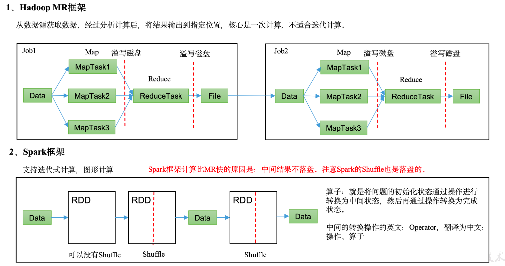
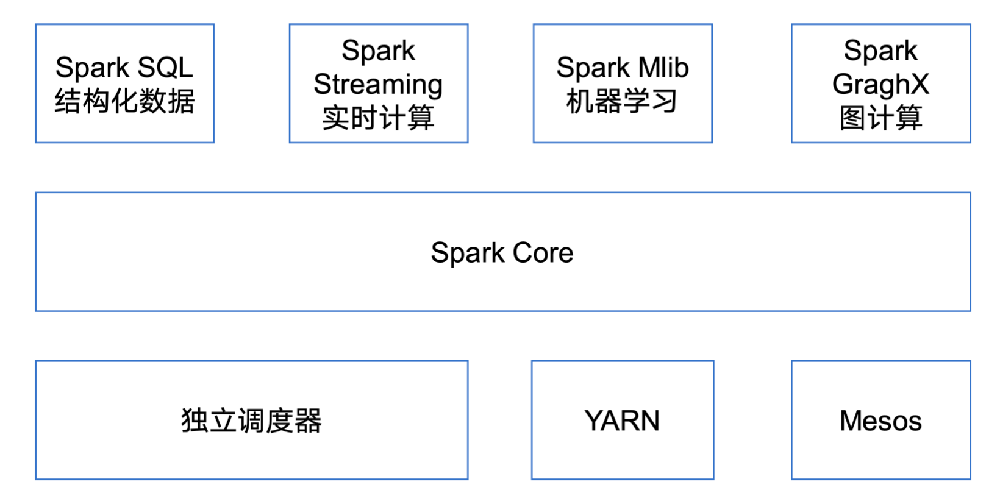
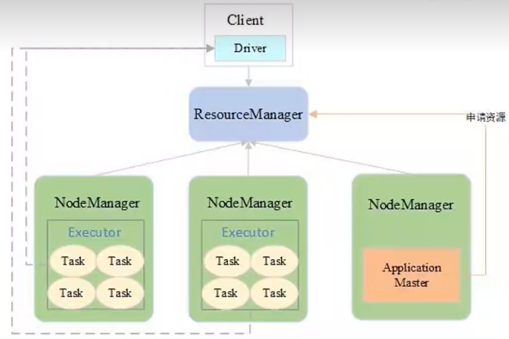
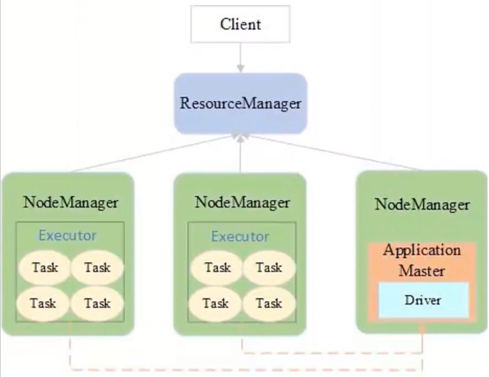
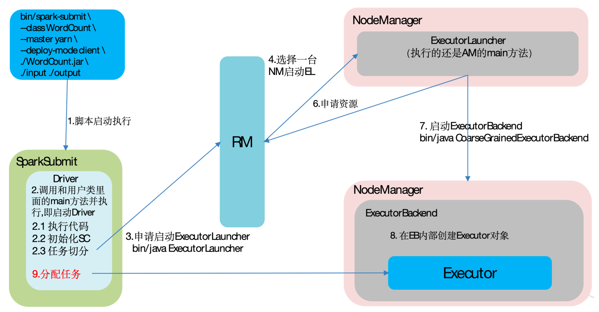
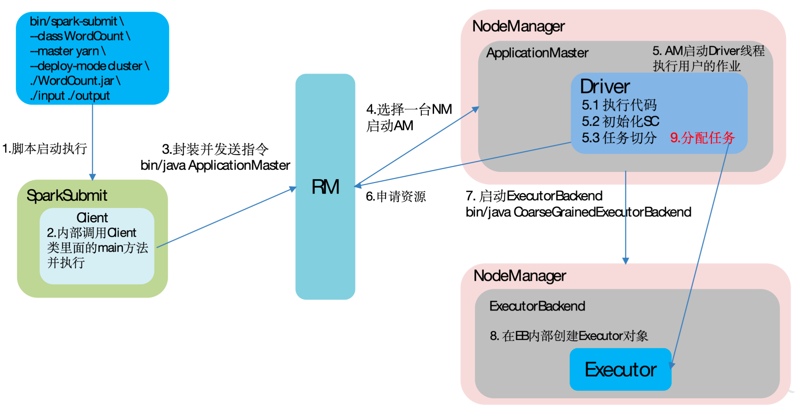

## **Spark**

### **Spark概述**

#### **Spark 简介**

[Spark](https://so.csdn.net/so/search?q=Spark&spm=1001.2101.3001.7020)是一种快速、通用、可扩展的大数据分析引擎，它基于内存计算的大数据并行计算框架，能够显著提高大数据环境下数据处理的实时性，同时保证高容错性和高可伸缩性。以下是对Spark的详细介绍：

 

#### **核心特点**

1. **高速性能**：Spark采用内存计算（In-Memory Computing）的方式，将数据存储在内存中进行处理，从而大幅提升了数据处理速度。相比于传统的磁盘存储方式，Spark能够在内存中进行更快的数据访问和计算。
2. **可扩展性**：Spark具有良好的可扩展性，可以在大规模分布式集群上运行。它通过将任务发到集群中多个节点并行执行，充分利用集群中的计算和存储资源，实现高效的分布式计算。
3. **容错性**：Spark具备容错性，即使在集群中发生节点故障或任务失败时，它能够自动恢复和重新执行。Spark通过记录数据操作的转换历史和依赖关系，可以在发生故障时重新计算丢失的数据，确保计算结果的正确性和可靠性
4. **多种语言处理任务支持**：Spark支持多种数据处理任务，包括批处理、交互式查询、流式处理和机器学习等。它提供了丰富的API和库，用于处理不同类型的数据和应用场景。
5. **多语言支持**：Spark支持多种编程语言，如Scala、Java、Python和R等。开发人员可以使用自己熟悉的编程语言来编写Spark应用程序，方便快捷地进行大数据处理和分析。

 

#### **Spark VS Hadoop**



尽管 Spark 相对于 Hadoop 而言具有较大优势，但 Spark 并不能完全替代 Hadoop，Spark 主要用于替代Hadoop中的 MapReduce 计算模型。存储依然可以使用 HDFS，但是中间结果可以存放在内存中；调度可以使用 Spark 内置的，也可以使用更成熟的调度系统 YARN 等。

实际上，Spark 已经很好地融入了 Hadoop 生态圈，并成为其中的重要一员，它可以借助于 YARN 实现资源调度管理，借助于 HDFS 实现分布式存储。

此外，Hadoop 可以使用廉价的、异构的机器来做分布式存储与计算，但是，Spark 对硬件的要求稍高一些，对内存与 CPU 有一定的要求。

 

#### **Spark的优势与特点**

- **快**：与 Hadoop 的 MapReduce相比，Spark 基于内存的运算块100倍以上，基于硬盘的运算也要快10倍以上。Spark 实现了高效的 DAG 执行引擎，可以通过内存来高效处理数据流。计算的中间结果是存在内存中的
- **易用**：Spark 支持 Java，Python 和 Scala 的API，还支持超过80种高级算法，使得用户可以快速构建不同的应用。而且Spark 支持交互式的 Python 和 Scala 的 Shell，还可以非常方便地在这些Shell 中使用 Spark 集群来验证解决问题的方法
- **通用**：Spark 提供了统一的解决方案。Spark 可以用于，交互式查询（Spark SQL）、实时流处理（Spark Stream）、机器学习（Spark MLlib）和图计算（GraphX）
- **兼容性**：Spark 可以非常方便地与其他开源产品进行融合。比如，Spark 可以使用 Hadoop 的 YARN 作为它的资源管理和调度器的，并且可以处理所有 Hadoop 支持数据

 

#### **Spark生态圈**



- **Spark Core**：实现了Spark的基本功能，包含任务调度、内存管理、错误恢复、与存储系统交互等模块。Spark Core中还包含了对弹性分布式数据集(Resilient Distributed DataSet，简称RDD)的API定义
- **Spark SQL**：是Spark用来操作结构化数据的程序包。通过Spark SQL，我们可以使用 SQL或者Apache Hive版本的HQL来查询数据。Spark SQL支持多种数据源，比如Hive表、Parquet以及JSON等
- **Spark Straming**：是Spark提供的对实时数据进行流式计算的组件。提供了用来操作数据流的API，并且与Spark Core中的 RDD API高度对应
- **Spark MLlib**：是Spark提供的对实时数据进行流式计算的组件。提供了用来操作数据流的API，并且与Spark Core中的 RDD API高度对应
- **GraphX(图计算)**：Spark 中用于图计算的 API，性能良好，拥有丰富的功能和运算符，能在海量数据上自如地运行复杂的图算法
- **集群管理器**：Spark 中用于图计算的 API，性能良好，拥有丰富的功能和运算符，能在海量数据上自如地运行复杂的图算法
- **Structured Streaming**：处理结构化流,统一了离线和实时的 API。

 

## **Spark 部署**

### Spark 运行模式类型

**① local 本地模式(单机)**

- 学习测试使用
- Spark程序以多线程方式直接运行在本地

**② standalone 独立集群模式**



- Spark 集群独立运行，不依赖于第三方资源管理系统，如 Yarn、Mesos
- 采用Master/Slave架构
- Driver在Worker 中运行，Master 只负责集群管理
- Zookeeper 负责Master HA，避免单点故障
- 适用于集群规模不大，数据量不大的情况

**③ standalone-HA 高可用模式**

生产环境使用

基于 standalone 模式，使用 zk 搭建高可用，避免 Master 是有单点故障的。

**④ on yarn 集群模式**



生产环境使用

运行在 yarn 集群之上，由 yarn 负责资源管理，Spark 负责任务调度和计算。

好处：计算资源按需伸缩，集群利用率高，共享底层存储，避免数据跨集群迁移。

**⑤ on mesos 集群模式**

国内使用较少

运行在 mesos 资源管理器框架之上，由 mesos 负责资源管理，Spark 负责任务调度和计算。

**⑥ on cloud 集群模式**

中小公司未来会更多的使用云服务

比如 AWS 的 EC2，使用这个模式能很方便的访问 Amazon 的 S3。

 

### Spark 安装地址

1）官网地址：http://spark.apache.org/

2）文档查看地址：https://spark.apache.org/docs/3.3.1/

3）下载地址：https://spark.apache.org/downloads.html、https://archive.apache.org/dist/spark/


### Local 模式

​	Local模式就是运行在一台计算机上的模式，通常就是用于在本机上练手和测试

**安装使用**

1) 上传并解压 Spark 安装包

```shell
[atguigu@hadoop102 sorfware]$ tar -zxvf spark-3.3.1-bin-hadoop3.tgz -C /opt/module/
[atguigu@hadoop102 module]$ mv spark-3.3.1-bin-hadoop3 spark-local
```

2. 官方 PI 案例

```shell
[atguigu@hadoop102 spark-local]$ bin/spark-submit \
--class org.apache.spark.examples.SparkPi \
--master local[2] \
./examples/jars/spark-examples_2.12-3.3.1.jar \
10
```

`--class`：表示要执行哪个程序的主类

`--master local[2] `:

- local：没有指定线程数，则所有计算都运行在一个线程当中，没有任何并行计算
- local[k]：指定使用 K 个 Core 来运行计算，比如 local[2] 就是运行 2 个 Core 来执行
- local[*]：默认模式。自动帮你按照CPU最多核来设置线程数。比如CPU有8核，Spark帮你自动设置8个线程计算

`spark-examples_2.12-3.3.1.jar`：要执行程序

`10`：要运行程序的输入参数


### Yarn 模式

​	Spark 客户端直接连接 Yarn

**安装使用**

1. 修改 spark-env.sh ，添加 YARN_CONF_DIR 配置，保证后续运行任务的路径都变成集群路径

``` shell
[atguigu@hadoop102 conf]$ mv spark-env.sh.template spark-env.sh
[atguigu@hadoop102 conf]$ vim spark-env.sh

YARN_CONF_DIR=/opt/module/hadoop/etc/hadoop
```

2. 执行程序

```shell
[atguigu@hadoop102 spark-yarn]$ bin/spark-submit \
--class org.apache.spark.examples.SparkPi \
--master yarn \
--deploy-mode client \
./examples/jars/spark-examples_2.12-3.3.1.jar \
10
```

`--master yarn`：以 Yarn 方式运行

`--deploy-mode client/cluster` ：以 Cluster 方式运行


### 配置历史服务器

​	由于是重新解压的 Spark 压缩文件，所以需要针对 Yarn 模式，再次配置一下历史服务器

1）修改 Spark-default.conf

```shell
[atguigu@hadoop102 conf]$ vim spark-defaults.conf
spark.eventLog.enabled          true
spark.eventLog.dir               hdfs://hadoop102:8020/directory
```

2）修改 Spark-env.sh 文件，添加如下配置：

```shell
[atguigu@hadoop102 conf]$ vim spark-env.sh

export SPARK_HISTORY_OPTS="
-Dspark.history.ui.port=18080 
-Dspark.history.fs.logDirectory=hdfs://hadoop102:8020/directory 
-Dspark.history.retainedApplications=30"
```

`-Dspark.history.ui.port`：webUI 访问端口号

`-Dspark.history.fs.logDirectory`：指定历史服务器日志存储路径

`Dspark.history.fs.logDirectory`：指定保存 Application 历史记录的个数，如果超过这个值，旧的应用程序将被删除

3）修改 spark-defaults.conf 文件

```shell
spark.yarn.historyServer.address=hadoop102:18080
spark.history.ui.port=18080
```

4）启动 Spark 历史服务器

```
[atguigu@hadoop102 spark-yarn]$ sbin/stop-history-server.sh 
[atguigu@hadoop102 spark-yarn]$ sbin/start-history-server.sh
```


### 两种模式的运行流程

​	Spark 有 yarn-client 和 yarn-cluster 两种模式，主要区别在于：Driver 程序的运行节点

​	yarn-client：Driver 程序运行在客户端，适用于交互，调试，希望立即看到 APP 输出

​	yarn-cluster：Driver 程序运行在由 ResourceManager 启动的 APPMaster

**Yarn-Client 运行流程**



**Yarn-Cluster**




## Spark SQL

### Spark on Hive

在 `Spark on Hive` 架构中，Spark 可以直接使用 SQL 操作 Hive 中的表（依赖 Hive 的元数据），核心是通过 SparkSession 集成 Hive 元数据，实现对 Hive 表的读和 SQL 查询。以下是具体实现步骤：

**一、环境准备（关键配置）**

确保 Spark 能识别 Hive 的元数据（metaStore）和表数据（通常存储在 HDFS 上）

1. **配置 Hive 元数据连接**

将 Hive 的配置文件 `hive-site.xml` 复制到 Spark 的`conf` 目录下（确保两者元数据配置一致）：

```shell
# 假设 Hive 配置文件路径为 /usr/local/hive/conf/hive-site.xml
cp /usr/local/hive/conf/hive-site.xml $SPARK_HOME/conf/
```

`hive-site.xml` 中需包含 metastore 地址（如远程 metastore 服务）：

```java
<property>
  <name>hive.metastore.uris</name>
  <value>thrift://hive-metastore-host:9083</value>  <!-- Hive metastore 地址 -->
</property>
```


**二、启动 Spark 并使用 SQL**

通过 Spark Shell 或 Spark 应用程序 直接编写 SQL 操作 Hive 表


**方式1：使用 Spark Shell 交互式查询**

1. 启动支持 Hive 的 Spark shell

```shell
$SPARK_HOME/bin/spark-shell --master yarn  # 若集群模式为 YARN
```

2. 执行 Hive SQL

在 Shell 中通过 `spark.sql()` 方法执行 SQL：

```scala
// 查看 Hive 中的数据库
spark.sql("show databases").show()

// 切换数据库
spark.sql("use default")

// 查看表
spark.sql("show tables").show()

// 查询表数据（假设 Hive 中有表 `user_info`）
spark.sql("select id, name from user_info where age > 18").show()

// 创建 Hive 表（使用 Hive 语法，如内部表、外部表）
spark.sql("""
  create table if not exists hive_spark_test (
    id int,
    name string
  )
  row format delimited fields terminated by ','
  stored as textfile
  location '/user/hive/warehouse/hive_spark_test'
""").show()

// 插入数据
spark.sql("insert into hive_spark_test values (1, 'spark'), (2, 'hive')")
```


**方式2：在 Spark 应用程序中使用 SQL**

编写 Scala/Python 代码，通过 `SparkSession`集成 Hive 并执行 SQL

1. 编写脚本

```python
from pyspark.sql import SparkSession

# 初始化支持 Hive 的 SparkSession
spark = SparkSession.builder \
    .appName("SparkOnHiveSQL") \
    .enableHiveSupport()  # 关键：启用 Hive 支持
    .getOrCreate()

# 执行 SQL
spark.sql("show databases").show()

# 查询 Hive 表
df = spark.sql("select * from default.user_info limit 10")
df.show()

# 将结果写入 Hive 表（覆盖/追加）
df.write.mode("overwrite").saveAsTable("default.user_info_top10")

# 关闭 SparkSession
spark.stop()
```

2. 提交应用

```shell
$SPARK_HOME/bin/spark-submit \
  --master yarn \
  --deploy-mode cluster \
  your_script.py
```


**三、关键说明**

1. SQL 语法兼容性

​	Spark SQL 支持大部分 Hive SQL 语法（如 create table、insert、select、join等），但部分 Hive 特有功能（如某些 UDF、transform 语法）可能需要额外配置或存在差异

2. 元数据同步
   Spark 操作的是 Hive 的元数据（通过 metastore），因此在 Hive 中创建 / 修改的表，Spark 可直接识别（无需额外同步）。

3. 数据存储
   表数据仍存储在 Hive 定义的路径（通常是 HDFS），Spark 仅通过元数据获取路径并读写数据，与 Hive 共享存储。

4. 性能优化
   可通过 Spark 的配置优化查询性能，如调整 `spark.sql.shuffle.partitions`（默认 200）、启用广播 join 等：


### Spark Thrift Server

`Spark Thrift Server` 是 Spark 提供的一个 **分布式 SQL 服务**，它兼容 Hive 的 Thrift 接口（即 HiveServer2 协议），允许客户端通过 JDBC/ODBC 方式连接并执行 Spark SQL，是 Spark 与外部工具（如 BI 工具、SQL 客户端）交互的核心组件。


**核心功能**

1. **兼容 Hive 接口**
   遵循 HiveServer2 的 Thrift 协议，支持 Hive JDBC/ODBC 驱动，因此原本连接 Hive 的工具（如 `beeline`、Tableau、Power BI 等）可无缝对接 Spark，无需修改客户端代码。
2. **多用户并发访问**
   作为服务端进程运行，可同时接收多个客户端的 SQL 请求，通过 Spark 的资源管理机制（如 YARN、Standalone）分配集群资源执行查询，支持多用户共享 Spark 集群。
3. **统一数据访问**
   客户端通过 SQL 即可操作 Spark 支持的所有数据源（Hive 表、HDFS、Parquet、CSV、Kafka 等），无需关心底层存储细节。
4. **与 Spark SQL 共享引擎**
   底层使用 Spark SQL 的执行引擎，支持 Spark SQL 的所有语法和优化（如 Catalyst 优化器、Tungsten 执行引擎），性能通常优于 HiveServer2。


**与 HiveServer2的关系**

| 特性         | Spark Thrift Server                        | HiveServer2                              |
| ------------ | ------------------------------------------ | ---------------------------------------- |
| **底层引擎** | 基于 Spark SQL 执行引擎                    | 基于 Hive MapReduce 引擎（或 Tez/Spark） |
| **兼容性**   | 兼容 Hive JDBC/ODBC 接口和大部分语法       | 原生 Hive 语法支持                       |
| **资源管理** | 依赖 Spark 的资源管理器（YARN/Standalone） | 依赖 Hive 的资源配置（通常集成 YARN）    |
| **适用场景** | 实时 / 近实时 SQL 查询、高并发场景         | 离线批处理 SQL、复杂 Hive 语法场景       |


**部署与启动**

1. 前提条件

- 确保 Spark 已集成 Hive 元数据（将 `hive-site.xml`放入 Spark 的 `conf` 目录，以便访问 Hive 表）
- 若使用 Yarn 模式，确保 Yarn 集群正常运行

2. 启动命令

```shell
# 基础启动（默认端口 10000，使用本地模式）
$SPARK_HOME/sbin/start-thriftserver.sh

# YARN 模式启动（推荐生产环境）
$SPARK_HOME/sbin/start-thriftserver.sh \
  --master yarn \
  --deploy-mode client \  # Thrift Server 进程运行在客户端
  --executor-memory 4g \  # 每个 Executor 内存
  --num-executors 10 \    # Executor 数量
  --hiveconf hive.server2.thrift.port=10000 \  # 自定义端口（默认 10000）
  --hiveconf hive.server2.thrift.bind.host=0.0.0.0  # 绑定所有网卡
```

3. 验证启动

- 查看进程：`jps | grep ThriftServer` (应显示 `SparkThriftServer`)
- 检查端口：`ss -tulpn | grep `


**客户端连接方式**

1. 使用 beeline （Spark 自带客户端）

```shell
# 连接 Spark Thrift Server
$SPARK_HOME/bin/beeline -u jdbc:hive2://localhost:10000 -n 用户名

# 执行 SQL（例如查询 Hive 表）
0: jdbc:hive2://localhost:10000> show databases;
0: jdbc:hive2://localhost:10000> select * from default.user_info limit 10;
```

2. JDBC 连接（Java 示例）

```java
import java.sql.*;

public class SparkThriftClient {
    public static void main(String[] args) throws SQLException, ClassNotFoundException {
        // 加载 Hive JDBC 驱动（兼容 Spark Thrift Server）
        Class.forName("org.apache.hive.jdbc.HiveDriver");
        
        // JDBC URL 格式：jdbc:hive2://host:port
        String url = "jdbc:hive2://spark-thrift-host:10000";
        String user = "biadmin";
        String password = "xxx";
        
        // 创建连接
        Connection conn = DriverManager.getConnection(url, user, password);
        Statement stmt = conn.createStatement();
        
        // 执行 SQL
        ResultSet rs = stmt.executeQuery("select count(*) from default.user_info");
        while (rs.next()) {
            System.out.println("总记录数：" + rs.getLong(1));
        }
        
        // 关闭资源
        rs.close();
        stmt.close();
        conn.close();
    }
}
```

3. python 连接（使用 pyhive）

```python
from pyhive import hive

# 建立连接
conn = hive.Connection(
    host='spark-thrift-host',
    port=10000,
    username='biadmin'
)

# 执行查询
cursor = conn.cursor()
cursor.execute('select * from default.user_info limit 10')
for row in cursor.fetchall():
    print(row)

cursor.close()
conn.close()
```

**适用场景**

1. **BI 工具集成**：Tableau、Power BI、Superset 等工具通过 JDBC 连接 Spark Thrift Server，实现可视化分析。
2. **多用户 SQL 交互**：数据分析师通过 `beeline` 或 DBeaver 等客户端直接执行 Spark SQL，无需编写代码。
3. **批处理 SQL 任务**：通过调度系统（如 Airflow）提交 SQL 脚本到 Spark Thrift Server，执行离线计算。

**注意事项**

1. **资源配置**：根据并发量调整 `--executor-memory`、`--num-executors` 等参数，避免资源不足。
2. **元数据同步**：若修改 Hive 表结构，需重启 Spark Thrift Server 或执行 `REFRESH TABLE 表名` 刷新元数据。
3. **权限控制**：可集成 Ranger 或 Sentry 实现表级 / 列级权限控制，限制用户访问范围。
4. **日志查看**：默认日志路径为 `$SPARK_HOME/logs/spark-*-ThriftServer-*.log`，用于排查查询失败问题。

