## StarRocks

### 1 StarRocks 简介

#### 1.1 StarRocks 介绍

- [StarRocks](https://so.csdn.net/so/search?q=StarRocks&spm=1001.2101.3001.7020) 是一款极速全场景 MPP 企业级数据库产品
- StarRocks 充分吸收关系型OLAP数据库和分布式存储系统的优点，在实践基础上，进一步优化、升级架构
- StarRocks 致力于构建极速统一分析体验，满足企业用户的多种数据分析场景，支持多种数据模型（明细模型、聚合模型、更新模型），多种导入方式（批量和实时），可整合和接入多种现有系统（Spark、Flink、Hive）
- StarRocks 兼容MySQL协议，可使用MySQL客户端和常用 BI 工具对接StarRocks 进行数据分析
- StarRocks 采用分布式架构，对数据表进行水平划分并以多副本存储。集群规模可以灵活伸缩，能够支持10PB级别的数据分析，并行加速计算，支持多副本，具有弹性容错能力

#### 1.2 StarRocks 场景

StarRocks 可以满足企业级用户的多种分析需求，包括OLAP多维分析、定制报表、实时数据分析和 Ad-hoc数据分析。

（1）OLAP 多维分析：用户行为分析、用户画像、财务报表、系统监控分析

（2）实时数据分析：电商数据分析、直播质量分析、物流运单分析、广告投放分析

（3）高并发查询：广告主表分析、Dashbroad 多页面分析

（4）统一分析：通过使用一套系统解决上述场景，降低系统复杂度和多技术栈开发成本

#### 1.3 StarRocks 基本概念

（1）FE：FrontEnd 简称 FE，是 StarRocks 的前端节点，负责管理元数据，管理客户端连接，进行查询规划，查询调度等工作

（2）BE：BackEnd简称 BE，是 StarRocks 的后端节点，负责数据存储，计算执行，以及compaction，副本管理等工作

（3）Broker：StarRocks 中外部 HDFS/对象存储等外部数据的中转服务，辅助提供导入导出功能

（4）StarRocksManager：StarRocks 的管理工具，提供StarRocks 集群管理、在线查询、故障查询、监控报警的可视化工具

（5）Tablet：StarRocks 中表的逻辑分片，也是 StarRocks 中副本管理的基本单元，每个表根据分区和分桶机制被划分为多个Tablet 存储在不同的 BE 节点上

#### 1.4 StarRocks 系统架构

  StarRocks 架构简洁明了，整个系统仅由两种组件组成：前端和后端。前端节点称为 **FE**。后端节点有两种类型，**BE** 和 **CN** (计算节点)。当使用本地存储数据时，您需要部署 BE；当数据存储在对象存储或 HDFS 时，需要部署 CN。StarRocks 不依赖任何外部组件，简化了部署和维护。节点可以水平扩展而不影响服务正常运行。此外，StarRocks 具有元数据和服务数据副本机制，提高了数据可靠性，有效防止单点故障 (SPOF)。

 

  StarRocks 兼容 MySQL 协议，支持标准 SQL。用户可以轻松地通过 MySQL 客户端连接到 StarRocks 实时查询分析数据。

 

**架构选择**

StarRocks 支持存算一体架构（每个 BE 节点将其数据存储在本地存储）和存算分离架构（所有数据存储在对象存储或 HDFS 中，每个 CN 仅在本地存储缓存）

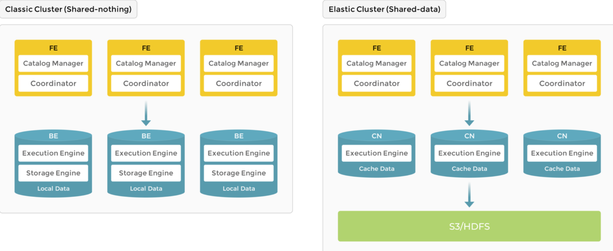

 

**存算一体**

本地存储为实时查询提供了更低的查询延迟

 

作为典型的大规模并行处理（MPP）数据库，StarRocks 支持存算一体架构，BE负责数据存储和计算。将数据存储在 BE 中使得数据可以在当前节点中计算，避免了数据传输和复制，从而提供了极快的查询和分析性能。该架构支持多副本存储，增强了集群处理高并发的能力。

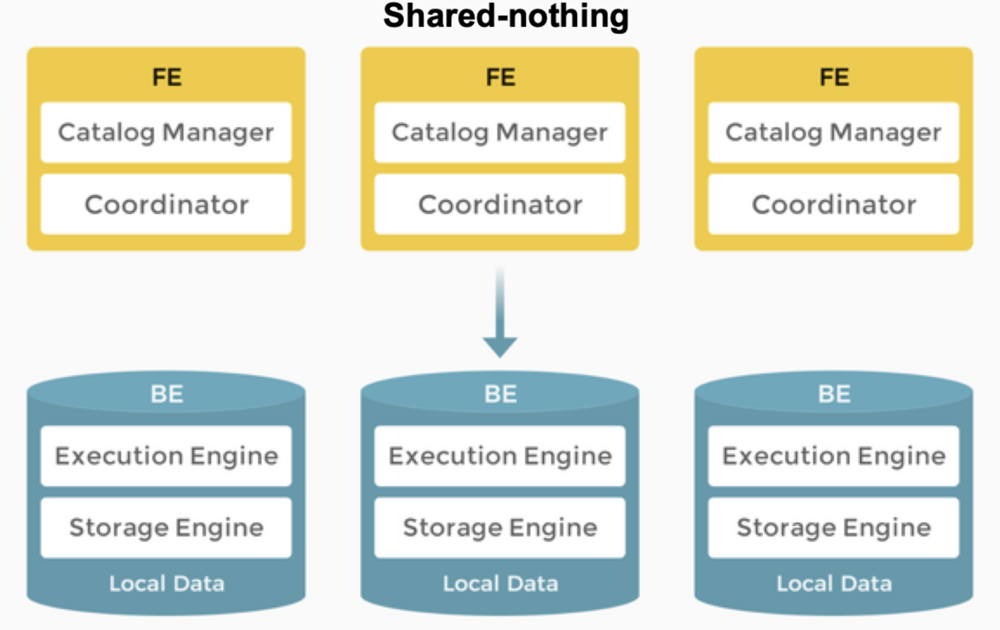 


**FE节点：**

**简介**

  FE负责元数据管理、客户端连接管理、查询规划和查询调度。每个FE 使用BDB JE（Berkeley DB Java Edition）在其内存中存储和维护元数据的完整副本，从而确保FE 之间的服务一致。FE 可以作为领导者、追随者和观察者。如果 leader 节点崩溃，follow 根据 Raft 协议选举 leader

**角色**

| FE 角色       | 元数据管理                                                   | 节点选主                                                     |
| ------------- | ------------------------------------------------------------ | ------------------------------------------------------------ |
| Leader 节点   | Leader FE 负责读写元数据。Follower 节点和 Observer 节点只能读取元数据，并将元数据写请求路由到 Leader FE。Leader FE 更新元数据，然后使用 Raft 协议将元数据更改同步到 Follower 节点和 Observer 节点。只有在元数据更改同步到超过一半的Follower 节点后，数据写入才被认为成功。 | Leader FE 技术上也是一个 Follower 节点，是从Follower 节点中选举出来的。要执行主节点选举，集群中必须有超过一半的Follower 节点处于活动状态。当 Leader FE 发生故障时，Follower 节点将开始另一轮主节点选举。 |
| Follower 节点 | Follower 节点只能读取元数据。它们从 Leader FE 同步和重放日志以更新元数据。 | Follower 节点参与主节点选举，这需要集群中超过一半的 Follower 节点处于活动状态。 |
| Observer 节点 | Observer 节点从 Leader FE 同步和重放日志以更新元数据。       | Observer 节点 主要用于增加集群的查询并发性。 Observer 节点不参与主节点选举，因此不会增加集群的主节点选举压力。 |

**功能**

- FE 接收Mysql客户端连接，解析并执行SQL 语句。管理元数据，执行 SQL DDL命令，用Catalog纪录库，表，分区，tablet副本 等信息
- FE高可用部署，使用复制协议选主和主从同步元数据，所有元数据修改操作，由 FE leader节点完成，FE follower 节点可执行读操作
- FE 的 SQL layer对用户提交的SQL进行解析，分析，改写，语义分析和关系代数优化，生产逻辑执行计划
- FE 的 Planner 负责把逻辑计划转化为可分布式执行的物理计划，分发给一组BE
- FE 监督BE，管理 BE 的上下线的，根据BE 的存活和健康状态，维持 tablet 的副本数量，FE协调数据导入的，保证数据导入的一致性

**BE节点：**

**简介**

BE负责数据存储和 SQL 执行

**功能**

- 数据存储：BE具有等效的数据存储能力。FE根据预定义规则将数据分发到各个BE。BE 转换导入的数据，将数据写入所需格式，并为数据生成索引
- SQL 执行：FE根据查询的语义将每个 SQL 查询解析为逻辑执行计划，将逻辑计划转换为可以在 BE 上执行的物理执行计划。BE 在本地存储以及执行查询，避免了数据传输和复制，极大地提高了查询性能
- BE管理tablet副本，tablet是table 经过分区分桶形成子表，采用列式存储
- BE受 FE 指导，创建或删除子表
- BE 接收 FE分发的物理执行计划并指定 BE coordinator节点。在 BEcoordinator 的调度下与其他 BE worker共同协作完成执行。
- BE读本地的列存储引擎获取数据，并通过索引和谓词下沉快速过滤数据

 

**存算分离**

**简介**

对象存储和 HDFS 提供低成本、搞可靠性和可扩展性等优势。除了可以扩展存储外，还可以随时添加和删除 CN 节点。因为存储和计算分离，增删节点也无需重新平衡数据。

在存算分离架构中，BE 被“计算节点 (CN)”取代，后者仅负责数据计算任务和缓存热数据。数据存储在低成本且可靠的远端存储系统中，如 Amazon S3、GCP、Azure Blob Storage、MinIO 等。当缓存命中时，查询性能可与存算一体架构相媲美。CN 节点可以根据需要在几秒钟内添加或删除。这种架构降低了存储成本，确保更好的资源隔离，并具有高度的弹性和可扩展性。

存算分离架构与存算一体架构一样简单。它仅由两种类型的节点组成：FE 和 CN。唯一的区别是用户必须配置后端对象存储。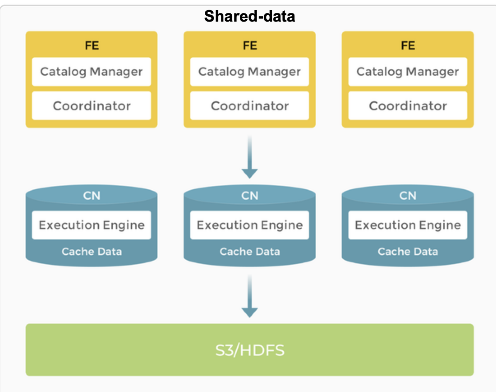

**节点**

在存算分离架构中，FE 提供的功能与存算一体架构中相同。

BE 被 CN（计算节点）取代，存储功能被转移到对象存储或 HDFS。CN 是无状态计算节点，可以执行除存储数据外所有 BE 的功能

**存储**

StarRocks 存算分离集群支持两种存储解决方案：对象存储 和 HDFS。在存算分离集群中，数据文件格式与存算一体集群保持一致。数据存储为 Segment文件，云原生表（专门用于存算分离集群的表）

**缓存**

StarRocks存算分离集群将数据存储和计算分离，使两方都能独立扩展，从而降低成本提供系统弹性扩展能力。

为减少架构对于性能的影响，StarRocks 建立了包含内存、本地磁盘和远端存储的多层数据访问系统，以便更好地满足各种业务需求。

对于针对热数据的查询，StarRocks 会先扫描缓存，然后扫描本地磁盘。而针对冷数据的查询，需要先将数据从对象存储中加载到本地缓存中，加速后续查询。通过将热数据缓存在计算单元内，StarRocks 实现了真正的高计算性能和高性价比存储。此外，还通过数据预取策略优化了对冷数据的访问，有效消除了查询的性能限制。

可以在建表时启用缓存。启用缓存后，数据将同时写入本地磁盘和后端对象存储。在查询过程中，CN 节点首先从本地磁盘读取数据。如果未找到数据，将从后端对象存储中检索，并将数据缓存到本地磁盘中。

 

 

 

#### 1.5 StarRocks 特性

**MPP 分布式执行框架**

​     StarRocks 采用 MPP (Massively Parallel Processing) 分布式执行框架。在 MPP 执行框架中，一条查询请求会被拆分成多个物理计算单元，在多机并行执行。每个执行节点拥有独享的资源（CPU、内存）。MPP 执行框架能够使得单个查询请求可以充分利用所有执行节点的资源，所以单个查询的性能可以随着集群的水平扩展而不断提升。

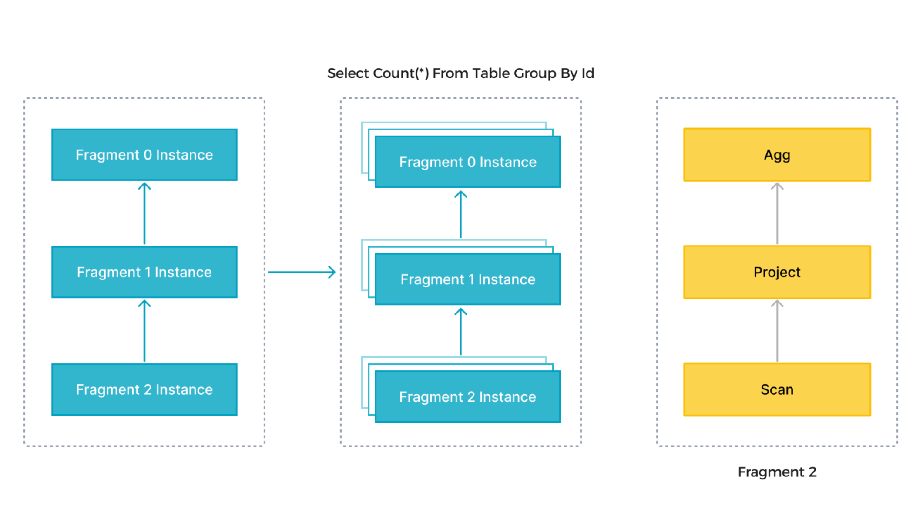

如上图所示，StarRocks 会将一个查询在逻辑上切分为多个逻辑执行单元（Query Fragment）。按照每个逻辑执行单元需要处理的计算量，每个逻辑执行单元会由一个或者多个物理执行单元来具体实现。物理执行单元是最小的调度单位。一个物理执行单元会被调度到集群某个 BE 上执行。一个逻辑执行单元可以包括一个或者多个执行算子，如图中的 Fragment 包括了 Scan，Project，Aggregate。每个物理执行单元只处理部分数据。由于每个逻辑执行单元处理的复杂度不一样，所以每个逻辑执行单元的并行度是不一样的，即，不同逻辑执行单元可以由不同数目的物理执行单元来具体执行，以提高资源使用率，提升查询速度。

 

**核心概念解释**

**1. 查询切分为多个逻辑执行单元（Query Fragment）：**

- 查询（Query）：指用户发起的 SQL 查询。 
-  在 StarRocks 中，一个查询在执行时会被拆解成多个逻辑执行单元。逻辑执行单元是查询执行的一个抽象概念，用于表示查询的一部分操作。 
-  比如，查询语句中可能有 扫描 数据、计算投影（即列的计算）、聚合 等操作，每一部分就是一个逻辑执行单元。 

**2. 物理执行单元（Physical Execution Unit）：**

-  物理执行单元是最小的 调度单位。它负责执行特定的计算操作，并在集群中的 后端（BE） 节点上执行。 
-  物理执行单元是针对具体硬件或计算资源的一个具体操作单元。每个物理执行单元可以被调度到某个 BE（Backend）节点 上，这些节点负责实际的数据存储和计算。 
-  例如，一个 Scan 操作可能会在多个 BE 节点上并行地读取数据。 

**3. 逻辑执行单元包含多个执行算子：**

一个 逻辑执行单元 可以包含多个执行算子（Operator）。算子表示查询中的具体操作，如：

- 
- Scan：扫描数据表中的数据。 
- Project：投影（选择）指定的列。 
- Aggregate：对数据进行聚合（如 `GROUP BY`、`SUM` 等操作）。 
-  这些操作算子是查询处理的组成部分，StarRocks 会把它们作为一个 逻辑执行单元 来执行。 
- **物理执行单元并行执行**：

在 **StarRocks** 中，不同的 逻辑执行单元 可能有不同的计算复杂度。例如：

-  一个逻辑执行单元可能只涉及简单的 Scan 操作，计算量较小； 

   另一个逻辑执行单元可能涉及复杂的 Aggregation 操作，计算量较大。 

-  为了提高资源利用率和查询性能，StarRocks 会根据每个逻辑执行单元的计算量，动态调整物理执行单元的并行度。换句话说，不同的逻辑执行单元会由不同数量的物理执行单元来执行，从而实现并行计算。 

- **资源使用和查询速度的提升**：

-  通过这种 动态分配物理执行单元的数量，StarRocks 能够提高 资源使用率（即充分利用集群中的计算资源）。 
-  这种并行处理能够大幅提升 查询速度，特别是对于大规模数据的查询，能够显著缩短查询时间。

 

 

**数据湖分析**

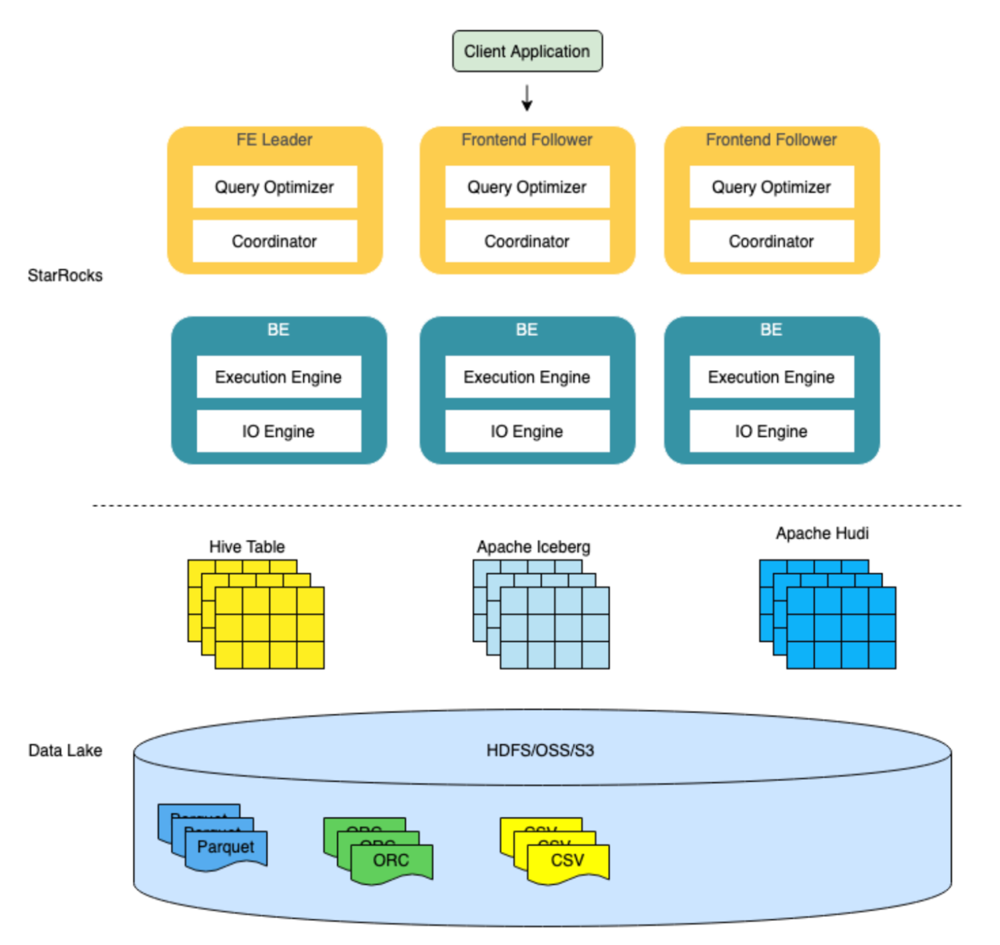      StarRocks 不仅能高效的分析本地存储的数据，也可以作为计算引擎直接分析数据湖中的数据。用户可以通过 StarRocks 提供的 External Catalog，轻松查询存储在 Apache Hive、Apache Iceberg、Apache Hudi、Delta Lake 等数据湖上的数据，无需进行数据迁移。支持的存储系统包括 HDFS、S3、OSS，支持的文件格式包括 Parquet、ORC、CSV。

​     如上图所示，在数据湖分析场景中，StarRocks 主要负责数据的计算分析，而数据湖则主要负责数据的存储、组织和维护。使用数据湖的优势在于可以使用开放的存储格式和灵活多变的 schema 定义方式，可以让 BI/AI/Adhoc/报表等业务有统一的 single source of truth。而 StarRocks 作为数据湖的计算引擎，可以充分发挥向量化引擎和 CBO 的优势，大大提升了数据湖分析的性能。

### 2 StarRocks使用

#### 2.1 StarRocks目录结构

```
StarRocks
├── apache_hdfs_broker
│   ├── bin
│   ├── conf
│   ├── lib
│   └── log
├── be
│   ├── bin
│   ├── conf
│   ├── lib
│   ├── log
│   └── spill
│       └── www
├── fe
│   ├── bin
│   ├── conf
│   ├── datadog
│   ├── hive-udf
│   ├── lib
│   ├── log
│   ├── plugins
│   ├── spark-dpp
│   ├── temp_dir
│   └── webroot
├── License.txt
├── Notice.txt
└── udfx
```

#### 2.2 StarRocks命令行操作

系统操作

```
-- 连接集群
mysql -h[FE_IP] -P9030 -u[用户名] -p
-- 查看 FE 节点状态
show proc '/frontends'
-- 增加Follower 节点
ALTER SYSTEM ADD follower "fe_host:edit_log_port"
-- 增加 Observer 节点
ALTER SYSTEM ADD observer "fe_host:edit_log_port"
-- 删除 Follower 节点
ALTER SYSTEM DROP follower "fe_host:edit_log_port"
-- 删除Observer 节点
ALTER SYSTEM DROP observer "fe_host:edit_log_port"
-- 查看 BE 节点状态
SHOW PROC '/backends'
-- 增加节点
ALTER SYSTEM ADD backend 'be_host:be_heartbeat_service_port'
-- 删除节点
ALTER SYSTEM DECOMMISSION backend "be_host:be_heartbeat_service_port"
```

### 3 StarRocks表设计 

#### **3.1 列式存储**

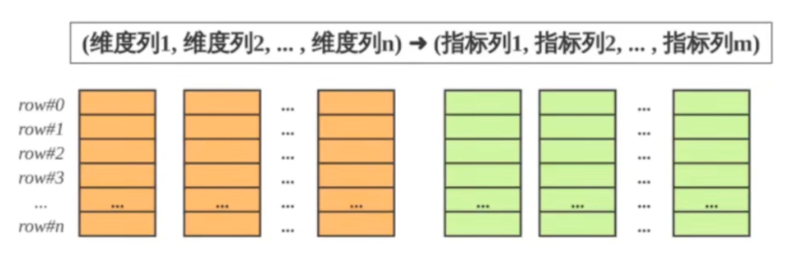StarRocks的表和关系数据相同，由行和列构成。每行数据对应用户一条数据，每列数据有相同数据类型。所有数据行的列数相同，可以动态增删列。StarRocks 中，一张表的列可以分为维度列（Key列）和指标列（Value 列)，维度列用于分组和排序，指标列可通过聚合函数SUM，COUNT，MIN，MAX等累加起来。因此 StarRocks 的表也可以认为是多维的 key 到多维指标的隐射

在StarRocks中，表中数据按列存储，物理上，一列数据会经过分块编码压缩等操作，然后持久化于非易失设备，但在逻辑上 ，一列数据可以看成相同类型的元素构成的数组。

查询时，如果制定了维度列的等值条件或范围条件，并且这些维度列可构成表维度列的前缀，则可以利用数据的有序性，快速锁定目标行

 

#### **3.2 稀疏索引**

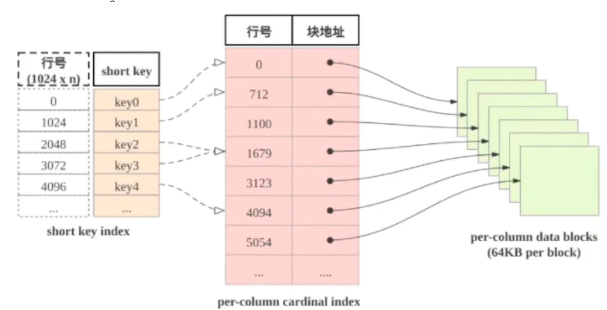

stortkey index表：表中数据每行1024行，构成一个逻辑block，每个逻辑block 在 shortkey index表中存储一项索引，内容为表 dee维度列的前缀，并且不超过36字节. shortkey index为稀疏索引，用数据行的维度列和前缀查找索引表，可以确定该行数据所在逻辑块的起始行号

 

#### **3.3 加速数据处理**

（1）预先聚合：StarRocks 支持聚合模型，维度列取值相同数据可合并为一行，合并后数据行 的维度列取值不变，指标列的取值为这些数据行的聚合结果，用户需要给指标列指定聚合函数，通过预先聚合，可以加速聚合操作

（2）分区分桶：StarRocks 的表被划分为 tablet ，每个tablet 多副本冗余存储在 BE 上，BE 和 tablet的数量可以根据计算资源和数据规模而弹性伸缩。查询时，多台BE 可并行地查找tablet快速获取数据

（3）RollUp表索引：shortkey index加速数据查找，然后 shortkey index依赖维度列排列次序

（4）列级别的索引技术：Bloomfilter 可快速判断数据块中不含所查找值，ZoneMap 通过数据范围快速过滤待查找值，Bitmap索引可快速计算出枚举类型的列满足一定条件的行

### **4 StarRocks数据模型**

目前StarRocks 根据摄入数据和实际存储数据之间的映射关系，分为明细模型（Duplicate key）、聚合模型（Aggregate key）、更新模型（Unique key）和主键模型（Primary Key）

#### **4.1 明细模型**

StarRocks建表默认采用明细模型，排序列使用稀疏索引，可以快速过滤数据。明细模型用于保存所有的历史数据，并且用户可以考虑过滤条件中频繁使用的维度列作为排序键。

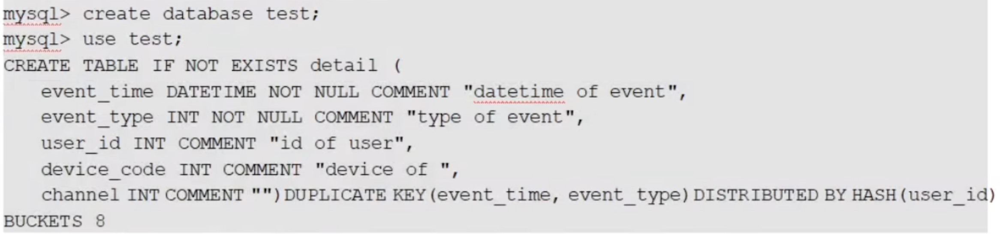

#### **4.2 聚合模型**

在数据分析中，很多场景需要基于明细数据进行统计和汇总，这个时候就可以使用聚合模型。

特点：

- 业务方进行查询为汇总类查询，比如sum、count、max
- 不需要查看原始明细数据
- 老数据不会被频繁修改，只会追加和新增

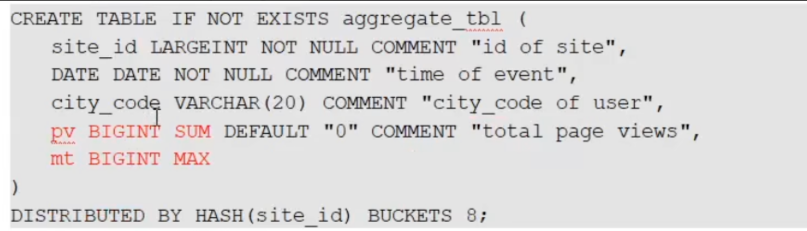

#### 4.3 更新模型

有些分析厂场景之下，数据需要进行更新比如拉链表，StarRocks则采用更新模型来满足这种需求，比如电商场景下，订单的状态会发生变化，每天的订单更新量可突破上亿。这种业务场景下，如果只靠明细模型下通过 delete+insert 的方式，是无法满足频繁更新需求的，因此需要更新模型来满足分析需求。但是如果用户需要更实时/频繁的更新操作，建议使用主键模型。

特点：

- 所有数据更新均会插入，查询时进行合并
- 已经写入的数据有大量的更新需求
- 需要进行实时数据分析
- 当指定唯一键后，唯一键相同的数据会进行合并操作

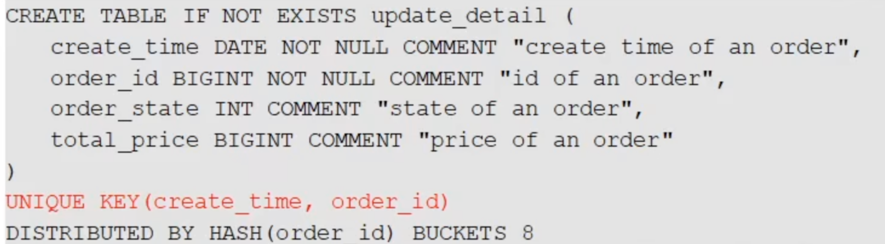

#### **4.4 主键模型**

主键模型支持分别定义主键和排序键。数据导入至主键模型的表时先按照排序键排序后存储。查询时返回主键相同的一组数据中的最新数据。相对于更新模型，主键模型在查询时不需要执行聚合操作，并且支持谓词和索引下推，能够在支持**实时和频繁更新**等场景的同时，提供高效查询。

> **说明**
>
> - 3.0 版本之前，主键模型不支持分别定义主键和排序键。
> - 自 3.1 版本起，存算分离模式支持创建主键模型表，并且自 3.1.4 版本起，支持基于本地磁盘上的持久化索引。


##### **适用场景**

主键模型适用于实时和频繁更新的场景，例如：

- **实时对接事务型数据至 StarRocks**。事务型数据库中，除了插入数据外，一般还会涉及较多更新和删除数据的操作，因此事务型数据库的数据同步至 StarRocks 时，建议使用主键模型。[通过 Flink-CDC 等工具直接对接 TP 的 Binlog](https://docs.starrocks.io/zh/docs/3.1/loading/Flink_cdc_load/)，实时同步增删改的数据至主键模型，可以简化数据同步流程，并且相对于 Merge-On-Read 策略的更新模型，查询性能能够提升 3~10 倍。
- **利用部分列更新轻松实现多流 JOIN**。在用户画像等分析场景中，一般会采用大宽表方式来提升多维分析的性能，同时简化数据分析师的使用模型。而这种场景中的上游数据，往往可能来自于多个不同业务（比如来自购物消费业务、快递业务、银行业务等）或系统（比如计算用户不同标签属性的机器学习系统），主键模型的部分列更新功能就很好地满足这种需求，不同业务直接各自按需更新与业务相关的列即可，并且继续享受主键模型的实时同步增删改数据及高效的查询性能。


### 5 StarRocks查询优化

#### 5.1 排序键

**简介**

 StarRocks中为加速查询，在内部组织并存储数据时，会把表中数据按照指定列的列进行排序，这部分用于排序的列（可以是一个或多个列），称之为Sort key。使用排序键的本质是在进行二分查找，所以排序列指定的越多，消耗的内存越大

**特点**

- SortKey的列只能是排序键的前缀
- SortKey 列数只能是排序键的前缀
- 字节数不超过36字节
- 不包含Float/Double类型的列
- Varchar类型列只能出现一次，并且是末尾位置

#### 5.2 物化视图

Materialized View 表：简称MVs，物化视图

**简介**

在实际的业务场景中，通常存在两种场景并存的分析需求：对固定维度的聚合分析和对原始明细数据任意维度的分析

**使用**

使用聚合函数（如 sum 和 count）的查询，在已经包含聚合数据的表中可以高效地执行。这种改进的效率对于查询大量数据尤其适用。表中数据被物化在存储节点中，并且在增量更新中能和 Base 表保持一致。用户创建 MVs 表后，查询优化器支持选择一个更高效的 MVs 映射，并直接对 MVs表进行查询而不是Base 表。由于MVs 表通常必 Base 表数据小很多所以查询通常会快很多

#### 5.3 Bitmap索引

**简介**

StarRocks 支持基于 BitMap索引，对于 Filter的查询有明显的加速效果。

**原理**

 Bigmap是元素为 bit，取值为0，1两种情形。可对某一位bit 进行置位和清零操作的数组

 

### 6 StarRocks 数据分布

#### 6.1 分区

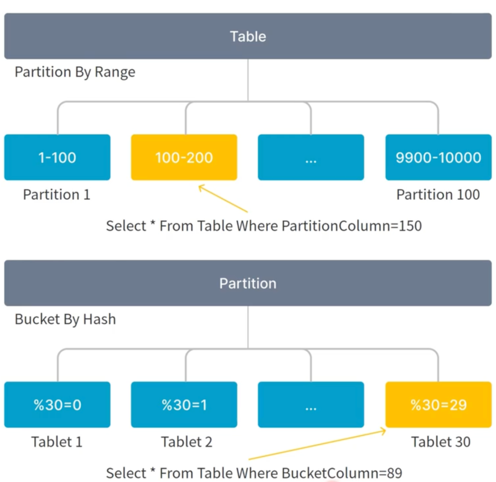

**分区**

Partition分区的（支持Range，List 或表达式分区）

方便数据管理，一般按照时间或枚举字段切分数据，小表也可以不分区

- **Range分区**

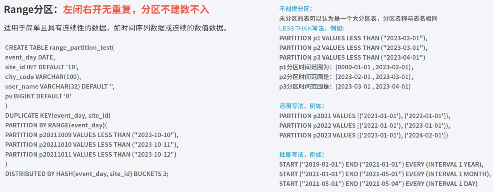

- **List 分区**

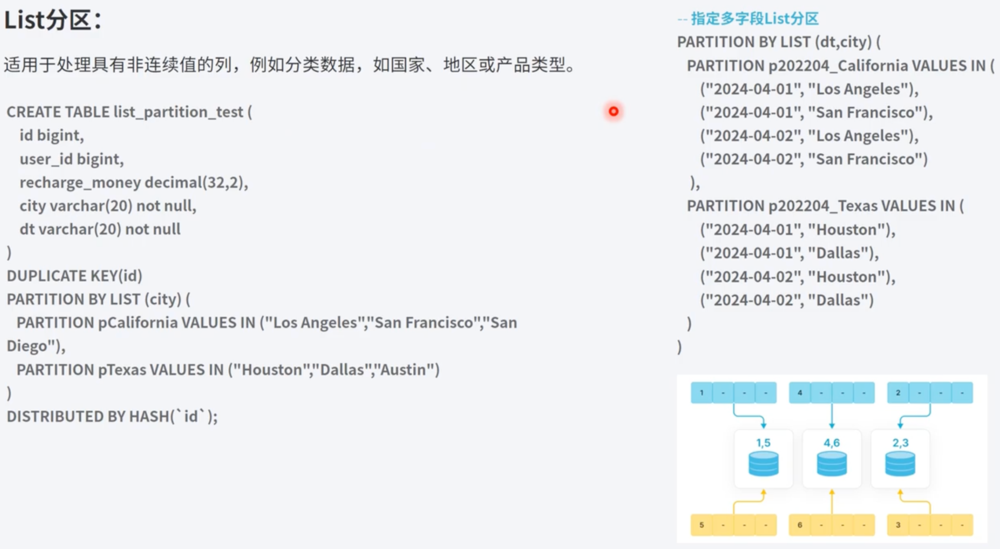

- **表达式分区**

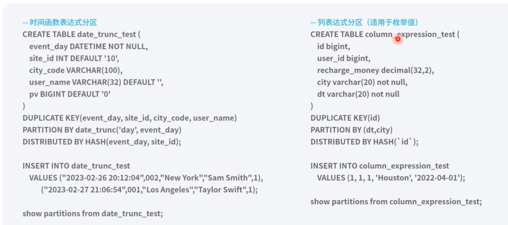 

#### 6.2 分桶

**分桶**

Distribution 分桶选择高基数的、经常作为查询条件列，作为分桶键，进行数据裁剪。分桶键可以选择一个或多个，将数据打散成片

Bucket 的 数量 需要适中，单 Tablet 控制在 1GB-10GB之间，Tablet太多会导致元数据过多，占用较多内存。分桶太少则会影响表的查询性能

 

**数据结构**

在 StarRocks 中，数据表经过分区分桶后，形成一个个数据不重叠的 Tablet 子表，这些Tablet会根据StarRocks 的副本策略，分布在集群的所有 BE 中  

 

### 7 StarRocks开发

#### 7.1 系统操作

1 库连接

```
 mysql -P9030 -h127.0.0.1 -uroot --prompt="StarRocks > "
```

2 查看 FE 节点状态

```
SHOW PROC '/frontends'\G
```

3 查看 BE 节点状态

```
SHOW PROC '/backends'\G
```

 

#### 7.2 数据库操作

**DDL**

1 创建数据库

```
CREATE DATABASE example_db;
```

2 创建表

```
use example_db;
CREATE TABLE IF NOT EXISTS `detailDemo` (
    `recruit_date`  DATE           NOT NULL COMMENT "YYYY-MM-DD",
    `region_num`    TINYINT        COMMENT "range [-128, 127]",
    `num_plate`     SMALLINT       COMMENT "range [-32768, 32767] ",
    `tel`           INT            COMMENT "range [-2147483648, 2147483647]",
    `id`            BIGINT         COMMENT "range [-2^63 + 1 ~ 2^63 - 1]",
    `password`      LARGEINT       COMMENT "range [-2^127 + 1 ~ 2^127 - 1]",
    `name`          CHAR(20)       NOT NULL COMMENT "range char(m),m in (1-255)",
    `profile`       VARCHAR(500)   NOT NULL COMMENT "upper limit value 1048576 bytes",
    `hobby`         STRING         NOT NULL COMMENT "upper limit value 65533 bytes",
    `leave_time`    DATETIME       COMMENT "YYYY-MM-DD HH:MM:SS",
    `channel`       FLOAT          COMMENT "4 bytes",
    `income`        DOUBLE         COMMENT "8 bytes",
    `account`       DECIMAL(12,4)  COMMENT "",
    `ispass`        BOOLEAN        COMMENT "true/false"
) ENGINE=OLAP
DUPLICATE KEY(`recruit_date`, `region_num`)
PARTITION BY RANGE(`recruit_date`)
(
    PARTITION p20220311 VALUES [('2022-03-11'), ('2022-03-12')),
    PARTITION p20220312 VALUES [('2022-03-12'), ('2022-03-13')),
    PARTITION p20220313 VALUES [('2022-03-13'), ('2022-03-14')),
    PARTITION p20220314 VALUES [('2022-03-14'), ('2022-03-15')),
    PARTITION p20220315 VALUES [('2022-03-15'), ('2022-03-16'))
)
DISTRIBUTED BY HASH(`recruit_date`, `region_num`);
```

3 查看数据中所有表

```
SHOW TABLES;
```

4 查看表结构

```
DESC table_name;
```

5 查看建表语句

```
SHOW CREATE TABLE table_name;
```

6 增加列

```
ALTER TABLE detailDemo ADD COLUMN uv BIGINT DEFAULT '0' after ispass;
```

7 删除列

```
ALTER TABLE detailDemo DROP COLUMN uv;
```

8 查看修改表结构作业状态

```
SHOW ALTER TABLE COLUMN\G;
```

9 取消修改表结构

```
CANCEL ALTER TABLE COLUMN FROM table_name\G;
```

10 创建用户并授权

```
CREATE USER 'test' IDENTIFIED by '123456';
GRANT ALL on example_db.* to test;
```


#### 7.3 审计插件使用

在 StarRocks 中，所有的审计信息仅存储在日志文件 **fe/log/fe.audit.log** 中，无法直接通过 StarRocks 进行访问。AuditLoader 插件可实现审计信息的入库，让您在 StarRocks 内方便的通过 SQL 进行集群审计信息的查看和管理。安装 AuditLoader 插件后，StarRocks 在执行 SQL 后会自动调用 AuditLoader 插件收集 SQL 的审计信息，然后将审计信息在内存中攒批，最后基于 Stream Load 的方式导入至 StarRocks 表中。

**创建审计日志库表**

在 StarRocks 集群中为审计日志创建数据库和表。详细操作说明参阅 [CREATE DATABASE](https://docs.starrocks.io/zh/docs/sql-reference/sql-statements/Database/CREATE_DATABASE/) 和 [CREATE TABLE](https://docs.starrocks.io/zh/docs/sql-reference/sql-statements/table_bucket_part_index/CREATE_TABLE/)。

> **注意**
>
> - 请勿更改示例中的表属性，否则将导致日志导入失败。
> - StarRocks 各个大版本的审计日志字段个数存在差异，为保证版本通用性，新版本的审计插件选取了各大版本中通用的日志字段进行入库。若业务中需要更完整的字段，可替换工程中的 `fe-plugins-auditloader\lib\starrocks-fe.jar`，同时修改代码中与字段相关的内容后重新编译打包。

```sql
CREATE DATABASE starrocks_audit_db__;

CREATE TABLE starrocks_audit_db__.starrocks_audit_tbl__ (
  `queryId`           VARCHAR(64)                COMMENT "查询的唯一ID",
  `timestamp`         DATETIME         NOT NULL  COMMENT "查询开始时间",
  `queryType`         VARCHAR(12)                COMMENT "查询类型（query, slow_query, connection）",
  `clientIp`          VARCHAR(32)                COMMENT "客户端IP",
  `user`              VARCHAR(64)                COMMENT "查询用户名",
  `authorizedUser`    VARCHAR(64)                COMMENT "用户唯一标识，既user_identity",
  `resourceGroup`     VARCHAR(64)                COMMENT "资源组名",
  `catalog`           VARCHAR(32)                COMMENT "Catalog名",
  `db`                VARCHAR(96)                COMMENT "查询所在数据库",
  `state`             VARCHAR(8)                 COMMENT "查询状态（EOF，ERR，OK）",
  `errorCode`         VARCHAR(512)               COMMENT "错误码",
  `queryTime`         BIGINT                     COMMENT "查询执行时间（毫秒）",
  `scanBytes`         BIGINT                     COMMENT "查询扫描的字节数",
  `scanRows`          BIGINT                     COMMENT "查询扫描的记录行数",
  `returnRows`        BIGINT                     COMMENT "查询返回的结果行数",
  `cpuCostNs`         BIGINT                     COMMENT "查询CPU耗时（纳秒）",
  `memCostBytes`      BIGINT                     COMMENT "查询消耗内存（字节）",
  `stmtId`            INT                        COMMENT "SQL语句增量ID",
  `isQuery`           TINYINT                    COMMENT "SQL是否为查询（1或0）",
  `feIp`              VARCHAR(128)               COMMENT "执行该语句的FE IP",
  `stmt`              VARCHAR(1048576)           COMMENT "原始SQL语句",
  `digest`            VARCHAR(32)                COMMENT "慢SQL指纹",
  `planCpuCosts`      DOUBLE                     COMMENT "查询规划阶段CPU占用（纳秒）",
  `planMemCosts`      DOUBLE                     COMMENT "查询规划阶段内存占用（字节）",
  `pendingTimeMs`     BIGINT                     COMMENT "查询在队列中等待的时间（毫秒）",
  `candidateMVs`      VARCHAR(65533)             COMMENT "候选MV列表",
  `hitMvs`            VARCHAR(65533)             COMMENT "命中MV列表",
  `warehouse`         VARCHAR(128)               COMMENT "仓库名称"
) ENGINE = OLAP
DUPLICATE KEY (`queryId`, `timestamp`, `queryType`)
COMMENT "审计日志表"
PARTITION BY date_trunc('day', `timestamp`)
PROPERTIES (
  "replication_num" = "1",
  "partition_live_number"="30"
);
```

`starrocks_audit_tbl__` 表是动态分区表。 默认情况下，第一个动态分区将在建表后 10 分钟创建。分区创建后审计日志方可导入至表中。 您可以使用以下语句检查表中的分区是否创建完成：

```sql
SHOW PARTITIONS FROM starrocks_audit_db__.starrocks_audit_tbl__;
```

待分区创建完成后，您可以继续下一步。

**下载并配置 AuditLoader**

1. [下载](https://releases.mirrorship.cn/resources/AuditLoader.zip) AuditLoader 安装包。该插件兼容目前在维护的所有 StarRocks 版本。

2. 解压安装包。

   ```shell
   unzip auditloader.zip
   ```

   解压生成以下文件：

   - **auditloader.jar**：审计插件代码编译后得到的程序 jar 包。
   - **plugin.properties**：插件属性文件，用于提供审计插件在 StarRocks 集群内的描述信息，无需修改。
   - **plugin.conf**：插件配置文件，用于提供插件底层进行 Stream Load 写入时的配置参数，需根据集群信息修改。通常只建议修改其中的 `user` 和 `password` 信息。

3. 修改 **plugin.conf** 文件以配置 AuditLoader。您必须配置以下项目以确保 AuditLoader 可以正常工作：

   - `frontend_host_port`：FE 节点 IP 地址和 HTTP 端口，格式为 `<fe_ip>:<fe_http_port>`。推荐使用默认值，即 `127.0.0.1:8030` 。StarRocks 中各个 FE 是独立管理各自的审计信息。在安装插件后，各个 FE 分别会启动各自的后台线程进行审计信息的获取和攒批，并通过 Stream Load 写入。 `frontend_host_port` 配置项用于为插件后台 Stream Load 任务提供 HTTP 协议的 IP 和端口，该参数不支持配置为多个值。其中，参数的 IP 部分可以使用集群内任意某个 FE 的 IP，但并不推荐这样配置，因为若对应的 FE 出现异常，其他 FE 后台的审计信息写入任务也会因无法通信导致写入失败。推荐配置为默认的 `127.0.0.1:8030`，让各个 FE 均使用自身的 HTTP 端口进行通信，以此规避其他 FE 异常时对通信的影响（所有的写入任务最终都会被 FE 自动转发到 FE Leader 节点执行）。
   - `database`：审计日志库名。
   - `table`：审计日志表名。
   - `user`：集群用户名。该用户必须具有对应表的 INSERT 权限。
   - `password`：集群用户密码。
   - `secret_key`：用于加密密码的 Key（字符串，长度不得超过 16 个字节）。如果该参数为空，则表示不对 **plugin.conf** 中的密码进行加解密，您只需在 `password` 处直接配置明文密码。如果该参数不为空，表示需要通过该 Key 对密码进行加解密，您需要在 `password` 处配置加密后的字符串。加密后的密码可在 StarRocks 中通过 `AES_ENCRYPT` 函数生成：`SELECT TO_BASE64(AES_ENCRYPT('password','secret_key'));`。
   - `enable_compute_all_query_digest`：是否对所有查询都生成 Hash SQL 指纹（StarRocks 默认只为慢查询开启 SQL 指纹）。需注意插件中的指纹计算方法与 FE 内部的方法不一致，FE 会对 SQL 语句[规范化处理](https://docs.starrocks.io/zh/docs/best_practices/query_tuning/query_planning/#查看-sql-指纹)，而插件不会，且如果开启该参数，指纹计算会额外占用集群内的计算资源。
   - `filter`：审计信息入库的过滤条件。该参数基于 Stream Load 中的 [WHERE 参数](https://docs.starrocks.io/zh/docs/sql-reference/sql-statements/loading_unloading/STREAM_LOAD/#opt_properties) 实现，即 `-H "where: <condition>"`，默认值为空字符串。示例：`filter=isQuery=1 and clientIp like '127.0.0.1%' and user='root'`。

4. 重新打包以上文件。

   ```shell
   zip -q -m -r auditloader.zip auditloader.jar plugin.conf plugin.properties
   ```

5. 将压缩包分发至所有 FE 节点运行的机器。请确保所有压缩包都存储在相同的路径下，否则插件将安装失败。分发完成后，请复制压缩包的绝对路径。

> **注意**
>
> 您也可将 **auditloader.zip** 分发至所有 FE 都可访问到的 HTTP 服务中（例如 `httpd` 或 `nginx`），然后使用网络路径安装。注意这两种方式下 **auditloader.zip** 在执行安装后都需要在该路径下持续保留，不可在安装后删除源文件。

**安装 AuditLoader**

通过以下语句安装 AuditLoader 插件：

```sql
INSTALL PLUGIN FROM "<absolute_path_to_package>";
```

以安装本地插件包为例，安装命令示例：

```sql
mysql> INSTALL PLUGIN FROM "/opt/module/starrocks/auditloader.zip";
```

若通过网络路径安装，还需在安装命令的属性中提供插件压缩包的 md5 信息，命令示例：

```sql
INSTALL PLUGIN FROM "http://xx.xx.xxx.xxx/extra/auditloader.zip" PROPERTIES("md5sum" = "3975F7B880C9490FE95F42E2B2A28E2D");
```

**验证安装并查询审计日志**

1. 您可以通过 [SHOW PLUGINS](https://docs.starrocks.io/zh/docs/sql-reference/sql-statements/cluster-management/plugin/SHOW_PLUGINS/) 语句检查插件是否安装成功。

   以下示例中，插件 `AuditLoader` 的 `Status` 为 `INSTALLED`，即代表安装成功。

   ```plain
   mysql> SHOW PLUGINS\G
   *************************** 1. row ***************************
       Name: __builtin_AuditLogBuilder
       Type: AUDIT
   Description: builtin audit logger
       Version: 0.12.0
   JavaVersion: 1.8.31
   ClassName: com.starrocks.qe.AuditLogBuilder
       SoName: NULL
       Sources: Builtin
       Status: INSTALLED
   Properties: {}
   *************************** 2. row ***************************
       Name: AuditLoader
       Type: AUDIT
   Description: Available for versions 2.5+. Load audit log to starrocks, and user can view the statistic of queries
       Version: 4.2.1
   JavaVersion: 1.8.0
   ClassName: com.starrocks.plugin.audit.AuditLoaderPlugin
       SoName: NULL
       Sources: /x/xx/xxx/xxxxx/auditloader.zip
       Status: INSTALLED
   Properties: {}
   2 rows in set (0.01 sec)
   ```

2. 随机执行 SQL 语句以生成审计信息，并等待 60 秒（或您在配置 AuditLoader 时在 `max_batch_interval_sec` 项中指定的时间）以允许 AuditLoader 将审计日志攒批导入至StarRocks 中。

3. 查询审计日志表。

   ```sql
   SELECT * FROM starrocks_audit_db__.starrocks_audit_tbl__;
   ```

   以下示例演示审计日志成功导入的情况：

   ```sql
   mysql> SELECT * FROM starrocks_audit_db__.starrocks_audit_tbl__\G
   *************************** 1. row ***************************
        queryId: 84a69010-d47e-11ee-9647-024228044898
      timestamp: 2024-02-26 16:10:35
      queryType: query
       clientIp: xxx.xx.xxx.xx:65283
           user: root
   authorizedUser: 'root'@'%'
   resourceGroup: default_wg
        catalog: default_catalog
             db: 
          state: EOF
      errorCode:
      queryTime: 3
      scanBytes: 0
       scanRows: 0
     returnRows: 1
      cpuCostNs: 33711
   memCostBytes: 4200
         stmtId: 102
        isQuery: 1
           feIp: xxx.xx.xxx.xx
           stmt: SELECT * FROM starrocks_audit_db__.starrocks_audit_tbl__
         digest:
   planCpuCosts: 0
   planMemCosts: 0
      warehouse: default_warehouse
   1 row in set (0.01 sec)
   ```

#### 7.4 审计日志的原理

**1、审计内容获取机制**

获取源头：

- 该插件实现了 AuditPlugin 接口，作为 StarRocks 的审计插件

- 当 StarRocks 执行 SQL 查询时，会自动调用插件的 exec(AuditEvent event) 方法

- 审计事件包含完整的查询信息，如查询ID、用户、IP、执行时间、扫描数据量等

事件过滤：

```java
public boolean eventFilter(AuditEvent.EventType type) {
    return type == AuditEvent.EventType.AFTER_QUERY ||
            type == AuditEvent.EventType.CONNECTION;
}
```

- 只处理 AFTER_QUERY（查询完成）和 CONNECTION（连接事件）类型的审计事件

事件队列：

```java
private BlockingQueue<AuditEvent> auditEventQueue;
```

- 使用阻塞队列存储审计事件，避免阻塞主查询流程
- 队列大小默认1000，可通过配置调整

**2、数据格式化和组装**

数据组装过程：

```java
private void assembleAudit(AuditEvent event) {
    String queryType = getQueryType(event);
    auditBuffer.append(getQueryId(queryType, event)).append(COLUMN_SEPARATOR);
    auditBuffer.append(longToTimeString(event.timestamp)).append(COLUMN_SEPARATOR);
    auditBuffer.append(queryType).append(COLUMN_SEPARATOR);
    // ... 更多字段
    auditBuffer.append(event.planMemCosts).append(ROW_DELIMITER);
}
```

字段映射：

- queryId: 查询唯一标识

- timestamp: 查询开始时间

- queryType: 查询类型（query/slow_query/connection）

- clientIp: 客户端IP

- user: 查询用户名

- authorizedUser: 用户唯一标识

- resourceGroup: 资源组名

- catalog: 数据目录名

- db: 查询所在数据库

- state: 查询状态

- errorCode: 错误码

- queryTime: 查询执行时间

- scanBytes: 扫描字节数

- scanRows: 扫描行数

- returnRows: 返回行数

- cpuCostNs: CPU耗时

- memCostBytes: 内存消耗

- stmtId: SQL语句ID

- isQuery: 是否为查询

- feIp: FE节点IP

- stmt: SQL原始语句

- digest: SQL指纹

- planCpuCosts: 规划阶段CPU占用

- planMemCosts: 规划阶段内存占用

分隔符：

- 列分隔符：0x01

- 行分隔符：0x02

**3、批量写入机制**

批量触发条件：

```java
private void loadIfNecessary(StarrocksStreamLoader loader) {
    // 未达到批量大小或时间间隔，不加载
    if (auditBuffer.length() < conf.maxBatchSize
            && System.currentTimeMillis() - lastLoadTime < conf.maxBatchIntervalSec * 1000) {
        return;
    }
    // 缓冲区为空，不加载
    if (auditBuffer.length() == 0) {
        return;
    }
    // 执行批量加载
    StarrocksStreamLoader.LoadResponse response = loader.loadBatch(auditBuffer,
            String.valueOf(COLUMN_SEPARATOR), String.valueOf(ROW_DELIMITER));
}
```

触发条件：

- 缓冲区大小达到配置的最大批量大小（默认50MB）

- 距离上次加载时间超过配置的最大间隔（默认60秒）

- 缓冲区不为空

**4、Stream Load 写入过程**

HTTP请求流程：

1. 构造请求URL：http://{hostPort}/api/{database}/{table}/_stream_load

2. 设置请求头：

- Authorization: Basic认证

- label: 唯一标识（包含时间戳和FE标识）

- column_separator: 列分隔符

- row_delimiter: 行分隔符

- max_filter_ratio: 最大过滤比例

3. 重定向处理

```java
   // 1. 先向 FE 发送请求，获取 BE 的重定向地址
   feConn = getConnection(loadUrlStr, label, separator, delimiter);
   int status = feConn.getResponseCode();
   // FE 返回 307 表示需要重定向到 BE
   if (status != 307) {
       throw new Exception("status is not TEMPORARY_REDIRECT 307");
   }
   String location = feConn.getHeaderField("Location");
   
   // 2. 向 BE 发送实际数据
   beConn = getConnection(location, label, separator, delimiter);
   BufferedOutputStream bos = new BufferedOutputStream(beConn.getOutputStream());
   bos.write(sb.toString().getBytes());
```

**5、后台处理线程**

处理流程：

1. 每5秒从队列中取出一个审计事件

2. 将事件组装成格式化字符串

3. 检查是否需要批量写入

4. 如果需要，调用Stream Load接口写入数据


### 8 StarRocks 部署

#### 8.1 前期准备

**硬件**

- CPU：建议将 StarRocks 部署于 x86 架构CPU 的服务器上
- 内存：没有特定要求
- 存储：建议选择SSD作为存储介质
- 网络：建议使用万兆网络连接

**操作系统**

- 操作系统：StarRocks 支持在 Red Hat Enterprise Linux 7.9、CentOS Linux 7.9 或 Ubuntu Linux 22.04 上部署。

**软件**

- 软件：您必须在服务器上安装 JDK 8 以运行 StarRocks。v2.5 及以上版本建议安装 JDK 11

**FE 节点数量**

- FE节点主要负责元数据管理、客户端连接管理、查询计划和查询调度
- 对于集群，建议至少部署三个 Follower FE节点，以防止单点故障。Leader FE会从Follower FE中自动选出
- StarRocks 通过 Raft 协议跨FE 节点管理元数据。StarRcoks从所有Follower选出一个Leader 节点。只有 Leader FE节点可以写入元数据，其他 Follower  FE节点只能根据Leader FE节点的日志更新元数据。如果 Leader FE节点掉线，只要超过半数的 Follower FE节点存活，StarRocks 就会重新选举出一个新的 Leader FE节点
- 如果应用程序会产生高并发查询，可以在集群中添加 Observer FE节点。Observer FE节点只负责处理查询请求，不会参与Leader FE节点的选举

**BE 节点数量**

- BE节点负责数据存储和 SQL 执行
- 对于 StarRocks生产集群，建议至少部署三个 BE 节点，这些节点会自动形成一个 BE 高可用集群，避免由于单点故障而影响数据的可靠性和服务可用性
- 可以增加 BE 节点的数量来实现查询的高并发

**CN 节点数量**

- CN节点负责数据存储和 SQL 执行

**CPU 和 内存**

- 通常 FE 服务不会消耗大量的 CPU和内存资源，建议每个 FE 节点分配 8个 CPU 和 16GB RAM
- 与 FE 服务不同，如果应用程序需要在大型数据集上处理高并发或复杂的查询，BE 服务可能会使用大量 CPU 和内存资源。因此建议为每个 BE 节点分配 16个 CPU 内核和 64GB RAM

**FE 存储**

- 由于FE 节点仅在其存储中维护 StarRocks 的元数据，因此在大多数场景下，每个 FE 节点只需要100GB 的 HDD 存储

**BE 存储**

- StarRocks 集群需要的总存储空间同时受到原始数据大小、数据副本数以及使用的数据压缩算法的压缩比的影响

**FE 端口**

- `8030`：FE HTTP Server 端口（`http_port`）
- `9020`：FE Thrift Server 端口（`rpc_port`）
- `9030`：FE MySQL Server 端口（`query_port`）
- `9010`：FE 内部通讯端口（`edit_log_port`）
- `6090`：FE 云原生元数据服务 RPC 监听端口（`cloud_native_meta_port`）

**BE 端口**

- `9060`：BE Thrift Server 端口（`be_port`）
- `8040`：BE HTTP Server 端口（`be_http_port`）
- `9050`：BE 心跳服务端口（`heartbeat_service_port`）
- `8060`：BE bRPC 端口（`brpc_port`）
- `9070`：BE 和 CN 的额外 Agent 服务端口。（`starlet_port`）

**CN 端口**

- `9060`：CN Thrift Server 端口（`be_port`）（注意：自 v3.1 起，该配置项由 `thrift_port` 更名为 `be_port`。）
- `8040`：CN HTTP Server 端口（`be_http_port`）
- `9050`：CN 心跳服务端口（`heartbeat_service_port`）
- `8060`：CN bRPC 端口（`brpc_port`）
- `9070`：BE 和 CN 的额外 Agent 服务端口。（`starlet_port`）

**主机名**

- 在每个实例的 **/etc/hosts** 文件中，您必须指定集群中其他实例的 IP 地址和相应的主机名。

