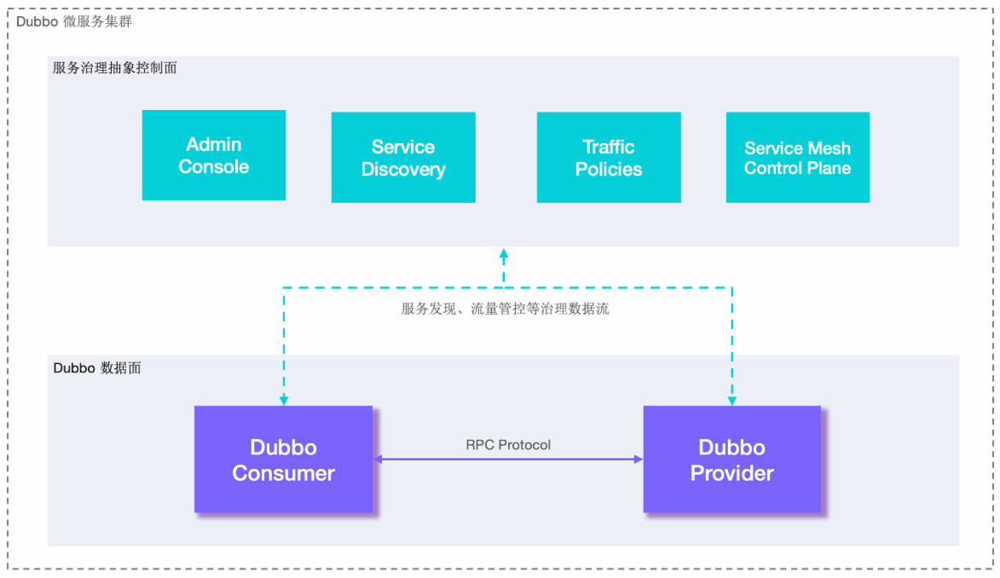
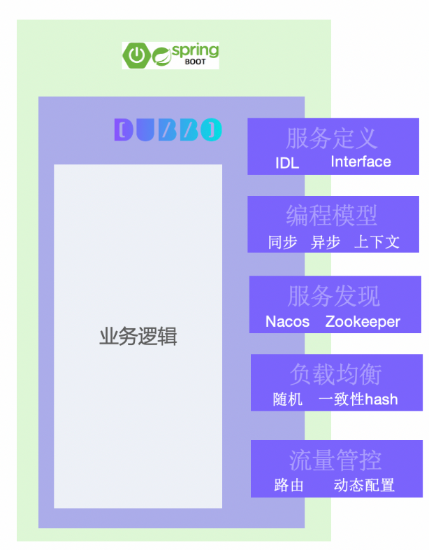
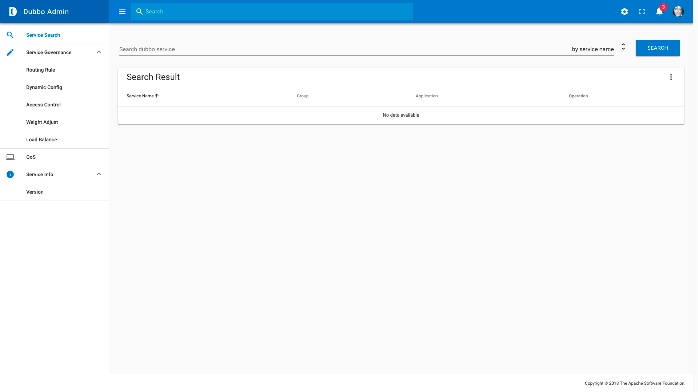
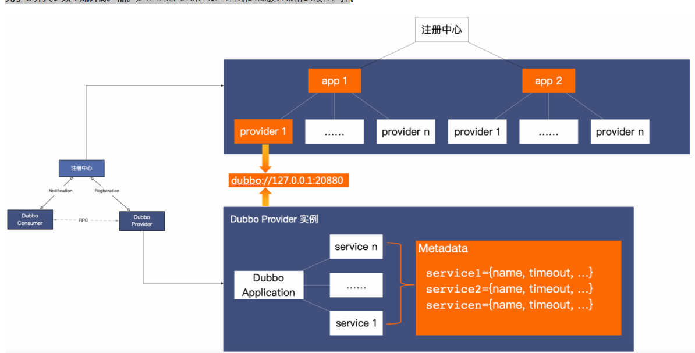
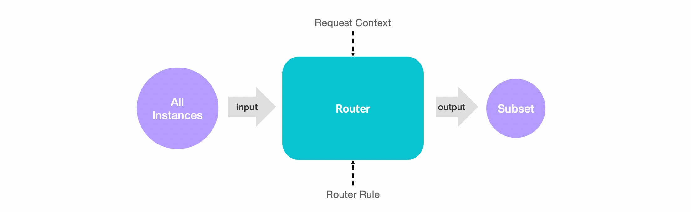
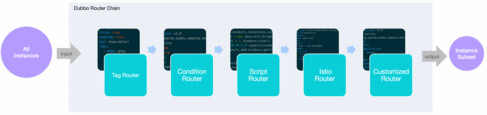
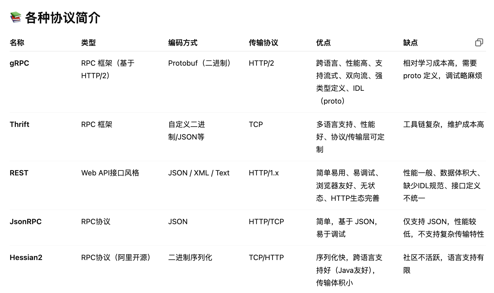

# Dubbo

## 概念与架构



以上是Dubbo的工作原理图，从抽象架构上分为两层：服务治理抽象控制面 和 Dubbo数据面

- 服务治理控制面：不是特指如注册中心的单个具体组件，而是对dubbo治理体系的抽象表达。控制面包含协调服务发现的注册中心，流量管控策略、Dubbo Admin控制台等
- Dubbo 数据面：代码集群部署的所有Dubbo进程，进程之间还通过RPC协议实现数据交换，Dubbo定义了微服务应用开发与调用规范并负责完成数据传输的编解码工作
  - 服务消费者：发起业务调用或RPC通信的Dubbo进程
  - 服务提供者：接受业务调用或RPC通信的Dubbo进程

**Dubbo 数据面**

从数据面视角，Dubbo 帮助解决了微服务实践中的以下问题：

- Dubbo 作为 **服务开发框架** 约束了微服务定义、开发与调用的规范，定义了服务治理流程及适配模式
- Dubbo 作为 **RPC 通信协议实现** 解决服务间数据传输的编解码问题


**服务开发框架**

微服务的目标是构建足够小的、自包含的、独立演进的、可以随时部署运行的分布式应用程序，几乎每个语言都有类似的应用开发框架来帮助开发者快速构建此类微服务应用，比如 Java 微服务体系的 Spring Boot，它帮 Java 微服务开发者以最少的配置、最轻量的方式快速开发、打包、部署与运行应用。

微服务的分布式特性，使得应用间的依赖、网络交互、数据传输变得更频繁，因此不同的**应用需要定义、暴露或调用 RPC 服务，那么这些 RPC 服务如何定义、如何与应用开发框架结合、服务调用行为如何控制？这就是 Dubbo 服务开发框架的含义，Dubbo 在微服务应用开发框架之上抽象了一套 RPC 服务定义、暴露、调用与治理的编程范式**，比如 Dubbo Java 作为服务开发框架，当运行在 Spring 体系时就是构建在 Spring Boot 应用开发框架之上的微服务开发框架，并在此之上抽象了一套 RPC 服务定义、暴露、调用与治理的编程范式。



Dubbo 作为服务开发框架包含的具体内容如下：

- **RPC 服务定义、开发范式**。比如 Dubbo 支持通过 IDL 定义服务，也支持编程语言特有的服务开发定义方式，如通过 Java Interface 定义服务。
- **RPC 服务发布与调用 API**。Dubbo 支持同步、异步、Reactive Streaming 等服务调用编程模式，还支持请求上下文 API、设置超时时间等。
- **服务治理策略、流程与适配方式等**。作为服务框架数据面，Dubbo 定义了服务地址发现、负载均衡策略、基于规则的流量路由、Metrics 指标采集等服务治理抽象，并适配到特定的产品实现。

**通信协议**

**Dubbo 从设计上不绑定任何一款特定通信协议，HTTP/2、REST、gRPC、JsonRPC、Thrift、Hessian2 等几乎所有主流的通信协议，Dubbo 框架都可以提供支持。** 这样的 Protocol 设计模式给构建微服务带来了最大的灵活性，开发者可以根据需要如性能、通用型等选择不同的通信协议，不再需要任何的代理来实现协议转换，甚至你还可以通过 Dubbo 实现不同协议间的迁移。


Dubbo Protocol 被设计支持扩展，您可以将内部私有协议适配到 Dubbo 框架上，进而将私有协议接入 Dubbo 体系，以享用 Dubbo 的开发体验与服务治理能力。比如 Dubbo3 的典型用户阿里巴巴，就是通过扩展支持 HSF 协议实现了内部 HSF 框架到 Dubbo3 框架的整体迁移。

Dubbo 还支持多协议暴露，您可以在单个端口上暴露多个协议，Dubbo Server 能够自动识别并确保请求被正确处理，也可以将同一个 RPC 服务发布在不同的端口（协议），为不同技术栈的调用方服务。

Dubbo 提供了两款内置高性能 Dubbo2、Triple (兼容 gRPC) 协议实现，以满足部分微服务用户对高性能通信的诉求，两者最开始都设计和诞生于阿里巴巴内部的高性能通信业务场景。

- Dubbo2 协议是在 TCP 传输层协议之上设计的二进制通信协议
- Triple 则是基于 HTTP/2 之上构建的支持流式模式的通信协议，并且 Triple 完全兼容 gRPC 但实现上做了更多的符合 Dubbo 框架特点的优化。

总的来说，Dubbo 对通信协议的支持具有以下特点：

- 不绑定通信协议
- 提供高性能通信协议实现
- 支持流式通信模型
- 不绑定序列化协议
- 支持单个服务的多协议暴露
- 支持单端口多协议发布
- 支持一个应用内多个服务使用不同通信协议

**Dubbo服务治理**

服务开发框架解决了开发与通信的问题，但是在微服务集群环境下，我们仍需要解决无状态服务节点动态变化、外部化配置、日志跟踪、可观测性、流量管理、高可用性、数据一致性等一系列问题，我们将这些问题统称为服务治理。

Dubbo 抽象了一套微服务治理模式并发布了对应的官方实现，服务治理可帮助简化微服务开发与运维，让开发者更专注在微服务业务本身。

**服务治理抽象**

以下展示了 Dubbo 核心的服务治理功能定义


- **地址发现**

Dubbo 服务发现具备高性能、支持大规模集群、服务级元数据配置等优势，默认提供 Nacos、Zookeeper、Consul 等多种注册中心适配，与 Spring Cloud、Kubernetes Service 模型打通，支持自定义扩展。

- **负载均衡**

Dubbo 默认提供加权随机、加权轮询、最少活跃请求数优先、最短响应时间优先、一致性哈希和自适应负载等策略

- **流量路由**

Dubbo 支持通过一系列流量规则控制服务调用的流量分布与行为，基于这些规则可以实现基于权重的比例流量分发、灰度验证、金丝雀发布、按请求参数的路由、同区域优先、超时配置、重试、限流降级等能力。

- **链路追踪**

Dubbo 官方通过适配 OpenTelemetry 提供了对 Tracing 全链路追踪支持，用户可以接入支持 OpenTelemetry 标准的产品如 Skywalking、Zipkin 等。另外，很多社区如 Skywalking、Zipkin 等在官方也提供了对 Dubbo 的适配。

- **可观测性**

Dubbo 实例通过 Prometheus 等上报 QPS、RT、请求次数、成功率、异常次数等多维度的可观测指标帮助了解服务运行状态，通过接入 Grafana、Admin 控制台帮助实现数据指标可视化展示。

Dubbo 服务治理生态还提供了对 **API 网关**、**限流降级**、**数据一致性**、**认证鉴权**等场景的适配支持。

## 功能

### 微服务开发

Dubbo 解决企业微服务从开发、部署到治理运维的一系列挑战，Dubbo为开发者提供从项目创建、开发测试，到部署、可视化监测、流量治理，再到生态继承的全套服务

- **开发层面**，Dubbo 提供了 Java、Go、Rust、Node.js 等语言实现并定义了一套微服务开发范式，配套脚手架可用于快速创建微服务项目骨架
- **部署层面**，Dubbo 应用支持虚拟机、Docker 容器、Kubernetes、服务网格架构部署
- **服务治理层面**，Dubbo 提供了地址发现、负载均衡、流量管控等治理能力，官方还提供 Admin 可视化控制台、丰富的微服务生态集成

**开发**：

接下来以 Java 体系 Spring Boot 项目为例讲解 Dubbo 应用开发的基本步骤，整个过程非常直观简单，其他语言开发过程类似。

**创建项目**

[Dubbo 微服务项目脚手架](https://start.dubbo.apache.org/bootstrap.html)（支持浏览器页面、命令行和 IDE）可用于快速创建微服务项目，只需要告诉脚手架期望包含的功能或组件，脚手架最终可以帮助开发者生成具有必要依赖的微服务工程。更多脚手架使用方式的讲解，请参见任务模块的 [通过模板生成项目脚手架](https://cn.dubbo.apache.org/zh-cn/overview/what/tasks/develop/template/)

**开发服务**

**1. 定义服务**

```java
public interface DemoService {
    String hello(String arg);
}
```

**2. 提供业务逻辑实现**

```java
@DubboService
public class DemoServiceImpl implements DemoService {
    public String hello(String arg) {
        // put your microservice logic here
    }
}
```

**发布服务**

**1. 发布服务定义**

为使消费方顺利调用服务，服务提供者首先要将服务定义以 Jar 包形式发布到 Maven 中央仓库。

**2. 对外暴露服务**

补充 Dubbo 配置并启动 Dubbo Server

```yaml
dubbo:
  application:
    name: dubbo-demo
  protocol:
    name: dubbo
    port: -1
  registry:
    address: zookeeper://127.0.0.1:2181
```

**调用服务**

首先，消费方通过 Maven/Gradle 引入 `DemoService` 服务定义依赖。

```xml
<dependency>
    <groupId>org.apache.dubbo</groupId>
    <artifactId>dubbo-demo-interface</artifactId>
    <version>3.2.0</version>
</dependency>
```

编程注入远程 Dubbo 服务实例

```java
@Bean
public class Consumer {
    @DubboReference
    private DemoService demoService;
}
```

**部署**

Dubbo 原生服务可打包部署到 Docker 容器、Kubernetes、服务网格 等云原生基础设施和微服务架构。

关于不同环境的部署示例，可参考：

- [部署 Dubbo 服务到 Docker 容器](https://cn.dubbo.apache.org/zh-cn/overview/what/tasks/deploy/deploy-on-docker)
- [部署 Dubbo 服务到 Kubernetes](https://cn.dubbo.apache.org/zh-cn/overview/what/tasks/deploy/deploy-on-k8s-docker)

**治理**

对于服务治理，绝大多数应用只需要增加以下配置即可，Dubbo 应用将具备地址发现和负载均衡能力。

```yaml
dubbo:
  registry:
    address: zookeeper://127.0.0.1:2181
```

部署并打开 [Dubbo Admin 控制台](https://cn.dubbo.apache.org/zh-cn/overview/what/tasks/deploy)，可以看到集群的服务部署和调用数据



除此之外，Dubbo Amin 还可以通过以下能力提升研发测试效率

- 文档管理，提供普通服务、IDL 文档管理
- 服务测试 & 服务 Mock
- 服务状态查询

对于更复杂的微服务实践场景，Dubbo 还提供了更多高级服务治理特性，具体请参见文档了解更多。包括：

- 流量治理
- 动态配置
- 限流降级
- 数据一致性
- 可观测性
- 多协议
- 多注册中心
- 服务网格

### 服务发现

Dubbo 提供的是一种Client-Based 的服务发现机制，依赖第三方组件来协调服务发现过程，支持常用的注册中心如 Nacos、Consul、Zookeeper 等。

以下是 Dubbo 服务发现机制的基本工作原理图：


服务发现包含提供者、消费者和注册中心三个参与角色，其中，Dubbo 提供者实例注册 URL 地址到注册中心，注册中心负责对数据进行聚合，Dubbo 消费者从注册中心读取地址列表并订阅变更，每当地址列表发生变化，注册中心将最新的列表通知到所有订阅的消费者实例。

**面向百万实例集群的服务发现机制**

区别于其他很多微服务框架的是，**Dubbo3 的服务发现机制诞生于阿里巴巴超大规模微服务电商集群实践场景，因此，其在性能、可伸缩性、易用性等方面的表现大幅领先于业界大多数主流开源产品**。是企业面向未来构建可伸缩的微服务集群的最佳选择。



- 首先，Dubbo 注册中心以应用粒度聚合实例数据，消费者按消费需求精准订阅，避免了大多数开源框架如 Istio、Spring Cloud 等全量订阅带来的性能瓶颈。
- 其次，Dubbo SDK 在实现上对消费端地址列表处理过程做了大量优化，地址通知增加了异步、缓存、bitmap 等多种解析优化，避免了地址更新常出现的消费端进程资源波动。
- 最后，在功能丰富度和易用性上，服务发现除了同步 ip、port 等端点基本信息到消费者外，Dubbo 还将服务端的 RPC/HTTP 服务及其配置的元数据信息同步到消费端，这让消费者、提供者两端的更细粒度的协作成为可能，Dubbo 基于此机制提供了很多差异化的治理能力

**高效地址推送实现**

从注册中心视角来看，它负责以应用名 (dubbo.application.name) 对整个集群的实例地址进行聚合，每个对外提供服务的实例将自身的应用名、实例ip:port 地址信息 (通常还包含少量的实例元数据，如机器所在区域、环境等) 注册到注册中心。

> Dubbo2 版本注册中心以服务粒度聚合实例地址，比应用粒度更细，也就意味着传输的数据量更大，因此在大规模集群下也遇到一些性能问题。 针对 Dubbo2 与 Dubbo3 跨版本数据模型不统一的问题，Dubbo3 给出了[平滑迁移方案](https://cn.dubbo.apache.org/zh-cn/overview/mannual/java-sdk/upgrades-and-compatibility/service-discovery/migration-service-discovery/)，可做到模型变更对用户无感。


每个消费服务的实例从注册中心订阅实例地址列表，相比于一些产品直接将注册中心的全量数据 (应用 + 实例地址) 加载到本地进程，Dubbo 实现了按需精准订阅地址信息。比如一个消费者应用依赖 app1、app2，则只会订阅 app1、app2 的地址列表更新，大幅减轻了冗余数据推送和解析的负担。


**丰富的元数据配置**

除了与注册中心的交互，Dubbo3 的完整地址发现过程还有一条额外的元数据通路，我们称之为元数据服务 (MetadataService)，实例地址与元数据共同组成了消费者端有效的地址列表。


### 负载均衡

在集群负载均衡时，Dubbo 提供了多种均衡策略，缺省为 `weighted random` 基于权重的随机负载均衡策略。

具体实现上，Dubbo 提供的是客户端负载均衡，即由 Consumer 通过负载均衡算法得出需要将请求提交到哪个 Provider 实例。

**负载均衡策略**

目前 Dubbo 内置了如下负载均衡算法，可通过调整配置项启用。

| 算法                          | 特性                    | 备注                                                 |
| :---------------------------- | :---------------------- | :--------------------------------------------------- |
| Weighted Random LoadBalance   | 加权随机                | 默认算法，默认权重相同                               |
| RoundRobin LoadBalance        | 加权轮询                | 借鉴于 Nginx 的平滑加权轮询算法，默认权重相同，      |
| LeastActive LoadBalance       | 最少活跃优先 + 加权随机 | 背后是能者多劳的思想                                 |
| Shortest-Response LoadBalance | 最短响应优先 + 加权随机 | 更加关注响应速度                                     |
| ConsistentHash LoadBalance    | 一致性哈希              | 确定的入参，确定的提供者，适用于有状态请求           |
| P2C LoadBalance               | Power of Two Choice     | 随机选择两个节点后，继续选择“连接数”较小的那个节点。 |
| Adaptive LoadBalance          | 自适应负载均衡          | 在 P2C 算法基础上，选择二者中 load 最小的那个节点    |

**Weighted Random**

- **加权随机**，按权重设置随机概率。
- 在一个截面上碰撞的概率高，但调用量越大分布越均匀，而且按概率使用权重后也比较均匀，有利于动态调整提供者权重。
- 缺点：存在慢的提供者累积请求的问题，比如：第二台机器很慢，但没挂，当请求调到第二台时就卡在那，久而久之，所有请求都卡在调到第二台上。

**RoundRobin**

- **加权轮询**，按公约后的权重设置轮询比率，循环调用节点
- 缺点：同样存在慢的提供者累积请求的问题。

加权轮询过程中，如果某节点权重过大，会存在某段时间内调用过于集中的问题。 例如 ABC 三节点有如下权重：`{A: 3, B: 2, C: 1}` 那么按照最原始的轮询算法，调用过程将变成：`A A A B B C`

对此，Dubbo 借鉴 Nginx 的平滑加权轮询算法，对此做了优化，调用过程可抽象成下表:

| 轮前加和权重        | 本轮胜者 | 合计权重 | 轮后权重（胜者减去合计权重） |
| :------------------ | :------- | :------- | :--------------------------- |
| 起始轮              | \        | \        | `A(0), B(0), C(0)`           |
| `A(3), B(2), C(1)`  | A        | 6        | `A(-3), B(2), C(1)`          |
| `A(0), B(4), C(2)`  | B        | 6        | `A(0), B(-2), C(2)`          |
| `A(3), B(0), C(3)`  | A        | 6        | `A(-3), B(0), C(3)`          |
| `A(0), B(2), C(4)`  | C        | 6        | `A(0), B(2), C(-2)`          |
| `A(3), B(4), C(-1)` | B        | 6        | `A(3), B(-2), C(-1)`         |
| `A(6), B(0), C(0)`  | A        | 6        | `A(0), B(0), C(0)`           |

我们发现经过合计权重（3+2+1）轮次后，循环又回到了起点，整个过程中节点流量是平滑的，且哪怕在很短的时间周期内，概率都是按期望分布的。

如果用户有加权轮询的需求，可放心使用该算法。

**LeastActive**

- **加权最少活跃调用优先**，活跃数越低，越优先调用，相同活跃数的进行加权随机。活跃数指调用前后计数差（针对特定提供者：请求发送数 - 响应返回数），表示特定提供者的任务堆积量，活跃数越低，代表该提供者处理能力越强。
- 使慢的提供者收到更少请求，因为越慢的提供者的调用前后计数差会越大；相对的，处理能力越强的节点，处理更多的请求。

**ShortestResponse**

- **加权最短响应优先**，在最近一个滑动窗口中，响应时间越短，越优先调用。相同响应时间的进行加权随机。
- 使得响应时间越快的提供者，处理更多的请求。
- 缺点：可能会造成流量过于集中于高性能节点的问题。

这里的响应时间 = 某个提供者在窗口时间内的平均响应时间，窗口时间默认是 30s。

**ConsistentHash**

- **一致性 Hash**，相同参数的请求总是发到同一提供者。
- 当某一台提供者挂时，原本发往该提供者的请求，基于虚拟节点，平摊到其它提供者，不会引起剧烈变动。
- 算法参见：[Consistent Hashing | WIKIPEDIA](http://en.wikipedia.org/wiki/Consistent_hashing)
- 缺省只对第一个参数 Hash，如果要修改，请配置 `<dubbo:parameter key="hash.arguments" value="0,1" />`
- 缺省用 160 份虚拟节点，如果要修改，请配置 `<dubbo:parameter key="hash.nodes" value="320" />`

**P2C Load Balance**

Power of Two Choice 算法简单但是经典，主要思路如下：

1. 对于每次调用，从可用的provider列表中做两次随机选择，选出两个节点providerA和providerB。
2. 比较providerA和providerB两个节点，选择其“当前正在处理的连接数”较小的那个节点。

以下是 [Dubbo P2C 算法实现提案](https://cn.dubbo.apache.org/zh-cn/overview/reference/proposals/heuristic-flow-control/#p2c算法)

**Adaptive Load Balance**

Adaptive 即自适应负载均衡，是一种能根据后端实例负载自动调整流量分布的算法实现，它总是尝试将请求转发到负载最小的节点。

以下是 [Dubbo Adaptive 算法实现提案](https://cn.dubbo.apache.org/zh-cn/overview/reference/proposals/heuristic-flow-control/#adaptive算法)

### 流量管控

Dubbo 提供了丰富的流量管控策略

- **地址发现与负载均衡**，地址发现支持服务实例动态上下线，负载均衡确保流量均匀的分布到每个实例上。
- **基于路由规则的流量管控**，路由规则对每次请求进行条件匹配，并将符合条件的请求路由到特定的地址子集。

服务发现保证调用方看到最新的提供方实例地址，服务发现机制依赖注册中心 (Zookeeper、Nacos、Istio 等) 实现。在消费端，Dubbo 提供了多种负载均衡策略，如随机负载均衡策略、一致性哈希负载、基于权重的轮询、最小活跃度优先、P2C 等。

Dubbo 的流量管控规则可以基于应用、服务、方法、参数等粒度精准的控制流量走向，根据请求的目标服务、方法以及请求体中的其他附加参数进行匹配，符合匹配条件的流量会进一步的按照特定规则转发到一个地址子集。流量管控规则有以下几种：

- 条件路由规则
- 标签路由规则
- 脚本路由规则
- 动态配置规则

如果底层用的是基于 HTTP 的 RPC 协议 (如 REST、gRPC、Triple 等)，则服务和方法等就统一映射为 HTTP 路径 (path)，此时 Dubbo 路由规则相当于是基于 HTTP path 和 headers 的流量分发机制。

> Dubbo 中有应用、服务和方法的概念，一个应用可以发布多个服务，一个服务包含多个可被调用的方法，从抽象的视角来看，一次 Dubbo 调用就是某个消费方应用发起了对某个提供方应用内的某个服务特定方法的调用，Dubbo 的流量管控规则可以基于应用、服务、方法、参数等粒度精准的控制流量走向。

**工作原理**

以下是 Dubbo 单个路由器的工作过程，路由器接收一个服务的实例地址集合作为输入，基于请求上下文 (Request Context) 和 (Router Rule) 实际的路由规则定义对输入地址进行匹配，所有匹配成功的实例组成一个地址子集，最终地址子集作为输出结果继续交给下一个路由器或者负载均衡组件处理。



通常，在 Dubbo 中，多个路由器组成一条路由链共同协作，前一个路由器的输出作为另一个路由器的输入，经过层层路由规则筛选后，最终生成有效的地址集合。

- Dubbo 中的每个服务都有一条完全独立的路由链，每个服务的路由链组成可能不同，处理的规则各异，各个服务间互不影响。
- 对单条路由链而言，即使每次输入的地址集合相同，根据每次请求上下文的不同，生成的地址子集结果也可能不同。



**路由规则分类**

标签路由规则


标签路由通过将某一个服务的实例划分到不同的分组，约束具有特定标签的流量只能在指定分组中流转，不同分组为不同的流量场景服务，从而实现流量隔离的目的。标签路由可以作为蓝绿发布、灰度发布等场景能力的基础。

标签路由规则是一个非此即彼的流量隔离方案，也就是匹配`标签`的请求会 100% 转发到有相同`标签`的实例，没有匹配`标签`的请求会 100% 转发到其余未匹配的实例。如果您需要按比例的流量调度方案，请参考示例 [基于权重的按比例流量路由](https://cn.dubbo.apache.org/zh-cn/overview/what/tasks/traffic-management/weight/)。

`标签`主要是指对 Provider 端应用实例的分组，目前有两种方式可以完成实例分组，分别是`动态规则打标`和`静态规则打标`。`动态规则打标` 可以在运行时动态的圈住一组机器实例，而 `静态规则打标` 则需要实例重启后才能生效，其中，动态规则相较于静态规则优先级更高，而当两种规则同时存在且出现冲突时，将以动态规则为准。

**标签规则示例 - 静态打标**

静态打标需要在服务提供者实例启动前确定，并且必须通过特定的参数 `tag` 指定。

**Provider**

在 Dubbo 实例启动前，指定当前实例的标签，如部署在杭州区域的实例，指定 `tag=gray`。

### 通信协议

Dubbo框架提供了自定义的高性能通信协议：基于 HTTP/2 的 Triple协议 和 基于TCP 的 Dubbo 2协议。除此之外。Dubbo 框架支持任意第三方通信协议，如官方支持的 gRPC、Thrift、REST、JsonRPC、Hessian2 等，更多协议可以通过自定义扩展实现。这对于微服务实践中经常要处理的多协议通信场景非常有用。



**Dubbo 框架不绑定任何通信协议，在实现上 Dubbo 对多协议的支持也非常灵活，它可以让你在一个应用内发布多个使用不同协议的服务，并且支持用同一个 port 端口对外发布所有协议。**

通过 Dubbo 框架的多协议支持，你可以做到：

- 将任意通信协议无缝地接入 Dubbo 服务治理体系。Dubbo 体系下的所有通信协议，都可以享受到 Dubbo 的编程模型、服务发现、流量管控等优势。比如 gRPC over Dubbo 的模式，服务治理、编程 API 都能够零成本接入 Dubbo 体系。
- 兼容不同技术栈，业务系统混合使用不同的服务框架、RPC 框架。比如有些服务使用 gRPC 或者 Spring Cloud 开发，有些服务使用 Dubbo 框架开发，通过 Dubbo 的多协议支持可以很好的实现互通。
- 让协议迁移变的更简单。通过多协议、注册中心的协调，可以快速满足公司内协议迁移的需求。比如如从自研协议升级到 Dubbo 协议，Dubbo 协议自身升级，从 Dubbo 协议迁移到 gRPC，从 HTTP 迁移到 Dubbo 协议等。

**HTTP/2 (Triple)**

Triple 协议是 Dubbo3 发布的面向云原生时代的通信协议，它基于 HTTP/2 并且完全兼容 gRPC 协议，原生支持 Streaming 通信语义，Triple 可同时运行在 HTTP/1 和 HTTP/2 传输协议之上，让你可以直接使用 curl、浏览器访问后端 Dubbo 服务。

自 Triple 协议开始，Dubbo 还支持基于 Protocol Buffers 的服务定义与数据传输，但 Triple 实现并不绑定 IDL，比如你可以直接使用 Java Interface 定义和发布 Triple 服务。Triple 具备更好的网关、代理穿透性，因此非常适合于跨网关、代理通信的部署架构，如服务网格等。

Triple 协议的核心特性如下：

- 支持 TLS 加密、Plaintext 明文数据传输
- 支持反压与限流
- 支持 Streaming 流式通信
- 同时支持 HTTP/1 和 HTTP/2 传输协议

在编程与通信模型上，Triple 协议支持如下模式：

- 消费端异步请求(Client Side Asynchronous Request-Response)
- 提供端异步执行（Server Side Asynchronous Request-Response）
- 消费端请求流（Request Streaming）
- 提供端响应流（Response Streaming）
- 双向流式通信（Bidirectional Streaming）


