# Jmeter

## 一、测试计划

jmeter 中测试计划是用来管理我们 jmeter 中要进行的元件

常见的八大元件有

- 配置元件：主要是配置一些jmeter运行需要用的一些基础数据

- 前置处理器：请求前置处理，类似于postman中的scripts中的pre request

- 定时器：控制请求与请求之间的时间间隔

- 后置处理器：对请求完成之后响应的数据进行处理的，类似与postman中的scripts中post response

- 断言：用程序代替人工来判断响应结果是否符合预期不符合

- 监听器：用来展示jmeter运行的结果的

- 逻辑控制器：用来控制jmeter脚本运行的逻辑的。

- 取样器（采样器）:用来提交接口信息的

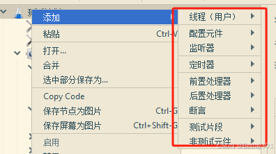

## 二、基本的操作步骤

接下来介绍基本的操作步骤

1、添加一个测试计划

2、在测试计划中添加一个线程组

3、在线程组下添加一个 http取样器

4、在取样器中添加一个监听器，查看结果树

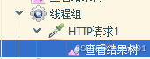

**常见的元件执行顺序：**

配置元件 -> 前置处理器 -> 定时器 -> 取样器 -> 后置处理器 -> 断言 -> 监听器

**Jmeter 中常见元件的作用域：**

取样器：作用域作用到本身

逻辑控制器：他的作用域是对其内部的子节点起作用

其他六类元件有着共同作用域特点：

- 当这六类元件的父节点是取样器的时候，那么他们只对这个取样器起作用。
- 当这六类元件的父节点不是取样器的时候，那么他们会这父节点还有父节点下子节点还有子节点子节点起作用

---

**线程组：**

是用来产生虚拟用户的，当我们做接口测试的时候，这个时候，线程组不需要做任何设置

**线程属性：**

- 线程数：指的就是我们要模拟的虚拟用户数

- ramp-up时间 准备时长 启动虚拟用户所需要的时间

- 循环次数：虚拟用户要执行脚本次数，如果选择永远，则脚本会一直运行

- 调度器：选择调度器后可以指定脚本的运行时长，但是要配合循环次数永远一块使用

- 持续时间：脚本要运行的时长

- 启动延迟：点击开始后，推迟多少秒开始执行脚本

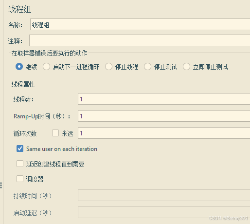

> 注意：如果有多个线程组同时存在，则他们在运行的时候是并行运行。如果我们想要线程组按照先后顺序执行，怎么我们可以在测试计划中选择独立运行每个线程组

**Setup 线程组和Teardown 线程组**

他们两个是特殊的线程组，特殊点在于他们运行的先后顺序上，默认执行先执行setup线程，然后执行普通线程组，然后再执行teardown

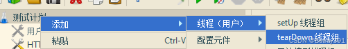

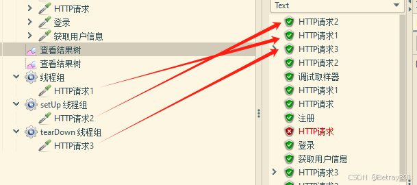

在测试计划中选中独立运行每个线程组也不会对setup和teardown有影响

---

**取样器**

- 协议：就是接口url地址中协议

- 服务器名称或ip地址：接口地址中的域名或ip地址

- 端口号：接口中端口号

- 请求方法：接口中提交方法是什么，我们就选择对应的提交方式

- 路径：接口中的端口号后面的资源地址

- 内容编码：防止提交的数据中文乱码一般写入utf-8

​	如果选择自动重定向则将来结果只展示最后一个请求信息

​	如果选择跟随冲抵想则将来结果会展示所有经历过的请求

​	对post使用multipar/form-data 做文件上传或者下载时候要把这个选项选中

- 参数：就是接口要提交数据，get类型的提交或者是post类型的表单提交，可以把数据写到这个地方

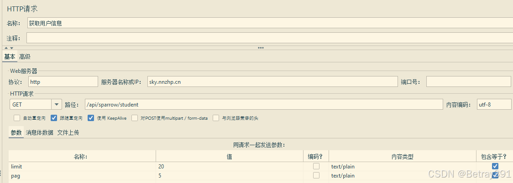

---

**参数添加**

无论是get还是post表单提交，都是在这里写值的，不需要和postman一样切换

如果有上传文件操作，则点击文件上传

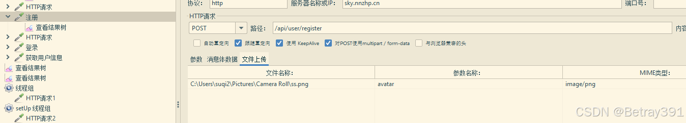

关于 MIME 类型可以参考如下：

两种主要的 MIME 类型在默认类型中扮演了重要的角色:

- text/plain 表示文本文件的默认值

- application/octet-stream 表示所有其他情况的默认值。

常见的 MIME 类型

- 超文本标记语言文本,html、.html:text/htm1

- 普通文本.txt: text/plain

- RTF 文本 .rtf:application/rtf

- GIF 图形 .gif:image/gif

- JPEG 图形 .jpeg、jpg:image/jpeg

- au 声音文件.au: audio/basic

- MIDI音乐文件 mid、.midi: audio/midi、audio/x-midiRealAudio 音乐文件 .ra、.ram:audio/x-pn-realaudi0

- MPEG文件.mpg、.mpeg:video/mpeg

- AVl 文件.avi:video/x-msvideo

- GZIP 文件 .g2:application/x-gzip

- TAR 文件 .tar:application/x-tar

---

**全局变量**

有时候我们有很多个接口要写，所以一个一个写地址会非常麻烦，jmeter也可以跟postman一样配置全局变量直接使用，这里介绍三种方式

**第一种**

直接在测试计划中找到全局变量，点击添加即可，添加内容跟postman一样

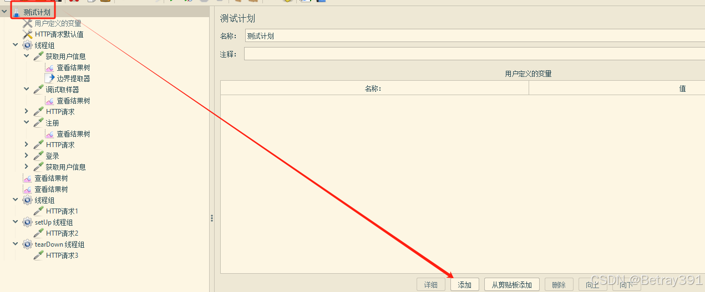

**使用方法：**

跟postman不一样的是postman使用是“{{}}”，而jmeter是“${}"

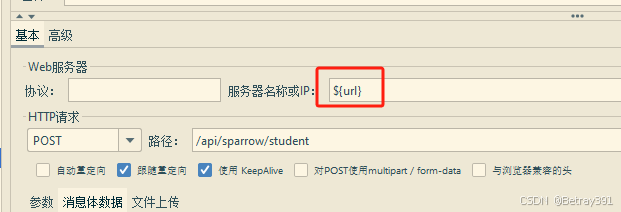

**第二种**

找到 "用户定义的变量" 中添加全局变量

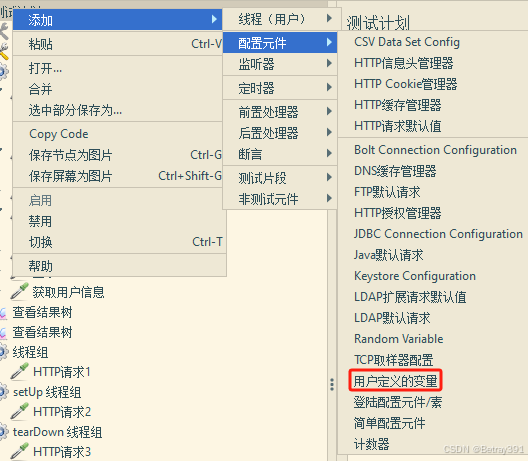

**第三种**

创建一个 HTTP 请求默认的元件，在里面输入我们想要的内容

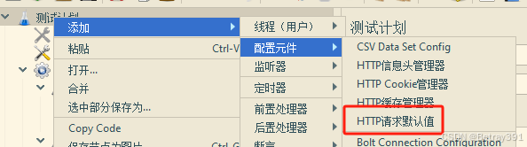

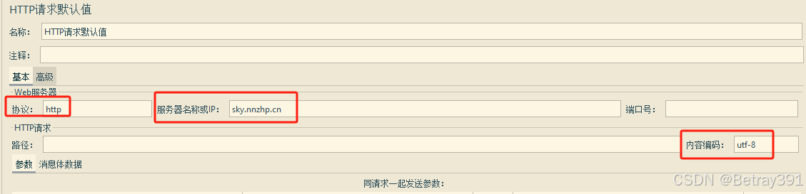

