# Kafka

## Kafka 概述

### 定义

**Kafka 传统定义**：kafka 是一个分布式的基于发布/订阅模式的消息队列（Message Queue），主要应对大数据实时处理领域。

**发布/订阅**：消息的发布者不会将消息直接发布给特定的订阅者，而是将发布的消息分为不同的类别，订阅者只接收感兴趣的消息

**Kafka最新定义**：Kafka是一个开源的分布式事件流平台（Event Streaming Platform），被数千家公司用于高性能的数据管道、流分析、数据集成和关键任务应用。

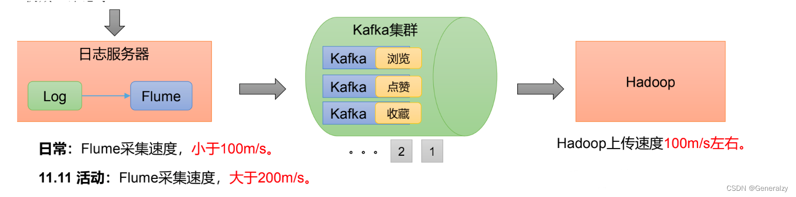

### 消息队列

目前企业中常见消息队列产品主要有 Kafka、ActiveMQ、RabbitMQ、RocketMQ等

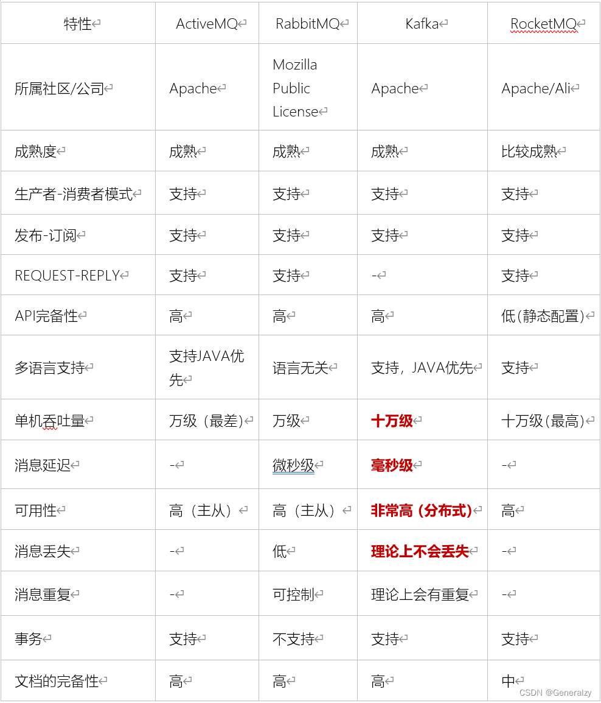

### 目录结构分析

1. bin：Kafka 的所有执行脚本。例如：启动 Kafka服务器、创建 Topic、生产者、消费者程序
2. config：Kafka的所有配置文件
3. libs：运行kafka 所需要的所有 JAR 包
4. logs：kafka的所有日志文件，如果Kafka 出现一些问题，需要到该目录中去查看异常信息
5. site-docs：kafka 的网站帮助文件

### 传统消息队列的应用场景

传统的消息队列的主要应用场景包括：缓存/消峰、解耦、异步通信

**缓冲/消峰**： 有助于控制和优化数据流经过系统的速度，解决生产消息和消费消息的处理速度不一致的情况

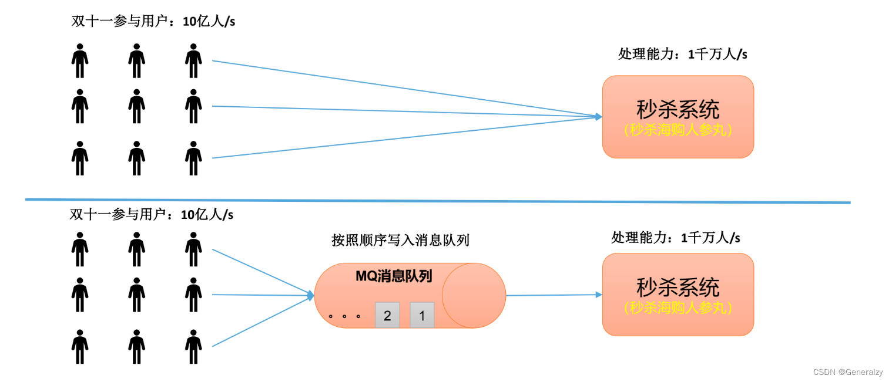

**解耦**：允许你独立的扩展或修改两边的处理过程，只要保证它遵守同样的接口约束

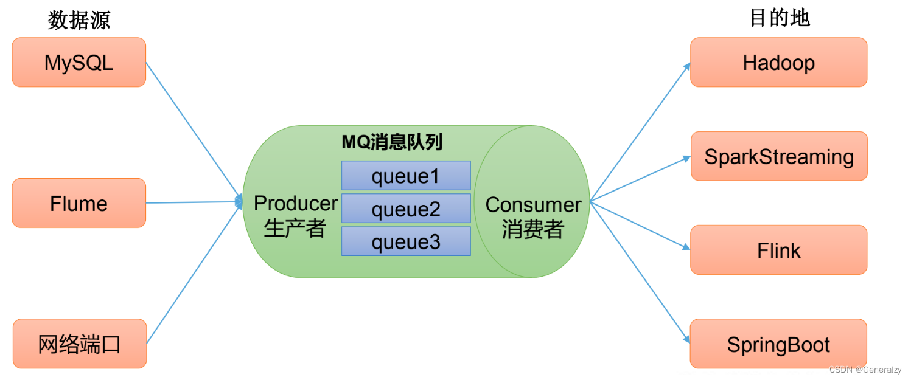

**异步通信**：允许用户把一个消息放入队列，但并不立即处理它，然后再需要的时候再去处理它们

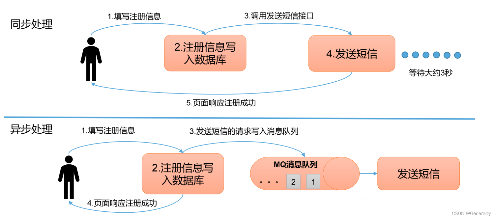

### 消息队列的两种模式

#### 点对点模式

消费者主动去拉取数据，消息收到后清除消息

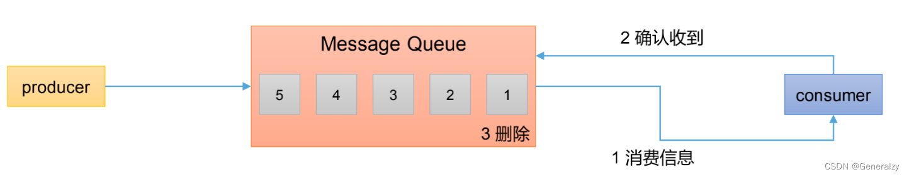

#### 发布/订阅模式

- 可以有多个topic主题(浏览，点赞，收藏，评论等)
- 消费者消费数据之后，不删除数据
- 每个消费者互相独立，都可以消费到数据

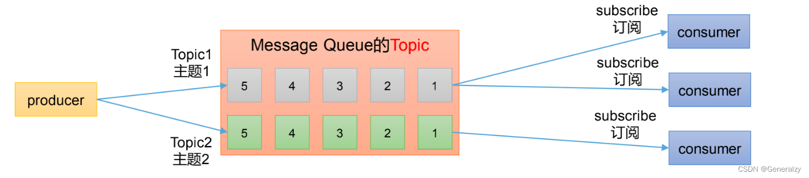


### Kafka 基础架构

1、为方便扩展，并提高吞吐量，一个 topic 分为多个 partition

2、配合分区的设计，提出消费者组的概念，确保每条消息仅被组内一个消费者处理，避免重复消费

3、 为提高可用性，为每个partition 增加若干副本，类似NameNode HA

4、ZK 中记录Leader

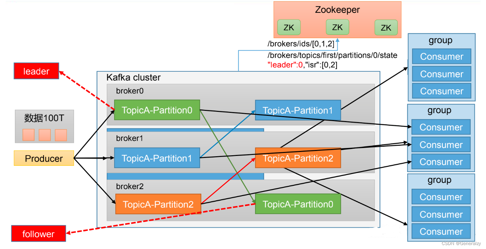

- Producer：消息生产者，就是向Kafka broker 发消息的客户端。

- Consumer：消息消费者，向Kafka broker 取消息的客户端。

- Consumer Group（CG）：消费者组，由多个consumer组成。消费者组内每个消费者负责消费不同分区的数据，一个分区只能由一个组内消费者消费；消费者组之间互不影响。所有的消费者都属于某个消费者组，即消费者组是逻辑上的一个订阅者。

- Broker：一台Kafka服务器就是一个broker。一个集群由多个broker组成。一个broker可以容纳多个topic。

- Topic： 可以理解为一个队列，生产者和消费者面向的都是一个topic。

- Partition： 为了实现扩展性，一个非常大的topic可以分布到多个broker（即服务器）上，一个topic可以分为多个partition，每个partition是一个有序的队列。

- Replica：副本。一个topic的每个分区都有若干个副本，一个Leader和若干个Follower。

- Leader：每个分区多个副本的 “主”，生产者发送数据的对象，以及消费者消费数据的对象都是Leader。

- Follower：每个分区多个副本中的 “从”，实时从 Leader 中同步数据，保持和 Leader 数据的同步。Leader 发生故障时，某个Follower会成为新的 Leader。

## Kakfa 快速入门

### Kafka命令行操作

#### 主题命令行操作

**1. 查看主题命令参数**

``` shell
./bin/kafka-topics.sh 
```

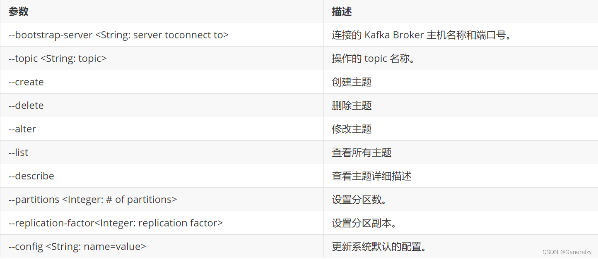

**2. 查看当前服务器中的所有topic**

``` shell
./bin/kafka-topics.sh --bootstrap-server localhost:9092 --list
```

**3. 创建 first topic**

``` shell
./bin/kafka-topics.sh --bootstrap-server localhost:9092 --create --partitions 1 --replication-factor 1 --topic first
```

选项说明：

1、-topic：定义topic 名

2、-replication-factor：定义副本数

3、-partitions：定义分区数

**4. 查看 first 主题的详情**

``` shell
./bin/kafka-topics.sh --bootstrap-server localhost:9092 --topic first --describe
```

**5. 修改分区数**

```shell
./bin/kafka-topics.sh --bootstrap-server localhost:9092 --alter --topic first --partitions 3
```

**6. 查看结果**

```shell
./bin/kafka-topics.sh --bootstrap-server localhost:9092 --topic first --describe 
Topic: first	TopicId: _Pjhmn1NTr6ufGufcnsw5A	PartitionCount: 3	ReplicationFactor: 1	Configs: segment.bytes=1073741824
	Topic: first	Partition: 0	Leader: 0	Replicas: 0	Isr: 0
	Topic: first	Partition: 1	Leader: 0	Replicas: 0	Isr: 0
	Topic: first	Partition: 2	Leader: 0	Replicas: 0	Isr: 0
```

**7. 删除Topic**

```shell
./bin/kafka-console-producer.sh 
```

#### 生产者命令行操作

1. 查看操作者命令参数

```shell
./bin/kafka-console-producer.sh 
```

2. 发送消息

```shell
./bin/kafka-console-producer.sh --bootstrap-server localhost:9092 --topic first
>hello world
>yooome yooome
```

#### 消费者命令行操作

1. 查看操作消费者命令参数

```
./bin/kafka-console-consumer.sh
```

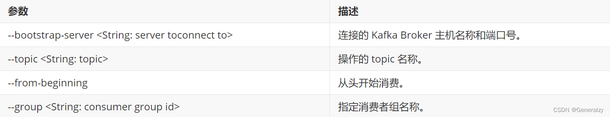

2. 消费消息

   1. 消费 first 主题的数据

      ```
      ./bin/kafka-console-consumer.sh --bootstrap-server localhost:9092 --topic first
      ```

   2. 把主题所有数据读取出来

      ```
      ./bin/kafka-console-consumer.sh --bootstrap-server localhost:9092 --from-beginning --topic first
      ```

## Kafka 可视化工具

官网：https://www.kafkatool.com/download.html

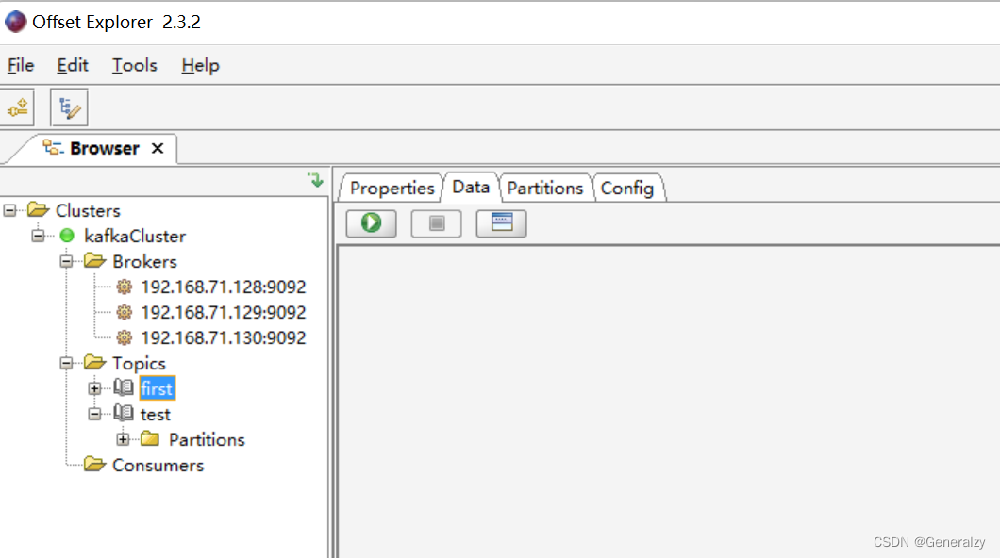

## Kafka重要概念

### broker

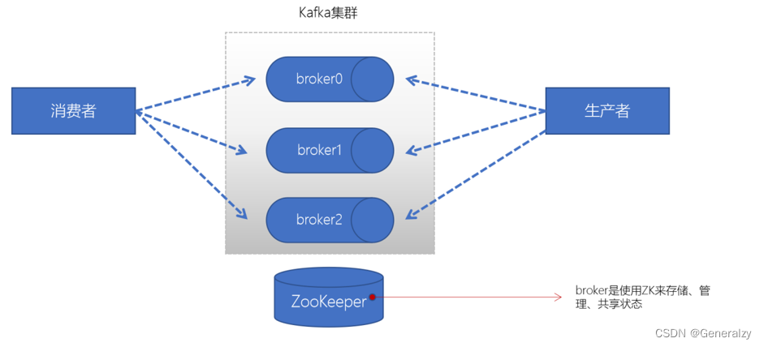

1、一个 Kafka的集群通常由多个 broker组成，这样才能实现负载均衡、以及容错

2、broker 是无状态（stateless）的，它们是通过Zookeeper来维护集群状态

3、一个Kafka 的 broker 每秒可以处理十万次读写，每个 broker 都可以处理TB 消息而不影响性能


### Zookeeper

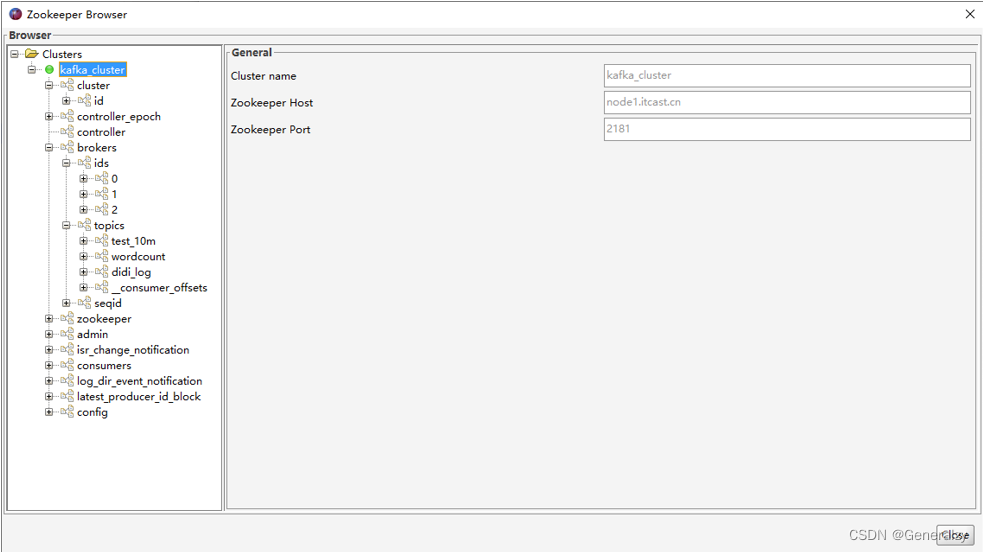

1. ZK用来管理和协调broker，并且存储了 Kafka的元数据（例如：有多少topic、partition、consumer）
2. ZK服务主要用于通知生产者和消费者Kafka集群中有新的broker加入、或者Kafka集群中出现故障的broker。
3. Kafka正在逐步想办法将ZooKeeper剥离，维护两套集群成本较高，社区提出KIP-500就是要替换掉ZooKeeper的依赖。“Kafka on Kafka”——Kafka自己来管理自己的元数据

### producer（生产者）

生产者负责从 broker 的topic中拉取，并自己进行处理

### consumer（消费者）

消费者负责从 broker的 topic 中拉取数据，并自己进行处理

### consumer group（消费者组）

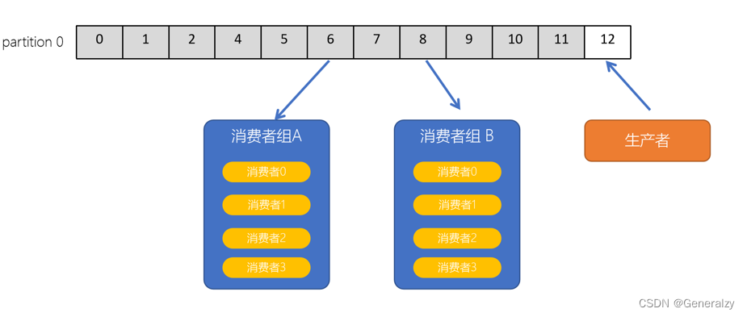

1、consumer group 是Kafka 提供的可扩展性具有容错性消费者机制

2、一个消费者组可以包含多个消费者

3、一个消费者组有一个唯一的 ID

4、组内的消费者一起消费主题的所有分区数据

### 分区（Partitions）

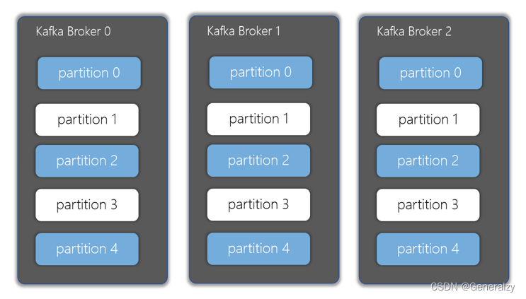

在 Kafka 集群中，主题被为多个分区

### 副本（Replicas）

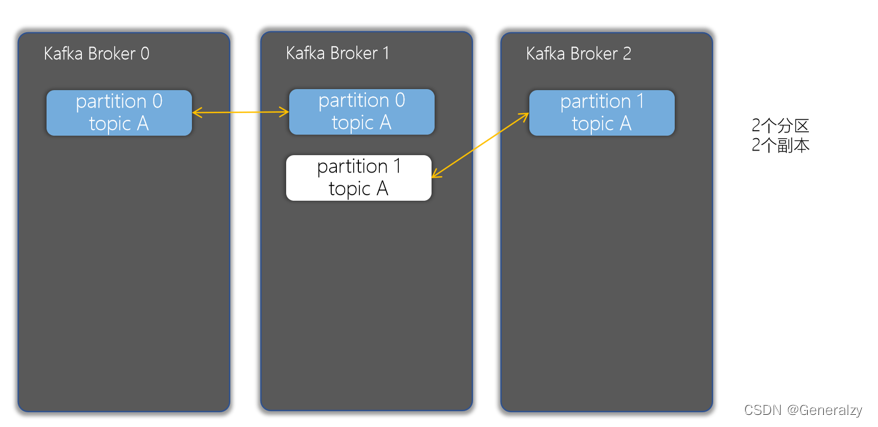

副本可以确保某个服务器出现故障时，确保数据依然可用，在Kafka中，一般都会设计副本的个数＞1

### 主题（Topic）

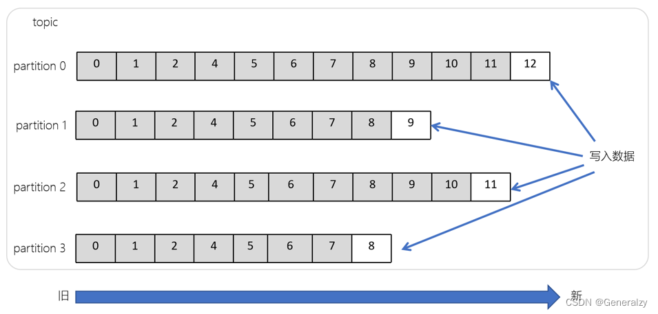

1、主题是一个逻辑概念，用于生产者发布数据，消费者拉取数据

2、Kafka中主题必须有标识符，而且是唯一的，Kafka中可以有任意的主题，没有数量的限制

3、在主题中的消息是有结构的，一般一个主题包含某一类的消息

4、一旦生产者发送消息到主题中，这些消息就不能被更新

### 偏移量（offset）

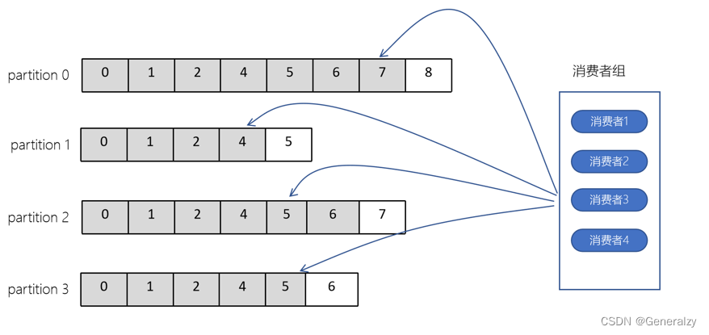

1、offset 记录着下一条将要发给 Consumer 的消息的序号

2、默认Kafka 将 offset 存储在 Zookeeper 中

3、在一个分区中，消息是有顺序的方式存储着，每个在分区的消费都是有一个递增的 id。这个就是偏移量offset

4、偏移量在分区中才是有意义的。在分区之间，offset是没有意义的

### 消费者组

1、Kafka支持多个消费者同时消费一个主题中的数据

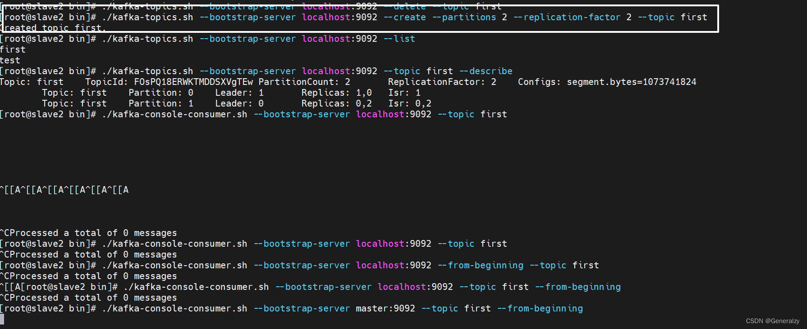

2、同时运行两个消费者，我们发现只有一个的消费者能拉取到消息。想要让两个消费者都消费数据，必须给test 增加主题，添加一个分区（单一消费者独占分区）

3、设置 test topic为2个分区`bin/kafka-topics.sh --zookeeper 192.168.88.100:2181 -alter --partitions 2 --topic test`

## Kafka生产者

### 生产者消息发送流程

#### 发送原理

在消息发送的过程中，涉及到两个线程 -- main线程和 Sender 线程。在main线程中创建了一个双端队列 RecordAccumlator，Sender线程不断从RecordAccumulator 中 拉取消息发送到 Kafka Broker

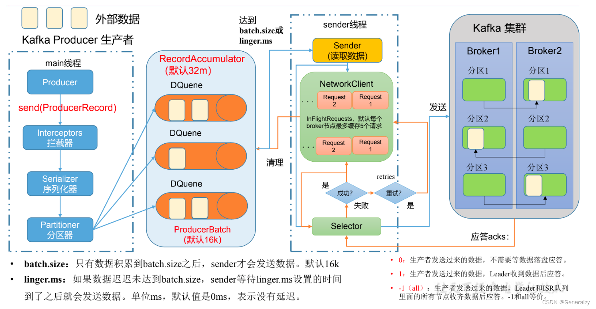

#### 生产者重要参数列表

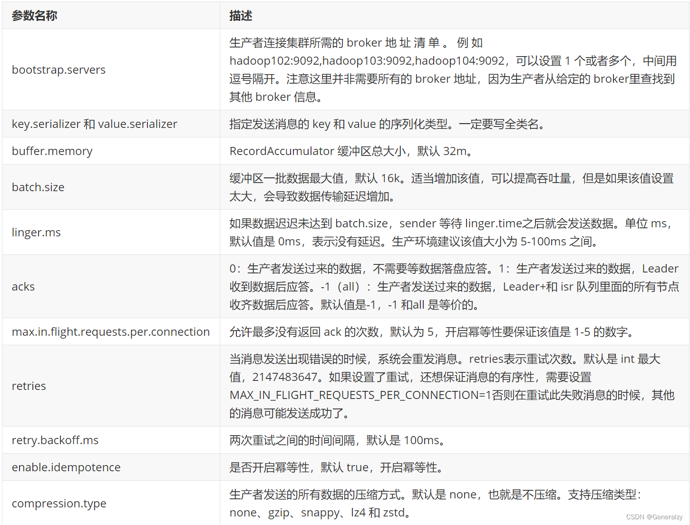

#### 异步发送 API

##### 普通异步发送

1、 需求：创建Kafka 生产者，采用异步的方式发送到Kafka Broker

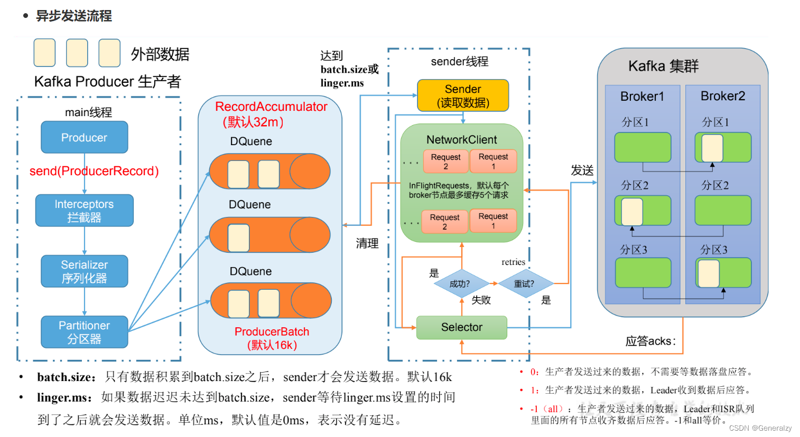

2、代码变成

``` python
func main() {
	config := sarama.NewConfig()
	config.Producer.RequiredAcks = sarama.WaitForAll          // 发送完数据需要leader和follow都确认
	config.Producer.Partitioner = sarama.NewRandomPartitioner // 新选出一个partition
	config.Producer.Return.Successes = true                   // 成功交付的消息将在success channel返回

	// 构造一个消息
	msg := &sarama.ProducerMessage{}
	msg.Topic = "first"
	msg.Value = sarama.StringEncoder("this is a test log")
	// 连接kafka
	client, err := sarama.NewSyncProducer([]string{
		"192.168.71.128:9092", "192.168.71.129:9092", "192.168.71.130:9092",
	}, config)
	if err != nil {
		fmt.Println("producer closed, err:", err)
		return
	} else {
		fmt.Println(client)
	}
	defer client.Close()
	// 发送消息
	pid, offset, err := client.SendMessage(msg)
	if err != nil {
		fmt.Println("send msg failed, err:", err)
		return
	}
	fmt.Printf("pid:%v offset:%v\n", pid, offset)
}

```

##### 带回调函数的异步发送

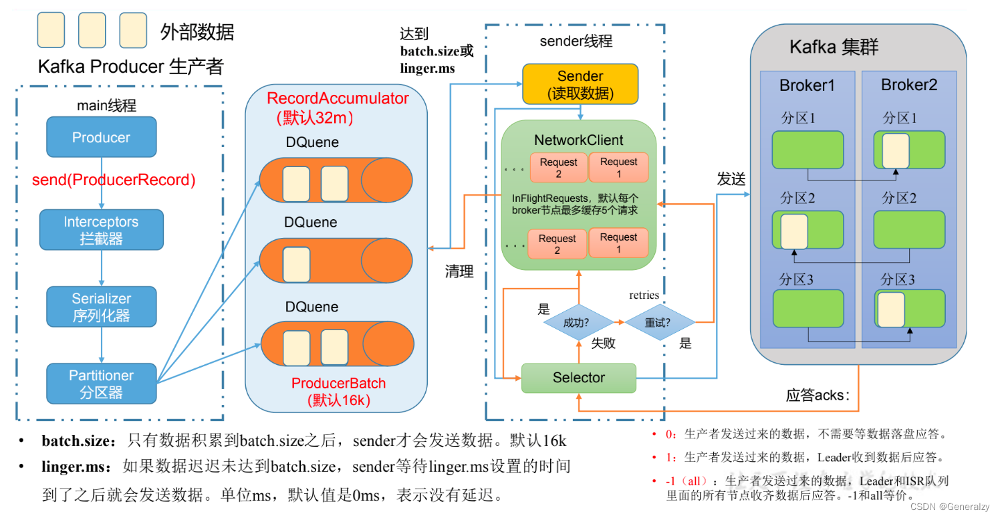

【注意：】消息发送失败会自动重试，不需要我们在回调函数中手动重试

#### 同步发送 API


### 生产者分区

#### 分区和副本机制

生产者写入消息到 topic，Kafka 将依据不同的策略将数据分配到不同分区中

1、轮询分区策略

2、随机分区策略

3、Key分区分配策略

4、自定义分区策略

#### 分区的好处

1、**便于合理使用存储资源**，每个 Partition在一个Broker上存储，可以把海量的数据按照分区切割成一块一块数据存储在多台Broker上，合理控制分区的任务，可以实现负载均衡的效果

2、**提高并行度**，生产者可以以分区为单位发送数据；消费者可以根据分区进行消费数据

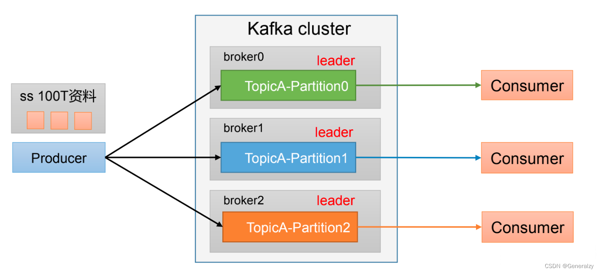

##### 轮询策略

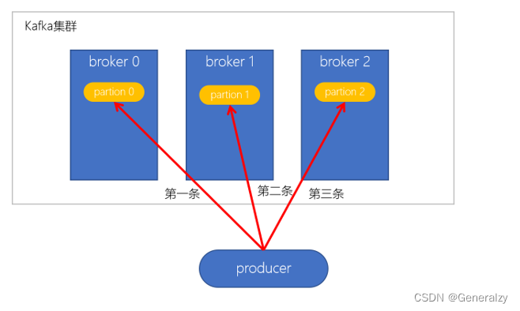

##### 随机策略

随机策略，每次都随机地将消息分配到每个分区。在较早的版本，默认的分区策略就是随机策略，也是为了将消息均衡地写入到每个分区。但后续轮询策略表现更佳，所以基本上很少会使用随机策略。

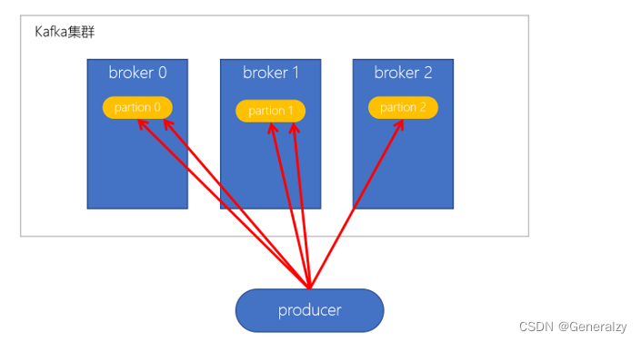

##### 按Key 分配策略

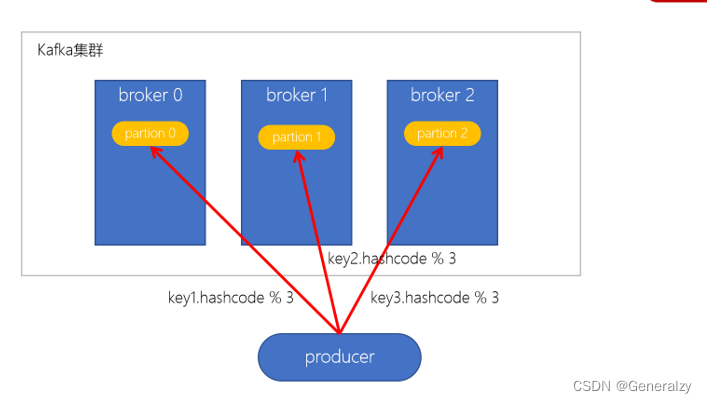

按key分配策略，有可能会出现「数据倾斜」，例如：某个key包含了大量的数据，因为key值一样，所有所有的数据将都分配到一个分区中，造成该分区的消息数量远大于其他的分区。

##### 乱序策略

轮询策略、随机策略都会导致一个问题，生产到 Kafka 的数据是乱序存储的--也就是局部有序，但这又可能导致数据倾斜，所以在实际生产环境中要结婚实际情况

### 副本机制

副本的目的就是冗余备份，当某个Broker上的分区数据丢失时，依然可以保障数据可用。因为在其他的Broker上的副本是可用的。

#### producer的 ACKs参数

对副本关系较大的是，producer 配置的 acks参数，acks参数表示当生产者生产消息时，写入到副本的要求严格程度。它确定了生产者如何在性能和可靠性之间做取舍

#### acks配置为0

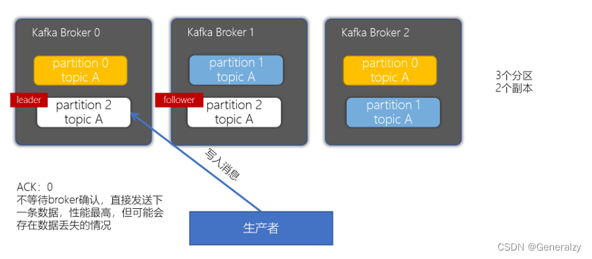

#### acks配置为1

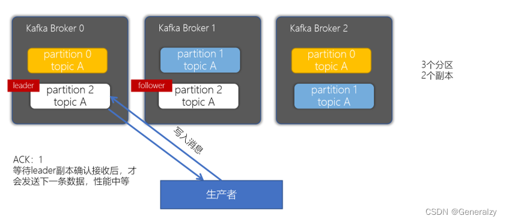

当生产者的 ACK配置为1时，生产者会等待leader 副本确认接收后，才会发送下一条数据，性能中等

#### acks配置为-1的或 all

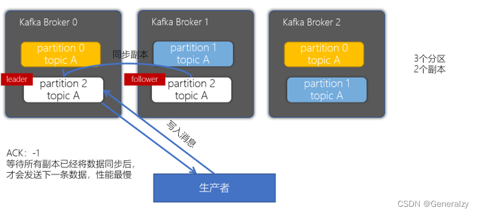

### Kafka生产幂等性与事务

##### 幂等性

拿http举例来说，一次或多次请求，得到的响应是一致的（网络超时等问题除外），换句话说，就是执行多次操作与执行一次操作的影响是一样的

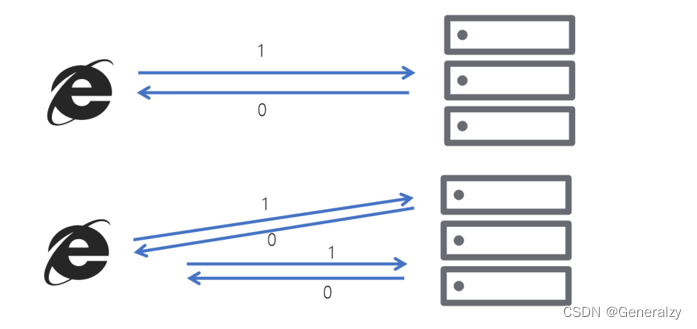

如果，某个系统是不具备幂等性的，如果用户重复提交某个表格，就会造成不良影响。例如：用户在浏览器点击了多次提交订单按钮，然后会生成一个一模一样的订单

##### Kafka生产者幂等性

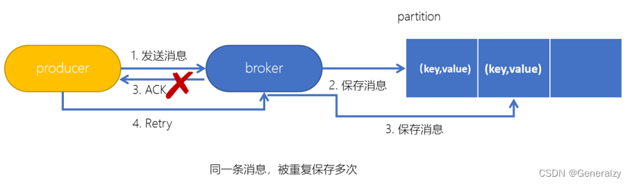

在生产者生产消息时，如果出现 retry时，有可能会一条消息被发送了多次，如果Kafka不具备幂等性，就有可能在 partition中保存多条一模一样的消息

##### 幂等性原理

为了实现生产者的幂等性，Kafka 引入了 Producer ID（PID）和 Sequence Number的概念

1、PID：每个 producer 在初始化时，都会分配一个PID，这个对于用户来说是透明的

2、Sequence Number：针对每个生产者（对应PID）发送指定的主题分区的消息都对应一个从0开始的 Sequence Number

3、幂等性只能保证的是单分区单会话不重复

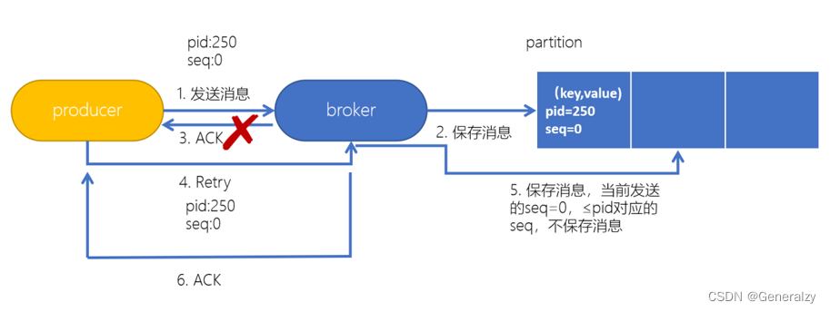

### Kafka事务

1、Kafka事务是2017年Kafka 0.11.0.0引入的新特性。类似于数据库的事务。Kafka事务指的是生产者生产消息以及消费者提交offset的操作可以在一个原子操作中，要么都成功，要么都失败。尤其是在生产者、消费者并存时，事务的保障尤其重要。（consumer-transform-producer模式）

2、开启事务，必须开启幂等性

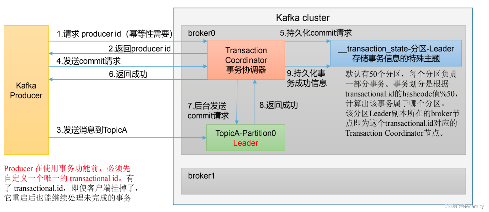

#### 事务操作 API

Producer接口定义了以下五个事务相关方法：

1、 initTransactions（初始化事务）：要使用Kafka事务，必须先进行初始化操作
2、 beginTransaction（开始事务）：启动一个Kafka事务
3、sendOffsetsToTransaction（提交偏移量）：批量地将分区对应的offset发送到事务中，方便后续一块提交
4、 commitTransaction（提交事务）：提交事务
5、abortTransaction（放弃事务）：取消事务

### 数据有序和数据乱序

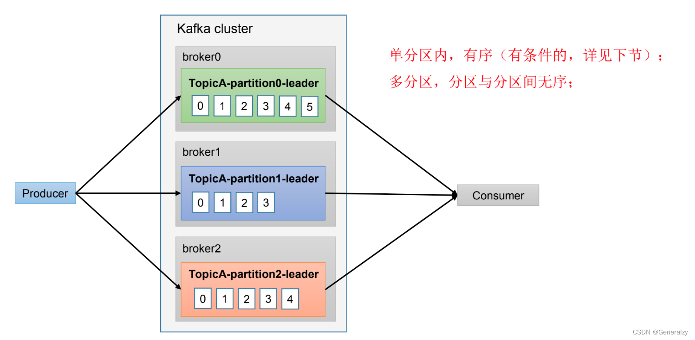

**跨分区无法保证顺序性的原因：**

1. **分区的独立性**
   - 不同分区的日志文件相互独立，消息写入不同分区时没有全局顺序控制。例如：
     - 消息 A 写入分区 P1（Offset=0），消息 B 写入分区 P2（Offset=0），两者的写入顺序在全局层面无法保证，可能 B 先于 A 到达 Broker。
   - 因此，跨分区的消息顺序是无序的，仅单分区内有序。
2. **负载均衡与顺序性的权衡**
   - Kafka 通过分区实现分布式并行处理，若要求全局有序，需牺牲并行性（所有消息存入单分区），这与 Kafka 的设计目标（高吞吐量）冲突。

## Kafka Broker
### Zookeeper存储的Kafka信息

``` shell
[zk: localhost:2181(CONNECTING) 0] ls /
[admin, brokers, cluster, config, consumers, controller, controller_epoch, feature, isr_change_notification, latest_producer_id_block, log_dir_event_notification, zookeeper]
```

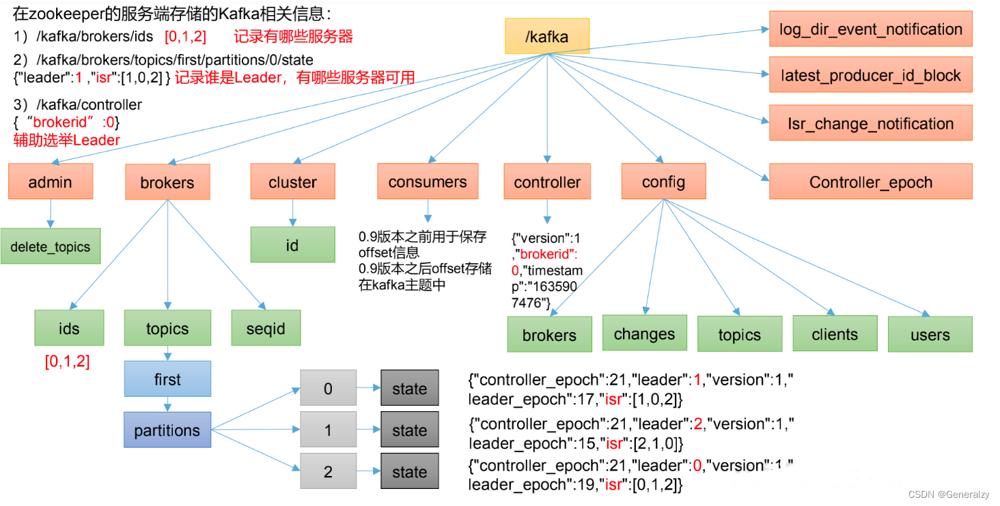


### Kafka Broker总体工作流程

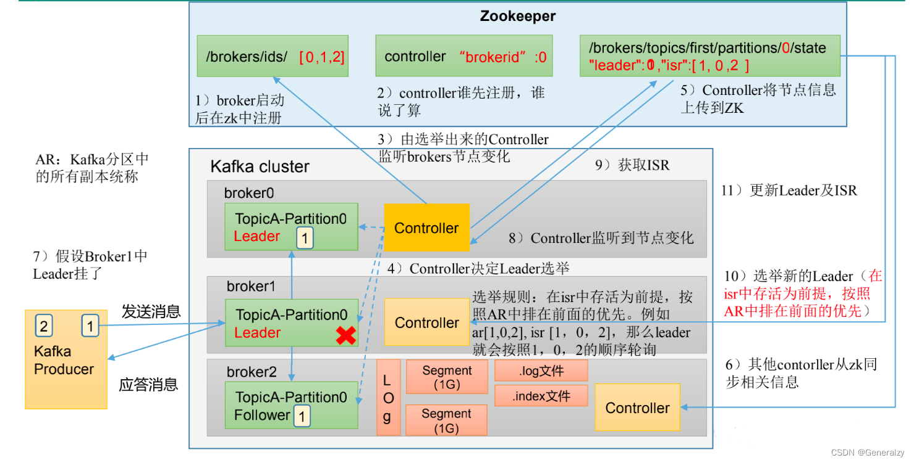

### Broker重要参数

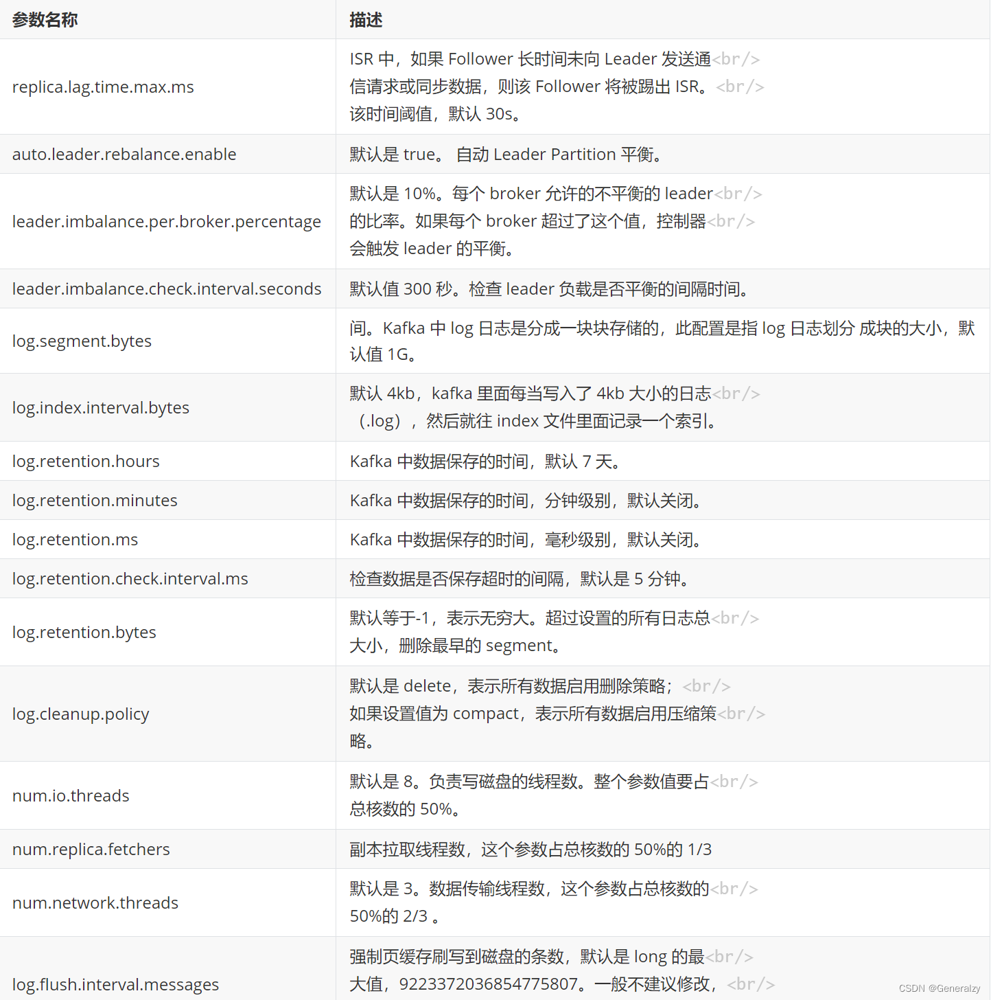

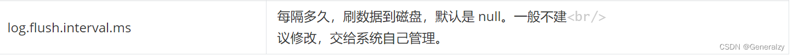

### Kafka副本

#### 副本基本信息

1、Kafka副本作用：提高数据可靠性

2、Kafka默认副本1个，生产环境一般为两个，保证数据可靠性；太多副本会增加磁盘存储空间，增加网络上数据传输，降低效率的。

3、Kakfa中副本为：Leader和 Follwer。Kafka 生产者只会把数据发往Leader，然后Follower 找 Leader 进行同步数据

4、Kafka分区中的所有副本统称为AR（Assign Repllicas）

AR = ISR + OSR

ISR：表示 Leader 保持同步的 Follower 集合。如果 Follower 长时间未 向 Leader 发送通信请求或同步数据，则该 Follower 将被踢出 ISR。该时间阈值由 replica.lag.time.max.ms 参数设定，默认 30s 。Leader 发生故障之后，就会从 ISR 中选举新的 Leader。

OSR：表示 Follower 与 Leader 副本同步时，延迟过多的副本。

#### Leader 选举流程

Kafka集群中有一个 broker 的 Controller 会被选举为 Controller Leader，负责管理集群 broker 的上下线，所有topic的分区副本分配和 Leader 选举等工作

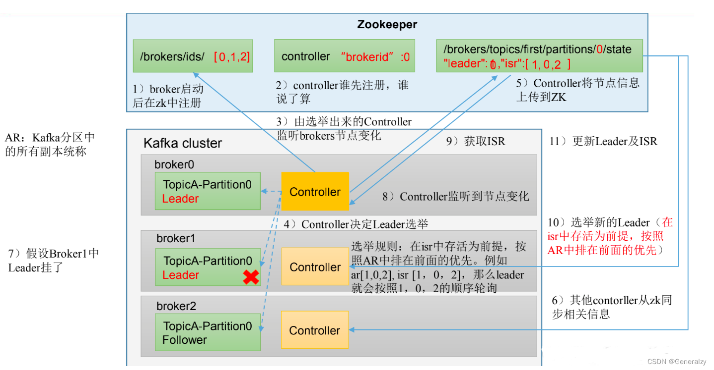

1、创建一个新的分区 topic，4个分区，4个副本

``` shell
[atguigu@hadoop102 kafka]$ bin/kafka-topics.sh --bootstrap-server hadoop102:9092 --create --topic atguigu1 --partitions 4 --replication-factor 4
Created topic atguigu1.
```

2、查看 Leader分布情况

```shell
[atguigu@hadoop102 kafka]$ bin/kafka-topics.sh --bootstrap-server hadoop102:9092 --describe 
--topic atguigu1
Topic: atguigu1 TopicId: awpgX_7WR-OX3Vl6HE8sVg PartitionCount: 4 ReplicationFactor: 4
Configs: segment.bytes=1073741824
Topic: atguigu1 Partition: 0 Leader: 3 Replicas: 3,0,2,1 Isr: 3,0,2,1
Topic: atguigu1 Partition: 1 Leader: 1 Replicas: 1,2,3,0 Isr: 1,2,3,0
Topic: atguigu1 Partition: 2 Leader: 0 Replicas: 0,3,1,2 Isr: 0,3,1,2
Topic: atguigu1 Partition: 3 Leader: 2 Replicas: 2,1,0,3 Isr: 2,1,0,3
```

3、停止掉hadoop105的 kafka进程，并查看Leader 分区情况

```shell
[atguigu@hadoop105 kafka]$ bin/kafka-server-stop.sh
[atguigu@hadoop102 kafka]$ bin/kafka-topics.sh --bootstrap-server hadoop102:9092 --describe 
--topic atguigu1
Topic: atguigu1 TopicId: awpgX_7WR-OX3Vl6HE8sVg PartitionCount: 4 ReplicationFactor: 4
Configs: segment.bytes=1073741824
Topic: atguigu1 Partition: 0 Leader: 0 Replicas: 3,0,2,1 Isr: 0,2,1
Topic: atguigu1 Partition: 1 Leader: 1 Replicas: 1,2,3,0 Isr: 1,2,0
Topic: atguigu1 Partition: 2 Leader: 0 Replicas: 0,3,1,2 Isr: 0,1,2
Topic: atguigu1 Partition: 3 Leader: 2 Replicas: 2,1,0,3 Isr: 2,1,0
```

4、停止掉 hadoop104 的 kafka进程，并查看 Leader 分区情况

``` shell
[atguigu@hadoop104 kafka]$ bin/kafka-server-stop.sh
[atguigu@hadoop102 kafka]$ bin/kafka-topics.sh --bootstrap-server hadoop102:9092 --describe 
--topic atguigu1
Topic: atguigu1 TopicId: awpgX_7WR-OX3Vl6HE8sVg PartitionCount: 4 ReplicationFactor: 4
Configs: segment.bytes=1073741824
Topic: atguigu1 Partition: 0 Leader: 0 Replicas: 3,0,2,1 Isr: 0,1
Topic: atguigu1 Partition: 1 Leader: 1 Replicas: 1,2,3,0 Isr: 1,0
Topic: atguigu1 Partition: 2 Leader: 0 Replicas: 0,3,1,2 Isr: 0,1
Topic: atguigu1 Partition: 3 Leader: 1 Replicas: 2,1,0,3 Isr: 1,0
```

#### Leader 和 Follower 故障处理细节

**LEO（Log End Offset）**: 每个副本的最后一个offset，LEO其实就是最新的 offset + 1。

**HW（High Watermark）**：所有副本中最小的LEO。

   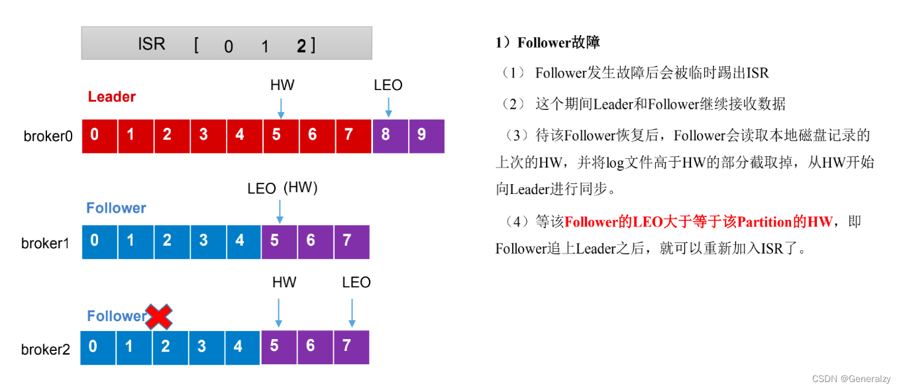

 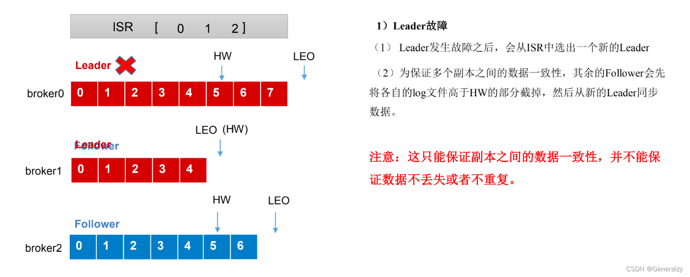

#### 活动调整分区副本存储

在生产环境中，每台服务器的配置和性能不一致，但是 Kafka只会根据自己的代码规则创建对应的分区副本，就会导致个别服务器存储压力比较大。所以需要手动调整分区副本的存储

**需求：**创建一个新的 topic，4个分区，两个副本，名称为 three。将该topic 的所有副本都存储broker0和 broker1两台服务器

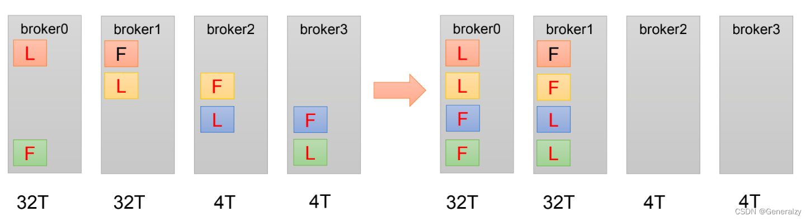

手动调整分区副本存储的步骤如下：

1、创建一个新的topic，名称的为 three

```shell
 [atguigu@hadoop102 kafka]$ bin/kafka-topics.sh --bootstrap-server 
hadoop102:9092 --create --partitions 4 --replication-factor 2 --
topic three
```

2、查看分区副本存储情况

``` shell
[atguigu@hadoop102 kafka]$ bin/kafka-topics.sh --bootstrap-server 
hadoop102:9092 --describe --topic three
```

3、创建副本存储计划（所有副本都指定存储自爱 broker0、broker1中）

``` shell
[atguigu@hadoop102 kafka]$ vim increase-replication-factor.json
```

输入以下内容

``` json
{
  "version":1,
  "partitions":[{"topic":"three","partition":0,"replicas":[0,1]},
  {"topic":"three","partition":1,"replicas":[0,1]},
  {"topic":"three","partition":2,"replicas":[1,0]},
  {"topic":"three","partition":3,"replicas":[1,0]}] 
}
```

4、执行副本存储计划

``` shell
[atguigu@hadoop102 kafka]$ bin/kafka-reassign-partitions.sh --
bootstrap-server hadoop102:9092 --reassignment-json-file 
increase-replication-factor.json --execute
```

5、验证副本存储计划

``` shell
[atguigu@hadoop102 kafka]$ bin/kafka-reassign-partitions.sh --
bootstrap-server hadoop102:9092 --reassignment-json-file 
increase-replication-factor.json --verify
```

6、查看分区副本存储情况

``` shell
[atguigu@hadoop102 kafka]$ bin/kafka-topics.sh --bootstrap-server 
hadoop102:9092 --describe --topic three
```

#### Leader Partition 负载平衡

正常情况下，Kafka本身会自动把 Leader Partition均匀分散到各个机器上，来保证每台机器的读写吞吐量都是均匀的。但是如果某些 broker 宕机，会导致 Leader Partition 过于集中在其他少部分几台broker上，这会导致少数几台broker 的读写请求压力过高，其他宕机的 broker重启之后都是follower partition，读写请求很低，造成集群负载不均衡

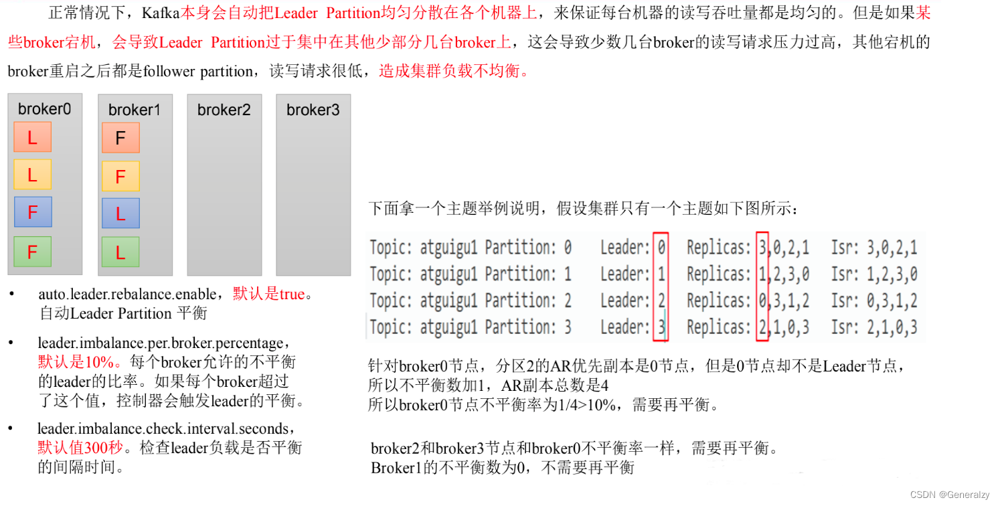

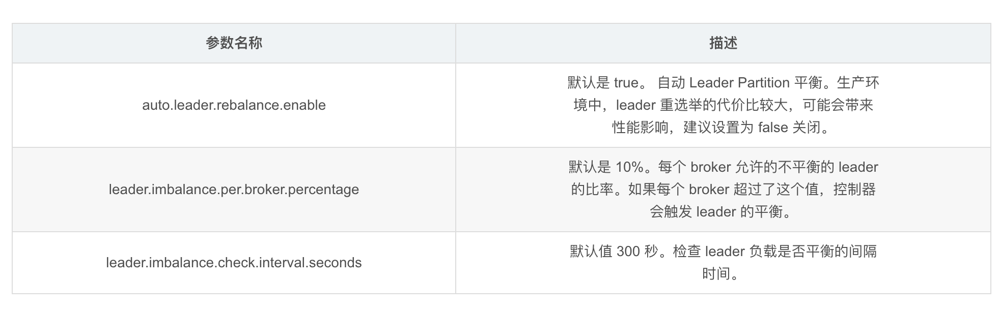

### 文件存储

#### Topic 数据的存储机制

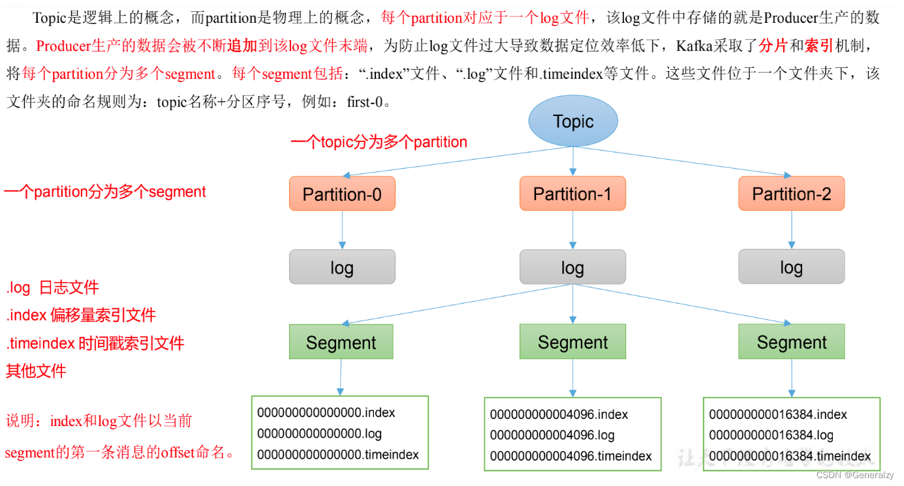

查看 hadoop102（或者 hadoop103、hadoop104）的/opt/module/kafka/datas/first-1 （first-0、first-2）路径上的文件

```
[atguigu@hadoop104 first-1]$ ls
00000000000000000092.index
00000000000000000092.log
00000000000000000092.snapshot
00000000000000000092.timeindex
leader-epoch-checkpoint
partition.metadata
```

通过工具查看 index 和 log信息

``` 
[atguigu@hadoop104 first-1]$ kafka-run-class.sh kafka.tools.DumpLogSegments 
--files ./00000000000000000000.index 
Dumping ./00000000000000000000.index
offset: 3 position: 152
```

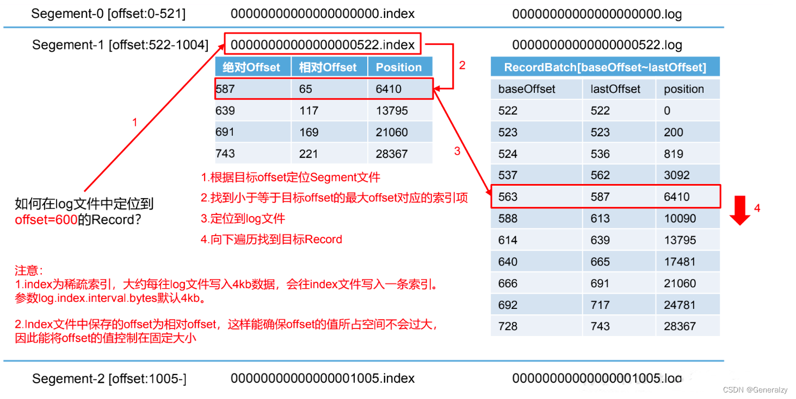

#### 文件清理策略

Kafka中默认的日志保存时间为7天，可以通过调整如下参数修改保存时间

- Log.retention.hours，最低优先级小时，默认7天。
- log.retention.minutes，分钟。
- log.retention.ms，最高优先级毫秒。
- log.retention.check.interval.ms，负责设置检查周期，默认 5 分钟。

Kafka 中提供的日志清理策略有 delete 和 compact两种

**1、delete 日志阐述：将过期数据删除**

- log.cleanup.policy = delete 所有数据启用阐述策略
  (1) 基于时间：默认打开。以 segment 中所有记录中的最大时间戳作为该文件时间戳。

  (2) 基于大小：默认关闭。超过设置的所有日志总大小，阐述最早的 segment 。

  log.retention.bytes，默认等于-1，表示无穷大。

**2、compact 日志压缩**

compact日志压缩：对于相同 key 的不同 value 值，值保留最后一个版本。

log.cleanup.policy = compact所有数据启动压缩策略

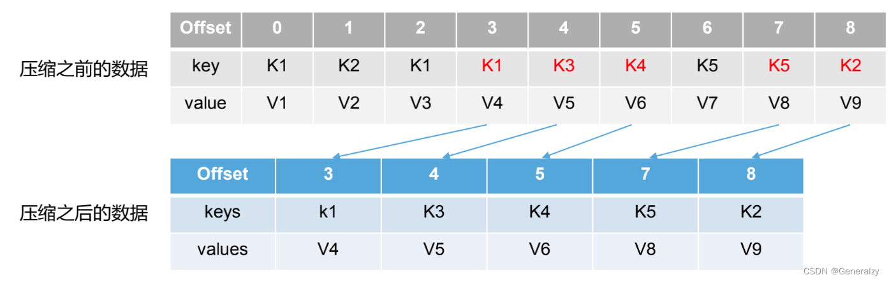


压缩后的offset可能是不连续的，比如上图中没有6，当从这些offset消费消息时，将会拿到比这个 offset 大的 offset 对应的消息，实际上会拿到 offset 为 7 的消息，并从这个位置开始消费。

 这种策略只适合特殊场景，比如消息的 key 是用户 ID，value 是用户的资料，通过这种压缩策略，整个消息集里就保存了所有用户最新的资料。

## Kafka 消费者
### Kafka 消费方式

- Pull （拉）模式：Consumer 采用从 broker主动拉取数据。kafka采用这种方式
- Push（推）模式：Kafka 没有采用这种方式，因为由 broker 决定消息发送速率，很难适应所有消费者的消费速率

pull 模式不足之处是，如果Kafka 没有数据，消费者可能会陷入循环中，一直返回空数据

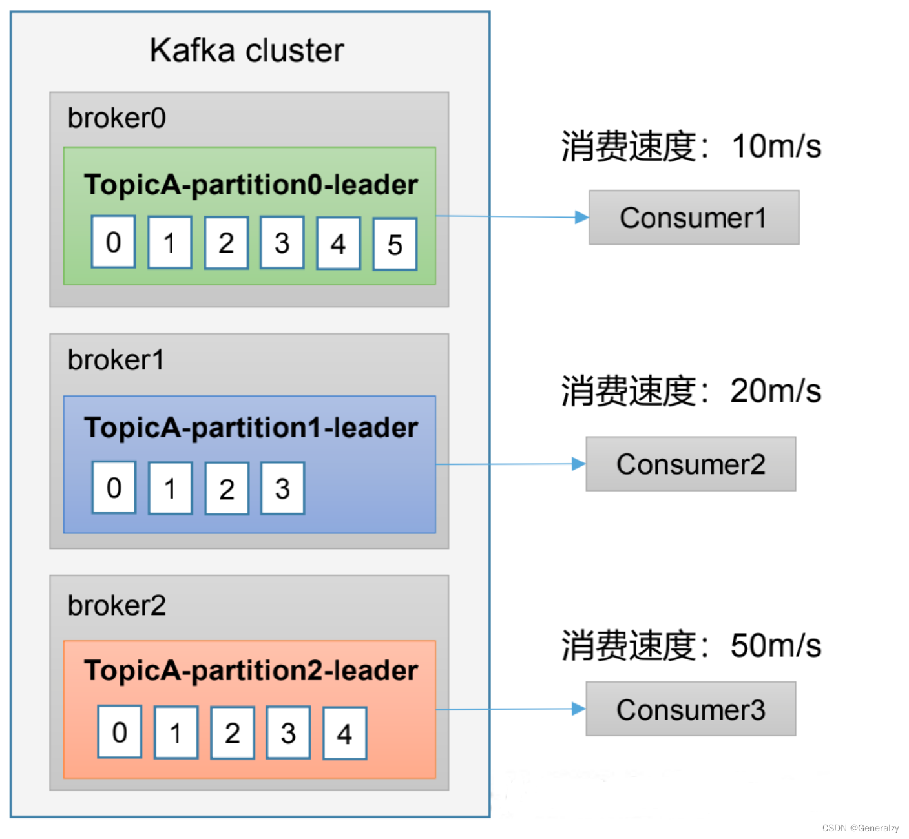

### Kafka 消费者工作流程

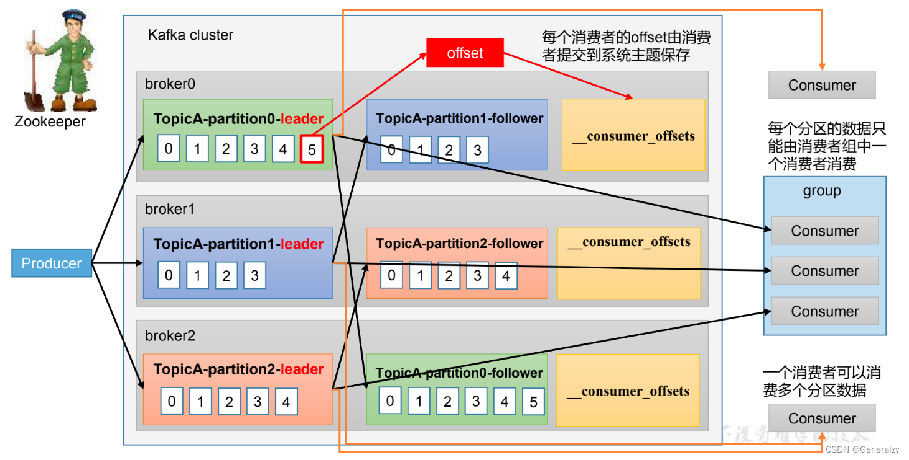

### 消费者组原理

Consumer Group （CG）：消费者组，由多个consumer组成。形成一个消费者组的条件是所有消费者的 groupid 相同

- 消费者组内每个消费者负责消费不同分区的数据，一个分区只能由一个组内消费者消费。
- 消费者组之间互不影响。所有的消费者都属于某个消费者组，即消费者组是逻辑上的一个订阅者

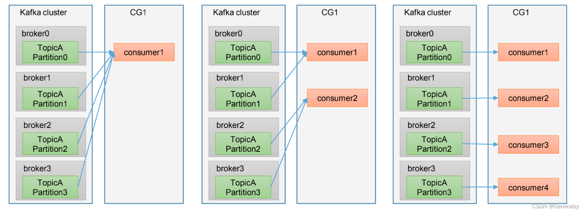

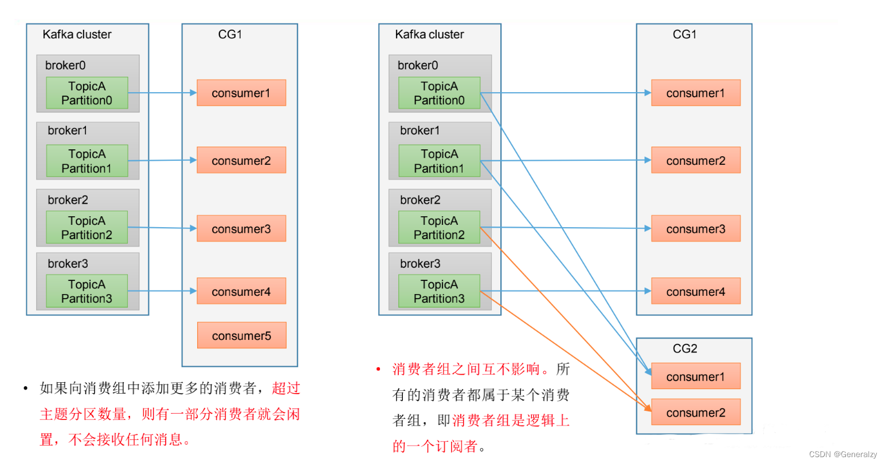

### 消费者重要参数

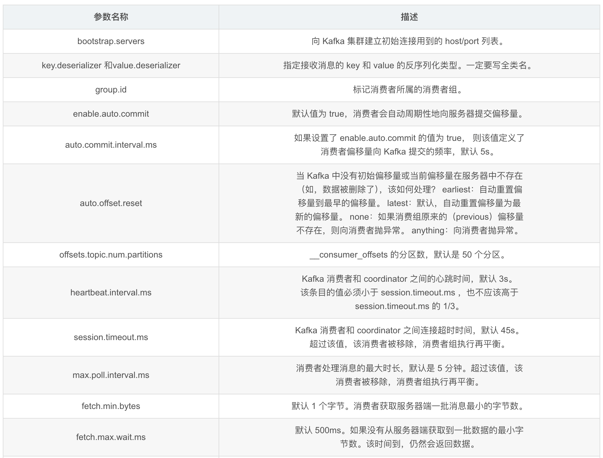

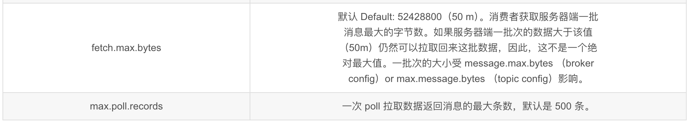

### offset 位移

#### offset 的默认维护位置

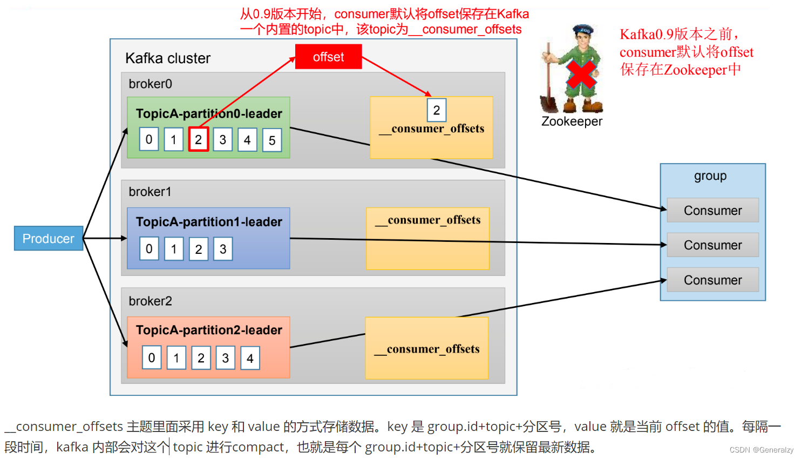

#### 自动提交offset

为了使我们能够专注于自己的业务逻辑，Kafka提供了自动提交offset 的功能

自动提交 offset的相关参数：

- enable.auto.commit：是否自动提交 offset功能，默认是 true
- auto.commit.interval.ms：自动提交 offsert 的时间间隔，默认是5s

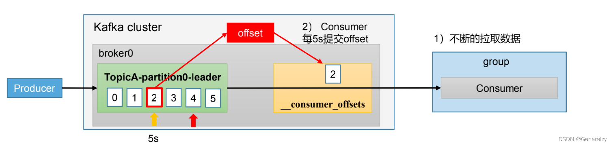

#### 手动提交offset

虽然自动提交offset十分简单比那里，但由于其是基于时间提交的，开发人员难以把握 offset 提交的时机。一次 Kafka 还提供了手动提交 offset 的API。

手动提交 offset 的方法有两种：分别是 commitSync(同步提交)和commitAsync(异步提交)。两者的相同点是，都会将本次提交的一批数据最高的偏移量提交；不同点是，同步提交阻塞当前线程，一直到提交成功，并且会自动失败重试（由不可控因素导致，也会出现提交失败）；而异步提交则没有失败重试机制，故有可能提交失败。

- commitSync（同步提交）：必须等待offset提交完毕，再去消费下一批数据。
- commitAsync（异步提交） ：发送完提交offset请求后，就开始消费下一批数据了。

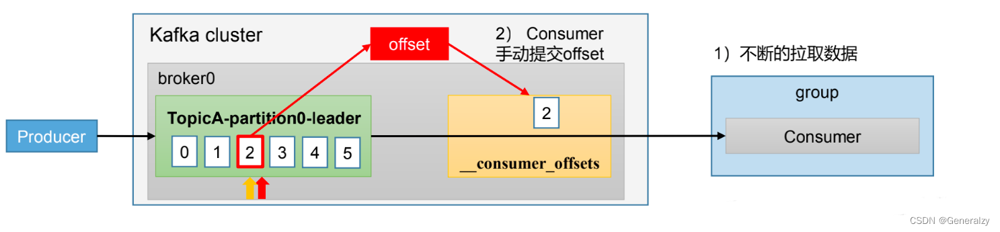

#### 指定Offset消费

auto.offset.reset = earliest | latest | none 默认是 latest。

当 Kafka 中没有初始偏移量（消费者组第一次消费）或服务器上不再存在当前偏移量

时（例如该数据已被删除），该怎么办？

（1）earliest：自动将偏移量重置为最早的偏移量，–from-beginning。

（2）latest（默认值）：自动将偏移量重置为最新偏移量。

（3）none：如果未找到消费者组的先前偏移量，则向消费者抛出异常。
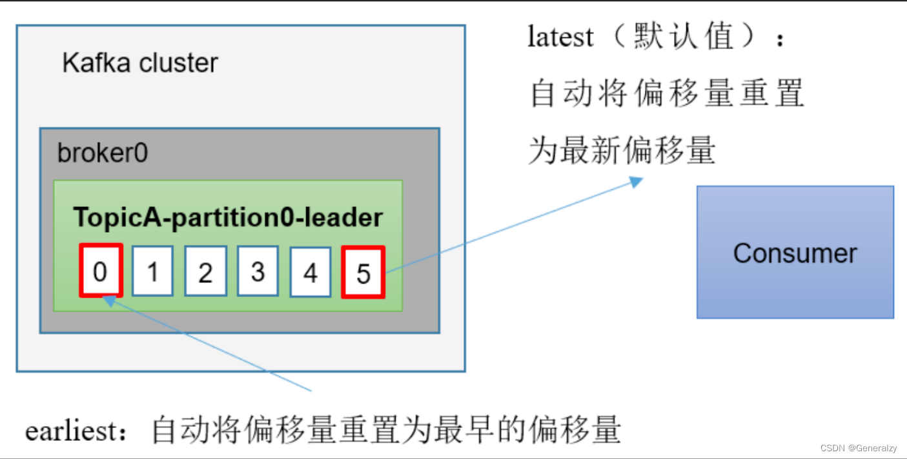


