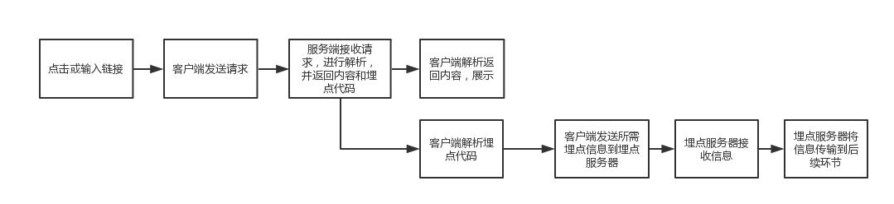
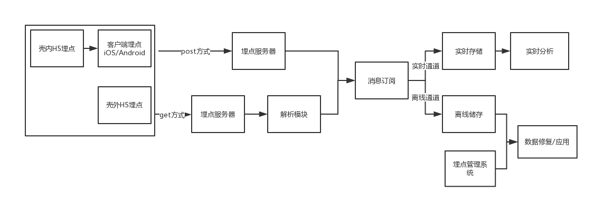

## 大数据部署

### Mysql

### Flink


### Starrocks

#### **1、前期准备**

JDK：https://www.oracle.com/asean/java/technologies/javase/jdk11-archive-downloads.html

StarRocks安装包：https://www.starrocks.io/download/community

StarRocks官方文档

**注意**：StarRocks V2.5版本以上建议安装 JDK11

#### **2、手动部署**

**第一步：启动 Leader FE 节点**

以下操作在 FE 实例上执行。

1. 创建元数据存储路径。建议将元数据存储在与 FE 部署文件不同的路径中。请确保此路径存在并且您拥有写入权限。

   ```bash
   # 将 <meta_dir> 替换为您要创建的元数据目录。
   mkdir -p <meta_dir>
   ```

2. 进入先前准备好的 [StarRocks FE 部署文件](https://docs.starrocks.io/zh/docs/3.1/deployment/prepare_deployment_files/)所在路径，修改 FE 配置文件 **fe/conf/fe.conf**。

   a. 在配置项 `meta_dir` 中指定元数据路径。

   ```yaml
   # 将 <meta_dir> 替换为您已创建的元数据目录。
   meta_dir = <meta_dir>
   ```

   b. 如果任何在 [环境配置清单](https://docs.starrocks.io/zh/docs/3.1/deployment/environment_configurations/) 中提到的 FE 端口被占用，您必须在 FE 配置文件中为其分配其他可用端口。

   ```yaml
   http_port = aaaa        # 默认值：8030
   rpc_port = bbbb         # 默认值：9020
   query_port = cccc       # 默认值：9030
   edit_log_port = dddd    # 默认值：9010
   ```

   > **注意**
   >
   > 如需在集群中部署多个 FE 节点，您必须为所有 FE 节点分配相同的 `http_port`。

   c. 如需为集群启用 IP 地址访问，您必须在配置文件中添加配置项 `priority_networks`，为 FE 节点分配一个专有的 IP 地址（CIDR格式）。如需为集群启用 FQDN 访问，则可以忽略该配置项。

   ```yaml
   priority_networks = x.x.x.x/x
   ```

   d. 如果您的实例安装了多个 JDK，并且您要使用 JDK 与环境变量 `JAVA_HOME` 中指定的不同，则必须在配置文件中添加配置项 `JAVA_HOME` 来指定所选该 JDK 的安装路径。

   ```yaml
   # 将 <path_to_JDK> 替换为所选 JDK 的安装路径。
   JAVA_HOME = <path_to_JDK>
   ```

   e. 更多高级配置项请参考 [参数配置 - FE 配置项](https://docs.starrocks.io/zh/docs/3.1/administration/management/FE_configuration/)。

3. 启动 FE 节点。

   - 如需为集群启用 IP 地址访问，请运行以下命令启动 FE 节点：

     ```bash
     ./fe/bin/start_fe.sh --daemon
     ```

   - 如需为集群启用 FQDN 访问，请运行以下命令启动 FE 节点：:

     ```bash
     ./fe/bin/start_fe.sh --host_type FQDN --daemon
     ```

     您只需在第一次启动节点时指定参数 `--host_type`。

     > **注意**
     >
     > 如需启用 FQDN 访问，在启动 FE 节点之前，请确保您已经在 **/etc/hosts** 中为所有实例分配了主机名。有关详细信息，请参考 [环境配置清单 - 主机名](https://docs.starrocks.io/zh/docs/3.1/deployment/environment_configurations/#主机名)。

4. 查看 FE 日志，检查 FE 节点是否启动成功。

   ```bash
   cat fe/log/fe.log | grep thrift
   ```

   如果日志打印以下内容，则说明该 FE 节点启动成功：

   "2022-08-10 16:12:29,911 INFO (UNKNOWN x.x.x.x_9010_1660119137253(-1)|1) [FeServer.start():52] thrift server started with port 9020."


**第二步：（存算一体）启动 BE 服务**

备注：只能将 BE 节点添加到存算一体集群中。不建议在存算分离集群中添加 BE 节点，否则可能导致未知行为。

以下操作在 BE 实例上执行。

1. 创建数据存储路径。建议将数据存储在与 BE 部署文件不同的路径中。请确保此路径存在并且您拥有写入权限。

   ```bash
   # 将 <storage_root_path> 替换为您要创建的数据存储路径。
   mkdir -p <storage_root_path>
   ```

2. 进入先前准备好的 [StarRocks BE 部署文件](https://docs.starrocks.io/zh/docs/3.1/deployment/prepare_deployment_files/)所在路径，修改 BE 配置文件 **be/conf/be.conf**。

   a. 在配置项 `storage_root_path` 中指定数据存储路径。

   ```yaml
   # 将 <storage_root_path> 替换为您创建的数据存储路径。
   storage_root_path = <storage_root_path>
   ```

   b. 如果任何在 [环境配置清单](https://docs.starrocks.io/zh/docs/3.1/deployment/environment_configurations/) 中提到的 BE 端口被占用，您必须在 BE 配置文件中为其分配其他可用端口。

   ```yaml
   be_port = vvvv                   # 默认值：9060
   be_http_port = xxxx              # 默认值：8040
   heartbeat_service_port = yyyy    # 默认值：9050
   brpc_port = zzzz                 # 默认值：8060
   ```

   c. 如需为集群启用 IP 地址访问，您必须在配置文件中添加配置项 `priority_networks`，为 BE 节点分配一个专有的 IP 地址（CIDR格式）。如需为集群启用 FQDN 访问，则可以忽略该配置项。

   ```yaml
   priority_networks = x.x.x.x/x
   ```

   d. 如果您的实例安装了多个 JDK，并且您要使用 JDK 与环境变量 `JAVA_HOME` 中指定的不同，则必须在配置文件中添加配置项 `JAVA_HOME` 来指定所选该 JDK 的安装路径。

   ```yaml
   # 将 <path_to_JDK> 替换为所选 JDK 的安装路径。
   JAVA_HOME = <path_to_JDK>
   ```

   e. 更多高级配置项请参考 [参数配置 - BE 配置项](https://docs.starrocks.io/zh/docs/3.1/administration/management/BE_configuration/)。

3. 启动 BE 节点。

   ```bash
   ./be/bin/start_be.sh --daemon
   ```

   > **注意**
   >
   > - 如需启用 FQDN 访问，在启动 BE 节点之前，请确保您已经在 **/etc/hosts** 中为所有实例分配了主机名。有关详细信息，请参考 [环境配置清单 - 主机名](https://docs.starrocks.io/zh/docs/3.1/deployment/environment_configurations/#主机名)。
   > - 启动 BE 节点时无需指定参数 `--host_type`。

4. 查看 BE 日志，检查 BE 节点是否启动成功。

   ```bash
   cat be/log/be.INFO | grep heartbeat
   ```

   如果日志打印以下内容，则说明该 BE 节点启动成功：

   "I0614 17:41:39.782819 3717531 thrift_server.cpp:388] heartbeat has started listening port on 9050"

5. 在其他 BE 实例上重复以上步骤，即可启动新的 BE 节点。

> **说明**
>
> 在一个 StarRocks 集群中部署并添加至少 3 个 BE 节点后，这些节点将自动形成一个 BE 高可用集群。


**第三步：搭建集群**

当所有 FE 和 BE/CN 节点启动成功后，即可搭建 StarRocks 集群。

以下过程在 MySQL 客户端实例上执行。您必须安装 MySQL 客户端（5.5.0 或更高版本）。

1. 通过 MySQL 客户端连接到 StarRocks。您需要使用初始用户 `root` 登录，密码默认为空。

   ```bash
   # 将 <fe_address> 替换为 Leader FE 节点的 IP 地址（priority_networks）或 FQDN，
   # 并将 <query_port>（默认：9030）替换为您在 fe.conf 中指定的 query_port。
   mysql -h <fe_address> -P<query_port> -uroot
   ```

2. 执行以下 SQL 查看 Leader FE 节点状态。

   ```sql
   SHOW PROC '/frontends'\G
   ```

   示例：

   ```plain
   MySQL [(none)]> SHOW PROC '/frontends'\G
   *************************** 1. row ***************************
                Name: x.x.x.x_9010_1686810741121
                  IP: x.x.x.x
         EditLogPort: 9010
            HttpPort: 8030
           QueryPort: 9030
             RpcPort: 9020
                Role: LEADER
           ClusterId: 919351034
                Join: true
               Alive: true
   ReplayedJournalId: 1220
       LastHeartbeat: 2023-06-15 15:39:04
            IsHelper: true
              ErrMsg: 
           StartTime: 2023-06-15 14:32:28
             Version: 3.0.0-48f4d81
   1 row in set (0.01 sec)
   ```

   - 如果字段 `Alive` 为 `true`，说明该 FE 节点正常启动并加入集群。
   - 如果字段 `Role` 为 `FOLLOWER`，说明该 FE 节点有资格被选为 Leader FE 节点。
   - 如果字段 `Role` 为 `LEADER`，说明该 FE 节点为 Leader FE 节点。

3. 添加 BE/CN 节点至集群。

   - （存算一体）添加 BE 节点。

   ```sql
   -- 将 <be_address> 替换为 BE 节点的 IP 地址（priority_networks）或 FQDN，
   -- 并将 <heartbeat_service_port>（默认：9050）替换为您在 be.conf 中指定的 heartbeat_service_port。
   ALTER SYSTEM ADD BACKEND "<be_address>:<heartbeat_service_port>", "<be2_address>:<heartbeat_service_port>", "<be3_address>:<heartbeat_service_port>";
   ```

   > **说明**
   >
   > 您可以通过一条 SQL 添加多个 BE 节点。每对 `<be_address>:<heartbeat_service_port>` 代表一个 BE 节点。

   - （存算分离）添加 CN 节点。

   ```sql
   -- 将 <cn_address> 替换为 CN 节点的 IP 地址（priority_networks）或 FQDN，
   -- 并将 <heartbeat_service_port>（默认：9050）替换为您在 cn.conf 中指定的 heartbeat_service_port。
   ALTER SYSTEM ADD COMPUTE NODE "<cn_address>:<heartbeat_service_port>", "<cn2_address>:<heartbeat_service_port>", "<cn3_address>:<heartbeat_service_port>";
   ```

   > **说明**
   >
   > 您可以通过一条 SQL 添加多个 CN 节点。每对 `<cn_address>:<heartbeat_service_port>` 代表一个 CN 节点。

4. 执行以下 SQL 查看 BE/CN 节点状态。

   - 查看 BE 节点状态。

   ```sql
   SHOW PROC '/backends'\G
   ```

   示例：

   ```plain
   MySQL [(none)]> SHOW PROC '/backends'\G
   *************************** 1. row ***************************
               BackendId: 10007
                      IP: 172.26.195.67
           HeartbeatPort: 9050
                  BePort: 9060
                HttpPort: 8040
                BrpcPort: 8060
           LastStartTime: 2023-06-15 15:23:08
           LastHeartbeat: 2023-06-15 15:57:30
                   Alive: true
    SystemDecommissioned: false
   ClusterDecommissioned: false
               TabletNum: 30
        DataUsedCapacity: 0.000 
           AvailCapacity: 341.965 GB
           TotalCapacity: 1.968 TB
                 UsedPct: 83.04 %
          MaxDiskUsedPct: 83.04 %
                  ErrMsg: 
                 Version: 3.0.0-48f4d81
                  Status: {"lastSuccessReportTabletsTime":"2023-06-15 15:57:08"}
       DataTotalCapacity: 341.965 GB
             DataUsedPct: 0.00 %
                CpuCores: 16
       NumRunningQueries: 0
              MemUsedPct: 0.01 %
              CpuUsedPct: 0.0 %
   ```

   如果字段 `Alive` 为 `true`，说明该 BE 节点正常启动并加入集群。

   - 查看 CN 节点状态。

   ```sql
   SHOW PROC '/compute_nodes'\G
   ```

   示例：

   ```plain
   MySQL [(none)]> SHOW PROC '/compute_nodes'\G
   *************************** 1. row ***************************
           ComputeNodeId: 10003
                      IP: x.x.x.x
           HeartbeatPort: 9050
                  BePort: 9060
                HttpPort: 8040
                BrpcPort: 8060
           LastStartTime: 2023-03-13 15:11:13
           LastHeartbeat: 2023-03-13 15:11:13
                   Alive: true
    SystemDecommissioned: false
   ClusterDecommissioned: false
                  ErrMsg: 
                 Version: 2.5.2-c3772fb
   1 row in set (0.00 sec)
   ```

   如果字段 `Alive` 为 `true`，说明该 CN 节点正常启动并加入集群。

   如果执行查询时需要使用 CN 节点扩展算力，则需要设置系统变量 `SET prefer_compute_node = true;` 和 `SET use_compute_nodes = -1;`。系统变量的更多信息，请参见[系统变量](https://docs.starrocks.io/zh/docs/3.1/sql-reference/System_variable/#支持的变量)。


**第四步：（可选）部署高可用FE 集群**

高可用的 FE 集群需要在 StarRocks 集群中部署至少三个 Follower FE 节点。如需部署高可用的 FE 集群，您需要额外再启动两个新的 FE 节点。

1. 通过 MySQL 客户端连接到 StarRocks。您需要使用初始用户 `root` 登录，密码默认为空。

   ```bash
   # 将 <fe_address> 替换为 Leader FE 节点的 IP 地址（priority_networks）或 FQDN，
   # 并将 <query_port>（默认：9030）替换为您在 fe.conf 中指定的 query_port。
   mysql -h <fe_address> -P<query_port> -uroot
   ```

2. 执行以下 SQL 将额外的 FE 节点添加至集群。

   ```sql
   -- 将 <new_fe_address> 替换为您需要添加的新 FE 节点的 IP 地址（priority_networks）或 FQDN，
   -- 并将 <edit_log_port>（默认：9010）替换为您在新 FE 节点的 fe.conf 中指定的 edit_log_port。
   ALTER SYSTEM ADD FOLLOWER "<new_fe_address>:<edit_log_port>";
   ```

   > **说明**
   >
   > - 您只能通过一条 SQL 添加一个 Follower FE 节点。
   > - 如需添加更多的 Observer FE 节点，请执行 `ALTER SYSTEM ADD OBSERVER "<fe_address>:<edit_log_port>"`。有关详细说明，请参考 [ALTER SYSTEM - FE](https://docs.starrocks.io/zh/docs/3.1/sql-reference/sql-statements/cluster-management/nodes_processes/ALTER_SYSTEM/)。

3. 在新的 FE 示例上启动终端，创建元数据存储路径，进入 StarRocks 部署目录，并修改 FE 配置文件 **fe/conf/fe.conf**。详细信息，请参考 [第一步：启动 Leader FE 节点](https://docs.starrocks.io/zh/docs/3.1/deployment/deploy_manually/#第一步启动-leader-fe-节点)。

   配置完成后，通过以下命令为新 Follower FE 节点分配 helper 节点，并启动新 FE 节点：

   > **说明**
   >
   > 向集群中添加新的 Follower FE 节点时，您必须在首次启动新 FE 节点时为其分配一个 helper 节点（本质上是一个现有的 Follower FE 节点）以同步所有 FE 元数据信息。

   - 如已为集群启用 IP 地址访问，请运行以下命令启动 FE 节点：

   ```bash
   # 将 <helper_fe_ip> 替换为 Leader FE 节点的 IP 地址（priority_networks），
   # 并将 <helper_edit_log_port>（默认：9010）替换为 Leader FE 节点的 edit_log_port。
   ./fe/bin/start_fe.sh --helper <helper_fe_ip>:<helper_edit_log_port> --daemon
   ```

   您只需在第一次启动节点时指定参数 `--helper`。

   - 如已为集群启用 FQDN 访问，请运行以下命令启动 FE 节点：

   ```bash
   # 将 <helper_fqdn> 替换为 Leader FE 节点的 FQDN，
   # 并将 <helper_edit_log_port>（默认：9010）替换为 Leader FE 节点的 edit_log_port。
   ./fe/bin/start_fe.sh --helper <helper_fqdn>:<helper_edit_log_port> \
         --host_type FQDN --daemon
   ```

   您只需在第一次启动节点时指定参数 `--helper` 和 `--host_type`。

4. 查看 FE 日志，检查 FE 节点是否启动成功。

   ```bash
   cat fe/log/fe.log | grep thrift
   ```

   如果日志打印以下内容，则说明该 FE 节点启动成功：

   "2022-08-10 16:12:29,911 INFO (UNKNOWN x.x.x.x_9010_1660119137253(-1)|1) [FeServer.start():52] thrift server started with port 9020."

5. 重复上述步骤 2、3 和 4 直至启动所有 Follower FE 节点后，通过 MySQL 客户端查看 FE 节点状态。

   ```sql
   SHOW PROC '/frontends'\G
   ```

   示例：

   ```plain
   MySQL [(none)]> SHOW PROC '/frontends'\G
   *************************** 1. row ***************************
                Name: x.x.x.x_9010_1686810741121
                  IP: x.x.x.x
         EditLogPort: 9010
            HttpPort: 8030
           QueryPort: 9030
             RpcPort: 9020
                Role: LEADER
           ClusterId: 919351034
                Join: true
               Alive: true
   ReplayedJournalId: 1220
       LastHeartbeat: 2023-06-15 15:39:04
            IsHelper: true
              ErrMsg: 
           StartTime: 2023-06-15 14:32:28
             Version: 3.0.0-48f4d81
   *************************** 2. row ***************************
                Name: x.x.x.x_9010_1686814080597
                  IP: x.x.x.x
         EditLogPort: 9010
            HttpPort: 8030
           QueryPort: 9030
             RpcPort: 9020
                Role: FOLLOWER
           ClusterId: 919351034
                Join: true
               Alive: true
   ReplayedJournalId: 1219
       LastHeartbeat: 2023-06-15 15:39:04
            IsHelper: true
              ErrMsg: 
           StartTime: 2023-06-15 15:38:53
             Version: 3.0.0-48f4d81
   *************************** 3. row ***************************
                Name: x.x.x.x_9010_1686814090833
                  IP: x.x.x.x
         EditLogPort: 9010
            HttpPort: 8030
           QueryPort: 9030
             RpcPort: 9020
                Role: FOLLOWER
           ClusterId: 919351034
                Join: true
               Alive: true
   ReplayedJournalId: 1219
       LastHeartbeat: 2023-06-15 15:39:04
            IsHelper: true
              ErrMsg: 
           StartTime: 2023-06-15 15:37:52
             Version: 3.0.0-48f4d81
   3 rows in set (0.02 sec)
   ```

   - 如果字段 `Alive` 为 `true`，说明该 FE 节点正常启动并加入集群。
   - 如果字段 `Role` 为 `FOLLOWER`，说明该 FE 节点有资格被选为 Leader FE 节点。
   - 如果字段 `Role` 为 `LEADER`，说明该 FE 节点为 Leader FE 节点。


**故障排除**

如果启动 FE、BE 或 CN 节点失败，尝试以下步骤来发现问题：

- 如果 FE 节点没有正常启动，您可以通过查看 **fe/log/fe.warn.log** 中的日志来确定问题所在。

  ```bash
  cat fe/log/fe.warn.log
  ```

  确定并解决问题后，您首先需要终止当前 FE 进程，删除现有的 **meta** 路径，新建元数据存储路径，然后以正确的配置重启该 FE 节点。

- 如果 BE 节点没有正常启动，您可以通过查看 **be/log/be.WARNING** 中的日志来确定问题所在。

  ```bash
  cat be/log/be.WARNING
  ```

  确定并解决问题后，您首先需要终止当前 BE 进程，删除现有的 **storage** 路径，新建数据存储路径，然后以正确的配置重启该 BE 节点。

- 如果 CN 节点没有正常启动，您可以通过查看 **be/log/cn.WARNING** 中的日志来确定问题所在。

  ```bash
  cat be/log/cn.WARNING
  ```

  确定并解决问题后，您首先需要终止当前 CN 进程，然后以正确的配置重启该 CN 节点。


#### 3、部署后设置

**管理初始帐户**

创建 StarRocks 集群后，系统会自动生成集群的初始 `root` 用户。`root` 用户拥有 `root` 权限，即集群内所有权限的集合。我们建议您修改 `root` 用户密码并避免在生产中使用该用户，以避免误用。

1. 使用用户名 `root` 和空密码通过 MySQL 客户端连接到 StarRocks。

   ```bash
   # 将 <fe_address> 替换为您连接的 FE 节点的 IP 地址（priority_networks）
   # 或 FQDN，将 <query_port> 替换为您在 fe.conf 中指定的 query_port（默认：9030）。
   mysql -h <fe_address> -P<query_port> -uroot
   ```

2. 执行以下 SQL 重置 `root` 用户密码：

   ```sql
   -- 将 <password> 替换为您要为 root 用户设置的密码。
   SET PASSWORD = PASSWORD('<password>')
   ```

> **说明**
>
> - 重置密码后请务必妥善保管。如果您忘记了密码，请参阅 [重置丢失的 root 密码](https://docs.starrocks.io/zh/docs/3.1/administration/user_privs/User_privilege/#重置丢失的-root-密码) 了解详细说明。
> - 完成部署后设置后，您可以创建新用户和角色来管理团队内的权限。有关详细说明，请参阅 [管理用户权限](https://docs.starrocks.io/zh/docs/3.1/administration/user_privs/User_privilege/)。

**设置必要的系统变量**

为使您的 StarRocks 集群在生产环境中正常工作，您需要设置以下系统变量：

**1、enable_profile**

**StarRocks Version**: v2.5 或以后
**推荐值**: false
**推荐值**: 是否发送查询 Profile 以供分析。默认值为 `false`，即不发送。将此变量设置为 `true` 会影响 StarRocks 的并发性能。

- 全局设置 `enable_profile` 为 `false`：

  ```sql
  SET GLOBAL enable_profile = false;
  ```

**2、enable_pipeline_engine**

**StarRocks Version**: v2.3 或以后
**推荐值**: true
**推荐值**: 是否启用 Pipeline Engine。`true` 表示启用，`false` 表示禁用。默认值为 `true`.

- 全局设置 `enable_pipeline_engine` 为 `true`：

  ```sql
  SET GLOBAL enable_pipeline_engine = true;
  ```

**3、parallel_fragment_exec_instance_num**

**StarRocks Version**: v2.3 或以后
**推荐值**: 如果您启用了 Pipeline Engine，您可以将此变量设置为`1`。如果您未启用 Pipeline Engine，您可以将此变量设置为 CPU 核数的一半。
**推荐值**: 每个 BE 上用于扫描节点的实例数。默认值为 `1`。

- 全局设置 `parallel_fragment_exec_instance_num` 为 `1`：

  ```sql
  SET GLOBAL parallel_fragment_exec_instance_num = 1;
  ```

有关系统变量的更多信息，请参阅 [系统变量](https://docs.starrocks.io/zh/docs/3.1/sql-reference/System_variable/)。

**4、设置用户属性**

如果您在集群中创建了新用户，则需要增加新用户的最大连接数（例如至 `1000`）：

```sql
-- 将 <username> 替换为需要增加最大连接数的用户名。
SET PROPERTY FOR '<username>' 'max_user_connections' = '1000';
```

#### Broker 的部署


---

### CDP、CDH、HDP 

CDP、CDH、HDP 是大数据领域的**企业级 Hadoop 发行版**，由不同公司提供，用于简化 Hadoop 生态系统（如 HDFS、YARN、Hive、Spark 等）的部署、管理和维护。以下从定义、历史、功能、适用场景等方面详细对比：

**一、基本定义与背景**

**1. CDH（Cloudera Distribution Including Apache Hadoop）**

- **提供商**：Cloudera（现为 Cloudera Inc.）
- 特点
  - 最初（2008 年）是首个商业化 Hadoop 发行版，整合了 Hadoop 核心组件（HDFS、MapReduce）及生态工具（Hive、HBase 等）。
  - 提供 **Cloudera Manager** 作为统一管理界面，支持自动化部署、监控和运维。
  - 2019 年 Cloudera 与 Hortonworks 合并后，CDH 逐步向 **CDP（Cloudera Data Platform）** 演进，但仍作为稳定版本维护。

**2. HDP（Hortonworks Data Platform）**

- **提供商**：Hortonworks（2019 年被 Cloudera 收购后停止更新）
- 特点
  - 由 Yahoo! 发起，2011 年成立 Hortonworks 公司，专注于开源 Hadoop 发行版。
  - 强调 100% 开源（所有代码贡献回 Apache），社区驱动，与 Apache 版本同步性高。
  - 提供 **Ambari** 作为管理工具（类似 Cloudera Manager）。

**3. CDP（Cloudera Data Platform）**

- **提供商**：Cloudera（合并 Hortonworks 后推出的新一代平台）
- 特点
  - **云原生架构**：支持混合云（公有云 + 私有云）部署，整合 CDH 和 HDP 的优势。
  - **数据湖 + 数据仓库一体化**：统一管理结构化和非结构化数据，支持实时和批处理。
  - **智能数据服务**：内置 AI/ML 工具、数据治理、安全审计等功能，降低运维门槛。

## 大数据操作

### 级联查询

级联查询（Cascading Query）通常指**基于数据间的关联关系（如外键、层级关系），通过多表关联或递归遍历的方式逐层 / 跨表查询数据**，常见场景包括**多表关联的级联查询**（如订单 - 用户 - 商品的关联）和**递归级联查询**（如树形结构的层级遍历，如部门树、分类树）。以下结合 SQL 标准、Presto 和 StarRocks 的实现，详细讲解级联查询的类型、语法及实践：

**一、多表关联的级联查询（普通级联）**

这是最基础的级联查询，通过`JOIN`语句关联多个表（基于外键或业务关联字段），实现跨表数据的级联获取。适用于 “一对一”“一对多”“多对多” 的关联场景。

**1. 核心语法（Presto/StarRocks 通用，兼容标准 SQL）**

```sql
SELECT 
    t1.字段, t2.字段, t3.字段 
FROM 表1 t1
[INNER/LEFT/RIGHT] JOIN 表2 t2 ON t1.关联字段 = t2.关联字段
[INNER/LEFT/RIGHT] JOIN 表3 t3 ON t2.关联字段 = t3.关联字段
WHERE 筛选条件;
```

**2. 示例：订单 - 用户 - 商品的级联查询**

假设存在三张表：

- `orders`（订单表）：`order_id`, `user_id`, `product_id`, `order_time`
- `users`（用户表）：`user_id`, `user_name`, `user_phone`
- `products`（商品表）：`product_id`, `product_name`, `price`

需求：查询所有订单的订单信息、下单用户信息及商品信息：

```sql
SELECT 
    o.order_id, o.order_time,
    u.user_name, u.user_phone,
    p.product_name, p.price
FROM orders o
LEFT JOIN users u ON o.user_id = u.user_id
LEFT JOIN products p ON o.product_id = p.product_id
WHERE o.order_time >= '2025-01-01';
```

**3. 注意事项**

- 优先使用`INNER JOIN`（内连接）获取关联匹配的数据，`LEFT JOIN`（左连接）保留左表全部数据（即使右表无匹配）；
- 关联字段需建立索引（如 StarRocks 的 BE 节点会优化 JOIN 性能，Presto 会根据连接器下推 JOIN 任务）；
- 多表 JOIN 时注意表的顺序（小表在前可优化性能）。

**二、递归级联查询（树形结构遍历）**

针对**层级 / 树形数据**（如部门层级：总公司→分公司→部门→小组；分类层级：电子产品→手机→智能手机），需通过**递归遍历**实现级联查询，标准 SQL 通过`WITH RECURSIVE`（递归 CTE）实现，Presto（330 + 版本）和 StarRocks 均支持该语法。

```sql
WITH RECURSIVE 递归CTE名称 AS (
    -- 基准查询（锚点成员）：获取根节点数据
    SELECT 字段 FROM 表 WHERE 根节点条件
    UNION ALL
    -- 递归查询（递归成员）：关联父节点，逐层遍历子节点
    SELECT t.字段 FROM 表 t
    JOIN 递归CTE名称 r ON t.父关联字段 = r.子关联字段
)
-- 最终查询：从递归CTE中获取结果
SELECT * FROM 递归CTE名称;
```

**2. 示例：部门树形结构的递归级联查询**

假设存在`departments`表：

- `dept_id`（部门 ID）, `dept_name`（部门名称）, `parent_dept_id`（父部门 ID，根节点为 0）

需求：查询所有部门及其层级路径：

```sql
WITH RECURSIVE dept_tree AS (
    -- 锚点：根部门（parent_dept_id=0）
    SELECT 
        dept_id, 
        dept_name, 
        parent_dept_id, 
        1 AS level,  -- 层级
        CAST(dept_name AS VARCHAR) AS dept_path  -- 路径
    FROM departments
    WHERE parent_dept_id = 0

    UNION ALL

    -- 递归：子部门关联父部门
    SELECT 
        d.dept_id, 
        d.dept_name, 
        d.parent_dept_id, 
        r.level + 1 AS level,
        CONCAT(r.dept_path, ' > ', d.dept_name) AS dept_path
    FROM departments d
    JOIN dept_tree r ON d.parent_dept_id = r.dept_id
)
SELECT * FROM dept_tree ORDER BY level, dept_id;
```

**3. Presto/StarRocks 的支持细节**

- **Presto**：从 330 版本开始支持`WITH RECURSIVE`，递归成员中需避免无限递归（可通过`level`限制层级）；
- **StarRocks**：2.5 + 版本支持递归 CTE，且优化了树形数据的查询性能，适合大规模层级数据的遍历。

**三、Presto 查询 StarRocks 时的级联查询实践**

若通过 Presto 查询 StarRocks 中的表实现级联查询，有两种执行逻辑：

1. **查询下推**：Presto 将级联查询（如 JOIN、递归 CTE）下推到 StarRocks 执行，StarRocks 利用自身的 MPP 架构优化级联查询性能，Presto 仅汇总结果；
2. **Presto 本地执行**：若级联查询涉及 StarRocks 与其他数据源（如 Hive）的表，Presto 会拉取各数据源的数据到 Worker 节点，本地执行级联关联。

**优化建议**

- 优先让 StarRocks 执行级联查询（如下推 JOIN / 递归 CTE），利用其存储计算一体化优势；
- 对 StarRocks 中的关联字段建立**物化视图**或**索引**（如 Bloom Filter 索引），加速级联查询。

**四、级联查询的常见问题与优化**

1. **无限递归**：递归级联查询需确保`parent_dept_id`无循环引用（如 A→B→A），可通过`level`字段限制最大层级（如`WHERE level <= 10`）；
2. **性能瓶颈**：多表级联 JOIN 时，避免关联大表且无索引的字段，优先使用小表驱动大表；
3. **大数据量层级查询**：StarRocks 可通过**层级维度表**预计算层级路径，替代实时递归查询。

**总结**

级联查询的核心是**利用数据关联关系实现跨表 / 层级的数据遍历**：

- 多表级联用`JOIN`实现，适用于平级关联；
- 树形层级级联用`WITH RECURSIVE`实现，Presto 和 StarRocks 均支持；
- 查询 StarRocks 时，优先下推级联查询到 StarRocks 执行，提升性能。

---

### 谓词下推

谓词下推（Predicate Pushdown）是**数据库 / 查询引擎的核心优化技术**，指将查询中的**过滤条件（谓词，如`WHERE`、`JOIN ON`、`HAVING`中的条件）尽可能 “推” 到数据源端（如存储引擎、外部数据库、文件系统）执行**，而非在计算引擎层（如 Presto、Spark）先拉取全量数据再过滤。其核心目标是**提前减少数据量**，降低网络传输、内存占用和计算开销。

**一、什么是 “谓词”？**

“谓词” 本质是**返回布尔值的条件表达式**，比如：

- `WHERE id > 100`
- `JOIN ON a.user_id = b.user_id`
- `WHERE status IN ('active', 'pending')`

这些条件就是 “谓词”，谓词下推就是让这些条件在**数据存储的最底层执行**。

**二、为什么需要谓词下推？（对比 “不下推” 的问题）**

假设用 Presto 查询 StarRocks 中的`orders`表，需求是 “查询 2025 年的订单”：

**1. 无谓词下推的情况：**

- Presto 先从 StarRocks 拉取**全量订单数据**（包括 2024、2023 年的历史数据）到 Presto Worker；

- Presto 再在本地执行过滤 `WHERE order_time >= '2025-01-01'`

  → 问题：传输和处理大量无关数据，效率极低。

**2. 有谓词下推的情况：**

- Presto 将`order_time >= '2025-01-01'`这个谓词通过 StarRocks Connector**下推到 StarRocks BE 节点**；

- StarRocks BE 直接在本地存储的 Tablet 中过滤出 2025 年的数据，仅返回符合条件的少量数据给 Presto；

  → 优势：减少据传输量，利用存储端的索引 / 分片优化（如 StarRocks 的分区裁剪），大幅提升性能。

**三、谓词下推的核心价值**

1. **减少数据传输**：数据源端提前过滤，仅返回有效数据，降低网络 IO；
2. **利用存储端优化**：数据源（如 StarRocks、Hive）通常有分区、索引、分片等结构，下推的谓词可结合这些结构进一步优化（如分区裁剪、索引命中）；
3. **减轻计算引擎负担**：计算引擎无需处理无关数据，节省内存和 CPU 资源。

**四、谓词下推的适用场景与限制**

**1. 适用场景：**

- **OLAP 查询**（如 Presto/Spark 查询 StarRocks/Hive）：大表过滤、多表关联的条件下推；
- **外部数据源查询**（如 Presto 查询 MySQL/Redis）：将过滤条件下推到外部数据库执行；
- **分区表查询**：下推分区字段的过滤条件（如`dt = '2025-11-26'`），实现分区裁剪。

**2. 限制：**

- **谓词需被数据源支持**：若数据源不支持某类谓词（如复杂函数`WHERE regexp_like(name, '^A')`），则无法下推，需计算引擎本地处理；
- **跨数据源关联**：若 JOIN 的两张表来自不同数据源（如 StarRocks 和 Hive），关联条件无法下推到单一数据源；
- **自定义函数**：用户自定义函数（UDF）的谓词通常无法下推（除非数据源也支持该 UDF）。

**五、Presto+StarRocks 中的谓词下推实践**

Presto 的 StarRocks Connector 会自动下推以下类型的谓词到 StarRocks：

- 简单比较谓词（`=`、`>`、`<`、`>=`、`<=`、`<>`）；
- `IN`、`BETWEEN`、`IS NULL`/`IS NOT NULL`；
- 逻辑运算符（`AND`、`OR`，需 StarRocks 支持）；
- 部分函数谓词（如`date_trunc`、`substr`，需 StarRocks 兼容）。

示例：

```sql
-- Presto查询StarRocks表，谓词会下推到StarRocks BE
SELECT * FROM starrocks_db.orders 
WHERE order_time >= '2025-01-01'  -- 下推：StarRocks按时间过滤
  AND status = 'paid'            -- 下推：StarRocks按状态过滤
  AND user_id IN (1001, 1002);   -- 下推：StarRocks按user_id过滤
```

StarRocks 接收到下推的谓词后，会结合自身的**分区裁剪**（如按`order_time`分区）、**索引**（如 Bloom Filter 索引）进一步优化，仅扫描符合条件的 Tablet 数据。

**总结**

谓词下推的本质是 **“让数据在离存储最近的地方过滤”**，通过将过滤逻辑下推到数据源，最大化减少无效数据的流动和处理，是提升查询性能的关键优化手段。在 Presto+StarRocks 的架构中，充分利用谓词下推能显著发挥 StarRocks 的存储计算一体化优势，避免 Presto 成为性能瓶颈。

---

### 存算一体

**1. 架构原理**

存算一体是**传统数据库的经典架构**，比如 MySQL、PostgreSQL、早期的 MPP 数据库（如 Greenplum）、StarRocks 默认模式，核心是 **“数据本地化”**：

- 数据按一定规则（如哈希、范围）分片存储在各个节点的本地磁盘；
- 当执行查询时，每个节点只计算自己本地分片的数据，最后汇总结果；
- 全程无跨节点的数据传输（或极少），最大化利用本地 IO 性能。

**2. 典型架构图（以 StarRocks 存算一体为例）**

```
节点 A：本地磁盘存储分片 1 数据 + 计算分片 1 任务
节点 B：本地磁盘存储分片 2 数据 + 计算分片 2 任务
节点 C：本地磁盘存储分片 3 数据 + 计算分片 3 任务
↓
汇总节点：聚合各节点计算结果，返回最终查询结果
```

**3. 核心特点**

**优点**

- **性能极致，延迟极低**：计算直接读本地数据，无网络传输开销，尤其适合对实时性要求高的 OLAP 查询（如秒级报表）；
- **架构简单，部署成本低**：无需额外维护独立的存储集群，节点即插即用，运维成本低；
- **数据可靠性高**：依赖节点副本机制（如 StarRocks 的 3 副本），数据分散存储在多个节点，单节点故障不影响数据。

**缺点**

- **资源利用率低**：存储和计算强绑定，容易出现 “存储够用但计算不足” 或 “计算够用但存储不足” 的资源浪费；
- **弹性差**：扩缩容成本高 —— 比如业务数据量翻倍，需新增节点，而新增节点的计算资源可能用不上；
- **云原生适配弱**：难以对接云对象存储（如 S3、OSS），不适合按需付费的云场景。

**4. 适用场景**

- **中小体量 OLAP 分析**：数据量在 TB 级以内，查询延迟要求秒级；
- **实时性要求高的场景**：如实时监控、用户行为实时分析；
- **传统物理机 / 私有云部署**：资源相对固定，无需频繁弹性扩缩容

---

### 存算分离

**1. 架构原理**

存算分离是**云原生架构的核心模式**，比如 Snowflake、Hive+Spark、StarRocks 存算分离模式、ClickHouse Cloud，核心是 **“存储与计算解耦”**：

- 存储层：使用独立的分布式存储系统（如 HDFS、S3、OSS 等对象存储），所有数据集中存储；
- 计算层：由无状态的计算节点组成，执行查询时，计算节点按需从存储层拉取数据，计算完成后释放资源；
- 计算节点可按需弹性伸缩，甚至用完即删（Serverless 模式）。

**2. 典型架构图（以 StarRocks 存算分离为例）**

```
存储层：S3/OSS/HDFS → 集中存储所有数据
↓
计算层：计算节点 1、计算节点 2、计算节点 3（按需扩容/缩容）
↓
查询入口：接收查询请求，调度计算节点拉取数据计算，汇总结果
```

**3. 核心特点**

**优点**

- **资源弹性极致**：计算资源可根据业务峰谷动态扩缩（如双十一临时加 10 倍计算节点），存储资源可独立扩容，极大提升资源利用率；
- **数据共享性好**：一份数据可被多个计算引擎共享（如 StarRocks、Spark、Flink 同时读取 S3 中的数据），避免数据冗余；
- **云原生友好**：完美适配云对象存储，支持按需付费，降低云部署成本；
- **运维成本低**：存储和计算独立运维，存储层专注数据可靠性（如多副本、容灾），计算层专注性能。

**缺点**

- **网络传输开销大**：计算节点需通过网络拉取数据，网络带宽成为性能瓶颈，查询延迟通常高于存算一体；
- **架构复杂**：需维护存储集群和计算集群两套系统，运维门槛高；
- **对网络要求高**：需要高带宽、低延迟的网络环境，否则会严重影响查询性能。

**4. 适用场景**

- **海量数据 OLAP 分析**：数据量在 PB 级以上，存储需求持续增长；
- **弹性需求强烈的场景**：如电商大促、周期性报表分析（峰谷差异大）；
- **云原生 / Serverless 部署**：如基于 AWS S3、阿里云 OSS 构建的云数据仓库；
- **多引擎数据共享**：如同时需要 StarRocks 分析、Spark 计算、Flink 实时处理的场景。

---

### 数据埋点

**埋点是什么？**

埋点是互联网领域非常重要的数据信息获取方式。埋点采集信息的过程一般也称作日志采集。

通俗点讲，就是在APP或者web产品中植入一段代码，监控用户行为事件（例如某个页面的曝光）。用户一旦触发了该事件，就会上传埋点代码中定义的、需要上传的有关该事件的信息。

常见的信息包括：用户会话id，用户id，当前页面编码，当前事件编码，触发时间，用户设备id，ip信息等等。

**埋点作用**

可以看到，除了像电商购物提交的订单报表等信息是用户填写之后，通过业务数据库中进行读取的；用户在APP或web产品上的行为信息，更多需要靠埋点方式进行获取。典型的应用场景就是某个运营活动，页面的点击量（PV）有多少，点击用户数目（UV）有多少，都是用埋点数据进行计算，来对运营活动有数据上的评估。

当然这些信息并不是消费一次就没有用处了。通过埋点收集到的信息，可以作为监控，看到APP的长期表现，也可以作为基础原料，进行复杂的运算，用于用户标签、渠道转化分析、个性推荐等等。

**采集过程：**


具体细节如下：

1. 用户点击或输入某网页连接
2. APP客户端或浏览器向服务器发送HTTP请求。该请求内容一般包括请求的URL、请求方法、请求报头（一些必要的内容例如用户cookie等）、请求内容。
3. 服务器接受HTTP请求，进行解析，并将内容返回给客户端或浏览器。返回内容一般包括返回状态（是否成功，例如著名的404就是在这里进行添加的），返回具体内容（请求的网页中包含的内容如图片等），返回报头（cookie等）
4. 客户端或浏览器对返回内容进行解析，并把内容展示给用户。

这样就完成了一个页面的曝光展示。如果对该曝光事件加上埋点，前两步是没有影响的，在第三步：服务器在返回HTTP内容时，会加入一段与埋点相关的脚本代码（如上文埋点方式部分所说，这段代码可能是手动埋点写入的，也可能是半自动或全自动埋点方式写入的）。

客户端或浏览器解析到这部分内容时，会向埋点日志接收服务器（以下简称埋点服务器）发送一个请求。**这个请求中即带有我们通过埋点想获得的宝贵的数据信息。**埋点服务器接受到请求后，会返回一个已接收的信息给客户端。同时，埋点服务器会将这些信息传输到后续环节。如下图：



这里再说一下和数据准确性有关的内容。在客户端向埋点服务器发送信息的过程中，可能存在丢包，即数据发送失败信息没有传输过去的情况。该发送过程一般通过POST格式，发送JSON串信息，具体方式分两种：一种是单条发送；一种是在本地打包成zip包，积累一定量后发送。两种方式中，zip的丢包情况更严重些。所以PM在看数据时候，也应当清楚，数据会有一定误差。（据作者实践经验，单条POST格式数据误差一般不超过2%）

**传输流程：**

埋点数据产生之后，被埋点服务器接收，有时会进行解析操作，然后会通过消息订阅通道例如kafka之类进行消息的分发，进入离线或实时的存储中，用于后续的计算和分析



**加工存储：**

**加工：**经过加工存储这一步后，埋点数据基本可以从收集到的原材料状态变为可以为业务服务的有用数据了。上文提到，埋点数据都是一条一条，是用户触发埋点对应事件时上传的。

这些数据可能包括：用户会话id，用户id，当前页面编码，当前事件编码，触发时间，用户设备id，ip信息等，这些零散的信息需要通过加工处理进行聚合，变成更加通用常用的数据，便于后续调用。

例如一些通用的处理：针对APP首页曝光事件，选取当日首页曝光事件上传的数据条数，对用户id去重并加和即可以得到当日的UV

**存储：**对于**离线存储**来说，埋点原始数据会以表（类似excel表）的形式存储于数据仓库的原始数据层，经过上述处理过的数据，会以另外一张表的形式存储于数据仓库的汇总层。如果数据仓库建设比较完善，通用的业务数据，直接从汇总层甚至更上层的应用层中取即可，而不必再去取原始层的埋点数据，省去了每次计算的工作量。

**埋点管理过程：**

最原始的埋点管理方式是用文档或表格记录下来埋点的编码命名、业务含义及其他必备信息，在埋点业务方内部共享即可。

但当公司的产品越做越多越做越大，相应的埋点就会越多（多达成千甚至上万）。对互联网规模企业，管理大量埋点往往也需要配套的工具：**埋点信息管理系统。**

埋点信息管理系统主要有的功能：

- **提供埋点信息的录入功能。**
- 记录各埋点是否存在，进行埋点**层级管理**。因为埋点较多，往往需要按照APP-页面-控件的层级进行分类、记录和查询。
- **展示并可查询某埋点的详细信息**。例如**物理编码信息和对应的业务含义信息**，埋点的上线版本和时间，埋点管理员责任人，埋点信息储存的数仓表名称以及必要的埋点数据结构体（对个性化埋点可能出现的上传数据中新加字段的解释）。
- **辅助功能**。如埋点数据量的监控，埋点信息预览，埋点数据通用分析及可视化展示等。

---

### 物化视图

在 StarRocks 等 OLAP 引擎中，**物化视图（Materialized View，简称 MV）** 是一种**预先计算并物理存储复杂查询结果的特殊表**，核心价值是**将高频复杂聚合查询的计算结果持久化**，避免每次查询都实时扫描基表海量数据，从而大幅提升查询性能。

它与普通视图（View）有本质区别 —— 普通视图仅存储查询逻辑，每次访问都需从基表实时计算；而物化视图存储的是**具体数据**，且会随基表数据变更自动同步。

**一、物化视图的核心价值（针对 OLAP 场景）**

StarRocks 作为面向海量数据的 OLAP 引擎，物化视图主要解决以下痛点：

1. **加速高频聚合查询**

   对需频繁执行的多维度聚合查询（如 `SUM/COUNT/MAX` 统计、多表关联），提前预计算结果并存储，查询时直接读取物化视图，无需扫描基表全量数据。

   例：统计 “每日各租户的呼叫总数”，基表有 10 亿条数据，实时聚合需 10 秒；物化视图提前计算好每日结果，查询仅需 10 毫秒。

2. **简化复杂查询逻辑**

   对多表关联、多层嵌套的复杂 SQL，可将其封装为物化视图，用户查询时只需简单 `SELECT` 物化视图，无需编写复杂 SQL。

3. **降低集群资源消耗**

   高频聚合查询的计算压力由 “查询时” 转移到 “物化视图同步时”，避免重复计算占用 CPU/IO 资源，提升集群整体吞吐量。

**二、StarRocks 物化视图的工作原理**

物化视图的生命周期分为 **构建、同步、查询重写** 三步，全程自动化，无需用户干预：

1. **构建阶段**：创建物化视图时，StarRocks 会根据定义的 SQL 全量扫描基表，计算结果并存储为物理表（与基表一样有分区、分桶结构）。
2. **同步阶段**：基表数据发生增 / 删 / 改时，StarRocks 会增量同步变更数据到物化视图，保证两者数据一致性。同步方式支持：
   - **实时同步**：基表数据变更后立即更新 MV（适合实时性要求高的场景）；
   - **异步同步**：批量更新 MV（适合数据变更频繁的场景，减少同步开销）。
3. **查询重写阶段**：用户执行查询时，StarRocks 的优化器会自动判断**是否能用物化视图代替基表查询**。若匹配成功，直接读取 MV 数据；若未匹配，仍扫描基表。用户无需修改 SQL。

**三、StarRocks 物化视图的核心类型**

根据业务需求，StarRocks 支持多种物化视图类型，最常用的是以下 3 种：

|       类型       |                适用场景                 |                           核心特点                           |
| :--------------: | :-------------------------------------: | :----------------------------------------------------------: |
| **聚合物化视图** |  高频聚合统计（如销售额、呼叫数汇总）   | 基于基表的聚合函数（`SUM/COUNT/MAX/MIN`）构建，是 OLAP 场景的核心类型 |
| **明细物化视图** | 高频列裁剪查询（如只查基表的 3 个字段） | 存储基表的部分列，相当于 “列裁剪后的基表”，加速只访问少数字段的查询 |
| **分区物化视图** |           基表是分区表的场景            |    与基表分区完全对齐，同步时仅更新变更分区，减少同步开销    |

**四、创建与使用示例（基于你的业务表）**

以你之前的 `dwd_mk_all_guanhu_tel_di`（管户手呼明细表）为例，创建**每日各租户的呼叫统计物化视图**：

1. **创建聚合物化视图**

```sql
-- 需求：统计每日、各租户的总呼叫数、总通话时长、接通用户数
CREATE MATERIALIZED VIEW mv_tenant_daily_call
AS
SELECT
    fdate,
    ffirst_dept_id AS tenant_id,
    ffirst_dept_name AS tenant_name,
    SUM(fcall_cnt) AS total_call_cnt,
    SUM(fcall_talk_time) AS total_talk_time,
    SUM(fcall_user_cnt_succ_succ) AS total_connect_user
FROM dwd_mk_all_guanhu_tel_di
GROUP BY fdate, ffirst_dept_id, ffirst_dept_name;
```

**2. 自动查询重写（无需修改 SQL）**

当你执行以下查询时，StarRocks 会自动匹配物化视图 `mv_tenant_daily_call`，直接读取预计算结果：

```sql
-- 查询2024-01-01 租户1001的总呼叫数
SELECT
    total_call_cnt,
    total_talk_time
FROM dwd_mk_all_guanhu_tel_di
WHERE fdate = '2024-01-01' AND ffirst_dept_id = 1001;
```

**3. 查看物化视图状态**

```sql
-- 查看所有物化视图
SHOW MATERIALIZED VIEWS;

-- 查看指定物化视图的同步状态
EXPLAIN MATERIALIZED VIEW mv_tenant_daily_call;
```

**五、StarRocks 物化视图的关键特性**

1. **自动查询重写**：无需用户指定 MV，优化器自动匹配最优 MV，对用户透明。
2. **增量同步**：基表数据变更时，仅同步增量数据，而非全量重建，降低同步开销。
3. **与基表分区 / 分桶对齐**：物化视图默认继承基表的分区、分桶策略，保证数据分布一致性。
4. **支持多版本**：可创建多个不同粒度的物化视图，优化器根据查询自动选择最匹配的版本。
5. **兼容 DDL 操作**：基表执行 `ALTER TABLE`（如加列、改分区）时，物化视图可自动适配（需 StarRocks 2.5+）。

**六、最佳实践与注意事项**

**1. 最佳实践**

- **针对高频聚合查询创建 MV**：只对 “1 天执行 100 次以上” 的聚合查询创建 MV，避免过度创建导致存储和同步开销。
- **选择合适的聚合粒度**：聚合粒度越粗（如按 “月” 聚合），MV 数据量越小，查询性能越高；粒度越细（如按 “分钟” 聚合），MV 数据量越大，同步开销越高。
- **与基表分区策略一致**：基表按日分区，MV 也按日分区，同步时仅更新变更分区，提升同步效率。
- **定期清理无用 MV**：删除长期未被查询的 MV，释放存储资源。

2. **注意事项**

- **存储开销**：物化视图是物理表，会占用与基表（或聚合结果）相当的存储资源，需评估集群存储容量。
- **同步延迟**：基表数据量极大时，增量同步可能存在秒级延迟，对实时性要求极高的场景需谨慎使用。
- **权限要求**：创建物化视图需拥有基表的 `CREATE MATERIALIZED VIEW` 权限，同步需 `SELECT` 权限。
- **不支持复杂 JOIN**：物化视图的定义 SQL 尽量简洁，避免多表复杂 JOIN（否则同步开销会急剧增加）。

 **七、物化视图 vs 普通视图 vs CTE 对比**

|  对比维度  |         物化视图         |          普通视图          |           CTE（WITH 子句）            |
| :--------: | :----------------------: | :------------------------: | :-----------------------------------: |
|  存储方式  |    物理存储预计算结果    | 仅存储查询逻辑，无物理数据 | 无物理存储，仅当前 SQL 执行时临时计算 |
| 数据一致性 | 与基表增量同步，保证一致 | 实时读取基表数据，绝对一致 |          实时计算，绝对一致           |
|  查询性能  | 极高（直接读预计算结果） |     低（每次实时计算）     |        中（临时计算，无复用）         |
|  存储开销  |    高（占用物理存储）    |             无             |                  无                   |
|  适用场景  |  高频聚合查询、固定报表  |   简化查询逻辑，低频查询   |        单次复杂查询的逻辑拆分         |

**总结**

StarRocks 物化视图是**提升 OLAP 高频聚合查询性能的核心手段**，本质是 “用存储换性能”—— 通过预计算和持久化结果，将复杂查询的响应时间从 “秒级” 降至 “毫秒级”。

在实际使用中，需结合业务场景选择合适的聚合粒度，平衡查询性能、存储开销和同步延迟三者的关系。

### 数据湖分析

数据湖分析是**基于数据湖架构，对海量、多源、多格式数据进行的灵活分析处理**，核心目标是**打破数据孤岛，无需提前结构化转换，直接在原始数据存储上完成批处理、流处理、即席查询、机器学习等多类型分析任务**，兼具低成本存储和高灵活性分析的优势。

**一、核心概念：数据湖 vs 数据湖分析**

**1. 数据湖是什么？**

数据湖是**集中存储海量原始数据的仓库**，支持**结构化（MySQL 表、CSV）、半结构化（JSON、Parquet、ORC）、非结构化（日志、图片、视频）** 等所有数据类型，存储时**不强制预设数据模型**（即 `Schema-on-Read`，读时模式），保留数据的原始形态，存储成本远低于传统数据仓库。

**2. 数据湖分析的本质**

数据湖分析不是单一工具，而是**一套 “存储 + 计算 + 元数据” 协同的分析体系**—— 计算引擎**不与存储耦合**，直接读取数据湖中的原始数据，按需进行分析，无需将数据 ETL 到数据仓库后再分析。

对比传统数据仓库分析，核心差异如下：

|  对比维度  |                 传统数据仓库分析                  |                        数据湖分析                        |
| :--------: | :-----------------------------------------------: | :------------------------------------------------------: |
|  数据类型  |                 仅支持结构化数据                  |            支持结构化、半结构化、非结构化数据            |
|  数据模型  | `Schema-on-Write`（写时建模，先定义表结构再存储） | `Schema-on-Read`（读时建模，先存数据，分析时再定义结构） |
| 存储与计算 |          存算一体（如 Teradata、Oracle）          |  **存算分离**（存储用对象存储 / HDFS，计算用独立引擎）   |
|   灵活性   |             低（变更模型需重构全表）              |           高（新增数据无需修改模型，直接分析）           |
|  存储成本  |                高（需高性能存储）                 |       低（基于对象存储，成本仅为传统数仓的 1/10）        |
|  适用场景  |           固定报表、结构化数据聚合分析            |    数据探索、多源数据融合、实时流批一体分析、机器学习    |

**二、数据湖分析的核心技术架构**

数据湖分析架构遵循**存算分离**原则，分为四层，各层解耦，可独立扩展：

**1. 存储层：数据湖的 “数据底座”**

核心是**低成本、高扩展性的分布式存储**，负责存储所有原始数据，常见选型：

- **对象存储**：云原生场景首选，如 AWS S3、阿里云 OSS、华为 OBS，支持 PB 级扩容，按使用量付费；
- **HDFS**：传统大数据场景，适合私有云部署，兼容 Hadoop 生态工具；
- **特性**：支持多格式数据存储，无需预处理，直接保留原始数据。

**2. 元数据层：数据湖的 “导航系统”**

元数据是描述数据湖数据的 “目录”，负责记录数据的存储路径、格式、结构、血缘等信息，解决数据湖 “数据沼泽” 问题。常见工具：

- **Hive Metastore**：Hadoop 生态标配，支持结构化 / 半结构化数据的元数据管理；
- **AWS Glue Data Catalog**：云原生元数据服务，支持自动爬取数据湖数据结构；
- **Apache Iceberg/Hudi/Delta Lake**：湖仓一体格式，提供事务、版本管理、Schema 演进能力，增强元数据管理的可靠性。

**3. 计算层：数据湖分析的 “引擎”**

计算层是**无状态的分析引擎集群**，不存储数据，按需从数据湖拉取数据进行计算，用完即释放，支持弹性扩缩容。常见引擎按场景分类：

|      分析场景      |       常用计算引擎       |                      核心能力                       |
| :----------------: | :----------------------: | :-------------------------------------------------: |
| 即席查询（Ad-hoc） | Presto、Trino、StarRocks | 秒级响应多源数据的临时查询，支持跨数据湖 / 数仓查询 |
|     批处理分析     |       Apache Spark       |        处理 TB/PB 级数据的批量 ETL、聚合统计        |
|     实时流分析     |       Apache Flink       |     处理实时流入的数据湖的流数据，支持流批一体      |
|      机器学习      | Spark MLlib、TensorFlow  |     直接从数据湖读取数据训练模型，无需数据迁移      |

**4. 应用层：分析结果的 “消费出口”**

将计算层的分析结果可视化或输出，支持业务决策，常见工具：

- **BI 可视化**：Tableau、Power BI、Superset；
- **数据服务**：将分析结果封装为 API，供业务系统调用；
- **机器学习平台**：基于分析结果构建预测模型。

**三、数据湖分析的核心优势与适用场景**

**1. 核心优势**

- **全类型数据支持**：一站式存储和分析结构化、半结构化、非结构化数据，无需单独搭建多套存储系统；
- **低成本**：基于对象存储，存储成本远低于传统数仓，且计算资源弹性扩缩，降低峰值资源开销；
- **高灵活性**：支持 `Schema-on-Read`，新增数据无需修改模型，可快速开展探索性分析；
- **多场景兼容**：同时支持批处理、流处理、即席查询、机器学习，满足从数据探索到决策支持的全链路需求。

**2. 典型适用场景**

- **原始数据探索性分析**：数据分析师直接查询数据湖中的原始日志、JSON 数据，快速挖掘数据价值，无需提前 ETL；
- **多源数据融合分析**：整合企业内数据湖（日志）、数据仓库（业务数据）、数据库（订单数据）的多源数据，进行联合分析；
- **实时流批一体分析**：基于 Flink 处理实时流数据写入数据湖，同时用 Spark 处理历史批数据，实现 “实时 + 离线” 一体化分析；
- **机器学习特征工程**：直接从数据湖读取海量原始数据，提取特征并训练模型，减少数据迁移步骤。

**四、数据湖分析的核心挑战与最佳实践**

**1. 核心挑战**

- **数据治理难题**：数据湖易沦为 “数据沼泽”—— 大量原始数据无元数据描述，难以定位和理解；
- **性能瓶颈**：直接查询原始数据（如未压缩的 CSV）时，IO 开销大，查询延迟高；
- **数据一致性**：多引擎同时读写数据湖时，易出现数据冲突，缺乏事务保障。

**2. 最佳实践**

- 数据分层治理：在数据湖内建立分层架构，避免原始数据混乱：
  - **原始层（Raw Layer）**：存储未经处理的原始数据，保留数据原貌；
  - **清洗层（Clean Layer）**：对原始数据进行去重、格式转换（如 CSV→Parquet），提升查询性能；
  - **聚合层（Aggregate Layer）**：预计算高频聚合结果，加速报表查询；
- **采用湖仓一体格式**：使用 Apache Iceberg/Hudi/Delta Lake 等格式存储数据，提供事务、版本管理、Schema 演进能力，保证数据一致性；
- **使用列存格式压缩**：将原始数据转换为 ORC/Parquet 等列存格式，结合 LZ4/Snappy 压缩，减少 IO 开销；
- **引入 OLAP 引擎加速查询**：如 **StarRocks** 可直接挂载数据湖的 ORC/Parquet 文件，利用向量化执行、CBO 优化提升查询性能，实现 “数据湖存储 + OLAP 分析” 的高效组合；
- **统一元数据管理**：部署 Hive Metastore 或 Glue Catalog，为所有数据湖数据添加元数据标签，实现数据可查、可理解。

**五、StarRocks 在数据湖分析中的作用**

StarRocks 作为新一代 MPP 分析引擎，是数据湖分析的**高性能查询入口**，核心价值在于：

1. **直接查询数据湖数据**：无需将数据湖数据导入 StarRocks，支持直接读取 S3/OSS/HDFS 上的 ORC/Parquet 格式数据；
2. **存算分离架构**：计算节点与存储节点解耦，计算资源可弹性扩缩，适配数据湖的海量存储特性；
3. **高性能查询**：通过向量化执行、CBO 优化、前缀索引等技术，大幅提升数据湖原始数据的查询速度，比 Presto 等引擎的查询延迟降低 50% 以上；
4. **湖仓一体**：支持将数据湖中的热数据导入 StarRocks 本地表，冷数据留在数据湖，实现 “热数据高性能分析 + 冷数据低成本存储” 的平衡。

**总结**

数据湖分析的核心是 **“低成本存储海量多源数据，高灵活性按需分析”**，通过存算分离架构，打破了传统数仓 “先建模后存储” 的限制。在实际落地中，需结合数据治理、湖仓一体格式、高性能 OLAP 引擎，才能充分发挥数据湖的价值，避免陷入 “数据沼泽” 的困境。

### Shuffle

在分布式计算引擎（如 Presto、Spark）中，**不同 Stage 之间的 Shuffle**是指数据在分布式节点的不同计算阶段（Stage）之间**重新分区、传输和重新分布**的过程 —— 本质是为了让后续 Stage 的任务能基于相同的 Key（或条件）处理关联 / 聚合数据，解决 “数据分布与计算需求不匹配” 的问题。

**一、先理解：什么是 “Stage”？**

在分布式查询中，引擎会将复杂的查询计划拆解为多个**执行阶段（Stage）**，每个 Stage 对应一组并行的任务（Task），且 Stage 之间存在数据依赖：

- **Source Stage**：最上游的 Stage，负责扫描数据源（如 StarRocks 的 Tablet、Hive 的文件），输出原始数据；
- **Intermediate Stage**：中间处理 Stage（如聚合、Join 的构建侧），依赖上游 Stage 的数据；
- **Output Stage**：最下游的 Stage，汇总结果并返回给客户端。

当后续 Stage 的计算需要 “相同 Key 的数据集中到同一节点处理” 时，就需要在 Stage 之间执行 Shuffle。

**二、为什么需要 Shuffle？**

Shuffle 的核心目的是**对齐数据分布与计算逻辑**，典型场景包括：

1. **聚合操作（GROUP BY）**：比如`SELECT user_id, SUM(amount) FROM orders GROUP BY user_id`—— 上游 Stage 的不同节点可能持有同一`user_id`的分散数据，必须将所有`user_id = 1001`的数据发送到同一个节点，才能汇总计算总和。
2. **关联操作（JOIN）**：比如`SELECT * FROM orders o JOIN users u ON o.user_id = u.user_id`—— 若采用 Hash Join，需将`orders`和`users`中相同`user_id`的数据发送到同一节点，才能基于 Hash 表匹配关联。
3. **排序操作（ORDER BY）**：全局排序时，需按排序 Key 的范围将数据分发到不同节点，每个节点处理一段范围的数据，最终合并出全局有序结果。

**三、Shuffle 的具体过程（以 Presto 为例）**

以 “GROUP BY user_id” 的查询为例，不同 Stage 间的 Shuffle 分为三步：

**1. 数据分区（上游 Stage）**

上游 Stage 的每个 Task 会对输出数据按**Shuffle Key**（如`user_id`）进行分区：

- 常用Hash 分区：对 `user_id` 计算 Hash 值，再对下游 Stage 的 Task 数量取模，确定该条数据要发送到哪个下游节点的 Task。

  例：Hash (user_id=1001) % 5 = 3 → 这条数据发送到下游节点 3 的 Task。

- 也可采用**Range 分区**（如排序场景）：按 Key 的范围划分数据（如 user_id 1-1000 到节点 1，1001-2000 到节点 2）。

**2. 数据传输**

上游节点通过网络将分区后的数据发送到下游节点的对应 Task——Presto 会通过异步网络传输（如 Netty）发送数据，若数据量过大，会先将数据写入本地磁盘（溢写）再传输，避免内存溢出。

**3. 数据接收与合并（下游 Stage）**

下游 Stage 的每个 Task 接收来自上游所有节点的同分区数据，将其合并、排序（或构建 Hash 表），然后执行后续计算（如聚合、Join）。

**四、Shuffle 的性能影响与优化**

Shuffle 是分布式查询的**核心性能瓶颈**—— 因为涉及：

- **网络 IO**：节点间大量数据传输，易受带宽限制；
- **磁盘 IO**：大数据量时需溢写磁盘，增加延迟；
- **CPU 开销**：数据的序列化 / 反序列化、Hash 计算。

因此，引擎会通过以下方式优化 Shuffle：

1. **减少 Shuffle 数据量**：通过谓词下推、列裁剪（只传输需要的列）提前过滤无效数据；
2. **优化分区策略**：Presto 支持动态分区数、基于数据分布的自适应分区；
3. **内存 Shuffle**：小数据量时直接在内存中传输，避免磁盘溢写；
4. **本地性优化**：尽量让 Shuffle 数据在同一节点内处理（如 Presto 的 Worker 内 Stage 任务）。

**五、Presto vs Spark 的 Shuffle 差异（补充）**

- **Presto**：Shuffle 是**流式**的（Pipeline 式），数据边处理边传输，无需等待上游 Stage 完全完成；
- **Spark**：Shuffle 默认是**批处理**的（需上游 Stage 全部完成后再开始 Shuffle），但也支持流式 Shuffle（如 AQE 动态调整）。

**总结**

不同 Stage 之间的 Shuffle，本质是**分布式计算中为了 “按 Key 聚合 / 关联” 而进行的数据重新分布机制**—— 它解决了 “数据分散在不同节点，但计算需要相同 Key 数据集中” 的矛盾，是实现分布式聚合、Join 等操作的核心，但也是性能优化的重点。在 Presto 查询 StarRocks 时，若查询涉及多 Stage（如复杂聚合 / Join），Shuffle 的效率直接影响整体查询速度。

### CBO（Cost-Based Optimizer）

在数据库（尤其是 StarRocks 这类 OLAP 引擎）中，**CBO** 是 **Cost-Based Optimizer** 的缩写，即**代价优化器**，是查询优化器的核心类型之一，核心目标是**基于数据的 “代价” 评估，从多个候选执行计划中选择开销最小的最优方案**，最大化查询执行效率。

**一、CBO 的核心定位：对比 RBO**

数据库的查询优化器主要分为两类，CBO 是进阶且更智能的那一类：

|         优化器类型          |                           核心逻辑                           |                  优点                  |                             缺点                             |
| :-------------------------: | :----------------------------------------------------------: | :------------------------------------: | :----------------------------------------------------------: |
| **RBO（基于规则的优化器）** | 遵循**固定的硬规则**选择执行计划，不考虑数据实际分布。例：“有索引优先走索引”“小表驱动大表 JOIN” |            逻辑简单、执行快            | 规则僵化，复杂场景下可能选到低效计划（如索引选择性差时，走索引比全表扫描更慢） |
| **CBO（基于代价的优化器）** | 基于**数据的统计信息**计算每个候选计划的 “代价”（IO、CPU、内存开销），选择代价最小的计划 | 智能适配数据分布，复杂查询优化效果显著 |            依赖准确的统计信息；计算代价有一定开销            |

简单来说：**RBO 按 “规矩” 办事，CBO 按 “数据情况” 办事**。

**二、CBO 的工作流程（以 StarRocks 为例）**

StarRocks 的 CBO 会贯穿整个查询生命周期，核心分为 5 步：

1. **SQL 解析与逻辑重写**

   - 首先将用户输入的 SQL 解析为抽象语法树（AST），然后做基础逻辑优化：
     - 谓词下推：将 `WHERE` 过滤条件推到存储层，提前过滤无效数据（如 `SELECT * FROM t JOIN s ON t.id=s.id WHERE t.dt='2024-01-01'` → 先过滤 t 表的 dt 分区，再 JOIN）；
     - 列裁剪：只保留查询需要的列（如 `SELECT name FROM t` → 仅读取 name 列，忽略其他列）；
     - 常量折叠：简化常量计算（如 `WHERE age > 10+20` → 优化为 `WHERE age > 30`）。
   - 最终生成**逻辑执行计划**（描述 “要做什么”，不涉及具体执行方式）。

2. **生成候选物理执行计划**

   基于逻辑计划，CBO 会生成**多种可能的物理执行计划**（描述 “具体怎么做”），比如：

   - 扫描方式：走**前缀索引**扫描 vs **全表扫描** vs **列索引（布隆 / 位图）** 扫描；
   - JOIN 方式：哈希 JOIN vs 合并 JOIN vs 嵌套循环 JOIN；
   - JOIN 顺序：`A JOIN B JOIN C` → 可能的顺序有 `(A JOIN B) JOIN C` 或 `A JOIN (B JOIN C)`；
   - 聚合方式：哈希聚合 vs 排序聚合。

3. **收集统计信息（CBO 的 “眼睛”）**

   CBO 计算代价的核心依据是**表和列的统计信息**，StarRocks 中统计信息包含：

   - **表级统计**：总记录数、分区记录数、数据大小；

   - **列级统计**：列的基数（唯一值数量）、最小值 / 最大值、空值数量、直方图（数据分布情况）；

   - 索引统计：前缀索引的覆盖度、列索引的选择性。

     这些信息存储在 StarRocks 的元数据中，需通过 `ANALYZE TABLE` 手动更新，或开启自动更新。

4. **代价计算**

   CBO 为每个候选物理计划计算**综合代价**，代价模型主要考虑 3 个维度：

   - **IO 代价**：需要读取的数据量（如走前缀索引只需读 10% 数据，IO 代价远低于全表扫描）；
   - **CPU 代价**：需要的计算量（如哈希聚合的 CPU 开销低于排序聚合）；
   - **内存代价**：中间结果占用的内存（如大表 JOIN 需更多内存存储哈希表）。最终会输出一个代价数值，数值越小，计划越优。

5. **选择最优执行计划并执行**

   CBO 选择代价最小的物理计划，交给**向量化执行引擎**执行，最终返回查询结果。

**三、StarRocks 中 CBO 的关键优化场景**

CBO 对 StarRocks 复杂 OLAP 查询的性能提升至关重要，典型优化场景包括：

1. **JOIN 顺序优化**

   多表 JOIN 时，CBO 会计算不同表顺序的代价，优先选择 “小结果集驱动大结果集” 的顺序，减少中间数据量。

   - 例：`大表 A JOIN 小表 B JOIN 中表 C` → CBO 可能选择 `(B JOIN C) JOIN A`，先让小表 B 和 C 生成小结果集，再与大表 A JOIN。

2. **扫描方式选择**

   CBO 会判断 “走索引” 和 “全表扫描” 的代价：

   - 若查询条件匹配前缀索引（如 `WHERE fdate='2024-01-01' AND fmid=100`，且 `fdate` 是排序键前缀）→ 走前缀索引，IO 代价低；
   - 若查询条件不匹配索引（如 `WHERE fname='张三'`，且 fname 无列索引）→ 直接全表扫描，避免索引失效带来的额外开销。

3. **聚合方式选择**

   - 对于低基数聚合（如 `GROUP BY fbiz_type`，业务类型仅 3 种）→ 选择**排序聚合**，内存开销小；
   - 对于高基数聚合（如 `GROUP BY user_id`，用户数千万级）→ 选择**哈希聚合**，CPU 效率更高。

**四、CBO 的核心依赖：统计信息**

CBO 的优化效果**完全取决于统计信息的准确性**，如果统计信息过时（如数据大量更新后未重新统计），CBO 会 “误判” 代价，选择低效计划。

1. **手动更新统计信息**

   StarRocks 中执行以下命令，抽样计算表的统计信息并存储：

   ```sql
   -- 全量表统计（小表推荐）
   ANALYZE TABLE dwd_mk_all_guanhu_tel_di;
   -- 指定列统计（大表推荐，减少开销）
   ANALYZE TABLE dwd_mk_all_guanhu_tel_di COLUMNS (fdate, fmid, fbiz_type);
   ```

2. **自动更新统计信息**

   StarRocks 支持开启自动统计信息收集（需配置 `enable_auto_stat_collection = true`），会在数据量变化超过阈值时自动触发`ANALYZE`。

**五、CBO 的注意事项**

1. **小查询无需过度依赖 CBO**：简单查询（如单表过滤）的候选计划少，CBO 优化空间小，甚至可能因代价计算增加开销；
2. **大表优先手动更新统计**：大表数据变化后，自动统计可能抽样不足，建议手动执行 `ANALYZE TABLE`；
3. **避免统计信息膨胀**：对大表只统计查询高频的列（如排序键、分桶键、过滤列），无需统计所有列。

**总结**

CBO 是 StarRocks 实现 PB 级数据高效查询的核心组件，它的本质是 **“用数据驱动的方式选择最优执行路径”**。要让 CBO 发挥最大作用，核心是：

1. 确保统计信息准确（定期执行 `MPP 以及 TABLE`）；
2. 合理设计表结构（如大宽表减少 JOIN、排序键覆盖高频过滤条件），为 CBO 提供优化空间。

### **ETL** (Extract, Transform, Load)

**ETL 的核心步骤**

ETL 流程分为三个阶段，每个阶段有明确的目标和操作：

**1. Extract（提取）：从数据源获取原始数据**

**目标**：从多个异构数据源中提取数据，确保数据的完整性（不遗漏关键信息）。

- **常见数据源**：

  - 结构化数据：关系型数据库（MySQL、Oracle）、Excel/CSV 文件、数据仓库。
  - 非结构化数据：日志文件（服务器日志、应用日志）、JSON/XML 文档、API 接口数据（如第三方服务）。
  - 半结构化数据：NoSQL 数据库（MongoDB）、消息队列（Kafka）、IoT 设备数据。

- **提取方式**：

  - **全量提取**：一次性提取数据源中的所有数据（适合数据量小、首次同步场景）。

  - 增量提取

    ：仅提取上次提取后新增或变化的数据（减少数据传输量，常用方式），例如：

    - 基于时间戳（如提取 `update_time > '2023-10-01'` 的数据）。
    - 基于主键（如提取 `id > 10000` 的新增记录）。
    - 基于日志（如通过数据库 binlog 捕获变更）。

2. **Transform（转换）：数据清洗与标准化**

**目标**：将原始数据转换为 “干净、一致、可用” 的格式，解决数据质量问题（如重复、缺失、格式混乱）。

- 核心操作：
  1. **数据清洗**：
     - 去除重复数据（如同一用户多次提交的相同订单）。
     - 处理缺失值（删除无效记录、用默认值 / 均值填充，或标记为 “未知”）。
     - 修正错误数据（如格式错误的手机号、超出合理范围的数值，如 “年龄 = 200”）。
  2. **格式转换**：
     - 统一数据格式（如将日期从 “2023/10/01” 转为 “2023-10-01”，将 “性别” 从 “男 / 女” 转为 “1/0”）。
     - 数据类型转换（如将字符串 “100” 转为整数 100，将金额从 “$100” 转为 “100.00 元”）。
  3. **数据集成**：
     - 合并多源数据（如通过 “用户 ID” 关联用户表和订单表）。
     - 拆分复杂字段（如从 “地址” 中提取 “省份”“城市”）。
  4. **业务规则处理**：
     - 计算衍生指标（如从 “订单金额” 和 “数量” 计算 “单价”）。
     - 过滤无关数据（如仅保留 “有效订单”，排除测试数据）。

**3. Load（加载）：将处理后的数据存入目标系统**

**目标**：将转换后的标准化数据高效、可靠地加载到目标存储，支持后续查询和分析。

- **常见目标存储**：
  - 数据仓库（如 Snowflake、Redshift、Hive）。
  - 数据湖（如 HDFS、AWS S3、阿里云 OSS）。
  - 关系型数据库（如 MySQL，用于业务报表）。
  - 分析引擎（如 ClickHouse、Elasticsearch）。
- **加载方式**：
  - **全量加载**：覆盖目标表中的所有数据（适合小批量、静态数据）。
  - **增量加载**：仅追加或更新变化的数据（减少资源消耗，适合大规模数据）。
  - **分区加载**：按时间、地域等维度分区存储（如按 “日期” 分区的日志表，提升查询效率）。
  - **实时加载**：通过流处理工具（如 Flink）将数据实时写入目标（适合实时分析场景）。

**ETL 的核心价值**

1. **解决 “数据孤岛” 问题**：将分散在业务系统、日志、API 中的数据整合，打破数据壁垒。
2. **保证数据质量**：通过清洗和转换，消除数据不一致、错误或重复，为分析提供可靠基础。
3. **标准化数据格式**：统一不同来源的数据格式（如日期、单位），降低后续分析的复杂度。
4. **支持决策分析**：将原始数据转化为 “可分析数据”，支撑 BI 报表、数据挖掘或机器学习模型。

**ETL 工具与技术栈**

根据数据量、实时性要求和技术栈，ETL 工具分为以下几类：

| 工具类型     | 典型工具                      | 适用场景                                  |
| ------------ | ----------------------------- | ----------------------------------------- |
| **开源工具** | Apache Sqoop（数据库→Hadoop） | 批量同步关系型数据库与 Hadoop 生态        |
|              | DataX（跨数据源同步）         | 支持多种数据源（MySQL、Hive、MongoDB 等） |
|              | Apache Airflow（调度）        | 编排复杂 ETL 任务（定时、依赖管理）       |
|              | Apache Flink（实时 ETL）      | 流数据实时提取、转换、加载                |
| **商业工具** | Informatica（企业级）         | 复杂数据集成、高可靠性要求                |
|              | Talend（低代码）              | 快速配置 ETL 流程，适合非技术人员         |
|              | AWS Glue（云原生）            | AWS 生态内的数据集成（S3、Redshift 等）   |
| **编程语言** | Python（Pandas、PySpark）     | 自定义转换逻辑（如复杂数据清洗）          |
|              | SQL（存储过程）               | 数据库内的轻量 ETL 处理                   |

**ETL vs ELT：有何区别？**

ELT（Extract, Load, Transform）是 ETL 的变体，核心差异在于 “转换” 的时机：

- **ETL**：先转换再加载（转换依赖 ETL 工具的计算能力，适合小批量数据）。
- **ELT**：先加载再转换（利用目标系统的计算能力，如数据仓库的分布式计算，适合 PB 级大数据）。

| 场景             | 优先选 ETL           | 优先选 ELT                       |
| ---------------- | -------------------- | -------------------------------- |
| 数据量           | 中小规模（GB 级）    | 大规模（TB/PB 级）               |
| 目标系统计算能力 | 有限                 | 强大（如 Snowflake、Spark）      |
| 转换复杂度       | 高（需复杂清洗逻辑） | 低（依赖目标系统的 SQL 或函数）  |
| 实时性           | 适合批量处理         | 适合近实时处理（加载后快速转换） |

**ETL 的挑战与最佳实践**

- **挑战**：
  - 数据源格式多样（如 JSON、CSV、二进制），增加提取难度。
  - 实时性要求高（如实时监控场景），传统批处理 ETL 难以满足。
  - 数据质量差（如缺失值、格式错误），需大量清洗规则。
  - 大规模数据处理（PB 级），对性能和资源消耗要求高。
- **最佳实践**：
  - **自动化与调度**：用 Airflow 等工具自动化 ETL 任务，减少人工干预。
  - **监控与告警**：监控任务成功率、数据量波动，异常时及时告警（如数据量骤降）。
  - **数据血缘追踪**：记录数据的来源、转换步骤和去向，便于问题排查。
  - **增量优先**：优先采用增量提取和加载，降低资源消耗和处理时间。
  - **测试与验证**：对转换规则进行单元测试，确保数据处理逻辑正确。

**总结**

ETL 是数据从 “原始状态” 到 “可用状态” 的核心流程，通过 “提取 - 转换 - 加载” 三步，解决数据孤岛、质量和标准化问题，为数据分析和决策提供基础。随着大数据和云技术的发展，ETL 正从传统批处理向 “实时化”“云原生”“ELT 混合模式” 演进，但核心目标始终是 “让数据产生价值”。选择合适的工具和流程，能显著提升数据集成的效率和可靠性。

### DL（Data Logging）

埋点（Data Logging/Data Tagging）是**数据采集领域的核心技术**，通过在软件或应用程序中植入代码，捕获、处理和传输用户行为或系统事件数据，用于分析用户行为模式、优化产品功能、提升用户体验或指导业务决策。它是连接用户行为与数据驱动决策的关键环节。

**一、埋点的核心价值**

1. **用户行为分析**：记录用户点击、浏览、停留等行为，还原用户使用路径（如 “从首页→商品详情页→加入购物车” 的转化漏斗）。
2. **产品优化**：通过性能埋点（如页面加载时间、接口响应速度）定位技术瓶颈，或通过点击数据调整界面布局（如将高点击按钮放在更显眼位置）。
3. **业务增长**：量化广告投放效果（如 “点击广告→注册” 的转化率）、评估活动 ROI（如 “促销页曝光→下单” 的转化成本）。
4. **用户画像构建**：结合多维度埋点数据（如地域、设备、行为偏好），生成用户标签（如 “25-30 岁女性，高频购物用户”）。

**二、埋点的分类**

**1. 按用户行为类型分类**

| 类型         | 定义与场景                                                   | 示例                                                         |
| ------------ | ------------------------------------------------------------ | ------------------------------------------------------------ |
| **点击埋点** | 记录用户主动点击行为（如按钮、图片、链接），反映用户兴趣或操作意图。 | 电商 APP 中 “立即购买” 按钮的点击次数，或资讯 APP 中 “收藏” 按钮的点击频率。 |
| **曝光埋点** | 统计页面 / 组件是否被用户有效浏览（被动行为），衡量内容触达效果。 | 新闻 APP 中某篇文章的曝光时长（用户停留多久），或电商首页 “推荐商品” 的曝光比例。 |
| **页面埋点** | 记录用户在页面的停留时间、加载性能、跳转路径，分析整体使用体验。 | 用户在 “个人中心” 页面的平均停留时间，或 “登录页” 的加载耗时。 |
| **性能埋点** | 采集应用性能指标（如页面加载时间、接口响应时间），定位技术问题。 | 首页加载耗时（首屏渲染时间）、API 接口超时率。               |

**2. 按技术实现方式分类**

| 类型           | 实现方式                                                     | 优势                         | 劣势                                 |
| -------------- | ------------------------------------------------------------ | ---------------------------- | ------------------------------------ |
| **代码埋点**   | 手动在代码中插入数据采集逻辑（如调用 SDK 的`trackEvent()`方法）。 | 灵活可控，支持复杂业务逻辑。 | 开发成本高，易出错，需版本迭代。     |
| **可视化埋点** | 通过工具（如埋点管理平台）可视化配置埋点，无需修改代码。     | 非技术人员可操作，快速迭代。 | 功能有限，复杂场景需依赖代码埋点。   |
| **无痕埋点**   | 自动捕获所有用户行为（如全量日志采集），无需预先定义埋点。   | 覆盖全面，减少遗漏。         | 数据冗余大，存储成本高，分析难度大。 |

**三、埋点的实现流程**

1. **需求定义**：明确需要采集的数据（如 “统计首页轮播图的点击次数”），输出《埋点需求文档》。
2. **方案设计**：选择埋点方式（代码 / 可视化 / 无痕），定义数据格式（如事件名称、属性、触发条件）。
3. 开发与测试：
   - 代码埋点：在关键位置插入采集代码（如按钮的`onClick`事件中调用`track('button_click', {id: 'banner_1'})`）。
   - 可视化埋点：通过平台配置埋点规则（如选择 “首页轮播图” 组件，设置 “点击时上报”）。
   - 测试验证：检查数据上报是否准确（如点击按钮后，后端是否收到`button_click`事件）。
4. **数据采集与存储**：通过 SDK 将数据实时 / 批量上报至数据仓库（如 MySQL、Hive、ClickHouse）。
5. **分析与应用**：用 BI 工具（如 Tableau、PowerBI）或自定义 SQL 分析数据，输出报表（如 “转化率趋势图”），指导产品迭代或运营策略。

**四、埋点的技术挑战与最佳实践**

**挑战**

1. **数据质量问题**：埋点位置错误（如点击事件未触发）、重复上报（同一行为多次记录）、数据丢失（网络波动导致上报失败）。
2. **开发成本高**：手动埋点需协调前端、后端、数据团队，跨部门沟通成本大。
3. **隐私合规风险**：采集用户敏感信息（如手机号、位置）需符合《个人信息保护法》，需做匿名化处理。

**最佳实践**

1. **埋点前先梳理业务目标**：避免 “为埋点而埋点”，优先采集与核心指标（如 DAU、转化率）强相关的数据。
2. **标准化数据格式**：定义统一的事件命名规则（如`event_name`采用 “页面_元素_行为” 格式，如`home_banner_click`）。
3. **自动化埋点工具**：使用无代码埋点平台（如 GrowingIO、神策数据）或 AOP（面向切面编程）技术减少手动开发。
4. **数据校验机制**：在上报前校验数据合法性（如`click_count`必须为数字），并设置重试机制保证数据完整性。

**五、埋点的行业应用案例**

1. **电商**：通过 “商品详情页点击→加入购物车→下单” 的埋点数据，优化商品推荐算法（如高点击但低转化的商品需调整价格或详情页）。
2. **社交 APP**：统计 “点赞”“评论”“分享” 的埋点数据，识别高互动内容，提升用户留存率。
3. **金融**：通过 “登录→绑卡→转账” 的转化漏斗埋点，优化流程（如简化绑卡步骤，降低用户流失）。

**六、埋点的未来趋势**

1. **自动化与智能化**：结合机器学习自动识别关键行为（如预测用户流失前的操作路径），减少人工埋点需求。
2. **隐私计算**：在用户本地完成数据采集与分析（如联邦学习），降低数据泄露风险。
3. **跨端整合**：打通 Web、App、小程序等多端埋点数据，构建全域用户行为画像。

**总结**

埋点是**数据驱动决策的基础设施**，通过精准采集用户行为与系统性能数据，帮助企业从 “经验驱动” 转向 “数据驱动”。其核心价值在于将用户行为转化为可量化的指标，支撑产品优化、业务增长和用户体验提升。未来，随着技术的发展，埋点将更智能、更高效，同时更注重隐私保护，成为企业数字化转型的关键工具。


### SDK-DL（SDK-Based Logging）

SDK 埋点（SDK-based Logging）是**借助专门的埋点 SDK（软件开发工具包）实现数据采集的方式**，是埋点技术中最常用的方案之一。

简单说，埋点 SDK 是由第三方厂商（如友盟、神策数据）或企业自研的工具包，封装了数据采集、处理、上报的核心逻辑（如事件捕获、格式转换、网络传输等）。开发者只需在应用中集成该 SDK，并调用简单的 API（如 `trackEvent()`），即可完成用户行为或系统事件的数据采集，无需从零开发整套埋点逻辑。

**SDK 埋点的核心原理**

埋点 SDK 本质是 “**预制的埋点工具包**”，包含以下核心模块，简化埋点全流程：

1. **事件捕获模块**：
   封装了常见用户行为的监听逻辑（如点击、页面浏览、滑动等），开发者无需手动写监听代码。例如，SDK 可自动监听按钮的 `onClick` 事件，只需传入事件名称（如 “首页_ banner 点击”）即可触发采集。
2. **数据处理模块**：
   自动处理采集到的原始数据（如补充设备信息：操作系统、机型、网络类型；格式化时间戳；去重重复事件等），确保数据格式标准化（如统一为 JSON 格式）。
3. **网络传输模块**：
   封装了数据上报的逻辑（如批量上报减少请求次数、失败重试、断点续传），支持 HTTP/HTTPS 协议，可将数据发送到指定的服务器或数据仓库（如 HDFS、ClickHouse）。
4. **配置与管理模块**：
   支持动态配置（如通过后台开关控制某类事件是否采集、调整上报频率），无需修改代码即可灵活调整埋点策略。

**SDK 埋点的流程（以 App 为例）**

1. **集成 SDK**：
   开发者在项目中引入埋点 SDK（如通过 Gradle/Maven 依赖，或手动导入 SDK 包），并初始化（配置 AppKey、上报地址等基础参数）。

   ```java
   // 示例：Android 埋点 SDK 初始化
   AnalyticsSDK.init(context, "APP_KEY_123", "https://data-collect.example.com");
   ```

2. **调用 SDK API 埋点**：
   在需要采集数据的位置（如按钮点击、页面加载完成）调用 SDK 提供的 API，传入事件名称和属性。

   ```java
   // 记录“商品详情页点击购买”事件
   Map<String, Object> properties = new HashMap<>();
   properties.put("商品ID", "10086");
   properties.put("价格", 99.9);
   AnalyticsSDK.trackEvent("商品详情页_购买点击", properties);
   ```

3. **SDK 自动处理并上报**：
   SDK 自动补充设备信息（如 “机型 = iPhone 13”“网络 = WiFi”），按配置的频率（如实时 / 批量）将数据发送到服务器。

4. **数据存储与分析**：
   服务器接收数据后存入数据仓库，后续通过 BI 工具分析（如统计 “购买点击” 的转化率、不同机型的点击差异）。

**SDK 埋点 vs 纯代码埋点（优缺点对比）**

| 维度           | SDK 埋点                                | 纯代码埋点（无 SDK，手动开发）           |
| -------------- | --------------------------------------- | ---------------------------------------- |
| **开发成本**   | 低（调用 API 即可，无需重复开发）       | 高（需手动写采集、处理、上报逻辑）       |
| **数据标准化** | 高（SDK 统一格式，减少数据混乱）        | 低（不同开发者可能定义不同格式）         |
| **灵活性**     | 中等（依赖 SDK 功能，定制化需二次开发） | 高（可完全自定义逻辑，适合复杂场景）     |
| **维护难度**   | 低（SDK 升级由厂商负责）                | 高（需自行维护采集逻辑，适配新系统）     |
| **适用场景**   | 中小团队、快速迭代产品、常规埋点        | 大型企业、复杂业务场景（如金融风控埋点） |

**常见的埋点 SDK 工具**

- **第三方通用 SDK**：友盟统计、百度统计、神策数据 SDK、GrowingIO SDK（支持全端：App、Web、小程序）。
- **行业垂直 SDK**：TalkingData（移动统计）、热力图 SDK（如 Hotjar，专注页面点击热力分析）。
- **自研 SDK**：大型企业（如阿里、腾讯）会自研埋点 SDK，满足个性化需求（如结合内部数据中台）。

**SDK 埋点的核心价值**

1. **降低技术门槛**：非专业数据开发人员（如前端、移动端开发者）也能快速实现埋点，无需深入了解数据采集细节。
2. **提高效率**：避免重复开发（如每个项目都要写点击监听、数据上报逻辑），缩短埋点上线周期。
3. **保障数据质量**：SDK 内置的数据校验、去重、格式化功能，减少因手动编码导致的数据错误（如时间戳格式不一致）。
4. **支持动态调整**：通过 SDK 的配置后台，可随时开启 / 关闭某类事件采集，无需发版更新 App / 网站。

**总结**

SDK 埋点是 **“开箱即用的埋点方案”**，核心是通过预制的 SDK 工具包简化数据采集流程，让开发者无需关注底层技术细节（如网络传输、数据处理），只需调用 API 即可完成埋点。它适合大多数常规埋点场景（如用户行为统计、产品分析），是中小团队和快速迭代产品的首选埋点方式。

若业务有高度定制化需求（如复杂的加密逻辑、特殊事件监听），则可能需要在 SDK 基础上二次开发，或结合纯代码埋点实现。


### **Adhoc**（Ad Hoc Query）

即席查询是一种非预定义、动态生成的查询方式，用户可根据实时需求临时构建查询语句，无需预先设计的查询模板或固定流程。强调灵活性和及时性，允许用户直接针对数据存储（如数据库、数据仓库）提出任意问题并获取实时结果


### **MPP**（Massviely Parallel Processing Engine）

**将大规模任务拆解为多个子任务，在独立节点上并行执行，最终聚合结果**，适用于超大规模数据的离线分析、复杂查询和批处理场景。作为后端 / 大数据开发，理解 MPP 架构的设计逻辑、适用场景及技术选型，能更好地应对高吞吐、低延迟的数据分析需求。

**一、MPP 架构的核心原理**

MPP 架构的本质是 “**无共享（Shared-Nothing）+ 并行计算**”，与传统集中式架构（SMP）、Hadoop 架构形成鲜明差异。其核心组件和工作流程如下：

**1. 核心组件**

| 组件                 | 功能描述                                                     |
| -------------------- | ------------------------------------------------------------ |
| 控制节点（CN）       | 接收用户查询请求，解析 SQL / 任务计划，拆分子任务并分配给计算节点，最终聚合子节点结果返回给用户。 |
| 计算节点（DN）       | 独立的计算和存储单元（每个节点有自己的 CPU、内存、磁盘），执行分配的子任务，存储分片数据。 |
| 数据分片（Sharding） | 原始数据按预设规则（哈希、范围、列表）拆分到不同计算节点，每个节点仅处理本地数据（无跨节点数据依赖）。 |
| 高速互联网络         | 连接控制节点和计算节点，用于子任务调度、数据传输和结果汇总（要求低延迟、高带宽，如 InfiniBand）。 |

**2. 核心工作流程（以 SQL 查询为例）**

1. **请求解析**：用户通过客户端提交查询（如 `SELECT COUNT(*) FROM bigdata_table WHERE ...`），控制节点解析查询计划，生成逻辑执行计划。
2. **任务拆分**：控制节点将逻辑计划拆分为多个并行子任务（如按数据分片拆分查询范围），每个子任务对应一个计算节点的本地数据。
3. **并行执行**：所有计算节点同时执行本地子任务（如过滤、聚合、计算），无需等待其他节点，最大化利用分布式资源。
4. **结果聚合**：计算节点将本地子任务结果返回给控制节点，控制节点汇总所有结果（如求和、取最大值），生成最终答案。
5. **结果返回**：控制节点将最终结果返回给用户。

**关键特点**：每个计算节点独立工作，无共享资源（CPU、内存、磁盘均私有），避免了集中式架构的资源竞争瓶颈。

**二、MPP 架构的核心特性**

**1. 无共享（Shared-Nothing）设计**

- 计算节点之间完全独立，无共享内存、磁盘或 CPU，不存在单点瓶颈。
- 数据分片存储在本地磁盘，查询时仅扫描本地数据，减少跨节点数据传输开销（这是 MPP 高性能的核心）。

**2. 水平扩展能力**

- 新增计算节点即可线性提升集群的计算和存储能力（吞吐量随节点数增加近似线性增长）。
- 扩展过程无需修改核心架构，仅需配置数据分片规则，适合数据量持续增长的场景（如 PB 级数据仓库）。

**3. 并行计算效率高**

- 任务拆分粒度细，支持全流程并行（数据读取、过滤、计算、聚合均并行执行）。
- 无中心节点阻塞，每个节点专注于本地任务，适合复杂查询（多表关联、分组统计、窗口函数）和批处理任务。

**4. 数据本地性优化**

- 数据分片与计算节点绑定，查询优先处理本地数据，跨节点数据传输仅发生在结果聚合阶段，网络开销极小。
- 对比 Hadoop MapReduce（需跨节点 Shuffle 传输大量中间数据），MPP 更适合低延迟的复杂查询。

**5. 局限性**

- 不适合实时流处理（如毫秒级响应的实时查询），更侧重离线批处理和高吞吐分析。
- 节点数量有上限（受限于控制节点的调度能力和网络带宽），通常支持数百个节点规模。
- 对数据分片规则敏感：分片不均会导致 “数据倾斜”，部分节点负载过高（需合理设计分片键）。

**三、MPP 架构的适用场景**

MPP 架构专注于**离线大数据分析**，核心适用场景包括：

1. **数据仓库（DW）/ 数据集市（DM）**：存储 PB 级结构化 / 半结构化数据，支持复杂 SQL 查询（多表关联、嵌套子查询、聚合统计），如企业销售数据汇总、用户行为分析。
2. **BI 报表与可视化**：为商业智能工具（Tableau、Power BI）提供高吞吐查询支持，生成日报 / 周报 / 月报。
3. **批处理任务**：大规模数据清洗、转换、加载（ETL），如日志数据解析、用户标签计算。
4. **OLAP 分析**：在线分析处理（如多维分析、钻取查询），支持业务人员进行 ad-hoc 查询（即席查询）。

**不适用场景**：

- 实时流处理（如 Kafka 数据流实时计算，更适合 Flink/Spark Streaming）。
- 高并发小查询（如秒杀系统的实时库存查询，更适合 Redis/MySQL 集群）。
- 非结构化数据存储（如图片、视频，更适合 HDFS / 对象存储）。

**四、MPP 架构的代表技术与实践**

大数据领域主流的 MPP 技术可分为两类：**MPP 数据库**（专注 SQL 分析）和 **MPP 计算框架**（专注批处理任务），以下是开发中高频使用的技术选型：

**1. 主流 MPP 数据库（SQL 优先）**

| 技术       | 核心特点                                                     | 适用场景                     | 开发示例（SQL）                                              |
| ---------- | ------------------------------------------------------------ | ---------------------------- | ------------------------------------------------------------ |
| Greenplum  | 基于 PostgreSQL 扩展，支持完整 SQL 标准，支持行列混合存储，兼容 Hadoop 生态。 | 企业级数据仓库、复杂查询分析 | `SELECT region, SUM(sales) FROM order_table GROUP BY region;`（跨节点并行聚合） |
| ClickHouse | 列式存储，极致查询性能（亿级数据查询毫秒级响应），支持实时分析。 | 实时报表、用户行为分析       | `SELECT user_id, COUNT(DISTINCT action) FROM behavior_log WHERE date='2024-01-01' GROUP BY user_id;` |
| Impala     | Cloudera 开源，与 Hadoop 生态无缝集成（直接读取 HDFS/Hive 数据），支持 SQL-on-Hadoop。 | Hadoop 生态下的快速查询      | `SELECT * FROM hive_db.user_info WHERE age > 30 LIMIT 1000;`（无需转换 Hive 数据） |
| Vertica    | 列式存储，支持高压缩比，专注实时 OLAP 分析，商业闭源。       | 金融、电信行业数据仓库       | -                                                            |

**2. MPP 计算框架（批处理优先）**

| 技术      | 核心特点                                                     | 适用场景                   | 开发示例（Java/Scala）                                       |
| --------- | ------------------------------------------------------------ | -------------------------- | ------------------------------------------------------------ |
| Spark SQL | 基于 Spark 引擎的 MPP 优化（支持 Catalyst 优化器、Tungsten 执行引擎），兼容 Hive。 | 大数据批处理、SQL 分析     | `scala val df = spark.read.parquet("hdfs://path/to/data") df.groupBy("region").agg(sum("sales")).show()` |
| Presto    | 分布式 SQL 查询引擎，支持跨数据源查询（HDFS、Hive、MySQL、Redis），无存储依赖。 | 多源数据联邦查询、即席查询 | `SELECT a.user_id, b.order_id FROM hive_db.user a JOIN mysql_db.order b ON a.id = b.user_id;` |

**3. 实际开发中的关键优化点**

作为后端 / 大数据开发，在使用 MPP 架构时需关注以下优化方向，避免踩坑：

- **数据分片优化**：选择均匀分布的分片键（如用户 ID 哈希），避免数据倾斜（可通过 `EXPLAIN` 查看分片执行情况）。
- **查询计划优化**：避免全表扫描（添加分区键，如按日期分区），减少跨节点关联（尽量在本地完成数据过滤）。
- **资源隔离**：通过队列机制（如 Greenplum 的资源队列、Spark 的动态资源分配）隔离不同业务的查询，避免大查询占用全部资源。
- **数据压缩**：使用列式存储 + 压缩算法（如 ClickHouse 的 LZ4、Greenplum 的 ZSTD），减少磁盘 IO 和网络传输开销。

**五、MPP 架构与其他架构的对比**

| 架构类型          | 核心区别                                                     | 适用场景                  | 代表技术                         |
| ----------------- | ------------------------------------------------------------ | ------------------------- | -------------------------------- |
| MPP（无共享）     | 节点独立计算 + 存储，数据分片本地处理，并行效率高            | 离线复杂查询、数据仓库    | Greenplum、ClickHouse、Spark SQL |
| SMP（对称多处理） | 多 CPU 共享内存 / 磁盘，集中式架构，扩展能力有限             | 小规模数据查询、OLTP 系统 | MySQL（单实例）、Oracle（单机）  |
| Hadoop MapReduce  | 基于 “Map-Shuffle-Reduce” 模型，适合非结构化数据，扩展性极强但延迟高 | 超大规模批处理、数据清洗  | Hadoop 2.x                       |
| 流处理架构        | 基于事件驱动，实时处理数据流，低延迟（毫秒 / 秒级）          | 实时监控、实时推荐        | Flink、Spark Streaming           |

**核心结论**：MPP 架构是 “**离线分析 + 复杂查询**” 的最优解之一，兼顾高吞吐和低延迟，而 Hadoop 适合超大规模非结构化数据处理，流处理架构适合实时场景。

**六、总结**

MPP 架构以 “无共享 + 并行计算” 为核心，通过数据分片和分布式任务调度，解决了大规模数据的高效分析问题，是企业数据仓库、BI 分析、批处理任务的首选架构。作为后端 / 大数据开发，需重点掌握：

1. 核心原理：无共享设计、数据分片、并行执行流程；
2. 技术选型：根据场景选择 Greenplum（企业级仓库）、ClickHouse（实时分析）、Spark SQL（Hadoop 生态）；
3. 优化技巧：分片键设计、查询计划优化、资源隔离，避免数据倾斜和性能瓶颈。

在实际项目中（如数据资产平台的离线统计、用户行为分析报表），MPP 架构能显著提升数据处理效率，降低大规模查询的延迟，是大数据技术栈中不可或缺的核心架构。

 ### **OLAP**（Online Analytical Processing）

是一类用于复杂查询和数据分析的技术，主要应用于决策支持系统（DSS）和商业智能（BI）系统中。OLAP 允许用户通过多维度查看和分析数据，支持高效的多维查询、汇总、切片、钻取等操作。其核心目标是帮助用户从不同角度分析数据，获取有价值的业务洞察。

 

### **OLTP**（Online Transaction Processing）

用于日常事务操作，如银行交易、订单处理、库存管理。对事务处理性能要求高，通常需要快速读写操作，强调数据一致性。通常为Mysql、PostgreSQL 或 Oracle等数据库


### ODS 合并 Snap

在离线数据集成（可能是 "集成" 而非 "继承"）中，ODS 合并 Snap 是数据仓库见建设中针对 ODS 层（操作存储层）的一种类型处理策略，涉及三个核心概念的结合：ODS 层、快照（Snap/Snapshot）和 合并（Merge）

1. **ODS 层（Operational Data Store，操作数据存储）**ODS 是数据仓库体系中的 “数据入口层”，主要用于存储从业务系统（如 MySQL、Oracle、ERP 等）同步过来的**原始数据**，尽可能保留数据的原始结构和细节（如字段名、类型、业务主键等），是后续数据清洗、转换（ETL）的基础。特点：贴近业务系统数据，支持增量 / 全量同步，数据粒度细，通常按业务表一对一存储（如订单表、用户表在 ODS 层对应 `ods_orders`、`ods_users`）。
2. **快照（Snap/Snapshot）**“Snap” 是 “Snapshot” 的简写，指**业务系统数据在某一时刻的静态副本**。在离线数据集成中，由于业务系统数据实时变化（新增、修改、删除），为了记录数据的历史状态（便于回溯或分析变化），通常会按固定周期（如每日凌晨）对业务表拍摄 “快照”，存储到 ODS 层。例如：
   - 订单表每天生成一个快照，命名为 `ods_orders_snap_20241011`（2024 年 10 月 11 日的快照）、`ods_orders_snap_20241012` 等；
   - 每个快照包含该时刻订单表的全量数据（或增量变化）。
3. **合并（Merge）**“合并 Snap” 指将**多个历史快照数据整合为一份全量或增量数据**的过程。由于快照通常按时间周期生成（如每日一个），直接使用会存在数据重复（同一记录在多个快照中出现）或冗余，需要通过合并处理，得到更简洁、可用的数据。

## 大数据表类型

### 星型表（Star Schema）

**1. 核心结构**

以 **1 张事实表为核心**，周围环绕多张**维度表**，维度表之间**无关联**，整体结构像 “星星”：

- **事实表**：存储业务的核心指标数据（如销售额、订单量、点击量），包含**外键字段**（关联维度表主键）和**度量字段**（可聚合的数值，如 `amount` `count`）。
- **维度表**：存储描述性信息（如时间、地区、产品），结构简单，主键唯一，与事实表通过外键关联。

**示例（销售分析场景）**：

| 表类型 |    表名     |                           核心字段                           |
| :----: | :---------: | :----------------------------------------------------------: |
| 事实表 | fact_sales  | `order_id`（主键）、`time_id`（关联时间维度）、`product_id`（关联产品维度）、`amount`（销售额） |
| 维度表 |  dim_time   |      `time_id`（主键）、`date`、`week`、`month`、`year`      |
| 维度表 | dim_product |  `product_id`（主键）、`product_name`、`category`、`price`   |
| 维度表 | dim_region  |    `region_id`（主键）、`region_name`、`province`、`city`    |

**2. 核心特点**

- 优点：

  - 结构清晰，符合直觉，易于理解和维护；
  - 维度表独立，**JOIN 次数少**（事实表 ↔ 维度表，无维度表之间的 JOIN），查询效率高于雪花表；
  - 适合 OLAP 多维度分析（如 “2024 年 Q3 华东地区手机销售额”）。

  

- 缺点：

  - 维度表存在**数据冗余**（如 `dim_region` 中多个城市可能属于同一省份，省份名称重复存储）；
  - 维度属性变更时，需修改维度表结构（如给 `dim_product` 加 `brand` 字段）。

**3. 适用场景**

- 传统数据仓库的**中层模型**（如 DWS 层）；
- 维度属性相对固定、查询维度组合不复杂的 OLAP 分析场景。

### 雪花表（Snowflake Schema）

**1. 核心结构**

是**星型表的规范化变种**，解决星型表的维度冗余问题 —— 将星型表的**大维度表进一步拆分为更小的子维度表**，维度表之间存在层级关联，整体结构像 “雪花”。

**示例（基于星型表改造）**：

把 `dim_region` 拆分为 3 张子维度表，形成层级关联：

- `dim_country`：`country_id`、`country_name`
- `dim_province`：`province_id`、`province_name`、`country_id`（关联 `dim_country`）
- `dim_city`：`city_id`、`city_name`、`province_id`（关联 `dim_province`）
- 事实表 `fact_sales` 改为关联 `city_id`，查询时需 JOIN 事实表 + 3 张地区子维度表。

**2. 核心特点**

- 优点：
  - 完全遵循数据库范式，**数据冗余极低**，节省存储；
  - 维度表结构更精细，便于管理层级化维度（如国家→省份→城市）。
- 缺点：
  - **JOIN 次数暴增**（事实表 ↔ 多层级维度表），OLAP 查询时会大幅增加 CPU/IO 开销，查询效率远低于星型表；
  - 结构复杂，理解和维护成本高，不适合非技术人员使用。

**3. 适用场景**

- 数据仓库的**底层明细模型**（如 DWD 层），用于存储高度规范化的原始数据；
- 存储资源极其紧张、维度层级复杂且查询频率低的场景；
- **不适合 OLAP 高频分析场景**（尤其是 StarRocks/ClickHouse 等列存引擎）。

### 大宽表（Wide Table）

**1. 核心结构**

**摒弃事实表与维度表的关联模式**，将**所有事实字段和维度字段直接合并到一张表中**，字段数量多（几十甚至上百个），因此称为 “大宽表”。

本质是**星型表的 “扁平化” 结果**—— 把事实表和所有维度表的字段做笛卡尔积合并，消除所有 JOIN 操作。

**示例（销售分析大宽表）**：

表名 `wide_sales`，字段包含：

- 事实字段：`order_id`、`amount`、`order_count`
- 时间维度字段：`date`、`week`、`month`、`year`
- 产品维度字段：`product_name`、`category`、`price`
- 地区维度字段：`city_name`、`province_name`、`country_name`

**2. 核心特点**

- 优点：
  - **无 JOIN 操作**，OLAP 查询时直接单表扫描，是**查询效率最高**的建模方式；
  - 结构简单，查询 SQL 极易编写（无需关联多表）；
  - 完美适配 StarRocks/ClickHouse 等**列存 OLAP 引擎**—— 列存支持 “列裁剪”，即使表有 100 个字段，查询时只读取需要的列，性能不受字段数量影响。
- 缺点：
  - **数据冗余极高**（所有维度属性与事实数据重复存储），存储开销大；
  - 维度属性变更时，需修改表结构并全量刷新数据（如新增 `product_brand` 字段，需重新生成宽表）；
  - 数据更新成本高（维度属性变化会导致所有相关行的数据更新）。

**3. 适用场景**

- **OLAP 高频分析场景**（如报表、大屏、实时监控），是 StarRocks/ClickHouse 的**首选建模方式**；
- 查询需求固定、维度组合明确的场景（如固定按 “时间 + 地区 + 产品” 分析）；
- 追求极致查询性能，愿意用存储换速度的场景。

## 数仓层级

### **ODS层** (Operational Data Store) 

 操作数据存储层用于存储原始数据

 

### **DWD层** (Data Warehouse Detail) 

数据仓库明细层用于存储经过清洗的明细数据

 

### **DWS层** (Data Warehouse Summary) 

数据仓库汇总层用于存储经过轻度汇总的数据

 

### **ADS层** (Applicaion Data store) 

应用数据存储层用于直接面向应用的数据服务层

 ## 大数据组件

###  **FDW**（Foreign Data Wrapper）

FDW（Foreign Data Wrapper，外部数据包装器）是数据库领域的一种**数据集成技术**，用于让本地数据库可以像访问 “本地表” 一样查询和操作**外部数据源**（如其他数据库、文件、API 等）的数据，而无需将数据物理迁移到本地。

简单来说，FDW 相当于数据库的 “数据连接器”，通过标准化接口屏蔽了不同数据源的访问差异，实现 “一站式” 数据查询。

**核心原理**

FDW 的工作基于 **SQL/MED（SQL Management of External Data）** 标准，这是 SQL 语言中定义的管理外部数据的规范。其核心流程如下：

1. **定义外部服务器**：在本地数据库中注册外部数据源的连接信息（如地址、端口、协议）。
2. **定义用户映射**：关联本地数据库用户与外部数据源的访问权限（如用户名、密码）。
3. **创建外部表**：在本地数据库中创建一个 “虚拟表”，映射到外部数据源的实际表 / 数据（定义字段名、类型等）。
4. **查询外部表**：用户通过普通 SQL 语句查询外部表，数据库内部通过 FDW 驱动将查询转换为外部数据源的协议（如 MySQL 的 SQL 协议、CSV 的文件读取），获取数据后返回给用户。

**FDW 的核心价值**

- **避免数据冗余**：无需通过 ETL 将外部数据复制到本地，减少存储成本和数据一致性问题。
- **实时访问**：直接查询外部数据源，获取最新数据（适合实时性要求高的场景）。
- **简化集成**：用统一的 SQL 语法访问异构数据源（如同时查询 PostgreSQL 本地表和 MySQL 外部表）。
- **灵活扩展**：支持几乎所有主流数据源（数据库、文件、大数据平台等）。

**常见 FDW 类型与支持的数据源**

以应用最广泛的 **PostgreSQL FDW** 为例，其生态支持多种外部数据源，常见类型包括：

| 外部数据源类型      | 典型 FDW 实现                                      | 用途                                        |
| ------------------- | -------------------------------------------------- | ------------------------------------------- |
| **关系型数据库**    | `mysql_fdw`（MySQL）、`oracle_fdw`（Oracle）       | 跨库查询（如 PostgreSQL 查 MySQL 数据）     |
| **大数据平台**      | `hive_fdw`（Hive）、`clickhouse_fdw`（ClickHouse） | 关联分析（如本地表与 Hive 数仓数据 join）   |
| **文件 / 对象存储** | `file_fdw`（CSV/JSON 文件）、`s3_fdw`（AWS S3）    | 直接查询本地或云端文件数据                  |
| **NoSQL 数据库**    | `mongo_fdw`（MongoDB）、`redis_fdw`（Redis）       | 结合关系型与非关系型数据查询                |
| **消息队列**        | `kafka_fdw`（Kafka）                               | 实时查询消息队列中的流数据                  |
| **API/HTTP 数据源** | `http_fdw`                                         | 通过 API 接口查询外部服务数据（如天气 API） |

**FDW 与传统 ETL 的区别**

| 特性         | FDW                                     | ETL（Extract-Transform-Load）    |
| ------------ | --------------------------------------- | -------------------------------- |
| **数据存储** | 数据仍在外部数据源，本地仅存 “映射关系” | 数据物理复制到本地目标系统       |
| **实时性**   | 实时访问（查询时直接读取外部数据）      | 非实时（依赖 ETL 调度频率）      |
| **适用场景** | 实时查询、跨源关联分析、避免数据冗余    | 批量处理、数据清洗、历史数据分析 |
| **性能**     | 依赖外部数据源和网络（可能较慢）        | 本地查询，性能更优               |

**使用示例（PostgreSQL + MySQL FDW）**

以下是通过 PostgreSQL 的 `mysql_fdw` 访问 MySQL 数据的步骤：

1. **安装 FDW 扩展**

   ```sql
   -- 在 PostgreSQL 中安装 mysql_fdw 扩展
   CREATE EXTENSION mysql_fdw;
   ```

2. **定义外部服务器（MySQL 连接信息）**

   ```sql
   -- 注册 MySQL 数据源的地址、端口
   CREATE SERVER mysql_server 
   FOREIGN DATA WRAPPER mysql_fdw
   OPTIONS (host '192.168.1.100', port '3306');
   ```

3. **定义用户映射（访问权限）**

   ```sql
   -- 关联 PostgreSQL 用户（postgres）与 MySQL 的用户名/密码
   CREATE USER MAPPING FOR postgres
   SERVER mysql_server
   OPTIONS (username 'mysql_user', password 'mysql_pwd');
   ```

4. **创建外部表（映射 MySQL 的 `orders` 表）**

   ```sql
   -- 在 PostgreSQL 中创建外部表，映射 MySQL 的 db1.orders 表
   CREATE FOREIGN TABLE mysql_orders (
       id INT,
       order_no VARCHAR(50),
       amount DECIMAL(10,2),
       create_time TIMESTAMP
   )
   SERVER mysql_server
   OPTIONS (dbname 'db1', table_name 'orders'); -- MySQL 的库名和表名
   ```

5. **像本地表一样查询外部数据**

   ```sql
   -- 直接用 SQL 查询 MySQL 数据
   SELECT order_no, amount FROM mysql_orders WHERE create_time > '2023-01-01';
   
   -- 甚至可以与 PostgreSQL 本地表关联查询
   SELECT a.id, b.username 
   FROM mysql_orders a
   JOIN postgres_users b ON a.user_id = b.id;
   ```

   **优缺点**

- **优点**：
  - 实时性强：直接访问外部数据，无需等待 ETL 同步。
  - 减少数据冗余：避免多份数据存储，降低一致性维护成本。
  - 集成简单：用 SQL 统一访问异构数据源，学习成本低。
- **缺点**：
  - 性能依赖外部系统：查询速度受外部数据源性能、网络延迟影响（可能比本地表慢）。
  - 功能受限：部分 FDW 仅支持查询（`SELECT`），不支持写入（`INSERT/UPDATE`）或事务。
  - 权限依赖：外部数据源故障或权限变更会直接影响本地查询。

**适用场景**

1. **跨库数据关联**：如在 PostgreSQL 中关联查询 MySQL 的用户表和 Oracle 的订单表。
2. **实时数据查询**：如电商平台实时查询物流系统（外部数据库）的配送状态。
3. **临时数据分析**：无需 ETL 即可快速查询外部文件（如 CSV 日志）或 API 数据。
4. **数据迁移过渡**：系统迁移期间，新旧系统数据通过 FDW 临时关联，确保业务连续性。

**总结**

FDW 是**轻量级数据集成**的利器，核心价值在于 “无需移动数据即可跨源查询”，尤其适合实时性要求高、数据分散的场景。但需注意其性能局限性 —— 对于大规模批量分析或复杂计算，传统 ETL + 本地存储仍是更优选择。

在实际应用中，FDW 常与 ETL 结合使用：用 FDW 处理实时查询，用 ETL 处理批量清洗和历史数据存储，形成互补。

 


### **CDP**（Customer Data Platform）

客户数据平台，ID-Mapping：（跨设备/渠道统一用户身份，如手机号+Cookie+OpenID 合并），实时更新（用户行为触发即标签更新）


### **HDFS**（Hadoop Distributed File System）

Hadoop分布式文件系统专为大规模数据存储和批处理设计。其核心思想是分布式存储和高容错性，适用于廉价硬件上的海量数据场景。以下是HDFS的深度解析


### **DS**（DolphinScheduler）

Apache DolphinScheduler（简称 **DS**）是一个**开源分布式工作流调度平台**，用于自动化编排、调度和监控复杂的数据处理任务（如 ETL 作业、数据分析流程、机器学习训练）。它通过图形化界面和分布式架构，解决了传统调度工具（如 Airflow、Oozie）在扩展性、易用性和可视化方面的痛点，是大数据生态中主流的工作流调度引擎之一。

**核心功能与特点**

1. **可视化工作流设计**
   - 通过拖拽式界面定义任务依赖关系（DAG，有向无环图），无需编写复杂代码。
   - 支持子工作流嵌套，简化大型复杂流程的管理（如将数据同步、清洗、分析拆分为独立子流程）。
2. **分布式架构**
   - 采用 Master-Worker 架构，支持水平扩展（可扩展至数百节点）。
   - Master 负责任务调度和资源分配，Worker 执行具体任务，分离计算与调度职责。
3. **多语言与多系统支持**
   - 支持多种任务类型：Shell、Python、SQL、Spark、Flink、Hive 等。
   - 可对接不同数据源（MySQL、HDFS、Kafka）和计算引擎（如 TensorFlow、Presto）。
4. **丰富的调度策略**
   - 支持 Cron 表达式（如每天凌晨 2 点执行）、依赖触发（前序任务完成后执行）、手动触发。
   - 支持任务重试机制（如失败后自动重试 3 次）和超时控制。
5. **权限与资源管理**
   - 基于角色的访问控制（RBAC），支持用户、项目、工作流的权限隔离。
   - 资源队列管理，避免任务间资源竞争（如限制同时运行的 Spark 任务数量）。
6. **监控与告警**
   - 实时监控任务状态（运行中、成功、失败）和资源消耗（CPU、内存）。
   - 支持邮件、短信、钉钉等多种告警方式，自定义告警规则（如任务超时、失败）。

**架构组件**

DolphinScheduler 由五个核心服务组成：

1. **MasterServer**
   - 负责工作流调度逻辑，解析 DAG 并分配任务到 Worker 节点。
   - 支持高可用部署（多 Master 节点通过 ZooKeeper 选主）。
2. **WorkerServer**
   - 执行具体任务（如 Shell 脚本、SQL 查询），向 Master 反馈执行状态。
   - 支持资源隔离（如限制单个任务的最大内存使用）。
3. **APIServer**
   - 提供 REST API 接口，供前端界面和外部系统调用（如提交工作流、查询状态）。
4. **AlertServer**
   - 处理告警逻辑，根据配置规则发送通知（如邮件、短信）。
5. **LoggerServer**
   - 集中管理任务日志，支持日志查询和下载。
6. **ZooKeeper**
   - 协调分布式服务（如 Master 选举、心跳检测），保证高可用性。

**工作流程示例**

以下是一个典型的 ETL 流程在 DolphinScheduler 中的配置步骤：

1. **创建项目**：在界面中创建一个名为 “电商数据分析” 的项目。
2. 定义任务：
   - **任务 A**：从 MySQL 提取订单数据（类型：SQL）。
   - **任务 B**：清洗数据（类型：Python 脚本，使用 Pandas 处理异常值）。
   - **任务 C**：将清洗后的数据写入 Hive 表（类型：Hive SQL）。
   - **任务 D**：生成报表（类型：Spark SQL，计算销售额、用户分布）。
3. 设置依赖关系：
   - A → B → C → D（任务 B 依赖 A，依次类推）。
4. 配置调度参数：
   - 设置 Cron 表达式为 `0 0 2 * * ?`（每天凌晨 2 点执行）。
5. 上线并启动：
   - 将工作流上线，系统自动调度执行，并在界面显示执行进度。

**与其他调度工具对比**

| 工具                 | 优势                             | 劣势                     |
| -------------------- | -------------------------------- | ------------------------ |
| **DolphinScheduler** | 分布式架构、可视化强、多语言支持 | 社区活跃度略低于 Airflow |
| **Airflow**          | Python 生态友好、插件丰富        | 大规模调度性能较弱       |
| **Oozie**            | Hadoop 生态原生支持              | 界面简陋、配置复杂       |
| **Luigi**            | 轻量级、适合简单任务链           | 功能有限，缺乏企业级支持 |

**安装与部署**

DolphinScheduler 支持多种部署方式：

1. **单机部署**：适合测试环境，一键脚本快速安装。
2. **集群部署**：生产环境推荐，需配置多个 Master、Worker 节点。
3. **Docker 部署**：通过官方 Docker 镜像简化部署（如 `docker-compose`）。

**最小依赖**：

- JDK 1.8+
- MySQL 5.7+（存储元数据）
- ZooKeeper 3.4.6+（分布式协调）

**应用场景**

1. **数据仓库 ETL**：编排从业务系统到数据仓库的全量 / 增量同步流程。
2. **批处理作业**：定时执行 Hive/Spark 任务，生成日报、周报。
3. **机器学习流水线**：自动化模型训练、评估和部署（如 TensorFlow 任务调度）。
4. **定时任务调度**：替代 Linux 的 Cron，管理跨系统、跨语言的复杂任务链。

**总结**

DolphinScheduler 是大数据工作流调度的**一站式解决方案**，通过可视化界面、分布式架构和多语言支持，显著降低了复杂数据流程的管理成本。它尤其适合需要编排跨技术栈任务（如 SQL、Python、Spark）的企业级场景，既能提高开发效率，又能保证任务的可靠性和可监控性。若你需要调度大规模、多类型的数据处理任务，DolphinScheduler 是值得考虑的工具之一。

### S3（Amazon Simple Storage Service）

S3 是 **Amazon Simple Storage Service（亚马逊简单存储服务）** 的简称，是目前全球最主流的**对象存储服务**，由亚马逊云（AWS）推出，核心定位是 “安全、高可用、无限容量的云端存储服务”，也是云存储领域的行业标准之一。

**一、S3 的核心本质：对象存储**

要理解 S3，首先要明确它是一种 **对象存储（Object Storage）**，区别于传统的 “文件存储（如 FTP / 本地文件夹）” 和 “块存储（如硬盘 / 云盘）”：

- 对象：S3 中存储的每一个文件（比如 CSV、图片、视频）都是一个 “对象”，每个对象包含 3 部分：
  1. **数据本身**（文件内容）；
  2. **元数据**（文件的描述信息，如大小、创建时间、自定义标签）；
  3. **唯一标识符（Key）**：类似文件的 “网络地址”，通过这个 Key 可以全球唯一访问该对象（如 `s3://my-bucket/site_access.csv`）。
- **存储桶（Bucket）**：S3 用 “存储桶” 来组织对象，一个存储桶是一个独立的存储空间（类似 “云端文件夹”，但逻辑上更独立），每个存储桶有全局唯一的名称（如 `my-company-data-bucket`）。

**二、S3 的核心特点**

1. **无限容量**：无需提前规划存储大小，上传多少数据都能存（按实际用量计费）；
2. **高可用性**：AWS 承诺 S3 数据的 “99.999999999%（11 个 9）” 持久性 —— 几乎不会丢失数据；
3. **HTTP/REST 访问**：可以通过 HTTP/HTTPS 接口（如 `https://s3.amazonaws.com/my-bucket/file.csv`）直接访问对象，无需挂载磁盘；
4. **安全可控**：支持权限管理（谁能读写）、加密（数据传输 / 存储加密）、访问日志等安全功能；
5. **低成本**：按 “存储容量 + 访问流量” 计费，冷数据（不常访问）还能存到更低成本的存储层级（如 S3 Glacier）。

**三、S3 的常见使用场景**

1. **数据备份 / 归档**：企业将本地数据上传到 S3，替代传统磁带备份；
2. **静态资源托管**：网站的图片、视频、前端代码直接存在 S3，通过 CDN 加速访问；
3. **大数据 / 数据分析**：作为数据仓库（如 StarRocks）、大数据框架（如 Hadoop/Spark）的数据源 / 结果存储（比如你之前提到的 StarRocks 就支持从 S3 导入 CSV 数据）；
4. **应用程序存储**：App / 网站的用户上传文件（如头像、附件）直接存到 S3。

**四、S3 的 “行业标准” 地位**

S3 是对象存储的**事实标准**—— 几乎所有云厂商都推出了 “兼容 S3 接口” 的对象存储服务，比如：

- 阿里云：OSS（对象存储服务）；
- 腾讯云：COS（对象存储）；
- 华为云：OBS（对象存储服务）；
- 开源工具：MinIO（自建的兼容 S3 接口的对象存储）。

这些服务的用法和 S3 基本一致（比如存储桶、对象 Key、API 接口格式都兼容），只是厂商不同。

**五、结合你的场景：S3 在 StarRocks 中的作用**

你之前提到 StarRocks 的 `BROKER LOAD` 导入，S3 可以作为**数据源**：把 CSV/Parquet 等数据文件存在 S3 存储桶中，StarRocks 通过 “Broker 进程” 读取 S3 中的文件，批量导入到表中。

 

## 大数据角色

### 1. **NN（NameNode）**

- **角色**：HDFS（Hadoop 分布式文件系统）的 **主节点**。
- **功能**：管理文件系统的**元数据**（如目录结构、文件与数据块的映射关系），不存储实际数据，仅负责调度和协调。

### 2. **DN（DataNode）**

- **角色**：HDFS 的 **从节点**（数据节点）。
- **功能**：存储实际的**数据块**（Block），并响应客户端或 NameNode 的读写请求，定期向 NameNode 汇报自身状态。

### 3. **JN（JournalNode）**

- **角色**：HDFS 高可用（HA）架构的 **日志节点**。
- **功能**：在 Active/Standby NameNode 之间同步**编辑日志**（EditLog），确保主备节点元数据一致，实现故障切换时的数据不丢失。

### 4. **ZKFC（ZKFailoverController）**

- **角色**：ZooKeeper 故障转移控制器。
- **功能**：配合 ZooKeeper 实现 NameNode 的**自动故障转移**。监控 Active NameNode 的状态，当主节点故障时，将 Standby NameNode 切换为 Active。

### 5. **NM（NodeManager）**

- **角色**：YARN（资源管理器）的 **节点管理器**。
- **功能**：运行在集群的每个节点上，负责**启动 / 监控容器**（Container），管理节点的资源（CPU、内存），并向 ResourceManager 汇报节点状态。

### 6. **zk-server（ZooKeeper Server）**

- **角色**：分布式协调服务 ZooKeeper 的 **服务节点**。
- **功能**：提供分布式锁、配置管理、心跳检测等功能，支撑 Hadoop 生态的高可用（如 NameNode HA、ResourceManager HA）。

### 7. **proxyserver**

- **角色**：通常指 **YARN ProxyServer**（或 HBase Proxy）。
- **功能**：作为客户端与 ResourceManager 的代理，处理请求转发、权限控制或多租户资源隔离（如企业级集群的安全配置）。

### 8. **RM（ResourceManager）**

- **角色**：YARN 的 **资源管理器**。
- **功能**：负责整个集群的**资源分配与调度**，管理应用程序（如 MapReduce、Spark）的运行，协调 NodeManager 之间的资源使用。

### 9. **JH（JobHistoryServer）**

- **角色**：作业历史服务器。
- **功能**：存储和查询**已完成作业**的日志与统计信息（如 MapReduce 作业的执行时长、资源消耗），便于故障排查和性能优化。

### 10. **rm-zkserver**

- **含义**：可能是 **ResourceManager 依赖的 ZooKeeper 服务**（或输入简写）。
- **背景**：ResourceManager 的高可用（HA）配置需要 ZooKeeper 实现主备切换，因此该节点可能指代与 RM 关联的 ZooKeeper 实例。
