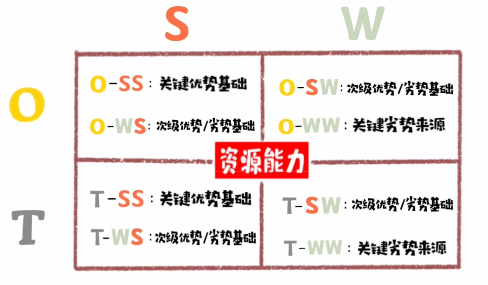

# 社会

## 塔西佗陷阱

“塔西佗陷阱” 是一个描述**公信力丧失后负面循环**的社会现象概念，核心是：当某一主体（如政府、企业、个人）的公信力严重受损时，无论其后续言行是好是坏、是真是假，都会被公众视为 “坏” 或 “假”，进而失去信任基础。

### 一、概念来源

源于古罗马历史学家**塔西佗**在《历史》一书中对罗马皇帝的评价：“一旦皇帝成了人们憎恨的对象，他做的好事和坏事就同样会引起人们对他的厌恶。”现代社会将这一观点延伸，形成 “塔西佗陷阱” 理论，广泛应用于政治、公共管理、品牌公关等领域。

### 二、核心特征

1. 前提：公信力已严重透支

   并非 “一次失信” 就触发，而是主体长期存在 “言行不一、欺骗公众、责任推诿” 等行为，导致公众信任基础彻底崩塌（如政府政策反复无常、企业多次虚假宣传）。

2. 表现：“好坏不分” 的负面归因

   - 主体做 “好事”：公众会解读为 “作秀”“掩盖之前的错误”“有潜在利益输送”（如企业捐款被质疑 “洗白负面”）；
   - 主体做 “坏事”：公众会放大负面评价，认为 “果然如此”“早有预料”，甚至引发群体情绪化批判（如政府某项目失误，被关联到 “长期不作为”）。

3. 结果：陷入信任死循环

   公众对主体的信息失去基本判断意愿，倾向于 “先否定，再找证据”，导致主体后续的沟通、决策难以被接受，进一步加剧信任裂痕。

### 三、典型案例（不同领域）

| 领域     | 案例场景                                                     | 公众反应（塔西佗陷阱表现）                                   |
| -------- | ------------------------------------------------------------ | ------------------------------------------------------------ |
| 公共管理 | 某地政府多次承诺 “解决民生问题”（如交通拥堵、教育资源），但长期未落实。 | 后来政府推出 “公交优化方案”，公众普遍质疑 “只是表面功夫，根本不解决核心问题”，甚至抵制方案。 |
| 企业品牌 | 某奶粉企业曾发生 “质量造假” 事件，虽后续加强品控并公开检测报告。 | 消费者仍认为 “报告是伪造的”“企业本性难改”，即使产品合格，也不愿购买。 |
| 个人 IP  | 某网红长期 “人设造假”（如虚假学历、摆拍公益），被曝光后道歉并参与真实公益。 | 网友评论 “假惺惺，为了流量装好人”“之前的错怎么洗都没用”，信任无法重建。 |

### 四、危害与破局关键

#### 1. 核心危害

- 对公共领域：政府政策执行成本上升（如需额外投入资源解释、推广），甚至引发社会信任危机；
- 对商业领域：品牌形象不可逆受损，市场份额流失（如上述奶粉企业可能被永久淘汰）；
- 对个人：失去社会认同，难以在行业或社交圈立足。

#### 2. 破局关键：重建公信力（无捷径，需长期行动）

- **言行一致是基础**：承诺必须兑现，避免 “画大饼”（如政府需建立 “承诺 - 落实 - 反馈” 机制，企业需将品控纳入核心流程）；
- **透明沟通减疑虑**：出现问题时主动公开信息，不隐瞒、不推诿（如企业负面事件后，及时公布调查过程和整改措施，而非 “沉默或狡辩”）；
- **长期行动积信任**：通过持续的正向行为（如政府长期解决民生问题、企业坚持社会责任），逐步修复公众认知，打破 “负面归因” 惯性。

### 总结

“塔西佗陷阱” 的本质是 **“信任崩塌后的恶性循环”**，它提醒所有需要公众信任的主体：公信力是 “易碎品”，一旦失去，重建成本远高于维护成本。无论是政府、企业还是个人，都需以 “长期诚信” 为核心，避免陷入这一陷阱。

---

## 破窗效应

破窗效应（Broken Windows Theory）是由美国政治学家詹姆斯・威尔逊（James Q. Wilson）和犯罪学家乔治・凯林（George L. Kelling）提出的社会心理学理论，核心定义是：**环境中的不良现象（如 “破窗”）若被放任不管，会向外界传递 “无序可接受” 的信号，进而引发更多人模仿不良行为，最终导致混乱扩散、问题恶化**。其本质是 “**无序的传染性**”—— 小的负面信号会逐渐放大，让原本有序的环境陷入恶性循环。

### 一、效应起源：经典的 "破窗实验" 与理论提出

破窗效应的理论灵感源于对 “环境与行为” 关系的观察，后续实验进一步验证了其合理性：

1. **理论提出（1982 年）**：威尔逊和凯林在论文中提出：若一栋建筑的一扇窗户被打破后未及时修复，其他窗户很快也会被人为打破 —— 因为 “破窗” 暗示 “这里无人管理，破坏行为不会被追究”；同理，街道上若有一片垃圾未清理，很快会堆积更多垃圾，甚至引发涂鸦、盗窃等更严重问题。
2. **实证验证（1996 年）**：心理学家菲利普・津巴多（Philip Zimbardo）做了一项实验：将两辆完全相同的汽车分别停在 “秩序良好的中产阶级社区” 和 “混乱的贫民区”。贫民区的汽车当天就被拆走零件，而中产阶级社区的汽车起初完好；但当实验者故意打破中产阶级社区汽车的一扇窗户后，仅几小时内，这辆车也被彻底破坏。

### 二、核心机制：为什么 "小破窗" 会引发 "大混乱"？

破窗效应的发生并非偶然，而是由 “信号暗示、责任分散、模仿强化” 三个层层递进的机制推动，最终导致无序扩散：

1. **机制 1：无序信号的暗示作用**未被修复的 “破窗”（如垃圾、涂鸦、未处理的违规行为）会向外界传递 “这里缺乏规则约束，不良行为无代价” 的信号。例如：
   - 办公室里若有人长期迟到未被提醒，其他人会默认 “迟到没关系”，逐渐也开始迟到；
   - 公共场所的墙壁若出现第一处涂鸦未清理，很快会布满更多涂鸦，因为人们觉得 “别人都画了，我画也没事”。
2. **机制 2：责任分散的心理弱化**当环境出现 “小无序” 时，个体的 “责任感知” 会降低 —— 认为 “不是我一个人造成的，即使我参与，也不会被单独追责”。例如：
   - 街道上有一片垃圾时，路过的人可能会想 “已经有垃圾了，多扔一点也无所谓”，而非主动捡起；
   - 网络评论区若有几条负面谩骂未被删除，其他网友会觉得 “骂几句也不会被管”，导致骂战升级。
3. **机制 3：模仿行为的强化循环**当少数人因 “无序信号” 和 “责任分散” 做出不良行为后，会引发更多人的模仿，形成 “无序→模仿→更无序” 的恶性循环。例如：
   - 小区里有人先在绿化带种菜，未被制止，其他居民会模仿着也种菜，最终绿化带变成 “菜园”；
   - 公司里有人先在工作时间刷短视频，未被管理，其他人会逐渐模仿，导致整体工作效率下降。

### 三、典型应用场景：从社会到个人的 "破窗" 现象

破窗效应广泛存在于社会管理、职场、校园、个人习惯等多个场景，以下是高频案例，帮你快速识别 “破窗信号”：

**1. 社会与公共管理场景（最典型）**

- **社区环境恶化**：某小区一楼阳台外出现第一堆建筑垃圾未清理→很快其他居民也开始堆放杂物→最终楼道、绿化带被垃圾占据，甚至引发邻里纠纷；
- **交通规则失效**：某路口有人先闯红灯未被处罚→更多人跟着闯红灯→“凑一拨就走” 成为常态，交通秩序混乱；
- **公共设施破坏**：公园的长椅被人拆走一块木板未修复→有人故意拆更多木板→最终长椅彻底损坏，无法使用。

**2. 职场场景**

- **工作纪律松散**：某员工上班时间频繁网购未被提醒→其他员工开始模仿刷短视频、聊私活→整体工作氛围懒散，效率下降；
- **流程规范失效**：某项目因 “紧急情况” 未走审批流程就推进→后续项目纷纷效仿 “先做再补流程”→最终审批制度形同虚设，出现风险无人负责；
- **团队沟通低效**：会议中有人频繁打断他人发言未被制止→更多人开始抢话、跑题→会议从 “解决问题” 变成 “闲聊”，浪费时间。

**3. 校园场景**

- **学风涣散**：课堂上有人先玩手机未被老师提醒→其他同学纷纷模仿→上课变成 “低头看手机”，听课效率骤降；
- **校园环境杂乱**：教学楼走廊有一张废纸未被捡起→很快出现更多垃圾→学生习惯随手扔垃圾，保洁压力增大；
- **规则意识薄弱**：有人翻越校园围栏外出未被处罚→更多人模仿翻越→围栏失去 “防护作用”，甚至引发安全事故。

**4. 个人习惯场景（微观层面）**

- **作息混乱**：某天因熬夜故意 “晚起 1 小时”→第二天觉得 “晚起也没事”，继续熬夜→最终作息彻底颠倒，影响健康；
- **学习 / 工作拖延**：计划今天完成的报告，先 “拖延 1 小时刷手机”→明天继续拖延→最终报告赶工完成，质量下降；
- **生活环境杂乱**：书桌上先放一件脏衣服未收拾→很快堆满更多杂物→房间变成 “乱堆房”，整理时需花费更多时间。

### 四、应对策略：如何 “修复第一块破窗”，阻止无序扩散？

破窗效应的核心是 “防微杜渐”—— 及时处理 “第一块破窗”，切断无序扩散的链条，具体可从 3 个层面入手：

**1. 环境层面：及时修复 “可见的破窗”，传递 “有序信号”**

- 快速处理小问题

  ：发现 “第一块破窗”（如垃圾、涂鸦、违规行为）时，立即处理，不拖延。例如：

  - 社区发现第一堆垃圾，当天安排清理；
  - 职场发现第一个迟到的员工，及时提醒规则；
  - 个人发现作息开始混乱，当天调整早睡 1 小时。

- 强化环境秩序感

  ：通过环境设计或规则标识，传递 “有序” 信号，减少 “破窗” 发生的可能。例如：

  - 公共场所设置 “垃圾分类投放点” 并明确标识；
  - 办公室张贴 “工作时间纪律” 提醒；
  - 个人书桌划分 “工作区” 和 “休闲区”，避免杂乱。

**2. 规则层面：明确约束机制，避免 “责任分散”**

- 建立清晰规则

  ：提前明确 “什么行为不可接受” 及 “违规后果”，让所有人知道 “破窗会被追责”。例如：

  - 公司制定《考勤制度》，明确 “迟到 3 次扣绩效”；
  - 校园制定《课堂纪律》，明确 “玩手机会被没收”；
  - 个人制定《每日计划》，明确 “拖延任务会取消娱乐时间”。

- 严格执行规则，不搞 “例外”

  ：规则一旦建立，需对所有人一视同仁，避免 “特殊情况” 破坏规则权威性。例如：

  - 即使是 “老员工” 迟到，也需按制度处理；
  - 即使是 “紧急项目”，也需走简化审批流程，而非完全跳过。

**3. 行为层面：主动 “正向引导”，打破模仿循环**

- 鼓励正向行为，替代不良模仿：当出现 “有序行为” 时，及时鼓励，让其成为 “榜样”，抵消 “破窗信号”。例如：
  - 社区表彰 “主动清理垃圾的居民”，带动更多人参与；
  - 职场表扬 “按时完成任务的员工”，树立效率榜样；
  - 个人记录 “按时作息的天数”，用成就感强化正向习惯。
- 个体主动 “补窗”，不参与无序：即使环境中出现 “小破窗”，个体也需坚守规则，不跟风模仿，甚至主动修复。例如：
  - 看到街道有垃圾，主动捡起（而非乱扔）；
  - 会议中有人打断发言，主动提醒 “先听他人说完”；
  - 自己想拖延时，立即启动 “5 分钟行动法”（先做 5 分钟，避免彻底拖延）。

### 五、常见误区：别让 “小破窗” 变成 “大问题”

1. **误区 1：“小问题没关系，不用管”**
   - 错误认知：认为 “一扇破窗而已，修复太麻烦，等多了再一起处理”；
   - 后果：小问题逐渐扩散，最终变成 “大混乱”，修复成本大幅增加（如 “一片垃圾” 变成 “一堆垃圾”，清理时间从 10 分钟变成 2 小时）；
   - 正确做法：“小题大做”，第一时间处理小问题，避免扩散。
2. **误区 2：“别人都这样，我也这样没关系”**
   - 错误认知：看到他人 “破窗行为”（如闯红灯、拖延），觉得 “大家都做，我做也没事”；
   - 后果：个体行为加入 “无序循环”，既损害集体环境，也让自己养成不良习惯；
   - 正确做法：用 “元认知” 觉察模仿心理，坚守规则，不被环境中的 “破窗信号” 影响。

### 六、总结

破窗效应的核心启示是：**“细节决定秩序，微小的无序会引发巨大的混乱”**。无论是管理一个社区、一个团队，还是经营自己的生活，关键都在于 “警惕第一块破窗”—— 及时修复小问题，明确规则边界，主动坚守秩序。

记住：阻止混乱的成本，永远低于修复混乱的成本；而维护秩序的核心，就是从 “不忽视每一个小问题” 开始。

---

## 马太效应

马太效应（Matthew Effect）是描述 “**优势累积**” 的社会规律，核心定义是：**已拥有优势的个体或群体，会通过资源、机会、光环等因素的叠加，获得更多优势；而缺乏优势的个体或群体，会因资源匮乏、机会缺失，进一步陷入劣势**，最终形成 “富者愈富，贫者愈贫” 的两极分化。其本质是 “**初始微小差异，通过累积效应放大为巨大差距**”，广泛存在于经济、教育、职场、互联网等多个领域。

### 一、效应起源：从 《圣经》到社会科学

“马太效应” 的名称源于《圣经・新约・马太福音》中的寓言，后被社会学家引入学术研究，形成系统理论：

1. **寓言起源**：书中提到 “凡有的，还要加给他，叫他有余；凡没有的，连他所有的，也要夺去”—— 即 “拥有者会获得更多，缺失者会失去仅剩的”，这是 “马太效应” 的核心隐喻。
2. **学术定义**：1968 年，美国社会学家罗伯特・莫顿（Robert K. Merton）首次将这一现象正式命名为 “马太效应”，最初用于描述 “科学领域的资源分配不公”：知名科学家（已有优势）更容易获得科研经费、发表核心论文、获得荣誉；而年轻学者（缺乏优势）则难以获得资源，即使成果优秀也易被忽视。

### 二、核心机制：优势如何 “滚雪球”？

马太效应的本质是 “**初始优势→资源获取→新优势→更多资源**” 的循环，具体通过 3 个关键机制实现，最终放大差距：

| 机制类型            | 核心逻辑                                                     | 通俗示例（以 “职场发展” 为例）                               |
| ------------------- | ------------------------------------------------------------ | ------------------------------------------------------------ |
| **1. 资源累积机制** | 已拥有优势的个体 / 群体，能优先获取稀缺资源，而资源又会转化为新的优势 | - 优势者（资深员工）：因经验丰富，优先获得核心项目（资源），项目成功后晋升更快（新优势），进而获得更高薪资、更多人脉（更多资源）；- 劣势者（新人）：只能做边缘任务（资源少），缺乏成长机会，晋升慢（优势更弱），长期停留在基础岗位。 |
| **2. 光环效应叠加** | 优势者的 “成功标签” 会形成光环，让外界自动赋予其更多信任、机会，忽略其不足；劣势者则因 “弱势标签” 被低估 | - 优势者（知名企业高管）：即使跳槽，也会因 “知名企业背景”（光环）被高薪聘请，甚至获得股权（额外机会）；- 劣势者（小公司员工）：即使能力强，也可能因 “公司知名度低”（弱势标签）被 HR 忽视，面试机会少。 |
| **3. 门槛壁垒机制** | 优势者通过资源、经验构建 “进入壁垒”，让劣势者难以进入优质领域，进一步巩固自身优势 | - 优势者（头部互联网公司）：掌握大量用户数据（资源），能开发更精准的产品（新优势），形成用户粘性，让小公司（劣势者）因缺乏数据难以竞争；- 劣势者（小品牌）：因用户少、资金不足，无法投入研发，只能在低价市场挣扎，难以进入高端领域。 |

### 三、典型应用场景：从经济到日常的 “两极分化”

马太效应并非抽象理论，而是在多个领域真实存在的现象，以下是高频场景示例，帮你快速识别：

**1. 经济与财富领域（最典型）**

- **财富差距扩大**：富人（优势者）拥有资本（如股票、房产），资本通过增值（如股价上涨、房租收入）自动产生更多财富；穷人（劣势者）收入仅够维持生活，无多余资本投资，只能靠体力劳动赚钱，长期下来财富差距越拉越大（如全球 Top 1% 的人群掌握的财富，超过底层 50% 人群的总和）。
- **企业竞争**：头部企业（如苹果、华为）拥有技术、品牌、供应链优势，能通过规模效应降低成本，推出更优质产品；中小企业因资金、技术不足，只能低价竞争，利润微薄，甚至被头部企业挤压倒闭（如手机行业，头部品牌占据 80% 以上的市场份额）。

**2. 教育领域**

- **优质资源集中**：重点学校（优势者）拥有优秀教师、先进设备、优质生源（资源），升学率高（新优势），吸引更多优质生源和政策扶持（更多资源）；普通学校（劣势者）因师资薄弱、生源一般，升学率低（优势弱），难以吸引资源，长期处于 “差学校→差生源→更差” 的循环。
- **学生发展**：成绩好的学生（优势者）会被老师优先关注，获得参加竞赛、重点培养的机会（资源），能力进一步提升；成绩差的学生（劣势者）易被忽视，缺乏学习信心，成绩更难提升（如班级里前 10 名的学生，获得 80% 的老师提问机会）。

**3. 职场与个人发展**

- **能力与机会**：能力强的员工（优势者）会被分配核心任务，任务成功后获得晋升、培训机会（资源），能力进一步提升；能力弱的员工（劣势者）只能做边缘工作，缺乏成长，长期无法突破（如 “优秀的人越来越优秀，平庸的人越来越平庸”）。
- **人脉资源**：职场资深人士（优势者）因职位高、资源多，能接触到行业大佬（高端人脉），人脉又能带来更多合作机会；职场新人（劣势者）人脉有限，只能接触同级别同事，难以获得高端机会。

**4. 互联网与流量领域**

- **平台流量分配**：头部平台（如抖音、淘宝）拥有海量用户（优势），能吸引更多商家、创作者入驻（资源），内容 / 商品更丰富，进一步留住用户；小众平台（劣势者）因用户少，商家 / 创作者不愿入驻，内容匮乏，用户流失，最终被淘汰（如短视频领域，Top 3 平台占据 90% 以上的流量）。
- **创作者收益**：知名博主（优势者）因粉丝多，广告报价高、带货佣金高（资源），能投入更多资金制作优质内容（新优势）；新人博主（劣势者）粉丝少，收益低，无法投入创作，内容质量差，粉丝增长慢。

### 四、马太效应的影响：正向激励与负面风险

马太效应并非 “完全负面”，其影响具有两面性，需辩证看待：

**1. 正向影响：激励个体突破 “初始劣势”**

- **推动进步**：马太效应让 “初始优势” 转化为长期优势，激励个体 / 群体在初期主动积累优势（如学生努力学习争取好成绩，获得更多机会）；
- **提高效率**：资源向优势者集中（如优质项目交给资深员工），能减少资源浪费，提升整体效率（如资深员工做核心项目的成功率，远高于新人）。

**2. 负面影响：加剧两极分化，引发公平问题**

- **机会垄断**：优势者长期占据资源、机会，劣势者即使努力也难以突破（如贫困家庭的孩子，因教育资源不足，难以考上名校，长期处于社会底层）；
- **创新抑制**：头部企业通过壁垒挤压中小创新企业（如通过低价倾销、专利诉讼阻止新企业进入），导致行业创新活力下降。

### 五、应对策略：个体如何 “借势”，社会如何 “平衡”

马太效应的核心是 “优势累积”，个体可通过 “主动构建初始优势” 借势发展，社会可通过政策调节缓解两极分化：

**1. 个体层面：抓住 “初始优势窗口”，打破弱势循环**

- **聚焦 “单点突破”，构建初始优势**：在初期选择一个细分领域，集中精力做到 “局部领先”（如新人在职场中，专注提升 “Excel 数据处理” 能力，成为团队中的 “数据专家”），用单点优势获取资源（如被分配数据相关任务），再转化为更多优势；
- **借势 “优质平台”，加速优势累积**：主动进入能提供资源的平台（如加入头部企业、优质学校），利用平台资源（如培训、人脉）快速提升自己（如新人进入大厂，即使做基础工作，也能接触到先进的技术、管理经验）；
- **警惕 “弱势标签”，主动争取机会**：劣势者需主动打破 “被低估” 的标签（如新人主动向领导申请参与核心项目，用成果证明能力），避免因 “不敢争取” 陷入弱势循环。

**2. 社会层面：通过政策调节，降低 “壁垒”，保障公平**

- **资源倾斜：向劣势群体提供基础资源**：如政府向贫困地区投入教育经费（建设学校、派遣优秀教师），缩小教育差距；向中小微企业提供低息贷款、税收优惠，帮助其突破资金壁垒；
- **规则优化：打破垄断，保障机会公平**：如出台《反垄断法》，限制头部企业的垄断行为（如禁止低价倾销、强制商家 “二选一”）；职场中推行 “盲选” 招聘（隐藏候选人背景信息），避免因 “弱势标签” 被歧视；
- **兜底保障：为劣势群体提供 “安全网”**：如建立社会保障体系（低保、医保），避免贫困家庭因疾病、失业陷入 “绝对贫困”；推行 “职业技能培训”，帮助低技能劳动者提升能力，获得更好的工作机会。

### 六、总结

马太效应的核心启示是：**“初始微小的差异，会通过资源累积、光环叠加、壁垒构建，逐渐放大为巨大差距”**。对个体而言，关键是 “在初期主动构建哪怕一个微小的优势”（如一项技能、一个优质平台），用它撬动更多资源，形成正向循环；对社会而言，需通过政策调节平衡公平与效率，避免 “强者恒强，弱者永弱” 的极端分化。

记住：马太效应不是 “宿命”—— 个体可以通过主动突破改变弱势地位，社会可以通过规则优化保障机会公平。

---

## 熵增定理

熵增定律（Law of Entropy Increase）是**热力学第二定律的核心表述**，也是宇宙的基本规律之一。其核心定义是：**在没有外界能量输入的 “孤立系统” 中，系统的 “混乱度”（即 “熵”）会随时间不断增加，最终趋向于最大无序状态，且这个过程不可逆**。简单说，就是 “事物会自然走向混乱，维持有序需要主动投入能量”—— 比如房间不收拾会变乱，热水会自然变凉，都是熵增的体现。

### 一、核心概念拆解：先搞懂 "熵" 和 "孤立系统"

要理解熵增定律，必须明确两个关键术语，否则容易陷入抽象误区：

**1. 熵（Entropy）：衡量 “混乱度” 的物理量**

“熵” 不是具体的 “东西”，而是描述系统 “无序程度” 的指标 ——**熵值越高，系统越混乱；熵值越低，系统越有序**。

- 例子：
  - 有序状态（低熵）：整齐叠放的衣服、密封在冰块里的水分子（规则排列）、未扩散的墨滴（集中在水杯一角）；
  - 无序状态（高熵）：散落一地的衣服、融化后自由流动的水、均匀扩散在水杯里的墨水。

**2. 孤立系统：熵增的前提条件**

熵增定律的关键前提是 “**孤立系统**”—— 指与外界完全隔绝，没有能量、物质交换的系统（比如一个完全密封、不吸热不散热的盒子）。

- 非孤立系统（开放系统）：可以与外界交换能量 / 物质（比如 “有人收拾的房间”“正在充电的手机”），这类系统可以通过外界输入能量 “降低自身熵”（维持有序）；
- 注意：**整个宇宙是目前人类认知中唯一的 “孤立系统”**—— 宇宙没有外界，因此总熵会持续增加，最终可能走向 “热寂”（所有能量均匀分布，没有温差，无法再做功，一切归于无序）。

### 二、熵增的本质：为什么 "混乱是自然趋势"？

熵增不是 “外力推动” 的结果，而是 “微观粒子运动的随机性” 导致的必然 —— 系统的 “有序状态” 是 “特殊、偶然的”，而 “无序状态” 是 “普遍、必然的”。用 “墨水滴入水杯” 举例：

1. 初始状态（低熵）：墨滴集中在一角，这是 “少数特定的分子排列方式”（所有墨水分子刚好聚集在一个小区域）；
2. 自然扩散（熵增）：墨水分子会随机运动，逐渐扩散到整个水杯 —— 这是 “绝大多数分子排列方式”（分子分散在水杯各处的可能性，远大于集中在一角）；
3. 不可逆性：扩散后的墨水无法 “自动回到集中状态”—— 因为 “分子随机运动回原位” 的概率极低，低到几乎不可能发生（这就是熵增的 “不可逆性”）。

简言之，熵增是 “概率的必然”：**有序是小概率事件，无序是大概率事件，事物会自然向大概率的无序状态发展**。

### 三、常见误区：熵增不是 "绝对无序"，开发系统可 "对抗熵增"

很多人误解 “熵增 = 所有事物都会变乱”，但忽略了 “开放系统可以通过外界能量输入，降低自身熵（维持有序）”—— 这也是生命、人类社会能维持有序的核心原因：

| 系统类型 | 熵增趋势                                                     | 例子与原理                                                   |
| -------- | ------------------------------------------------------------ | ------------------------------------------------------------ |
| 孤立系统 | 熵必然增加，不可逆                                           | 密封盒子里的冰块会融化（无序），热水会变凉（能量均匀分布）—— 没有外界能量输入，只能走向混乱； |
| 开放系统 | 可通过外界能量输入，实现 “局部熵减”（自身有序），但 “整体熵仍增” | 1. 生命：人通过 “吃饭（输入化学能）、呼吸（输入能量）” 维持身体有序（比如细胞分裂、器官运转），但人会产生热量、排泄物，这些会增加外界的熵，整体（人 + 环境）熵仍在增；2. 社会：企业通过 “投入资金、人力（外界能量）” 建立管理制度（维持组织有序），但运营中会消耗资源、产生垃圾，整体熵仍增；3. 个人：房间通过 “投入时间收拾（外界能量）” 变整齐（局部熵减），但收拾过程会消耗人的体力（转化为热量），整体熵仍增。 |

**关键结论**：熵增定律不禁止 “局部有序”，但要求 “局部有序的代价是整体无序的增加”—— 维持任何有序系统，都需要外界输入能量，且这个过程会让更大范围的熵增加。

### 四、熵增定律的应用：从宇宙到日常生活的底层逻辑

熵增定律看似是物理规律，实则能解释生活、管理、个人成长中的很多现象，核心是 “理解‘无序是自然趋势，有序需要主动做功’”：

**1. 生活场景：为什么 “维持有序需要费力”？**

- 房间不收拾会变乱（熵增），收拾需要花时间（输入能量）；
- 手机不清理会变卡（缓存、垃圾文件堆积，熵增），清理需要手动删除或用软件（输入能量）；
- 人际关系不维护会变淡（联系减少，互动无序，熵增），维持需要主动聊天、见面（输入时间 / 精力）。

**2. 管理场景：企业为什么需要 “制度和执行力”？**

企业是 “开放系统”，但如果没有外界能量（制度、人力、资金）输入，会自然走向混乱（熵增）：

- 部门沟通会逐渐低效（信息不对称增加，熵增），需要建立 “周报制度、跨部门会议”（输入管理能量）维持有序；
- 员工效率会逐渐下降（惰性导致行为无序，熵增），需要建立 “绩效考核、激励机制”（输入激励能量）提升效率；
- 产品会逐渐落后（技术迭代慢，功能无序，熵增），需要投入 “研发资金、创新团队”（输入技术能量）保持竞争力。

**3. 个人成长：为什么 “自律是对抗熵增的核心”？**

个人成长的本质是 “维持自身认知、行为的有序（低熵）”，而自然趋势是 “认知退化、行为懒散（熵增）”：

- 知识不学习会遗忘（认知无序，熵增），需要主动读书、实践（输入认知能量）维持或提升认知；
- 身体不锻炼会变弱（机能无序，熵增），需要主动运动、控制饮食（输入生理能量）维持健康；
- 目标不规划会混乱（行动无序，熵增），需要主动制定计划、拆解任务（输入决策能量）推进目标。

### 五、如何对抗熵增：3 个核心原则（适用于生活、管理、个人）

对抗熵增的本质是 “成为‘开放系统’，主动从外界输入能量，维持自身有序”，具体可遵循 3 个原则：

**1. 主动输入能量：用 “持续做功” 抵消自然混乱**

- 生活：定期收拾房间（每周 1 次）、清理手机（每天 10 分钟），用固定时间投入能量，避免混乱积累；
- 管理：企业定期优化制度（每季度 1 次）、组织培训（每月 1 次），用持续的管理动作维持组织有序；
- 个人：每天固定时间学习（1 小时）、运动（30 分钟），用 “微小但持续的能量输入”，避免认知、身体的熵增。

**2. 建立 “反馈机制”：及时修正偏离有序的趋势**

熵增是 “渐进的”，早期混乱不明显，若不及时修正，会加速走向无序。建立反馈机制，能在 “小混乱” 阶段介入：

- 生活：用 “房间整洁度检查表”（每周对照），发现物品散落及时归位，避免堆积；
- 管理：用 “部门效率周报”（每周统计），发现沟通卡点及时调整流程，避免低效扩散；
- 个人：用 “每日复盘”（每晚 5 分钟），发现当天拖延、分心及时调整，避免习惯退化。

**3. 简化系统：减少 “不必要的混乱源”**

系统越复杂，可能产生的混乱越多（熵增速度越快）。简化系统，能降低维持有序的能量消耗：

- 生活：减少不必要的物品（断舍离），物品越少，收拾的能量投入越少；
- 管理：减少冗余的流程（如不必要的审批环节），流程越简单，维持效率的能量投入越少；
- 个人：减少无关的目标（如同时学 5 个技能），目标越聚焦，维持行动有序的能量投入越少。

### 六、总结

熵增定律的本质不是 “让人接受‘一切会变糟’”，而是揭示 “**维持有序需要主动付出**”—— 小到个人的房间、健康、认知，大到企业的管理、社会的运转，甚至生命的存在，本质都是 “对抗熵增的过程”。

这个定律给我们的核心启示是：**“无序是自然的，有序是需要努力的”**—— 不要期待 “事情会自动变好”，房间会自动整齐，知识会自动记住，工作会自动高效；相反，要主动投入能量（时间、精力、资源），用持续的行动对抗熵增，才能维持自己想要的有序状态。

---

## 羊群效应

羊群效应（Herd Effect），又称 “从众效应”，是指**个体在群体行为的影响下，放弃自身独立判断，盲目跟从群体决策或行为的现象**—— 如同羊群跟随头羊行动，个体缺乏自主思考，仅以 “多数人怎么做” 作为自身行为的依据。其核心本质是 “**非理性的群体趋同**”，而非基于客观信息或自身需求的理性选择。

### **一、典型案例：从生活到商业的羊群效应场景**

羊群效应广泛存在于经济、消费、职场、社会等多个领域，以下为最具代表性的场景示例，帮你快速理解其表现形式：

**1. 经济与投资领域（最典型）**

- **股市 “追涨杀跌”**：当某只股票价格短期快速上涨时，大量投资者看到 “别人赚钱” 便盲目跟风买入，不研究公司基本面（如盈利状况、行业前景）；一旦股价下跌，又跟着其他人恐慌抛售，导致股价大幅波动（如 2021 年部分 “妖股” 的短期暴涨暴跌，本质是散户跟风炒作）。
- **加密货币跟风投资**：2022 年某加密货币因 “网红推荐” 热度上升，大量投资者不了解其底层技术，仅因 “身边人都在买” 便入场，最终因项目崩盘导致亏损。

**2. 消费领域**

- **网红产品 “排队抢购”**：某网红奶茶店、面包店通过营销营造 “热销” 氛围，大量消费者看到 “排长队” 便跟风排队，甚至不清楚产品口味是否符合自己需求（如曾出现的 “天价雪糕”“限量潮玩”，部分消费者跟风购买仅为 “打卡炫耀”）。
- **盲目追求品牌或潮流**：年轻人看到同龄人购买某品牌球鞋、奢侈品包，便不顾自身经济能力跟风消费，导致 “超前消费” 或 “买完即闲置”（如部分学生为买新款手机省吃俭用）。

**3. 职场与决策领域**

- **会议 “从众表态”**：团队讨论项目方案时，若领导或多数同事先表态支持某一方案，即使少数人有不同意见，也可能因 “怕被孤立”“不愿得罪人” 而选择沉默或跟风赞同，导致决策缺乏多元思考（如某公司因 “全员跟风支持” 而盲目扩张，最终因市场不匹配失败）。
- **职业选择 “扎堆”**：近年 “考公热”“考研热”“直播带货热” 中，部分人不结合自身兴趣、能力，仅因 “大家都在做” 便跟风选择，导致 “考公多次失败”“考研后迷茫”“直播没流量被迫放弃”。

**4. 社会与舆论领域**

- **网络谣言 “跟风传播”**：某条不实信息（如 “某食品致癌”“某事件不实细节”）在社交平台传播时，大量用户不验证信息真实性，仅因 “转发量高”“身边人都在说” 便跟风转发，导致谣言扩散（如疫情期间的 “不实防疫政策” 谣言）。
- **社会行为 “从众模仿”**：如过马路时，若有几人闯红灯，其他人可能会跟着闯红灯（“法不责众” 心理）；反之，若大家都遵守交通规则，少数人也会收敛违规想法。

### 二、羊群效应的产生原因：为什么人会 “盲目跟风”？

羊群效应的本质是个体在 “信息不足” 或 “心理压力” 下的理性选择缺失，核心原因可归纳为 4 点：

**1. 信息不对称：“别人的选择可能是对的”**

个体在面对陌生领域（如投资、新消费场景）时，缺乏足够的信息和判断能力，会默认 “多数人的选择 = 正确选择”—— 认为 “大家都做，肯定有道理”，从而放弃独立调研（如投资新手不看财报，仅跟着 “股神” 或身边人买股票）。

**2. 从众心理：“不想被群体孤立”**

人是社会性动物，天生有 “融入群体” 的需求。当个体行为与群体不一致时，会产生 “焦虑感”“被排斥感”，为避免这种心理压力，会主动调整行为以匹配群体（如职场中，多数同事支持某方案，少数人即使有异议也会沉默，避免 “被视为异类”）。

**3. 责任分散：“就算错了，也不是我一个人的问题”**

当群体共同决策时，个体的 “责任感知” 会降低 —— 认为 “即使决策失误，后果由群体承担，自己不用负主要责任”，从而降低对决策的谨慎程度（如跟风闯红灯时，会觉得 “就算被抓，也不是只抓我一个”）。

**4. 权威或意见领袖的引导：“跟着‘厉害的人’走不会错”**

当群体中存在权威（如领导、专家）或意见领袖（如网红、KOL）时，个体容易受其影响，将其行为视为 “正确标杆”，进而跟风（如某网红推荐某款产品，粉丝会默认 “网红用过好，我用也会好”，不考虑自身需求差异）。

### 三、羊群效应的影响：正面与负面的辩证看待

羊群效应并非 “完全负面”，其影响需结合场景判断，既有可能推动积极行为，也可能引发风险：

**1. 正面影响：加速积极行为的扩散**

- **公益行动的推广**：如 “水滴筹” 等公益平台，当多数人参与捐款时，会带动更多人跟风捐款，帮助困难群体快速筹集资金；
- **社会规范的形成**：如 “垃圾分类”“绿色出行” 等环保行为，若多数人践行，少数人会跟风参与，推动社会整体文明程度提升；
- **效率提升**：在信息极度缺乏的紧急场景（如地震逃生），跟着多数人向安全出口跑，比独自寻找路径更高效。

**2. 负面影响：引发非理性风险与资源浪费**

- **经济风险**：如股市跟风炒作导致 “泡沫破裂”（如 2008 年金融危机前的房地产跟风投资）、加密货币崩盘导致投资者亏损；
- **消费浪费**：跟风购买的网红产品、潮流商品，多数因 “不适合自己” 被闲置（如限量潮玩、网红家电），造成金钱和资源浪费；
- **决策失误**：职场中 “从众决策” 会导致缺乏多元思考，错过更优方案（如某公司因全员跟风支持 “线下扩张”，忽视线上渠道，最终被竞争对手超越）；
- **社会秩序混乱**：如谣言跟风传播引发恐慌（如疫情期间的 “抢药潮”）、非理性行为扩散（如 riots 中的跟风破坏）。

### 四、应对策略：如何避免 “盲目跟风”，保持独立判断？

无论是投资、消费还是决策，避免羊群效应的核心是 “**建立自主判断能力**”，具体可从 4 点入手：

**1. 补充信息：不依赖 “群体信号”，主动调研**

面对陌生领域（如投资、新消费）时，先通过可靠渠道（如行业报告、专业书籍、官方数据）补充信息，而非直接跟风。例如：

- 投资前，研究公司财报、行业趋势，而非只看股价涨跌或他人推荐；
- 买网红产品前，查看真实用户评价（而非营销内容），判断是否符合自身需求（如口味、使用场景）。

**2. 明确自身目标：“我需要什么，而非别人有什么”**

做选择前，先问自己 “我的核心需求是什么？”“这个选择能帮我实现目标吗？”，而非被群体行为绑架。例如：

- 职业选择时，结合自身兴趣、能力规划（如 “我适合稳定工作，还是创新工作”），而非盲目跟风 “考公” 或 “直播”；
- 消费时，思考 “这个商品我真的会用吗？”（如 “买网红烤箱，我是否会经常烘焙”），避免 “为了跟风而买”。

**3. 警惕 “权威陷阱”：不迷信，多质疑**

面对权威或意见领袖的推荐，保持理性质疑 —— 思考 “他们的推荐是否有利益关联？”“他们的需求与我是否一致？”。例如：

- 网红推荐某款产品，先确认是否为 “广告合作”，而非默认 “网红自用款 = 好产品”；
- 职场中，领导提出方案时，若有不同意见，可基于数据和逻辑提出疑问（如 “这个方案的市场风险点在哪里？”），而非盲目赞同。

**4. 接受 “小众选择”：不怕 “和别人不一样”**

意识到 “群体选择≠最优选择”，接受自己的 “小众决策”—— 即使多数人不认同，只要符合自身需求和判断，就是合理的。例如：

- 别人都跟风买某品牌球鞋，你若觉得性价比低，可选择其他品牌；
- 会议中，若你认为某方案有风险，可基于数据提出反对意见，而非因 “少数人” 身份沉默。

### 总结

羊群效应是人性与社会环境共同作用的结果，它既可能推动积极行为，也可能引发非理性风险。核心启示是：**在群体中保持 “清醒”，不把 “多数人的选择” 当作唯一标准，而是基于信息、自身需求和逻辑做判断**。无论是投资、消费还是职场决策，“独立思考” 才是避免跟风陷阱、实现个人目标的关键。

---

# 生活

## 格瑞斯特定理

格瑞斯特定理是管理领域的经典定理，核心观点为：**“杰出的策略必须加上杰出的执行才能奏效”**，其本质是强调 “策略” 与 “执行” 的不可分割性 —— 缺乏执行的策略只是空想，没有策略指导的执行则是盲目行动。

### 一、核心内涵

1. **策略是方向，执行是落地**：策略解决 “做什么”“为什么做” 的问题（如企业制定 “开拓下沉市场” 的战略），执行则解决 “怎么做”“谁来做”“何时做” 的问题（如组建地推团队、制定渠道政策），二者缺一不可。
2. **执行对策略有 “修正作用”**：优秀的执行不是机械照搬策略，而是在落地中反馈真实问题（如下沉市场用户对价格敏感超出预期），反过来优化策略（如调整产品定价或推出入门款），形成 “策略 - 执行 - 反馈 - 优化” 的闭环。
3. **“平庸执行” 会毁掉 “杰出策略”**：即使策略逻辑完美（如某品牌计划通过 “内容营销破圈”），若执行中出现内容质量差、投放渠道错、团队配合低效等问题，最终结果也会远低于预期，甚至导致策略失败。

### 二、典型应用场景

- **企业管理**：某科技公司制定 “AI 产品商业化” 策略，若技术团队无法按时交付核心功能、销售团队不懂如何向客户讲解产品价值，策略便无法落地；只有技术、销售、运营团队协同执行，才能实现商业化目标。
- **个人目标**：个人制定 “3 个月瘦 10 斤” 的健康策略（策略），若仅规划饮食和运动计划，却不坚持每日执行（如偷吃零食、缺席运动），目标必然落空；只有将策略转化为 “每天吃低卡餐 + 30 分钟运动” 的具体行动，才能达成结果。

### 三、核心启示

格瑞斯特定理的关键价值在于打破 “重策略、轻执行” 的认知误区 —— 无论是组织还是个人，在关注 “方向是否正确” 的同时，更要聚焦 “行动是否到位”，将 “策略思维” 与 “执行力” 结合，才能实现目标。

---

## 边际效用递减效应

边际效用递减（Diminishing Marginal Utility）是**微观经济学的核心规律之一**，指在 “其他条件不变” 的前提下，当一个人连续消费某一商品或服务时，**每增加一单位消费所带来的新增满足感（即 “边际效用”）会逐渐减少，甚至最终变为负数**。其核心本质是 “**稀缺性与满足感的动态变化**”—— 初始消费解决 “最迫切需求”，后续消费的必要性逐渐降低，满足感自然递减。

### 一、核心概念拆解：先搞懂 “边际” 和 “效用”

要理解该规律，需先明确两个关键术语：

- **效用（Utility）**：指商品 / 服务给消费者带来的 “满足感、有用性”，是主观感受（如喝一杯奶茶的愉悦感、穿一件衣服的舒适感）。
- **边际（Marginal）**：指 “新增的、额外的”，即 “每多消费 1 单位商品所带来的变化”（如 “第 2 杯奶茶比第 1 杯多带来的满足感”）。

因此，“边际效用递减” 可通俗理解为：**越往后消费，“多吃一口、多买一件” 带来的快乐越少**。

### 二、直观案例：从 “喝奶茶” 看边际效用变化

用最常见的 “连续喝奶茶” 场景，可清晰呈现边际效用的递减过程（假设你很渴，且只喝同一款奶茶）：

| 消费数量（单位：杯） | 边际效用（新增满足感） | 总效用（累计满足感） | 场景描述                                   |
| -------------------- | ---------------------- | -------------------- | ------------------------------------------ |
| 第 1 杯              | 10（极高）             | 10                   | 很渴，喝第一杯时解渴又满足，愉悦感最强     |
| 第 2 杯              | 6（较高）              | 16                   | 解渴需求已满足，更多是享受口味，愉悦感下降 |
| 第 3 杯              | 2（较低）              | 18                   | 有点腻了，喝不喝都行，满足感大幅降低       |
| 第 4 杯              | -1（负数）             | 17                   | 喝了会恶心，不仅没满足感，还产生不适感     |

**关键结论**：

1. 边际效用从 “第 1 杯” 开始持续递减，直至变为负数；
2. 总效用先增加（边际效用为正时），当边际效用变为负数时，总效用开始下降（第 4 杯后总效用从 18 降至 17）。

### 三、边际效用递减的 3 个前提条件

该规律并非 “无条件成立”，需满足以下 3 个前提，否则可能失效：

1. **连续消费**：必须是 “不间断、短期内连续使用同一商品”。例如：今天喝 1 杯奶茶，明天再喝 1 杯，因间隔时间长，边际效用可能不会递减（甚至因想念而提升）。
2. **商品同质**：消费的商品需 “完全相同”（品牌、规格、体验一致）。例如：先喝奶茶、再喝果汁，因商品不同，无法用 “奶茶的边际效用” 衡量果汁的满足感。
3. **其他条件不变**：消费者的需求、偏好、环境无变化。例如：你原本不渴，突然运动后口渴，此时第 1 杯奶茶的边际效用会重新升高，打破之前的递减趋势。

### 四、实际应用场景：从消费到商业决策

边际效用递减不仅是 “解释现象的理论”，更是指导**消费决策、企业定价、资源分配**的实用工具：

**1. 个人消费决策：避免 “过度消费”**

- 理性控制购买量：如买水果时，不会因 “第 1 个苹果好吃” 就买 10 个（后续苹果的边际效用会递减，甚至腐烂浪费）；
- 多样化消费：如聚餐时点菜，会搭配不同菜品（若只吃一道菜，边际效用会快速递减，总满足感低；多样化可让每道菜的边际效用保持较高水平）。

**2. 企业产品与定价策略：提升用户总效用**

- **小包装产品**：如薯片推出 “迷你装”，避免消费者因 “一次吃不完、边际效用递减” 而放弃购买（对比：大包装薯片吃多了会腻，边际效用下降快）；
- **套餐组合**：如快餐店的 “汉堡 + 薯条 + 可乐” 套餐（单一吃汉堡，边际效用会递减；搭配薯条和可乐，不同商品的边际效用互补，总满足感更高）；
- **阶梯定价**：如水电费 “阶梯收费”—— 第 1 档（基础用量）价格低，第 2 档（超额用量）价格高（因 “基础用水用电” 的边际效用高，“超额用水用电” 的边际效用低，高价可引导理性消费）。

**3. 公共资源分配：优化资源利用效率**

- 政府分配救灾物资：如向灾区发放饮用水时，会优先满足 “每人基本需求”（第 1 瓶水的边际效用极高，关乎生存），而非集中分配给少数人（少数人拿到第 10 瓶水时，边际效用已极低，资源浪费）；
- 企业员工分工：如让员工专注 “核心工作”（第 1 小时工作的边际效用最高，产出效率高），避免长时间重复同一任务（工作 4 小时后，边际效用递减，出错率上升）。

**五、常见误区：边际效用递减≠“商品没用了”**

很多人会误解 “边际效用递减” 为 “商品变得没用”，实则不然：

- 边际效用递减是 “**新增满足感减少**”，而非 “总满足感消失”。例如：第 3 杯奶茶的边际效用（2）仍为正，说明喝了仍有满足感，只是比第 1 杯少；
- 只有当边际效用变为负数时，“消费才会产生负面影响”（如第 4 杯奶茶喝了恶心）。

**总结**

边际效用递减的核心启示是：**“适度” 比 “越多越好” 更重要**。无论是个人消费（不囤积、不贪多）、企业经营（小包装、多组合），还是公共决策（公平分配、避免浪费），都可通过该规律优化选择 —— 本质是 “让每一份资源都用在‘边际效用最高’的地方”，从而实现总满足感、总效率的最大化。

---

# 心理

## 霍金斯能量场

霍金斯能量场（Hawkins Energy Scale）是由美国心理学家大卫・R・霍金斯（David R. Hawkins）提出的一种意识能量层级理论。该理论认为，人类的情绪、思想和意识状态对应着不同的 “能量频率”，这些频率可以量化为 1 到 1000 的数值范围，形成一个从低到高的能量层级体系。这一理论在个人成长、心理学和灵性领域广为流传，但也引发了诸多争议。以下是其核心内容、争议与应用的全面解析：

### **一、核心理论框架**

霍金斯通过近 30 年的研究（主要采用肌肉测试法），将人类意识分为 17 个能量层级，核心观点包括：

1. **能量层级的划分**
   - **低能量层级（1-200）**：对应负面情绪，如羞愧（20）、内疚（30）、恐惧（100）、愤怒（150）等，会消耗生命能量，导致身心失衡。
   - **中性能量层级（200）**：以 “勇气” 为分界点，标志着从负能量向正能量的跨越。达到 200 层级后，个体开始主动面对挑战，免疫系统增强。
   - **高能量层级（200-1000）**：对应积极状态，如宽容（350）、爱（500）、喜悦（540）、平和（600），甚至开悟（700-1000）。这些状态被认为能提升生命质量，甚至影响周围环境。
2. **能量场的影响**
   - 能量层级越高，个体的心理韧性、创造力和健康水平越强。例如，“爱”（500）层级的人被描述为具有无条件的慈悲，而 “开悟”（700+）层级的人被认为能超越物质世界的限制。
   - 霍金斯声称，一个高能量层级的人可以抵消数千个低能量层级者的负面影响，强调环境和人际关系对能量场的交互作用。

### **二、争议与批评**

尽管霍金斯的理论在大众中广泛传播，但其科学性和方法论受到主流学术界的质疑：

1. **缺乏实证支持**
   - **肌肉测试的主观性**：霍金斯依赖的 “肌肉测试法”（通过按压手臂判断能量强弱）被科学界批评为缺乏标准化和可重复性。测试结果易受暗示、环境因素影响，无法满足科学验证的基本要求。
   - **数据透明度不足**：霍金斯声称的 “数百万笔数据” 未公开详细实验设计或同行评审，其能量数值的划分（如 “爱 = 500”）被认为是主观设定，缺乏客观依据。
2. **理论简化与标签化**
   - **情绪的二元对立**：将情绪简单划分为 “正能量” 和 “负能量”，忽视了情绪的复杂性和情境价值。例如，愤怒在某些情况下可能激发正义行动，而非单纯的破坏性。
   - **过度简化人性**：将人类意识压缩为单一的线性层级，忽略了文化、个体差异以及心理状态的动态变化。
3. **与科学体系脱节**
   - 霍金斯的 “能量” 概念与物理学中的能量定义截然不同，无法与神经科学、心理学的主流理论兼容。例如，其声称的 “能量频率” 无法通过现有仪器测量。

### **三、实践应用与启示**

尽管存在争议，霍金斯能量层级理论仍为个人成长提供了以下实用视角：

1. **自我觉察的工具**
   - 通过对照能量层级表，个体可识别主导情绪，意识到哪些状态在消耗能量（如长期恐惧），哪些在滋养能量（如宽容）。这种觉察是改变的第一步。
   - **示例**：若发现自己常处于 “愤怒”（150）层级，可通过深呼吸、冥想或环境调整（如远离冲突）提升至 “勇气”（200）。
2. **环境与人际关系的选择**
   - 霍金斯认为，能量具有传染性。与高能量层级的人交往（如乐观、积极的朋友）或接触高频环境（如自然、艺术），可帮助提升自身能量场。
   - **示例**：每天留出 30 分钟独处冥想，或阅读哲学书籍，被认为能增强心理韧性。
3. **情绪管理与健康关联**
   - 低能量层级与身心疾病相关。例如，长期恐惧（100）可能导致失眠、免疫力下降，而 “爱”（500）层级被认为能优化线粒体功能，延缓衰老。
   - **实践建议**：通过饮食调整（增加生鲜蔬果）、运动（如快走、跳舞）和语言重构（避免使用 “绝望” 等低频词汇），可改善能量状态。

### **四、科学视角下的审慎看待**

1. **情绪与健康的真实关联**
   - 科学研究表明，积极情绪确实与健康相关（如降低压力激素皮质醇、增强免疫力），但这是通过心理神经免疫学等机制实现的，与 “能量频率” 无关。
   - 负面情绪（如悲伤、愤怒）是人类正常反应，适度表达有助于心理健康，强行压抑反而可能加剧问题。
2. **理论的局限性**
   - 霍金斯的理论更多是一种哲学或灵性模型，而非科学理论。其 “能量层级” 无法通过实验验证，且缺乏跨文化普适性。
   - 过度依赖能量层级可能导致自我设限（如认为 “我处于低能量层级，无法改变”），或陷入对 “高频” 状态的盲目追求，忽视情绪的自然流动。

### **五、总结**

霍金斯能量场理论为理解人类意识提供了一个独特的隐喻框架，其核心价值在于**提醒人们关注情绪对生活的影响**，并通过主动选择积极状态来改善身心。然而，这一理论的科学性存疑，需以批判性思维审视：

- **可取之处**：强调自我觉察、积极心态和环境选择的重要性，与心理学中的 “正念”“积极心理学” 理念有相通之处。
- **争议点**：方法论不严谨、理论过度简化，可能误导对情绪和意识的理解。

最终，**理性运用其工具（如自我觉察），同时结合科学方法（如心理咨询、医学干预）**，或许是平衡灵性探索与现实生活的最佳路径。

---

## 垃圾定理

“垃圾定理” 并非单一明确的理论术语，它在不同领域有不同的指代和内涵。以下是几个常见的 “垃圾定理” 及其核心内容：

### 一、心理学领域：垃圾人定律（Garbage Truck Law）

**核心定义**：由美国作家大卫・波莱（David J. Pollay）在《垃圾车法则》中提出，指某些人如同 “垃圾车”，长期积累愤怒、挫败、失望等负面情绪，一旦超载就会随机倾倒在他人身上。

**核心启示**：

- **不纠缠**：避免与满身负能量的人争执，因为他们的行为源于自身问题，而非针对你。例如，路上遇到无理挑衅的司机，一笑而过比争吵更明智。
- **不内耗**：不要因他人的负面情绪自我怀疑或陷入精神内耗。你的精力应聚焦于自身成长，而非清理他人的 “情绪垃圾”。
- **远离极端**：警惕性格偏执、易暴怒的人，这类人可能因小事引发不可控的冲突，如新闻中因情感纠纷同归于尽的案例。

### 二、计算机与信息科学：垃圾进，垃圾出（Garbage In, Garbage Out - GIGO）

**核心定义**：指输入系统的信息若存在错误、不完整或低质量（“垃圾输入”），输出结果必然也是错误或无意义的（“垃圾输出”）。**应用场景**：

- **数据处理**：若统计分析的原始数据存在偏差（如样本不具代表性），结论必然不可信。例如，用 “4 个人去喝酒” 这样的文本数据进行数值计算，结果可能误导决策。
- **编程开发**：代码逻辑正确但输入参数错误（如用户输入非数字字符），程序会返回无效结果。因此，程序员需对输入进行严格校验。
- **管理决策**：企业若依据虚假市场调研数据制定战略，可能导致资源浪费。例如，某公司因误判消费者需求推出滞销产品。

### 三、管理学领域：垃圾桶决策模型（Garbage Can Model）

**核心定义**：由詹姆斯・马奇（James March）等学者提出，认为组织决策是 “问题、解决方案、参与者、决策机会” 四股力量在 “垃圾桶” 中随机碰撞的结果，而非理性规划的产物。**理论特征**：

- **目标模糊**：组织可能同时追求多个矛盾目标，如既想降低成本又想提高质量，导致决策方向摇摆。

- **手段不确定**：成员对如何达成目标缺乏清晰认知，常通过试错摸索解决方案。例如，某公司为解决客户流失问题，盲目尝试多种营销手段却无明确策略。

- 流动性参与：决策参与者因时因地变化，同一议题可能因不同人参与而得出不同结论。例如，董事会临时更换成员可能推翻原有方案。

  典型案例：

  某企业为应对市场竞争，仓促推出新产品，但因技术不成熟、市场调研不足，最终失败。该决策可能是研发部门急于展示成果（解决方案）、管理层误判市场机会（决策机会）共同作用的结果，而非基于理性分析。

### 四、其他领域的 “垃圾定理”

1. 社会学中的垃圾定律：

   指社会资源分配中存在 “劣币驱逐良币” 现象，如低质量内容（如标题党文章）因迎合流量算法而挤占优质内容的生存空间。

2. 经济学中的垃圾理论：

   某些情况下，“垃圾”（如废弃资源）可通过循环利用创造价值，例如垃圾分类后回收的塑料瓶可制成纺织品，体现 “变废为宝” 的逻辑。

### 五、如何避免 “垃圾定理” 的负面影响？

1. **心理学层面**：
   - 建立 “情绪防火墙”，识别并远离消耗你的人，专注自身成长。
   - 通过冥想、运动等方式自我调节情绪，避免成为 “垃圾人”。
2. **计算机与管理层面**：
   - **数据清洗**：在分析或决策前，对数据进行去重、校验、补全等预处理，确保输入质量。
   - **流程优化**：在组织中建立标准化决策流程，减少随机因素干扰。例如，通过 SWOT 分析明确目标，再匹配资源和方案。
3. **社会学与经济学层面**：
   - 提升自身判断力，主动筛选优质信息源，避免被低质内容误导。
   - 参与资源循环利用，推动可持续发展，减少 “垃圾” 产生。

### 总结

“垃圾定理” 的本质是对 “输入 - 输出” 关系的警示：无论是情绪管理、数据处理还是组织决策，**源头的质量决定结果的质量**。在生活和工作中，我们需学会识别 “垃圾”、规避 “垃圾”，并将有限的资源投入到真正有价值的事物中。

---

## 劳力辩证

“劳力辩证现象” 是社会心理学中基于**认知失调理论**的经典概念，核心描述个体因对某事物付出努力后，会无意识拔高其主观价值以缓解心理矛盾的认知偏差，以下从概念来源、核心特征、典型案例及现实启示展开解析：

### 一、概念来源：认知失调理论的实验验证

该现象的理论根源是社会心理学家**利昂・费斯廷格（Leon Festinger）1957 年提出的 “认知失调理论”** —— 当个体同时持有两种矛盾的认知（如 “我付出了很多努力” 和 “结果价值很低”）时，会产生心理不适（认知失调），进而通过调整认知（如 “结果其实很有价值”）来缓解矛盾。

真正将其具象化为 “劳力辩证现象” 的是心理学家**埃利奥特・阿伦森（Elliot Aronson）的经典实验**（1959 年）：

- 实验设计：将被试分为两组，均需加入一个 “讨论性心理话题的社团”。
  - 实验组：需通过 “严苛入会仪式”（如当众回答尴尬私人问题、朗读不雅段落）；
  - 控制组：无任何入会门槛。
- 实验结果：加入社团后，实验组对 “内容枯燥的社团讨论” 的主观评价显著高于控制组 —— 实验组因 “付出痛苦努力” 与 “讨论实际价值低” 产生认知失调，最终通过 “美化讨论价值” 平衡心理矛盾，这一现象被正式命名为 “劳力辩证现象”。

### 二、核心特征：基于认知逻辑的四大关键表现

**1. 核心驱动力：认知失调的 “自我修正”**

个体对事物的 “努力投入” 与 “价值感知” 必须形成逻辑自洽：若 “高努力” 对应 “低价值”，会引发 “我做了无用功” 的自我否定焦虑，为避免这种焦虑，大脑会主动调整认知 ——**不是否定 “努力”，而是拔高 “结果价值”**，形成 “努力→认知失调→美化价值” 的闭环。

**2. 关键偏差：“努力量” 与 “价值评价” 正相关**

个体对事物的主观价值判断，会随 “付出努力的多少” 正向波动，而非基于事物的客观价值：

- 同一事物（如一杯普通咖啡）：亲手研磨冲泡（高努力）的人，对其 “口感、满意度” 的评分，会显著高于直接购买成品（低努力）的人；
- 即使结果客观上更差（如手工烘焙的蛋糕口感不如商店成品），付出努力者仍会倾向于认为 “自己做的更有意义、更好吃”。

**3. 认知属性：无意识的 “自动化加工”**

这种价值拔高是潜意识层面的自动反应，个体不会察觉 “评价受努力影响”，反而坚信 “价值判断是客观的”：

- 例如，为演唱会门票通宵排队的人，会真心认为 “这场演唱会比其他场次更值得”，却意识不到 “通宵排队的努力” 才是影响评价的关键，而非演唱会本身的质量。

**4. 场景范围：覆盖多领域的普适性**

劳力辩证现象不局限于特定场景，在**组织管理、消费行为、人际关系、自我成长**等领域均普遍存在，只要存在 “努力投入” 与 “结果评价” 的关联，就可能触发该现象。

### 三、典型案例：贴近生活的心理学应用场景

**1. 组织 / 群体场景：“严苛入会” 增强归属感**

- 案例：某大学辩论社设置 “3 轮淘汰制面试 + 通宵备赛测试”，通过者对社团的 “认同感、参与积极性” 远高于 “无门槛入会” 的成员 —— 即使社团后续活动质量普通，通过者仍会因 “曾付出高强度努力” 而美化社团价值，认为 “这是最优秀的社团”。
- 对应特征：认知失调驱动、努力 - 价值正相关。

**2. 消费行为场景：“宜家效应”（IKEA Effect）**

- 案例：消费者购买宜家需组装的家具（如书架），花费 1-2 小时完成组装后，对家具的 “喜欢程度、愿意支付的价格”，显著高于直接购买的成品书架 —— 即使组装过程中出现小瑕疵，仍会主观忽略，强调 “自己组装的更有个性、更有意义”。
- 对应特征：无意识性、场景普适性。

**3. 知识 / 自我成长场景：“努力绑架学习评价”**

- 案例：某在线课程设置 “每日打卡 + 强制手写笔记 + 未完成罚款”，学员因投入大量时间（如连续 30 天打卡），即使课程内容与免费资料重合，仍会认为 “这门课价值极高，让自己收获很大”—— 实则是 “打卡努力” 引发的价值拔高，而非课程本身的实效。
- 对应特征：认知失调驱动、努力 - 价值正相关。

**4. 人际关系场景：“付出越多越难放手”**

- 案例：在一段感情中，为对方付出大量时间（如异地恋频繁奔波）、精力（如帮对方解决工作难题）的人，即使对方明显忽视自己，仍会倾向于 “美化这段关系的价值”，认为 “对方值得自己付出，关系有未来”—— 难以接受 “努力白费” 的认知失调，进而不愿结束关系。
- 对应特征：无意识性、认知失调驱动。

### 四、现实启示：如何理性应对劳力辩证现象

**1. 警惕 “努力 = 价值” 的认知陷阱**

面对需要付出努力的事物（如消费、学习、人际关系），先剥离 “努力投入” 的干扰，客观评估事物本身的价值：

- 例如，判断一门课程是否值得购买，重点看 “课程内容是否匹配需求、师资是否专业”，而非 “课程设计的打卡难度、作业量”。

**2. 避免 “沉没成本” 的叠加影响**

若已因努力产生价值误判，需警惕 “继续投入更多努力以证明‘之前的努力有价值’” 的沉没成本陷阱：

- 例如，发现某付费社群价值很低，不应因 “已付了年费” 而继续花时间参与，而是及时止损 ——“之前的努力已无法收回，继续投入只会增加损失”。

**3. 区分 “必要努力” 与 “无效投入”**

理性判断 “努力” 是否为达成目标的必要条件：

- 必要努力（如为掌握技能而刻意练习）：能直接提升目标价值，可正常投入；
- 无效投入（如为 “显得努力” 而通宵加班做无意义工作）：仅会触发劳力辩证，不会提升目标价值，需主动规避。

### 总结

心理学视角的 “劳力辩证现象”，本质是个体为缓解认知失调而产生的 “努力 - 价值” 认知偏差 —— 它会让我们在无意识中美化 “努力的结果”，既可能带来积极体验（如增强成就感、归属感），也可能误导决策（如盲目消费、陷入无效关系）。理解其机制，核心是学会 “区分努力与价值的客观边界”，让努力真正服务于有意义的目标，而非被认知偏差绑架。

---

## 贝勃定律

“贝勃定律” 是描述**心理阈值随刺激频率 / 强度变化而适应性调整**的经典心理学规律，核心是：当个体反复接受同一类刺激（如感官、情感、社会信号）时，会逐渐适应该刺激，对其敏感度下降 —— 只有当刺激强度显著增加时，才能引发与最初相似的心理反应。以下从概念来源、核心特征、典型案例及现实启示展开解析：

### 一、概念来源：从感官适应到社会心理延伸

**1. 理论起源：感官心理学的经典发现**

贝勃定律最初源于对**人体感官适应**的研究（“贝勃” 为音译，最早由心理学家通过物理刺激实验提出），核心是描述 “感官对持续 / 重复刺激的敏感度递减” 现象：

- 经典物理实验（重量感知）：让被试先手持 100g 砝码（首次刺激），再换为 105g 砝码，能明显察觉重量变化；若先手持 200g 砝码（首次强刺激），再换为 205g 砝码，被试几乎无法察觉变化 —— 因首次刺激强度不同，后续 “能被感知的最小变化量（差别阈限）” 也随之提升。
- 类似实验（声音、温度）：持续听 60 分贝的噪音，会逐渐适应；若要再次引发 “被打扰” 的感受，噪音需提升到 75 分贝以上；同理，手放入 30℃温水中，久后再放入 32℃水中，感受不到明显升温。

**2. 领域扩展：从感官到社会心理**

随着研究深入，学者发现这一规律不仅适用于生理感官，更广泛存在于**社会互动、情感体验、消费决策**等心理领域：例如，第一次收到他人帮助会感动，若对方反复帮助，后续可能习以为常；第一次获得奖金会兴奋，若奖金金额长期不变，兴奋感会逐渐消退 —— 本质都是 “心理阈值随重复刺激而递增”。

### 二、核心特征：心理阈值变化的三大关键逻辑

**1. 核心机制：“适应 - 阈值递增” 循环**

个体对刺激的心理反应，遵循 “初始敏感→反复刺激→适应→阈值提升→需更强刺激才能触发反应” 的循环：

- 阈值（心理感受的 “最低触发标准”）是关键变量：首次刺激会设定一个 “初始阈值”，后续刺激若未超过该阈值，心理反应会逐渐减弱；只有当刺激强度显著超过 “当前阈值”，才能重新引发明显反应。
- 例：职场中，员工第一次加班获得 50 元补贴会感激（初始阈值低）；若每月加班都只给 50 元（重复刺激），3 个月后员工会觉得 “理所当然”（阈值提升）；此时需将补贴提高到 100 元，才能再次引发 “被认可” 的感受。

**2. 关键影响因素：“首次刺激” 的锚定作用**

“第一次接受刺激的强度” 会直接锚定后续的心理阈值，首次刺激越强，后续阈值提升越快：

- 正面案例（送礼）：若第一次给朋友送价值 500 元的礼物，后续若送 300 元礼物，朋友可能觉得 “不如上次用心”；若第一次送 100 元礼物，后续送 200 元礼物，朋友会明显感到 “更贴心”。
- 负面案例（批评）：管理者第一次严厉批评员工（强刺激），员工会重视；若后续每次批评都同样严厉（重复强刺激），员工会逐渐麻木（阈值提升）；此时需用更重的惩罚，才能让员工重视问题。

**3. 适用范围：跨领域的普适性**

贝勃定律不局限于单一心理场景，在**感官体验、情感关系、社会互动、消费决策**等领域均普遍存在，核心只要满足 “重复刺激 + 心理感知” 的条件，就会触发阈值调整：

- 感官：长期处于香水味环境，会逐渐闻不到（嗅觉适应）；
- 情感：伴侣长期付出关心，会逐渐习惯（情感适应）；
- 消费：第一次买奢侈品会兴奋，买过多次后兴奋感消退（消费适应）。

### 三、典型案例：贴近生活的场景化体现

1. **感官适应场景：“温水煮青蛙” 的心理逻辑**

“温水煮青蛙” 本质是贝勃定律在温度感知中的体现：

- 若将青蛙直接放入沸水（强首次刺激），青蛙会立即察觉危险并跳出；
- 若先放入常温水中，再缓慢加热（重复弱刺激），青蛙的体温感知阈值会随水温升高逐渐适应，即使水温达到危险值（如 50℃），也因 “未超过当前阈值” 而无法察觉，最终被煮死 —— 核心是 “缓慢重复刺激导致阈值递增，失去对危险的敏感度”。

2. **社会互动场景：“送礼边际效应递减”**

日常生活中，送礼的 “感动效果” 会因贝勃定律逐渐减弱：

- 案例：小明给女友送礼物，第一年情人节送 1000 元项链，女友很感动；第二年送同价位项链，女友感动度下降；第三年仍送 1000 元项链，女友甚至觉得 “小明没用心”—— 因首次刺激（1000 元项链）设定了较高阈值，后续重复同强度刺激，心理反应逐渐递减，需提升礼物价值（如 2000 元）才能恢复最初的感动度。

**3. 职场激励场景：“固定奖励的失效”**

企业的固定激励政策，会因贝勃定律逐渐失去激励效果：

- 案例：某公司为鼓励加班，每月给加班员工发 500 元补贴，推出初期员工加班积极性明显提升；6 个月后，员工普遍觉得 “500 元是应得的”，即使拿到补贴，加班积极性也回落至政策前水平 —— 因 “500 元补贴” 的重复刺激，让员工的激励阈值从 “0 元” 提升到 “500 元以上”，原补贴强度已无法触发积极反应。

**4. 情感关系场景：“长期付出后的麻木”**

亲密关系中，长期单向付出容易因贝勃定律导致对方麻木：

- 案例：女生每天给男友准备早餐、整理房间，男友最初会感激；半年后，男友逐渐习惯，若某天女生没准备早餐，男友反而会抱怨 “你怎么不做了”—— 因女生的持续付出（重复刺激），让男友的情感阈值逐渐提升，从 “感激付出” 变为 “默认付出是义务”，失去对付出的敏感度。

### 四、现实启示：如何应对与利用贝勃定律

**1. 避免被 “阈值递增” 误导：保持对 “变化” 的敏感度**

- 警惕 “缓慢风险”：面对缓慢变化的刺激（如职场压力逐渐增大、健康问题逐渐显现），需定期 “复盘感知”，避免因阈值适应而忽视风险（如每月反思 “当前工作压力是否比 3 个月前更大”，而非被动适应）；
- 拒绝 “单向付出麻木”：在关系中，避免无底线持续付出，可通过 “适度暂停” 让对方意识到 “付出并非理所当然”（如偶尔不准备早餐，让男友体会到付出的价值）。

**2. 主动利用：提升刺激的 “有效度”**

- 职场激励：采用 “梯度递增 + 差异化” 策略，避免固定奖励（如补贴从 500 元逐步提升到 800 元，或根据绩效发放不同额度奖励），确保刺激强度始终超过当前阈值；
- 营销 / 社交：设计 “首次体验惊喜 + 后续适度刺激”，锚定高初始阈值（如新店开业首次消费打 5 折，后续用 “满减券” 而非固定折扣，保持用户敏感度）；
- 情感维护：避免 “日常重复付出”，改为 “间歇性惊喜”（如不每天送花，而是在纪念日送花 + 手写卡片），用 “非重复刺激” 维持情感敏感度。

### 总结

贝勃定律的本质是**心理对 “重复刺激” 的适应性调整**—— 它既会让我们对 “习以为常的美好” 麻木，也会让我们对 “缓慢逼近的风险” 忽视。理解这一规律的核心价值，在于：既能主动规避 “阈值递增” 带来的认知偏差（如不被固定奖励绑架、不忽视缓慢风险），也能合理利用其机制提升互动效果（如优化激励、维护情感），让心理感知更理性、更贴近真实需求。

---

## 瓦伦达效应

瓦伦达效应是心理学领域的经典现象，核心是 **“过度关注事件的结果（尤其是对失败的恐惧），反而会分散对过程的注意力，最终导致目标失败”**。其名称源于美国著名高空走钢索艺人瓦伦达 —— 他一生多次完成惊险表演，却在最后一次重要演出前因过度担心 “掉下来” 而分心，最终失足身亡。

### 一、核心内涵

1. **焦点错位：从 “如何做好” 转向 “不能失败”**正常发挥时，人会聚焦 “过程动作”（如走钢索时关注身体平衡、脚步节奏）；而受瓦伦达效应影响时，注意力会被 “失败的后果”（如摔下来会受伤、影响声誉、损失利益）占据，导致无法专注于具体操作。
2. **心理内耗：过度焦虑消耗认知资源**对结果的过度担忧会引发焦虑、紧张等负面情绪，这些情绪会 “占用” 大脑处理信息的资源，让人无法高效调动技能 —— 比如学生考试时，若满脑子想 “考砸就完了”，就没时间专注解题；运动员若担心 “输了没面子”，就会忘记动作要领。
3. **反直觉结果：“越想成功，越容易出错”**瓦伦达效应的关键矛盾在于：目标的重要性越高，人越容易陷入 “怕失败” 的思维陷阱，进而打破原本熟练的行为模式（如瓦伦达之前走钢索时只专注动作，最后一次却因恐惧打乱节奏），最终导致 “渴望的结果” 与 “实际结果” 相反。

### 二、典型应用场景

- **竞技体育**：体操运动员在决赛中，若过度关注 “必须拿金牌”，可能会在熟悉的动作（如空翻）中因紧张而失误；反之，专注 “把每个动作做到位” 的运动员，往往发挥更稳定。
- **职场工作**：员工负责重要项目汇报时，若满脑子想 “汇报砸了会被领导批评”，就会忘记内容逻辑，甚至出现忘词、结巴；而专注 “把方案讲清楚、讲透彻” 的员工，更容易获得认可。
- **日常学习**：学生准备升学考试时，若每天焦虑 “考不上理想学校怎么办”，会导致复习效率下降、记忆力减退；而聚焦 “今天掌握 3 个知识点” 的学生，反而能稳步推进。

### 三、核心启示：如何避免瓦伦达效应？

1. 转移焦点：从 “结果” 回归 “过程”

   将注意力从 “我必须成功” 转化为 “我该怎么做才能做好”—— 比如准备演讲时，别想 “一定要让听众满意”，而是想 “我要把案例讲生动、逻辑理清晰”。

2. 拆解目标：降低 “结果的压迫感”

   把大目标拆成具体的、可执行的小任务 —— 比如 “半年内升职” 的目标，可拆解为 “每月完成 2 个重点项目”“每周向领导同步 1 次进展”，专注完成小任务，结果会自然呈现。

3. 接纳 “可能失败”：减少心理负担

   承认 “任何事情都有失败的可能”，告诉自己 “即使没做好，也能总结经验，下次改进”—— 这种心态能降低对结果的过度期待，让人更放松地投入过程。

---

## 霍桑效应

霍桑效应（Hawthorne Effect）是**社会心理学与管理心理学中的核心现象**，核心定义是：**当个体或群体意识到自己正在被观察、被关注时，会主动调整自身行为，使其表现更符合观察者的期望（通常是更积极、更高效），而非单纯受客观环境因素影响**。其本质是 “**心理关注对行为的干预作用**”—— 人的行为不仅受物质条件、工作流程影响，更受 “是否被重视、是否有情感连接” 的心理因素驱动。

### 一、效应起源：经典的霍桑实验

霍桑效应的命名源于 “霍桑实验”—— 这是 20 世纪最具影响力的管理实验之一，最初旨在研究 “工作环境与生产效率的关系”，却意外发现了 “关注” 对行为的关键影响。实验分 4 个核心阶段，逐步揭开效应的本质：

| 实验阶段                     | 实验目的                                        | 实验过程                                                     | 意外发现（核心结论）                                         |
| ---------------------------- | ----------------------------------------------- | ------------------------------------------------------------ | ------------------------------------------------------------ |
| **1. 照明实验（1924-1927）** | 验证 “照明亮度是否影响生产效率”                 | 分两组：实验组调整照明亮度（从亮到暗），对照组保持不变       | 无论照明变亮还是变暗，实验组效率都持续上升；对照组因未被关注，效率无明显变化→ **亮度不是关键，“被纳入实验、被关注” 才是效率提升的原因** |
| **2. 福利实验（1927-1928）** | 验证 “福利条件（如休息时间、工资）是否影响效率” | 逐步调整福利（如增加休息时间、提高工资），后又恢复原有条件   | 福利增加时效率上升，福利恢复后效率仍未下降→ **福利本身不是核心，“企业关注员工需求、与员工互动” 的过程，让员工更愿意投入工作** |
| **3. 访谈实验（1928-1930）** | 探究 “员工对工作的真实态度”                     | 研究者与近 2 万名员工进行一对一访谈（无预设问题，仅倾听员工抱怨、建议） | 访谈后，员工效率普遍提升 30% 以上→ **“被倾听、被理解” 的心理满足感，比物质激励更能激发工作积极性**（员工抱怨的不是福利，而是 “不被重视”） |
| **4. 群体实验（1931-1932）** | 研究 “群体行为对个体效率的影响”                 | 观察 14 名男工的生产小组，记录其工作节奏、互动模式           | 小组会自发形成 “非正式规则”（如不超额完成任务，避免被视为 “异类”），但当研究者持续关注、认可他们的贡献后，小组效率突破 “潜规则”，持续提升→ **群体行为受 “心理归属感” 影响，关注能打破消极潜规则** |

### 二、霍桑效应的核心机制：为什么 "被关注" 能改变行为？

霍桑效应的本质是 “**人的心理需求与行为的联动**”，具体通过 3 个层层递进的机制实现，而非单纯的 “刻意表现”：

**1. 心理满足机制：“被关注 = 被重视”，激活积极情绪**

人天生有 “被认可、被需要” 的心理需求。当个体意识到自己被观察（如领导关注、纳入实验）时，会默认 “自己的行为有价值，能被他人看见”，从而产生积极情绪（如愉悦、自信），进而转化为更积极的行为（如工作更专注、学习更努力）。

- 示例：职场中，领导若定期与某员工沟通工作、询问困难，该员工会觉得 “自己被重视”，即使工资未涨，也会更主动承担任务。

**2. 期望匹配机制：主动调整行为，符合观察者的 “隐性期望”**

被关注时，个体通常能感知到观察者的 “隐性期望”（如领导希望员工高效，老师希望学生认真），为了获得更多认可（如表扬、晋升），会主动调整行为以匹配这种期望 —— 即使这种调整需要额外付出。

- 示例：学校里，老师若对某学生说 “我觉得你有潜力学好数学”，并定期检查其作业，该学生即使之前数学差，也会更主动刷题，避免让老师失望。

**3. 归属感激活机制：关注构建 “情感连接”，增强群体认同**

当关注来自 “群体或组织”（如企业访谈、团队关怀）时，个体能感受到 “自己是群体的一部分，与他人有情感连接”，这种归属感会让个体更愿意为 “群体目标” 付出（而非仅关注个人利益）。

- 示例：某公司每月举办 “员工生日会”，看似简单的关注，却让员工觉得 “公司像家”，进而更愿意为公司的业绩目标努力（离职率也会降低）。

### 三、霍桑效应的典型应用场景：从管理到教育的 “关注力量”

霍桑效应并非 “实验室现象”，而是能直接落地于管理、教育、生活的实用工具，以下是 3 个高频场景的应用案例：

**1. 职场管理：用 “关注” 提升员工效率与归属感**

- 场景 1：绩效反馈与沟通

  传统管理中，领导常只在 “绩效差” 时批评员工，而霍桑效应告诉我们：定期关注 + 正向反馈更有效。例如：每周花 10 分钟与员工一对一沟通 “本周工作亮点”“遇到的困难”，即使不增加工资，员工的工作积极性也会显著提升（如某互联网公司实验显示，实施 “周沟通” 后，团队效率提升 25%）。

- 场景 2：员工参与决策

  让员工参与 “与自己相关的决策”（如工作流程优化、福利方案选择），本质是 “赋予员工‘被关注、被信任’的感觉”。例如：某制造企业让一线工人参与 “生产线改进建议”，工人因 “意见被重视”，主动提出 30 多条优化方案，最终生产效率提升 18%。

**2. 教育领域：用 “关注” 激发学生的学习动力**

- 场景 1：差异化关注后进生

  对成绩差的学生，若老师仅批评 “你怎么又考不好”，会打击其信心；但如果老师定期找其谈心，关注 “你最近哪些知识点没弄懂”，并给予针对性辅导，学生的学习态度会明显转变（如某中学实验显示，被老师 “每周 1 次单独辅导” 的后进生，3 个月后成绩平均提升 15 分）。

- 场景 2：课堂互动与认可

  课堂上，老师若多提问某学生（即使其回答不完美），并及时表扬 “你的思路有新意”，该学生的课堂专注度会显著提高 —— 因为他知道 “老师在关注我，我的表现能被看见”。

**3. 研究与生活：警惕霍桑效应的 “干扰” 与 “利用”**

- 场景 1：科研实验的 “干扰控制”

  霍桑效应会影响实验的 “客观性”—— 若研究者在实验中过度关注被试（如频繁询问 “你感觉如何”），被试的行为可能因 “被关注” 而改变，导致实验结果不准确。因此，科研中常采用 “双盲实验”（研究者和被试都不知道谁是实验组），避免霍桑效应干扰。

- 场景 2：生活中的自我激励

  个体也可 “主动利用霍桑效应” 自我提升：例如，想养成 “晨跑习惯”，可告诉朋友 “我每天早上跑步，会拍打卡照给你”—— 因为 “被朋友关注”，会更难放弃（打卡率比 “独自跑步” 高 60%）。

### 四、霍桑效应的常见误区：避免 “过度关注” 或 “虚假关注”

霍桑效应的核心是 “真诚的关注”，若应用不当，会产生反效果，需避开 2 个关键误区：

**误区 1：“过度关注 = 监视”，引发抵触情绪**

- 错误做法：将 “关注” 变成 “无死角监视”（如职场中安装摄像头实时监控员工、教育中偷偷检查学生日记），这种关注会让个体感到 “被不信任、被侵犯隐私”，反而产生抵触行为（如员工故意放慢工作节奏、学生隐瞒真实想法）。
- 正确做法：关注需 “真诚且尊重边界”，例如：职场中关注 “工作成果与困难”，而非 “每分每秒的行为”；教育中关注 “学习过程”，而非 “私人生活”。

**误区 2：“虚假关注 = 形式主义”，无法持久**

- 错误做法：将 “关注” 变成 “走过场”（如企业仅在 “员工入职时” 谈一次话，之后再也不沟通；老师仅在 “家长会” 上夸学生，平时不闻不问），这种虚假关注无法满足个体的心理需求，反而让个体觉得 “被敷衍”，行为很快会回到原样。
- 正确做法：关注需 “持续且具体”，例如：企业每月一次 “员工关怀沟通”，老师每周一次 “学生作业反馈”，让关注成为 “常态化行为”。

### 五、总结

霍桑效应的本质不是 “人会刻意讨好观察者”，而是 “人渴望被重视、被理解、被连接”—— 这种心理需求，往往比物质激励（如工资、福利）、客观环境（如照明、设备）更能驱动行为。

无论是职场管理、教育教学，还是生活中的自我提升，霍桑效应都在告诉我们：**“关注” 是一种低成本却高效的 “激励工具”**—— 真诚地关注他人的需求、认可他人的价值，你会发现，人的潜力会远超你的预期。

---

## 情绪 ABC 理论

情绪 ABC 理论是由美国心理学家 阿尔伯特-艾斯提出的**情绪调节理论**，核心观点是：**人的情绪困扰（C） 并非诱发事件（A）直接导致，而是由个人对事件的信念、看法或解释（B） 决定**。其本质是帮人跳出 "事件 → 情绪" 的被动反应，通过调整 "信念" 主动掌控情绪，避免被负面情绪裹挟

### 一、情绪 ABC 理论的核心拆解：A、B、C 分别是什么？

理论中的 A、B、C 是三个核心要素的缩写，需明确每个要素的定义与作用，结合生活案例理解更直观：

| 要素缩写                  | 英文全称           | 核心定义                                                     | 案例（以 “职场被领导批评” 为例）                             |
| ------------------------- | ------------------ | ------------------------------------------------------------ | ------------------------------------------------------------ |
| **A（Activating Event）** | 诱发事件           | 客观发生的、触发情绪的具体事件（无好坏之分，仅为事实）       | 领导在部门会议上指出 “你上周的报告有数据错误，需要修改”（事件本身是 “指出错误”，无主观评价） |
| **B（Belief）**           | 信念 / 看法 / 解释 | 个体对诱发事件（A）的主观判断、解读或信念（核心变量，分 “合理信念” 和 “不合理信念”） | - 不合理信念：“领导当众批评我，说明他否定我的工作能力，同事也会觉得我很笨，我肯定要被淘汰了”（灾难化、绝对化解读）；- 合理信念：“领导指出数据错误是为了让报告更准确，这是工作中的正常反馈，不代表否定我的能力，我修改后就能提升报告质量”（客观、理性解读） |
| **C（Consequence）**      | 情绪 / 行为结果    | 由信念（B）引发的情绪反应或行为结果（而非由事件 A 直接引发） | - 不合理信念→情绪结果：焦虑、自卑、委屈，行为结果：回避领导、拖延修改报告；- 合理信念→情绪结果：平静、专注，行为结果：立即核对数据、修改报告，甚至主动向领导请教优化方向 |

### 二、理论核心：为什么 “信念 B” 是情绪的关键？

情绪 ABC 理论的核心突破是 “打破‘事件决定情绪’的误区”—— 同样的事件（A），若信念（B）不同，会产生完全不同的情绪（C）。关键在于区分 “**合理信念**” 与 “**不合理信念**”：

**1. 不合理信念的 3 个典型特征（引发负面情绪的根源）**

不合理信念通常具有 “绝对化、灾难化、过度概括” 的特点，本质是脱离事实的主观臆断：

- **绝对化要求**：用 “必须、应该” 等绝对化词语要求自己或他人，如 “我必须做到完美，不能有任何错误”“领导应该认可我的所有工作”；
- **灾难化思维**：将小问题放大为 “毁灭性后果”，如 “报告有数据错误→领导否定我→我会被开除→未来找不到工作”；
- **过度概括**：用单一事件否定整体，如 “这次报告出错→我做所有工作都不行→我是个没用的人”。

**2. 合理信念的 3 个典型特征（引发积极情绪的基础）**

合理信念基于事实、灵活且符合现实，核心是 “接受不完美、客观看待事件”：

- **客观现实**：承认 “人会犯错、事情不会永远顺利”，如 “我可能会在工作中出现小失误，但这是正常的，修改后就能改进”；
- **非绝对化**：用 “希望、可能” 替代 “必须、应该”，如 “我希望领导认可我的工作，但如果有批评，也是提升的机会”；
- **就事论事**：不扩大事件影响范围，如 “这次报告数据错了，是我核对时不够仔细，不代表我能力差，下次多检查即可”。

### 三、情绪 ABC 理论的实际应用：4 步调整负面情绪

理论的价值在于 “落地应用”—— 当遇到负面情绪时，可按以下 4 步拆解事件、调整信念，从 “被动情绪反应” 转向 “主动情绪管理”：

**步骤 1：识别 A（诱发事件）—— 客观描述，不掺杂情绪**

先明确 “到底发生了什么”，用**事实性语言**描述事件，避免加入主观评价。

- 错误描述（带情绪）：“领导故意找我麻烦，当众骂我报告写得差”（加入 “故意找事”“骂” 等主观评价）；
- 正确描述（事实）：“领导在部门会议上指出我上周的报告有数据错误，要求修改”（仅陈述事件本身）。

**步骤 2：捕捉 C（情绪 / 行为结果）—— 明确自己的反应**

识别事件引发的具体情绪（如焦虑、愤怒、委屈）和行为倾向（如回避、拖延、争吵），不回避或压抑情绪。

- 情绪结果：“我感到很焦虑，脸发热，心跳加快”；
- 行为结果：“我会后躲回座位，不想和同事说话，也没立刻修改报告”。

**步骤 3：深挖 B（信念）—— 找出情绪背后的 “想法”**

这是最关键的一步：问自己 “我为什么会有这样的情绪？我对这件事的看法是什么？”，找出隐藏的信念（尤其是不合理信念）。

- 自我提问：“领导指出错误让我焦虑，是因为我觉得……？”；
- 挖出不合理信念：“我觉得领导当众说我，就是否定我的能力，同事会看不起我，甚至影响我的晋升”。

**步骤 4：质疑不合理信念，建立合理信念 —— 替换 “想法” 以调整情绪**

用 “事实” 质疑不合理信念的漏洞，再建立符合现实的合理信念，最终改变情绪和行为。

- 质疑不合理信念：“领导指出错误就一定是否定我吗？之前他也帮同事修改过报告，后来同事的报告质量提升了，说明这是正常的工作反馈；同事会不会因为一次错误就看不起我？之前同事出错时，我也没觉得他们能力差，大家更关注‘是否改进’”；
- 建立合理信念：“领导指出错误是为了让报告更准确，这是帮我提升工作质量；同事不会因一次小错否定我，我只要及时修改，就能弥补问题”；
- 情绪 / 行为转变：焦虑感减轻，主动打开报告核对数据，甚至找有经验的同事请教如何避免数据错误。

### 四、常见应用场景：用 ABC 理论解决实际情绪问题

情绪 ABC 理论适用于职场、生活、人际关系等各类场景，以下是 2 个高频案例，展示完整应用过程：

**场景 1：生活中 “朋友未回复消息”**

- **A（事件）**：给朋友发消息，2 小时未回复；
- **C（原情绪）**：担心、委屈，甚至有点生气，反复打开聊天框看；
- **B（原信念，不合理）**：“他看到消息了却故意不回我，是不是我哪里得罪他了？他不重视我们的友谊”；
- **调整 B（合理信念）**：“他可能在忙工作 / 开会没看到消息，也可能手机没在身边，不回消息不代表不重视我，等他看到了自然会回复”；
- **新 C（情绪）**：平静，不再频繁查看手机，专注做自己的事（如看书、做饭），后来朋友回复 “刚才在开会，抱歉”，验证了合理信念。

**场景 2：职场中 “项目计划被打乱”**

- **A（事件）**：合作部门临时通知 “原定下周交付的物料要延迟 3 天”，导致你的项目计划可能延期；
- **C（原情绪）**：愤怒、烦躁，想找合作部门吵架；
- **B（原信念，不合理）**：“他们根本不把我们的项目当回事，故意拖延，这会让领导觉得我没能力把控进度，我的绩效会受影响”；
- **调整 B（合理信念）**：“合作部门延迟可能是遇到了客观问题（如供应链问题），不是故意的；我可以先和他们沟通延迟原因，再一起调整项目节奏（如先推进其他环节），不一定会影响整体进度”；
- **新 C（情绪）**：冷静，主动联系合作部门了解情况（确为供应链延迟），共同制定了 “先推进设计环节，物料到后加速组装” 的方案，项目最终按时交付。

### 五、常见误区：避免对 ABC 理论的误解

1. **误区 1：“调整信念 = 自我安慰 / 逃避问题”**
   - 错误认知：认为 “告诉自己‘没关系’就是自欺欺人，问题还在那里”；
   - 正确理解：合理信念不是 “逃避问题”，而是 “客观看待问题，避免被负面情绪影响解决效率”—— 比如 “报告有错误” 的问题仍需修改，但合理信念能让你 “平静地改” 而非 “焦虑地拖延”。
2. **误区 2：“合理信念 = 必须保持积极乐观”**
   - 错误认知：认为 “调整信念就是要强迫自己‘开心’，不能有负面情绪”；
   - 正确理解：合理信念允许 “正常的负面情绪”（如 “报告出错会有点遗憾”），但反对 “过度放大的负面情绪”（如 “我要被淘汰了”）—— 情绪可以有，但不能被情绪控制行为。
3. **误区 3：“一次调整信念就能永远解决问题”**
   - 错误认知：认为 “调整过一次信念，以后遇到同类事件就不会有负面情绪了”；
   - 正确理解：情绪管理是 “反复练习” 的过程 —— 不合理信念可能因习惯再次出现，需多次用 ABC 理论拆解、调整，才能逐渐形成 “理性解读事件” 的思维习惯。

### 六、总结

情绪 ABC 理论的核心价值是：**让你从 “情绪的奴隶” 变成 “情绪的主人”**。它不否定事件的客观存在，也不要求压抑情绪，而是帮你看清：

- 真正让你痛苦的，不是 “发生了什么”，而是 “你怎么看这件事”；
- 改变情绪的关键，不是等待 “事件变好”，而是主动调整 “对事件的信念”。

通过反复练习 “识别 A→捕捉 C→深挖 B→调整 B” 的流程，你会逐渐发现：很多曾经让你崩溃的事，其实都能通过 “换个看法” 变得可控 —— 这就是情绪 ABC 理论的力量。

---

## 蔡格尼克效应

蔡格尼克效应（Zeigarnik Effect）是由苏联心理学家布尔玛・蔡格尼克（Bluma Zeigarnik）于 20 世纪 20 年代提出的心理学规律，核心定义是：**人们对 “未完成的任务” 的记忆清晰度，远高于 “已完成的任务”**—— 未完成的事情会在大脑中形成 “心理张力”，持续占据认知资源，让人不自觉地回想；而任务一旦完成，张力释放，记忆便会快速淡化。其本质是大脑对 “认知闭合” 的追求：未完成的任务打破了认知的完整性，大脑会持续关注以寻求 “完成” 的闭环。

### 一、效应来源：经典的 “餐厅订单实验”

蔡格尼克效应的发现源于一个偶然观察，后续通过严谨实验验证，过程清晰揭示了 “未完成” 对记忆的影响：

1. **初始观察**：蔡格尼克注意到，餐厅服务员能精准记住 “未结账的订单”（如 “3 号桌 2 份牛排、1 杯可乐”），但一旦客人结账，服务员很快就忘记了订单细节 —— 这种 “未完成时记忆清晰，完成后快速遗忘” 的现象，引发了她的研究兴趣。
2. **核心实验**：蔡格尼克招募了 164 名被试，让他们完成 20 项简单任务（如拼图、算术、写句子），并在任务过程中随机中断部分任务（告知被试 “暂时停止”），让另一部分任务正常完成。实验结束后，要求被试回忆所有任务名称。
3. **实验结果**：被试对 “未完成任务” 的回忆率约为 68%，对 “已完成任务” 的回忆率仅为 43%—— 未完成任务的记忆清晰度显著更高，蔡格尼克效应由此得到验证。

### 二、核心机制：为什么 “未完成” 更让人难忘？

未完成的任务之所以能持续占据记忆，本质是 “心理张力” 的作用，具体可拆解为 3 个环节：

1. **认知闭合需求触发张力**：大脑天生追求 “认知闭合”（即希望事情有明确结果、形成完整认知）。当任务开始后，大脑会自动将其标记为 “待完成状态”，若任务中断，认知的完整性被打破，便会产生 “心理张力”（类似 “心里悬着一件事” 的感觉）。
2. **张力驱动记忆留存**：心理张力会让大脑将 “未完成任务” 归类为 “优先级信息”，持续投入认知资源以 “提醒完成”—— 就像手机未读消息的红点，会不断吸引注意力，直到点击查看（完成任务）。
3. **任务完成后张力释放**：当任务最终完成（或明确放弃），认知闭合需求得到满足，心理张力随之释放，大脑会将该任务从 “优先级信息” 转为 “已归档信息”，记忆便不再被刻意强化，逐渐淡化。

### 三、典型应用场景：从生活到工作的 “张力利用”

蔡格尼克效应并非 “负面干扰”，合理利用 “心理张力”，可在学习、工作、营销等场景中提升效率或效果，以下为高频应用案例：

**1. 学习与记忆：用 “未完成” 提升专注与记忆**

- **番茄工作法的底层逻辑**：番茄工作法（25 分钟专注 + 5 分钟休息）本质是 “主动制造任务中断”——25 分钟内专注于一个未完成的学习目标（如 “看完一章书”），心理张力会让人保持高度专注；5 分钟休息时，大脑仍会潜意识梳理未完成的内容，反而加深记忆。
- **碎片化学习的 “断点衔接”**：若学习被打断（如通勤时看课程），无需焦虑 —— 未完成的课程内容会因蔡格尼克效应留在记忆中，下次学习时能快速衔接断点，效率更高（比 “一次性学完但记忆模糊” 更有效）。

**2. 工作与时间管理：用 “张力” 避免拖延与遗漏**

- **任务清单的 “未完成提醒”**：将待办事项列成清单，未打勾的任务会形成心理张力，提醒你优先处理，避免遗漏（比 “凭记忆记任务” 更可靠）；同时，每完成一项打勾，张力释放会带来 “成就感”，激励继续推进。
- **避免 “多任务并行” 的陷阱**：同时处理多个未完成任务，会形成 “多重心理张力”—— 大脑需在不同任务间频繁切换，每个张力都消耗认知资源，反而导致效率下降（如一边写报告、一边回消息，两个任务都未完成，记忆和专注度都会受影响）。

**3. 营销与传播：用 “未完成感” 吸引注意力**

- **悬念式营销**：电视剧的 “下集预告”、电影的 “先导预告片”、小说的 “章节结尾悬念”，都是刻意制造 “未完成感”—— 观众因心理张力会主动关注后续内容（如 “主角到底有没有获救”），提升收视率或销量。
- **产品设计的 “进度条”**：APP 的 “签到进度条”（如 “连续签到 7 天领奖励，已签 3 天”）、游戏的 “任务进度”（如 “再收集 2 个道具解锁新关卡”），利用未完成的张力，促使用户持续使用（用户会因 “不想中断进度” 而高频登录）。

**4. 情绪与人际关系：处理 “未完成事件” 的困扰**

- **“未完成事件” 的心理影响**：生活中未解决的矛盾（如 “和朋友吵架后没和好”）、未实现的目标（如 “年轻时没考上理想大学”），会长期形成心理张力，导致焦虑、遗憾等负面情绪（如 “总想起吵架的场景，想道歉又没说出口”）。
- **应对方法**：主动 “闭合” 未完成事件 —— 若矛盾未解决，可尝试沟通和解；若目标未实现，可重新评估并制定新计划（即使无法达成原目标，明确 “放弃” 也是一种 “认知闭合”，能释放心理张力，缓解情绪困扰）。

**四、常见误区：过度 “未完成” 会引发负面效果**

蔡格尼克效应的核心是 “适度张力”，若未完成任务过多或张力过强，会带来反效果：

1. **心理焦虑**：长期堆积大量未完成任务（如未回复的消息、未完成的工作），多重心理张力会导致持续焦虑（如 “一想到还有很多事没做，就睡不着觉”）。
2. **决策拖延**：对 “选择类任务” 的未完成（如 “纠结买 A 款还是 B 款手机，一直没决定”），会形成 “选择张力”—— 大脑因害怕 “选错题” 而迟迟不决策，导致拖延（如 “手机用到卡顿，仍没决定买哪款新手机”）。

**五、总结：善用张力，平衡 “完成” 与 “未完成”**

蔡格尼克效应的本质是大脑对 “认知闭合” 的追求，其核心启示是：

- **利用张力**：在学习、工作中，用 “适度未完成” 提升专注与记忆（如番茄工作法、任务清单）；在营销中，用 “悬念” 吸引注意力。
- **释放张力**：及时完成重要任务，避免多重张力堆积；主动处理未完成的情绪或矛盾，缓解焦虑。
- **避免过度**：不刻意制造无意义的未完成（如 “故意不看完一本书”），也不回避必要的认知闭合（如 “不敢做决策导致任务拖延”）。

简言之，蔡格尼克效应不是 “让我们故意留事情不做”，而是理解 “未完成” 对心理的影响，用它来优化行为 —— 让 “张力” 成为动力，而非负担。

---

##  罗森塔尔效应

罗生塔尔效应，又称"自我实现的语言效应"或"教师期望效应"，是**指权威者（如教师、领导、家长）对个体的积极期待，会通过隐形传递影响个体的自我认知与行为，最终使个体朝着期待的方向发展并实现目标**；反之负面期待也可能导致个体表现下滑。其核心本质是"期待->个体反馈->期待验证"的闭环作用

### 一、效应来源：经典的 "课堂实验"

罗森塔尔效应源于 1968 年美国心理学家罗伯特・罗森塔尔（Robert Rosenthal）与雅各布森（Lenore Jacobson）在小学开展的实证研究，实验过程清晰揭示了期待的影响力：

1. **实验设计**：研究者对某小学 1-6 年级学生进行 “智力测验”，随机挑选 20% 的学生，告诉教师 “这些孩子在测验中表现出‘学业冲刺潜力’，未来一年会有显著进步”（实际这些学生与其他学生无差异）；
2. **隐性传递**：教师虽未被告知学生是随机挑选的，但因 “权威结论” 产生积极期待，在后续教学中不自觉地给予这些学生更多关注（如更频繁提问、更耐心指导、更积极反馈）；
3. **实验结果**：1 年后再次测试，被标记 “有潜力” 的学生，其智商得分、学业成绩显著高于其他学生，且低年级学生（6-8 岁）受影响更明显 —— 期待真正 “塑造” 了学生的表现。

### 二、核心机制：期待如何 "转换" 为现实？

罗森塔尔效应的发生并非 “玄学”，而是通过 3 层隐性传递链条实现，核心是 “权威期待→行为改变→个体自我验证”：

1. **第一步：权威者的期待传递（隐性信号）**

   权威者（如教师）会通过非语言和语言信号传递期待，例如：对 “期待学生” 更常微笑、眼神交流更久、提问难度循序渐进、表扬时更具体（“你这道题的思路很清晰”），而非敷衍（“不错”）；

2. **第二步：个体的自我认知调整**

   个体（如学生）接收到这些信号后，会调整对自己的认知 —— 从 “我可能不行” 转变为 “老师认为我有潜力，我或许能做到”，进而提升自信心与自我效能感；

3. **第三步：行为改变与结果验证**

   积极的自我认知会促使个体更主动投入（如更认真听讲、更愿意尝试难题），最终表现提升；而表现提升又会进一步强化权威者的期待，形成 “期待→努力→进步→更期待” 的正向循环。

### 三、典型应用场景：不止于教育

罗森塔尔效应的影响力远超教育领域，在**职场、家庭、自我成长**等场景中均有显著体现，核心是 “权威角色” 与 “期待传递” 的匹配：

**1. 教育场景（最典型）**

- **教师对学生**：若教师坚信 “某学生在数学上有天赋”，会更关注其解题过程、提供个性化指导，学生可能从 “数学薄弱” 逐渐变为 “数学优势”；
- **反例**：若教师认定 “某学生天生调皮、学不好”，可能减少关注或频繁批评，学生易产生 “破罐破摔” 心理，成绩持续下滑。

**2. 职场场景**

- **领导对下属**：领导若对下属说 “这个项目交给你，我相信你能搞定复杂的协调工作”，下属会更主动学习协调技巧、承担责任，最终可能超预期完成任务；
- **团队对新人**：若团队成员普遍认为 “新人学习能力强，很快能上手”，会更愿意分享经验，新人融入速度与工作表现会显著优于 “被认为笨拙” 的新人。

**3. 家庭场景**

- **父母对孩子**：父母若常说 “你很有耐心，搭积木时能专注很久”，孩子会更愿意在需要耐心的事情（如阅读、手工）上投入，逐渐养成专注的习惯；
- **反例**：若父母频繁否定 “你怎么总是丢三落四，肯定做不好小事”，孩子可能强化 “我粗心” 的自我认知，后续更难改正缺点。

**4. 自我期待（延伸应用）**

罗森塔尔效应也可作用于自身 —— 个体对自己的积极期待（如 “我能在 3 个月内学会 Python”）会促使自己制定计划、坚持学习，最终实现目标，这本质是 “自我权威” 的期待传递。

### 四、关键辨析：罗森塔尔效应 vs 皮格马利翁效应

两者常被混淆，核心差异在于 “来源与适用范围”：

- **皮格马利翁效应（Pygmalion Effect）**：源于古希腊神话（雕塑家皮格马利翁爱上自己雕刻的少女，少女最终变为真人），是广义概念，指 “任何积极期待对他人行为的正向影响”，适用于所有人际关系（如恋人、朋友、同事）；
- **罗森塔尔效应**：是皮格马利翁效应在**教育领域的实证研究成果**，更聚焦 “权威者（如教师、领导）对下属 / 晚辈的期待影响”，是皮格马利翁效应的具体应用分支。

### 五、实际应用建议：如何用好 “期待的力量”？

1. **对权威者（教师 / 领导 / 父母）**：
   - 传递 “具体期待”：不说模糊的 “你要加油”，而说 “你上次报告的逻辑很清晰，这次可以尝试加入数据支撑，会更出色”；
   - 避免 “标签化否定”：不用 “你就是学不会”“你太懒了” 等负面标签，改用 “这次没做好没关系，我们一起看看哪里可以调整”；
   - 关注 “过程而非结果”：肯定个体的努力（“你这次解题尝试了 3 种方法，很有探索精神”），而非仅看结果（“你怎么又没考满分”）。
2. **对个体自身（自我成长）**：
   - 设定 “可实现的积极期待”：不说 “我要一年成为行业专家”（不切实际易放弃），而说 “我每月读 1 本专业书，半年内掌握核心技能”；
   - 记录 “小进步”：通过日记、清单记录每次符合期待的行为（如 “今天专注学了 2 小时 Python”），强化自我期待的正向循环。

### 总结

罗森塔尔效应的核心启示是：**权威的期待不是 “预言”，而是 “塑造工具”**。积极的期待能唤醒个体的潜力，而负面的期待可能抑制个体的发展。无论是教育、管理还是自我成长，善用 “期待的力量”，本质是尊重个体的可塑性 —— 你相信什么，往往就会得到什么。

---

# 工作

## WBS 模型

WBS（Work Breakdown Structure，工作分解结构）是**项目管理领域的核心工具**，本质是将项目的 “总目标” 按 “层级化、结构化” 原则，分解为一系列 “可交付、可管理、可追踪” 的任务单元（工作包），形成 “项目→阶段→任务→工作包” 的树状结构。其核心价值是**明确项目范围边界、避免遗漏或冗余，同时为进度规划、资源分配、成本核算提供基础**—— 简单说，就是 “把大项目拆成小活儿，让每个人知道该做什么”。

### 一、WBS 的核心特征：判断合格 WBS 的 4 个标准

一个有效的 WBS 需满足以下 4 个核心特征，缺一不可，否则会失去管理价值：

| 核心特征              | 定义与要求                                                   | 反面案例（不合格 WBS）                                       |
| --------------------- | ------------------------------------------------------------ | ------------------------------------------------------------ |
| **1. 可交付成果导向** | 分解的终点是 “具体可交付的成果”（如 “设计稿”“测试报告”），而非 “模糊的动作”（如 “做设计”“搞测试”） | 任务写 “APP 开发”（无成果），而非 “完成 APP V2.0 代码开发”（有明确成果） |
| **2. 层级化结构**     | 从项目顶层（总目标）向下分解，每一层都是下一层的 “集合”，通常分解 3-5 层（最多不超过 6 层，避免过度复杂） | 跳过 “阶段层”，直接从项目拆到工作包（如 “电商上线项目→写首页代码”，缺失 “需求分析、设计” 等阶段） |
| **3. 100% 规则**      | 下一层所有任务的总和，必须 100% 覆盖上一层任务的范围，无遗漏、无冗余（避免 “范围蔓延” 或 “任务缺失”） | “需求分析阶段” 仅包含 “用户调研”，遗漏 “需求文档编写”，未 100% 覆盖需求分析范围 |
| **4. 工作包可管理**   | 最底层的 “工作包” 需满足 “可分配、可估算、可追踪”（即 1 人 / 1 团队可负责，能估算时间 / 成本，能检查完成情况） | 工作包写 “开发支付模块”（无法估算时间，需拆为 “开发支付接口”“测试支付流程” 等可管理单元） |

### 二、WBS 的分解步骤：从 “大目标” 到 “小任务” 的 5 步流程

WBS 的分解需遵循 “自上而下、逻辑清晰” 的原则，具体步骤可结合实际项目落地，以下以 “电商 APP V2.0 新版本上线项目” 为例，展示完整分解流程：

**步骤 1：明确项目顶层目标（第 1 层）**

先确定项目的 “核心可交付成果”，作为 WBS 的顶层（仅 1 个，即项目本身）。

- 示例（第 1 层）：电商 APP V2.0 新版本上线（核心成果：APP 成功上线应用商店，可正常使用）

**步骤 2：分解 “主要阶段 / 可交付成果”（第 2 层）**

将顶层目标拆分为 “项目的核心阶段” 或 “关键可交付成果”，通常对应项目的主要流程（如需求→设计→开发→测试→上线）。

- 示例（第 2 层，按阶段分解）：
  1. 需求分析与规划
  2. 产品设计
  3. 技术开发
  4. 测试验收
  5. 上线部署与运营准备

**步骤 3：分解 “阶段下的子任务”（第 3 层）**

针对第 2 层的每个阶段，进一步拆分为 “完成该阶段所需的关键子任务”，子任务需对应 “阶段内的可交付成果”。

- 示例（第 3 层，以 “产品设计” 阶段为例）：

  2.1 产品需求文档（PRD）评审

  2.2 UI 界面设计

  2.3 交互原型设计

  2.4 设计稿评审与确认

**步骤 4：分解 “子任务下的工作包”（第 4 层，最底层）**

将第 3 层的子任务拆分为 “可管理的工作包”—— 满足 “1 人 / 团队负责、可估算时间（如 1-8 小时）、可检查成果”。

- 示例（第 4 层，以 “2.2 UI 界面设计” 为例）：

  2.2.1 首页 UI 设计（成果：首页设计稿，2 天，设计师 A 负责）

  2.2.2 商品详情页 UI 设计（成果：详情页设计稿，1.5 天，设计师 A 负责）

  2.2.3 购物车页 UI 设计（成果：购物车设计稿，1 天，设计师 B 负责）

  2.2.4 个人中心页 UI 设计（成果：个人中心设计稿，1 天，设计师 B 负责）

**步骤 5：验证与调整（确保符合 100% 规则）**

检查每一层的分解是否满足 “100% 覆盖”“无冗余”“工作包可管理”，若有缺失或冗余则调整。

- 验证示例：“产品设计” 阶段的第 3 层（2.1-2.4）是否覆盖 “设计阶段所有工作”？若遗漏 “设计规范制定”，则需补充到第 3 层，确保 100% 覆盖。

### 三、WBS 的核心应用场景：项目管理的 “基石”

WBS 不是 “纸上谈兵的文档”，而是贯穿项目全生命周期的管理基础，核心应用场景包括：

**1. 项目范围管理：避免 “范围蔓延”**

WBS 明确了项目的 “全部可交付成果”，是判断 “哪些工作属于项目内、哪些属于额外需求” 的依据。例如：若项目 WBS 中无 “会员积分功能”，则后续提出该需求时，可判定为 “范围外需求”，需走变更流程，避免无序增加工作量。

**2. 进度规划：制定项目排期（如甘特图）**

每个工作包都可估算 “时间周期” 和 “依赖关系”（如 “UI 设计完成后才能开始前端开发”），基于 WBS 可直接生成甘特图，明确每个任务的起止时间。例如：工作包 “首页 UI 设计（2 天）” 后，安排 “首页前端开发（3 天）”，形成连贯的进度计划。

**3. 资源分配：明确 “谁做什么”**

每个工作包可指定 “负责人”（个人或团队），避免职责不清。例如：将 “后端接口开发” 的工作包分配给 “后端开发组”，“功能测试” 分配给 “测试组”，确保人人有明确任务。

**4. 成本与风险管控**

- 成本：每个工作包可估算 “所需资源成本”（如设计师 1 天成本 2000 元，“首页 UI 设计 2 天” 成本 4000 元），汇总后即为项目总预算；
- 风险：通过 WBS 可提前识别 “关键工作包的风险”（如 “应用商店上架” 可能因审核延迟导致上线推迟），提前制定应对方案（如提前准备审核材料）。

### 四、使用 WBS 的4个常见误区

**误区 1：分解 “太细” 或 “太粗”**

- 错误表现：
  - 太细：拆到第 6 层以上（如 “编写 PRD→拆分章节→写第一章→写 1.1 节→写 1.1.1 段落”），导致管理成本高于收益；
  - 太粗：仅分解到第 2 层（如 “电商上线项目→开发→测试”），无法分配任务或估算时间；
- 避坑：通常分解到 “工作包耗时 1-8 小时” 即可，复杂项目最多不超过 5 层。

**误区 2：按 “活动 / 动作” 分解，而非 “可交付成果”**

- 错误表现：任务写 “做调研”“写代码”（动作），而非 “输出调研报告”“完成首页代码开发”（成果）；
- 问题：无法验证 “是否完成”（如 “做调研” 无明确成果，无法判断是否结束）；
- 避坑：每个任务 / 工作包都用 “动词 + 名词” 表述（如 “输出 ×× 文档”“完成 ×× 开发”），确保有明确成果。

**误区 3：忽略 “100% 规则”，导致范围遗漏**

- 错误表现：“测试阶段” 仅包含 “功能测试”，遗漏 “性能测试”“兼容性测试”；
- 问题：上线后出现性能问题，需返工，延误进度；
- 避坑：分解后用 “反向检查”—— 从底层工作包向上汇总，看是否能 100% 覆盖上层任务，或对照项目目标排查是否有遗漏。

**误区 4：团队未参与分解，仅由项目经理单独制定**

- 错误表现：项目经理独自完成 WBS，未征求开发、测试等团队意见；
- 问题：工作包估算时间不合理（如开发团队认为 “首页开发需 3 天”，项目经理写 1 天），导致进度无法达成；
- 避坑：组织核心团队（产品、开发、测试等）共同参与 WBS 分解，确保符合实际执行情况。

### 五、总结

WBS 的核心价值是 “**把模糊的项目范围，变成清晰的可执行任务**”—— 它是项目管理的 “地基”，没有合格的 WBS，进度规划、资源分配、成本管控都会沦为 “拍脑袋决策”。

记住：WBS 不是 “一次性文档”，而是在项目推进中需动态调整的工具（如需求变更时，同步更新 WBS）。通过 “自上而下分解 + 团队共创 + 100% 规则验证”，就能构建一个高效的 WBS，为项目成功落地奠定基础。

---

## PREP 模型

PREP 模型是**结构化表达的核心工具**，源于逻辑沟通理论，通过 观点（Point） → 理由（Reason）→ 例子（Example）→ 观点（Point）的闭环逻辑，帮助使用者快速组织语言、清晰传递核心信息，避免表达混乱或重点模糊。其核心价值是 "**让受众在最短时间内抓住你的核心观点，并认同合理性**"，广泛应用与职场汇报、沟通说服、演讲、面试等场景。

### 一、PREP 模型的核心拆解：四步构成与关键要求

PREP 的四要素需环环相扣 ——“观点” 明确核心，“理由” 提供支撑，“例子” 增强可信度，“重申观点” 强化记忆。每个环节都有明确的目标与注意事项，具体拆解如下：

| 环节缩写         | 英文全称    | 核心定义                                                     | 关键作用                                                | 注意事项（避坑要点）                                         |
| ---------------- | ----------- | ------------------------------------------------------------ | ------------------------------------------------------- | ------------------------------------------------------------ |
| **P（Point）**   | 观点        | 开门见山，明确你要传递的核心结论或主张（1 句话概括）         | 让受众第一时间知道 “你想表达什么”，避免听半天抓不住重点 | - 必须 “简洁明确”：不用模糊表述（如 “这个方案可能不错”），而用肯定句（如 “建议优先推进 A 方案”）；- 聚焦 “1 个核心观点”：1 次表达只讲 1 个观点，避免多个观点混杂（如同时说 “A 方案好、B 方案也可行”） |
| **R（Reason）**  | 理由        | 为观点提供逻辑支撑，说明 “为什么你的观点成立”（1-3 个核心理由，越多越乱） | 让受众理解 “观点的合理性”，从逻辑上认同你               | - 理由需 “紧扣观点”：不偏离核心（如观点是 “A 方案成本低”，理由不能说 “A 方案周期短”，需围绕 “成本” 展开）；- 用 “客观维度” 支撑：如成本、效率、风险、收益等（避免主观感受，如 “我觉得 A 方案好”） |
| **E（Example）** | 例子 / 证据 | 用具体案例、数据、事实证明 “理由的真实性”，让观点更可信      | 增强说服力，避免 “空口讲道理”，让受众有具体感知         | - 例子需 “具体可验证”：不用笼统描述（如 “之前有案例证明”），而用数据或细节（如 “去年 Q3 用类似方案，成本降低了 20%”）；- 贴合 “理由”：例子必须对应你提出的理由（如理由是 “成本低”，例子就讲 “成本如何低”，而非 “效率如何高”） |
| **P（Point）**   | 重申观点    | 再次强调核心观点，与开头呼应，强化受众记忆                   | 让观点形成闭环，避免受众听完后忘记核心结论              | - 不用 “完全重复原文”：可换种表述（如开头 “建议推 A 方案”，结尾 “优先推进 A 方案，能更好达成目标”）；- 可 “补充行动建议”：若场景需要，可在重申时加简单行动指引（如 “建议下周启动 A 方案的筹备，我会同步准备细节文档”） |

### 二、PREP 模型的典型应用场景：从职场到日常的实战案例

PREP 不是 “理论工具”，需结合具体场景落地。以下是 3 个高频场景的完整案例，展示如何用 PREP 快速组织表达，让沟通更高效：

**场景 1：职场汇报 —— 向领导汇报 “项目进度与建议”**

**核心需求**：让领导知道 “项目当前进度 + 需要决策的问题”，并认同你的建议。**PREP 表达示例**：

- **P（观点）**：“目前 XX 项目进度滞后 10%，建议将后续的测试环节外包，以确保月底按时交付。”
- **R（理由）**：“主要原因有两个：第一，项目组现有测试人员仅 2 人，需同时负责 3 个模块，人力不足；第二，外包团队有成熟的测试流程，效率比内部高 30%，能缩短测试周期。”
- **E（例子）**：“去年 Q2 的 B 项目也遇到过类似问题 —— 内部测试人力不够，进度滞后 8%，后来外包测试后，不仅追回了进度，还比原计划提前了 3 天交付，测试成本仅增加 5%（在预算内）。”
- **P（重申观点）**：“所以，通过外包测试环节解决人力不足问题，能确保 XX 项目月底按时交付，且成本可控。”

**场景 2：沟通说服 —— 说服同事 “采纳你的方案建议”**

**核心需求**：让同事认同 “你的方案比现有方案更好”，愿意配合落地。**PREP 表达示例**：

- **P（观点）**：“我建议把现有‘线下客户回访’改成‘线上 + 线下结合’的模式，能提升客户响应效率。”
- **R（理由）**：“因为现在的纯线下模式有两个问题：一是客户有紧急需求时，我们需要 24 小时内上门，响应慢；二是线下回访人均成本 50 元，比线上高很多。”
- **E（例子）**：“上周我试点了 3 个客户 ——2 个用线上视频回访，1 个用线下，线上客户反馈‘响应快，不用等上门’，且单次成本仅 10 元；线下客户虽然满意，但等待了 1 天，成本 55 元，还占用了 1 个同事半天时间。”
- **P（重申观点）**：“所以‘线上 + 线下结合’的模式，既能提升客户响应速度，又能降低成本，建议在下周的客户回访中全面试点。”

**场景 3：面试回答 —— 被问 “你的优势是什么”**

**核心需求**：让面试官清晰知道你的核心优势，并相信该优势能为公司创造价值。**PREP 表达示例**：

- **P（观点）**：“我的核心优势是‘数据化分析能力’，能通过数据发现业务问题，并提出可落地的优化方案。”
- **R（理由）**：“在之前的实习中，我发现很多业务决策靠‘经验’，而数据能更客观地定位问题，避免主观判断失误，这对提升业务效率很重要。”
- **E（例子）**：“去年在 XX 公司实习时，我负责分析用户留存数据，发现‘新用户注册后 7 天内未使用核心功能的，留存率仅 20%’，于是建议针对这部分用户做‘核心功能引导弹窗’，落地后 7 天留存率提升到 35%，带动月活增长 12%。”
- **P（重申观点）**：“所以，我的数据化分析能力能帮团队从数据中找问题、提方案，为业务增长提供支撑。”

### 三、使用 PREP 模型的 4 个常见误区与避坑指南

PREP 看似简单，但实际应用中容易因 “细节不到位” 导致效果打折，以下是必须避开的误区：

**误区 1：观点模糊，让受众 “猜重点”**

- **错误表现**：开头不说核心观点，先讲一堆背景（如 “最近项目遇到很多问题，测试人力不够，进度也慢了……”，讲了 1 分钟还没说 “想建议什么”）；
- **问题根源**：担心 “直接说观点太生硬”，想先铺垫再讲，反而让受众失去耐心；
- **避坑方法**：无论场景多复杂，都先讲 “P（观点）”—— 职场沟通中，“高效” 比 “委婉” 更重要，领导 / 同事更希望第一时间知道你的结论。

**误区 2：理由过多，逻辑混乱**

- **错误表现**：为了 “显得理由充分”，列 5-6 个理由（如 “建议推 A 方案，因为成本低、周期短、风险小、团队熟悉、客户喜欢、领导之前提过……”）；
- **问题根源**：误以为 “理由越多越好”，忽略了 “多则乱”—— 受众记不住太多理由，反而抓不住核心；
- **避坑方法**：理由只留 “1-2 个最核心的”，优先选 “与受众利益最相关” 的维度（如对领导说 “成本低、能达标”，对同事说 “效率高、减少加班”）。

**误区 3：例子空泛，缺乏说服力**

- **错误表现**：例子只说 “有案例证明”，没有具体细节（如 “之前有项目用这个方案，效果很好”）；
- **问题根源**：懒得回忆具体数据或细节，或担心 “说太细会出错”，导致例子没有支撑力；
- **避坑方法**：例子必须包含 “时间、数据、结果” 三个要素（如 “去年 Q3 的 B 项目用这个方案，成本降低 20%，进度提前 3 天”）—— 数据越具体，说服力越强。

**误区 4：重申观点时 “完全重复”，显得冗余**

- **错误表现**：结尾和开头一字不差（如开头 “建议推 A 方案”，结尾 “所以我建议推 A 方案”）；
- **问题根源**：认为 “重申就是重复”，忽略了 “强化记忆 + 引导行动” 的作用；
- **避坑方法**：结尾可 “换表述 + 加行动指引”（如开头 “建议推 A 方案”，结尾 “优先推进 A 方案，我会在今天下班前发方案细节给大家，下周一开始筹备”），让表达更完整。

### 四、PREP 模型的灵活应用：根据场景调整，不机械套用

PREP 不是 “固定公式”，可根据场景复杂度、沟通对象调整，核心是 “保留逻辑闭环，简化非必要环节”：

**1. 简化版：PRE（适合碎片化沟通 / 快速反馈）**

当沟通时间短（如电梯间和领导沟通、微信回复同事），可省略 “第二次 P”，直接用 “观点→理由→例子”，快速传递核心信息。**示例（微信回复同事）**：

- P：“我觉得用线上表格收集数据更高效；”
- R：“因为线下表格需要手动录入，容易出错；”
- E：“上次收集客户信息，线下表格错了 5 处，线上表格仅 1 处，还省了 2 小时录入时间。”

**2. 扩展版：PREP+A（适合复杂汇报 / 演讲，加 Action 行动）**

当需要明确 “下一步怎么做”，可在最后加 “A（Action）”，补充具体行动计划，让表达从 “观点” 落地到 “执行”。**示例（项目汇报结尾）**：

- P：“建议外包测试环节，确保月底交付；”
- R：“人力不足 + 外包效率高；”
- E：“去年 B 项目外包后提前 3 天交付；”
- P：“所以外包测试能解决进度问题；”
- A：“我会在明天中午前联系 3 家外包团队要报价，周三和大家同步对比结果，周四确定合作方。”

**3. 调整顺序：E→R→P（适合说服 “抵触情绪强” 的受众）**

若受众可能不认同你的观点（如说服保守的领导接受新方案），可先讲 “例子”，用事实引发共鸣，再推导 “理由”，最后得出 “观点”，降低抵触心理。**示例（说服领导用新工具）**：

- E：“上周市场部用 XX 新工具做报表，之前要 2 小时，现在仅 30 分钟，还能自动生成可视化图表；”
- R：“这个工具的核心优势是‘自动化’，能减少重复工作，提升效率；”
- P：“所以建议我们部门也引入这个工具，能节省大家做报表的时间，把精力放在分析上。”

### 五、总结

PREP 模型的核心价值不是 “让表达更华丽”，而是 “让表达更高效、更有说服力”。它的本质是 “**用逻辑闭环抓住受众注意力**”—— 无论你是汇报工作、说服同事，还是面试答题，只要记住 “先讲观点、再给理由、用例子支撑、最后重申”，就能避免 “表达混乱”，让对方快速理解并认同你的想法。

记住：**好的表达不是 “想到什么说什么”，而是 “想清楚后，按对方容易接受的逻辑说”**——PREP 就是帮你搭建这个 “易接受的逻辑” 的工具。

---

## 5Why 分析法

5Why 分析法（5问法）是由丰田提出的**问题根源分析工具**，核心是通过连续追问为什么（通常五次），打破表面问题，挖掘导致问题发生的**根本原因**（Root），而非停留在 "解决表面症状"。其本质"透过现象看本质"---避免"头痛医头、脚通医脚"，从源头根除问题，防止重复发生。

### 一、5 Why 分析法的核心逻辑与步骤

5Why 的关键不是 “机械问 5 次为什么”，而是 “每一次追问都建立在前一次答案的逻辑基础上”，直到找到 “能从根本上解决问题” 的原因（即：解决该原因后，问题不再复发）。标准实施步骤如下：

| 步骤                     | 核心要求                                                     | 操作示例（以 “办公室打印机频繁卡纸” 为例）                   |
| ------------------------ | ------------------------------------------------------------ | ------------------------------------------------------------ |
| **1. 明确并定义问题**    | 用 “具体、可量化、客观” 的语言描述问题，避免模糊表述（如 “问题是什么、发生时间、地点、频率、影响范围”） | 错误描述：“打印机总卡纸”（模糊）；正确描述：“3 楼财务办公室的打印机（型号：HP M404dn），本周一至周五每天上午 9-11 点打印财务报表时，平均每打印 20 张卡纸 1 次，已影响报销单据处理效率”（具体、量化） |
| **2. 第一次问 “为什么”** | 基于定义的问题，追问 “直接导致该问题发生的原因”（第一层原因，通常是表面现象） | 问题：打印机频繁卡纸；Why1：为什么打印机卡纸？答案：纸张在进纸口卡住，观察发现进纸口的橡胶滚轮表面有磨损，摩擦力不足，无法顺利带动纸张 |
| **3. 连续追问 “为什么”** | 针对上一次的答案，继续追问 “为什么会出现这个原因”，层层深入，直到无法再分解（通常 3-5 次即可） | Why2：为什么进纸口的橡胶滚轮会磨损？答案：滚轮长期使用（已连续使用 2 年，未更换过），表面橡胶老化；Why3：为什么滚轮使用 2 年都未更换？答案：公司打印机维护清单中，未包含 “进纸滚轮” 的定期更换项，仅在故障时维修；Why4：为什么维护清单未包含滚轮更换项？答案：行政部门制定维护清单时，仅参考了打印机说明书的 “核心部件（如墨盒、硒鼓）”，未关注 “易损件（如滚轮）” 的维护建议；Why5：为什么未关注易损件的维护建议？答案：行政人员制定清单时，未咨询打印机供应商的专业意见，也未收集使用部门的故障反馈（如之前也出现过卡纸，但未追溯到滚轮问题） |
| **4. 确认根本原因**      | 判断最终答案是否为 “根本原因”：解决该原因后，问题是否能彻底消失（不再复发） | 最终原因：行政部门的打印机维护清单缺失 “进纸滚轮” 等易损件的定期更换项，且未结合供应商建议和使用反馈优化；验证：若补充该维护项（如每 1 年更换 1 次滚轮），并收集反馈，打印机卡纸问题会大幅减少，甚至不再复发→ 确认此为根本原因 |
| **5. 制定并执行对策**    | 针对根本原因制定可落地的解决方案，并跟踪执行效果，确保问题根除 | 对策：1. 联系打印机供应商，获取易损件（滚轮、搓纸轮等）的维护周期建议；2. 修订维护清单，新增 “进纸滚轮每 1 年更换 1 次”“每月检查滚轮磨损情况”；3. 每月收集各部门打印机故障反馈，更新维护项；执行效果：1 个月后，该打印机未再出现卡纸问题 |

### 二、5 Why 分析法的典型案例（覆盖不同场景）

5Why 的应用场景极广，无论是职场问题（如项目延期、产品故障）、生活问题（如家电损坏），还是生产问题（如设备故障），都能通过层层追问找到根因。以下是 3 个高频场景的完整案例：

**案例 1：生产场景 —— 丰田汽车 “机器停机” 经典案例（5Why 的起源）**

- **问题定义**：丰田生产线的某台机器突然停机，影响生产进度；

- Why1：为什么机器会停机？

  答案：机器的保险丝烧断了；

- Why2：为什么保险丝会烧断？

  答案：机器内部的轴承过度磨损，导致负荷过大，电流超标，烧断保险丝；

- Why3：为什么轴承会过度磨损？

  答案：轴承缺乏足够的润滑油，润滑不足导致磨损加剧；

- Why4：为什么轴承缺乏润滑油？

  答案：给轴承供油的油泵未按时供油；

- Why5：为什么油泵未按时供油？

  答案：油泵的齿轮磨损，导致供油效率下降，无法满足轴承需求；

- Why6（补充，因未找到根因）：为什么油泵齿轮会磨损？

  答案：油泵入口处的滤网长期未清理，被杂质堵塞，导致齿轮吸入杂质，加速磨损；

- **根本原因**：油泵入口滤网未定期清理，导致杂质进入齿轮，磨损后供油不足，最终引发机器停机；

- **对策**：制定 “每周清理油泵滤网” 的维护计划，并在滤网处加装杂质预警装置。

**案例 2：职场场景 ——“项目交付延期 2 天”**

- **问题定义**：某客户项目原计划周五交付，实际周日才完成，延期 2 天，导致客户轻微不满；

- Why1：为什么项目会延期？

  答案：最后阶段的测试环节发现 3 个功能 bug，修复用了 2 天；

- Why2：为什么测试阶段才发现 bug？

  答案：开发过程中未进行 “单元测试”，仅在最后统一测试，导致 bug 集中暴露；

- Why3：为什么开发时未做单元测试？

  答案：开发人员认为 “单元测试耗时，且项目时间紧，先赶进度再测试”；

- Why4：为什么开发人员会优先赶进度而非做单元测试？

  答案：项目计划中未明确 “单元测试” 的时间节点，且考核指标仅关注 “功能完成率”，未包含 “单元测试覆盖率”；

- Why5：为什么项目计划未明确单元测试节点？

  答案：项目经理制定计划时，未参考 “类似项目的 bug 反馈”（之前也出现过因缺单元测试导致延期），也未咨询开发团队的测试需求；

- **根本原因**：项目计划缺失单元测试节点，且考核导向偏向 “进度” 而非 “质量”，导致开发省略测试环节；

- **对策**：1. 项目计划中强制加入 “单元测试时间节点”（如开发完成后 1 天内完成单元测试）；2. 调整考核指标，单元测试覆盖率≥80% 才计入 “功能完成率”。

**案例 3：生活场景 ——“家里冰箱不制冷”**

- **问题定义**：家里的冰箱（使用 3 年）突然不制冷，冷冻室的冰淇淋融化；

- Why1：为什么冰箱不制冷？

  答案：压缩机未启动（听不见压缩机运行的声音）；

- Why2：为什么压缩机不启动？

  答案：压缩机电源线路接触不良，不通电；

- Why3：为什么线路会接触不良？

  答案：线路接头处的螺丝松动，长期使用后氧化，导致接触断开；

- Why4：为什么螺丝会松动？

  答案：冰箱上次搬家时（半年前），搬运过程中轻微震动，导致接头螺丝松动，当时未检查；

- **根本原因**：搬家后未检查冰箱内部线路接头，螺丝松动后氧化，导致压缩机断电不启动；

- **对策**：1. 联系维修人员紧固螺丝并处理氧化层；2. 制定 “家电搬家后 1 周内检查关键部件” 的清单（如冰箱线路、洗衣机水管）。

### 三、使用 5Why 分析法的 5 个关键注意事项（避坑指南）

5Why 的核心是 “逻辑严谨、客观中立”，若使用不当，易陷入 “表面原因” 或 “主观臆断”，以下是必须避开的误区：

**1. 避免 “问错问题”：先明确 “问题定义”，再追问**

- 错误做法：问题描述模糊（如 “项目有问题”），直接开始问 “为什么有问题”；
- 正确做法：用 “5W1H”（What - 问题是什么、When - 何时发生、Where - 哪里发生、Who - 涉及谁、How - 影响程度）定义问题，确保追问的起点准确（如前文 “打印机卡纸” 的具体描述）。

**2. 避免 “跳跃逻辑”：每个 “Why” 之间必须有直接因果关系**

- 错误示例（逻辑断裂）：

  问题：打印机卡纸→Why1：为什么卡纸？→答案：滚轮磨损→Why2：为什么没更换滚轮？→答案：维护人员忘了（跳过 “为什么滚轮会磨损”，直接跳到 “没更换”，逻辑断裂）；

- 正确要求：下一个 “Why” 必须是 “上一个答案的直接原因”，如 “滚轮磨损→Why2：为什么滚轮会磨损？→答案：长期未更换”，而非跳过中间环节。

**3. 避免 “主观臆断”：用 “事实” 回答，而非 “猜测”**

- 错误做法：凭感觉回答（如 “为什么项目延期？→因为开发人员不努力”，无证据）；
- 正确做法：基于数据或观察到的事实（如 “开发人员每天加班到 9 点，排除不努力；实际原因是单元测试缺失，有测试记录为证”）。

**4. 避免 “止于表面原因”：直到 “解决后问题不再复发” 才停止**

- 错误做法：问 2 次就停止（如 “机器停机→Why1：保险丝断→Why2：电流大→停止，对策：换保险丝”，但问题会再次发生）；
- 正确做法：判断标准 ——“解决这个原因后，问题是否会彻底消失”，若否，继续追问（如丰田案例中，直到找到 “滤网未清理” 这个能根治的原因）。

**5. 避免 “指责式提问”：聚焦 “问题本身”，而非 “人”**

- 错误示例（指责）：

  问题：报告有数据错误→Why1：为什么有错误？→答案：小王做的→Why2：为什么小王会犯错？→答案：小王不细心（将原因归咎于 “人”，引发抵触）；

- 正确示例（聚焦问题）：

  问题：报告有数据错误→Why1：为什么有错误？→答案：数据未交叉核对→Why2：为什么未交叉核对？→答案：报告流程中未要求 “双人核对”（聚焦 “流程漏洞”，而非个人）。

### 四、总结

5Why 分析法的核心价值是 “**追根溯源，从根本上解决问题**”，它不是一种 “机械的提问技巧”，而是一种 “理性的思维习惯”—— 通过层层拆解，让你跳出 “解决表面症状” 的陷阱，找到 “能一劳永逸的根本原因”。

无论是职场中的项目问题、生产中的设备故障，还是生活中的日常麻烦，只要坚持 “客观定义问题、逻辑追问原因、聚焦根本对策”，就能用 5Why 分析法高效解决问题，避免同类问题重复发生。

---

## 时间管理矩阵

时间管理矩阵（最经典的是艾森豪威尔矩阵）是通过 **重要** 和 **紧急** 两个核心维度，将所有任务划分为 4个象限，帮助人们快速判断任务优先级，聚焦高价值事物的工具。其核心价值是 "区分" **该做的事** 和 **该拒绝的事**，避免被紧急但不重要的任务裹挟，从 "瞎忙" 转向 "高效聚焦"。

### 一、时间管理矩阵的核心：4个象限拆解

矩阵的横轴是 “紧急程度”（紧急 / 不紧急），纵轴是 “重要程度”（重要 / 不重要），4 个象限对应不同类型的任务，需采取完全不同的应对策略。以下是各象限的**定义、典型任务、应对原则**，结合职场 / 生活场景举例说明：

| 象限         | 核心属性     | 典型任务案例                                                 | 应对策略（关键动作）                                         | 时间分配建议      |
| ------------ | ------------ | ------------------------------------------------------------ | ------------------------------------------------------------ | ----------------- |
| **第一象限** | 重要且紧急   | 1. 当天需交付的紧急项目方案2. 突发的客户投诉（影响合作）3. 身体突发不适就医 | 1. **优先处理**：立即投入时间，确保高质量完成（如暂停其他任务，专注赶方案）；2. **减少频率**：这类任务多是 “前期拖延” 或 “突发风险” 导致，需通过提前规划（如第二象限任务）减少其出现；3. **避免过载**：若长期被第一象限任务填满，说明时间管理存在问题（如忽略第二象限） | 20%-25%           |
| **第二象限** | 重要不紧急   | 1. 长期目标规划（如 3 个月后的晋升准备、年度学习计划）2. 核心能力提升（如学 AI 工具、练演讲）3. 客户关系维护（如定期回访老客户）4. 健康管理（如规律运动、体检） | 1. **重点投资**：每天 / 每周固定留时间做（如每天早起 30 分钟学 AI，每周五下午回访客户）；2. **主动推进**：这类任务无紧急压力，易被拖延，需用 “待办清单 + deadline” 强制落地；3. **长期受益**：这是 “反脆弱” 象限 —— 投入越多，未来第一象限的紧急任务越少（如提前维护客户，减少突发投诉） | 60%-70%（核心）   |
| **第三象限** | 紧急不重要   | 1. 临时的无关会议（不涉及核心工作）2. 他人的非紧急求助（如同事让你帮忙打印文件）3. 手机弹窗的营销短信、非重要群消息 | 1. **尽量拒绝 / 委托**：无关会议直接拒绝（说 “我当前有核心任务，需同步结果可发我文档”），打印文件委托行政；2. **快速处理**：若无法拒绝，用 “碎片化时间” 快速解决（如 3 分钟内回复无关消息），不占用大块时间；3. **设置边界**：关闭非重要 APP 通知，避免被频繁干扰 | 10%-15%           |
| **第四象限** | 不重要不紧急 | 1. 无意义的刷短视频、闲聊2. 重复浏览已看过的新闻3. 做超出能力范围且无价值的琐事（如帮他人做简单的 Excel 表格） | 1. **坚决拒绝 / 减少**：主动控制时间（如每天刷短视频不超过 30 分钟），避免沉迷；2. **警惕 “假性忙碌”**：这类任务看似 “有事做”，实则无任何长期价值，需定期复盘并剔除；3. **替换优化**：若想放松，用 “有价值的放松” 替代（如看行业文章替代刷短视频） | 0%-5%（尽量避免） |

### 二、时间管理矩阵的 3 步应用流程（从判断到落地）

矩阵不是 “理论工具”，需通过 “任务分类→时间分配→定期复盘” 形成闭环，才能真正改变时间管理习惯：

**步骤 1：任务分类 —— 给所有任务 “贴标签”**

每天早上（或前一天晚上），将当天的所有任务（待办清单）按 “重要 - 紧急” 维度分类，关键是**明确 “重要性” 的判断标准**（避免凭感觉）：

- **如何判断 “重要”**：任务是否与 “长期目标对齐”（如晋升、能力提升、健康），是否能带来 “不可替代的价值”（如客户方案能直接影响签约，而打印文件可替代）；
- **如何判断 “紧急”**：任务是否有 “明确且临近的 deadline”（如当天需交 vs 下周需交），是否不做会导致 “严重后果”（如客户投诉不处理会丢单，而无关会议不参加无影响）。

**示例分类**：

- 任务 1：“写本周工作总结”（deadline 明天，与 “工作交付” 对齐→ 重要紧急，第一象限）；
- 任务 2：“学 1 小时 PPT 设计”（无紧急 deadline，与 “提升汇报能力” 对齐→ 重要不紧急，第二象限）；
- 任务 3：“帮同事取快递”（无 deadline，与自身目标无关→ 不重要不紧急，第四象限）。

**步骤 2：时间分配 —— 按象限优先级分配时间块**

根据各象限的 “时间分配建议”，将每天的时间（如 8 小时工作时间）拆分为 “时间块”，优先保障核心象限：

- **固定 “第二象限时间”**：每天留 1-2 小时专注做第二象限任务（如早上 9-10 点无人干扰时学技能），避免被其他任务挤占；
- **快速处理 “第一象限任务”**：优先用大块时间完成（如下午 2-4 点专注赶紧急方案），完成后立即回归第二象限；
- **压缩 “第三 / 四象限时间”**：用碎片化时间（如午休前 10 分钟）处理第三象限任务，第四象限任务仅在 “完全无其他任务” 时少量做。

**示例时间块分配（8 小时工作）**：

- 9:00-10:00：第二象限（学 PPT 设计）；
- 10:00-12:00：第一象限（写紧急方案）；
- 13:30-14:00：第三象限（回复非重要消息、帮同事处理小事）；
- 14:00-17:00：第一象限（对接客户需求）+ 第二象限（回访老客户）；
- 17:00-17:30：复盘当天象限分配是否合理。

**步骤 3：定期复盘 —— 优化象限占比，减少 “瞎忙”**

每周日晚上花 30 分钟复盘 “各象限时间占比”，重点解决两个问题：

1. **第一象限任务是否过多**：若占比超过 30%，分析原因（如是否因拖延导致第二象限任务变紧急，或突发风险未提前预防），下周调整（如提前做第二象限的 “客户维护”，减少突发投诉）；
2. **第二象限任务是否达标**：若占比低于 50%，反思是否被第三象限任务（如无关会议）挤占，下周设置 “拒绝边界”（如提前和领导沟通 “非核心会议不参加”）；
3. **第四象限是否有冗余**：若刷手机时间超 1 小时 / 天，下周用 “番茄钟” 强制控制（如每专注工作 25 分钟，仅休息 5 分钟，且休息时不刷短视频）。

### 三、使用时间管理矩阵的 3 个常见误区（避坑指南）

**误区 1：把 “紧急” 当 “重要”，沉迷第一象限**

- **错误表现**：每天被 “紧急的琐事” 填满（如不停回复消息、处理临时请求），觉得 “很忙” 但月底发现 “核心目标没进展”；
- **本质原因**：用 “紧急程度” 判断优先级，而非 “重要程度”；
- **避坑方法**：每次接任务前问自己：“这件事能帮我实现长期目标吗？不做会有严重后果吗？”—— 若两个答案都是 “否”，则归为第三 / 四象限，果断拒绝或委托。

**误区 2：忽略第二象限，导致 “紧急任务越来越多”**

- **错误表现**：觉得 “第二象限任务不紧急，以后再做”，结果长期规划（如学技能、维护客户）被搁置，最终因 “能力不足”“客户流失” 产生更多第一象限的紧急问题（如紧急加班赶方案、紧急挽回客户）；
- **避坑方法**：把第二象限任务 “伪紧急化”—— 设置明确的小 deadline（如 “每周三晚上 8 点学 AI 工具”），并加入待办清单，和第一象限任务同等对待。

**误区 3：对 “不重要任务” 不会拒绝，边界感差**

- **错误表现**：同事让帮忙做琐事、朋友约无意义的聚会，不好意思拒绝，导致第三 / 四象限时间占比超标；
- **避坑方法**：用 “温和且坚定” 的方式拒绝，如：“我现在正在赶明天要交的方案，帮不了你，你可以找行政小姐姐帮忙”“这周要准备晋升答辩，下次再约呀”—— 拒绝时给出具体理由，而非单纯说 “不”。

### 四、总结

时间管理矩阵的核心不是 “把所有任务分类”，而是通过 “重要 - 紧急” 的维度，帮你看清：

- **该聚焦的事**：第二象限（重要不紧急）—— 这是长期成长的关键，投入越多，未来越从容；
- **该优先的事**：第一象限（重要紧急）—— 快速处理但减少依赖，避免被紧急裹挟；
- **该拒绝的事**：第三 / 四象限（紧急不重要 / 不重要不紧急）—— 学会边界感，不被琐事消耗。

记住：真正的时间管理，不是 “做更多事”，而是 “做对的事”—— 用矩阵筛选任务，才能从 “瞎忙” 走向 “高效且有成果的忙碌”。

---

## 三明治法则

三明治法则（Sandwich Feedback Method）是一种**结构化沟通工具**，核心是将 “负面反馈 / 改进建议” 包裹在 “正面反馈” 与 “鼓励支持” 之间，形成 “肯定→建议→鼓励” 的三层结构。其本质是 “**用积极氛围降低抵触情绪，用具体建议推动改进，用正向期待强化动力**”，广泛应用于职场管理、教育辅导、日常沟通等场景，避免因直接批评引发冲突。

### 一、三明治法则的核心结构：拆解三层逻辑与作用

三明治的 “三层” 需环环相扣 —— 第一层建立信任，第二层传递核心需求，第三层强化信心，缺一不可。以下结合 “职场下属工作反馈” 案例，拆解各层的定义、作用与表述要点：

| 层级                             | 核心定义                                                     | 核心作用                                                     | 示例（下属项目报告存在数据粗糙问题）                         |
| -------------------------------- | ------------------------------------------------------------ | ------------------------------------------------------------ | ------------------------------------------------------------ |
| **第一层：正面反馈（顶部面包）** | 肯定对方的具体行为、成果或优势，不笼统、不敷衍               | 建立情感连接，降低对方对 “后续建议” 的抵触心理，让对方感受到 “被看见、被认可” | “这次 XX 项目报告，你不仅按时完成，还提前梳理了项目风险点，尤其是‘供应链延迟应对方案’部分，考虑得很周全，为团队节省了沟通时间” |
| **第二层：改进建议（中间馅料）** | 指出需要优化的具体问题，给出可落地的改进方向，不批评人格、只聚焦行为 | 传递核心需求，让对方明确 “哪里需要改、怎么改”，避免模糊的否定（如 “你做得不好”） | “不过报告里的用户增长数据，只写了整体增长率，没有拆分新老用户、各渠道的细分数据，领导看的时候可能会追问细节，下次可以补充这些维度，让数据更有说服力” |
| **第三层：鼓励支持（底部面包）** | 表达对对方的信任与期待，或提供必要的支持，强化对方改进的动力 | 消除负面情绪，让对方感受到 “改进是为了更好，而非否定”，增强行动信心 | “我知道你对数据梳理不太熟悉，后续可以随时找数据组的同事要模板，以你的细心程度，加上细分数据后，这份报告肯定能更出彩，继续加油” |

### 二、三明治法则的典型应用场景：从职场到生活的灵活适配

三明治法则的核心是 “**对事不对人，先扬后抑再扬**”，适用于所有需要 “传递改进需求且避免冲突” 的场景，以下为高频场景示例：

1. **职场场景（最核心应用）**

**场景 1：下属工作失误反馈**

- 正面反馈：“你上周跟进的客户，成功推动了 30% 的续约率，客户反馈你沟通很专业，这一点做得非常好”；
- 改进建议：“不过这次客户合同里，有 2 处付款条款的表述不够明确，导致财务审核时退回修改，下次可以对照‘合同模板 checklist’再核对一遍，避免遗漏”；
- 鼓励支持：“你对客户需求的把握很准，只要注意细节核对，后续肯定能更高效地完成合同流程，有不清楚的地方随时问我”。

**场景 2：同事协作建议**

- 正面反馈：“上次和你配合做活动策划，你设计的宣传海报特别符合用户审美，活动报名量比预期高 20%，多亏了你的设计”；
- 改进建议：“下次如果能提前 1 天把设计初稿发我，我们可以一起确认是否符合活动主题，避免最后临时修改赶进度”；
- 鼓励支持：“和你合作很省心，后续我们可以固定这个沟通节奏，一起把活动效果做得更好”。

**2. 教育场景（教师对学生 / 家长对孩子）**

**场景：学生作业字迹潦草且有错题**

- 正面反馈：“这次数学作业，你按时完成了所有题目，而且最后一道附加题的思路是对的，说明你认真思考了”；
- 改进建议：“不过有 3 道计算题因为字迹太潦草，看错了数字导致算错，下次可以写慢一点，把数字写清楚，做完后再花 2 分钟检查一遍”；
- 鼓励支持：“你其实很聪明，只要注意书写和检查，下次肯定能拿到更高的分数，有不会的题随时来找老师”。

**3. 日常沟通场景（朋友 / 伴侣间提建议）**

**场景：朋友聚会迟到且未提前告知**

- 正面反馈：“每次和你聚会都特别开心，你总能聊很多有趣的话题，这次也特意带了我爱吃的蛋糕，特别贴心”；
- 改进建议：“不过这次你迟到了 40 分钟，而且没提前说，我们几个一直在等你，下次如果会晚到，提前发个消息说一声，我们也能安排其他事”；
- 鼓励支持：“知道你最近工作忙，偶尔迟到很正常，下次提前说一声就好，我们都很期待和你聚会”。

### 三、使用三明治法则的 3 个关键误区（避坑指南）

三明治法则不是 “套路”，若使用不当会沦为 “形式主义”，甚至引发反感，需避开以下误区：

**误区 1：正面反馈 “笼统敷衍”，缺乏具体细节**

- 错误做法：第一层只说 “你做得不错”，第三层只说 “继续加油”，无具体行为支撑；
- 问题：对方会觉得 “肯定是假的，只是为了后面的批评铺垫”，反而更抵触；
- 正确做法：正面反馈必须 “绑定具体行为 / 成果”，如 “你上周提交的周报，把各部门协作问题分点列清，逻辑很清晰”（而非 “你周报做得好”）。

**误区 2：改进建议 “模糊抽象”，无落地方向**

- 错误做法：第二层只说 “你这里做得不好，下次注意”，不说明 “哪里不好、怎么改”；
- 问题：对方不知道 “改进的具体动作”，无法落地，反馈失去意义；
- 正确做法：改进建议需 “聚焦具体问题 + 给出解决方案”，如 “下次报告里可以补充用户年龄分层数据（具体问题），我这里有上次的数据模板可以发给你（解决方案）”。

**误区 3：“为了用而用”，忽略场景适配**

- 错误场景：紧急且严重的失误（如员工漏签重要合同导致损失），仍用三明治法则，先肯定再提建议；
- 问题：会让对方觉得 “问题不严重”，缺乏紧迫感，甚至质疑反馈者的专业性；
- 正确适配：三明治法则适合 “非紧急、非原则性的改进需求”，紧急 / 严重问题需 “直接指出问题 + 快速止损 + 后续改进”，无需过度铺垫。

### 四、三明治法则的核心价值：沟通的 “软化剂” 而非 “遮羞布”

三明治法则的本质不是 “回避问题”，而是 “用更尊重、更建设性的方式解决问题”。它的核心价值体现在两点：

1. **情绪价值**：避免直接批评引发的 “防御心理”，让沟通从 “对抗” 变为 “协作”；
2. **行动价值**：通过 “肯定→建议→鼓励” 的逻辑，让对方不仅 “愿意改”，还知道 “怎么改”，最终实现 “反馈→改进→成长” 的闭环。

### 总结

三明治法则的关键不是 “三层结构的机械套用”，而是 “对人的尊重与对事的聚焦”。无论是职场管理、教育还是日常沟通，只要记住 “**先看见对方的优点，再指出具体的改进方向，最后给予信心**”，就能让反馈从 “伤人的批评” 变为 “助人成长的动力”。

## SCQA 模型

SCQA 模型是由管理咨询公司麦肯锡提出的**结构化表达工具**，通过 “情景（Situation）→冲突（Conflict）→问题（Question）→答案（Answer）” 的逻辑链条，快速抓住受众注意力、清晰传递信息，同时也是高效分析问题、推导解决方案的思维模型。其核心价值是 “**用故事化逻辑降低理解成本，用聚焦式问题引导解决方案**”，广泛应用于汇报、演讲、写作、提案等场景。

### 一、SCQA 核心构造：拆解四要素的作用与示例

SCQA 的四要素需环环相扣 ——“情景” 建立共鸣，“冲突” 制造张力，“问题” 聚焦焦点，“答案” 给出核心方案。以下结合 “产品推广提案” 案例，拆解各要素的定义与应用：

| 要素          | 核心定义                                                | 作用                                               | 案例（产品推广提案：某新茶饮品牌推低糖新品）                 |
| ------------- | ------------------------------------------------------- | -------------------------------------------------- | ------------------------------------------------------------ |
| **S（情景）** | 描述受众熟悉的 “背景事实”，无冲突、无争议，建立共同认知 | 拉近距离，让受众快速代入场景，避免陌生感           | “近 3 年消费者健康意识显著提升，低糖、零卡饮品的市场规模年均增长 25%，我司现有产品以全糖款为主，占比超 70%” |
| **C（冲突）** | 指出情景中存在的 “矛盾、挑战或痛点”，打破平衡，制造张力 | 引发关注，让受众意识到 “问题的存在”，产生探索欲    | “尽管健康需求增长，但我司低糖产品仅 2 款，且未进行专项推广，导致部分消费者因‘含糖量高’放弃购买，近季度年轻客群流失率达 15%” |
| **Q（问题）** | 基于冲突提出 “核心疑问”，明确需要解决的焦点             | 引导思考方向，将受众注意力聚焦到 “待解决的问题” 上 | “如何通过推广低糖新品，挽回流失客群，同时提升整体产品的市场竞争力？” |
| **A（答案）** | 针对问题给出 “解决方案或核心观点”，是整个逻辑的终点     | 回应疑问，传递核心信息，提供行动方向               | “建议分三步推进：1. 新增 3 款低糖新品（主打‘零卡糖 + 鲜果’）；2. 针对 18-30 岁客群开展‘健康喝奶茶’主题营销；3. 线下门店设置低糖产品专区，搭配买一送一活动” |

### 二、SCQA 的典型应用场景：从表达到处事的灵活适配

SCQA 不仅是 “表达工具”，更是 “问题分析工具”，适用于需要 “清晰传递信息” 或 “高效解决问题” 的各类场景，以下为常见场景示例：

**1. 工作汇报（向上汇报项目进展 / 问题）**

**目标**：让领导快速了解情况，认同解决方案**SCQA 结构**：

- S：“本月我负责的 XX 项目，计划完成 500 万销售额，截至 20 日已完成 300 万，整体进度符合预期”
- C：“但昨日核心供应商突然通知，关键原料库存不足，若不及时补货，后续订单可能延迟交付，影响剩余 200 万目标达成”
- Q：“如何解决原料短缺问题，确保项目按时完成销售目标？”
- A：“已联系 2 家备用供应商，今日内可确认报价与交货周期；同时协调销售团队优先交付现有原料能覆盖的订单，避免全面延迟”

**2. 营销文案（吸引用户购买产品）**

**目标**：让用户感知痛点，认同产品价值**SCQA 结构**：

- S：“夏天想穿小裙子，却总因肚子上的赘肉不敢尝试，每天坚持运动 1 小时，效果却不明显”（贴近用户的日常情景）
- C：“没时间运动、管不住嘴，体重反复波动，尝试过多种减脂方法，要么太辛苦要么没效果”（用户的核心冲突 / 痛点）
- Q：“有没有不用节食、不用大量运动，就能轻松减少腹部脂肪的方法？”（用户的潜在疑问）
- A：“推荐 XX 品牌腹部按摩仪，每天 10 分钟，通过低频震动促进腹部代谢，坚持 2 周可明显改善腹部线条，已帮助 10 万 + 用户解决减脂难题”（产品作为解决方案）

**3. 方案提案（向团队 / 客户推荐方案）**

**目标**：让受众认同 “方案的必要性”，支持落地**SCQA 结构**：

- S：“客户公司现有客户管理系统已使用 5 年，目前仅支持基础的客户信息录入与查询，团队有 15 人负责客户维护”
- C：“随着客户数量从 1000 增至 5000，系统查询速度变慢（单次查询需 30 秒以上），且无法统计客户跟进频次，导致 30% 的客户因跟进不及时流失”（冲突：系统落后影响业务）
- Q：“如何升级客户管理系统，提升查询效率与客户跟进效果？”（核心问题）
- A：“建议采用我们的智能 CRM 系统，优势包括：1. 查询速度≤2 秒；2. 自动提醒客户跟进节点；3. 生成客户流失风险报表，预计可降低客户流失率至 10% 以下”（方案及价值）

### 三、SCQA 的 4 种变体：根据场景灵活调整顺序

标准 SCQA（S→C→Q→A）并非唯一结构，可根据 “受众特点” 和 “沟通目标” 调整四要素顺序，形成不同变体，适配不同场景：

| 变体类型             | 结构顺序 | 核心特点                             | 适用场景                                                     | 示例（工作沟通）                                             |
| -------------------- | -------- | ------------------------------------ | ------------------------------------------------------------ | ------------------------------------------------------------ |
| **标准 SCQA**        | S→C→Q→A  | 循序渐进，先铺垫再聚焦，适合建立共鸣 | 受众不熟悉背景、需逐步引导的场景（如跨部门汇报、新客户提案） | （同前文 “产品推广提案” 案例）                               |
| **ASC（开门见山）**  | A→S→C→Q  | 先给答案，再补背景，适合高效沟通     | 领导 / 同事时间紧张、需快速获取核心结论的场景（如电梯汇报、紧急会议） | A：“建议本周内紧急采购 500 套原料；S：本月项目需完成 500 万销售额；C：核心供应商原料短缺；Q：如何避免订单延迟？” |
| **QSCA（突出问题）** | Q→S→C→A  | 先抛问题，再讲背景，适合聚焦痛点解决 | 需统一团队对 “问题优先级” 的认知（如问题复盘会、项目攻坚会） | Q：“如何在 Q3 前将客户流失率从 15% 降至 10%？S：公司客户数已达 5000；C：现有 CRM 系统无法跟进客户；A：升级智能 CRM 系统” |
| **CSA（冲突先行）**  | C→S→Q→A  | 先讲痛点，制造紧张感，适合推动行动   | 受众对问题重视不足、需唤醒危机意识的场景（如整改通知、风险预警） |                                                              |

### 总结

SCQA 模型的核心不是 “固定公式”，而是 “以受众为中心的结构化思维”—— 通过 “情景建立共鸣、冲突制造张力、问题聚焦焦点、答案提供价值” 的逻辑，让信息传递更高效、问题解决更聚焦。无论是日常沟通、工作汇报，还是商业提案，掌握 SCQA 都能帮你 “快速抓住重点，让对方听懂、认同并行动”。

---

 ## SWOT分析

SWOT 分析是一种基于内外部环境评估的战略规划工具，通过梳理研究对象的**优势（Strengths）、劣势（Weakness）、机会（Opportunities）、威胁（Threats）**四大维度，明确自身定位与外部环境的匹配关系，最终辅助决策（如企业战略制定、项目规划、个人职业发展等）

### 一、SWOT 四大维度核心定义与分析维度

四大维度需严格区分**内部因素（优势 / 劣势，可控）** 与**外部因素（机会 / 威胁，不可控）**，具体分析方向如下：

| 维度          | 性质        | 核心定义                                 | 典型分析方向（以企业为例）                                   |
| ------------- | ----------- | ---------------------------------------- | ------------------------------------------------------------ |
| **优势（S）** | 内部 - 正面 | 自身具备的、超越竞争对手的核心能力或资源 | 1. 资源：技术专利、核心团队、资金储备、供应链优势2. 能力：高效运营流程、强品牌影响力、用户粘性高3. 差异化：独特产品功能、低成本优势 |
| **劣势（W）** | 内部 - 负面 | 自身缺失或不足、制约发展的短板           | 1. 资源：资金短缺、技术储备不足、人才流失严重2. 能力：流程冗余、市场响应慢、产品同质化3. 基础：品牌知名度低、用户基数小 |
| **机会（O）** | 外部 - 正面 | 外部环境中可利用的、推动发展的有利条件   | 1. 政策：行业扶持政策（如数字经济补贴、减税）2. 市场：新需求爆发（如 AI + 行业、银发经济）、空白细分市场3. 技术：新技术普及（如 5G、低代码）、供应链升级 |
| **威胁（T）** | 外部 - 负面 | 外部环境中可能冲击自身、带来风险的因素   | 1. 竞争：新进入者增多、巨头跨界竞争、价格战2. 环境：政策收紧（如数据安全法规）、经济下行、原材料涨价3. 需求：用户需求迭代快、替代品出现 |

### 二、SWOT 分析的标准应用步骤

**步骤 1：明确分析目标与范围**

先确定 “分析对象” 和 “核心目的”，避免维度混乱。例如：

- 目标 1：某初创 AI 公司是否进入教育赛道（范围：公司资源 + 教育行业环境）
- 目标 2：个人是否跳槽至互联网大厂（范围：个人能力 + 大厂岗位要求 + 行业趋势）

**步骤 2：多渠道收集内外部信息**

- **内部信息**：企业财报、团队能力评估、产品用户反馈、内部流程文档；个人则梳理技能清单、工作经验、职业短板。
- **外部信息**：行业报告（如艾瑞、易观）、政策文件、竞争对手动态、市场数据（如用户规模、增长率）。

**步骤 3：筛选关键因素，填充 SWOT 矩阵**

按 “影响程度高、关  OT 矩阵：

| 维度      | 关键因素举例                                                |
| --------- | ----------------------------------------------------------- |
| 优势（S） | 1. 自研电池技术，续航比竞品高 20%2. 线下门店覆盖 300 + 城市 |
| 劣势（W） | 1. 智能驾驶算法迭代慢于特斯拉2. 高端车型品牌认知弱          |
| 机会（O） | 1. 国家补贴新能源汽车至 2025 年2. 海外新能源渗透率不足 10%  |
| 威胁（T） | 1. 传统车企（如 BBA）加速布局电动化2. 锂价波动导致成本上升  |

**步骤 4：推导战略方向（TOWS 策略）**

基于 SWOT 矩阵组合四大维度，形成可落地的策略（核心逻辑：用优势抓机会，用机会补劣势，用优势避威胁，用策略抗威胁）：

| 策略类型              | 组合逻辑                  | 案例（新能源车企）                                          |
| --------------------- | ------------------------- | ----------------------------------------------------------- |
| **SO 策略**（增长型） | 优势 + 机会，最大化收益   | 用 “自研电池技术 + 线下渠道”，抢占海外新能源市场（机会 O2） |
| **WO 策略**（扭转型） | 机会补劣势，弥补短板      | 借 “国家补贴（O1）” 投入研发，提升智能驾驶算法（劣势 W1）   |
| **ST 策略**（多元化） | 优势避威胁，降低风险      | 用 “成本可控的电池技术（S1）”，应对锂价上涨（威胁 T2）      |
| **WT 策略**（防御型） | 规避劣势 + 威胁，减少损失 | 暂时减少高端车型投入（规避 W2），避免与 BBA 正面竞争（T1）  |

### 三、"从外到内"的分析，"从内到外"的分析

**从外到内**

基于企业的宏观和产业结构等环境分析，罗列重要的环境要素，这里可以采用 PEST 和 五力模型，然后罗列出企业内部资源能力要素的情况，逐个将外部环境要素 ，对照企业内部资源能力的要素集合，确定那些环境要素是企业能够抓住的机会，那些环境是会对企业造成难以克服的困难，甚至削弱其绩效的，以此确定 O、T的环境要素集合 

**从内到外**

将企业内部资源能力要素，逐个与对照O、T 集合中的要素，分析最能利用O 的资源能力，分析最不受或少受T 影响的资源能力，分析最不能有效利用 O 的资源能力，同时分析最易受 T 影响的资源能力

## PEST 模型

PEST 模型是经典的**宏观环境战略分析工具**，通过梳理**政治（Political）、经济（Economic）、社会（Social）、技术（Technology）**四大外部维度，评估宏观环境对行业、企业或项目的影响。核心价值是帮助使用者识别"外部机会"与 "潜在威胁"，为战略决策提供依据

### 一、PEST 四大维度核心拆解

四大维度均聚焦 “**外部不可控因素**”，需结合具体行业 / 场景分析，以下为各维度的定义、关键分析要点及实战案例（以 “新能源汽车行业” 为例，覆盖国内外场景）：

| 维度          | 核心定义                                                  | 关键分析要点（通用）                                         | 新能源汽车行业案例                                           |
| ------------- | --------------------------------------------------------- | ------------------------------------------------------------ | ------------------------------------------------------------ |
| **政治（P）** | 政府政策、法律法规、政治稳定性、贸易规则等 “制度性因素”   | 1. 行业监管政策（准入、标准、补贴）2. 税收政策（购置税、关税）3. 环保 / 安全法规（排放、碰撞标准）4. 贸易协定（跨境关税、技术壁垒）5. 政治稳定性（目标市场政局风险） | 1. 中国对新能源汽车免征购置税至 2025 年（机会：降低消费者购车成本，刺激需求）2. 欧盟出台《新电池法规》，要求 2027 年起电池需标注碳足迹（威胁：增加车企合规成本）3. 东南亚某国政局动荡，新能源基建补贴政策暂停（威胁：延缓当地市场拓展） |
| **经济（E）** | 宏观经济指标、市场需求、成本结构、货币环境等 “经济性因素” | 1. 经济增速（GDP / 人均 GDP，反映消费能力）2. 汇率波动（影响进出口成本）3. 通胀率（影响原材料 / 定价）4. 居民可支配收入（影响购买力）5. 行业供应链成本（如核心原料价格） | 1. 中国 2024 年人均 GDP 超 1.3 万美元，中产阶级规模扩大（机会：新能源汽车消费升级，高端车型需求增长）2. 锂价 2024 年下跌 30%，动力电池成本降低（机会：车企利润空间扩大）3. 欧美通胀高企，消费者推迟大额消费（威胁：新能源汽车销量增速放缓） |
| **社会（S）** | 人口结构、消费习惯、文化价值观、社会趋势等 “社会性因素”   | 1. 人口结构（年龄、性别、地域分布）2. 消费观念（如环保、健康、个性化需求）3. 生活方式（如通勤距离、购车场景）4. 文化禁忌 / 偏好（如对本土品牌的信任度）5. 社会舆论（如对技术安全性的认知） | 1. 中国 “Z 世代” 成为购车主力，更偏好智能座舱、自动驾驶功能（机会：车企聚焦智能配置研发）2. 全球 “碳中和” 理念普及，消费者更倾向选择低碳出行工具（机会：新能源汽车替代燃油车加速）3. 部分消费者对电池安全性存疑，担心续航焦虑（威胁：需加强技术科普与体验营销） |
| **技术（T）** | 技术创新、专利壁垒、基础设施、技术迭代速度等 “技术性因素” | 1. 核心技术突破（如电池、芯片、算法）2. 技术应用成熟度（如快充、自动驾驶落地）3. 基础设施配套（如充电桩、换电站密度）4. 技术壁垒（专利数量、核心技术垄断）5. 技术替代风险（如新型能源技术出现） | 1. 固态电池能量密度突破 400Wh/kg，续航超 1000km（机会：解决续航焦虑，提升产品竞争力）2. 中国公共充电桩数量超 400 万座，充电便利性提升（机会：降低消费者使用门槛）3. 某外资企业垄断车规级芯片专利，供应紧张（威胁：车企面临芯片短缺风险） |

### 二、PEST 模型的应用场景

PEST 模型并非 “通用模板”，需结合具体目标使用，核心应用场景包括：

**1. 进入新市场前的 “环境可行性评估”**

企业计划开拓新区域 / 国家市场时，用 PEST 判断外部环境是否支持业务落地。**例**：某中国新能源车企计划进入欧洲市场 ——

- 政治（P）：欧盟是否有新能源补贴、关税是否优惠；
- 经济（E）：欧洲人均可支配收入是否支撑高端车型定价；
- 社会（S）：欧洲消费者对中国品牌的接受度、环保意识强度；
- 技术（T）：欧洲充电桩标准是否与企业车型兼容、自动驾驶法规是否开放。

**2. 年度 / 长期战略规划的 “外部趋势对齐”**

企业制定战略目标时，用 PEST 捕捉宏观趋势，避免逆趋势决策。**例**：某车企制定 2025-2030 战略 ——

- 政治（P）：预判各国新能源补贴退坡节奏，调整定价策略；
- 经济（E）：跟踪锂、钴等原料价格趋势，锁定长期供应链；
- 社会（S）：关注 “银发经济” 趋势，研发适合老年人的智能辅助功能；
- 技术（T）：布局固态电池、800V 高压平台技术，避免技术落后。

**3. 业务转型 / 风险预警的 “威胁识别”**

当行业面临重大变化时，用 PEST 排查潜在风险，及时调整业务方向。**例**：某传统燃油车企转型新能源 ——

- 政治（P）：警惕燃油车禁售政策（如欧盟 2035 年禁售燃油车）；
- 经济（E）：应对新能源汽车价格战导致的利润下滑；
- 社会（S）：扭转消费者对 “传统车企新能源技术弱” 的认知；
- 技术（T）：弥补在智能驾驶算法上的技术差距。

### 三、使用 PEST 模型的 3 个关键注意事项

1. **聚焦 “关联性”，避免 “泛泛而谈”**无需覆盖所有因素，只分析与行业 / 业务直接相关的内容。例如：新能源车企无需过度关注 “农业补贴政策”，但需重点跟踪 “新能源相关税收政策”。
2. **动态更新，避免 “静态固化”**宏观环境随时间变化快（如政策调整、技术突破），PEST 分析需定期更新（建议每 6-12 个月一次）。例如：2023 年中国新能源补贴退坡后，2024 年需重新评估 “经济维度” 对销量的影响。
3. **结合区域差异，避免 “一刀切”**同一因素在不同区域影响不同。例如：“充电基础设施” 在一线城市（如北京）已成熟（机会），但在三四线城市仍薄弱（威胁），需分区域制定策略。

### 四、总结

PEST 模型的核心价值是 “**帮企业‘看天’—— 看清外部大趋势，规避系统性风险，抓住时代机会**”。它不是孤立的分析工具，而是战略决策的 “前置扫描器”—— 后续可结合 SWOT（内部优劣势 + 外部机会威胁）、五力模型（行业竞争结构）进一步深化分析，形成 “宏观 - 中观 - 微观” 的完整战略洞察。

使用时需牢记：**PEST 的关键不是 “罗列因素”，而是 “判断因素对业务的具体影响（机会 / 威胁），并落地到可执行的策略”**。

## 五力模型

五力模型由迈克尔・波特（Michael Porter）提出，是**中观层面的行业竞争分析框架**。它通过评估**现有竞争者竞争程度、潜在进入者威胁、替代品威胁、供应商议价能力、购买者议价能力**五大核心力量，判断行业的 “竞争激烈度” 与 “长期利润空间”，核心价值是回答两个关键问题：**“这个行业值得进入吗？”** 和 **“如何在行业中建立竞争优势？”**

### 一、五力模型五大维度拆解（含核心逻辑 + 实战案例）

五大力量共同决定行业竞争格局，每个维度需结合 “影响因素” 与 “具体行业案例” 分析，避免抽象化。以下以**奶茶行业**（竞争典型、用户熟悉）为核心案例，清晰呈现各维度的实际作用：

| 维度                      | 核心定义                                               | 关键影响因素（决定力量强弱）                                 | 奶茶行业实战案例（力量强弱 + 具体表现）                      |
| ------------------------- | ------------------------------------------------------ | ------------------------------------------------------------ | ------------------------------------------------------------ |
| **1. 现有竞争者竞争程度** | 行业内已存企业间的竞争激烈度，直接影响行业整体利润水平 | 1. 行业集中度（CR5/CR10 占比，头部是否垄断）2. 产品差异化（是否有独特配方 / 品牌调性）3. 市场增速（增速慢则 “存量厮杀” 更激烈）4. 退出壁垒（门店装修、设备投入是否难回收） | - **竞争现状**：奶茶行业 CR5 约 30%（喜茶、奈雪、蜜雪冰城、古茗、CoCo），中小品牌超 10 万家，属于 “分散竞争”；- **竞争行为**：头部品牌靠 “季节限定款”（如喜茶多肉葡萄）、低价策略（蜜雪冰城 3 元柠檬水）抢市场，中小品牌靠 “区域口味”（如地方特色水果茶）存活；- **力量强弱**：★★★★☆（高激烈度，价格战、产品战常态化） |
| **2. 潜在进入者威胁**     | 新企业进入行业的难易程度，威胁大则竞争会进一步加剧     | 1. 进入壁垒（资金、品牌、供应链、政策门槛）2. 规模经济（头部是否靠 “量大” 降成本）3. 现有企业反击能力（头部是否会 “降价打压” 新玩家）4. 渠道壁垒（优质门店位置、线上流量是否被垄断） | - **进入壁垒**：“低门槛 + 高壁垒”—— 开 1 家社区小店仅需 10 万（低门槛），但打造全国品牌需数亿投入（如蜜雪冰城万店供应链建设）；- **反击案例**：2024 年某新网红奶茶品牌爆红后，喜茶立即推出同品类产品并 “买一送一”，新品牌 3 个月后因亏损退出；- **力量强弱**：★★★☆☆（中小玩家易进入但难存活，全国性新玩家威胁低） |
| **3. 替代品威胁**         | 其他产品替代本行业产品的能力，威胁大则需求被分流       | 1. 替代品性价比（是否更便宜 / 健康 / 便捷）2. 消费者转换成本（转向替代品是否需额外成本）3. 替代品市场增速（是否高于本行业） | - **主要替代品**：瑞幸咖啡（9.9 元 / 杯，比中端奶茶便宜）、无糖茶饮料（如东方树叶，主打 “健康无负担”）、鲜榨果汁（夏季需求高）；- **转换成本**：消费者从奶茶转向咖啡 “无成本”（无需改变饮用习惯），夏季果汁销量上升时，奶茶门店客单价下降 15%；- **力量强弱**：★★★★☆（高威胁，“健康饮品” 趋势下分流明显） |
| **4. 供应商议价能力**     | 上游供应商对行业企业的 “定价 / 服务谈判能力”           | 1. 供应商集中度（是否少数几家供应核心原料）2. 原料替代品（是否有其他原料可替代）3. 企业采购规模（采购量大则企业议价强）4. 供应商一体化能力（是否能向下游开奶茶店） | - **核心原料差异**：- 植脂末、白砂糖：供应商超 100 家，集中度低，供应商议价弱（蜜雪冰城可压价 30%）；- 进口芝士、稀有水果（如阳光玫瑰）：仅 3-5 家供应商，可提价 20%，议价强；- **力量强弱**：★★☆☆☆（整体中低威胁，核心原料议价能力分化） |
| **5. 购买者议价能力**     | 下游消费者 / 客户对行业企业的 “定价谈判能力”           | 1. 购买者集中度（个人消费者还是 B 端大客户）2. 产品差异化（是否可轻松换品牌）3. 价格敏感度（是否因涨价放弃购买）4. 购买量（单次购买量越大，议价越强） | - **个人消费者**：单次买 1-2 杯，品牌选择多，议价弱（无法要求门店降价）；- **B 端客户**：企业采购 1000 杯做员工福利，可要求 9 折优惠（议价强）；- **价格敏感度**：中低端奶茶（10 元以下）消费者对 “涨价 1 元” 敏感，高端奶茶（30 元以上）消费者更关注品质；- **力量强弱**：★★☆☆☆（整体中低威胁，B 端客户议价高于个人） |

### 二、五力模型的核心应用场景（从决策到落地）

五力模型不是理论工具，而是直接服务于企业决策的 “行动指南”，核心应用场景包括：

**1. 评估 “行业吸引力”：判断是否进入某行业**

企业计划开拓新业务时，用五力模型判断行业 “是否值得进入”—— 若五大力量整体 “威胁低、竞争缓”，则行业吸引力高；反之则需谨慎。**例**：某资本想进入 “预制菜行业”，五力分析后发现：

- 现有竞争者：CR5 仅 5%，竞争分散；

- 潜在进入者：供应链壁垒高（需冷链物流）；

- 替代品：家庭自制菜、外卖，转换成本中等；

- 供应商：农产品供应商多，议价弱；

- 购买者：B 端餐饮客户多，议价中等；

  → 结论：行业吸引力中等，可通过 “差异化（高端预制菜）” 进入。

**2. 制定 “竞争策略”：找到企业核心优势**

现有企业用五力模型 “针对性破局”，通过削弱 “威胁力量”、强化自身优势，提升利润空间。**奶茶行业策略示例（蜜雪冰城）**：

| 针对力量           | 企业策略                          | 具体落地                                                     |
| ------------------ | --------------------------------- | ------------------------------------------------------------ |
| 现有竞争者竞争程度 | 打造 “成本优势”，用低价挤压对手   | 靠 “万店规模” 降低原料采购成本，主打 3-10 元产品，抢占下沉市场 |
| 潜在进入者威胁     | 构建 “供应链壁垒”，提高进入门槛   | 自建原料工厂（奶粉、果酱），中小品牌无法获得同等低价原料     |
| 替代品威胁         | 强化 “产品差异化”，降低替代可能性 | 推出 “四季春茶 + 冰淇淋” 组合，与咖啡、果汁形成差异          |
| 供应商议价能力     | 扩大采购规模，掌握议价主动权      | 单品类原料采购量占全国 10%，要求供应商降价并专属定制         |
| 购买者议价能力     | 提升 “品牌忠诚度”，降低价格敏感度 | 通过 “洗脑主题曲 + IP 联名”（奥特曼联名），吸引年轻消费者，涨价 1 元仍保销量 |

**3. 分析 “利润下滑原因”：定位核心问题**

当行业整体利润下降时，用五力模型排查 “哪个力量出了问题”，避免盲目调整。**例**：2024 年某中端奶茶品牌利润下滑 20%，五力分析后发现：

- 现有竞争者：喜茶推出 19 元低价线，抢占中端市场；

- 替代品：瑞幸咖啡 9.9 元杯销量翻倍，分流 30% 年轻客户；

  → 结论：利润下滑源于 “现有竞争加剧 + 替代品威胁上升”，需调整产品结构（推出 25 元高端款 + 15 元基础款），而非单纯压缩成本。

### 三、使用五力模型的 3 个关键注意事项（避坑指南）

1. **聚焦 “细分市场”，避免 “一刀切”**同一行业的不同细分市场，五力分析结果差异极大。例如 “奶茶行业”：

   - 低端市场（5-10 元）：竞争激烈、潜在进入者多、替代品威胁高；

   - 高端市场（30 元以上）：竞争平缓（仅喜茶、奈雪）、潜在进入者少、替代品威胁低；

     → 分析时需明确 “针对哪个细分市场”，否则结论无意义。

2. **动态分析，避免 “静态固化”**行业竞争结构会随时间变化，五力模型需定期更新（建议 1-2 年一次）。例如：

   - 2020 年新能源汽车行业：潜在进入者威胁低（技术壁垒高）；

   - 2024 年新能源汽车行业：潜在进入者威胁上升（小米、华为跨界进入）；

     → 静态分析会导致决策滞后，需跟踪行业动态。

3. **结合企业自身 “竞争地位”**不同企业在同一行业中，对 “五力” 的感受不同。例如：

   - 奶茶行业的 “蜜雪冰城”（头部）：供应商议价弱（采购量大）；

   - 奶茶行业的 “区域小品牌”（尾部）：供应商议价强（采购量小，无议价权）；

     → 分析时需站在 “企业自身视角”，而非 “行业平均视角”。

### 四、总结

五力模型的核心价值是 “**帮企业‘看清行业竞争地形’，找到生存与发展的缝隙**”。它不是 “罗列因素”，而是通过拆解竞争结构，指导企业：

- 若行业吸引力高：如何快速进入并建立壁垒；
- 若行业竞争激烈：如何差异化生存并削弱威胁；
- 若利润下滑：如何精准定位问题并调整策略。

实际应用中，五力模型常与 PEST（宏观环境）、SWOT（内外部结合）协同使用，形成 “宏观趋势→中观竞争→微观优劣势” 的完整战略闭环，为企业决策提供理性支撑。

---

## MVP 模型

 MVP（Minimum Viable Product，最小可行产品）是由埃里克・莱斯（Eric Ries）在《精益创业》中提出的核心概念，本质是 **“以最小成本、最快速度开发出能验证核心假设的产品版本”**—— 它不是 “简陋产品”，也不是 “半成品”，而是聚焦 “核心价值”，仅保留能让目标用户使用、并反馈关键信息的最小功能集合，核心目标是**验证产品是否解决真实需求，避免资源浪费 **。

### **一、MVP 的核心目标：为什么需要做 MVP？**

MVP 的核心价值是 “**用最小代价试错**”，而非 “快速上线完整产品”，具体目标可归纳为 3 点：

1. **验证核心假设**：确认 “产品的核心价值是否被用户接受”（如：用户是否愿意为 “上门美甲” 付费？），而非先投入资源开发全功能；
2. **降低试错成本**：避免在 “伪需求” 上浪费时间 —— 若 MVP 验证需求不成立，可快速调整方向，减少开发、人力、资金损耗；
3. **获取真实反馈**：通过真实用户的使用数据（如留存、转化）和反馈，指导后续产品迭代，而非依赖 “内部拍脑袋决策”。

### **二、MVP 的构建流程：4 步打造有效 MVP**

MVP 的关键是 “聚焦核心，剥离非必要功能”，而非 “功能越少越好”，标准流程如下：

**步骤 1：明确 “核心假设”——MVP 的起点**

先定义产品要验证的 “核心问题”（即假设），这是 MVP 的灵魂。假设需满足 “可验证、可衡量”，避免模糊表述。

- **错误假设**：“用户需要一个更好的外卖 APP”（模糊，无法验证）；
- **正确假设**：“在三四线城市，用户愿意为‘30 分钟内送达的平价家常菜’支付 5 元配送费，且月复购率≥20%”（可通过 MVP 验证 “支付意愿” 和 “复购率”）。

**步骤 2：拆解 “最小功能”—— 只保留核心价值**

围绕核心假设，剥离所有 “非必要功能”，只保留 “让用户完成核心动作” 的功能。判断标准：**“去掉这个功能，是否还能验证核心假设？”** 若能，则去掉；若不能，则保留。

**案例：外卖 APP 的 MVP 功能拆解（核心假设：用户愿意为 “30 分钟家常菜配送” 付费）**

| 功能类别 | 核心功能（必须保留）                                         | 非必要功能（可剥离）                               |
| -------- | ------------------------------------------------------------ | -------------------------------------------------- |
| 用户端   | 1. 浏览家常菜菜单；2. 下单（选菜 + 填地址）；3. 支付（仅支持微信 / 支付宝） | 1. 会员体系；2. 评价功能；3. 优惠券；4. 多地址管理 |
| 商家端   | 1. 接收订单；2. 标记 “已出餐”                                | 1. 店铺数据分析；2. 营销活动；3. 评价回复          |
| 配送端   | 1. 接收配送单；2. 标记 “已送达”                              | 1. 配送路径优化；2. 配送员等级体系                 |

**步骤 3：快速开发与上线 ——“快” 比 “完美” 重要**

MVP 的开发原则是 “快速交付”，优先保证 “核心功能可用”，而非 “体验完美”。可采用轻量化技术（如小程序、低代码平台）缩短开发周期（通常 1-3 个月），上线后定向邀请 “种子用户”（目标用户中的早期接受者）使用。

**关键动作：**

- 不追求 “全平台覆盖”：先做小程序（无需下载，用户门槛低），而非同时开发 iOS/Android APP；
- 不纠结 “UI 精美”：核心功能清晰即可，如按钮位置合理、支付流程顺畅，而非过度设计动画；
- 定向邀请用户：通过社群、线下场景邀请 50-200 名目标用户（如三四线城市的上班族），避免 “泛用户” 反馈干扰。

**步骤 4：收集反馈与迭代 —— 验证或推翻假设**

MVP 上线后，核心不是 “运营拉新”，而是 “收集关键数据 + 用户反馈”，验证核心假设是否成立：

1. **数据指标**：聚焦与核心假设相关的 “北极星指标”（如外卖 MVP 的 “支付转化率”“复购率”“配送时效达标率”）；
2. **用户反馈**：通过访谈、问卷、客服记录，了解用户 “为什么用 / 不用”“觉得哪里不方便”（如：用户不用是因为 “菜品太少”，还是 “配送费太贵”）；
3. 迭代决策：
   - 若假设成立（如复购率≥20%）：基于反馈补充功能（如增加评价、优惠券）；
   - 若假设不成立（如复购率仅 5%）：分析原因，调整假设（如 “配送费降到 3 元”）或放弃方向。

### **三、经典 MVP 案例：看巨头如何用 MVP 验证需求**

**案例 1：Dropbox（云存储工具）—— 用 “视频” 做 MVP**

- **核心假设**：用户需要 “跨设备同步文件” 的工具，且愿意付费；
- **MVP 形式**：一段 3 分钟的演示视频（不是真实产品），展示 “在电脑拖文件到 Dropbox 文件夹，手机立即同步” 的场景；
- **验证结果**：视频上线后，等待名单从 5000 人增至 7.5 万人，验证了需求真实性；后续才投入开发真实产品，避免了 “开发后无人用” 的风险。

**案例 2：Airbnb（短租平台）—— 从 “气垫床出租” 开始**

- **核心假设**：旅行者愿意住在陌生人家里，而非酒店，且房东愿意分享闲置空间；
- **MVP 形式**：创始人在旧金山举办设计大会时，在自家客厅放 3 张气垫床，以 “80 美元 / 晚” 出租，提供早餐；
- **验证结果**：3 张床全部租出，且用户反馈良好；后续逐步增加 “房源照片优化”“预订流程”“评价体系”，从 “气垫床出租” 迭代为全球短租平台。

**案例 3：小红书（内容社区）—— 从 “海淘攻略 PDF” 起步**

- **核心假设**：用户需要 “真实的海淘购物攻略”，且愿意分享自己的购物经验；
- **MVP 形式**：团队整理海外购物攻略，制作成 PDF，在微信群分享；用户想要更多攻略，需提交自己的经验（UGC 内容）；
- **验证结果**：PDF 转发量超 10 万次，大量用户主动提交攻略，验证了 “UGC 攻略” 的需求；后续才开发 APP，迭代为 “内容 + 电商” 平台。

### 四、MVP 的常见误区：别把 “简陋” 当 “最小”

**误区 1：MVP 是 “低质量产品”**

- **错误认知**：认为 MVP 可以偷工减料，比如功能 bug 多、体验差；
- **正确理解**：MVP 是 “功能最小”，但 “核心体验必须可用”—— 如外卖 MVP 的支付流程不能卡顿，否则无法验证 “支付意愿”。

**误区 2：MVP 功能 “越多越保险”**

- **错误做法**：担心功能太少用户不用，在 MVP 中加入会员、评价、分享等非核心功能；
- **后果**：开发周期变长，成本增加，且反馈中 “非核心问题”（如 “会员权益不清晰”）会干扰对 “核心假设” 的判断。

**误区 3：MVP 上线后 “只看数据，不看用户”**

- **错误做法**：仅关注 “下载量”“点击量” 等表面数据，不深入访谈用户；
- **后果**：无法理解数据背后的原因 —— 如 “支付转化率低”，可能是 “配送费贵”，也可能是 “菜品少”，仅看数据无法定位问题。

**误区 4：MVP 验证失败 =“产品失败”**

- **错误认知**：若 MVP 验证需求不成立，就认为 “这个方向完全不行”；
- **正确理解**：MVP 失败是 “假设验证失败”，而非 “产品失败”—— 可调整假设（如降低价格、改变目标用户），重新设计 MVP（如外卖 MVP 从 “家常菜” 改为 “早餐配送”）。

### 五、总结：MVP 是 “思维方式”，不是 “方法论”

MVP 的核心不是 “开发一个产品版本”，而是一种 “精益思维”——**始终围绕 “核心假设”，用最小成本试错，用真实反馈迭代**。它适用于所有需要 “验证需求” 的场景：创业公司的新产品、成熟企业的新业务线、甚至内部工具的优化。

记住：**与其花 1 年开发 “完美产品” 后发现没人用，不如花 1 个月做 MVP，提前验证需求 —— 前者是 “赌”，后者是 “验证”**。

---

## 吉德林法则

吉德林法则（Gedlin's Law）是**问题解决领域的核心法则**，由美国通用汽车公司前管理顾问查尔斯・吉德林（Charles Gedlin）提出，核心定义是：**“把问题清楚地写下来，就已经解决了一半”**。其本质是通过 “结构化梳理” 将抽象、混乱的问题转化为具体、可分析的内容 —— 当问题从 “模糊的困扰” 变成 “清晰的文字” 时，解决方案的方向会自然浮现，大幅降低解决难度。

### 一、法则起源：从 "通用汽车危机" 到问题解决逻辑

吉德林法则的诞生源于对 “企业如何高效解决复杂问题” 的观察，其核心逻辑在实践中被反复验证：20 世纪 60 年代，通用汽车曾因 “产品线混乱、用户投诉激增” 陷入运营危机，管理层面对大量模糊问题（如 “用户不满意”“成本过高”）无从下手。吉德林作为顾问介入后，提出 “先把每个问题逐条写清楚，再分析” 的思路 —— 要求各部门将问题拆解为 “具体现象、影响范围、关联因素”，而非笼统抱怨。结果显示：当团队将 “用户不满意” 细化为 “变速箱故障投诉占比 30%、交付延迟超 7 天占比 25%” 等具体问题后，针对性解决方案（如优化变速箱质检流程、调整生产排期）很快落地，危机逐步缓解。这一过程让吉德林意识到：**“模糊的问题永远无解，清晰的问题才有可能被解决”**，吉德林法则由此形成。

### 二、核心逻辑：为什么 “写下来” 能解决一半问题？

“写下来” 不是简单的 “记录”，而是通过 “结构化输出” 倒逼思维从 “混乱” 转向 “有序”，其核心价值体现在 3 个层面：

| 逻辑层面                           | 核心作用                                                     | 通俗解释（以 “职场项目延期” 为例）                           |
| ---------------------------------- | ------------------------------------------------------------ | ------------------------------------------------------------ |
| **1. 从 “模糊感知” 到 “具体定义”** | 避免 “问题只在脑子里转”，用文字锁定问题的 “核心要素”，杜绝 “想当然” | 模糊感知：“项目又延期了，烦死了”；写下来后：“XX 项目原计划 10 月 15 日交付，实际 10 月 20 日完成，延期 5 天，核心原因是‘供应商物料延迟 3 天’+‘测试环节发现 2 个 bug 修复 2 天’” |
| **2. 从 “单一视角” 到 “多维拆解”** | 写下来时需覆盖 “问题的现状、原因、影响、关联方”，强制全面思考，避免遗漏关键信息 | 只思考时：只觉得 “供应商不靠谱”；写下来后：需补充 “供应商延迟的原因是‘其上游原材料短缺’”“测试 bug 的原因是‘开发时未做单元测试’”“延期影响：客户扣减 5% 尾款” |
| **3. 从 “被动焦虑” 到 “主动掌控”** | 当问题被清晰呈现时，“未知的恐惧” 会减少，注意力会从 “焦虑情绪” 转向 “如何解决” | 未写时：因 “不知道问题有多严重” 而焦虑；写下来后：明确 “延期 5 天，影响可控，可通过‘加急测试’+‘与客户协商补偿’解决”，心态从焦虑转为专注 |

### 三、吉德林法则的 4 步应用流程（附实战案例）

吉德林法则的核心是 “将问题结构化”，具体可按 “定义→拆解→筛选→构思”4 步落地，每个步骤都有明确操作方法，以下结合 “职场项目延期” 案例详细说明：

**步骤 1：明确问题 —— 用 “5W1H” 写清 “问题是什么”**

先抛开 “为什么会这样”“怎么办”，专注于 “问题的客观事实”，用**5W1H 框架**（What - 问题、When - 时间、Where - 场景、Who - 关联方、Why - 初步原因、How - 影响）将问题具象化，避免模糊表述。**示例（项目延期问题）**：

- What：XX 客户的 ERP 系统开发项目延期；
- When：原计划 2024 年 10 月 15 日交付，实际 10 月 20 日交付，延期 5 天；
- Where：问题出在 “供应商物料交付” 和 “内部测试” 两个环节；
- Who：关联方包括 “供应商（物料延迟）”“开发组（未做单元测试）”“客户（因延期扣尾款）”；
- Why：初步原因是 “供应商上游原材料短缺”“开发组赶进度省略测试”；
- How：影响是 “客户扣减 5% 尾款（约 5 万元）”“客户后续合作意向降低”。

**步骤 2：拆解问题 —— 按 “维度” 拆分 “问题的组成部分”**

将第一步定义的 “总问题” 拆分为 “子问题”，避免 “胡子眉毛一把抓”。常用拆解维度包括 “环节维度（流程节点）”“责任维度（关联方）”“时间维度（阶段）” 等，确保每个子问题都可单独分析。**示例（拆解项目延期问题）**：

| 拆解维度 | 子问题列表                                                   |
| -------- | ------------------------------------------------------------ |
| 环节维度 | 1. 供应商物料交付延迟（3 天）；2. 内部测试环节 bug 修复延迟（2 天） |
| 责任维度 | 1. 供应商：未提前预警原材料短缺；2. 开发组：未执行单元测试；3. 项目组：未监控供应商进度 |
| 影响维度 | 1. 经济影响：损失 5 万元尾款；2. 关系影响：客户信任度下降；3. 流程影响：后续项目需增加监控环节 |

**步骤 3：筛选关键 —— 找出 “导致问题的核心矛盾”**

不是所有子问题都同等重要，需通过 “影响程度”“可控性” 两个维度，筛选出 “必须优先解决的核心问题”（非核心问题可延后或忽略）。**示例（筛选核心问题）**：

- 核心问题 1：供应商未提前预警进度（影响程度高，可控性高 —— 可通过 “签订预警协议” 解决）；
- 核心问题 2：开发组省略单元测试（影响程度高，可控性高 —— 可通过 “强制测试流程” 解决）；
- 非核心问题：客户扣尾款（影响程度中，可控性低 —— 已发生，只能通过后续补偿挽回）。

**步骤 4：初步构思 —— 针对 “核心问题” 写 “可能的解决方案”**

到这一步，解决方案已自然浮现，只需针对核心问题列出 “具体可操作的措施”（无需完美，先落地再优化）。**示例（针对核心问题的方案）**：

| 核心问题             | 可能的解决方案                                               |
| -------------------- | ------------------------------------------------------------ |
| 供应商未提前预警进度 | 1. 与供应商签订补充协议：要求提前 7 天预警进度风险；2. 指派专人每周与供应商同步进度 |
| 开发组省略单元测试   | 1. 在项目计划中强制加入 “单元测试节点”，未完成测试不得进入下一环节；2. 将 “测试覆盖率” 纳入开发组绩效考核 |

### 四、典型应用场景：吉德林法则的 “万能性”

吉德林法则不仅适用于职场，还可解决生活、学习中的各类问题，以下是 3 个高频场景的简化应用案例：

**场景 1：生活场景 ——“每月生活费超支”**

- 步骤 1（定义问题）：What - 每月生活费超支 1000 元；When - 近 3 个月均超支；Who - 自己（主要消费在 “外卖” 和 “网购”）；How - 影响是 “无法存钱，月底需借钱”；
- 步骤 2（拆解问题）：子问题 1 - 外卖月消费 3000 元（超预算 1500 元）；子问题 2 - 网购月消费 1500 元（超预算 500 元）；子问题 3 - 必要支出（房租、水电）2000 元（无超支）；
- 步骤 3（核心问题）：外卖消费超支（影响最大，可控性高）；
- 步骤 4（方案）：1. 每周做饭 3 次，减少外卖次数；2. 设定 “外卖单日上限 50 元”。

**场景 2：学习场景 ——“考研复习效率低”**

- 步骤 1（定义问题）：What - 每天复习 8 小时，但 “英语阅读” 正确率无提升；When - 持续 2 周；How - 影响是 “担心英语过不了线”；
- 步骤 2（拆解问题）：子问题 1 - 复习时 “只刷题不总结”；子问题 2 - 不认识的单词 “查完就忘”；子问题 3 - 阅读技巧（如定位题干）未掌握；
- 步骤 3（核心问题）：缺乏总结和技巧学习；
- 步骤 4（方案）：1. 每刷 5 篇阅读，总结 “错题类型”（如细节题、主旨题）；2. 每天花 30 分钟学习 “阅读定位技巧”；3. 用 “单词本” 记录高频生词，每天复习。

**场景 3：职场场景 ——“团队沟通效率低”**

- 步骤 1（定义问题）：What - 团队会议平均时长 2 小时，但决策率仅 30%；When - 每周 2 次例会均如此；Who - 参会者包括 “领导 + 5 个部门代表”；How - 影响是 “占用工作时间，决策滞后”；
- 步骤 2（拆解问题）：子问题 1 - 会议无明确议程，讨论跑题；子问题 2 - 部分参会者准备不足，无法发表有效意见；子问题 3 - 无明确决策人，讨论无结论；
- 步骤 3（核心问题）：无议程 + 无决策人；
- 步骤 4（方案）：1. 会议前 1 天发议程，明确 “讨论主题 + 预期结论”；2. 指定每个议题的 “决策人”，确保会议结束时有结论。

### 五、常见误区：用吉德林法则时别踩这些坑

**误区 1：“只写问题，不拆细节”**

- 错误做法：只写 “项目延期了”，不补充 “延期多久、原因是什么”；
- 问题：无法定位核心矛盾，解决方案仍模糊；
- 避坑：必须用 “5W1H” 或 “子问题拆解”，让问题有 “细节支撑”。

**误区 2：“边写问题边想方案”**

- 错误做法：刚写下 “供应商延迟”，就立刻想 “换供应商”，打断问题梳理；
- 问题：忽略 “供应商延迟的深层原因”（如上游原材料短缺），导致方案治标不治本；
- 避坑：严格按 “先定义→再拆解→最后想方案” 的顺序，不跳过前两步。

**误区 3：“追求‘完美的问题描述’，迟迟不落地”**

- 错误做法：为了 “写得更全面”，花 2 小时纠结 “用词是否准确”，导致没时间解决问题；
- 问题：陷入 “文字游戏”，违背法则 “解决问题” 的核心目的；
- 避坑：问题描述以 “清晰、能用” 为原则，无需追求完美，后续可根据实际情况补充。

### 六、总结

吉德林法则的核心不是 “写下来” 这个动作本身，而是通过 “结构化梳理” 让问题从 “抽象的困扰” 变成 “具体的目标”。它告诉我们：**“解决问题的最大障碍，往往是没看清问题本身”**—— 当你能清晰地写出 “问题是什么、由什么组成、核心在哪里” 时，解决方案其实已经离你不远了。

无论是职场中的项目危机、生活中的日常困扰，还是学习中的效率问题，记住：先花 10 分钟把问题写清楚，你就已经赢了一半。

---

## 
