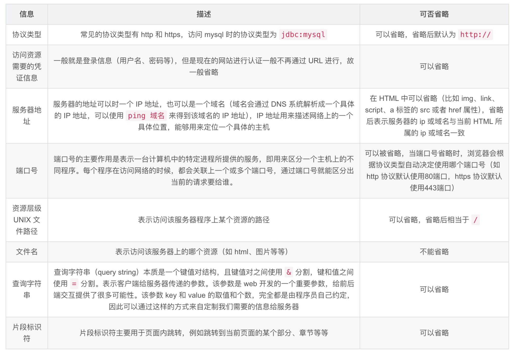
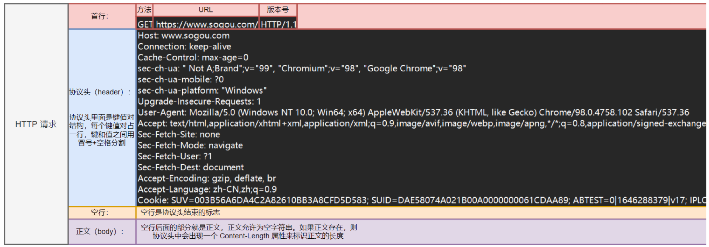
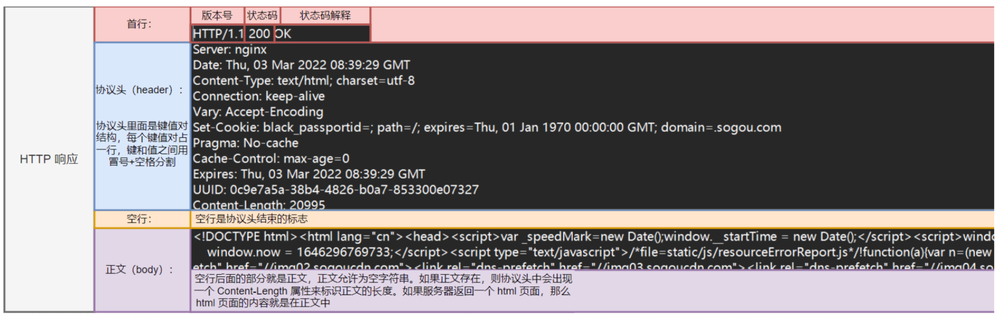

---
tags:
  - 计算机
  - 网络
  - 通信
---
# 底层网络基础层
## 公网 IP 和 私网 IP

在服务器网络环境中，公网 IP 和 主私网IP 是两个核心概念，分别对应不同的网络访问范围和功能，具体区别如下：

1、公网 IP （Public IP）

- 定义：由互联网服务供应商（ISP）分配的、全球唯一的IP 地址，属于公共网络地址空间（如 IPv4 中的 A、B、C 类公网地址）
- 作用：用于服务器的与互联网中其他设备直接通信。例如，网站服务器的公网 IP 是用户通过域名解析后实际访问的地址，邮件服务器通过公网IP 与其他邮件服务器交换数据
- 特点：
  - 全球唯一，在互联网中具有唯一性，不会与其他公网设备重复
  - 可被互联网中的任何设备直接访问
  - 通常需要向 ISP 申请，部分云服务器厂商直接分配公网IP

2、主私网 IP （Private IP）

- 定义：仅在私有网络（如局域网、数据中心内部网络）中使用的 IP 地址，属于私有地址空间，不会在互联网路由。

常见的私有 IP 网段包括：
- `10.0.0.0 - 10.255.255.255`（A 类私有地址）
- `172.16.0.0 - 172.31.255.255`（B 类私有地址）
- `192.168.0.0 - 192.168.255.255`（C 类私有地址） 
- 作用：用于服务器在私有网络内部的通信，例如同一局域网内的服务器、交换机、路由器之间的交互。在云服务器场景中，主私网 IP 是服务器在所属私有网络（VPC）内的"身份标识"，用于通 VPC 内的实例互访
- 特点：
  - 仅在私有网络内有效，无法被互联网直接访问
  - 私有网络内可重复使用（不同局域网的设备可使用相同的私网 IP，互不冲突）
  - 通常由网络管理员或云平台自动分配（如 DHCP 服务），"主私网 IP "指的是服务器在私有网络中主要使用的那个私网IP
---
## **URL**

**URL 基本介绍**

- URL（Uniform Resource Locator），翻译为统一资源定位符
- 互联网上的每个文件都有唯一的 URL，它包含的信息指出文件的位置以及浏览器应该如何处理

**URL 基本格式**

- URL完整格式如下

```
协议类型:[//[访问资源需要的凭证信息@]服务器地址[:端口号]][/资源层级 UNIX 文件路径]文件名[?查询字符串][#片段标识符]
```

**URL 参数介绍**



---
## CIDR

CIDR（Classless Inter-Domain Routing，无类域间路由）是 1993 年引入的一套 **IP 地址分配与路由汇聚** 机制，用来替代旧的“固定 A/B/C 类网络”划分方式。它把 IP 地址切成任意大小的连续块，通过“斜线记法”表示网络前缀长度，从而大幅减缓 IPv4 地址枯竭、减轻全球路由表膨胀。

一句话：CIDR = “网络号 + 掩码长度”合二为一，不再受 8/16/24 位边界限制。

1. **表示法**
   192.0.2.0/24 表示前 24 位是网络号，可用地址 256 个；
   10.0.0.0/8 表示前 8 位是网络号，可用地址 16 777 216 个。
   “/xx” 就是前缀长度，也叫 CIDR 掩码。
2. **核心优点**
   - 按需切分：/28 只给 16 个地址，/20 给 4096 个，避免浪费。
   - 路由聚合：多个连续块可合并成一条前缀宣告，减少全球 BGP 表项。
   - 层次分配：ISP 拿到大块后，再向下游客户划小块，形成地址层次。
3. **与旧类的对比**
   旧类网络号只能 /8、/16、/24；CIDR 允许 /13、/27 等任意长度，故称“classless”（无类）。
4. **常见场景**
   - 云厂商安全组：0.0.0.0/0 表示全网段。
   - 家用宽带：PPPoE 拿到的是 /32 单地址，网关常写成 100.64.0.1/10（运营商级 NAT 段）。
   - 路由表：ISP 把 16384 个 /24 聚合成一条 1.0.0.0/9 向外宣告。
**总结**：CIDR 让 IPv4 地址“颗粒度”可粗可细，是互联网能撑到 IPv6 普及的关键技术之一。
---
## FQDN

FQDN（Fully Qualified Domain Name，**完全限定域名**）就是一台主机在 **整个 DNS 命名空间里“全名”**，从主机名一直写到根域，**保证全球唯一**。

**格式** ：`主机名.二级域.顶级域.`
	末尾的“点”代表根域，平时浏览器里省略，但 DNS 协议里必须存在。

**例子**

- `www.example.com.`
- `mail.sjtu.edu.cn.`
- `panda.server.aliyun.com.`

**判断口诀**

1. 以“根”结尾（写作隐含的 `.`）。
2. 从最具体到最顶级，一层不缺。
3. 在 DNS 查询时能直接解析到 IP，无需再补父域。

**对比常见词**

- **主机名**：只有 `www`，在本域里唯一，换域就冲突。
- **域/域名**：`example.com` 这一段，可包含无数主机。
- **FQDN**：把主机名+域名写全，全球不会撞车。

一句话：FQDN 就是主机在 DNS 世界里的“身份证号码”。

---
# 系统通信层
## 进程通信

**📌 macOS 进程间通信方式总览**

| IPC 方式                  | 简介                                        | 是否跨进程 | 是否支持跨机器 |
| ----------------------- | ----------------------------------------- | ----- | ------- |
| **管道（Pipe）**            | 父子进程间通过内核缓冲区交换数据                          | ✅（父子） | ❌       |
| **命名管道（FIFO）**          | 有名的特殊文件，任何进程都能通过它通信                       | ✅     | ❌       |
| **消息队列（Message Queue）** | 类似排队信箱，进程按消息队列名写/取消息                      | ✅     | ❌       |
| **共享内存（Shared Memory）** | 多个进程共享同一块内存区，速度最快                         | ✅     | ❌       |
| **信号（Signal）**          | 向目标进程发送中断信号                               | ✅     | ❌       |
| **Socket**              | 套接字通信，分本地 Unix Domain Socket 和 TCP Socket | ✅     | ✅（TCP）  |

**📌 macOS 中常用的 4 种 IPC**

① **Unix Domain Socket（推荐 ✅）**

✅ macOS 原生支持，和 Linux 下一样。

 通过**本地文件路径**标识通信对象，适合两个进程间高效双向通信。

**流程**：

-  Server 创建 socket 文件，监听 
-  Client 连接该 socket 文件，读写数据 

**例子**：

-  Docker for Mac 就用 `/var/run/docker.sock`
-  Nginx 和 PHP-FPM 通信 

**特点**：

-  高效、可靠、支持双向通信 
-  跟 TCP Socket 用法几乎一样，协议族用 `AF_UNIX`

**② 命名管道（FIFO）**

✅ macOS 原生支持

 通过 `mkfifo` 命令或 API 创建一个特殊的管道文件，进程A 写，进程B 读。

**示例**：

```
mkfifo /tmp/myfifo
```

进程A：

```
echo "hello" > /tmp/myfifo
```

进程B：

```
cat /tmp/myfifo
```

**特点**：

-  单向、阻塞式 
-  简单可靠，适合一次性小量数据交换 

**③ 信号（Signal）**

✅ macOS 兼容 POSIX 信号机制

 用于进程控制、通知，如 `kill -9 pid`

**常用信号**：

- `SIGINT`（中断） 
- `SIGTERM`（优雅终止） 
- `SIGKILL`（强制终止） 

**特点**：

-  只传递简单指令，不带数据 
-  适合事件通知，常和其他 IPC 配合用 

**④ 共享内存（Shared Memory）**

✅ macOS 支持 POSIX 共享内存接口

 进程可以映射同一块内存区，读写数据最快。

**API**：

- `shm_open`
- `mmap`
- `shm_unlink`

**特点**：

-  速度极快，开销小 
-  同步机制要自己管理（锁、信号量） 

**📌 小结**

| 场景               | 推荐方式           |
| ------------------ | ------------------ |
| 高速双向通信       | Unix Domain Socket |
| 简单单向小数据通信 | 命名管道（FIFO）   |
| 进程事件通知       | 信号（Signal）     |
| 高速大量共享数据   | 共享内存 + 锁      |
## Unix 套接字

**什么是 Unix 域套接字（Unix Domain Socket, UDS）**

**Unix 域套接字** 是一种在 **同一台主机内进程间通信（IPC）** 的方式，和普通 TCP/IP 套接字很像，但：

-  不用通过网络协议栈 
-  不走网卡，不占用端口号 
-  通信对象是通过文件系统中的一个 **Socket 文件**（通常是 `*.sock` 文件）来标识 

⚠️ 注意：**仅限同主机内进程通信**

**📌 Unix 域套接字文件长什么样？**

-  是一种特殊类型的文件（类型是 `socket`） 
-  可以放在 `/tmp/`、`/var/run/`、应用目录下 
- 举例：

```
/tmp/mysql.sock
/var/run/docker.sock
/tmp/nginx.sock
```

查看类型：

```
ls -l /tmp/mysql.sock
```

文件类型标识：

`s` 表示是 socket 文件 例如：

```
srw-rw---- 1 mysql mysql 0 6月 19 12:33 /tmp/mysql.sock
```

**📌 和 TCP/IP 套接字的区别**

| 项目     | Unix Domain Socket             | TCP/IP Socket            |
| -------- | ------------------------------ | ------------------------ |
| 作用范围 | 同主机内                       | 跨主机、本地都行         |
| 标识方式 | 文件路径（如 /tmp/nginx.sock） | IP + Port                |
| 通信协议 | 不用 TCP/UDP，基于内核直接转发 | 需要走网络协议栈         |
| 速度     | 更快，少了网络协议栈开销       | 稍慢，需过完整 TCP/IP 栈 |
| 安全性   | OS 权限控制文件可访问性        | 依赖网络端口和防火墙     |

**📌 使用场景**

**数据库连接** MySQL、PostgreSQL 都支持 socket 文件通信，速度更快

```
mysql -u root -p --socket=/tmp/mysql.sock
```

- **Nginx → PHP-FPM、Gunicorn** Nginx 反向代理到本地 Unix socket，代替 localhost:port 配置例子：

```
upstream backend {
    server unix:/run/php/php7.4-fpm.sock;
}
```

- **Docker** 容器管理控制 socket`/var/run/docker.sock`，只有 root 或 docker 组用户能访问 

**📌 怎么创建 Unix 域套接字（示例）**

**服务端：**

```
int fd = socket(AF_UNIX, SOCK_STREAM, 0);
struct sockaddr_un addr;
addr.sun_family = AF_UNIX;
strcpy(addr.sun_path, "/tmp/mysocket.sock");
bind(fd, (struct sockaddr*)&addr, sizeof(addr));
listen(fd, 5);
```

**客户端：**

```
int fd = socket(AF_UNIX, SOCK_STREAM, 0);
struct sockaddr_un addr;
addr.sun_family = AF_UNIX;
strcpy(addr.sun_path, "/tmp/mysocket.sock");
connect(fd, (struct sockaddr*)&addr, sizeof(addr));
```

**📌 如何查看系统里的所有 Unix 套接字文件**

```
find / -type s 2>/dev/null
```

或者查看内核中的套接字连接：

```
ss -x
```

**📌 小结**

 ✅ **Unix Domain Socket** 是一种高效、进程内安全通信方式

 ✅ 通过 **文件路径** 而非端口识别服务

 ✅ 常用于 **数据库、本地服务、Nginx-PHP**、Docker 控制

 ✅ 与 TCP/IP 相比，不走网络协议栈，速度更快 

# 网络连接层

## WiFi的连接

当你启用 Wi-Fi 功能时，操作系统（如 macOS、Windows、Linux）会开始扫描可用的无线网络。这时，它会通过以下步骤来识别可连接的网络：

**1、WiFi 信号扫描与选择**

- **无线适配器扫描**：无线网卡开始扫描周围的无线信号（Wi-Fi信号），并收集到所有可用Wi-Fi网络的SSID（服务集标识符）和信号强度。 
- **选择网络**：用户选择一个网络进行连接。如果没有指定网络，操作系统可能会自动连接到强信号的网络，或者是用户曾经连接过的网络。  

**2、建立连接：认证与关联**

连接到 Wi-Fi 网络后，Wi-Fi 客户端和路由器之间会发生一系列的握手操作。主要步骤如下：

**认证过程**：

-  如果该网络设置了加密（WPA2、WPA3等），Wi-Fi 客户端会发送密码或密钥以通过认证。 
-  认证的过程包括向 身份验证服务器（如 RADIUS 服务器）发送用户凭证，确认密码是否正确。如果是公共网络，可能跳过此步骤。 

**关联过程**：

-  客户端设备与访问点（AP，即Wi-Fi路由器）之间建立物理层连接。设备通过 Association Request 和 Association Response 交换消息，建立连接。 
-  在这个阶段，客户端会获得一个 MAC 地址（硬件地址）分配给其连接。这个地址用于唯一标识设备。

**3、IP 地址分配：DHCP**

在连接到网络并认证通过后，Wi-Fi 网络需要为设备分配一个 IP 地址，这个过程通常通过 DHCP（动态主机配置协议） 完成：

- **DHCP Discover**：客户端发送一个 DHCP Discover 包，询问网络中的 DHCP 服务器是否存在，并请求一个 IP 地址。 
- **DHCP Offer**：路由器或 DHCP 服务器响应并提供一个 IP 地址，子网掩码和其他配置（如默认网关、DNS）。 
- **DHCP Request**：客户端接收到 DHCP Offer 后，选择一个 IP 地址并发送 DHCP Request 包，确认使用该 IP 地址。 
- **DHCP Acknowledgement**：服务器确认分配给客户端的 IP 地址并返回 DHCP Acknowledgement 包。此时，设备获得了一个有效的 IP 地址。  

**4. 路由配置：设置默认网关与 DNS**

一旦设备获得了 IP 地址，操作系统会根据 DHCP 配置设置路由和 DNS：

- **默认网关**：设置默认网关地址，通常是路由器的地址。所有不在本地子网的流量都会通过该网关发送。 
- **DNS 服务器**：操作系统会设置 DNS 服务器地址，用于域名解析。 

**5、网络通信：发送与接收数据**

一旦设备获得 IP 地址，客户端和其他设备（或互联网上的服务器）之间就可以开始通信。数据通过 **无线链路**（Wi-Fi 信号）发送，最终到达路由器，然后路由器将数据包转发到 **互联网** 或其他网络设备。

- **路由与转发**：当你访问一个网页时，路由器将会查询路由表，决定如何将数据包转发到互联网中的目标服务器。 
- **加密**：数据在传输过程中会根据 Wi-Fi 加密协议（如 WPA2、WPA3）进行加密，确保通信的安全性。 

**6、连接的维护与管理**

- **信号强度管理**：设备会不断检测网络信号的强度，如果信号变弱，可能会尝试切换到信号更强的网络。 
- **断开重连**：当网络信号消失或 Wi-Fi 路由器断开时，设备会尝试重新连接网络。 
- **自动重连与断开**

- **自动重连**：如果你在连接后暂时失去连接，Wi-Fi 客户端通常会尝试重新连接。 
- **断开**：如果设备主动断开 Wi-Fi 连接，或者 Wi-Fi 路由器关闭，设备会退出连接。 

**关键网络协议与机制：**

1. **Wi-Fi 协议**：
   1. **802.11a/b/g/n/ac/ax**：这些是常见的无线通信标准，分别表示不同的 Wi-Fi 协议，提供不同的带宽、频段、覆盖范围等特性。 
   2. **WPA2/WPA3**：Wi-Fi Protected Access，用于无线网络加密和认证。 
2. **DHCP**：动态主机配置协议，用于分配 IP 地址及其他配置信息。 
3. **NAT（网络地址转换）**：当你连接到互联网时，通常会通过路由器进行 NAT 操作，路由器将本地设备的私有 IP 地址转换为公共 IP 地址进行互联网通信。 
4. **ARP（地址解析协议）**：用于解析本地网络中的 IP 地址到物理地址（MAC 地址），以便设备之间的通信。 

**总结：**

 整个 Wi-Fi 连接过程从扫描可用网络开始，经过认证、关联、DHCP 地址分配，到数据通信，再到网络管理和维护。这一系列过程依赖多个协议（如 Wi-Fi 协议、DHCP、ARP 等），并且涉及操作系统与硬件的紧密配合。


## SSH 连接

**SSH 简介**

私钥文件:

- id_rsa：这是 RSA 算法生成的私钥文件

特点

- 内容以 ----BEGIN RSA PRIVATE KEY ----开头
- 必须严格保密，不能分享给他人或上传到公共服务器

公钥文件：

- id_rsa.pub：这是与 id_rsa 对应的公钥文件

特点

- 内容以 ssh-rsa 开头，后面跟着一长串字符串
- 可以公开分享，通常用于配置服务器 ~/.ssh/authorized_keys 文件

**SSH 连接流程**

1、生成 SSH 密钥对（在主机上）

```
ssh-keygen -t rsa
```

2、将公钥复制到虚拟机中

```
ssh-copy-id user@虚拟机IP
```

3、使用私钥登录

```
ssh username@虚拟机IP -i ~/.ssh/id_rsa
```

 

## 端口

linux系统是一个超大号小区，可以支持65535个端口，这六万多个端口分为三类使用：

- 公认端口：1~1023，通常用于一些系统内置或知名程序的预留使用，如 SSH 服务的22端口，HTTPS 服务的443端口，非特殊需要，不要占用这个范围的端口
- 注册端口 ：1024~49151，通常可以任意使用，用于松散的绑定一些程序/服务
- 动态端口：49152~65535，通常不会固定绑定程序，而是当程序对外进行网络链接时，用于临时使用

如图中，计算机 A 的微信连接计算机 B 的微信，A 使用的50001即动态端口，临时找到一个端口作为出口，计算机 B 的微信使用端口5678，即注册端口，长期绑定此端口等待别人连接   


 ## 网络连接

**1、桥接模式**

概念：桥接模式下，虚拟机的网络就像是和你物理主机平等地接入同一个局域网，相当于虚拟机有自己独立的 IP 地址

特点：

- 虚拟机和物理主机、其他设备在同一个局域网
- 虚拟机获取的是局域网内 DHCP 分配的地址，或手动配置的
- 物理机、虚拟机、同网络下设备都能互相ping 通

**2、NAT 模式**

概念：虚拟机是通过主机的 IP 和端口来访问外网，虚拟机本身是内网地址，外部设备无法主动访问虚拟机

特点：

- 虚拟机可以访问外网，但是外网不能访问虚拟机
- 虚拟机和 主机不在一个局域网，虚拟机的局域网通常是10.x.x.x 或192.168.x.x

**3、Host-only模式**

概念：虚拟机和物理主机连在一个专用的虚拟局域网里，但都无法访问外网。就是专门为物理机和虚拟机之间通信准备的专属网段

特点：

- 虚拟机和宿主机能够互相通信的
- 虚拟机无法访问外网


## SSH 隧道

**什么是 SSH 隧道？**

**SSH 隧道**，也叫 **端口转发（Port Forwarding）**，是一种通过 SSH 加密连接，把本地或远程端口安全地转发到另一台服务器上的技术。

👉 本质：

-  把某个端口的数据流量，封装在 SSH 加密隧道里，传到另一台机器，再从那台机器释放出来，达到安全访问内网服务、跨越防火墙等目的。 

**📌 SSH 隧道的 3 种模式**

| 名称             | 方向          | 用途                        | 命令参数 |
| ---------------- | ------------- | --------------------------- | -------- |
| **本地端口转发** | 本地 → 远程   | 访问远程内网服务            | -L       |
| **远程端口转发** | 远程 → 本地   | 让远程服务器访问本地服务    | -R       |
| **动态端口转发** | 本地 → 多目标 | 类似 SOCKS5 代理，翻墙/代理 | -D       |

**📌 用法示例**

**① 本地端口转发（Local Port Forwarding）**

**场景**：

 你本地访问不到 `serverB` 的 `3306`，但 `serverA` 能访问。你通过 `SSH` 连接 `serverA`，再从 `serverA` 去访问 `serverB`。

**命令**：

```
bash
复制编辑
ssh -L 3307:serverB:3306 user@serverA
```

👉 解释：

- `-L 3307:serverB:3306`：把本地 `3307` 端口，转发到 `serverA`，由 `serverA` 访问 `serverB:3306`
- `user@serverA`：登录 `serverA` 的账户 
-  然后本地连 `localhost:3307` 就相当于连 `serverB:3306`

**② 远程端口转发（Remote Port Forwarding）**

**场景**：

 你本地有个 Web 服务 `127.0.0.1:8080`，想让远程 `serverA` 能访问你的这个服务。

**命令**：

```
bash
复制编辑
ssh -R 9090:localhost:8080 user@serverA
```

👉 解释：

- `-R 9090:localhost:8080`：把远程 `serverA` 的 `9090` 端口，转发到你本地 `8080`
-  之后在 `serverA` 上访问 `localhost:9090` 就等于访问你本地 `8080`

**③ 动态端口转发（Dynamic Port Forwarding）**

**场景**：

 把本地端口作为 SOCKS5 代理，所有网络请求走 SSH 隧道代理访问外网。

**命令**：

```
bash
复制编辑
ssh -D 1080 user@serverA
```

👉 解释：

- `-D 1080`：本地开启一个 `SOCKS5` 代理端口 `1080`
-  浏览器/终端可以配置 SOCKS5 代理 `localhost:1080`，走这条 SSH 隧道 

**📌 持久化隧道（无需交互**）

如果不想每次输入密码：

1.  配置 SSH 密钥登录（`ssh-keygen` + `ssh-copy-id`） 
2.  或者用 `autossh` 工具自动重连 

**📌 查看本地监听端口**

```
bash
复制编辑
lsof -i TCP:3307
```

或者

```
bash
复制编辑
netstat -anp | grep 3307
```

**📌 总结**

- **SSH 隧道**是安全转发网络流量的利器 
- **三种方式**灵活解决内网穿透、代理、远程调试 
- **搭配密钥 & autossh**，可以做到稳定、自动化 
# 应用协议层
### FTP

FTP 服务器是基于 **FTP（File Transfer Protocol，文件传输协议）** 实现的**网络文件传输服务端**，核心功能是在网络中为客户端提供**文件上传、下载、目录管理**等操作，支持跨设备、跨系统（Windows/Linux/macOS）的文件交互，是互联网早期最常用的文件传输工具之一。

**一、核心工作原理**

FTP 采用 **客户端 - 服务器（C/S）架构**，通信过程依赖 **两个独立的 TCP 连接**，分别负责命令传输和数据传输，这是 FTP 的核心特征：

1. 控制连接（Control Connection）
   - 端口：默认使用 **TCP 21 端口**。
   - 作用：负责传递客户端与服务器之间的**控制命令**（如登录认证、上传`PUT`、下载`GET`、创建目录`MKD`等），以及服务器的响应信息。
   - 特点：**长连接**—— 一旦客户端与服务器建立控制连接，会在整个会话期间保持，直到客户端主动断开。
2. 数据连接（Data Connection）
   - 端口：根据传输模式不同，端口动态分配。
   - 作用：负责传输**实际的文件数据**或**目录列表**（如客户端执行`LIST`命令查看目录，数据通过此连接传输）。
   - 特点：**短连接**—— 仅在传输数据时建立，传输完成后立即断开。

**FTP 的两种传输模式**

FTP 有**主动模式（PORT）\**和\**被动模式（PASV）\**两种，核心区别在于\**数据连接的发起方不同**，主要解决防火墙环境下的连接穿透问题：

|       传输模式       |                           工作流程                           |                     适用场景                      |                             缺点                             |
| :------------------: | :----------------------------------------------------------: | :-----------------------------------------------: | :----------------------------------------------------------: |
| **主动模式（PORT）** | 1. 客户端向服务器 21 端口发起控制连接；2. 客户端告知服务器自己的一个随机数据端口；3. 服务器主动用 20 端口连接客户端的随机数据端口，建立数据连接。 | 服务器端防火墙开放 20/21 端口，客户端无防火墙限制 | 客户端若开启防火墙，可能拦截服务器主动发起的连接，导致数据传输失败 |
| **被动模式（PASV）** | 1. 客户端向服务器 21 端口发起控制连接；2. 服务器开启一个随机数据端口，并告知客户端；3. 客户端主动连接服务器的随机数据端口，建立数据连接。 |     客户端开启防火墙（如个人电脑、内网设备）      |      服务器需开放指定的被动端口范围，否则客户端无法连接      |

> **注意**：目前主流 FTP 客户端（如 FileZilla、Xftp）默认使用**被动模式**，因为更适配防火墙环境。

**二、核心功能**

1. **文件传输**：支持客户端向服务器上传（`PUT`）、从服务器下载（`GET`）文件，支持断点续传（部分服务器支持）。
2. **目录管理**：客户端可查看服务器目录列表（`LIST`）、创建目录（`MKD`）、删除目录（`RMD`）、重命名文件（`RNFR/RNTO`）。
3. **权限控制**：服务器可对不同用户配置不同权限（如匿名用户仅可下载、普通用户可读写、管理员可删除文件）。
4. **匿名访问**：支持匿名用户登录（无需账号密码，默认用户名`anonymous`，密码可填任意邮箱），适合公开文件共享。

**三、主流 FTP 服务器软件**

不同操作系统有成熟的 FTP 服务器软件，按平台分类如下：

|  操作系统   |       常用软件       |                             特点                             |
| :---------: | :------------------: | :----------------------------------------------------------: |
|  **Linux**  |      **vsftpd**      | 全称`Very Secure FTP Daemon`，轻量、安全、高性能，是 Linux 系统默认的 FTP 服务器，支持虚拟用户、权限隔离，安全性高 |
|             |       ProFTPD        |       功能丰富，支持模块化扩展，配置灵活，适合复杂场景       |
|             |      Pure-FTPd       |         专注安全性，支持虚拟用户、带宽限制，部署简单         |
| **Windows** | **FileZilla Server** | 开源免费，图形化界面，配置简单，支持 FTP/FTPS 加密，适合个人或小型企业使用 |
|             |     IIS FTP 服务     | Windows 自带组件，集成于 IIS 服务器，适合已部署 IIS 的企业环境 |
| **跨平台**  |        Serv-U        | 商业软件，功能强大，支持 FTP/FTPS/SFTP，适合企业级高并发场景 |

**四、安全性问题与替代方案**

FTP 协议诞生于互联网早期，**存在严重的安全缺陷**，这是它逐渐被替代的核心原因：

1. **明文传输**：控制连接中的**用户名、密码**，以及数据连接中的**文件内容**，均以明文形式传输，攻击者可通过抓包工具直接窃取。
2. **缺乏身份认证增强**：仅支持简单的账号密码认证，无复杂的加密认证机制。

**安全替代方案**

为解决 FTP 的安全问题，目前主流使用**加密传输协议**替代：

1. FTPS（FTP over SSL/TLS）
   - 本质：在 FTP 基础上添加 SSL/TLS 加密层，对控制连接和数据连接均进行加密。
   - 特点：兼容原有 FTP 客户端，只需服务器启用 SSL/TLS 证书即可，适合需要兼容旧系统的场景。
2. SFTP（SSH File Transfer Protocol）
   - 本质：基于 **SSH 协议**的文件传输工具，并非 FTP 的扩展。
   - 特点：所有数据（包括命令和文件）均通过 SSH 加密传输，安全性远高于 FTP；支持密钥认证（无需密码），是目前**最推荐的安全文件传输方式**。
   - 工具：客户端可使用 Xftp、FileZilla，服务器端 Linux 系统默认通过 SSH 服务支持 SFTP，无需额外安装。

**五、FTP 服务器搭建与使用注意事项**

1. 权限最小化配置
   - 避免给用户分配过高权限（如根目录写入权限），防止恶意上传或删除文件；
   - 推荐使用**虚拟用户**（而非系统用户），隔离 FTP 用户与操作系统用户，降低安全风险。
2. 启用加密传输
   - 禁止使用明文 FTP，优先配置 FTPS 或直接改用 SFTP；
   - 若使用 FTPS，需申请并配置 SSL/TLS 证书（自签名证书适合内网，公网建议使用 CA 签发的证书）。
3. 防火墙与端口配置
   - 主动模式：开放 TCP 20（数据）、21（控制）端口；
   - 被动模式：开放 TCP 21 端口 + 配置被动端口范围（如 50000-50100），并在防火墙中放行该范围；
   - 公网部署时，建议通过 NAT 映射仅开放必要端口，避免暴露过多端口。
4. 日志审计
   - 启用 FTP 服务器的日志功能，记录用户的登录、上传、下载操作，便于排查异常行为（如恶意上传病毒文件）。

**总结**

FTP 服务器是传统的文件传输工具，协议成熟但**安全性不足**。在当前网络环境下：

- 若为**内网低安全需求场景**（如个人文件共享），可临时使用 FTP，但需限制权限；
- 若为**公网或企业级场景**，**优先使用 SFTP**（基于 SSH），兼顾安全性和易用性；
- 若需兼容旧 FTP 客户端，可使用 FTPS 加密模式。

---
## HTTP

### **HTTP 1.0（1996）：基础架构的诞生**

#### **核心特性**

1. **短连接机制**
   每个请求 - 响应周期后立即关闭 TCP 连接，导致频繁的三次握手与四次挥手，性能低下。例如，加载包含 10 张图片的页面需建立 11 次 TCP 连接（1 次 HTML + 10 次图片）。
2. **无 Host 头支持**
   无法区分同一 IP 下的多个虚拟主机，例如 `example.com` 和 `blog.example.com` 无法通过 HTTP 1.0 区分，需依赖端口号或子网划分。
3. **文本协议与简单缓存**
   头部信息以明文传输，仅支持 `Expires` 和 `If-Modified-Since` 等基础缓存策略，无法有效复用资源。

#### **局限与痛点**

- **高延迟**：频繁的连接建立与关闭导致网络利用率低下，尤其在加载多资源时延迟显著（典型延迟 300ms+）。
- **虚拟主机支持缺失**：限制了服务器资源的高效利用，难以满足多租户需求。
- **无管道化**：请求必须串行发送，无法并行处理。

### **HTTP 1.1（1999）：性能优化的第一步**

#### **核心改进**

1. **持久连接（Keep-Alive）**
   通过 `Connection: keep-alive` 头复用 TCP 连接，减少握手开销。例如，同一连接可传输多个请求，加载 10 张图片仅需 1 次 TCP 连接。
2. **Host 头与虚拟主机**
   强制要求请求包含 `Host` 头，支持同一 IP 下的多个域名（如 `example.com` 和 `blog.example.com`），推动虚拟主机技术普及。
3. **管道化（Pipelining）**
   理论上允许在同一连接中并行发送多个请求，但响应仍需按顺序返回。例如，客户端可连续发送 3 个请求，服务器依次响应，但实际中因队头阻塞问题被浏览器禁用。
4. **缓存增强**
   引入 `Cache-Control`、`ETag`、`If-None-Match` 等头，支持更灵活的缓存策略，减少重复传输。

#### **局限与痛点**

- **队头阻塞**：若首个请求因网络延迟或服务器处理缓慢，后续请求全部阻塞（如加载大文件时，小文件也需等待）。
- **6 连接限制**：浏览器对同一域名最多同时建立 6 个 TCP 连接，制约高并发场景性能。
- **明文传输**：未强制加密，安全性不足。

### **HTTP 2.0（2015）：二进制分帧的革命**

#### **核心突破**

1. **二进制分帧（Binary Framing）**
   将数据分割为帧（Frame），通过 `Stream ID` 标识所属请求 / 响应流。例如，一个 TCP 连接可同时传输多个流，帧可乱序发送，接收端按 `Stream ID` 重组。
2. **多路复用（Multiplexing）**
   彻底解决应用层队头阻塞：多个请求 / 响应可在同一连接中并行传输。例如，加载网页时，HTML、CSS、JS 可通过不同流同时传输，互不影响。
3. **头部压缩（HPACK）**
   采用静态字典和动态索引压缩重复头部，减少传输开销。例如，重复的 `Cookie` 头部可压缩为索引值，传输量降低 90% 以上。
4. **服务器推送（Server Push）**
   服务器主动推送关联资源（如 CSS、JS）至客户端，减少客户端请求次数。例如，客户端请求 HTML 时，服务器可同时推送依赖的 CSS 文件。

#### **性能提升**

- **延迟降低**：典型延迟降至 100-200ms，在理想网络下页面加载时间比 HTTP 1.1 减少 25%。
- **带宽优化**：头部压缩和多路复用显著降低冗余传输，尤其适合移动网络。

#### **局限与痛点**

- **TCP 层队头阻塞**：若 TCP 数据包丢失，所有流需等待重传，导致性能下降（如 2% 丢包率下延迟增加 50%）。
- **实现复杂性**：二进制协议需重新设计解析器，早期服务器兼容性差。

### **HTTP 3.0（2022）：QUIC 协议的重构**

#### **核心创新**

1. **基于 QUIC 的 UDP 传输**
   - **0-RTT 握手**：首次连接仅需 1 个 RTT，后续重连可在 0 RTT 内完成，较 HTTP 2.0 的 3 RTT 显著提速。
   - **连接迁移**：IP 地址或网络切换时（如 Wi-Fi 转 4G），通过连接 ID 保持会话，避免重连（迁移耗时从 2300ms 降至 400ms）。
   - **前向纠错（FEC）**：通过冗余编码在 20% 丢包率下仍保持可用性，尤其适合高丢包网络。
2. **彻底消除队头阻塞**
   每个流独立控制，单个流丢包不影响其他流。例如，视频流卡顿不影响文本聊天消息传输。
3. **QPACK 头部压缩**
   优化 HPACK 的动态字典管理，减少压缩开销并避免压缩相关的队头阻塞。

#### **性能提升**

- **弱网优势**：在 2% 丢包率下，HTTP 3.0 延迟仅为 HTTP 2.0 的 50%（380ms vs 760ms）。
- **移动场景优化**：网络切换时连接保持，视频卡顿率降低 70%。

#### **应用场景**

- **实时通信**：游戏、直播等对延迟敏感的场景（如 Google Stadia 采用 HTTP 3.0）。
- **跨国传输**：高延迟环境下延迟降低 60%（如跨国访问延迟从 2100ms 降至 900ms）。

### HTTP 状态码
#### **一、1xx 信息性状态码（请求已接收，继续处理）**

- 101 Switching Protocols
  - **含义**：服务器同意切换协议（如从 HTTP 升级到 WebSocket）。
  - **场景**：前端通过`Upgrade: websocket`请求升级连接时，服务器返回此状态码。

#### **二、2xx 成功状态码（请求已成功处理）**

- **200 OK**
  - **含义**：请求正常处理完毕，返回预期数据。
  - **场景**：API 接口正常返回数据（如`GET /users/1`获取用户信息）。
- **201 Created**
  - **含义**：请求已创建新资源（如创建用户、发布文章）。
  - **场景**：调用`POST /users`创建新用户账号后返回。
- **204 No Content**
  - **含义**：请求成功但无需返回内容（常用于删除操作）。
  - **场景**：`DELETE /posts/123`删除帖子后，服务器确认删除但不返回数据。

#### **三、3xx 重定向状态码（请求需进一步操作）**

- **301 Moved Permanently**
  - **含义**：资源永久迁移，后续请求应使用新 URL。
  - **场景**：网站域名变更（如`old.com`永久跳转到`new.com`），SEO 需保留权重。
- **302 Found**（旧版 302，当前标准为 307 Temporary Redirect）
  - **含义**：资源临时跳转，客户端应使用原 URL 重试。
  - **场景**：登录页未认证时跳转到登录界面，登录后返回原页面。
- **304 Not Modified**
  - **含义**：资源未修改，可使用客户端缓存（减少带宽消耗）。
  - **场景**：浏览器请求图片时，服务器通过`Last-Modified`或`ETag`判断缓存有效，直接返回 304。

#### **四、4xx 客户端错误状态码（请求存在错误）**

- **400 Bad Request**
  - **含义**：请求格式错误（如 JSON 解析失败、参数缺失）。
  - **场景**：前端提交表单时缺少必填字段，或 API 请求参数类型错误。
- **401 Unauthorized**
  - **含义**：未授权（缺少有效认证令牌）。
  - **场景**：调用需要登录的 API 时未携带`Authorization`头，或 JWT 令牌过期。
- **403 Forbidden**
  - **含义**：权限禁止（认证通过但无操作权限）。
  - **场景**：普通用户尝试访问管理员页面，或 IP 被服务器封禁。
- **404 Not Found**
  - **含义**：请求的资源不存在（如 URL 错误或资源被删除）。
  - **场景**：访问`https://example.com/non-existent-page`时返回。
- **429 Too Many Requests**
  - **含义**：请求频率过高，触发限流。
  - **场景**：短时间内多次请求 API（如爬虫或恶意攻击），服务器暂时拒绝服务。

#### **五、5xx 服务器错误状态码（服务器处理失败）**

- **500 Internal Server Error**
  - **含义**：服务器内部错误（如代码异常、数据库连接失败）。
  - **场景**：Java 应用抛出`NullPointerException`，或 MySQL 服务宕机。
- **502 Bad Gateway**
  - **含义**：网关错误（如 Nginx 作为反向代理时，后端服务未响应）。
  - **场景**：微服务架构中，某个服务实例崩溃，网关无法获取响应。
- **503 Service Unavailable**
  - **含义**：服务暂时不可用（如服务器过载、维护中）。
  - **场景**：电商大促期间服务器流量激增，返回 503 并提示 “稍后重试”。
- **504 Gateway Timeout**
  - **含义**：网关超时（后端服务处理请求超过设定时间）。
  - **场景**：复杂 SQL 查询耗时过长，数据库服务未及时返回结果。

#### **六、实用对比：易混淆状态码**

| 状态码  | 核心区别                 | 典型场景               |
| ------- | ------------------------ | ---------------------- |
| 401     | 需要身份认证（如登录）   | 访问私人相册未登录     |
| 403     | 已认证但无权限           | 普通用户访问管理员后台 |
| 301     | 永久重定向（缓存新 URL） | 域名变更               |
| 302/307 | 临时重定向（保留原 URL） | 未登录时跳转登录页     |

#### **七、记忆技巧与应用建议**

1. 分类记忆：
   - 2xx 看 “成功”，3xx 想 “跳转”，4xx 查 “客户端问题”，5xx 找 “服务器故障”。
2. 开发调试：
   - 遇到 400/422（请求参数错误）时，检查前端传参格式；
   - 500 错误优先查看服务器日志中的异常堆栈。
3. 前端优化：
   - 利用 304 缓存静态资源（如图片、CSS），减少重复请求；
   - 404 页面可设计友好的引导页（如搜索框、热门链接）。

通过理解 HTTP 状态码，开发者可快速定位请求问题，前端工程师能优化用户体验，运维人员可针对性排查服务器故障。实际应用中，建议结合状态码文档与服务日志综合分析。

### **关键特性对比表**

| **特性**                 | HTTP 1.0 | HTTP 1.1           | HTTP 2.0     | HTTP 3.0      |
| ------------------------ | -------- | ------------------ | ------------ | ------------- |
| **连接机制**             | 短连接   | 持久连接           | 多路复用 TCP | QUIC over UDP |
| **队头阻塞**             | 严重     | 严重               | TCP 层存在   | 彻底解决      |
| **头部压缩**             | 无       | 无                 | HPACK        | QPACK         |
| **服务器推送**           | 不支持   | 不支持             | 支持         | 支持          |
| **0-RTT 建连**           | 不支持   | 不支持             | 不支持       | 支持          |
| **典型延迟（理想网络）** | 300ms+   | 150-300ms          | 100-200ms    | 50-100ms      |
| **安全传输**             | 明文     | 明文（可选 HTTPS） | 强制 HTTPS   | 内置 TLS 1.3  |

### **总结：协议演进的逻辑**

1. **效率提升**：从短连接到多路复用，从文本到二进制，逐步减少冗余传输。
2. **体验优化**：解决队头阻塞、支持连接迁移，适应移动互联网需求。
3. **安全强化**：从可选加密到强制 HTTPS，再到内置 TLS，安全性逐步提升。

**现状与趋势**：

- HTTP 1.1 仍广泛用于老旧设备（如 IoT），但主流网站已全面转向 HTTP 2.0。
- HTTP 3.0 普及率快速增长（2024 年全球 37% 网站支持），尤其在移动端和实时通信场景优势显著。
- 未来可能向可编程协议栈演进，如 QUIC over 智能超表面（6G 研究方向）。

### **多路复用（Multiplexing）**

定义：在单个连接上同时传输多个请求和响应，无需按顺序等待，从而提升并发性能。

核心作用：

- 解决队头阻塞（Head-of-Line Blocking）
  - HTTP/1.1 的管道化（Pipelining）要求响应必须按请求顺序返回，一个慢请求会阻塞后续请求。
  - HTTP/2 的多路复用允许乱序返回响应，彻底解决此问题。
- 减少 TCP连接数
  - HTTP/1.1需要多个TCP 连接实现并发，而 HTTP/2只需一个连接

实现原理（HTTP/2）

- 二进制分帧：将请求/响应拆分为更小的帧，每个帧标记所属的流
- 流优先级：可设置流的优先级

1. **头部压缩（Header Compression）**

定义：压缩HTTP 请求/响应的头部文字，减少冗余数据传输

核心作用：

- 降低延迟：HTTP 头部可能占请求体积的50%以上，压缩后显著减少传输量
- 节省带宽：对移动端和高延迟网络尤为重要

实现原理：

- HPACK算法：静态表（61种常见头部字段）+ 动态表（自定义字段缓存），用索引来替代重复字段
- QPACK 算法：类似于HPACK，但适应QUIC 的无序传输

### **HTTP协议头**

- HTTP请求格式



- HTTP请求头

| **分类**       | **字段名**        | **作用与示例**                                               |
| -------------- | ----------------- | ------------------------------------------------------------ |
| **基础控制**   | Host              | 指定请求的域名（HTTP/1.1必需字段）：Host: example.com        |
|                | User-Agent        | 标识客户端类型（浏览器/爬虫）：User-Agent: Mozilla/5.0 (Windows NT 10.0) |
|                | Connection        | 控制连接方式：Connection: keep-alive（长连接）               |
| **内容协商**   | Accept            | 声明客户端接受的响应类型：Accept: text/html, application/json |
|                | Accept-Language   | 优先语言：Accept-Language: zh-CN, en;q=0.5                   |
|                | Accept-Encoding   | 支持的压缩算法：Accept-Encoding: gzip, deflate, br           |
| **缓存控制**   | Cache-Control     | 缓存策略：Cache-Control: no-cache（禁用缓存）                |
|                | If-Modified-Since | 条件请求（资源未修改时返回304）：If-Modified-Since: Wed, 21 Oct 2023 07:28:00 GMT |
| **身份验证**   | Authorization     | 凭证信息：Authorization: Bearer xxxxxx                       |
|                | Cookie            | 客户端存储的Cookie：Cookie: sessionId=abc123; theme=dark     |
| **跨域与安全** | Origin            | 请求来源（用于CORS）：Origin: https://www.example.com        |
|                | Referer           | 上级页面URL：Referer: https://example.com/home               |
| **Body相关**   | Content-Type      | 请求体的数据类型（POST/PUT必需）：Content-Type: application/json |
|                | Content-Length    | 请求体大小（字节）：Content-Length: 348                      |

- HTTP 响应格式



- HTTP响应头

| **分类**     | **字段名**                  | **作用与示例**                                               |
| ------------ | --------------------------- | ------------------------------------------------------------ |
| **状态控制** | Server                      | 服务器软件信息：Server: nginx/1.18.0                         |
|              | Date                        | 响应生成时间：Date: Tue, 15 Nov 2023 12:00:00 GMT            |
| **内容描述** | Content-Type                | 响应体的数据类型：Content-Type: text/html; charset=utf-8     |
|              | Content-Encoding            | 数据压缩方式：Content-Encoding: gzip                         |
|              | Content-Length              | 响应体大小：Content-Length: 1024                             |
| **缓存控制** | Cache-Control               | 缓存策略：Cache-Control: max-age=3600（缓存1小时）           |
|              | ETag                        | 资源唯一标识（用于缓存验证）：ETag: "33a64df55142f"          |
| **安全相关** | Set-Cookie                  | 设置Cookie：Set-Cookie: sessionId=abc123; Path=/; Secure     |
|              | Strict-Transport-Security   | 强制HTTPS（HSTS）：Strict-Transport-Security: max-age=31536000 |
|              | Content-Security-Policy     | 防止XSS攻击：Content-Security-Policy: default-src 'self'     |
| **跨域控制** | Access-Control-Allow-Origin | CORS允许的源：Access-Control-Allow-Origin: *                 |
| **重定向**   | Location                    | 重定向目标URL：Location: https://new.example.com             |

---
## webhook 地址

webhook 地址是一个**公开可访问的 URL**，用于接收来自其他应用或服务的实时事件通知。它的核心作用是实现不同系统之间的 “实时通信”—— 当源系统发生特定事件（如支付成功、消息推送、数据更新等）时，会自动向这个 URL 发送 HTTP 请求（通常是 POST），携带事件相关的数据，接收方系统则通过解析请求来处理事件。

**核心特点**

- **本质**：一个可被外部访问的 HTTP/HTTPS 端点（Endpoint），通常由接收方系统提供。
- **触发方式**：由源系统主动发起请求（事件驱动），而非接收方主动轮询。
- **数据格式**：请求体通常为 JSON 或 XML 格式，包含事件类型、时间、具体数据等信息。

**常见用途**

1. **第三方服务回调**：
   - 支付平台（如支付宝、Stripe）：用户支付成功后，向商户的 webhook 地址发送支付结果通知。
   - 社交平台（如微信公众号、Discord）：收到用户消息时，向开发者的 webhook 地址推送消息内容。
2. **代码仓库事件**：
   - GitHub/GitLab：当代码被推送、PR 被合并、Issue 被创建时，向指定 webhook 地址发送事件通知，用于触发 CI/CD 流程（如自动构建、部署）。
3. **系统集成**：
   - 电商系统：订单状态变更时，通过 webhook 通知库存系统更新库存。
   - 物流系统：快递状态更新时，向电商平台的 webhook 地址推送物流信息。

**webhook 地址的结构**

通常是一个标准的 URL，可能包含路径、查询参数（用于身份验证）等，例如：

```plaintext
https://api.yourdomain.com/webhooks/payment-notify?token=abc123
```

- `https://api.yourdomain.com`：接收方服务器域名 / IP。
- `/webhooks/payment-notify`：具体处理该事件的接口路径。
- `?token=abc123`：可选的验证参数，用于确认请求来源的合法性（防止恶意请求）。

**如何获取 / 使用 webhook 地址？**

1. **作为接收方**：
   需在自己的系统中开发一个接口（如用 Spring Boot、Node.js 等），暴露为公开 URL（需确保服务器可被外部访问，本地开发可使用 ngrok 等工具映射为公网地址），然后将该 URL 提供给源系统。

   示例（Node.js Express 实现一个简单的 webhook 接口）：

   ```javascript
   const express = require('express');
   const app = express();
   app.use(express.json()); // 解析 JSON 格式的请求体
   
   // 定义 webhook 接口
   app.post('/webhooks/payment', (req, res) => {
     const event = req.body; // 接收源系统发送的事件数据
     console.log('收到支付通知：', event);
     
     // 处理逻辑（如更新订单状态、记录日志等）
     if (event.status === 'success') {
       console.log('支付成功，订单号：', event.orderId);
     }
     
     res.status(200).send('success'); // 必须返回 200 确认接收，否则源系统可能重试
   });
   
   app.listen(3000, () => {
     console.log('webhook 服务启动，地址：http://localhost:3000/webhooks/payment');
   });
   ```

2. **作为源系统**：
   在对应平台的配置中填写接收方提供的 webhook 地址，并指定需要触发通知的事件类型（如 “支付成功”“订单取消”）。

**关键注意事项**

1. **安全性**：
   - 验证请求来源：通过签名机制（如源系统用密钥对请求体签名，接收方验证签名）防止伪造请求（例如 GitHub 的 webhook 会通过 `X-Hub-Signature-256` 头传递签名）。
   - 使用 HTTPS：避免数据传输被篡改。
2. **幂等性**：
   源系统可能因网络问题重试请求，接收方需确保重复处理同一事件不会产生副作用（如重复扣款），通常通过事件 ID 去重。
3. **响应要求**：
   接收方需在规定时间内（通常几秒内）返回 200 状态码，否则源系统会认为通知失败并重试。

**总结**

webhook 地址是系统间实时通信的 “桥梁”，通过它可以实现事件的自动触发与处理，避免低效的轮询方式。使用时需重点关注安全性、可靠性和兼容性，确保通知能被正确接收和处理。

---
# 安全与代理
## GPG密钥

GPG 密钥是**GNU Privacy Guard（GPG，一种开源加密工具）的核心组件**，本质是 “非对称加密的密钥对”，用来实现**数据加密（防窃听）**和**数字签名（防篡改、验身份）**，是端到端安全通信、文件安全分享的常用工具。

### 一、GPG 密钥的核心结构：“公钥 + 私钥” 的非对称密钥对

GPG 采用**非对称加密机制**，一套 GPG 密钥包含两个成对的密钥，两者 “配套使用、功能互补”：

- **私钥（秘密密钥）**：
    
    只有你自己持有、严格保密的密钥，用途是：① 解密 “用你的公钥加密的内容”；② 给文件 / 邮件生成 “数字签名”（证明内容是你发的、没被篡改）。
- **公钥（公开密钥）**：
    
    可以公开分享的密钥（比如发布到网络、发给朋友），用途是：① 加密 “要发给你的内容”（只有你的私钥能解密）；② 验证 “用你的私钥生成的数字签名”（确认内容是你发的）。

### 二、GPG 密钥的核心用途（通俗场景）

1. **加密文件 / 邮件，保护隐私**：
    
    比如你要给朋友发一份敏感文件，用**朋友的公钥**加密文件，只有朋友的私钥能解密 —— 即使文件被黑客拦截，没有私钥也无法读取内容，实现 “端到端加密”。
2. **数字签名，验证内容真实性**：
    
    比如你发布一个开源软件包，用**自己的私钥**给软件包生成签名；下载者用**你的公钥**验证签名，就能确认 “这个软件包是你发的、没被黑客篡改过”（避免下载到恶意篡改的文件）。
3. **身份认证**：
    
    部分系统（比如 Git、邮件客户端）支持用 GPG 密钥替代密码登录，通过 “用私钥签名验证身份”，比密码更安全（私钥不传输，避免密码泄露）。

### 三、GPG 密钥和其他加密工具的区别

- 和 SSL 证书的区别：SSL 是 “传输过程加密”（比如 HTTPS 加密网页传输），GPG 是 “内容本身加密”（文件 / 邮件加密后，即使存储在不安全的地方也无法读取）；
- 和普通密码的区别：普通密码是 “对称加密”（加密解密用同一个密码），GPG 是 “非对称加密”（加密用公钥、解密用私钥，无需共享密码）。
--- 
## 正向代理和反向代理

正向代理和反向代理是网络架构中两种不同的代理模式，核心区别在于代理的位置和作用对象。以下从定义、原理、典型场景和对比维度展开解析：

### **一、正向代理（Forward Proxy）**

#### 1. **核心定义**

- **角色**：位于客户端一侧，作为客户端的 “代理人” 向目标服务器发送请求。
- **原理**：客户端明确知道代理服务器的存在，并将请求发送给代理，代理再转发给目标服务器，最后将响应返回给客户端。

#### 2. **工作流程示意图**

```plaintext
客户端 ───(请求)──→ 正向代理 ───(转发)──→ 目标服务器  
                      │                    │  
                     ←──(响应)───←──(转发)───←──  
```

#### 3. **典型场景**

- **突破网络限制**：留学生通过 VPN（正向代理）访问国内网站，绕过本地防火墙；
- **客户端匿名访问**：通过公共代理服务器（如 Shadowsocks）隐藏真实 IP；
- **缓存加速**：公司内网代理服务器缓存外部资源（如网页、图片），减少重复请求。

#### 4. **关键特点**

- **客户端主动配置**：需在浏览器或系统中手动设置代理服务器地址；
- **目标服务器视角**：仅看到代理服务器的 IP，无法获取真实客户端信息；
- **适用场景**：客户端需要访问外部网络，且需隐藏自身或突破限制。

### **二、反向代理（Reverse Proxy）**

#### 1. **核心定义**

- **角色**：位于服务器一侧，作为服务器的 “门面” 接收客户端请求，再转发给后端真实服务器。
- **原理**：客户端无需知道后端服务器的存在，直接向反向代理发送请求，代理根据规则（如负载均衡）将请求分发到不同服务器，并将响应返回给客户端。

#### 2. **工作流程示意图**

```plaintext
客户端 ───(请求)──→ 反向代理 ───(分发)──→ 真实服务器1  
                      │                    │  
                      └──(分发)──→ 真实服务器2  
                      │                    │  
                      ←──(响应)───←──(聚合)───←──  
```

#### 3. **典型场景**

- **负载均衡**：Nginx 作为反向代理，将用户请求均匀分发到多个 Web 服务器，避免单节点过载；
- **安全防护**：隐藏后端服务器真实 IP，防止直接攻击（如 DDoS）；
- **缓存与内容优化**：缓存静态资源（如 CSS/JS），减少后端压力（如 Varnish）。

#### 4. **关键特点**

- **客户端无感知**：无需配置代理，直接访问反向代理的域名 / IP；
- **后端服务器视角**：请求来自反向代理，不知道真实客户端信息；
- **适用场景**：服务器端需要提升可用性、安全性或性能，对客户端透明。

### **三、核心对比：正向代理 vs 反向代理**

| 维度                 | 正向代理                           | 反向代理                           |
| -------------------- | ---------------------------------- | ---------------------------------- |
| **代理位置**         | 客户端侧（客户端与目标服务器之间） | 服务器侧（客户端与真实服务器之间） |
| **代理对象**         | 为客户端代理（替客户端发请求）     | 为服务器代理（替服务器收请求）     |
| **客户端配置**       | 需要手动配置代理服务器地址         | 无需配置，直接访问代理地址         |
| **目标服务器可见性** | 仅见代理服务器 IP，不见客户端      | 仅见代理服务器 IP，不见客户端      |
| **核心作用**         | 突破限制、匿名访问、缓存           | 负载均衡、安全防护、缓存           |
| **典型工具**         | Shadowsocks、VPN、Squid            | Nginx、Apache、HAProxy             |

### **四、实战案例：Nginx 反向代理配置示例**

以下是 Nginx 作为反向代理，将请求分发到两个后端服务器的配置：

```nginx
server {
    listen 80;
    server_name example.com;  # 代理的域名
    
    location / {
        # 反向代理到后端服务器（IP:端口）
        proxy_pass http://backend_servers;
        
        # 传递客户端真实IP（需后端服务器配合）
        proxy_set_header Host $host;
        proxy_set_header X-Real-IP $remote_addr;
        proxy_set_header X-Forwarded-For $proxy_add_x_forwarded_for;
    }
}

# 定义后端服务器组（负载均衡）
upstream backend_servers {
    server 192.168.1.101:8080;
    server 192.168.1.102:8080;
    # 负载均衡策略：轮询（默认）、权重、IP哈希等
    # weight=10;  # 可设置服务器权重
}
```

### **五、延伸：正向代理的安全风险与反向代理的扩展能力**

1. **正向代理的风险**：
   - 代理服务器可拦截客户端请求（如公共代理可能窃取数据），需选择可信代理；
   - 部分场景下可能违反目标网站的使用条款（如爬虫）。
2. **反向代理的高级功能**：
   - **SSL 卸载**：代理服务器处理 HTTPS 加密，减轻后端服务器负载；
   - **请求过滤**：通过 Nginx 的`limit_req`模块限制请求频率，防御恶意攻击；
   - **A/B 测试**：按规则将不同用户请求分发到不同后端，实现流量实验。

理解两者的本质区别后，可根据需求选择合适的代理模式：若需客户端访问外部资源并隐藏身份，用正向代理；若需服务器端提升可用性和安全性，用反向代理。实际应用中，两者也可结合使用（如客户端通过正向代理访问部署了反向代理的服务器集群）。

---
## SSL

### 原理

首先要明确：**SSL（安全套接字层）** 是早期的安全加密协议，目前已被**TLS（传输层安全）** 完全取代（SSL 3.0 因严重安全漏洞已被弃用），日常所说的 “SSL” 实际都是**TLS 1.2/1.3**（主流为 TLS 1.3），二者核心工作逻辑一致，均为**在传输层为应用层协议建立加密的安全通信通道**，解决网络传输中的**机密性、完整性、身份认证**三大问题，广泛用于 HTTPS、FTPS、SMTPs 等场景（比如你之前关注的 FTPS，就是 FTP over SSL/TLS，基于这套机制实现加密）。

简单来说，SSL/TLS 的核心设计思路是：**用非对称加密实现「安全的密钥交换」，用对称加密实现「高效的实际数据传输」，用哈希算法保证「数据完整性」，用数字证书解决「身份认证和中间人攻击」** —— 结合了不同加密技术的优势，兼顾**安全性**和**传输效率**。

**一、SSL/TLS 核心要解决的 3 个问题**

网络裸传输的核心风险：数据被窃听、被篡改、被冒充（中间人攻击），SSL/TLS 通过技术手段彻底解决：

1. **机密性**：传输的数据被加密，即使被截获也无法破解；
2. **完整性**：数据传输过程中未被篡改，篡改后会被立即检测到；
3. **身份认证**：确认通信双方的真实身份（主要是客户端验证服务器，可选服务器验证客户端）。

**二、SSL/TLS 依赖的 4 类核心技术（分工明确）**

SSL/TLS 不是单一加密算法，而是**加密协议套件**，整合了 4 类核心技术，各司其职，先理解这部分能快速掌握其工作逻辑：

|   技术类型    |       核心算法        |                           核心作用                           |       应用阶段       |
| :-----------: | :-------------------: | :----------------------------------------------------------: | :------------------: |
|  非对称加密   | RSA、ECC（椭圆曲线）  | 加密**对称密钥**（而非实际数据），实现安全的密钥交换；验证数字证书签名 |   握手阶段（核心）   |
|   对称加密    | AES-128/256、ChaCha20 |       加密**实际传输的业务数据**，加密 / 解密速度极快        |     数据传输阶段     |
|   哈希算法    |   SHA-256、SHA-384    | 生成数据的「哈希摘要」，验证数据完整性；为数字签名、密钥生成提供基础 |        全阶段        |
| 数字证书 + CA |   证书链、数字签名    | 验证服务器公钥的**合法性**，防止中间人伪造公钥，实现身份认证 | 握手阶段（证书验证） |

**关键设计逻辑：为什么要混合「非对称 + 对称加密」？**

- 非对称加密：**安全性高**（公钥加密只能私钥解密，反之亦然），但**加解密速度极慢**，不适合大量数据传输；
- 对称加密：**加解密速度极快**（双方用同一把「会话密钥」加密 / 解密），但**密钥直接传输会被截获**，存在安全风险。

SSL/TLS 的巧妙之处：**仅用非对称加密完成「会话密钥」的安全交换，后续所有实际数据都用对称加密传输**，既保证了密钥的安全性，又保证了数据传输的效率。

**三、SSL/TLS 完整工作流程（分 2 大阶段）**

核心分为**TLS 握手阶段**（最复杂，核心是「协商加密规则 + 安全交换会话密钥 + 身份认证」）和**加密数据传输阶段**（简单，用握手阶段生成的会话密钥加密），主流分为**TLS 1.2（经典，易理解）** 和**TLS 1.3（主流，简化握手，速度更快）**，先讲经典的 TLS 1.2（理解后可快速掌握 TLS 1.3 的优化点）。

**前提：服务器端已部署「数字证书」**

服务器要支持 SSL/TLS，需先从**权威 CA 机构（如 Let’s Encrypt、DigiCert）** 申请数字证书，证书中包含：**服务器公钥、服务器域名 / IP、证书有效期、CA 机构的数字签名**（用 CA 的私钥加密的证书哈希摘要），且客户端系统 / 浏览器内置了**主流 CA 机构的根证书公钥**（用于验证服务器证书的合法性）。

**阶段 1：TLS 1.2 握手阶段（核心，无实际数据传输）**

握手阶段的目标：**客户端和服务器协商出统一的加密套件（如 AES-256+RSA+SHA-256）+ 安全生成一份只有双方知道的「会话密钥」+ 客户端验证服务器身份**，共 6 个核心步骤，全程无实际业务数据传输：

1. **客户端 Hello**：客户端向服务器发送请求，包含「客户端支持的 TLS 版本、加密套件列表、随机数 A（Client Random）、会话 ID」，告知服务器 “我支持这些加密规则，这是我的随机数”；
2. **服务器 Hello**：服务器从客户端的列表中选择**双方都支持的最高安全级别 TLS 版本和加密套件**，向客户端返回「选定的 TLS 版本、加密套件、随机数 B（Server Random）、会话 ID」，告知客户端 “就用这套规则，这是我的随机数”；
3. **服务器发送证书 + 公钥**：服务器向客户端发送**自身的数字证书（含服务器公钥）**，若需要验证客户端身份（如银行、企业内网），会同时发送「客户端证书请求」；
4. **客户端验证服务器证书**：客户端用系统内置的**CA 根证书公钥**验证服务器证书的合法性，核心验证 2 点：① 证书是否在有效期内、域名是否匹配；② 验证 CA 的数字签名（解密后得到证书哈希摘要，客户端重新计算证书哈希，对比一致则证书未被篡改）。**若证书验证失败，客户端会弹出安全警告，终止连接**（防中间人攻击）；
5. **客户端生成并加密会话密钥**：证书验证通过后，客户端生成**预主密钥（Pre-Master Secret）**，用**服务器公钥**加密后发送给服务器（只有服务器的私钥能解密，保证密钥不被截获）；同时客户端用「随机数 A + 随机数 B + 预主密钥」通过约定算法生成**会话密钥（Master Secret）**（对称加密的密钥）；
6. **服务器生成会话密钥**：服务器用**自身私钥**解密得到预主密钥，再用和客户端完全相同的算法（随机数 A + 随机数 B + 预主密钥）生成**和客户端完全一致的会话密钥**；至此，客户端和服务器拥有了唯一的、对称的会话密钥。

**阶段 2：加密数据传输阶段（高效，核心用对称加密）**

握手阶段完成后，后续所有的应用层数据（如 HTTPS 的 HTTP 请求、FTPS 的文件数据）都会通过以下步骤传输，全程高效且安全：

1. 发送方：将**实际业务数据**用「会话密钥」进行**对称加密**，同时用哈希算法生成数据的「哈希摘要」（用于验证完整性），将「加密数据 + 哈希摘要」一起发送；
2. 接收方：用「会话密钥」解密得到原始数据，同时重新计算数据的哈希摘要，和接收到的摘要对比；
3. 完整性验证：若摘要一致，说明数据未被篡改，正常解析；若不一致，说明数据被篡改，立即终止连接。

**阶段 3：连接关闭（可选）**

通信完成后，客户端 / 服务器发送「Close Notify」报文，双方确认后关闭 SSL/TLS 连接，会话密钥失效（一次会话对应一个会话密钥，避免密钥复用带来的风险）。

**四、TLS 1.3 核心优化（目前主流，速度提升 50%+）**

TLS 1.3 是 2018 年发布的最新版本，对握手阶段做了**极致简化**，解决了 TLS 1.2 握手步骤多、延迟高的问题，核心优化点：

1. **握手步骤从 6 步减为 2 步（1-RTT）**：客户端 Hello 时直接携带「加密的预主密钥」，服务器 Hello 时直接返回会话密钥相关信息，**一次网络往返即可完成握手**，TLS 1.2 需要 2 次往返（2-RTT）；
2. **移除弱加密算法**：彻底弃用 RSA、3DES 等弱算法，强制使用 ECC（椭圆曲线）非对称加密、AES-256 对称加密，安全性更高且速度更快；
3. **0-RTT 重连**：对于已建立过连接的客户端，再次连接时可**无需握手直接传输数据**（0 次网络往返），大幅提升重连速度（适合浏览器、APP 的重复请求）；
4. **加密所有握手数据**：TLS 1.2 的握手数据部分明文，TLS 1.3 将**所有握手数据都加密**，彻底杜绝握手阶段的窃听风险。

简单来说，TLS 1.3 的核心是 **「更安全、更快速、更简洁」**，目前主流浏览器、服务器（Nginx、Apache）、网络协议（HTTPS、FTPS）均已全面支持。

**五、SSL/TLS 核心安全保障（为什么无法被破解？）**

1. **会话密钥的唯一性**：一次会话生成一个唯一的会话密钥，会话结束后密钥立即失效，即使某一次的密钥被破解，也不会影响其他会话；
2. **非对称加密的不可破解性**：目前主流的 ECC-256、RSA-2048 非对称加密，以现有计算机的算力，破解需要的时间远超宇宙年龄，几乎不可能；
3. **数字证书的防伪造性**：权威 CA 机构的私钥严格保管，中间人无法伪造 CA 签名的数字证书，因此无法冒充服务器发送虚假公钥；
4. **数据完整性的不可篡改性**：哈希算法是「单向不可逆」的，篡改数据后哈希摘要会完全变化，无法伪造和原始数据一致的摘要。

**六、SSL/TLS 常见应用场景（贴合你的技术场景）**

结合你之前关注的**FTP/FTPS、大数据、Linux**，SSL/TLS 的典型应用包括：

1. **HTTPS**：最主流的应用，HTTP over SSL/TLS，用于网站、API 的加密传输；
2. **FTPS**：FTP over SSL/TLS，替代明文 FTP，实现文件的加密上传 / 下载（你之前关注的 FTP 安全替代方案）；
3. **数据库加密**：MySQL/MariaDB 的 SSL/TLS、PostgreSQL 的 sslmode，实现数据库客户端和服务器的加密通信；
4. **大数据组件加密**：Hive、HDFS、Kafka 的 SSL/TLS 配置，实现大数据集群内 / 跨集群的加密传输；
5. **SSH/SSL**：SSH 虽基于自身加密机制，但部分远程管理工具会结合 SSL/TLS 实现身份认证；
6. **邮件加密**：SMTPs、POP3s、IMAPs，实现邮件的收发加密。

**总结**

SSL/TLS 的工作原理可概括为 **「一次握手，全程加密」**：

1. 核心思路：**非对称加密做密钥交换，对称加密做数据传输，哈希算法保完整性，数字证书做身份认证**，兼顾安全与效率；
2. 核心阶段：握手阶段协商加密规则、生成会话密钥、验证身份；传输阶段用对称密钥加密所有实际数据；
3. 主流版本：**TLS 1.3** 是目前的最优选择，简化握手、提升速度、强化安全，已全面替代 SSL 和 TLS 1.0/1.1/1.2；
4. 核心价值：在不可信的公共网络中，为应用层协议建立**端到端的加密安全通道**，彻底解决窃听、篡改、冒充问题。

### 使用

**一、如何获取 SSL 证书和密钥**

**方案 1：自签名证书（测试/开发环境）**

**生成步骤：**

```shell
# 1. 创建 SSL 证书目录
sudo mkdir -p cd /ssl
cd /etc/jupyterhub/ssl

# 2. 生成私钥（2048位）
openssl genrsa -out jupyterhub.key 2048

# 3. 生成证书签名请求（CSR）
openssl req -new -key jupyterhub.key -out jupyterhub.csr
# 交互式输入信息，或使用以下命令一键生成：
openssl req -new -key jupyterhub.key -out jupyterhub.csr \
  -subj "/C=CN/ST=Beijing/L=Beijing/O=MyCompany/CN=jupyterhub.local"

# 4. 自签名证书（有效期365天）
openssl x509 -req -days 365 -in jupyterhub.csr -signkey jupyterhub.key -out jupyterhub.crt

# 5. 验证生成的文件
ls -la
# 应该看到：jupyterhub.key（私钥）、jupyterhub.crt（证书）、jupyterhub.csr（CSR）
```

**一键生成脚本：**

```
#!/bin/bash
# generate_self_signed_ssl.sh

DOMAIN="jupyterhub.example.com"
DAYS=365
SSL_DIR="/etc/jupyterhub/ssl"

mkdir -p $SSL_DIR
cd $SSL_DIR

# 生成私钥和证书
openssl req -x509 -nodes -days $DAYS -newkey rsa:2048 \
  -keyout ${DOMAIN}.key \
  -out ${DOMAIN}.crt \
  -subj "/C=CN/ST=Beijing/L=Beijing/O=MyCompany/CN=${DOMAIN}"

# 设置权限
chmod 600 ${DOMAIN}.key
chmod 644 ${DOMAIN}.crt

echo "生成完成！"
echo "私钥: ${SSL_DIR}/${DOMAIN}.key"
echo "证书: ${SSL_DIR}/${DOMAIN}.crt"
```

**方案 2：Let's Encrypt（免费，生产环境）**

**安装 Certbot：**

bash

```
# Ubuntu/Debian
sudo apt update
sudo apt install certbot

# CentOS/RHEL 7
sudo yum install epel-release
sudo yum install certbot

# CentOS/REBL 8/Rocky Linux/AlmaLinux
sudo dnf install certbot python3-certbot
```

**获取证书：**

```
# 方法1：独立模式（需要停止占用80/443端口的服务）
sudo certbot certonly --standalone -d jupyterhub.example.com

# 方法2：Webroot模式（不需要停止服务）
sudo certbot certonly --webroot \
  -w /var/www/html \
  -d jupyterhub.example.com

# 方法3：DNS验证（适用于没有公网IP或不想开放端口）
sudo certbot certonly --manual --preferred-challenges dns -d jupyterhub.example.com
# 会提示在DNS添加TXT记录
```

**自动续期设置：**

```
# 测试续期
sudo certbot renew --dry-run

# 设置自动续期（默认已配置）
sudo systemctl status certbot.timer

# 手动续期
sudo certbot renew

# 查看证书信息
sudo certbot certificates
```

**方案 3：购买商业证书（企业环境）**

常见提供商：

- **DigiCert**：企业级，价格高
- **GlobalSign**：国际品牌
- **Sectigo（原 Comodo）**：性价比高
- **GoDaddy**：域名商附带

购买后通常获得：

1. 私钥（自己生成）
2. 证书文件（.crt 或 .pem）
3. 中间证书链（ca-bundle）

**二、如何在 JupyterHub 中使用**

**1. 直接配置（推荐）**

```
# jupyterhub_config.py
c.JupyterHub.ssl_key = '/etc/jupyterhub/ssl/jupyterhub.key'
c.JupyterHub.ssl_cert = '/etc/jupyterhub/ssl/jupyterhub.crt'
c.JupyterHub.ip = '0.0.0.0'
c.JupyterHub.port = 443  # HTTPS默认端口

# 如果是 Let's Encrypt，路径通常是：
# c.JupyterHub.ssl_key = '/etc/letsencrypt/live/yourdomain.com/privkey.pem'
# c.JupyterHub.ssl_cert = '/etc/letsencrypt/live/yourdomain.com/fullchain.pem'
```

**2. 使用 Docker 时的配置**

**Docker 单容器运行：**

```
# 运行命令指定
docker run -d \
  -p 443:8000 \
  -v /etc/jupyterhub/ssl:/etc/ssl/jupyterhub \
  -v /etc/jupyterhub/jupyterhub_config.py:/srv/jupyterhub/jupyterhub_config.py \
  jupyterhub/jupyterhub \
  jupyterhub --config /srv/jupyterhub/jupyterhub_config.py \
  --ssl-key /etc/ssl/jupyterhub/jupyterhub.key \
  --ssl-cert /etc/ssl/jupyterhub/jupyterhub.crt
```

**Docker Compose 配置：**

```
version: '3'
services:
  jupyterhub:
    image: jupyterhub/jupyterhub
    ports:
      - "443:8000"
    volumes:
      - ./jupyterhub_config.py:/srv/jupyterhub/jupyterhub_config.py
      - ./ssl:/etc/ssl/jupyterhub:ro
      - ./data:/data
    command: >
      jupyterhub --config /srv/jupyterhub/jupyterhub_config.py
      --ssl-key /etc/ssl/jupyterhub/jupyterhub.key
      --ssl-cert /etc/ssl/jupyterhub/jupyterhub.crt
```

**3. 通过 Nginx 反向代理**

```
# /etc/nginx/sites-available/jupyterhub
server {
    listen 443 ssl http2;
    server_name jupyterhub.example.com;
    
    # SSL 配置
    ssl_certificate /etc/letsencrypt/live/jupyterhub.example.com/fullchain.pem;
    ssl_certificate_key /etc/letsencrypt/live/jupyterhub.example.com/privkey.pem;
    
    ssl_protocols TLSv1.2 TLSv1.3;
    ssl_ciphers ECDHE-RSA-AES256-GCM-SHA512:ECDHE-RSA-AES256-GCM-SHA384;
    ssl_session_cache shared:SSL:10m;
    ssl_session_timeout 10m;
    
    # 代理设置
    location / {
        proxy_pass http://localhost:8000;
        proxy_set_header Host $host;
        proxy_set_header X-Real-IP $remote_addr;
        proxy_set_header X-Forwarded-For $proxy_add_x_forwarded_for;
        proxy_set_header X-Forwarded-Proto $scheme;
        
        # WebSocket 支持
        proxy_http_version 1.1;
        proxy_set_header Upgrade $http_upgrade;
        proxy_set_header Connection "upgrade";
        proxy_read_timeout 86400;
    }
}

# 重定向 HTTP 到 HTTPS
server {
    listen 80;
    server_name jupyterhub.example.com;
    return 301 https://$server_name$request_uri;
}
```

在 JupyterHub 配置中启用代理信任：

```
c.JupyterHub.trusted_headers = ['x-forwarded-for', 'x-forwarded-proto', 'x-forwarded-port', 'x-forwarded-host']
c.JupyterHub.trusted_origins = ['https://jupyterhub.example.com']
```

**三、完整部署示例**

**生产环境部署脚本**

```
#!/bin/bash
# deploy_jupyterhub_ssl.sh

DOMAIN="jupyterhub.example.com"
EMAIL="admin@example.com"
JUPYTERHUB_CONFIG="/etc/jupyterhub/jupyterhub_config.py"

# 1. 安装依赖
apt update
apt install -y nginx certbot python3-certbot-nginx

# 2. 获取 Let's Encrypt 证书
certbot certonly --nginx -d $DOMAIN --email $EMAIL --agree-tos --no-eff-email

# 3. 配置 Nginx
cat > /etc/nginx/sites-available/jupyterhub << EOF
server {
    listen 443 ssl;
    server_name $DOMAIN;
    
    ssl_certificate /etc/letsencrypt/live/$DOMAIN/fullchain.pem;
    ssl_certificate_key /etc/letsencrypt/live/$DOMAIN/privkey.pem;
    
    location / {
        proxy_pass http://localhost:8000;
        proxy_set_header Host \$host;
        proxy_set_header X-Real-IP \$remote_addr;
        proxy_set_header X-Forwarded-For \$proxy_add_x_forwarded_for;
        proxy_set_header X-Forwarded-Proto \$scheme;
    }
}
EOF

ln -sf /etc/nginx/sites-available/jupyterhub /etc/nginx/sites-enabled/
nginx -t && systemctl reload nginx

# 4. 配置 JupyterHub
cat > $JUPYTERHUB_CONFIG << EOF
c.JupyterHub.ip = '127.0.0.1'
c.JupyterHub.port = 8000
c.JupyterHub.trusted_headers = ['x-forwarded-for', 'x-forwarded-proto']
c.JupyterHub.trusted_origins = ['https://$DOMAIN']

# 认证配置（示例）
c.JupyterHub.authenticator_class = 'jupyterhub.auth.PAMAuthenticator'

# 生成器配置
c.JupyterHub.spawner_class = 'jupyterhub.spawner.LocalProcessSpawner'
EOF

# 5. 设置自动续期钩子
cat > /etc/letsencrypt/renewal-hooks/post/jupyterhub.sh << EOF
#!/bin/bash
systemctl restart jupyterhub
EOF
chmod +x /etc/letsencrypt/renewal-hooks/post/jupyterhub.sh

# 6. 启动服务
systemctl enable jupyterhub
systemctl start jupyterhub

echo "部署完成！访问 https://$DOMAIN"
```

**四、验证 SSL 配置**

**检查证书有效性**

```
# 1. 检查证书信息
openssl x509 -in /path/to/cert.crt -text -noout

# 2. 检查私钥与证书是否匹配
openssl pkey -in /path/to/key.key -pubout -outform pem | sha256sum
openssl x509 -in /path/to/cert.crt -pubkey -noout -outform pem | sha256sum
# 两个哈希值应该相同

# 3. 测试 SSL 连接
openssl s_client -connect jupyterhub.example.com:443 -servername jupyterhub.example.com

# 4. 在线工具验证
# 访问：https://www.ssllabs.com/ssltest/
```

**浏览器测试**

1. 访问 `https://your-jupyterhub-domain.com`
2. 地址栏应显示**锁图标**🔒
3. 点击锁图标查看证书详情
4. 使用 Chrome DevTools 的 Security 标签检查

**五、故障排除**

**常见问题及解决**

**1. 私钥权限问题**

```
# 错误：Permission denied reading key
sudo chmod 600 /path/to/ssl.key
sudo chown root:root /path/to/ssl.key
```

**2. 证书链不完整**

```
# 错误：SSL_ERROR_RX_RECORD_TOO_LONG
# 合并证书链
cat intermediate.crt root.crt >> fullchain.crt
# 在配置中使用 fullchain.crt
```

**3. 端口被占用**

```
# 检查端口占用
sudo netstat -tlnp | grep :443

# 如果 Nginx 占用了，要么停止 Nginx，要么改用其他端口
c.JupyterHub.port = 8443  # 使用非标准端口
```

**4. SELinux 问题（CentOS/RHEL）**

```
# 查看 SELinux 日志
sudo ausearch -m avc -ts recent

# 允许 Nginx/其他服务访问证书文件
sudo semanage fcontext -a -t cert_t "/etc/jupyterhub/ssl(/.*)?"
sudo restorecon -Rv /etc/jupyterhub/ssl
```

**六、安全最佳实践**

**证书管理**

```
# 1. 定期检查证书过期
certbot certificates

# 2. 设置自动续期监控
# 在 /etc/crontab 中添加
0 12 * * * root certbot renew --quiet --post-hook "systemctl reload nginx"

# 3. 备份密钥和证书
tar -czf ssl-backup-$(date +%Y%m%d).tar.gz /etc/letsencrypt/archive/
```

**密钥保护**

```
# 1. 使用强加密算法
openssl genrsa -aes256 -out key.encrypted.key 4096

# 2. HSM 集成（企业级）
# 使用硬件安全模块存储密钥

# 3. 密钥轮换策略
# 每90天（Let's Encrypt）或每年（商业证书）更新
```

**七、快速开始清单**

**10分钟启用 SSL**

1. **生成测试证书**：

   bash

   ```
   openssl req -x509 -nodes -days 365 -newkey rsa:2048 \
     -keyout jupyterhub.key -out jupyterhub.crt \
     -subj "/CN=jupyterhub.local"
   ```

   

2. **配置 JupyterHub**：

   python

   ```
   # jupyterhub_config.py
   c.JupyterHub.ssl_key = 'jupyterhub.key'
   c.JupyterHub.ssl_cert = 'jupyterhub.crt'
   c.JupyterHub.port = 443
   ```

   

3. **启动服务**：

   bash

   ```
   jupyterhub -f jupyterhub_config.py
   ```

   

4. **访问测试**：

   - 浏览器访问 `https://服务器IP:443`
   - 接受安全警告（自签名证书）

**生产环境清单**

- 注册域名并解析到服务器
- 安装 Certbot
- 获取 Let's Encrypt 证书
- 配置 Nginx 反向代理
- 设置防火墙规则
- 配置自动续期
- 启用 HTTPS 重定向
- 设置安全头部（HSTS 等）
- 测试 SSL 配置
- 监控证书过期

**总结**

**获取和使用 SSL 证书的核心步骤：**

1. **获取**：
   - 测试：自签名证书（`openssl`）
   - 生产：Let's Encrypt（免费）或购买商业证书
2. **配置**：
   - 直接配置 JupyterHub
   - 或通过 Nginx 反向代理
3. **验证**：
   - 检查证书有效性
   - 浏览器测试 HTTPS 连接
4. **维护**：
   - 设置自动续期
   - 定期更新密钥
   - 监控证书状态

**建议路径**：

- **个人/测试**：自签名证书 → 快速开始
- **小型团队**：Let's Encrypt + Nginx → 免费且可靠
- **企业环境**：商业证书 + Nginx + 负载均衡器 → 最高安全级别

记住：**没有 HTTPS 的 JupyterHub 不应该运行在生产环境**。SSL/TLS 是保护用户数据和代码的基本安全措施。

## CSRF/XSRF(跨站请求伪造)防护令牌
你想了解的这个 `_xsrf=xxx` 中的 `_xsrf` 参数，是 **跨站请求伪造（CSRF/XSRF）防护令牌**，而等号后的长字符串是 JupyterHub/Tornado 框架生成的具体令牌值 —— 核心作用是验证请求的合法性，防止恶意网站冒充你操作 JupyterHub，我会结合你熟悉的 JupyterHub 场景，拆解它的含义、作用和结构。

### 一、核心定义：_xsrf 是什么？

`_xsrf` 是 Web 应用的**安全防护令牌**（也叫 CSRF Token），专门用于抵御「跨站请求伪造攻击」：

- 攻击场景举例：你登录 JupyterHub 后，不小心打开了恶意网站，这个网站偷偷发起 “删除你的 Notebook 容器” 的请求 —— 如果没有 XSRF 防护，JupyterHub 会误以为是你本人的操作，执行删除；
- 防护原理：JupyterHub 会给你的登录会话生成唯一的 `_xsrf` 令牌，只有携带这个令牌的请求，才会被服务器认可为 “合法请求”。

### 二、这个令牌的生成与使用逻辑（JupyterHub 场景）

#### 1. 令牌生成

当你登录 JupyterHub 时，服务器（底层是 Tornado 框架）会：

- 生成一个包含「版本号、时间戳、随机字符串、签名」的复合信息；
- 对这个复合信息做 Base64 编码（就是你看到的长字符串）；
- 把令牌存储在你的会话（Session）中，同时通过 Cookie / 页面隐藏字段返回给前端（比如 JupyterHub 的登录页、Notebook 界面）。

#### 2. 令牌使用

你在 JupyterHub 中执行**修改类操作**（比如启动 Notebook、创建用户、修改配置）时：

- 前端会自动把 `_xsrf` 令牌附加到请求中（比如 POST 请求的表单字段、AJAX 请求的 Header）；
- 服务器收到请求后，会对比 “请求携带的令牌” 和 “会话中存储的令牌”：
    
    - 一致 → 确认是你本人的操作，允许执行；
    - 不一致 / 无令牌 → 拒绝请求（返回 403 Forbidden），防止伪造请求。
    

### 三、令牌字符串的结构解析（长字符串的含义）

你看到的这个长字符串是 **Base64 编码后的复合信息**（Tornado 框架的 XSRF 令牌格式），我们可以简单拆解：

#### 1. 编码规则

Base64 编码的特点是 “把二进制 / 多段文本转成可传输的字符串”，这个令牌的原始信息是 Tornado 按「`版本号:时间戳:令牌类型:核心随机串:签名`」的格式拼接的，再做 Base64 编码得到最终字符串。

#### 2. 解码验证（简单演示）

把这个长字符串补全 Base64 必需的等号（Base64 要求长度是 4 的倍数，不足补 `=`），再解码：

bash

运行

```
# 第一步：补全等号（原字符串末尾加两个=）
echo "MnwxOjB8MTA6MTc3MDEwMzI3OXw1Ol94c3JmfDg4Ok9URmhaR0V5WldJek1qRXpORFl4WWprM1l6Z3lNREJtWkRobVpqUTNZelE2WWpJM09ERTFNems1TkRKbE5EUmlOV0ZsWmpKaFlqWmxOakZtTURnMU1UYz18MGU4NmI1YmNhODczZmJlMzZlYThiYzU4MzQwODQ0MGU1ZmYyZTg0NDVkMmM3Y2RmOTA0NGQzMmI2MGQ4NWFkOQ==" | base64 -d
```

解码后会得到类似这样的分段信息（核心含义）：

- `1`：XSRF 令牌的版本号；
- `1770103279`：令牌生成的 Unix 时间戳（对应具体的时间点）；
- `_xsrf`：令牌类型标识（固定值）；
- 后续长串：服务器生成的核心随机字符串 + 签名（防止令牌被篡改）。

### 四、实际使用中的注意事项（JupyterHub 相关）

1. **令牌自动携带**：正常使用 JupyterHub 前端界面时，令牌会自动附加在请求中，无需手动处理；
2. **手动调用 API 需携带**：如果你写脚本调用 JupyterHub 的 REST API（比如创建用户），必须在请求头中添加 `X-XSRFToken`（值为这个 `_xsrf` 字符串），否则会返回 403 错误；
3. **令牌有效期**：令牌和用户会话绑定，会话过期 / 登出后令牌失效，需要重新获取；
4. **无需手动修改**：这个令牌是服务器自动生成的，手动修改会导致验证失败，无法正常操作。

### 总结

1. `_xsrf` 是 JupyterHub/Tornado 框架的 CSRF 防护令牌，核心用于验证请求合法性，防止跨站伪造攻击；
2. 等号后的长字符串是 Base64 编码的复合信息，包含版本、时间戳、随机串、签名等，与你的用户会话绑定；
3. 在 JupyterHub 中，所有修改类操作都需要携带该令牌，否则会被服务器拒绝（返回 403 错误）。

简单来说，这个令牌就是 JupyterHub 给你的 “操作凭证”，只有拿着这个凭证，服务器才认可是你本人在操作，避免被恶意网站冒充。