## SQL引擎

### 1 项目介绍

#### 1.1 项目目标

这是一个统一的 SQL 查询引擎服务（SQL Engine），主要目标是：

- 提供统一的 SQL 查询接口，支持多种执行引擎
- 实现任务调度和资源管理，保证任务的可靠执行
- 提供任务状态跟踪和结果管理功能

#### 1.2 项目价值

**统一接入**

- 统一了不同数据源的查询接口
- 降低了业务方接入成本
- 提供标准化的查询服务

**资源管理**

- 实现任务队列管理
- 支持任务优先级调度
- 放置资源过度使用

**可靠性保障**

- 提供任务重试机制
- 支持故障转移
- 支持任务状态监控和告警

#### 1.3 总体设计

**网络结构图**

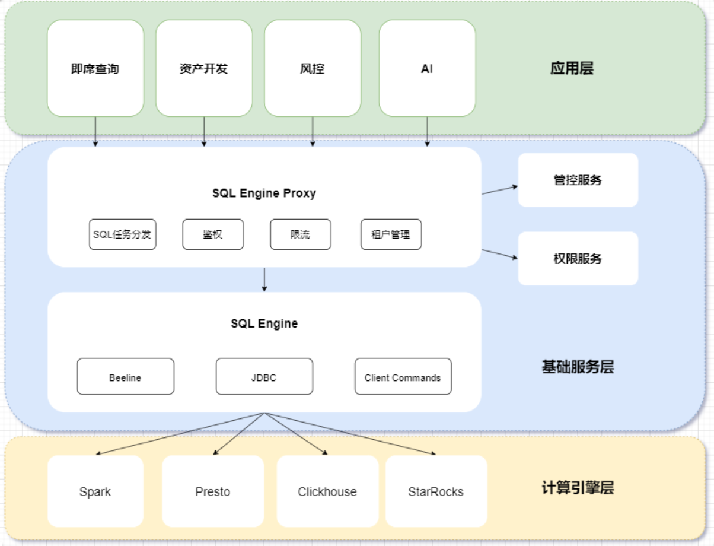

### 2 核心功能

#### 2.1 策略加载器

**1、类结构**

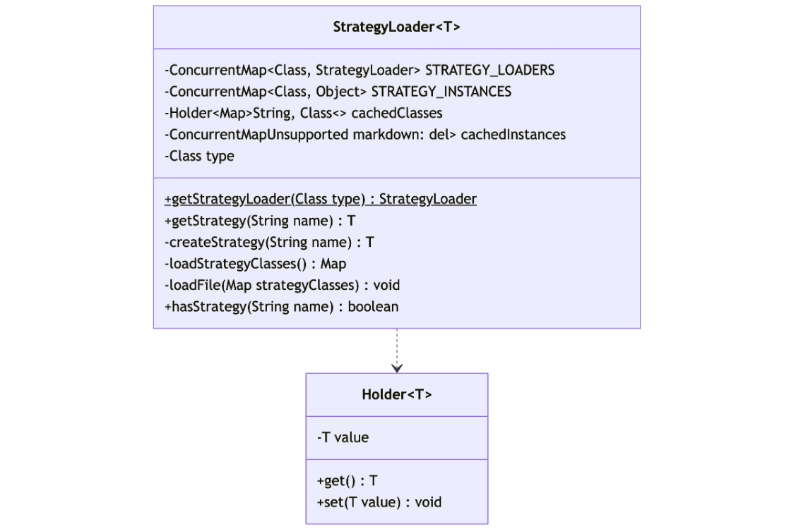

**2、策略加载流程**

#### 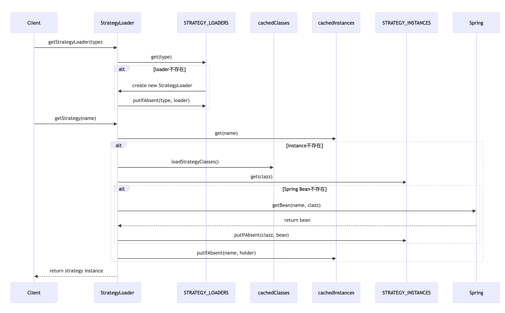2.2 线程任务

 

**2.2.1 Sql任务轮询线程**

**流程图**

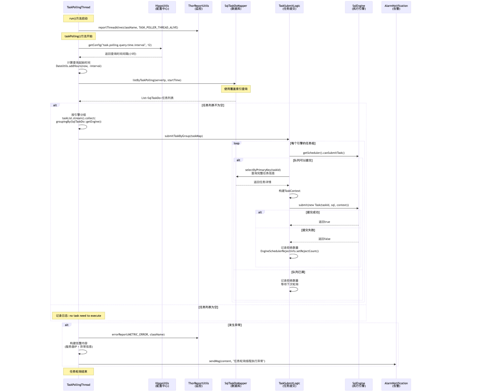

1. 上报线程存活状态

```java
// 上报线程存活状态
ThorReportUtils.reportThreadAlive(this.getClass().getName(), 
       ReportMetricConstants.TASK_POLLER_THREAD_ALIVE, MapUtils.EMPTY_MAP);
```

2. 任务查询

```java
   // 获取查询时间间隔配置
   int queryTimeInterval = HippoUtils.getConfig("task.polling.query.time.interval", 12);
   // 计算查询起始时间
   Date startTime = DateUtils.addHours(new Date(), -queryTimeInterval);
   // 查询待执行任务列表
   List<SqlTaskDo> taskList = sqlTaskDoMapper.listByTaskPolling(serverIp, startTime);
```

3. 任务分组

```java
   // 按执行引擎分组
   Map<String, List<SqlTaskDo>> taskMap = taskList.stream()
       .collect(Collectors.groupingBy(SqlTaskDo::getEngine));
```

4. 任务提交流程

```java
   // 遍历每个引擎的任务组
   taskMap.forEach((engineName, taskList) -> {
       SqlEngine sqlEngine = StrategyLoader.getStrategy(engineName);
       
       // 检查队列状态
       if (!sqlEngine.getScheduler().canSubmitTask()) {
           // 记录拒绝数量
           EngineSchedulerRejectInfo.setRejectCount(engineName, size);
           return;
       }
       
       // 查询完整任务信息
       SqlTaskDo taskDetail = sqlTaskDoMapper.selectByPrimaryKey(taskId);
       
       // 提交任务
       Task task = new Task(taskDetail.getIndex(), taskDetail.getSql(), 
           buildTaskContext(taskDetail), sqlEngine);
       boolean success = sqlEngine.getScheduler().submit(task);
   });
```

 

**2.2.2 上报服务器信息**

**流程图**

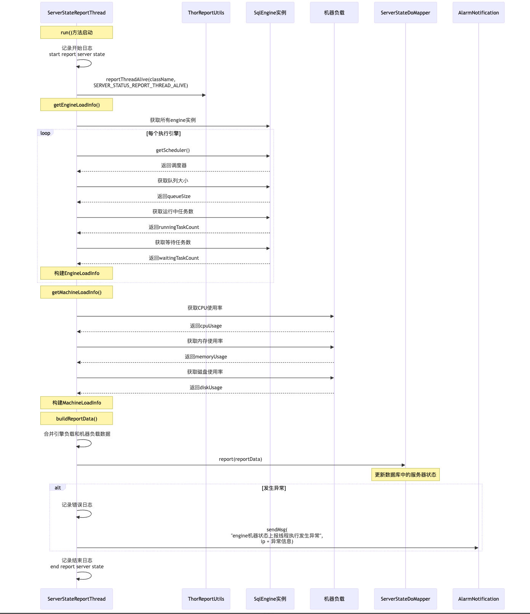1. 上报线程状态

```java
   log.info("start report server state.");
   ThorReportUtils.reportThreadAlive(this.getClass().getName(), 
       ReportMetricConstants.SERVER_STATUS_REPORT_THREAD_ALIVE, MapUtils.EMPTY_MAP);
```

 

2. 获取引擎负载信息(队列大小、运行中任务数、等待任务数)

```java
    Map<String, EngineLoadInfo> map = new HashMap<>();
        if (Objects.nonNull(engineMap)) {
            engineMap.forEach((k, v) -> {
                SchedulerStateInfo schedulerStateInfo = v.getScheduler().getSchedulerState();
                if (Objects.isNull(schedulerStateInfo)) {
                    return;
                }


                EngineLoadInfo engineLoadInfo = new EngineLoadInfo();
                engineLoadInfo.setRunning(schedulerStateInfo.getRunningTaskCount());
                // 队列中排队的数量 + 拒绝提交的数据（队列已满）
                engineLoadInfo.setWaiting(schedulerStateInfo.getWaitingTaskCount() + EngineSchedulerRejectInfo.getRejectCount(k));
                engineLoadInfo.setRemainQueue(schedulerStateInfo.getRemainCount());
                map.put(k, engineLoadInfo);
            });
        }
```

3. 获取当前机器负载(CPU使用率、内存使用率、磁盘使用率)

```java
        MachineLoadInfo machineLoadInfo = new MachineLoadInfo();
        machineLoadInfo.setCpu(OSUtils.cpuUsage());
        machineLoadInfo.setMemory(OSUtils.memoryUsage());
        machineLoadInfo.setAvailableMemory(OSUtils.availablePhysicalMemorySize());
        return machineLoadInfo;
```

4. 上报信息

```java
serverStateDoMapper.updateByReport(ServerStateDo.builder()
                .ip(InetAddressUtils.getIp())
                .loadInfo(reportData)
                .status(ServerStatus.ONLINE.getStatus())
                .build());
```

 

**2.2.3 引擎故障任务转移**

**流程图**

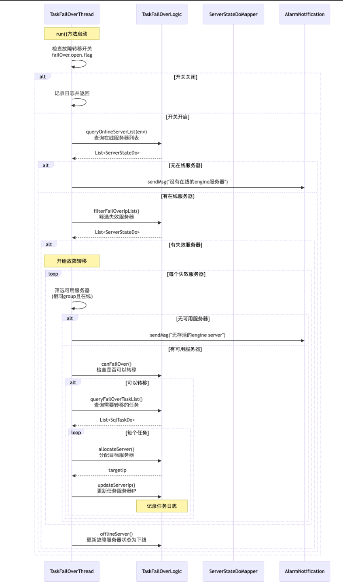

1. 初始化和配置检查

```java
// 检查故障转移开关
if (!HippoUtils.getConfig("failOver.open.flag", true)) {
    log.info("故障转移功能暂时关闭.");
    return;
}
```

2. 服务器状态检查

```java
// 查询在线服务器列表
List<ServerStateDo> onlineServerList = taskFailOverLogic.queryOnlineServerList(env);
// 筛选失效服务器
List<ServerStateDo> failureServerList = taskFailOverLogic.filterFailOverIpList(onlineServerList);
```

3. 故障转移主流程(对失效的服务器)

```java
     failureServerList.forEach(failureServer -> {
         // 1. 筛选可用服务器（相同group且在线）
         List<ServerStateDo> aliveServerList = 筛选逻辑...
         
         // 2. 检查是否可以执行故障转移
         if (!taskFailOverLogic.canFailOver(failureServer, aliveServerList)) {
             return;
         }
         
         // 3. 查询需要转移的任务
         List<SqlTaskDo> failOverTaskList = taskFailOverLogic.queryFailOverTaskList(failureServer.getIp());
     });
```

4. 任务转移

```java
     failOverTaskList.forEach(failureTask -> {
         // 1. 分配目标服务器
         String targetIp = taskFailOverLogic.allocateServer(failureTask, aliveServerList, engineLoadList);
         
         // 2. 更新任务的服务器IP
         taskFailOverLogic.updateServerIp(failureTask.getIndex(), failureServer.getIp(), targetIp);
     });
```

5. 完成处理

```java
// 更新故障服务器状态为下线
taskFailOverLogic.offlineServer(failureServerIpList);
```

 

**2.2.4 任务恢复线程**

**流程图**

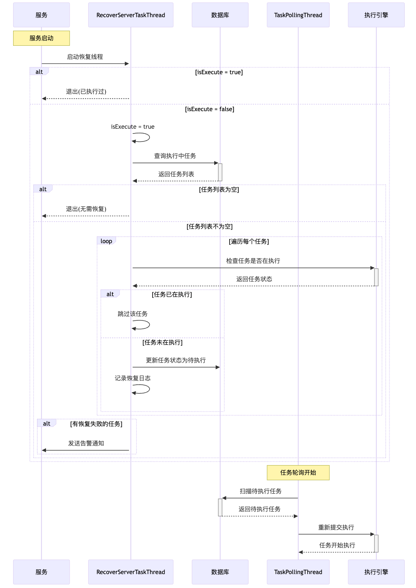

1. 查询当前Server中，执行中的任务

```java
 List<SqlTaskDo> recoverTaskList = taskRecordLogic.queryRunningTaskList();
            if (CollectionUtils.isEmpty(recoverTaskList)) {
                log.info("没有需要恢复的执行中的任务.");
                return;
            }
```

2. 恢复重启前还在执行中的任务

```java
SqlEngine sqlEngine = StrategyLoader.getStrategyLoader(SqlEngine.class).getStrategy(recoverTask.getEngine());
                Task runningTask = sqlEngine.getScheduler().getTask(recoverTask.getIndex());
                if (Objects.nonNull(runningTask)) {
                    log.info("任务已经在执行中,无需恢复.taskId:{}", recoverTask.getIndex());
                    return;
                }
                taskRecordLogic.updateByRecover(recoverTask.getIndex());
```

3. 将执行中的任务状态改为待执行

```java
boolean success = changeTaskStatus(taskId, TaskStatus.RUNNING, TaskStatus.READY,TaskLogDescConstants.TASK_RECOVER);
```

 

**2.2.5 任务检查线程**

**流程图**

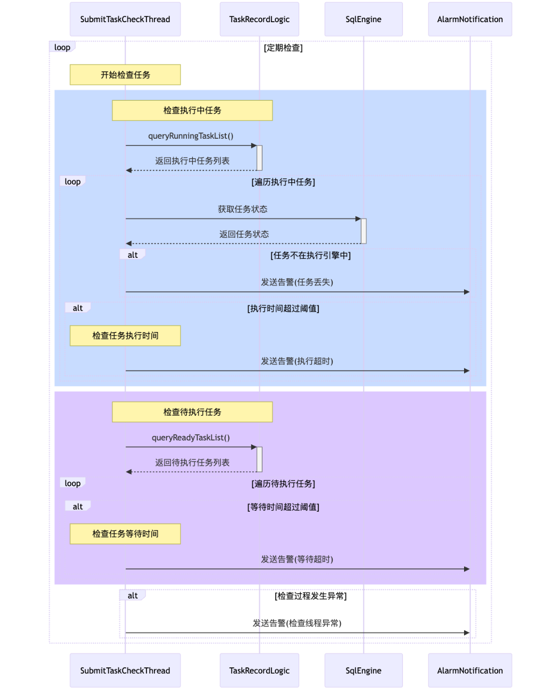

1. 执行中任务检查

- 验证任务是否在执行引擎列表中
- 检验任务执行时间是否超过配置阈值

```java
      if (isRunning) {
                    SqlEngine sqlEngine = StrategyLoader.getStrategyLoader(SqlEngine.class).getStrategy(task.getEngine());
                    Task runningTask = sqlEngine.getScheduler().getTask(task.getIndex());
                    if (Objects.isNull(runningTask)) {
                        String warningMsg = "引擎执行队列中没有找到sql任务,需要核查任务是否正常执行.taskId:" + task.getIndex();
                        log.warn(warningMsg);
                        // 发送告警消息
                        alarmNotificationLogic.sendMsg(warningMsg, "运行中任务检测告警");
                    }
                }
```

2. 待执行任务检查

- 对每个任务进行检查时间是否超过配置阈值

```java
                int maxMinutes = submitTimeConfig.getOrDefault(task.getEngine(), DEFAULT_MAX_SUBMIT_MINUTES);
                long submitMinutes = DateUtil.between(new Date(), task.getSubmitTime(), DateUnit.MINUTE);
                if (submitMinutes > maxMinutes) {
                    String warningMsg = "sql任务已经提交" + submitMinutes + "分钟,仍然没有执行完成.taskId:" + task.getIndex();
                    log.warn(warningMsg);
                    // 发送告警消息
                    alarmNotificationLogic.sendMsg(warningMsg, "运行中任务检测告警");
                }
```

 

**2.2.6 任务执行状态监控线程**

1. 主要职责

```java
@Override
    public void run() {
        while (!Thread.interrupted()
                && !task.isAbort()
                && !task.isFinished()) {
            try {


                Thread.sleep(interval);


                log.debug("start check task execute state.taskId:{}", task.getId());


                Map<String, String> tagExtendInfos = new HashMap<>();
                tagExtendInfos.put("taskId", String.valueOf(task.getId()));
                ThorReportUtils.reportThreadAlive(this.getClass().getName(),
                        ReportMetricConstants.TASK_EXECUTION_STATUS_THREAD_ALIVE, tagExtendInfos);


                // 检测任务运行状态
                executionCheck();


                // 处理任务事件
                taskEventHandle();


                // 保存任务进度
                taskProgressHandle();
            } catch (InterruptedException ie) {
                /* ignored */
                break;
            } catch (Exception e) {
                log.error("check task execute state error.", e);
            }


        }


        log.info("check task execute state finished.taskId:{}", task.getId());
    }
```

2. 执行状态检测

```java
private void executionCheck() {
        Task runningTask = task.getEngine().getScheduler().getTask(task.getId());
        if (Objects.isNull(runningTask)) {
            String msg = "引擎执行队列中没有找到sql任务,需要核查任务是否正常执行.taskId:" + task.getId();
            log.warn(msg);
            // 发送告警消息
            alarmNotificationLogic.sendMsg(msg, "任务运行状态检测告警");
        }
    }
```

4. 处理任务事件

```java
private void executionCheck() {
        Task runningTask = task.getEngine().getScheduler().getTask(task.getId());
        if (Objects.isNull(runningTask)) {
            String msg = "引擎执行队列中没有找到sql任务,需要核查任务是否正常执行.taskId:" + task.getId();
            log.warn(msg);
            // 发送告警消息
            alarmNotificationLogic.sendMsg(msg, "任务运行状态检测告警");
        }
    }
```

5. 保存任务进度

```java
private void taskProgressHandle() {
        try {
            double process = task.getEngine().getProcess(task.getTaskContext());
            if (lastProcess != process) {
                log.info("保存sql任务处理进度.taskId:{},process:{}", task.getId(), process);
                taskEventLogic.updateTaskProgress(task.getId(), process);
                lastProcess = process;
            }
        } catch (Exception e) {
            log.error("sql任务执行进度查询失败.taskId:{}", task.getId(), e);
        }
    }
```

#### 2.3 调度器

**2.3.1 继承关系**

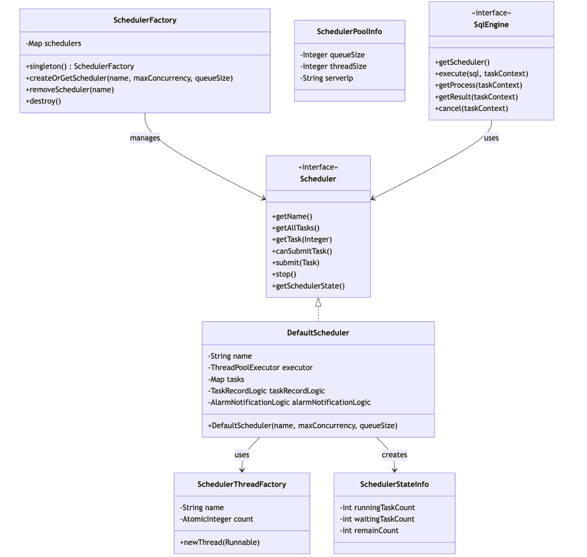

**2.3.2 类之间的关系说明**

1、Scheduler 与 DefaultScheduler

- Scheduler 是顶层接口，定义调度器的基本行为
- DefaultScheduler 是 Scheduler 的具体实现
- DefaultScheduler 使用线程池实现任务调度

2、SchedulerFactory 与 Scheduler

- SchedulerFactory 是单例工厂类
- 负责创建和管理所有的 Scheduler 实例
- 维护 scheduler 名称到实例的映射关系

3、DefaultScheduler 与 SchedulerThreadFactory

- DefaultScheduler 在创建线程池时使用 SchedulerThreadFactory
- SchedulerThreadFactory 负责创建和命名工作线程

4、SqlEngine 与 Scheduler

- 每个 SqlEngine 实现都关联一个 Scheduler
- 通过 getScheduler() 方法获取对应的调度器
- 调度器负责该引擎的任务调度和执行

5、SchedulerStateInfo 与 DefaultScheduler

- SchedulerStateInfo 记录调度器运行状态
- DefaultScheduler 通过 getSchedulerState() 返回状态信息

6、SchedulerPoolInfo 与 Scheduler

- SchedulerPoolInfo 定义调度器的配置信息
- 包括队列大小、线程数等参数
- 用于初始化和配置调度器

**2.3.3 SchedulerThreadFactory**

```java
package com.fenqile.bigdata.platform.sql.engine.engine.scheduler;


import java.util.concurrent.ThreadFactory;
import java.util.concurrent.atomic.AtomicInteger;


/**
 * 设置线程工厂名称，进而为线程设置名称
 */
public class SchedulerThreadFactory implements ThreadFactory {


    private String name;


    private AtomicInteger count = new AtomicInteger(1);


    public SchedulerThreadFactory(String name) {
        this.name = name;
    }


    @Override
    public Thread newThread(Runnable r) {
        Thread thread = new Thread(r);
        thread.setName(name + count.getAndIncrement());
        return thread;
    }
}
```

**2.3.4 Scheduler**

```java
package com.fenqile.bigdata.platform.sql.engine.engine.scheduler;


import com.fenqile.bigdata.platform.sql.engine.engine.Task;
import com.fenqile.bigdata.platform.sql.engine.bean.engine.SchedulerStateInfo;


import java.util.List;
/**
 * 顶层接口，用于定义调度器的基本行为
 */
public interface Scheduler {


    /**
     * 获取scheduler的名称
     */
    String getName();


    /**
     * 获取分配给scheduler的任务列表
     */
    List<Task> getAllTasks();


    /**
     * 查询分配给scheduler的任务
     */
    Task getTask(Integer taskId);


    /**
     * 判断scheduler是否可以提交任务
     */
    boolean canSubmitTask();


    /**
     * 提交sql任务
     */
    boolean submit(Task task);


    /**
     * 停止
     */
    void stop();


    /**
     * 获取scheduler的运行状态信息
     */
    SchedulerStateInfo getSchedulerState();


}
```

**2.3.5 DefaultScheduler**

```java
package com.fenqile.bigdata.platform.sql.engine.engine.scheduler;
import com.fenqile.bigdata.platform.sql.engine.bean.engine.ExecuteResult;
import com.fenqile.bigdata.platform.sql.engine.bean.engine.SchedulerStateInfo;
import com.fenqile.bigdata.platform.sql.engine.common.constants.AppConstants;
import com.fenqile.bigdata.platform.sql.engine.constants.TaskLogDescConstants;
import com.fenqile.bigdata.platform.sql.engine.constants.TaskStatus;
import com.fenqile.bigdata.platform.sql.engine.engine.Task;
import com.fenqile.bigdata.platform.sql.engine.exception.BizErrorCode;
import com.fenqile.bigdata.platform.sql.engine.logic.AlarmNotificationLogic;
import com.fenqile.bigdata.platform.sql.engine.logic.TaskRecordLogic;
import com.fenqile.bigdata.platform.sql.engine.utils.ExecutorUtil;
import com.fenqile.utils.spring.SpringContextUtil;
import lombok.extern.slf4j.Slf4j;
import org.apache.commons.lang3.StringUtils;
import org.apache.commons.lang3.exception.ExceptionUtils;
import java.util.ArrayList;
import java.util.List;
import java.util.Map;
import java.util.concurrent.*;
/**
 * 默认调度器实现类
 * 负责管理任务的提交、执行和状态跟踪
 */
@Slf4j
public class DefaultScheduler implements Scheduler {
    /** 调度器名称 */
    private String name;
    /** 线程池执行器，用于执行任务 */
    private ThreadPoolExecutor executor;
    /** 终止标志，用于优雅关闭 */
    private volatile boolean terminate = false;
    /** 当前运行的任务映射表，key为任务ID，value为任务对象 */
    private Map<Integer, Task> tasks = new ConcurrentHashMap<>();
    /** 任务记录逻辑处理类 */
    private TaskRecordLogic taskRecordLogic;
    /** 告警通知逻辑处理类 */
    private AlarmNotificationLogic alarmNotificationLogic;
    /**
     * 构造函数
     * @param name           调度器名称
     * @param maxConcurrency 最大并发数
     * @param queueSize      队列大小
     */
    public DefaultScheduler(String name, int maxConcurrency, int queueSize) {
        this.name = name;
        // 创建固定大小的线程池，使用自定义线程工厂
        this.executor = new ThreadPoolExecutor(maxConcurrency, maxConcurrency, 0L, TimeUnit.MILLISECONDS,
                new LinkedBlockingQueue<Runnable>(queueSize), new SchedulerThreadFactory("DefaultScheduler-" + name));
        // 从Spring容器中获取依赖的Bean
        taskRecordLogic = SpringContextUtil.getApplicationContext().getBean(TaskRecordLogic.class);
        alarmNotificationLogic = SpringContextUtil.getApplicationContext().getBean(AlarmNotificationLogic.class);
    }
    @Override
    public String getName() {
        return name;
    }
    @Override
    public List<Task> getAllTasks() {
        // 返回当前所有运行任务的副本，避免并发修改
        return new ArrayList<>(tasks.values());
    }
    @Override
    public Task getTask(Integer taskId) {
        return tasks.get(taskId);
    }
    @Override
    public boolean canSubmitTask() {
        // 检查队列是否还有剩余容量
        return executor.getQueue().remainingCapacity() > 0;
    }
    @Override
    public boolean submit(Task task) {
        // 检查调度器是否已终止
        if (terminate) {
            log.info("scheduler has been terminated, task {} will not be submitted", task.getId());
            return false;
        }
        boolean isSubmit = false;
        // 设置任务状态为就绪
        task.setStatus(TaskStatus.READY);
        try {
            // 提交任务到线程池执行
            executor.execute(() -> runTask(task));
            isSubmit = true;
        } catch (RejectedExecutionException e) {
            // 线程池拒绝执行时的异常处理
            log.error("rejected submit task {}", task.getId(), e);
        }
        return isSubmit;
    }
    @Override
    public void stop() {
        // 设置终止标志
        terminate = true;
        // 标记所有任务为中断状态
        tasks.forEach((taskId, task) -> task.setAbort(true));
        // 清空任务列表
        tasks.clear();
        // 优雅关闭线程池，等待最多30秒
        ExecutorUtil.softShutdown(name, executor, 30, TimeUnit.SECONDS);
    }
    /**
     * 执行任务的核心方法
     * 
     * @param task 要执行的任务
     */
    private void runTask(Task task) {
        try {
            // 检查任务是否被中断
            if (task.isAbort()) {
                log.info("task is aborted.taskId:{}", task.getId());
                return;
            }
            log.info("task started by scheduler.taskId:{},scheduler:{}", task.getId(), name);
            // 尝试将任务状态从就绪更新为运行中
            if (!taskRecordLogic.changeTaskStatus(task.getId(), TaskStatus.READY,
                    TaskStatus.RUNNING, TaskLogDescConstants.TASK_RUNNING)) {
                log.info("任务状态更新失败,可能已经被执行.taskId:{}", task.getId());
                return;
            }
            // 更新任务状态并添加到运行任务列表
            task.setStatus(TaskStatus.RUNNING);
            tasks.put(task.getId(), task);
            // 执行任务并获取结果
            ExecuteResult executeResult = task.runTask();
            task.setStatus(executeResult.getTaskStatus());
            // 保存任务运行结果（带重试机制）
            saveTaskResultWithRetry(task, executeResult, 0);
            log.info("task scheduler finished.taskId:{},scheduler:{}", task.getId(), name);
        } catch (Throwable e) {
            // 任务执行异常处理
            log.error("scheduler runTask error.taskId:{}", task.getId(), e);
            task.setStatus(TaskStatus.ERROR);
            // 创建失败结果对象
            ExecuteResult failedResult = new ExecuteResult();
            failedResult.setTaskStatus(TaskStatus.ERROR);
            failedResult
                    .setErrorMsg(String.format(BizErrorCode.SYSTEM_EXCEPTION.msg(), ExceptionUtils.getStackTrace(e)));
            // 保存失败结果
            saveTaskResultWithRetry(task, failedResult, 0);
        } finally {
            // 清理任务状态
            task.setAbort(false);
            tasks.remove(task.getId());
        }
    }
    /**
     * 保存任务运行结果，如果失败了会进行重试，最多尝试3次
     * 最终仍然失败需要发送告警通知研发定位问题
     * 
     * @param task          任务对象
     * @param executeResult 执行结果
     * @param retryTimes    当前重试次数
     */
    private void saveTaskResultWithRetry(Task task, ExecuteResult executeResult, int retryTimes) {
        try {
            log.info("save task result with retry.taskId:{},retryTimes:{}", task.getId(), retryTimes);
            // 保存sql任务运行结果到数据库
            taskRecordLogic.saveSqlResult(task, executeResult);
            // 发送任务运行结果MQ消息
            taskRecordLogic.sendResultMQ(task, executeResult);
        } catch (Exception e) {
            log.error("save task result error.taskId:{}", task.getId(), e);
            // 重试逻辑：最多重试3次
            if (++retryTimes < 3) {
                saveTaskResultWithRetry(task, executeResult, retryTimes);
            } else {
                // 重试3次后仍然失败，发送告警通知
                String content = "保存任务运行结果异常.taskId:" + task.getId() + ",异常信息:"
                        + StringUtils.left(ExceptionUtils.getStackTrace(e), AppConstants.MAX_EXCEPTION_LENGTH);
                alarmNotificationLogic.sendMsg(content, "保存任务运行结果异常");
            }
        }
    }
    @Override
    public SchedulerStateInfo getSchedulerState() {
        // 获取当前运行的任务数量
        int runningTaskCount = executor.getActiveCount();
        // 构建调度器状态信息
        SchedulerStateInfo schedulerStateInfo = new SchedulerStateInfo();
        schedulerStateInfo.setRunningTaskCount(runningTaskCount);
        schedulerStateInfo.setWaitingTaskCount(executor.getQueue().size());
        // 注释掉的代码：计算剩余可执行任务数（基于线程池大小）
        // schedulerStateInfo.setRemainCount(Math.max(executor.getMaximumPoolSize() -
        // runningTaskCount, 0));
        // 当前实现：返回队列剩余容量
        schedulerStateInfo.setRemainCount(executor.getQueue().remainingCapacity());
        return schedulerStateInfo;
    }
}
```

**2.3.6 SchedulerFactory**

```java
package com.fenqile.bigdata.platform.sql.engine.engine.scheduler;


import lombok.extern.slf4j.Slf4j;
import java.util.HashMap;
import java.util.Map;


/**
 * SchedulerFactory 是单例工厂类
 * 负责创建和管理所有的 Scheduler 实例
 * 维护 scheduler 名称到实例的映射关系
 */
@Slf4j
public class SchedulerFactory {


    protected Map<String, Scheduler> schedulers = new HashMap<>();


    private static final class InstanceHolder {
        private static final SchedulerFactory INSTANCE = new SchedulerFactory();
    }


    public static SchedulerFactory singleton() {
        return InstanceHolder.INSTANCE;
    }


    private SchedulerFactory() {


    }


    public Scheduler createOrGetScheduler(String name, int maxConcurrency, int queueSize) {
        synchronized (schedulers) {
            if (!schedulers.containsKey(name)) {
                log.info("Create Scheduler:{} with maxConcurrency:{},queueSize:{}", name, maxConcurrency, queueSize);
                DefaultScheduler scheduler = new DefaultScheduler(name, maxConcurrency, queueSize);
                schedulers.put(name, scheduler);
            }


            return schedulers.get(name);
        }
    }


    public void removeScheduler(String name) {
        synchronized (schedulers) {
            log.info("Remove scheduler: {}", name);
            Scheduler scheduler = schedulers.remove(name);
            if (scheduler != null) {
                scheduler.stop();
            }
        }
    }


    public void destroy() {
        log.info("Destroy all Schedulers");
        synchronized (schedulers) {
            // stop all child thread of schedulers
            for (Map.Entry<String, Scheduler> scheduler : schedulers.entrySet()) {
                log.info("Stopping Scheduler {}", scheduler.getKey());
                scheduler.getValue().stop();
            }
            schedulers.clear();
        }
    }
}
```

#### 2.4 任务状态变更

1. 状态定义

```java
public enum TaskStatus {
    READY(0, "待执行"),
    RUNNING(1, "执行中"),
    FAIL_OVER(2, "故障转移"),
    CANCEL(3, "取消"),
    ERROR(4, "失败"),
    SUCCESS(5, "成功");
}
```

2. READY -> RUNNING

```java
   // DefaultScheduler.java
   if (!taskRecordLogic.changeTaskStatus(task.getId(), TaskStatus.READY,
           TaskStatus.RUNNING, TaskLogDescConstants.TASK_RUNNING)) {
       return;
   }
```

3. RUNNING -> SUCCESS/ERROR

```java
   // TaskRecordLogic.java
   boolean changeStatusResult = changeTaskStatus(
       task.getId(), TaskStatus.RUNNING, executeResult.getTaskStatus(), description);
```

4. RUNNING -> FAIL_OVER -> READY

```java
   // TaskFailOverLogic.java
   public void updateServerIp(Integer taskId, String sourceIp, String targetIp) {
       sqlTaskDoMapper.updateByFailOver(taskId, sourceIp, targetIp);
       // 状态变为FAIL_OVER
       taskDetail.setStatus(TaskStatus.FAIL_OVER.getStatus());
   }
```

5. 状态变更的保护机制

```java
   public boolean changeTaskStatus(Integer taskId, TaskStatus sourceStatus, TaskStatus targetStatus, String description) {
       // 1. 检查原状态是否匹配
       if (sourceStatus != TaskStatus.formStatus(taskDo.getStatus())) {
           return false;
       }
       
       // 2. 更新状态
       int updateResult = sqlTaskDoMapper.updateStatus(taskId, SERVER_IP, 
           sourceStatus.getStatus(), targetStatus.getStatus());
       
       // 3. 记录状态变更日志
       saveTaskLog(taskDo, description);
   }
```

#### 2.5 SQL引擎

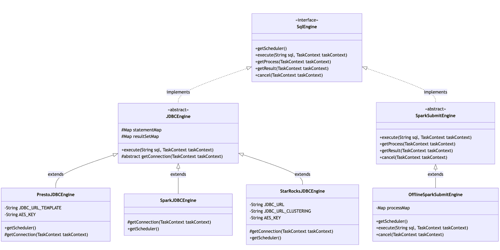

### 3 主要接口

#### 3.1 提交任务（推模式）

**接口**

```java
CommonRespVo deliverTask(Integer taskId, String userName);
```

**请求参数**

```java
    private Integer taskId;
    private String userName;
```

**返回参数**

```java
    protected String code;
    protected String msg;
```

**流程图**

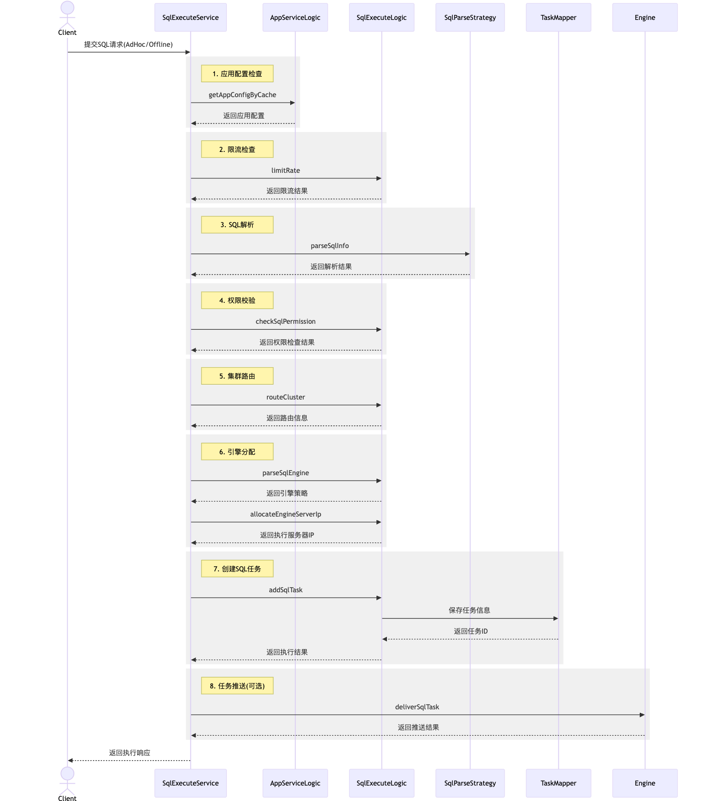

**代码解析**

**1、 SqlTaskServiceImpl.deliverTask**

```java
 /**
     * 投递sql任务到engine执行-推模式
     * 推模式下处理失败时，会发送告警消息通知研发，上层业务可以重试或忽略
     * 失败的情况下最终会由拉模式进行兜底，确保任务执行
     *
     * @param taskId   任务ID
     * @param userName 用户名
     * @return 通用响应对象
     */
    @Override
    public CommonRespVo deliverTask(Integer taskId, String userName) {
        // 参数校验
        log.info("call deliverTask.taskId:{}, userName:{}", taskId, userName);
        if (Objects.isNull(taskId)) {
            log.info("deliverTask taskId is null.");
            return ResponseUtil.exceptionRespVo(BizErrorCode.REQ_PARAM_NULL_ERROR);
        }


        // 获取任务信息 剔除SQL 内容
        SqlTaskDo sqlTask = taskRecordLogic.getTaskById(taskId);
        if (Objects.isNull(sqlTask)) {
            log.info("deliverTask sqlTask is null.");
            return ResponseUtil.exceptionRespVo(BizErrorCode.TASK_IS_NULL_ERROR);
        }


        // 校验任务所属用户
        if (!StringUtils.equals(sqlTask.getUserName(), userName)) {
            log.info("deliverTask userName is not match.taskUserName:{},userName:{}", sqlTask.getUserName(), userName);
            return ResponseUtil.exceptionRespVo(BizErrorCode.USER_NOT_MATCH_ERROR);
        }


        try {
            // 提交任务到执行引擎的队列执行
            taskSubmitLogic.submitSingleTask(sqlTask);
            return ResponseUtil.successCommonRespVo();
        } catch (Exception e) {
            log.error("call deliverTask error.", e);
            return ResponseUtil.exceptionRespVo(e);
        }
    }
```

**2、TaskSubmitLogic.doSubmit**

```java
/**
     * 提交sql任务
     * 推/拉模式最终都会调用这个方法提交sql任务到对应引擎的队列中排队执行
     * 并发情况下如果出现同时处理一个任务也不会造成重复运行，在task的调用逻辑里有使用乐观锁防并发
     */
    private void doSubmit(List<SqlTaskDo> taskList, String engineName) {
        if (CollectionUtils.isEmpty(taskList)) {
            return;
        }


        // 对任务列表排序，优先处理早提交的任务
        taskList.sort(Comparator.comparing(SqlTaskDo::getIndex));


        SqlEngine sqlEngine = StrategyLoader.getStrategyLoader(SqlEngine.class).getStrategy(engineName);
        int submitCount = 0;
        for (SqlTaskDo sqlTask : taskList) {
            try {
                if (!sqlEngine.getScheduler().canSubmitTask()) {
                    log.info("执行引擎队列已满,暂时无法提交任务,待下次轮询再尝试提交.engineName:{}", engineName);
                    // 如果队列满了被拒绝,需要记录拒绝的数量,在机器上报的时候方便统计等待的任务数,避免频繁查询DB
                    EngineSchedulerRejectInfo.setRejectCount(engineName, taskList.size() - submitCount);
                    break;
                }


                if (Objects.nonNull(sqlEngine.getScheduler().getTask(sqlTask.getIndex()))) {
                    log.info("sql任务已经提交到执行引擎.taskId:{}", sqlTask.getIndex());
                    submitCount++;
                    continue;
                }


                // 由于之前查询列表的时候为了性能考虑使用覆盖索引查询索引的字段，所以这里需要重新查询出详细的配置数据
                SqlTaskDo taskDetail = sqlTaskDoMapper.selectByPrimaryKey(sqlTask.getIndex());


                // 提交任务
                Task task = new Task(taskDetail.getIndex(),
                        taskDetail.getSql(), buildTaskContext(taskDetail), sqlEngine);
                boolean success = sqlEngine.getScheduler().submit(task);
                if (!success) {
                    log.info("执行引擎暂时无法提交任务,待下次轮询再尝试提交.engineName:{}", engineName);
                    // 如果队列满了被拒绝,需要记录拒绝的数量,在机器上报的时候方便统计等待的任务数,避免频繁查询DB
                    EngineSchedulerRejectInfo.setRejectCount(engineName, taskList.size() - submitCount);
                    break;
                }


                // 记录提及成功的数量
                submitCount++;
            } catch (Exception e) {
                log.error("提交任务异常.", e);
                // 发送告警消息通知研发
                String content = "执行引擎提交任务异常.taskId:" + sqlTask.getIndex()
                        + ",异常信息:" + StringUtils.left(ExceptionUtils.getStackTrace(e), AppConstants.MAX_EXCEPTION_LENGTH);
                alarmNotificationLogic.sendMsg(content, "执行引擎提交任务异常");
            }
        }
    }
```

### 4 数据库表设计

#### 4.1 应用表 (t_app) 

```sql
CREATE TABLE `t_app` (
`Findex` int(11) NOT NULL AUTO_INCREMENT COMMENT '自增长主键',
`Fname` varchar(32) NOT NULL DEFAULT '' COMMENT '业务方标识',
`Fsecret` varchar(32) NOT NULL DEFAULT '' COMMENT '业务方secret',
`Fstrategy` varchar(4096) NOT NULL DEFAULT '' COMMENT '业务方的策略配置，比如权限验证、限流等，JSON格式',
`Fcreate_user` varchar(32) NOT NULL DEFAULT '' COMMENT '创建用户',
`Fmodify_user` varchar(32) NOT NULL DEFAULT '' COMMENT '修改用户',
`Fcreate_time` datetime NOT NULL DEFAULT '1970-01-01 00:00:00' COMMENT '创建时间',
`Fmodify_time` datetime NOT NULL DEFAULT '1970-01-01 00:00:00' COMMENT '修改时间',
`Fversion` int(11) NOT NULL DEFAULT '0' COMMENT '版本',
PRIMARY KEY (`Findex`),
UNIQUE KEY `uni_Fname` (`Fname`) USING BTREE,
KEY `idx_Fmodify_time` (`Fmodify_time`) USING BTREE
) ENGINE=InnoDB AUTO_INCREMENT=7 DEFAULT CHARSET=utf8 COMMENT='大数据统一查询服务|业务方配置表|willzhang|20240425'
```

#### 4.2 请求日志表 (t_req_log)

```sql
CREATE TABLE `t_req_log` (
`Findex` int(11) NOT NULL AUTO_INCREMENT COMMENT '自增长主键',
`Fapp_name` varchar(32) NOT NULL DEFAULT '' COMMENT '业务方标识',
`Fuser_name` varchar(64) NOT NULL DEFAULT '' COMMENT '请求用户',
`Fservice` varchar(255) NOT NULL DEFAULT '' COMMENT '请求调用的接口',
`Fip` varchar(32) NOT NULL DEFAULT '' COMMENT '请求方ip',
`Fparams` longtext COMMENT '请求入参',
`Fresponse` text COMMENT '请求出参',
`Fcost_time` int(11) NOT NULL DEFAULT '0' COMMENT '接口耗时，单位毫秒',
`Fcreate_time` datetime NOT NULL DEFAULT '1970-01-01 00:00:00' COMMENT '创建时间',
`Fmodify_time` datetime NOT NULL DEFAULT '1970-01-01 00:00:00' COMMENT '修改时间',
`Fversion` int(11) NOT NULL DEFAULT '0' COMMENT '版本',
PRIMARY KEY (`Findex`),
KEY `idx_Fname` (`Fuser_name`) USING BTREE,
KEY `idx_Fmodify_time` (`Fmodify_time`) USING BTREE
) ENGINE=InnoDB AUTO_INCREMENT=1994657 DEFAULT CHARSET=utf8 COMMENT='大数据统一查询服务|请求日志记录表|willzhang|20240425'
```

#### 4.3 服务器状态表 （t_server_state）

```sql
CREATE TABLE `t_server_state` (
`Findex` int(11) NOT NULL AUTO_INCREMENT COMMENT '自增长主键',
`Fip` varchar(32) NOT NULL DEFAULT '' COMMENT '服务ip',
`Fenv` varchar(16) NOT NULL DEFAULT '' COMMENT '环境标识',
`Fgroup` varchar(32) NOT NULL DEFAULT '' COMMENT '服务分组',
`Freport_time` datetime NOT NULL DEFAULT '1970-01-01 00:00:00' COMMENT '上报时间',
`Fload_info` varchar(4096) NOT NULL DEFAULT '' COMMENT '队列负载信息，JSON格式',
`Fstatus` tinyint(3) NOT NULL DEFAULT '0' COMMENT '状态 0-下线 1-在线',
`Fcreate_time` datetime NOT NULL DEFAULT '1970-01-01 00:00:00' COMMENT '创建时间',
`Fmodify_time` datetime NOT NULL DEFAULT '1970-01-01 00:00:00' COMMENT '修改时间',
`Fversion` int(11) NOT NULL DEFAULT '0' COMMENT '版本',
PRIMARY KEY (`Findex`),
UNIQUE KEY `uni_Fip` (`Fip`) USING BTREE,
KEY `idx_Fmodify_time` (`Fmodify_time`) USING BTREE
) ENGINE=InnoDB AUTO_INCREMENT=8 DEFAULT CHARSET=utf8 COMMENT='大数据统一查询服务|服务器状态信息表|willzhang|20240425'
```

#### 4.4 SQL任务表（t_sql_task）

```sql
CREATE TABLE `t_sql_task` (
`Findex` int(11) NOT NULL AUTO_INCREMENT COMMENT '自增长主键',
`Fapp_name` varchar(32) NOT NULL DEFAULT '' COMMENT '业务方标识',
`Fuser_name` varchar(64) NOT NULL DEFAULT '' COMMENT '请求用户',
`Fsql` longtext COMMENT '执行的sql',
`Fstatus` tinyint(3) NOT NULL DEFAULT '0' COMMENT '状态 0-待执行 1-执行中 2-故障转移 3-取消 4-失败 5-成功',
`Fsubmit_time` datetime NOT NULL DEFAULT '1970-01-01 00:00:00' COMMENT '提交时间',
`Fend_time` datetime NOT NULL DEFAULT '1970-01-01 00:00:00' COMMENT '结束时间',
`Fengine` varchar(64) NOT NULL DEFAULT '' COMMENT '执行引擎',
`Fcluster_info` varchar(1024) NOT NULL DEFAULT '' COMMENT '集群信息',
`Fextend_info` varchar(1024) NOT NULL DEFAULT '' COMMENT '扩展信息，比如透传字段等',
`Fserver_ip` varchar(32) NOT NULL DEFAULT '' COMMENT '处理服务ip',
`Fexecution_env_info` varchar(512) NOT NULL DEFAULT '' COMMENT '运行时数据，如进程号等',
`Fretry_times` int(2) NOT NULL DEFAULT '0' COMMENT '重试次数',
`Fmax_retry_times` int(2) NOT NULL DEFAULT '0' COMMENT '最大重试次数',
`Fcreate_time` datetime NOT NULL DEFAULT '1970-01-01 00:00:00' COMMENT '创建时间',
`Fmodify_time` datetime NOT NULL DEFAULT '1970-01-01 00:00:00' COMMENT '修改时间',
`Fversion` int(11) NOT NULL DEFAULT '0' COMMENT '版本',
PRIMARY KEY (`Findex`),
KEY `idx_Fname` (`Fuser_name`) USING BTREE,
KEY `idx_submit` (`Fsubmit_time`,`Fserver_ip`,`Fstatus`,`Fengine`) USING BTREE,
KEY `idx_Fmodify_time` (`Fmodify_time`) USING BTREE
) ENGINE=InnoDB AUTO_INCREMENT=1224250 DEFAULT CHARSET=utf8 COMMENT='大数据统一查询服务|sql任务记录表|willzhang|20240425'
```

#### 4.5 SQL 任务事件表（t_sql_task_event）

```sql
CREATE TABLE `t_sql_task_event` (
`Findex` int(11) NOT NULL AUTO_INCREMENT COMMENT '自增长主键',
`Ftask_id` int(11) NOT NULL DEFAULT '0' COMMENT 'sql任务ID',
`Ftype` tinyint(3) NOT NULL DEFAULT '0' COMMENT '事件类型 1-取消sql运行',
`Fdata` varchar(5120) NOT NULL DEFAULT '' COMMENT '事件数据内容JSON',
`Fstate` tinyint(3) NOT NULL DEFAULT '0' COMMENT '事件状态 0-待执行 1-执行成功 2-执行失败',
`Fcreate_user` varchar(32) NOT NULL DEFAULT '' COMMENT '创建用户',
`Fmodify_user` varchar(32) NOT NULL DEFAULT '' COMMENT '修改用户',
`Fcreate_time` datetime NOT NULL DEFAULT '1970-01-01 00:00:00' COMMENT '创建时间',
`Fmodify_time` datetime NOT NULL DEFAULT '1970-01-01 00:00:00' COMMENT '修改时间',
`Fversion` int(11) NOT NULL DEFAULT '0' COMMENT '版本',
PRIMARY KEY (`Findex`),
KEY `idx_Ftask_id` (`Ftask_id`) USING BTREE,
KEY `idx_Fmodify_time` (`Fmodify_time`) USING BTREE
) ENGINE=InnoDB AUTO_INCREMENT=27911 DEFAULT CHARSET=utf8 COMMENT='大数据统一查询服务|sql任务事件表|willzhang|20240425'
```

#### 4.6 SQL任务日志表（t_sql_task_log）

```sql
CREATE TABLE `t_sql_task_log` (
`Findex` int(11) NOT NULL AUTO_INCREMENT COMMENT '自增长主键',
`Ftask_id` int(11) NOT NULL DEFAULT '0' COMMENT 'sql任务ID',
`Fapp_name` varchar(32) NOT NULL DEFAULT '' COMMENT '业务方标识',
`Fuser_name` varchar(64) NOT NULL DEFAULT '' COMMENT '请求用户',
`Fstatus` tinyint(3) NOT NULL DEFAULT '0' COMMENT '状态 0-待执行 1-执行中 2-故障转移 3-取消 4-失败 5-成功',
`Foper_time` datetime NOT NULL DEFAULT '1970-01-01 00:00:00' COMMENT '操作时间',
`Fengine` varchar(64) NOT NULL DEFAULT '' COMMENT '执行引擎',
`Fcluster_info` varchar(1024) NOT NULL DEFAULT '' COMMENT '集群信息',
`Fserver_ip` varchar(32) NOT NULL DEFAULT '' COMMENT '处理服务ip',
`Fexecution_env_info` varchar(512) NOT NULL DEFAULT '' COMMENT '运行时数据，如进程号等',
`Fretry_times` int(2) NOT NULL DEFAULT '0' COMMENT '重试次数',
`Fdescription` text COMMENT '操作说明',
`Fcreate_time` datetime NOT NULL DEFAULT '1970-01-01 00:00:00' COMMENT '创建时间',
`Fmodify_time` datetime NOT NULL DEFAULT '1970-01-01 00:00:00' COMMENT '修改时间',
`Fversion` int(11) NOT NULL DEFAULT '0' COMMENT '版本',
PRIMARY KEY (`Findex`),
KEY `idx_Ftask_id` (`Ftask_id`) USING BTREE,
KEY `idx_Fname` (`Fuser_name`) USING BTREE,
KEY `idx_Fmodify_time` (`Fmodify_time`) USING BTREE
) ENGINE=InnoDB AUTO_INCREMENT=3683023 DEFAULT CHARSET=utf8 COMMENT='大数据统一查询服务|sql任务记录流水表|willzhang|20240425'
```

#### 4.7 SQL任务结果表（t_sql_task_result）

```sql
CREATE TABLE `t_sql_task_result` (
`Findex` int(11) NOT NULL AUTO_INCREMENT COMMENT '自增长主键',
`Ftask_id` int(11) NOT NULL DEFAULT '0' COMMENT 'sql任务ID',
`Fstatus` tinyint(3) NOT NULL DEFAULT '0' COMMENT '状态 0-待执行 1-执行中 2-故障转移 3-取消 4-失败 5-成功',
`Fprogress` float(5,2) NOT NULL DEFAULT '0.00' COMMENT '执行进度',
`Fsql_result` longtext COMMENT '执行sql的结果',
`Ferror_message` mediumtext COMMENT '错误信息',
`Fcreate_time` datetime NOT NULL DEFAULT '1970-01-01 00:00:00' COMMENT '创建时间',
`Fmodify_time` datetime NOT NULL DEFAULT '1970-01-01 00:00:00' COMMENT '修改时间',
`Fversion` int(11) NOT NULL DEFAULT '0' COMMENT '版本',
PRIMARY KEY (`Findex`),
UNIQUE KEY `uni_Ftask_id` (`Ftask_id`) USING BTREE,
KEY `idx_Fmodify_time` (`Fmodify_time`) USING BTREE
) ENGINE=InnoDB AUTO_INCREMENT=1224316 DEFAULT CHARSET=utf8mb4 COMMENT='大数据统一查询服务|sql任务结果表|willzhang|20240425'
```