# 乐信

## 常见术语

**离线处理和实时处理**：


## 英语缩写

**ETL** (Extract, Transform, Load)：ETL 执行机是数据集成系统的ETL执行机是数据集成系统的核心组件，负责自动化执行**数据抽取（Extract）、转换（Transform）、加载（Load）**的全流程操作。

- 核心功能：数据抽取（支持多源异构数据连接如 JDBC、Kafka），数据转换（字段映射、数据清洗、行列转换如SQL 表达式），任务调度，监控告警，元数据管理

**DS**（DolphinScheduler）:DolphinScheduler 是一个开源的分布式工作流调度系统，旨在简化大规模数据工作流的调度和管理。它特别适用于分布式环境下的任务调度，支持复杂的工作流依赖，广泛应用于数据处理、ETL 流程和定时任务调度等场景。

- 核心功能：分布式调度（能够在多个节点执行任务），图形化工作流设计，任务依赖管理（支持任务之间依赖关系定义，确保任务顺序执行），任务调度，任务监控与告警

**FDW**（Foreign Data Wrapper，外部数据包装器）：FDW 是数据库系统中一项核心技术，允许用户像操作本地表一样直接访问外部数据源（如其他数据库、文件、API 等），无需数据迁移即可实现跨系统查询

- 核心功能：跨数据库查询，文件虚拟化（将CSV/JSON数据映射为数据库表），API 数据接入（连接 REST API获取实时数据），分布式计算（跨数据源执行 JSON 操作）

**MPP**（Massviely Parallel Processing Engine，  ）

- 核心功能：大规模并行处理，分布式存储。高度可扩展性、高效的查询执行

**OLAP**（Online Analytical Processing，在线分析处理）是一类用于复杂查询和数据分析的技术，主要应用于决策支持系统（DSS）和商业智能（BI）系统中。OLAP 允许用户通过多维度查看和分析数据，支持高效的多维查询、汇总、切片、钻取等操作。其核心目标是帮助用户从不同角度分析数据，获取有价值的业务洞察。

**CDP**（Cloudera Data Platform集群）：是基于 专为大规模数据存储和批处理设计。其核心思想是**分布式存储**和**高容错性**，适用于廉价硬件上的海量数据场景。以下是HDFS的深度解析：（CDP）构建的数据管理和分析平台的集群部署。CDP是Cloudera推出的一个统一的数据平台，它整合了多个数据处理和分析工具，帮助企业高效地管理、分析和洞察数据。CDP可以用于处理从传统数据仓库到现代数据湖的各种数据操作，包括大数据处理、机器学习和分析等。

- 核心特点：统一平台（集成多个数据存储和分析组件，用户可以通过单一的界面进行数据的存储、处理、分析等），大规模数据处理，多种数据存储，数据处理与分析，数据安全和治理

**ODS**（Operational Data Store，操作数据存储层）是大数据仓库中的原始数据缓冲层，其管控的核心目标是确保原始数据的完整性、可追溯性和规范化管理

- 核心内容：数据同步（制定增量/全量同步避免数据遗漏重复），数据一致性、数据时效性、存储优化、元数据管理

**HDFS**（Hadoop Distributed File System，Hadoop分布式文件系统）专为大规模数据存储和批处理设计。其核心思想是**分布式存储**和**高容错性**，适用于廉价硬件上的海量数据场景。以下是HDFS的深度解析

- 核心内容：横向扩展（通过增加普通服务器扩展存储），数据分块（文件被切分为固定大小的块），副本机制（确保数据冗余和容错）

**CDP**（Customer Data Platform，客户数据平台）

- 核心内容：ID-Mapping：（跨设备/渠道统一用户身份，如手机号+Cookie+OpenID 合并），实时更新（用户行为触发即标签更新）

**KVM**（Kernel-based Virtual Machine）：是 Linux 自带的的虚拟化解决方案的，基于内核。性能接近于裸机

## 即席分析

### 项目介绍

#### 1 项目目标

即席查询平台是一个企业级数据查询分析系统，提供了强大的SQL查询、文件管理、运行监控和用户配置功能。系统支持多种执行引擎、智能SQL提示、参数化查询、文件版本控制等特性，并集成了AI分析能力，可以为数据分析师、运营人员、开发人员等不同角色提供便捷的数据查询和分析服务。通过分层架构设计和完善的监控告警机制，确保了系统的可靠性和安全性，是一个功能完善、易用性强的数据分析平台。

#### 2 项目价值

l 通过使用集团标准微服务架构，提升运维和研发的效率。

l 针对业务痛点，提供新平台能力持续迭代解决，提升用户体验和工作效率。

l 架构化繁为简，提升系统稳定性。

#### 3 总体设计

**3.1 架构图**


**3.2 主要功能模块**


**3.3 功能交互概述**


**3.4 前端页面**

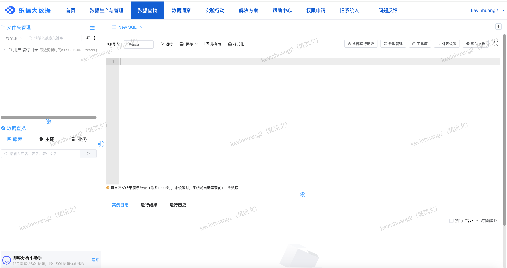

#### 4 文件目录结构

```
bigdata_platform_adhoc_management/
├── pom.xml                                    # 项目依赖管理
├── README.md                                  # 项目说明文档
├── bigdata_platform_adhoc_management-service/  # 服务接口模块
│   └── src/
│       └── main/
│           ├── java/                          # 接口定义
│           └── resources/                     # 配置文件
│
├── bigdata_platform_adhoc_management-dao/      # 数据访问模块
│   └── src/
│       └── main/
│           ├── java/                          # DAO接口
│           ├── resources/
│           │   └── mappers/                   # MyBatis映射文件
│           └── sql/                           # 数据库脚本
│
├── bigdata_platform_adhoc_management-impl/     # 服务实现模块
│   └── src/
│       └── main/
│           ├── java/
│           │   └── com/fenqile/bigdata/platform/adhoc/management/
│           │       ├── aop/                   # 切面处理
│           │       ├── bean/                  # 业务对象
│           │       ├── common/                # 公共组件
│           │       ├── config/                # 配置类
│           │       ├── dolphin/              # Dolphin调度相关
│           │       ├── exception/            # 异常处理
│           │       ├── integration/          # 外部系统集成
│           │       ├── listener/             # 消息监听器
│           │       ├── service/              # 服务实现
│           │       ├── thread/               # 线程管理
│           │       ├── utils/                # 工具类
│           │       └── Main.java             # 启动类
│           └── resources/
│               ├── config_center.properties   # 配置中心配置
│               ├── server.properties         # 服务器配置
│               └── application.properties    # 应用配置
│
└── assets/                                   # 静态资源
    └── images/                              # 图片资源

主要功能模块说明：
1. service模块：定义服务接口
   - 查询服务接口
   - 文件管理接口
   - 用户设置接口

2. dao模块：数据访问层
   - MyBatis Mapper接口
   - 数据库映射文件
   - 数据模型定义

3. impl模块：业务实现层
   - aop：      切面处理（日志、权限等）
   - bean：     业务对象定义
   - common：   公共组件和常量
   - config：   系统配置类
   - dolphin：  任务调度集成
   - exception：异常处理机制
   - integration：外部系统集成
   - listener：  消息监听处理
   - service：   业务逻辑实现
   - thread：    线程池管理
   - utils：     工具类库
```

####  5 Package流程

1、 注册应用的App Id

2、加载配置properties文档到 env 中

3、获取Hippo配置

### 核心功能

1. 查询管理: 
   - SQL查询编辑(多种执行引擎、智能提示补全、格式化、参数设置)
   - 查询优化(执行计划分析、性能优化建议、资源监控)
   - 结果集展示(分页、多格式导出、数据可视化)
   - 历史记录管理(历史追踪、版本管理、日志记录)
2. 数据管理: 
   - 元数据管理(表结构、字段信息、数据字典)
   - 数据产品管理(集成同步、质量监控、生命周期管理)
   - 数据权限控制(用户权限、访问控制、审计日志)
3. 文件管理:
   - 文件操作(创建删除重命名、内容编辑保存、版本控制)
   - 文件移动(跨文件夹、批量操作、复制功能)
   - 文件排序(自定义、时间排序、名称排序)
   - 文件状态管理(状态跟踪、锁定机制、共享控制)
4. 文件夹管理:
   - 基础操作(创建删除重命名、批量操作、权限控制)
   - 文件夹排序(自定义规则、多级排序、拖拽支持)
   - 层级管理(多级目录、树形展示、路径导航)
5. 用户设置:
   - 查询偏好(默认引擎、结果集条数、超时设置)
   - 文件排序(默认方式、自定义规则、方案保存)
   - 文件夹排序(显示顺序、规则定制、视图设置)
   - 自定义配置(界面个性化、快捷键定制、消息通知)
6. AI智能助手:
   - SQL智能分析(语法检查、优化建议、执行计划解析)
   - 智能错误诊断(原因分析、优化建议、解决方案)
   - 查询结果分析(异常检测、统计分析、趋势预测)
7. 系统监控告警:
   - 执行监控(SQL状态、资源使用、性能指标)
   - 告警管理(自定义规则、多渠道通知、级别管理)
   - 系统日志(操作日志、运行日志、审计日志)

#### 用户配置

##### 查询系统配置项

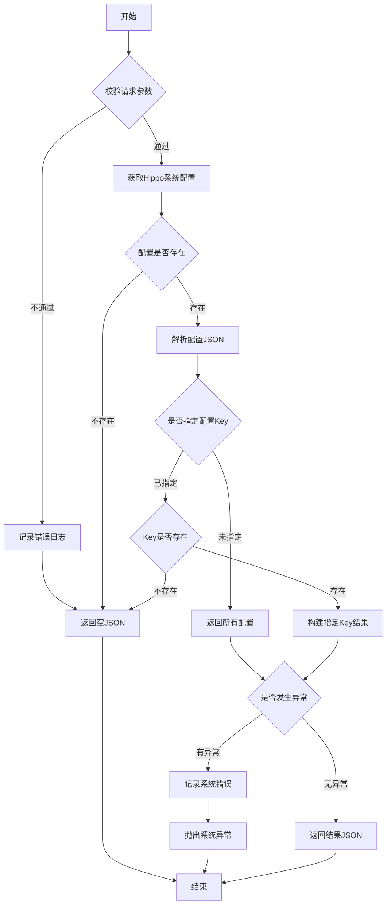

##### 保存 int 类型配置项

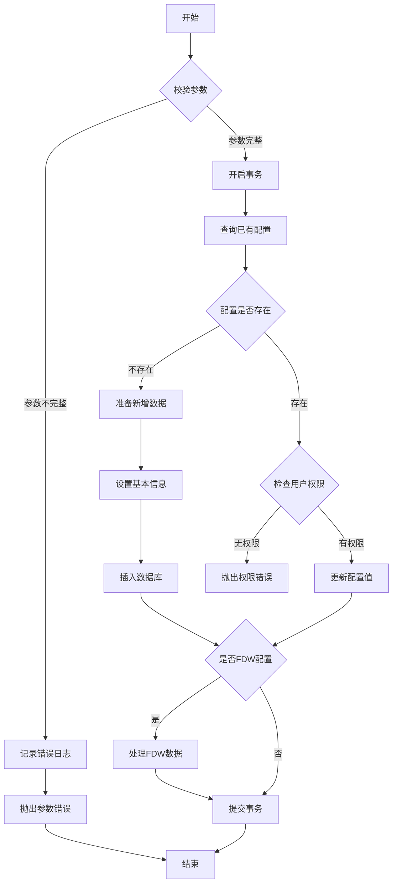


##### 查询 int 类型配置项

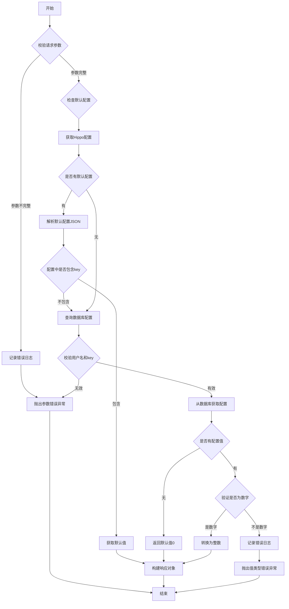

##### 修改文件夹

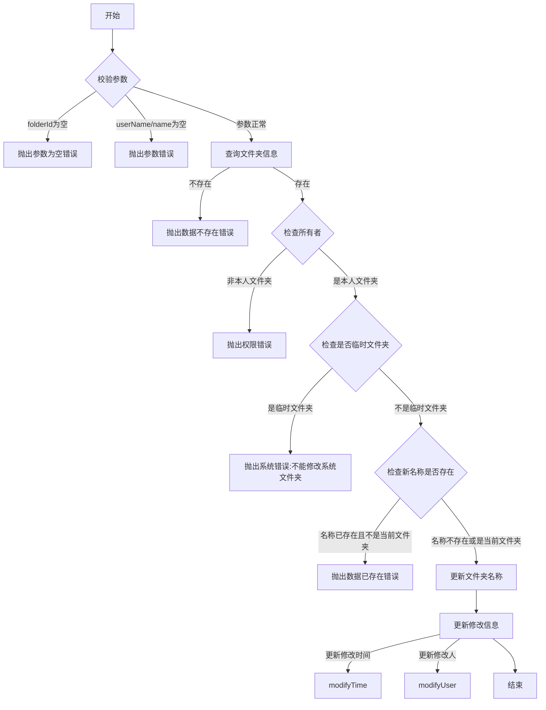

#### 文件夹

##### 查询文件夹

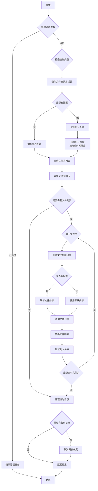

##### 新增文件夹

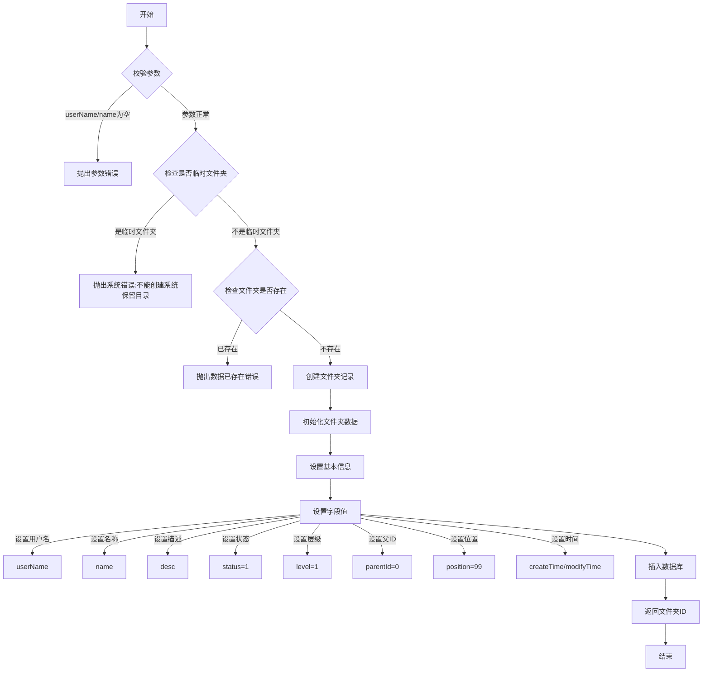


#### 文件

##### 文件的保存或新增

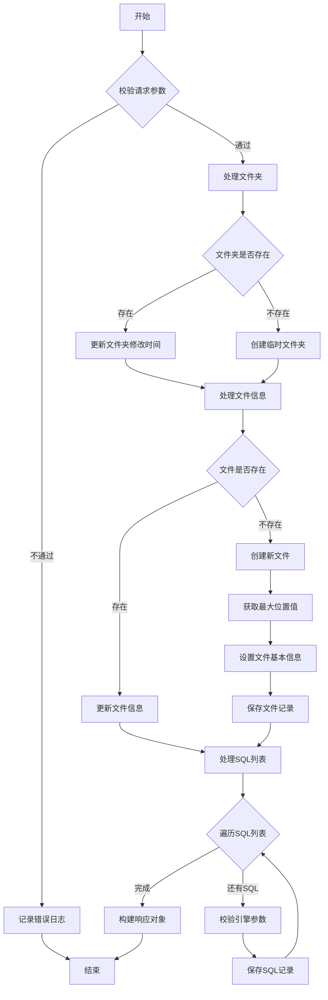

##### 文件移动

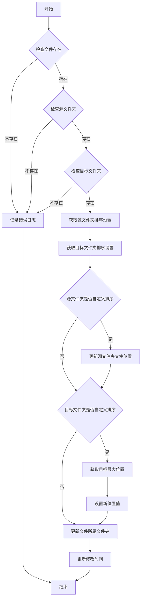

##### 批量删除文件

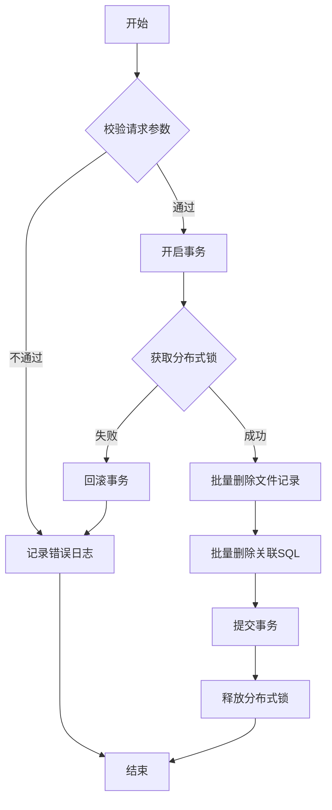

##### 文件查询

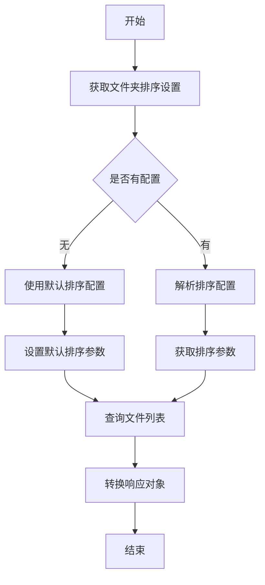

##### 文件配置保存


##### 文件配置查询流程

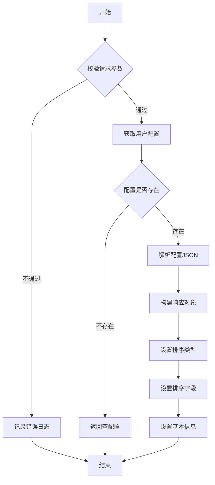

##### 文件重命名流程

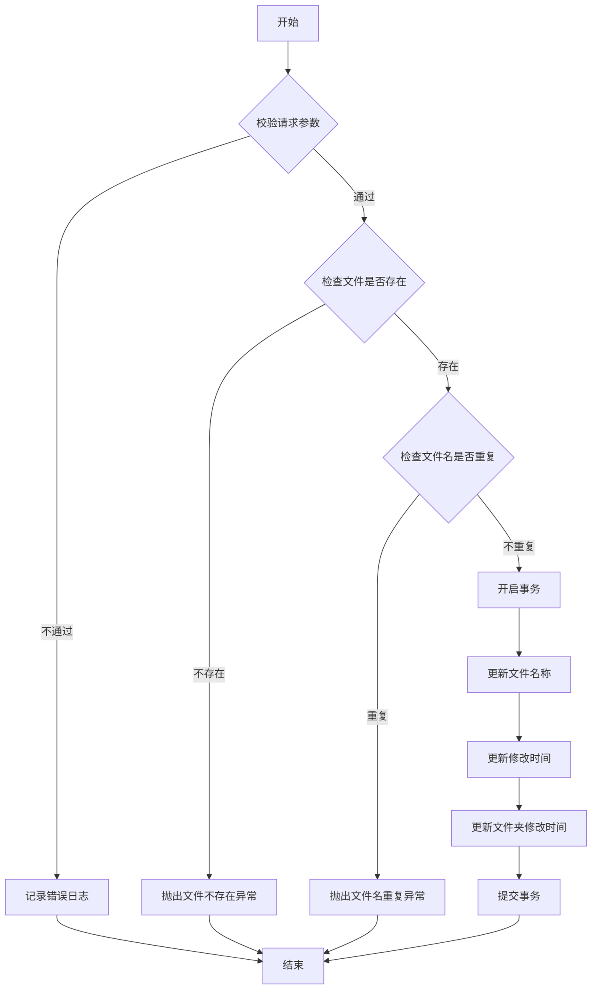

#### SQL

##### SQL 导入

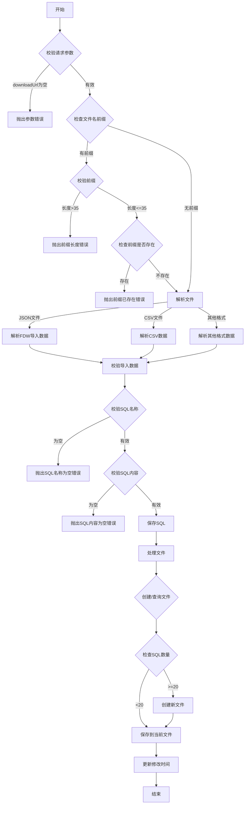

##### SQL 执行时间超时检测服务

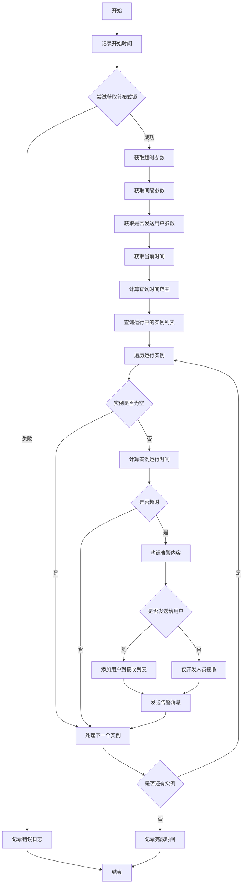

##### SQL执行结果监听服务

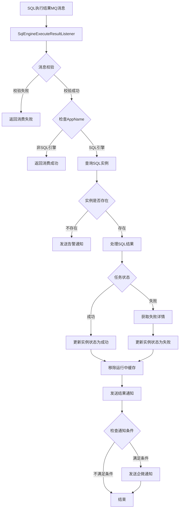

##### SQL 获取建议

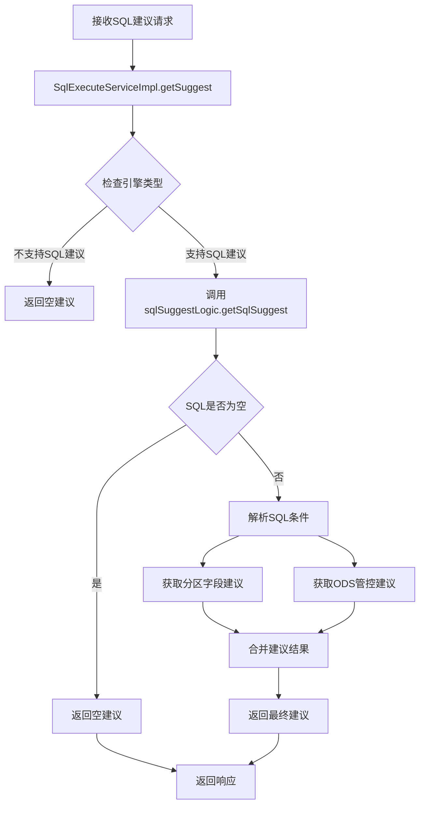

##### SQL 提交

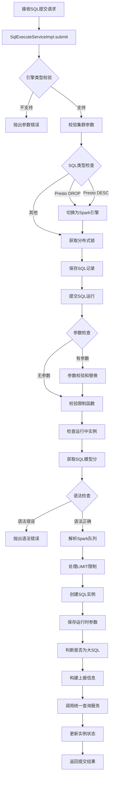

##### 取消SQL 请求

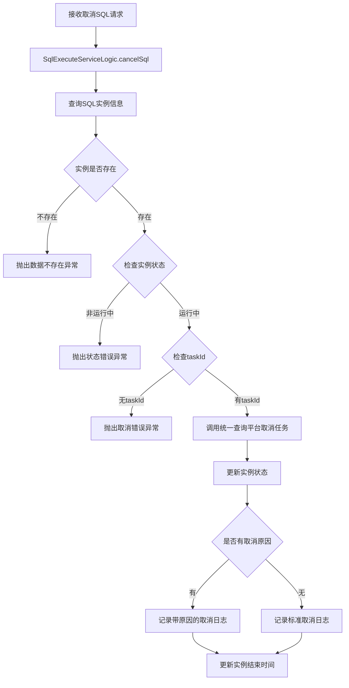

##### 保存SQL

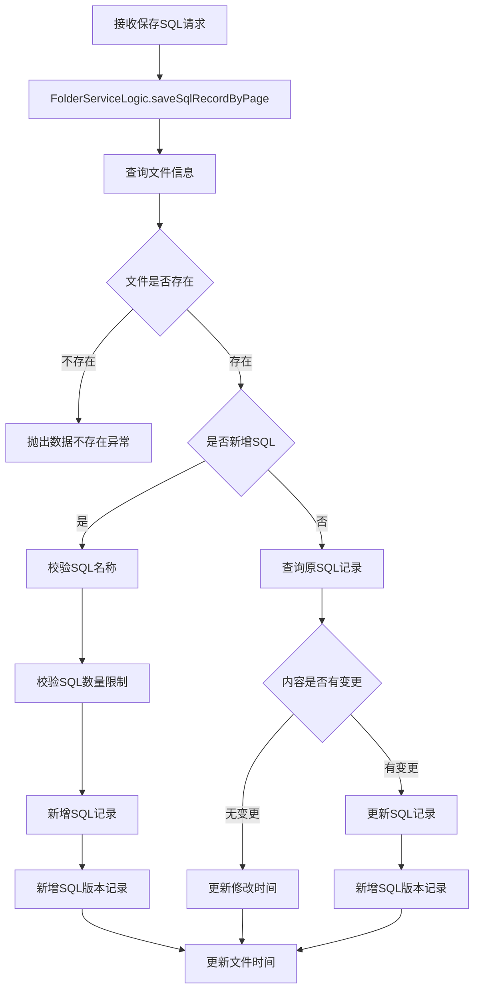

##### 获取 SQL 实例列表

```mermaid
graph TD
    A[接收查询请求] --> B[SqlInstanceServiceImpl.getInstanceList]
    B --> C{检查状态参数}
    C -->|未指定| D[默认查询运行中状态]
    C -->|已指定| E[使用指定状态]
    D --> F{检查SQL ID}
    E --> F
    F -->|SQL ID为0| G[设置为null]
    F -->|其他| H[保持原值]
    G --> I[查询实例列表]
    H --> I
    I --> J{实例列表是否为空}
    J -->|是| K[返回空列表]
    J -->|否| L[按文件ID分组]
    L --> M[转换为响应对象]
    M --> N[返回结果]
```

##### 执行结果查询

```mermaid
graph TD
    A[接收执行结果查询请求] --> B[SqlInstanceServiceImpl.getExecuteResult]
    B --> C[查询SQL实例基本信息]
    C --> D{实例是否存在}
    D -->|不存在| E[抛出数据不存在异常]
    D -->|存在| F{是否为运行中状态}
    F -->|是| G[提交结果查询线程]
    F -->|否| H[获取分布式锁-5s过期]
    G --> H
    H --> I[查询执行结果]
    I --> J{实例状态判断}
    J -->|运行中| K[查询运行缓存]
    J -->|取消| L[返回结束时间]
    J -->|失败| M[查询失败原因]
    J -->|成功| N[处理成功结果]
    K --> O[返回进度信息]
    L --> P[返回结果]
    M --> Q[返回失败信息]
    N --> R{是否为大结果}
    R -->|是| S[返回分段ID列表]
    R -->|否| T[返回完整结果]
    O --> P
    Q --> P
    S --> P
    T --> P
```

```mer
graph TD
    A[接收日志查询请求] --> B[SqlInstanceServiceImpl.getInstanceLogList]
    B --> C[查询实例日志列表]
    C --> D{日志列表是否为空}
    D -->|是| E[返回空列表]
    D -->|否| F[转换日志数据]
    F --> G{是否为失败状态}
    G -->|是| H[查询实例信息]
    H --> I[优化错误信息]
    I --> J[记录优化日志]
    G -->|否| K[设置基本信息]
    J --> L[填充执行耗时]
    K --> L
    L --> M[返回日志列表]
```

9、 获取SQL Instance Log服务

```mermaid
graph TD
    A[接收日志查询请求] --> B[SqlInstanceServiceImpl.getInstanceLogList]
    B --> C[查询实例日志列表]
    C --> D{日志列表是否为空}
    D -->|是| E[返回空列表]
    D -->|否| F[转换日志数据]
    F --> G{是否为失败状态}
    G -->|是| H[查询实例信息]
    H --> I[优化错误信息]
    I --> J[记录优化日志]
    G -->|否| K[设置基本信息]
    J --> L[填充执行耗时]
    K --> L
    L --> M[返回日志列表]
```

10. 历史记录

```mermaid
graph TD
    A[接收历史查询请求] --> B[SqlInstanceServiceImpl.historyList]
    B --> C{状态参数校验}
    C -->|状态无效| D[抛出参数错误]
    C -->|状态有效| E{检查时间范围}
    E -->|超过一个月| F[抛出时间范围错误]
    E -->|时间范围正常| G{检查查询类型}
    G -->|New SQL且无SQL ID| H[返回空结果]
    G -->|其他情况| I{检查查询条件}
    I -->|有SQL ID| J[构建SQL ID列表]
    I -->|有文件ID| K[查询文件下SQL列表]
    I -->|有文件夹ID| L[查询文件夹SQL数量]
    K -->|SQL列表为空| M[返回空结果]
    L -->|SQL数量为0| M
    J --> N[分页查询历史记录]
    K --> N
    L --> N
    N --> O[转换查询结果]
    O --> P[返回分页结果]
```


### 数据库设计

1. 文件表(t_file)

| 字段名       | 类型         | 说明                |
| ------------ | ------------ | ------------------- |
| Findex       | INT          | 文件ID(主键)        |
| Ffolder_id   | INT          | 所属文件夹ID        |
| Fname        | VARCHAR(256) | 文件名称            |
| Fuser_name   | VARCHAR(64)  | 用户名              |
| Fposition    | INT          | 位置序号            |
| Fstatus      | INT          | 状态(0:有效,1:无效) |
| Fcreate_time | DATETIME     | 创建时间            |
| Fmodify_time | DATETIME     | 更新时间            |
| Fcreate_user | VARCHAR(32)  | 创建用户            |
| Fmodify_user | VARCHAR(32)  | 修改用户            |
| Fversion     | INT          | 版本号              |

2. SQL表(t_sql)

| 字段名       | 类型         | 说明         |
| ------------ | ------------ | ------------ |
| Findex       | INT          | SQL ID(主键) |
| Fuser_name   | VARCHAR(64)  | 用户名       |
| Fname        | VARCHAR(256) | SQL名称      |
| Fdesc        | VARCHAR(256) | SQL描述      |
| Ffolder_id   | INT          | 所属文件夹ID |
| Ffile_id     | INT          | 所属文件ID   |
| Fsql_version | INT          | SQL版本号    |
| Fengine      | VARCHAR(32)  | 执行引擎     |
| Fstatus      | INT          | 状态         |
| Fsql_md5     | VARCHAR(32)  | SQL MD5值    |
| Fposition    | INT          | 位置序号     |
| Fsql         | LONGVARCHAR  | SQL内容      |
| Fcluster     | VARCHAR(64)  | 集群信息     |
| Fcreate_time | DATETIME     | 创建时间     |
| Fmodify_time | DATETIME     | 更新时间     |
| Fcreate_user | VARCHAR(32)  | 创建用户     |
| Fmodify_user | VARCHAR(32)  | 修改用户     |
| Fversion     | INT          | 版本号       |

3. SQL实例表(t_sql_instance)

| 字段名       | 类型        | 说明                                |
| ------------ | ----------- | ----------------------------------- |
| Findex       | INT         | 实例ID(主键)                        |
| Fsql_id      | INT         | SQL ID                              |
| Fsql_version | INT         | SQL版本号                           |
| Fuser_name   | VARCHAR(64) | 用户名                              |
| Fengine      | VARCHAR(32) | 执行引擎                            |
| Ftask_id     | INT         | 任务ID                              |
| Fstatus      | INT         | 状态(0:运行中,1:成功,2:失败,3:取消) |
| Fsubmit_time | DATETIME    | 提交时间                            |
| Fend_time    | DATETIME    | 结束时间                            |
| Fsql         | LONGVARCHAR | 执行的SQL                           |
| Fcluster     | VARCHAR(64) | 集群信息                            |
| Fcreate_time | DATETIME    | 创建时间                            |
| Fmodify_time | DATETIME    | 更新时间                            |
| Fcreate_user | VARCHAR(32) | 创建用户                            |
| Fmodify_user | VARCHAR(32) | 修改用户                            |
| Fversion     | INT         | 版本号                              |

4. SQL执行日志表(t_sql_log)

| 字段名       | 类型         | 说明         |
| ------------ | ------------ | ------------ |
| Findex       | INT          | 日志ID(主键) |
| Fsql_id      | INT          | SQL ID       |
| Fsql_version | INT          | SQL版本号    |
| Fengine      | VARCHAR(32)  | 执行引擎     |
| Fuser_name   | VARCHAR(64)  | 用户名       |
| Fname        | VARCHAR(256) | SQL名称      |
| Fdesc        | VARCHAR(256) | 操作描述     |
| Ffolder_id   | INT          | 所属文件夹ID |
| Ffile_id     | INT          | 所属文件ID   |
| Fstatus      | INT          | 状态         |
| Fsql         | LONGVARCHAR  | SQL内容      |
| Fcluster     | VARCHAR(64)  | 集群信息     |
| Fcreate_time | DATETIME     | 创建时间     |
| Fmodify_time | DATETIME     | 更新时间     |
| Fcreate_user | VARCHAR(32)  | 创建用户     |
| Fmodify_user | VARCHAR(32)  | 修改用户     |
| Fversion     | INT          | 版本号       |

5. SQL结果下载表(t_sql_result_do

| 字段名           | 类型         | 说明         |
| ---------------- | ------------ | ------------ |
| Findex           | INT          | 下载ID(主键) |
| Fsql_id          | INT          | SQL ID       |
| Fsql_instance_id | INT          | SQL实例ID    |
| Fuser_name       | VARCHAR(64)  | 用户名       |
| Ftype            | VARCHAR(32)  | 下载类型     |
| Ffile_path       | VARCHAR(256) | 文件路径     |
| Fcreate_time     | DATETIME     | 创建时间     |
| Fmodify_time     | DATETIME     | 更新时间     |
| Fversion         | INT          | 版本号       |

6. 用户设置表(t_user_setting)

| 字段名         | 类型         | 说明         |
| -------------- | ------------ | ------------ |
| Findex         | INT          | 设置ID(主键) |
| Fuser_name     | VARCHAR(64)  | 用户名       |
| Fsetting_key   | VARCHAR(128) | 设置键       |
| Fsetting_value | VARCHAR(512) | 设置值       |
| Fstatus        | INT          | 状态         |
| Fcreate_time   | DATETIME     | 创建时间     |
| Fmodify_time   | DATETIME     | 更新时间     |
| Fversion       | INT          | 版本号       |

7. SQL消息告警表(t_sql_message_alarm)

| 字段名       | 类型        | 说明                           |
| ------------ | ----------- | ------------------------------ |
| Findex       | INT         | 告警ID(主键)                   |
| Fsql_id      | INT         | SQL ID                         |
| Falarm_type  | INT         | 通知类型(0:结束,1:成功,2:失败) |
| Fset_alarm   | INT         | 是否设置告警(0:否,1:是)        |
| Fcreate_time | DATETIME    | 创建时间                       |
| Fmodify_time | DATETIME    | 更新时间                       |
| Fcreate_user | VARCHAR(32) | 创建用户                       |
| Fmodify_user | VARCHAR(32) | 修改用户                       |
| Fversion     | INT         | 版本号                         |

8. 执行参数日志表(t_execute_param_info_log)

| 字段名           | 类型        | 说明         |
| ---------------- | ----------- | ------------ |
| Findex           | INT         | 日志ID(主键) |
| Fsql_instance_id | INT         | SQL实例ID    |
| Fparams_content  | LONGVARCHAR | 参数内容     |
| Fcreate_time     | DATETIME    | 创建时间     |
| Fmodify_time     | DATETIME    | 更新时间     |
| Fcreate_user     | VARCHAR(32) | 创建用户     |
| Fmodify_user     | VARCHAR(32) | 修改用户     |
| Fversion         | INT         | 版本号       |

9. AI执行日志表(t_ai_execution_log)

| 字段名            | 类型        | 说明           |
| ----------------- | ----------- | -------------- |
| Findex            | INT         | 日志ID(主键)   |
| Finstance_id      | INT         | 实例ID         |
| Fsql              | LONGVARCHAR | SQL内容        |
| Finstance_log_id  | INT         | 实例日志ID     |
| Fai_resp_success  | INT         | AI响应是否成功 |
| Fdescription      | LONGVARCHAR | 描述信息       |
| Fai_resp_result   | LONGVARCHAR | AI响应结果     |
| Fai_resp_cost     | INT         | AI响应耗时     |
| Fis_retry         | INT         | 是否重试       |
| Fai_resp_datetime | VARCHAR(32) | AI响应时间     |
| Fengine           | VARCHAR(32) | 执行引擎       |
| Fmatch_key        | VARCHAR(64) | 匹配关键字     |
| Ffeedback_result  | INT         | 反馈结果       |
| Fcreate_time      | DATETIME    | 创建时间       |
| Fmodify_time      | DATETIME    | 更新时间       |
| Fcreate_user      | VARCHAR(32) | 创建用户       |
| Fmodify_user      | VARCHAR(32) | 修改用户       |
| Fversion          | INT         | 版本号         |

10. SQL实例日志表(t_sql_instance_log)

| 字段名           | 类型        | 说明         |
| ---------------- | ----------- | ------------ |
| Findex           | INT         | 日志ID(主键) |
| Fsql_instance_id | INT         | SQL实例ID    |
| Fuser_name       | VARCHAR(64) | 用户名       |
| Fstatus          | TINYINT     | 状态         |
| Foper_time       | DATETIME    | 操作时间     |
| Fdescription     | LONGVARCHAR | 描述信息     |
| Fcreate_time     | DATETIME    | 创建时间     |
| Fmodify_time     | DATETIME    | 更新时间     |
| Fversion         | INT         | 版本号       |

11. FDW Notebook映射表(t_fdw_notebook_mapping)

| 字段名           | 类型        | 说明                 |
| ---------------- | ----------- | -------------------- |
| Findex           | INT         | 映射ID(主键)         |
| Fuser_name       | VARCHAR(64) | 用户名               |
| Ftarget_id       | INT         | 迁移目标ID           |
| Fsource_id       | VARCHAR(64) | 迁移源ID             |
| Ftype            | TINYINT     | 类型(1:文件夹,2:SQL) |
| Ffdw_notebook_id | INT         | FDW Notebook ID      |
| Fcreate_time     | DATETIME    | 创建时间             |
| Fmodify_time     | DATETIME    | 更新时间             |
| Fversion         | INT         | 版本号               |

12. 请求日志表(t_req_log)

| 字段名       | 类型         | 说明         |
| ------------ | ------------ | ------------ |
| Findex       | INT          | 日志ID(主键) |
| Fuser_name   | VARCHAR(64)  | 用户名       |
| Fmethod      | VARCHAR(128) | 请求方法     |
| Fparams      | LONGVARCHAR  | 请求参数     |
| Fip          | VARCHAR(64)  | 请求IP       |
| Fcreate_time | DATETIME     | 创建时间     |
| Fmodify_time | DATETIME     | 更新时间     |
| Fversion     | INT          | 版本号       |

### 主要接口

####  **1. SQL管理**

**SQL执行服务(SqlExecuteService)**

```java
// SQL建议查询
SuggestResp getSuggest(SuggestReq req);

// SQL提交执行
SqlSubmitResp submit(SqlSubmitReq req);

// 取消SQL执行
void cancel(SqlCancelReq req);

// 保存SQL
SqlSaveResp save(SqlSaveReq req);

// 移动SQL
void moveSql(SqlMoveReq req);
```

**SQL实例服务(SqlInstanceService)**

```java
// 查询运行实例列表
List<InstanceListResp> getInstanceList(InstanceQueryReq req);

// 查询执行结果
ExecuteResultQueryResp getExecuteResult(ExecuteResultQueryReq req);

// 查询运行日志
List<InstanceLogListResp> getInstanceLogList(InstanceLogListReq req);

// 查询运行历史
PageResp<HistoryListResp> historyList(HistoryListReq req);

// 导出SQL结果
SqlResultExportResp exportSqlResult(SqlResultExportReq req);

// 查询分段结果
SqlResultSegmentResp getSegmentResult(SqlResultSegmentReq req);

// 获取AI分析结果
AILogResp getAiAnalysis(AILogReq req);

// 更新数据埋点
void updateDataBuried(AILogReq req);
```

**SQL版本服务(SqlVersionService)**

```java
// 查询SQL版本列表（不包含SQL脚本内容）
PageResp<SqlVersionListResp> querySqlVersionList(SqlVersionQueryReq req);

// 查询SQL版本详情（包含SQL脚本内容）
SqlVersionDetailResp querySqlVersionDetail(SqlVersionIdReq req);
```

**SQL实例Dolphin任务服务(SqlInstanceDolphinJobService)**

```java
// 实例超时检查
void instanceTimeoutCheck(ExecuteTimeCheckReq req);
```

#### **2. 文件管理**

**文件服务(FileService)**

```java
// 文件移动
void moveFile(FileMoveReq fileMoveReq);

// 文件排序设置
void saveOrUpdateFileSetting(FileSettingReq fileSettingReq);

// 获取文件排序设置
FileSettingQueryResp getFileSetting(FileSettingQueryReq req);

// 文件重命名
void updateFileName(FileRenameReq req);

// 批量删除文件
void batchDeleteFiles(FileBatchDeleteReq req);

// 查询文件
List<FileSelectBatchResp> selectFiles(FileSelectBatchReq req);

// 保存或更新文件
FileSaveFileResp saveOrUpdateFile(FileSaveReq req);
```

**文件夹服务(FolderService)**

```java
// 查询文件夹列表
List<FolderListResp> list(FolderQueryReq req);

// 新增文件夹
void addFolder(FolderSaveReq req);

// 修改文件夹
void modifyFolder(FolderSaveReq req);

// 查询文件下的SQL详情列表
List<SqlDetailResp> getSqlDetail(FileIdReq req);

// 修改SQL名称
void modifySqlName(ModifySqlNameReq req);

// 删除文件夹
void deleteFolder(FolderIdReq req);

// 删除SQL
void deleteSql(SqlIdListReq req);

// 导入SQL
void importSql(SqlImportReq req);

// 导出SQL
FolderExportResp exportSql(FolderIdReq req);

// 保存或更新文件夹设置
void saveOrUpdateFolderSetting(FolderSetting req);

// 获取文件夹设置
FolderSetting getFolderSetting(FolderSetting req);

// 查询SQL提醒配置
SqlMessageAlarmResp getSqlMessageAlarm(SqlMessageAlarmReq req);

// 保存或更新SQL提醒配置
SqlMessageAlarmResp saveOrUpdateSqlMessageAlarm(SqlMessageAlarmReq req);
```

#### **3. 配置管理**

**用户设置服务(UserSettingService)**

```java
// 查询整数类型配置项
IntSettingResp getIntSetting(UserSettingQueryReq req);

// 保存整数类型配置项
void saveIntSetting(IntSettingSaveReq req);

// 查询系统配置项（配置在hippo上）
JSONObject getSystemHippoSettings(UserSettingQueryReq req);
```

**参数信息服务(ParamInfoService)**

```java
// 保存单个参数信息
void saveOneParamInfo(ParamInfoReq paramInfoDo);

// 批量保存参数信息
void batchSaveParamInfo(ParamInfoListReq req);

// 更新单个参数信息
void updateOneParamInfo(ParamInfoReq paramInfoDo);

// 查询单个参数信息
ParamInfoResp queryOneParamInfo(ParamInfoReq paramInfoReq);

// 查询系统参数信息
List<ParamInfoResp> querySystemParamInfo();

// 根据用户名查询参数列表
List<ParamInfoResp> queryParamInfoByUserName(ParamInfoReq paramInfoReq);

// 根据SqlId查询参数列表
List<ParamInfoResp> queryParamInfoBySqlId(ParamInfoReq paramInfoReq);

// 根据文件夹查询参数列表
List<ParamInfoResp> queryParamInfoByFolderId(ParamInfoReq paramInfoReq);

// 批量更新参数
void batchUpdateParamInfo(ParamInfoListReq req);

// 删除参数信息
void deleteParamInfo(ParamInfoReq paramInfoDo);
```


## DS

**简介**：DolphinScheduler 是 **Apache 顶级开源项目**，专为大数据场景设计的 **分布式可视化工作流调度系统**。它通过低代码方式解决复杂任务依赖、资源调度和监控问题，以下是全方位解析

一、核心定位

- 核心目标：让定时任务和数据处理像搭积木一样简单
- 核心用户：数据工程师、分析师、运维人员

二、核心功能亮点

- 可视化DAG 编排：拖拽式设计任务依赖关系，支持分支、循环、嵌套子流程，基于 Angular/React 的前端交互。
- 多任务支持：支持 30+ 任务类型（Shell、SQL、Spark、Python、Flink、HTTP等）， 基于插件化架构，可扩展。
- 分布式高可用：Master/Worker 分离部署，支持水平扩展和故障自动转移，基于ZooKeeper 协调 + 任务队列。
- 精确调度控制：基于时间/依赖触发，支持补数、空跑、优先级调度，基于Quartz 调度引擎 + 自定义策略。
- 完备的监控：实时任务日志、邮件/钉钉/微信告警、重试机制、任务时长分析，基于Prometheus + AlertManager 集成。
- 多租户与安全：基于 RBAC 的权限控制，支持 LDAP/SSO 集成。

三、架构设计


**关键设计**：

- **去中心化调度**：Master 只负责任务派发，Worker 动态注册
- **容灾机制**：Worker 失联后任务自动转移到其他节点
- **弹性扩展**：秒级扩容 Worker 应对突发任务量

## Hive

**Hive数仓开发简介**：Hive数仓开发是指基于 **Hive** 构建企业级数据仓库（Data Warehouse）的过程，涵盖数据建模、ETL开发、性能优化等环节，旨在将原始数据转化为易分析、可决策的高价值信息。

一、Hive数仓开发的核心内容

- 数据建模：设计星型/雪花模型，定义事实表、维度表
- ETL 开发：编写 Hive SQL 实现数据清洗、转换、加载
- 分层架构： 构建ODS(原始层)→DWD(明细层)→DWS(汇总层)→ADS(应用层)
- 调度系统：配置工作流依赖
- 数据质量：空值检测、唯一性校验、波动监控

## HDFS

**概念**：HDFS（Hadoop Distributed File System），它是一个文件系统，用于存储文件，通过目录树来定位文件；其次，它是分布式的，由很多服务器联合起来实现其功能，集群中的服务器有各自的角色。

**背景**：随着数据量越来越大，在一个操作系统存不下所有的数据，那么就分配到更多的操作系统管理的磁盘中，但是不方便管理和维护，迫切需要一种系统来管理多台机器上的文件，这就是分布式[文件管理系统](https://so.csdn.net/so/search?q=文件管理系统&spm=1001.2101.3001.7020)。HDFS只是分布式文件管理系统中的一种。

**设计目标**：

- 运行在大量廉价商用机器上：硬件错误是常态 ，提供容错机制

- 简答一致性模型：一次写入多次读取，支持追加，不允许修改，保证数据一致性
- 流式数据访问：批量读而非随机读，关注吞吐量而非时间
- 存储大规模数据集：典型文件大小GB-TB

**优点**：高容错性，适合处理大数据，可构建在廉价机器上

**缺点**：不适合低延时数据访问，无法高效地对大量小文件进行存储，不支持并发写入，仅支持数据append

**架构**：


- NameNode：就是master管理者

  1. 管理HDFS的名称空间
  2. 配置副本策略
  3. 管理数据块的映射信息
  4. 处理客户端读写请求

- DataNode：就是Slave，NameNode下达命令，DataNode执行实际操作

  	1. 存储实际数数据块

  2. 执行数据块的读写操作

- Client：客户端

  	1. 文件切分：文件上传HDFS的时候，client将文件分成一个一个的block，如何再上传

  2. 与NameNode交互，获取文件的位置信息

  3. 与DataNode交互，读取或写入数据

  4. Client提供一些命令来管理HDFS，比如对NameNode格式化

  5. Client可以通过一些命令来访问HDFS，比如对HDFS增删改查操作

- Secondary NameNode：并非NameNode的热备，
  1. 辅助NameNode，分担其工作量，比如定期合并，并推送给NameNode
  2. 在紧急情况下，可辅助恢复NameNode

**HDFS的读写流程**


（1）客户端通过Distributed FileSystem模块向NameNode请求上传文件，NameNode检查目标文件是否已存在，父目录是否存在。
（2）NameNode返回是否可以上传。
（3）客户端请求第一个 Block上传到哪几个DataNode服务器上。
（4）NameNode返回3个DataNode节点，分别为dn1、dn2、dn3。
（5）客户端通过FSDataOutputStream模块请求dn1上传数据，dn1收到请求会继续调用dn2，然后dn2调用dn3，将这个通信管道建立完成。
（6）dn1、dn2、dn3逐级应答客户端。
（7）客户端开始往dn1上传第一个Block（先从磁盘读取数据放到一个本地内存缓存），以Packet为单位，dn1收到一个Packet就会传给dn2，dn2传给dn3；dn1每传一个packet会放入一个应答队列等待应答。
（8）当一个Block传输完成之后，客户端再次请求NameNode上传第二个Block的服务器。（重复执行3-7步）。

**节点距离计算**

在HFDFS写数据的过程中，NameNode会选择距离待上传数据最近距离的DataNode接收数据。


**副本节点选择**

​	1、第一个副本在Client所处节点上，如果客户端在集群外，随机选一个

​	2、第二个副本在另一个机架的随机一个节点上

​	3、第三个副本在第二个副本所在机架的随机节点


HDFS的读数据流程


（1）客户端通过DistributedFileSystem向NameNode请求下载文件，NameNode通过查询元数据，找到文件块所在的DataNode地址。
（2）挑选一台DataNode（就近原则，然后随机）服务器，请求读取数据。
（3）DataNode开始传输数据给客户端（从磁盘里面读取数据输入流，以Packet为单位来做校验）。
（4）客户端以Packet为单位接收，先在本地缓存，然后写入目标文件

**NameNode和SecondaryNameNode**

NameNode因为要进行随机访问，还有响应客户请求，必然效率过低。因此，元数据需要存放在内存中。但如果只存在内存中，一旦断电，元数据丢失，整个集群就无法工作了。因此产生在磁盘中备份元数据的FsImage。这样又会带来新的问题，当在内存中的元数据更新时，如果同时更新FsImage，就会导致效率过低，但如果不更新，就会发生一致性问题，一旦NameNode节点断电，就会产生数据丢失。因此，引入Edits文件（只进行追加操作，效率很高）。每当元数据有更新或者添加元数据时，修改内存中的元数据并追加到Edits中。这样，一旦NameNode节点断电，可以通过FsImage和Edits的合并，合成元数据。但是，如果长时间添加数据到Edits中，会导致该文件数据过大，效率降低，而且一旦断电，恢复元数据需要的时间过长。因此，需要定期进行FsImage和Edits的合并，如果这个操作由NameNode节点完成，又会效率过低。因此，引入一个新的节点SecondaryNamenode，专门用于FsImage和Edits的合并。


1）第一阶段：NameNode启动

​	（1）第一次启动NameNode格式化后，创建Fsimage和Edits文件。如果不是第一次启动，直接加载编辑日志和镜像文件到内容。

​	（2）客户端对元数据进行增删改的请求

​	（3）NameNode在记录操作日志，更新滚动日志

​	（4）NameNode在内存中对元数据进行增删改

2）第二阶段：Secondary NameNode工作

​	（1）Secondary NameNode询问NameNode是否需要CheckPoint。直接带回NameNode是否检查结果。

​	（2）Secondary NameNode 请求执行CheckPoint

​	（3）NameNode滚动正在写的Edits日志。

​	（4）将滚动前的编辑日志和镜像文件拷贝到Secondary NameNode。

​	（5）Secondary NameNode加载编辑日志和镜像文件到内存，并合并。

​	（6）生成新的镜像文件fsimage.chkpoint。

​	（7）拷贝fsimage.chkpoint到NameNode。

​	（8）NameNode将fsimage.chkpoint重新命名成fsimage。

**Fsimage和Edits**

NameNode被格式化之后，会在目录中生成如下文件

​	（1）Fsimage文件：HDFS文件系统元数据的一个永久性的checkpoint，其中包含HDFS文件系统的所有目录和文件index的序列化信息。

​	（2）Edits文件：存放HDFS文件系统的所有更新操作的路径，文件系统客户端执行的所有写操作首先会被记录到Edits文件中

​	（3）seen_txid文件保存的是一个数字，就是最后一个edits数字

​	（4）每次NameNode启动的时候都会将Fsimage文件读入内容，加载Edits里面的更新操作，保证了内存中的元数据信息是最新的、同步的，可以看成NameNode启动的时候将Fsimage和Edits文件进行了he'bi

**DataNode**


（1）一个数据块在DataNode上以文件形式存储在磁盘上，包括两个文件，一个数据本身，一个是元数据包括数据块的长度，快数据的校验和，以及时间戳

（2）DataNode启动后向NameNode注册，通过后，向NameNode上报所有块信息

（3）心跳是每三秒一次，心跳返回结果带有NameNode给该DataNode的命令如复制块数据到另一台机器，或删除某个数据块。如果超过十分钟没有收到某个DataNode的心跳，则认为该节点不可用

（4）集群运行中可以安全加入和退出一些机器

**DataNode的数据完整性**

思考：如果电脑磁盘里面存储的数据是控制高铁信号灯的红灯信号（1）和绿灯信号（0），但是存储该数据的磁盘坏了，一直显示是绿灯，是否很危险？同理DataNode节点上的数据损坏了，却没有发现，是否也很危险，那么如何解决呢？

（1）当DataNode读取Block的时候，它会计算CheckSum

（2）如果计算后的CheckSum，与Block创建时值不一样，说明Block以及损坏

（3）Client读取其他DataNode上的Block

（4）常见校验算法crc（32），md5（128）

（5）DataNode在其文件创建后周期验证ChechSum

## Spark

**概述**

[Spark](https://so.csdn.net/so/search?q=Spark&spm=1001.2101.3001.7020)是一种快速、通用、可扩展的大数据分析引擎，它基于内存计算的大数据并行计算框架，能够显著提高大数据环境下数据处理的实时性，同时保证高容错性和高可伸缩性。以下是对Spark的详细介绍：

**核心特点**

1. **高速性能**：Spark采用内存计算（In-Memory Computing）的方式，将数据存储在内存中进行处理，从而大幅提升了数据处理速度。相比于传统的磁盘存储方式，Spark能够在内存中进行更快的数据访问和计算。
2. **可扩展性**：Spark具有良好的可扩展性，可以在大规模分布式集群上运行。它通过将任务发到集群中多个节点并行执行，充分利用集群中的计算和存储资源，实现高效的分布式计算。
3. **容错性**：Spark具备容错性，即使在集群中发生节点故障或任务失败时，它能够自动恢复和重新执行。Spark通过记录数据操作的转换历史和依赖关系，可以在发生故障时重新计算丢失的数据，确保计算结果的正确性和可靠性
4. **多种语言处理任务支持**：Spark支持多种数据处理任务，包括批处理、交互式查询、流式处理和机器学习等。它提供了丰富的API和库，用于处理不同类型的数据和应用场景。
5. **多语言支持**：Spark支持多种编程语言，如Scala、Java、Python和R等。开发人员可以使用自己熟悉的编程语言来编写Spark应用程序，方便快捷地进行大数据处理和分析。

**Spark VS Hadoop**

尽管 Spark 相对于 Hadoop 而言具有较大优势，但 Spark 并不能完全替代 Hadoop，Spark 主要用于替代Hadoop中的 MapReduce 计算模型。存储依然可以使用 HDFS，但是中间结果可以存放在内存中；调度可以使用 Spark 内置的，也可以使用更成熟的调度系统 YARN 等。


实际上，Spark 已经很好地融入了 Hadoop 生态圈，并成为其中的重要一员，它可以借助于 YARN 实现资源调度管理，借助于 HDFS 实现分布式存储。

此外，Hadoop 可以使用廉价的、异构的机器来做分布式存储与计算，但是，Spark 对硬件的要求稍高一些，对内存与 CPU 有一定的要求。


**Spark的优势与特点**：

首先查看MapReduce，它提供了对数据访问和计算的抽象，但是对数据的复用就是简单地将中间数据写入到一个稳定的文件系统中，所以会产生数据的复制备份，磁盘I/O以及数据的序列化，所以在遇到需要多次计算之间复用中间结果的操作时效率非常低。而这类操作是非常常见的，例如迭代式计算，图计算。提出的新模型叫做RDD

- RDD是一个可以容错且并行的数据结果（其实可以理解为分布式的集合，操作起来和操作本地集合一样简单），可以让用户显式的将中间结果保存在内存中，并且通过控制数据集的分区来达到数据存放处理最优化。同时RDD也提供了丰富的API来操作数据集

**Spark生态圈**


- **Spark Core**：实现了Spark基本功能，包括RDD、任务调度、内存管理、错误恢复，与存储系统交互等模块
- **Spark SQL**：Spark 用来操作结构化数据的程序包。通过Spark SQL，我们可以使用SQL操作数据
- **Spark Straming**：提供对实时数据进行流式计算的组件。提供了用来操作数据流的API
- **Spark MLlib**：提供常见的机器学习(ML)功能的程序库。包括分类、回归、聚类、协同过滤等，还提供了模型评估、数据导入等额外的支持功能。

- **GraphX(图计算)**：Spark 中用于图计算的 API，性能良好，拥有丰富的功能和运算符，能在海量数据上自如地运行复杂的图算法。

- **集群管理器**：Spark 设计为可以高效地在一个计算节点到数千个计算节点之间伸缩计算。
- **Structured Streaming**：处理结构化流,统一了离线和实时的 API。

**Spark 运行模式**

**① local 本地模式(单机)**

学习测试使用
分为 local 单线程和 local-cluster 多线程。
**② standalone 独立集群模式**

学习测试使用
典型的 Mater/slave 模式。
**③ standalone-HA 高可用模式**

生产环境使用
基于 standalone 模式，使用 zk 搭建高可用，避免 Master 是有单点故障的。
**④ on yarn 集群模式**

生产环境使用
运行在 yarn 集群之上，由 yarn 负责资源管理，Spark 负责任务调度和计算。
好处：计算资源按需伸缩，集群利用率高，共享底层存储，避免数据跨集群迁移。
**⑤ on mesos 集群模式**

国内使用较少
运行在 mesos 资源管理器框架之上，由 mesos 负责资源管理，Spark 负责任务调度和计算。
**⑥ on cloud 集群模式**

中小公司未来会更多的使用云服务
比如 AWS 的 EC2，使用这个模式能很方便的访问 Amazon 的 S3。

**RDD概念**

前面有提到MapReduce框架采用非循环式的数据流模型，把中间结果写入HDFS中，带来了大量的数据复制、磁盘IO和序列化开销。且这些框架只能支持一些特定的计算模式(`map/reduce`)，并没有提供一种通用的数据抽象。因此出现了RDD这个概念。**RDD**叫做弹性分布式数据集，是 Spark 中最基本的数据抽象，代表一个不可变、可分区、里面的元素可并行计算的集合

RDD单词拆解：

- Resilient：是弹性的，RDD里面的数据可以保存在内容中或磁盘里面
- Distributed：它里面的元素是分布式存储的，可以用于分布式计算
- DataSet：它是一个集合，可以存放很多元素

**RDD属性**

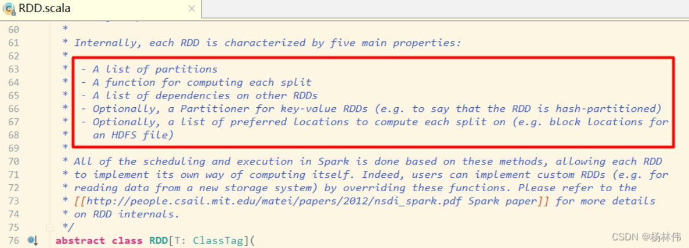

其含义如下：

- A list of partitions ：一组分片(Partition)/一个分区(Partition)列表，即数据集的基本组成单位。对于 RDD 来说，每个分片都会被一个计算任务处理，分片数决定并行度。用户可以在创建 RDD 时指定 RDD 的分片个数，如果没有指定，那么就会采用默认值。
- A function for computing each split ：一个函数会被作用在每一个分区。Spark 中 RDD 的计算是以分片为单位的，compute 函数会被作用到每个分区上。
- A list of dependencies on other RDDs ：一个 RDD 会依赖于其他多个 RDD。RDD 的每次转换都会生成一个新的 RDD，所以 RDD 之间就会形成类似于流水线一样的前后依赖关系。在部分分区数据丢失时，Spark 可以通过这个依赖关系重新计算丢失的分区数据，而不是对 RDD 的所有分区进行重新计算。(Spark 的容错机制)
- Optionally, a Partitioner for key-value RDDs (e.g. to say that the RDD is hash-partitioned)：可选项，对于 KV 类型的 RDD 会有一个 Partitioner，即 RDD 的分区函数，默认为 HashPartitioner。
- Optionally, a list of preferred locations to compute each split on (e.g. block locations for an HDFS file)：可选项,一个列表，存储存取每个 Partition 的优先位置(preferred location)。对于一个 HDFS 文件来说，这个列表保存的就是每个 Partition 所在的块的位置。按照"移动数据不如移动计算"的理念，Spark 在进行任务调度的时候，会尽可能选择那些存有数据的 worker 节点来进行任务计算。

总结：RDD 是一个数据集的表示，不仅表示了数据集，还表示了这个数据集从哪来，如何计算，主要属性包括：

- 分区列表

- 计算函数

- 依赖关系

- 分区函数(默认是 hash)

- 最佳位置

  分区列表、分区函数、最佳位置，这三个属性其实说的就是数据集在哪，在哪计算更合适，如何分区；

​	计算函数、依赖关系，这两个属性其实说的是数据集怎么来的。

**RDD的创建方式**

1. 由外部存储系统数据集创建，包括本地的文件系统，还有所有Hadoop支持的数据集，比如HDFS、Cassandra、HBase等

```scala
val rdd1 = sc.textFile("hdfs://node1:8020/wordcount/input/words.txt")
```

2. 通过已有RDD经过算子转换生成新的RDD

```scala
val rdd2=rdd1.flatMap(_.split(" "))
```

3. 由一个已经存在的scala集合创建

```scala
val rdd3 = sc.parallelize(Array(1,2,3,4,5,6,7,8))
val rdd4 = sc.makeRDD(List(1,2,3,4,5,6,7,8))
```

**RDD算子**

RDD算子分为两类：

- Transformation转换操作：返回一个新的RDD
- Action动作操作：返回值不是RDD

注意：

1. RDD不实际存储真正要计算的数据，而是记录了数据的位置在哪里，数据的转换关系（调用了什么方法，传入了什么函数）
2. RDD中所有的转换都是惰性求值/延迟执行的，也就是说不会计算。只有到发生一个要求返回结果给Driver的Action作用时，才会真正运行
3. 之所以使用惰性求值/延迟执行，是因为这样可以在 Action 时对 RDD 操作形成 DAG有向无环图进行 Stage 的划分和并行优化，这种设计让 Spark 更加有效率地运行。

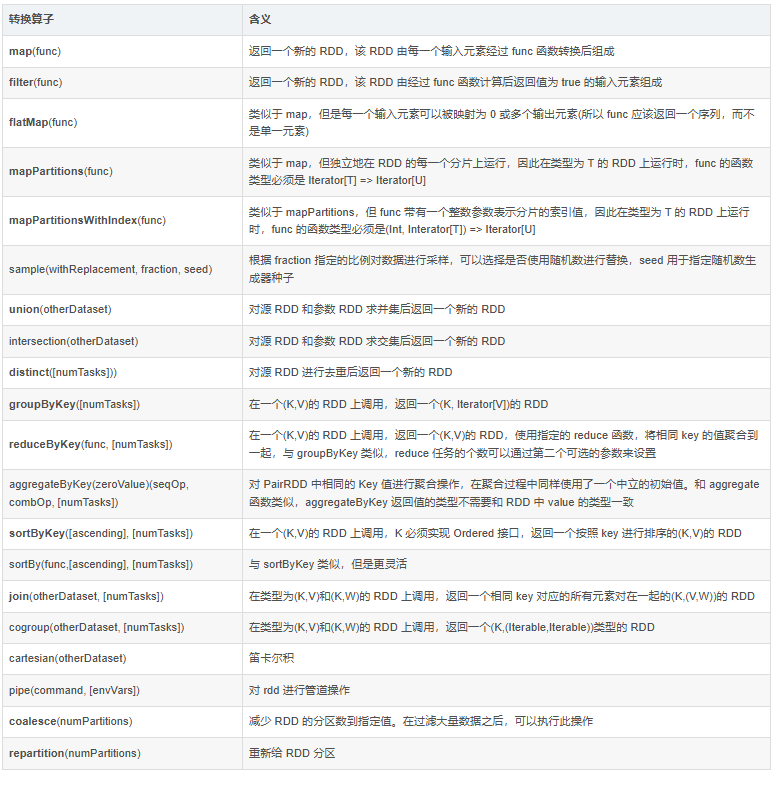


