# 乐信

## 常见术语

**离线处理和实时处理**：

## 英语缩写

**ETL** (Extract, Transform, Load)：ETL 执行机是数据集成系统的ETL执行机是数据集成系统的核心组件，负责自动化执行**数据抽取（Extract）、转换（Transform）、加载（Load）**的全流程操作。

- 核心功能：数据抽取（支持多源异构数据连接如 JDBC、Kafka），数据转换（字段映射、数据清洗、行列转换如SQL 表达式），任务调度，监控告警，元数据管理

**DS**（DolphinScheduler）:DolphinScheduler 是一个开源的分布式工作流调度系统，旨在简化大规模数据工作流的调度和管理。它特别适用于分布式环境下的任务调度，支持复杂的工作流依赖，广泛应用于数据处理、ETL 流程和定时任务调度等场景。

- 核心功能：分布式调度（能够在多个节点执行任务），图形化工作流设计，任务依赖管理（支持任务之间依赖关系定义，确保任务顺序执行），任务调度，任务监控与告警

**FDW**（Foreign Data Wrapper，外部数据包装器）：FDW 是数据库系统中一项核心技术，允许用户像操作本地表一样直接访问外部数据源（如其他数据库、文件、API 等），无需数据迁移即可实现跨系统查询

- 核心功能：跨数据库查询，文件虚拟化（将CSV/JSON数据映射为数据库表），API 数据接入（连接 REST API获取实时数据），分布式计算（跨数据源执行 JSON 操作）

**MPP**（Massviely Parallel Processing Engine，  ）

- 核心功能：大规模并行处理，分布式存储。高度可扩展性、高效的查询执行

**OLAP**（Online Analytical Processing，在线分析处理）是一类用于复杂查询和数据分析的技术，主要应用于决策支持系统（DSS）和商业智能（BI）系统中。OLAP 允许用户通过多维度查看和分析数据，支持高效的多维查询、汇总、切片、钻取等操作。其核心目标是帮助用户从不同角度分析数据，获取有价值的业务洞察。

**CDP**（Cloudera Data Platform集群）：是基于 专为大规模数据存储和批处理设计。其核心思想是**分布式存储**和**高容错性**，适用于廉价硬件上的海量数据场景。以下是HDFS的深度解析：（CDP）构建的数据管理和分析平台的集群部署。CDP是Cloudera推出的一个统一的数据平台，它整合了多个数据处理和分析工具，帮助企业高效地管理、分析和洞察数据。CDP可以用于处理从传统数据仓库到现代数据湖的各种数据操作，包括大数据处理、机器学习和分析等。

- 核心特点：统一平台（集成多个数据存储和分析组件，用户可以通过单一的界面进行数据的存储、处理、分析等），大规模数据处理，多种数据存储，数据处理与分析，数据安全和治理

**ODS**（Operational Data Store，操作数据存储层）是大数据仓库中的原始数据缓冲层，其管控的核心目标是确保原始数据的完整性、可追溯性和规范化管理

- 核心内容：数据同步（制定增量/全量同步避免数据遗漏重复），数据一致性、数据时效性、存储优化、元数据管理

**HDFS**（Hadoop Distributed File System，Hadoop分布式文件系统）专为大规模数据存储和批处理设计。其核心思想是**分布式存储**和**高容错性**，适用于廉价硬件上的海量数据场景。以下是HDFS的深度解析

- 核心内容：横向扩展（通过增加普通服务器扩展存储），数据分块（文件被切分为固定大小的块），副本机制（确保数据冗余和容错）

**CDP**（Customer Data Platform，客户数据平台）

- 核心内容：ID-Mapping：（跨设备/渠道统一用户身份，如手机号+Cookie+OpenID 合并），实时更新（用户行为触发即标签更新）

## 即席分析

### 项目介绍

**1 项目目标**

旧即席查询平台FDW由于项目陈旧，运维和开发难度大，且功能无法扩展，需要搭建一个新平台承接即席查询能力。

**2 项目价值**

l 通过使用集团标准微服务架构，提升运维和研发的效率。

l 针对业务痛点，提供新平台能力持续迭代解决，提升用户体验和工作效率。

l 架构化繁为简，提升系统稳定性。

**3 总体设计**

**3.1 架构图**

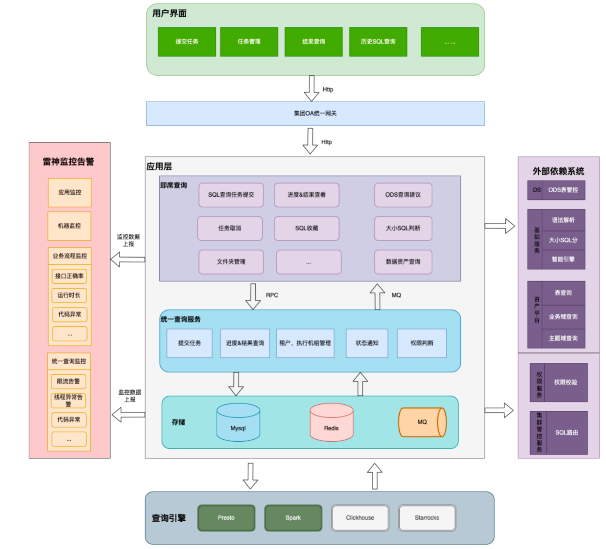

**3.2 主要功能模块**

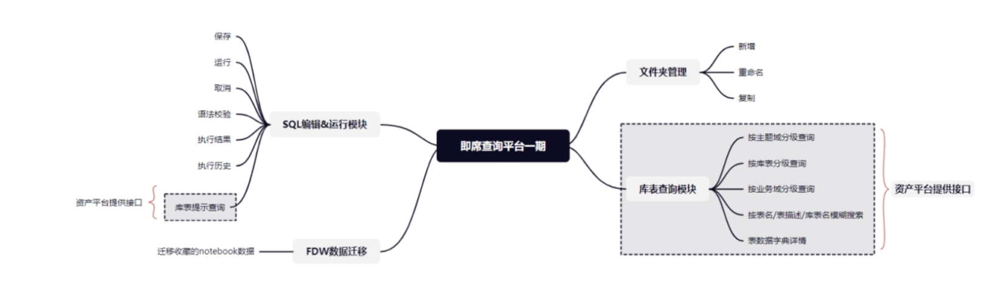

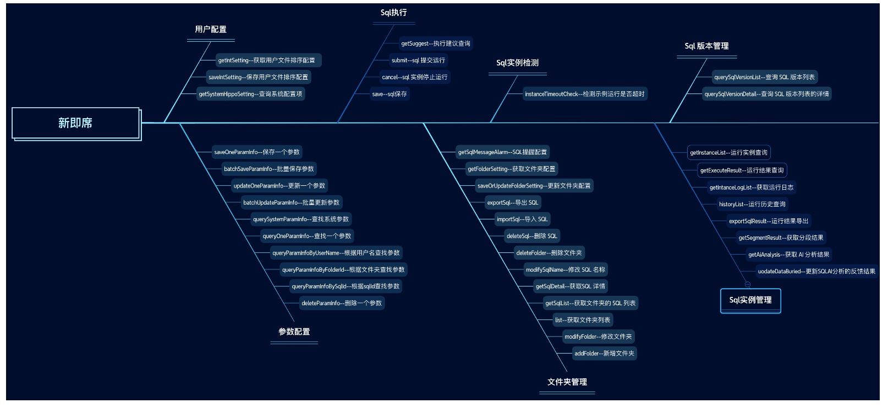

**3.3 功能交互概述**

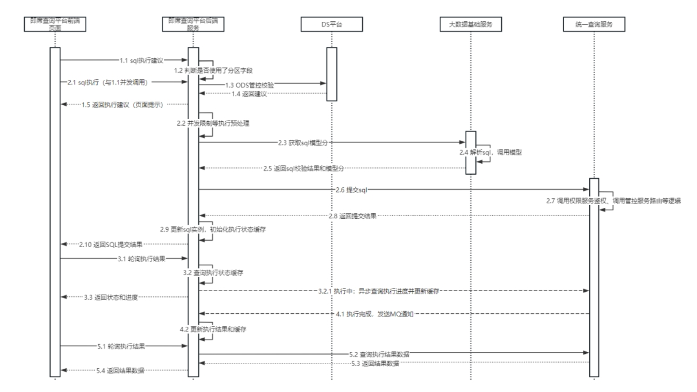

### AI技术方案

**1 需求目标** 

当前即席查询报错返回信息不友好，用户经常截图到大群中寻求人工咨询。

**2 项目价值**

l 利用AI能力低成本提升用户即席查询的使用体验

l 完成即席查询报错解析日志抓取与自动解析，提供用户准确率高于95%的报错解析结果与修正建议。

**3 总体设计**

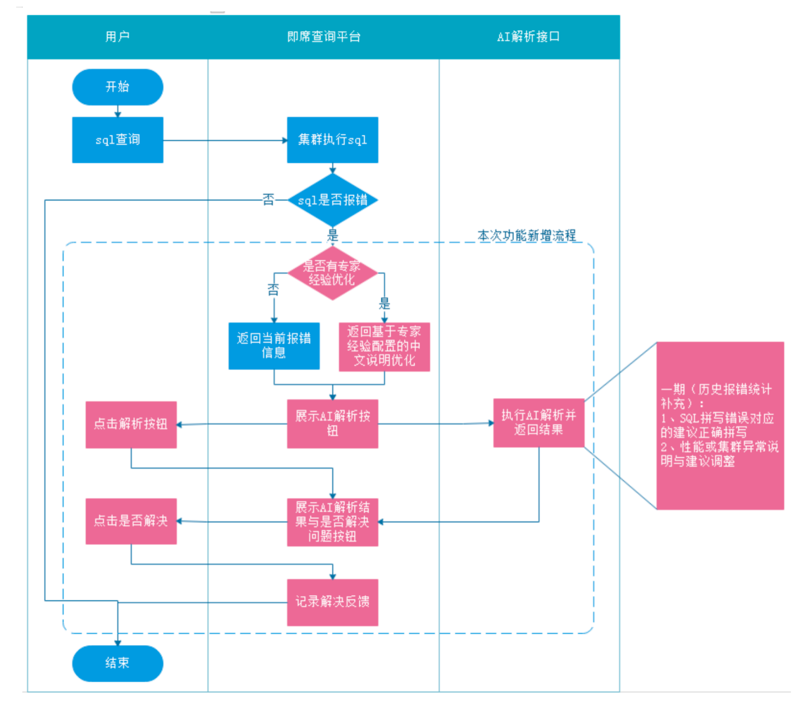

3.1 功能交互概述

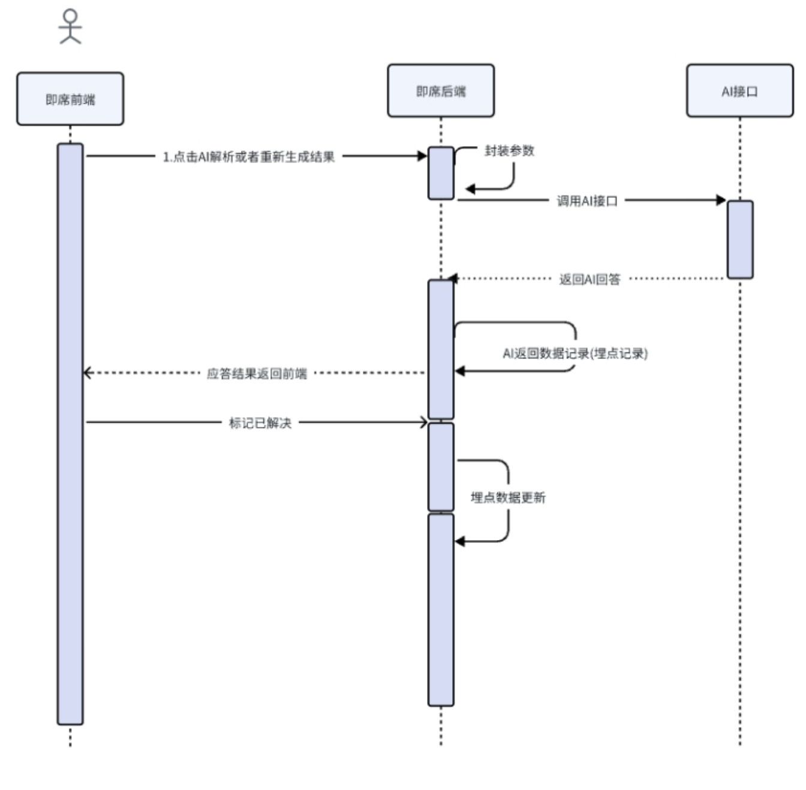

---

## DS

**简介**：DolphinScheduler 是 **Apache 顶级开源项目**，专为大数据场景设计的 **分布式可视化工作流调度系统**。它通过低代码方式解决复杂任务依赖、资源调度和监控问题，以下是全方位解析

一、核心定位

- 核心目标：让定时任务和数据处理像搭积木一样简单
- 核心用户：数据工程师、分析师、运维人员

二、核心功能亮点

- 可视化DAG 编排：拖拽式设计任务依赖关系，支持分支、循环、嵌套子流程，基于 Angular/React 的前端交互。
- 多任务支持：支持 30+ 任务类型（Shell、SQL、Spark、Python、Flink、HTTP等）， 基于插件化架构，可扩展。
- 分布式高可用：Master/Worker 分离部署，支持水平扩展和故障自动转移，基于ZooKeeper 协调 + 任务队列。
- 精确调度控制：基于时间/依赖触发，支持补数、空跑、优先级调度，基于Quartz 调度引擎 + 自定义策略。
- 完备的监控：实时任务日志、邮件/钉钉/微信告警、重试机制、任务时长分析，基于Prometheus + AlertManager 集成。
- 多租户与安全：基于 RBAC 的权限控制，支持 LDAP/SSO 集成。

三、架构设计

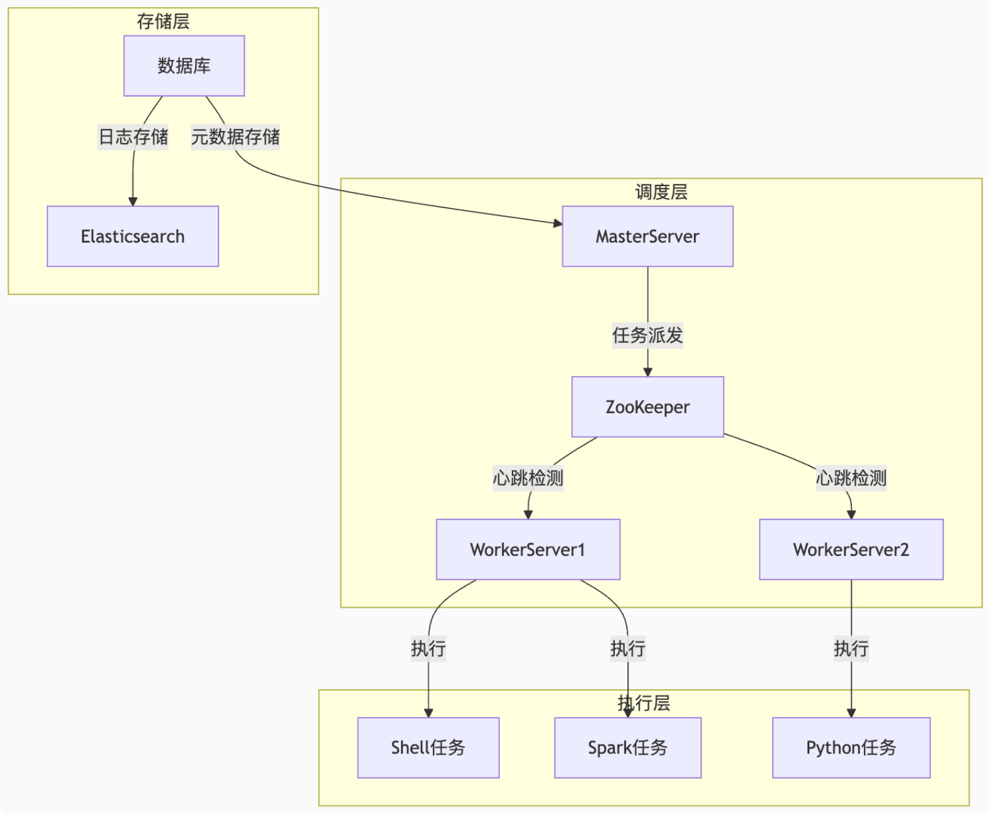

**关键设计**：

- **去中心化调度**：Master 只负责任务派发，Worker 动态注册
- **容灾机制**：Worker 失联后任务自动转移到其他节点
- **弹性扩展**：秒级扩容 Worker 应对突发任务量

## Hive

**Hive数仓开发简介**：Hive数仓开发是指基于 **Hive** 构建企业级数据仓库（Data Warehouse）的过程，涵盖数据建模、ETL开发、性能优化等环节，旨在将原始数据转化为易分析、可决策的高价值信息。

一、Hive数仓开发的核心内容

- 数据建模：设计星型/雪花模型，定义事实表、维度表
- ETL 开发：编写 Hive SQL 实现数据清洗、转换、加载
- 分层架构： 构建ODS(原始层)→DWD(明细层)→DWS(汇总层)→ADS(应用层)
- 调度系统：配置工作流依赖
- 数据质量：空值检测、唯一性校验、波动监控

## HDFS

<<<<<<< HEAD
**概念**：HDFS（Hadoop Distributed File System），它是一个文件系统，用于存储文件，通过目录树来定位文件；其次，它是分布式的，由很多服务器联合起来实现其功能，集群中的服务器有各自的角色。

**背景**：随着数据量越来越大，在一个操作系统存不下所有的数据，那么就分配到更多的操作系统管理的磁盘中，但是不方便管理和维护，迫切需要一种系统来管理多台机器上的文件，这就是分布式[文件管理系统](https://so.csdn.net/so/search?q=文件管理系统&spm=1001.2101.3001.7020)。HDFS只是分布式文件管理系统中的一种。

**设计目标**：

- 运行在大量廉价商用机器上：硬件错误是常态 ，提供容错机制

- 简答一致性模型：一次写入多次读取，支持追加，不允许修改，保证数据一致性
- 流式数据访问：批量读而非随机读，关注吞吐量而非时间
- 存储大规模数据集：典型文件大小GB-TB

**优点**：高容错性，适合处理大数据，可构建在廉价机器上

**缺点**：不适合低延时数据访问，无法高效地对大量小文件进行存储，不支持并发写入，仅支持数据append

**架构**：

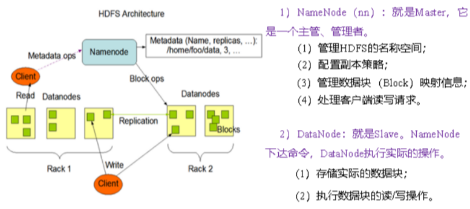

- NameNode：就是master管理者

  1. 管理HDFS的名称空间
  2. 配置副本策略
  3. 管理数据块的映射信息
  4. 处理客户端读写请求

- DataNode：就是Slave，NameNode下达命令，DataNode执行实际操作

  	1. 存储实际数数据块

  2. 执行数据块的读写操作

- Client：客户端

  	1. 文件切分：文件上传HDFS的时候，client将文件分成一个一个的block，如何再上传

  2. 与NameNode交互，获取文件的位置信息

  3. 与DataNode交互，读取或写入数据

  4. Client提供一些命令来管理HDFS，比如对NameNode格式化

  5. Client可以通过一些命令来访问HDFS，比如对HDFS增删改查操作

- Secondary NameNode：并非NameNode的热备，
  1. 辅助NameNode，分担其工作量，比如定期合并，并推送给NameNode
  2. 在紧急情况下，可辅助恢复NameNode

**HDFS的读写流程**

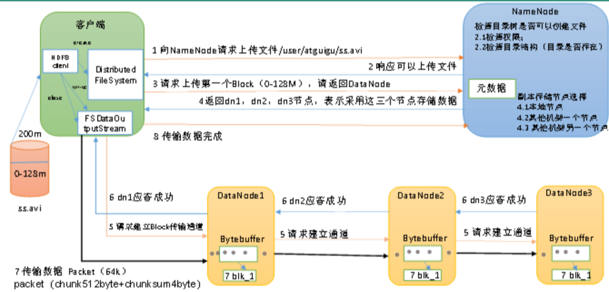

（1）客户端通过Distributed FileSystem模块向NameNode请求上传文件，NameNode检查目标文件是否已存在，父目录是否存在。
（2）NameNode返回是否可以上传。
（3）客户端请求第一个 Block上传到哪几个DataNode服务器上。
（4）NameNode返回3个DataNode节点，分别为dn1、dn2、dn3。
（5）客户端通过FSDataOutputStream模块请求dn1上传数据，dn1收到请求会继续调用dn2，然后dn2调用dn3，将这个通信管道建立完成。
（6）dn1、dn2、dn3逐级应答客户端。
（7）客户端开始往dn1上传第一个Block（先从磁盘读取数据放到一个本地内存缓存），以Packet为单位，dn1收到一个Packet就会传给dn2，dn2传给dn3；dn1每传一个packet会放入一个应答队列等待应答。
（8）当一个Block传输完成之后，客户端再次请求NameNode上传第二个Block的服务器。（重复执行3-7步）。

**节点距离计算**

在HFDFS写数据的过程中，NameNode会选择距离待上传数据最近距离的DataNode接收数据。

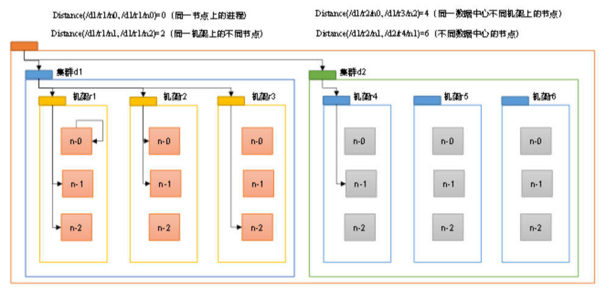

**副本节点选择**

​	1、第一个副本在Client所处节点上，如果客户端在集群外，随机选一个

​	2、第二个副本在另一个机架的随机一个节点上

​	3、第三个副本在第二个副本所在机架的随机节点

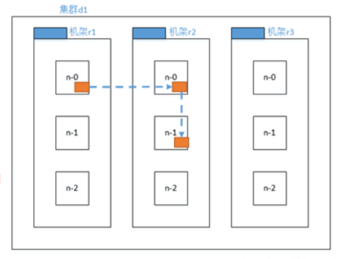

HDFS的读数据流程

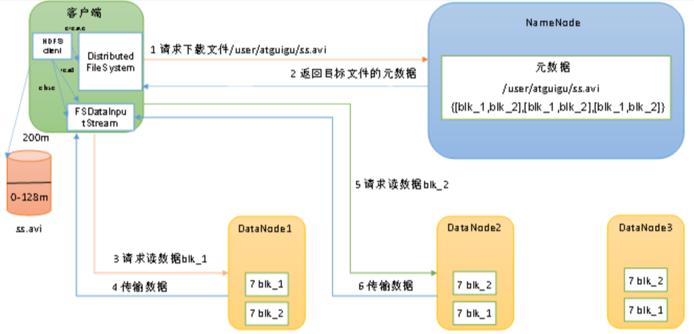

（1）客户端通过DistributedFileSystem向NameNode请求下载文件，NameNode通过查询元数据，找到文件块所在的DataNode地址。
（2）挑选一台DataNode（就近原则，然后随机）服务器，请求读取数据。
（3）DataNode开始传输数据给客户端（从磁盘里面读取数据输入流，以Packet为单位来做校验）。
（4）客户端以Packet为单位接收，先在本地缓存，然后写入目标文件

**NameNode和SecondaryNameNode**

NameNode因为要进行随机访问，还有响应客户请求，必然效率过低。因此，元数据需要存放在内存中。但如果只存在内存中，一旦断电，元数据丢失，整个集群就无法工作了。因此产生在磁盘中备份元数据的FsImage。这样又会带来新的问题，当在内存中的元数据更新时，如果同时更新FsImage，就会导致效率过低，但如果不更新，就会发生一致性问题，一旦NameNode节点断电，就会产生数据丢失。因此，引入Edits文件（只进行追加操作，效率很高）。每当元数据有更新或者添加元数据时，修改内存中的元数据并追加到Edits中。这样，一旦NameNode节点断电，可以通过FsImage和Edits的合并，合成元数据。但是，如果长时间添加数据到Edits中，会导致该文件数据过大，效率降低，而且一旦断电，恢复元数据需要的时间过长。因此，需要定期进行FsImage和Edits的合并，如果这个操作由NameNode节点完成，又会效率过低。因此，引入一个新的节点SecondaryNamenode，专门用于FsImage和Edits的合并。

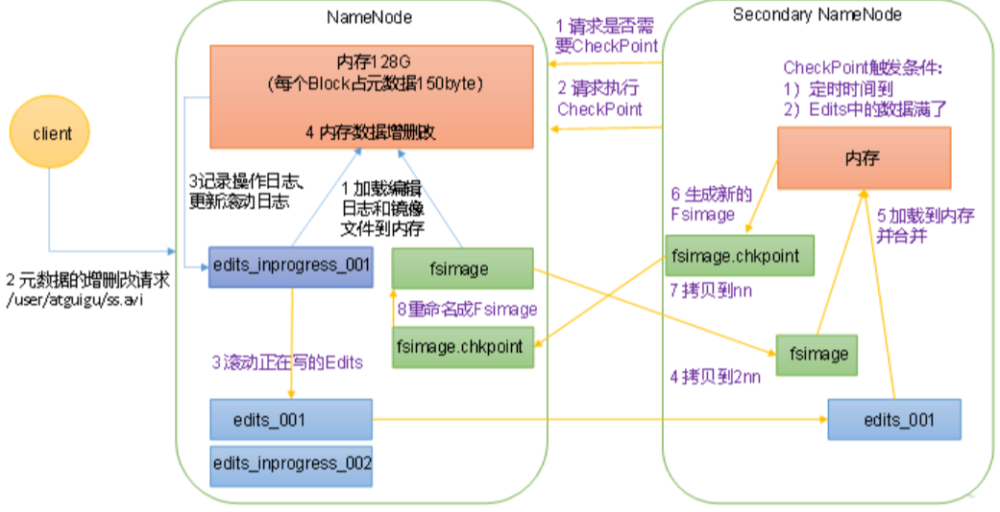

1）第一阶段：NameNode启动

​	（1）第一次启动NameNode格式化后，创建Fsimage和Edits文件。如果不是第一次启动，直接加载编辑日志和镜像文件到内容。

​	（2）客户端对元数据进行增删改的请求

​	（3）NameNode在记录操作日志，更新滚动日志

​	（4）NameNode在内存中对元数据进行增删改

2）第二阶段：Secondary NameNode工作

​	（1）Secondary NameNode询问NameNode是否需要CheckPoint。直接带回NameNode是否检查结果。

​	（2）Secondary NameNode 请求执行CheckPoint

​	（3）NameNode滚动正在写的Edits日志。

​	（4）将滚动前的编辑日志和镜像文件拷贝到Secondary NameNode。

​	（5）Secondary NameNode加载编辑日志和镜像文件到内存，并合并。

​	（6）生成新的镜像文件fsimage.chkpoint。

​	（7）拷贝fsimage.chkpoint到NameNode。

​	（8）NameNode将fsimage.chkpoint重新命名成fsimage。

**Fsimage和Edits**

NameNode被格式化之后，会在目录中生成如下文件

​	（1）Fsimage文件：HDFS文件系统元数据的一个永久性的checkpoint，其中包含HDFS文件系统的所有目录和文件index的序列化信息。

​	（2）Edits文件：存放HDFS文件系统的所有更新操作的路径，文件系统客户端执行的所有写操作首先会被记录到Edits文件中

​	（3）seen_txid文件保存的是一个数字，就是最后一个edits数字

​	（4）每次NameNode启动的时候都会将Fsimage文件读入内容，加载Edits里面的更新操作，保证了内存中的元数据信息是最新的、同步的，可以看成NameNode启动的时候将Fsimage和Edits文件进行了he'bi

**DataNode**

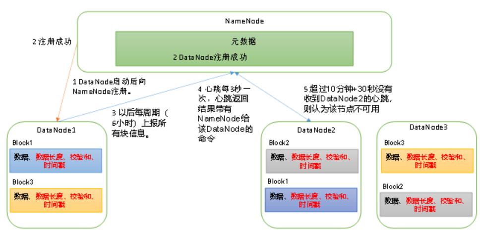

（1）一个数据块在DataNode上以文件形式存储在磁盘上，包括两个文件，一个数据本身，一个是元数据包括数据块的长度，快数据的校验和，以及时间戳

（2）DataNode启动后向NameNode注册，通过后，向NameNode上报所有块信息

（3）心跳是每三秒一次，心跳返回结果带有NameNode给该DataNode的命令如复制块数据到另一台机器，或删除某个数据块。如果超过十分钟没有收到某个DataNode的心跳，则认为该节点不可用

（4）集群运行中可以安全加入和退出一些机器

**DataNode的数据完整性**

思考：如果电脑磁盘里面存储的数据是控制高铁信号灯的红灯信号（1）和绿灯信号（0），但是存储该数据的磁盘坏了，一直显示是绿灯，是否很危险？同理DataNode节点上的数据损坏了，却没有发现，是否也很危险，那么如何解决呢？

（1）当DataNode读取Block的时候，它会计算CheckSum

（2）如果计算后的CheckSum，与Block创建时值不一样，说明Block以及损坏

（3）Client读取其他DataNode上的Block

（4）常见校验算法crc（32），md5（128）

（5）DataNode在其文件创建后周期验证ChechSum

## Spark

**概述**

[Spark](https://so.csdn.net/so/search?q=Spark&spm=1001.2101.3001.7020)是一种快速、通用、可扩展的大数据分析引擎，它基于内存计算的大数据并行计算框架，能够显著提高大数据环境下数据处理的实时性，同时保证高容错性和高可伸缩性。以下是对Spark的详细介绍：

**核心特点**

1. **高速性能**：Spark采用内存计算（In-Memory Computing）的方式，将数据存储在内存中进行处理，从而大幅提升了数据处理速度。相比于传统的磁盘存储方式，Spark能够在内存中进行更快的数据访问和计算。
2. **可扩展性**：Spark具有良好的可扩展性，可以在大规模分布式集群上运行。它通过将任务发到集群中多个节点并行执行，充分利用集群中的计算和存储资源，实现高效的分布式计算。
3. **容错性**：Spark具备容错性，即使在集群中发生节点故障或任务失败时，它能够自动恢复和重新执行。Spark通过记录数据操作的转换历史和依赖关系，可以在发生故障时重新计算丢失的数据，确保计算结果的正确性和可靠性
4. **多种语言处理任务支持**：Spark支持多种数据处理任务，包括批处理、交互式查询、流式处理和机器学习等。它提供了丰富的API和库，用于处理不同类型的数据和应用场景。
5. **多语言支持**：Spark支持多种编程语言，如Scala、Java、Python和R等。开发人员可以使用自己熟悉的编程语言来编写Spark应用程序，方便快捷地进行大数据处理和分析。

**Spark VS Hadoop**

尽管 Spark 相对于 Hadoop 而言具有较大优势，但 Spark 并不能完全替代 Hadoop，Spark 主要用于替代Hadoop中的 MapReduce 计算模型。存储依然可以使用 HDFS，但是中间结果可以存放在内存中；调度可以使用 Spark 内置的，也可以使用更成熟的调度系统 YARN 等。
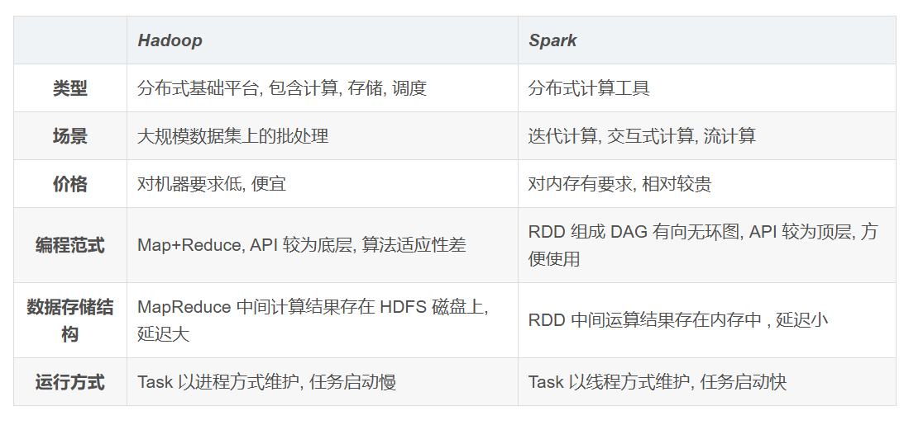

实际上，Spark 已经很好地融入了 Hadoop 生态圈，并成为其中的重要一员，它可以借助于 YARN 实现资源调度管理，借助于 HDFS 实现分布式存储。

此外，Hadoop 可以使用廉价的、异构的机器来做分布式存储与计算，但是，Spark 对硬件的要求稍高一些，对内存与 CPU 有一定的要求。

**Spark的优势与特点**：

首先查看MapReduce，它提供了对数据访问和计算的抽象，但是对数据的复用就是简单地将中间数据写入到一个稳定的文件系统中，所以会产生数据的复制备份，磁盘I/O以及数据的序列化，所以在遇到需要多次计算之间复用中间结果的操作时效率非常低。而这类操作是非常常见的，例如迭代式计算，图计算。提出的新模型叫做RDD

- RDD是一个可以容错且并行的数据结果（其实可以理解为分布式的集合，操作起来和操作本地集合一样简单），可以让用户显式的将中间结果保存在内存中，并且通过控制数据集的分区来达到数据存放处理最优化。同时RDD也提供了丰富的API来操作数据集

**Spark生态圈**

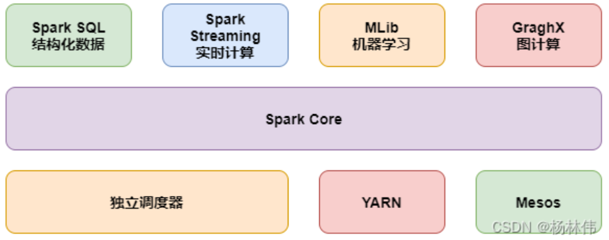

- **Spark Core**：实现了Spark基本功能，包括RDD、任务调度、内存管理、错误恢复，与存储系统交互等模块
- **Spark SQL**：Spark 用来操作结构化数据的程序包。通过Spark SQL，我们可以使用SQL操作数据
- **Spark Straming**：提供对实时数据进行流式计算的组件。提供了用来操作数据流的API
- 

