# Person Re-Identification

## 2025

- **CLIP-Driven Semantic Discovery Network for Visible-Infrared Person Re-Identification**

> **IEEE Transactions on Multimedia, 2025. [(PDF)](/Users/huangkaiwen/Desktop/Paper/person-reid/2025-CLIP-Driven_Semantic_Discovery_Network_for_Visible-Infrared_Person_Re-Identification.pdf)   **[link](https://scholar.google.com/scholar?hl=zh-CN&as_sdt=0%2C5&q=CLIP-Driven+Semantic+Discovery+Network+for+Visible-Infrared+Person+Re-Identification&btnG=)  
>
> 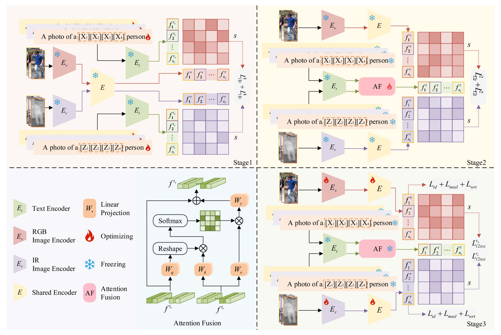
>
> **论文引用**：
>
> ```
> @article{yu2025clip,
>   title={Clip-driven semantic discovery network for visible-infrared person re-identification},
>   author={Yu, Xiaoyan and Dong, Neng and Zhu, Liehuang and Peng, Hao and Tao, Dapeng},
>   journal={IEEE Transactions on Multimedia},
>   year={2025},
>   publisher={IEEE}
> }
> ```

- **CILP-FGDI: Exploiting Vision-Language Model for Generalizable Person Re-Identification**

> **IEEE Transactions on Information Forensics and Security, 2025. [(PDF)](/Users/huangkaiwen/Desktop/Paper/person-reid/2025-CILP-FGDI_Exploiting_Vision-Language_Model_for_Generalizable_Person_Re-Identification.pdf)   **[link](https://scholar.google.com/scholar?hl=zh-CN&as_sdt=0%2C5&q=CILP-FGDI%3A+Exploiting+Vision-Language+Model+for+Generalizable+Person+Re-Identification&btnG=)  
>
> 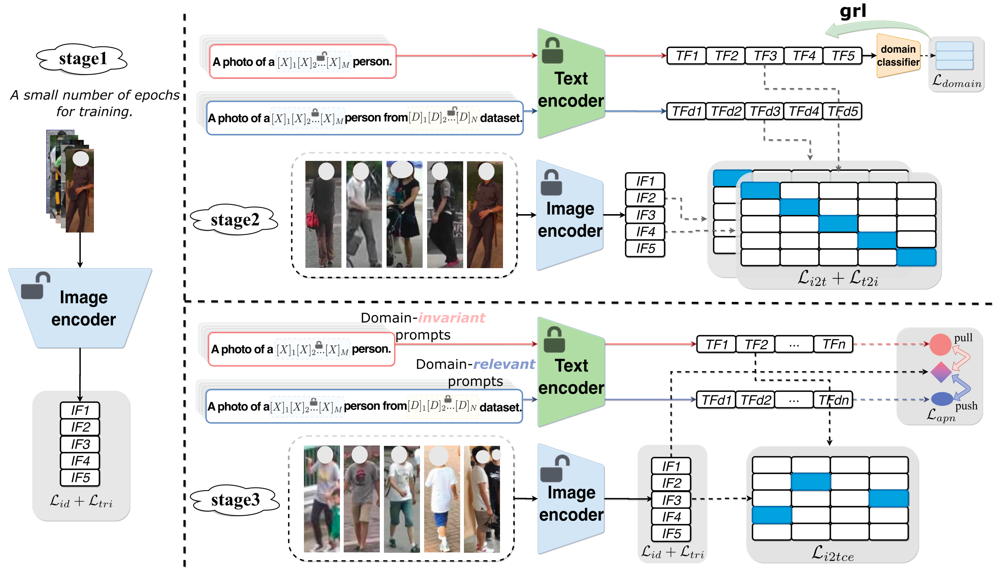
>
> **论文引用**：
>
> ```
> @article{zhao2025cilp,
>   title={CILP-FGDI: Exploiting vision-language model for generalizable person re-identification},
>   author={Zhao, Huazhong and Qi, Lei and Geng, Xin},
>   journal={IEEE Transactions on Information Forensics and Security},
>   year={2025},
>   publisher={IEEE}
> }
> ```

## 2023

- **Reasoning and tuning: Graph attention network for occluded person re-identification**

> **IEEE Transactions on Image Processing, 2023. [(PDF)](/Users/huangkaiwen/Desktop/Paper/person-reid/2023-Reasoning_and_Tuning_Graph_Attention_Network_for_Occluded_Person_Re-Identification.pdf)   **[link](https://scholar.google.com/scholar?hl=zh-CN&as_sdt=0%2C38&q=%7BReasoning+and+tuning%3A+Graph+attention+network+for+occluded+person+re-identification&btnG=)  
>
> 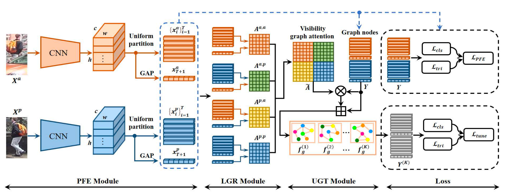
>
> **论文引用**：
>
> ```
> @article{huang2023reasoning,
>     title={Reasoning and tuning: Graph attention network for occluded person re-identification},
>     author={Huang, Meiyan and Hou, Chunping and Yang, Qingyuan and Wang, Zhipeng},
>     journal={IEEE Transactions on Image Processing},
>     volume={32},
>     pages={1568--1582},
>     year={2023},
>     publisher={IEEE}
> }
> ```


- **CLIP-Driven Fine-Grained Text-Image Person Re-Identification**

> **IEEE Transactions on Image Processing, 2023. [(PDF)](/Users/huangkaiwen/Desktop/Paper/person-reid/2023-CLIP-Driven_Fine-Grained_Text-Image_Person_Re-Identification.pdf)   **[link](https://scholar.google.com/scholar?hl=zh-CN&as_sdt=0%2C5&q=CLIP-Driven+Fine-Grained+Text-Image+Person+Re-Identification&btnG=)  
>
> 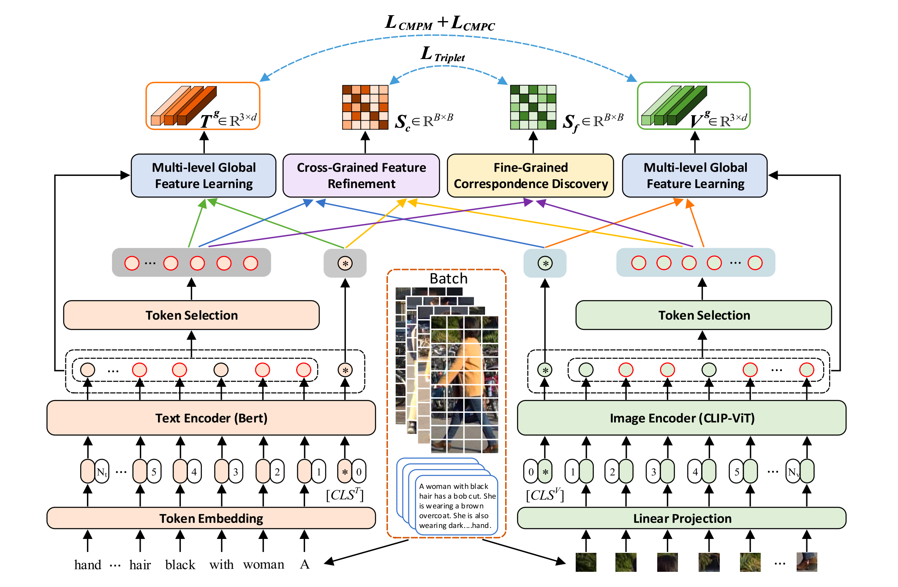
>
> **论文引用**：
>
> ```
> @article{yan2023clip,
> title={Clip-driven fine-grained text-image person re-identification},
> author={Yan, Shuanglin and Dong, Neng and Zhang, Liyan and Tang, Jinhui},
> journal={IEEE Transactions on Image Processing},
> volume={32},
> pages={6032--6046},
> year={2023},
> publisher={IEEE}
> }
> ```


- **Body part-based representation learning for occluded person re-identification**

> **WACV, 2023. [(PDF)](/Users/huangkaiwen/Desktop/Paper/person-reid/2023-Somers_Body_Part-Based_Representation_Learning_for_Occluded_Person_Re-Identification_WACV_2023_paper.pdf)   **[link](https://scholar.google.com/scholar?hl=zh-CN&as_sdt=0%2C38&q=Body+part-based+representation+learning+for+occluded+person+re-identification&btnG=)  
>
> 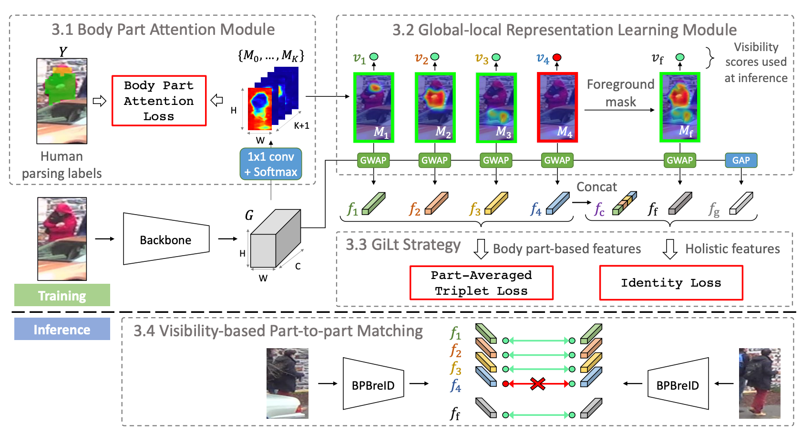
>
> **论文引用**：
>
> ```
> @inproceedings{somers2023body,
>   title={Body part-based representation learning for occluded person re-identification},
>   author={Somers, Vladimir and De Vleeschouwer, Christophe and Alahi, Alexandre},
>   booktitle={Proceedings of the IEEE/CVF winter conference on applications of computer vision},
>   pages={1613--1623},
>   year={2023}
> }
> ```


## 2022

- **Human Co-Parsing Guided Alignment for Occluded Person Re-Identification**

> **TIP, 2022. [(PDF)](/Users/huangkaiwen/Desktop/Paper/person-reid/2022-Human_Co-Parsing_Guided_Alignment_for_Occluded_Person_Re-Identification.pdf)   **[link](https://scholar.google.com/scholar?hl=zh-CN&as_sdt=0%2C38&q=Human+co-parsing+guided+alignment+for+occluded+person+re-identification&btnG=)  
>
> 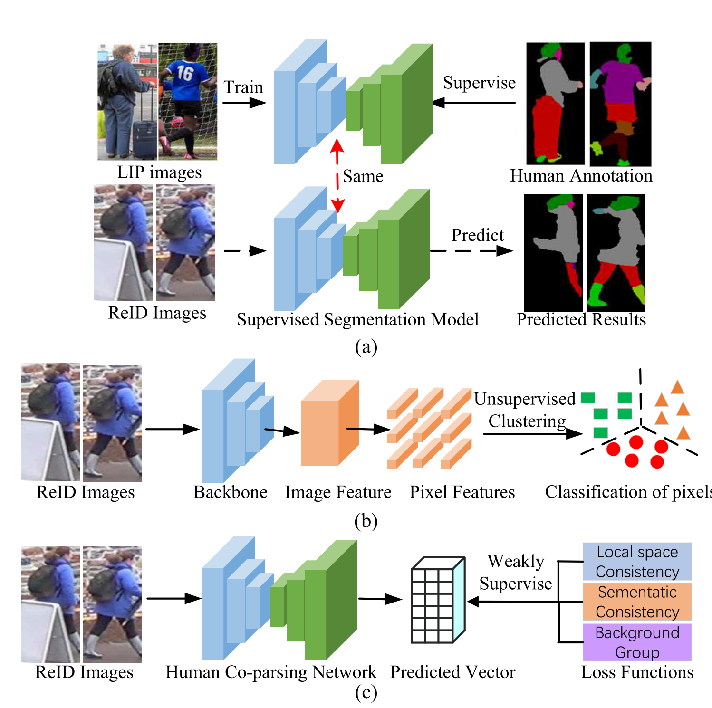
>
> **论文引用**：
>
> ```
> @article{dou2022human,
>   title={Human co-parsing guided alignment for occluded person re-identification},
>   author={Dou, Shuguang and Zhao, Cairong and Jiang, Xinyang and Zhang, Shanshan and Zheng, Wei-Shi and Zuo, Wangmeng},
>   journal={IEEE Transactions on Image Processing},
>   volume={32},
>   pages={458--470},
>   year={2022},
>   publisher={IEEE}
> }
> ```


## 2021

- **Transformer Meets Part Model: Adaptive Part Division for Person Re-Identification**

> **ICCV, 2021. [(PDF)](/Users/huangkaiwen/Desktop/Paper/person-reid/2021-Transformer_Meets_Part_Model_Adaptive_Part_Division_for_Person_Re-Identification_ICCVW_2021_paper.pdf)   **[link](https://scholar.google.com/scholar?hl=zh-CN&as_sdt=0%2C38&q=Transformer+meets+part+model%3A+Adaptive+part+division+for+person+re-identification&btnG=)  
>
> 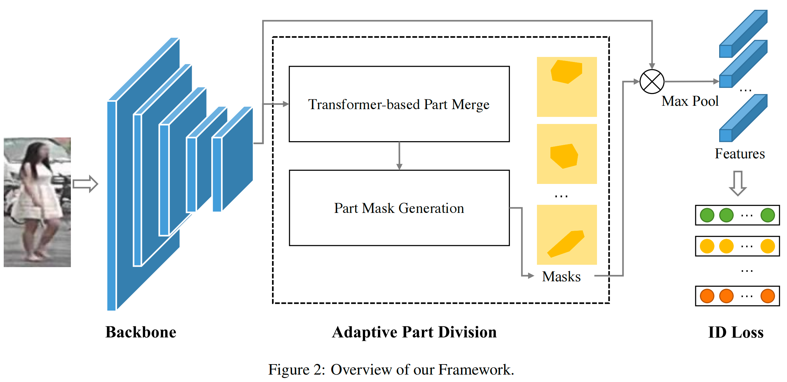
>
> **论文引用**：
>
> ```
> @inproceedings{lai2021transformer,
>   title={Transformer meets part model: Adaptive part division for person re-identification},
>   author={Lai, Shenqi and Chai, Zhenhua and Wei, Xiaolin},
>   booktitle={Proceedings of the IEEE/CVF international conference on computer vision},
>   pages={4150--4157},
>   year={2021}
> }
> ```


- **Learning person re-identification models from videos with weak supervision**

> **IEEE TRANSACTIONS ON IMAGE PROCESSING, 2021. [(PDF)](/Users/huangkaiwen/Desktop/Paper/person-reid/2021-Learning_Person_Re-Identification_Models_From_Videos_With_Weak_Supervision.pdf)   **[link](https://scholar.google.com/scholar?hl=zh-CN&as_sdt=0%2C38&q=Learning+person+re-identification+models+from+videos+with+weak+supervision&btnG=)  
>
> 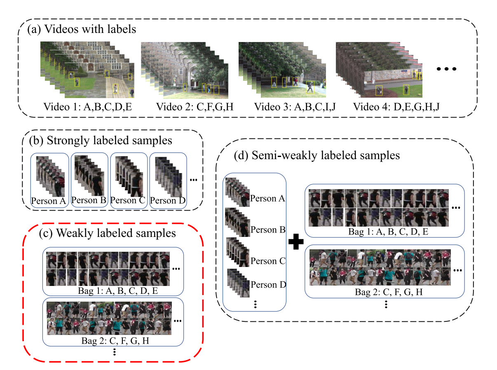
>
> **论文引用**：
>
> ```
> @article{wang2021learning,
>   title={Learning person re-identification models from videos with weak supervision},
>   author={Wang, Xueping and Liu, Min and Raychaudhuri, Dripta S and Paul, Sujoy and Wang, Yaonan and Roy-Chowdhury, Amit K},
>   journal={IEEE Transactions on Image Processing},
>   volume={30},
>   pages={3017--3028},
>   year={2021},
>   publisher={IEEE}
> }
> ```


## 2018

- **Deep Spatial Feature Reconstruction for Partial Person Re-identification: Alignment-free Approach**

> **CVPR, 2018. [(PDF)](/Users/huangkaiwen/Desktop/Paper/person-reid/2018-Deep_Spatial_Feature_CVPR_2018_paper.pdf)   **[link](https://scholar.google.com/scholar?q=Deep+spatial+feature+reconstruction+for+partial+person+re-identification%3A+Alignment-free+approach&hl=zh-CN&as_sdt=0%2C38&as_ylo=&as_yhi=)  
>
> 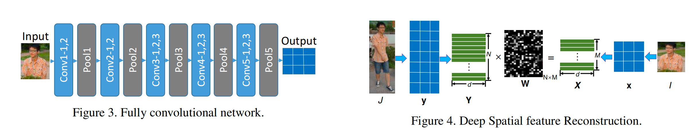
>
> **论文引用**：
>
> ```
> @inproceedings{he2018deep,
>   title={Deep spatial feature reconstruction for partial person re-identification: Alignment-free approach},
>   author={He, Lingxiao and Liang, Jian and Li, Haiqing and Sun, Zhenan},
>   booktitle={Proceedings of the IEEE conference on computer vision and pattern recognition},
>   pages={7073--7082},
>   year={2018}
> }
> ```


- **What-and-where to match: Deep spatially multiplicative integration networks for person re-identification**

> **PR, 2018. [(PDF)](/Users/huangkaiwen/Desktop/Paper/person-reid/2018-What-and-where to match.pdf)   **[link](https://scholar.google.com/scholar?hl=zh-CN&as_sdt=0%2C38&q=What-and-where+to+match%3A+Deep+spatially+multiplicative+integration+networks+for+person+re-identification&btnG=)  
>
> 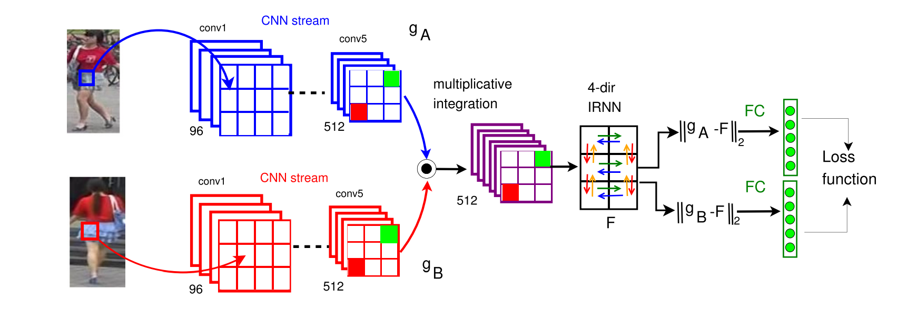
>
> **论文引用**：
>
> ```
> @article{wu2018and,
>   title={What-and-where to match: Deep spatially multiplicative integration networks for person re-identification},
>   author={Wu, Lin and Wang, Yang and Li, Xue and Gao, Junbin},
>   journal={Pattern Recognition},
>   volume={76},
>   pages={727--738},
>   year={2018},
>   publisher={Elsevier}
> }
> ```


# DataSet

- **Scalable Person Re-Identification: A Benchmark**

> **Proceedings of the IEEE international conference on computer vision, 2015. [(PDF)](/Users/huangkaiwen/Desktop/Paper/person-reid/2015-Zheng_Scalable_Person_Re-Identification_ICCV_2015_paper.pdf)   **[link](https://scholar.google.com/scholar?hl=zh-CN&as_sdt=0%2C5&q=Scalable+person+re-identification%3A+A+benchmark&btnG=)  
>
> **论文引用**：
>
> ```
> @inproceedings{zheng2015scalable,
>   title={Scalable person re-identification: A benchmark},
>   author={Zheng, Liang and Shen, Liyue and Tian, Lu and Wang, Shengjin and Wang, Jingdong and Tian, Qi},
>   booktitle={Proceedings of the IEEE international conference on computer vision},
>   pages={1116--1124},
>   year={2015}
> }
> ```

- **Performance measures and a data set for multi-target, multi-camera tracking**

> **European conference on computer vision, 2016. [(PDF)](/Users/huangkaiwen/Desktop/Paper/person-reid/2021-Deep_Learning_for_Person_Re-Identification_A_Survey_and_Outlook.pdf)   **[link](https://scholar.google.com/scholar?hl=zh-CN&as_sdt=0%2C5&q=+Performance+measures+and+a+data+set+for+multi-target%2C+multi-camera+tracking&btnG=#d=gs_cit&t=1759665874943&u=%2Fscholar%3Fq%3Dinfo%3A1eZwtLsS_xsJ%3Ascholar.google.com%2F%26output%3Dcite%26scirp%3D0%26hl%3Dzh-CN)  
>
> **论文引用**：
>
> ```
> @inproceedings{ristani2016performance,
>   title={Performance measures and a data set for multi-target, multi-camera tracking},
>   author={Ristani, Ergys and Solera, Francesco and Zou, Roger and Cucchiara, Rita and Tomasi, Carlo},
>   booktitle={European conference on computer vision},
>   pages={17--35},
>   year={2016},
>   organization={Springer}
> }
> ```

# Survey

- **A Survey of Vehicle Re-Identification Based on Deep Learning**

> **IEEE transactions on pattern analysis and machine intelligence, 2021. [(PDF)](/Users/huangkaiwen/Desktop/Paper/person/2021-Deep_Learning_for_Person_Re-Identification_A_Survey_and_Outlook.pdf)   **[link](https://scholar.google.com.hk/scholar?hl=zh-CN&as_sdt=0%2C5&q=Deep+learning+for+person+re-identification%3A+A+survey+and+outlook&btnG=)  【引用数 **1281**】
>
> **论文引用**：
>
> ```
> @article{ye2021deep,
>   title={Deep learning for person re-identification: A survey and outlook},
>   author={Ye, Mang and Shen, Jianbing and Lin, Gaojie and Xiang, Tao and Shao, Ling and Hoi, Steven CH},
>   journal={IEEE transactions on pattern analysis and machine intelligence},
>   volume={44},
>   number={6},
>   pages={2872--2893},
>   year={2021},
>   publisher={IEEE}
> }
> ```

- **A Survey of Vehicle Re-Identification Based on Deep Learning**

> **Image and vision computing, 2014. [(PDF)](/Users/huangkaiwen/Desktop/Paper/person/2014-A survey of approaches and trends in person re-identification.pdf)   **[link](https://scholar.google.com.hk/scholar?hl=zh-CN&as_sdt=0%2C5&q=Deep+learning+for+person+re-identification%3A+A+survey+and+outlook&btnG=)  【引用数 **523**】
>
> **论文引用**：
>
> ```
> @article{bedagkar2014survey,
>   title={A survey of approaches and trends in person re-identification},
>   author={Bedagkar-Gala, Apurva and Shah, Shishir K},
>   journal={Image and vision computing},
>   volume={32},
>   number={4},
>   pages={270--286},
>   year={2014},
>   publisher={Elsevier}
> }
> ```

# Tool

- **Visual Instruction Tuning**

> **Advances in neural information processing systems, 2023**  [(PDF)](/Users/huangkaiwen/Desktop/Paper/person-reid/2023-FineTune.pdf)   [link](https://scholar.google.com/scholar?hl=zh-CN&as_sdt=0%2C5&q=Visual+Instruction+Tuning&btnG=#d=gs_cit&t=1759666811747&u=%2Fscholar%3Fq%3Dinfo%3AkKJ4qLADD34J%3Ascholar.google.com%2F%26output%3Dcite%26scirp%3D0%26hl%3Dzh-CN)  
>
> 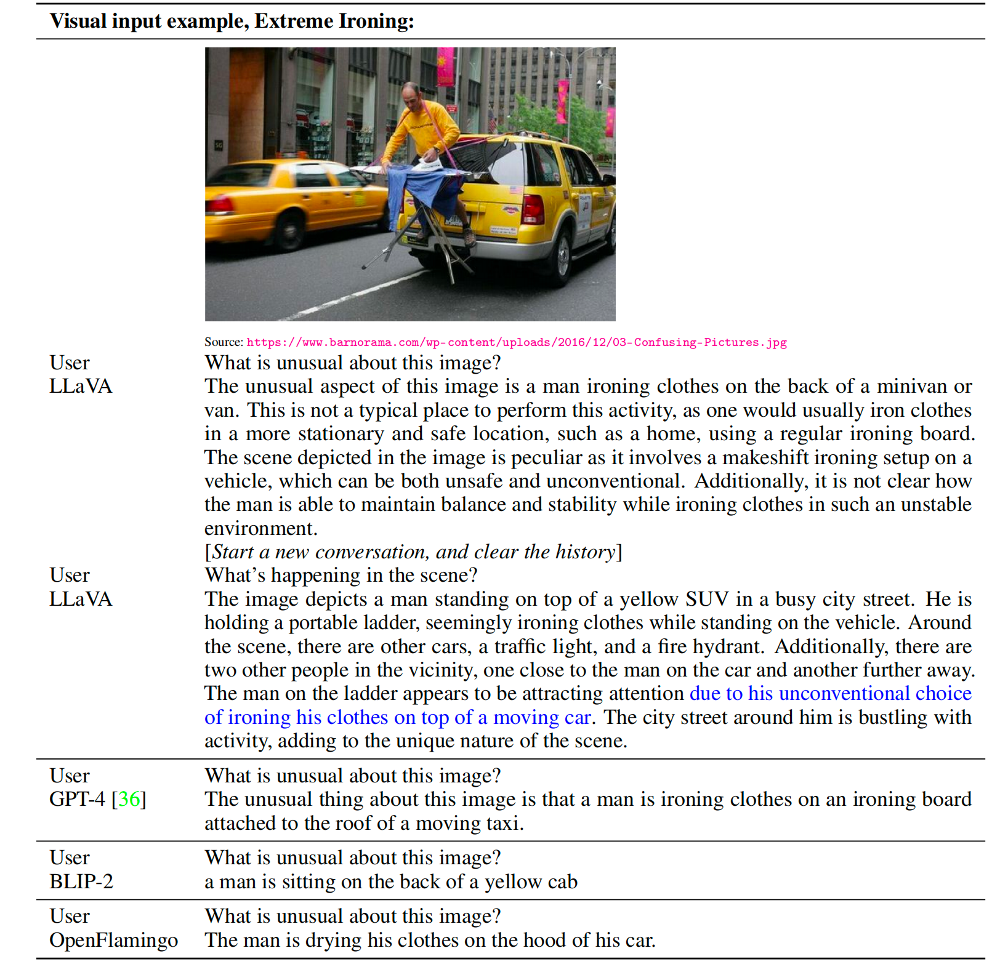
>
> **论文引用**：
>
> ```
> @article{liu2023visual,
> title={Visual instruction tuning},
> author={Liu, Haotian and Li, Chunyuan and Wu, Qingyang and Lee, Yong Jae},
> journal={Advances in neural information processing systems},
> volume={36},
> pages={34892--34916},
> year={2023}
> }
> ```

