#   Vehicle Re-Identification

## 2025

**VehicleMAE: View-asymmetry Mutual Learning for Vehicle Re-identification Pre-training via Masked AutoEncoders**

> **ECCV **2025. [(PDF)](/Users/huangkaiwen/Desktop/Paper/vehicle-reid/2025-VehicleMAE_View-asymmetry_Mutual_Learning_for_Vehicle_Re-identification_Pre-training_via_Masked_ICCV_2025_paper.pdf) [link](https://scholar.google.com/scholar?hl=zh-CN&as_sdt=0%2C5&as_ylo=2025&q=VehicleMAE%3A+View-asymmetry+Mutual+Learning+for+Vehicle+Re-identification+Pre-training+via+Masked+AutoEncoders&btnG=#d=gs_cit&t=1767509689231&u=%2Fscholar%3Fq%3Dinfo%3Ag9GwWxgFSxAJ%3Ascholar.google.com%2F%26output%3Dcite%26scirp%3D0%26hl%3Dzh-CN)
>
> 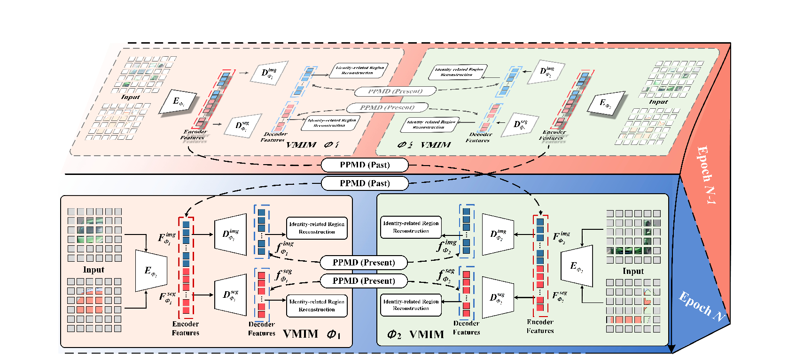
>
> **论文引用**：
>
> ```
> @inproceedings{wang2025vehiclemae,
>   title={VehicleMAE: View-Asymmetry Mutual Learning for Vehicle Re-Identification Pre-Training via Masked AutoEncoders},
>   author={Wang, Qi and Zhang, Zeyu and Wang, Dong and Gai, Di and Xiong, Xin and Xu, Jiyang and Zhou, Ruihua},
>   booktitle={Proceedings of the IEEE/CVF International Conference on Computer Vision},
>   pages={4701--4711},
>   year={2025}
> }
> ```


#### CLIP-SENet: CLIP-based Semantic Enhancement Network for Vehicle Re-identification

> **axiv **2025. [(PDF)](/Users/huangkaiwen/Desktop/Paper/vehicle-reid/2025-ClipSE.pdf) [link](https://scholar.google.com/scholar?hl=zh-CN&as_sdt=0%2C5&as_ylo=2025&q=CLIP-SENet%3A+CLIP-based+Semantic+Enhancement+Network+for+Vehicle+Re-identification&btnG=)
>
> 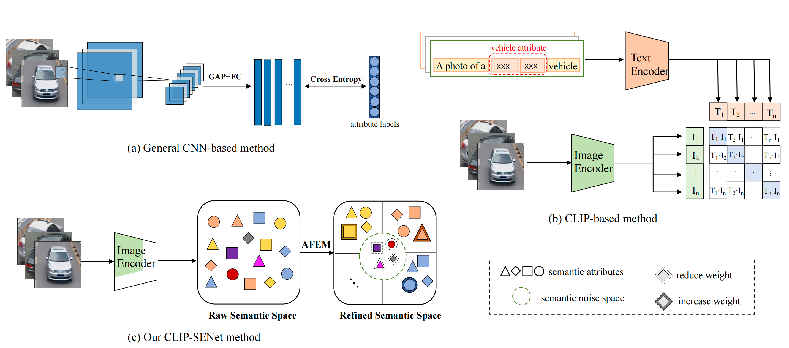
>
> **论文引用**：
>
> ```
> @article{lu2025clip,
>   title={CLIP-SENet: CLIP-based Semantic Enhancement Network for Vehicle Re-identification},
>   author={Lu, Liping and Fu, Zihao and Chu, Duanfeng and Wang, Wei and Xu, Bingrong},
>   journal={arXiv preprint arXiv:2502.16815},
>   year={2025}
> }
> ```


#### Region-guided spatial feature aggregation network for vehicle re-identification

> **Engineering Applications of Artificial Intelligence **2025. [(PDF)](/Users/huangkaiwen/Desktop/Paper/vehicle-reid/2025-rgsf-ReID.pdf) [link](https://scholar.google.com/scholar?hl=zh-CN&as_sdt=0%2C5&as_ylo=2025&q=Region-guided+spatial+feature+aggregation+network+for+vehicle+re-identification&btnG=)
>
> 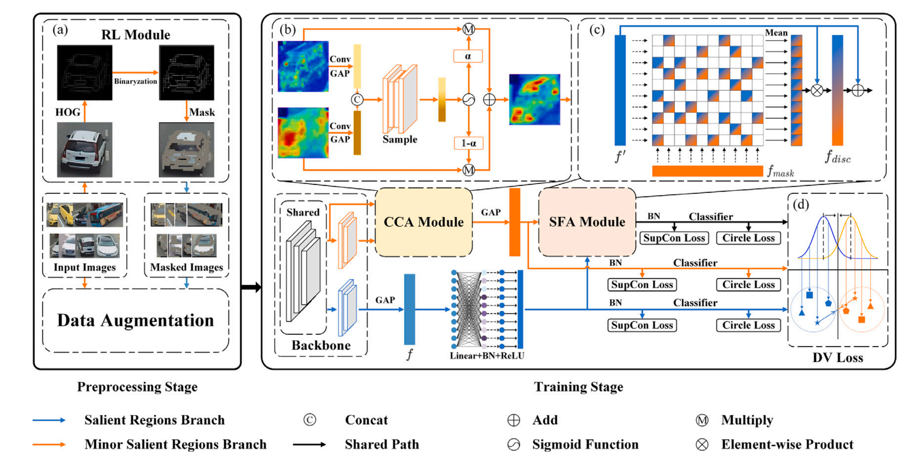
>
> **论文引用**：
>
> ```
> @article{xiong2025region,
>   title={Region-guided spatial feature aggregation network for vehicle re-identification},
>   author={Xiong, Yanzhen and Peng, Jinjia and Tao, Zeze and Wang, Huibing},
>   journal={Engineering Applications of Artificial Intelligence},
>   volume={139},
>   pages={109568},
>   year={2025},
>   publisher={Elsevier}
> }
> ```


#### IDEA: Inverted Text with Cooperative Deformable Aggregation for Multi-modal Object Re-Identification

> **axiv **2025. [(PDF)](/Users/huangkaiwen/Desktop/Paper/vehicle-reid/2025-idea-ReID.pdf) [link](https://scholar.google.com/scholar?hl=zh-CN&as_sdt=0%2C5&q=IDEA%3A+Inverted+Text+with+Cooperative+Deformable+Aggregation+for+Multi-modal+Object+Re-Identification&btnG=)
>
> 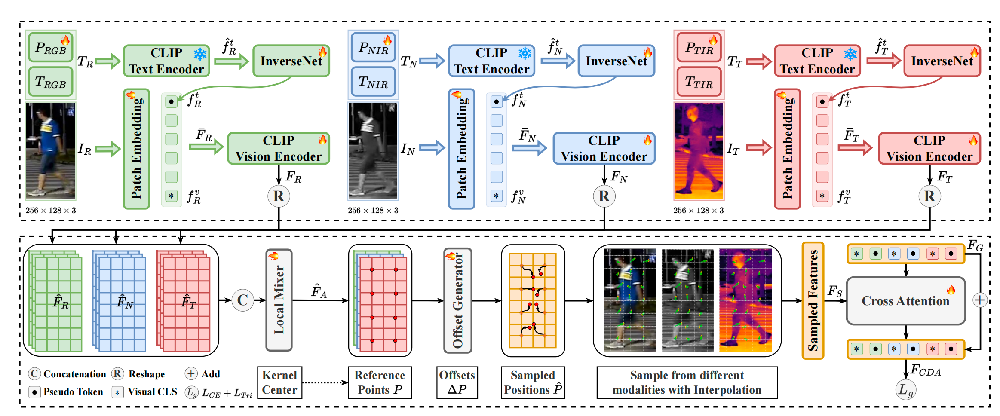
>
> **论文引用**：
>
> ```
> @article{wang2025idea,
>   title={IDEA: Inverted Text with Cooperative Deformable Aggregation for Multi-modal Object Re-Identification},
>   author={Wang, Yuhao and Lv, Yongfeng and Zhang, Pingping and Lu, Huchuan},
>   journal={arXiv preprint arXiv:2503.10324},
>   year={2025}
> }
> ```


#### WTSF-ReID: Depth-driven Window-oriented Token Selection and Fusion for multi-modality vehicle re-identification with knowledge consistency constraint

> **Expert Systems With Application **2025. [(PDF)](/Users/huangkaiwen/Desktop/Paper/vehicle-reid/2025-WTSF-ReID.pdf) [link](https://scholar.google.com/scholar?hl=zh-CN&as_sdt=0%2C5&q=WTSF-ReID%3A+Depth-driven+Window-oriented+Token+Selection+and+Fusion+for+multi-modality+vehicle+re-identification+with+knowledge+consistency+constraint&btnG=)
>
> 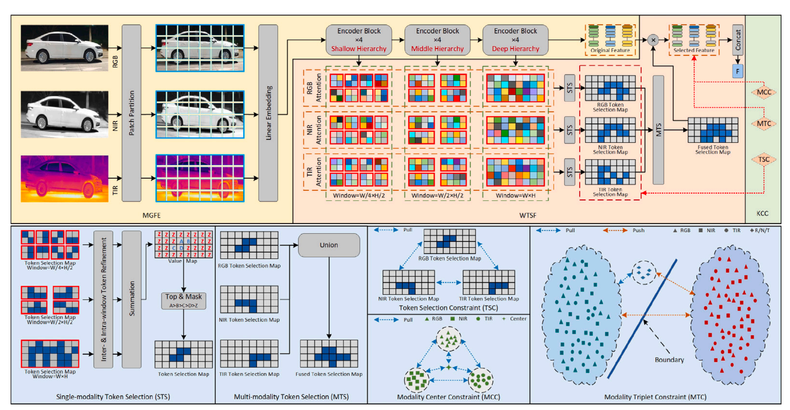
>
> **论文引用**：
>
> ```
> @article{yu2025wtsf,
>   title={WTSF-ReID: Depth-driven Window-oriented Token Selection and Fusion for multi-modality vehicle re-identification with knowledge consistency constraint},
>   author={Yu, Zhi and Huang, Zhiyong and Hou, Mingyang and Yan, Yan and Liu, Yushi},
>   journal={Expert Systems with Applications},
>   pages={126921},
>   year={2025},
>   publisher={Elsevier}
> }
> ```


## 2024

#### Vision-language constraint graph representation learning for unsupervised vehicle re-identification

> **Expert Systems With Application**,2024. [(PDF)](/Users/huangkaiwen/Desktop/Paper/vehicle-reid/2024-vcgr-ReID.pdf) [link](https://scholar.google.com/scholar?hl=zh-CN&as_sdt=0%2C5&q=Vision-language+constraint+graph+representation+learning+for+unsupervised+vehicle+re-identification&btnG=)
>
> 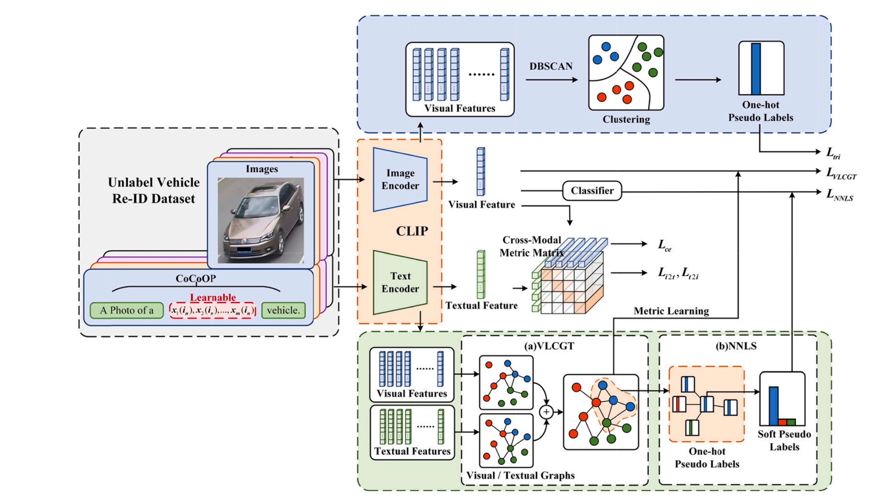
>
> **论文引用**：
>
> ```
> @article{sun2024adversarial,
>   title={Adversarial Style-Irrelevant Feature Learning With Refined Soft Pseudo Labels for Domain-Adaptive Vehicle Re-Identification},
>   author={Sun, Wei and Hu, Yahua and Zhang, Xiaorui and Yao, Xin and He, Xiaozheng},
>   journal={IEEE Transactions on Intelligent Transportation Systems},
>   year={2024},
>   publisher={IEEE}
> }
> ```


#### Adversarial Style-Irrelevant Feature Learning With Refined Soft Pseudo Labels for Domain-Adaptive Vehicle Re-Identification

> **IEEE Tans on Intelligent transport systems**,2024. [(PDF)](/Users/huangkaiwen/Desktop/Paper/vehicle-reid/2024-asfl-ReID.pdf) [link](https://scholar.google.com/scholar?hl=zh-CN&as_sdt=0%2C5&q=Adversarial+Style-Irrelevant+Feature+Learning+With+Refined+Soft+Pseudo+Labels+for+Domain-Adaptive+Vehicle+Re-Identification&btnG=)
>
> 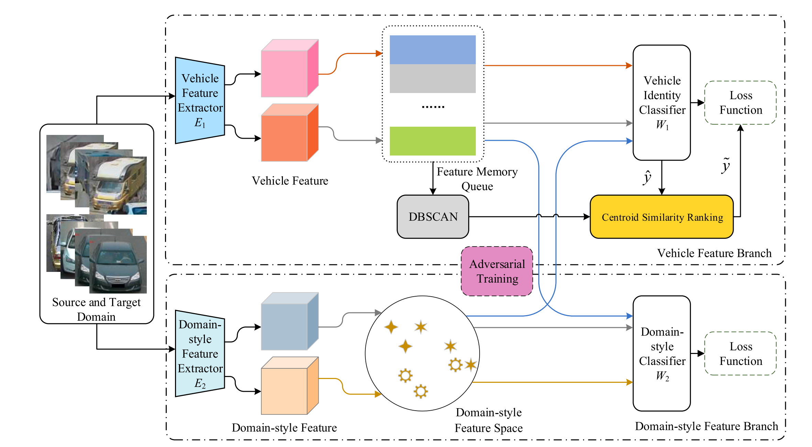
>
> **论文引用**：
>
> ```
> @article{sun2024adversarial,
>   title={Adversarial Style-Irrelevant Feature Learning With Refined Soft Pseudo Labels for Domain-Adaptive Vehicle Re-Identification},
>   author={Sun, Wei and Hu, Yahua and Zhang, Xiaorui and Yao, Xin and He, Xiaozheng},
>   journal={IEEE Transactions on Intelligent Transportation Systems},
>   year={2024},
>   publisher={IEEE}
> }
> ```


#### AIVR-Net: Attribute-based invariant visual representation learning for vehicle re-identification

> **Knowledge-Based Systems **2024. [(PDF)](/Users/huangkaiwen/Desktop/Paper/vehicle-reid/2024-AIVR-Net.pdf) [link](https://scholar.google.com/scholar?hl=zh-CN&as_sdt=0%2C5&q=AIVR-Net%3A+Attribute-based+invariant+visual+representation+learning+for+vehicle+re-identification&btnG=)
>
> 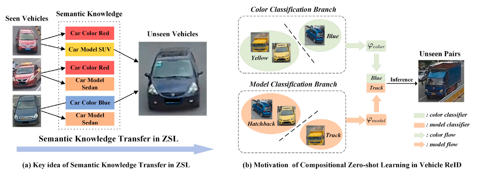
>
> **论文引用**：
>
> ```
> @article{zhang2024aivr,
>   title={AIVR-Net: Attribute-based invariant visual representation learning for vehicle re-identification},
>   author={Zhang, Hongyang and Kuang, Zhenyu and Cheng, Lidong and Liu, Yinhao and Ding, Xinghao and Huang, Yue},
>   journal={Knowledge-Based Systems},
>   volume={289},
>   pages={111455},
>   year={2024},
>   publisher={Elsevier}
> }
> ```


#### TANet- Text region attention learning for vehicle re-identification

> **Engineering Applications of Artificial Intelligence **2024. [(PDF)](/Users/huangkaiwen/Desktop/Paper/vehicle-reid/2024-TANet- Text region attention learning for vehicle re-identification.pdf) [link](https://scholar.google.com/scholar?hl=zh-CN&as_sdt=0%2C5&q=TANet%3A+Text+region+attention+learning+for+vehicle+re-identification&btnG=)
>
> 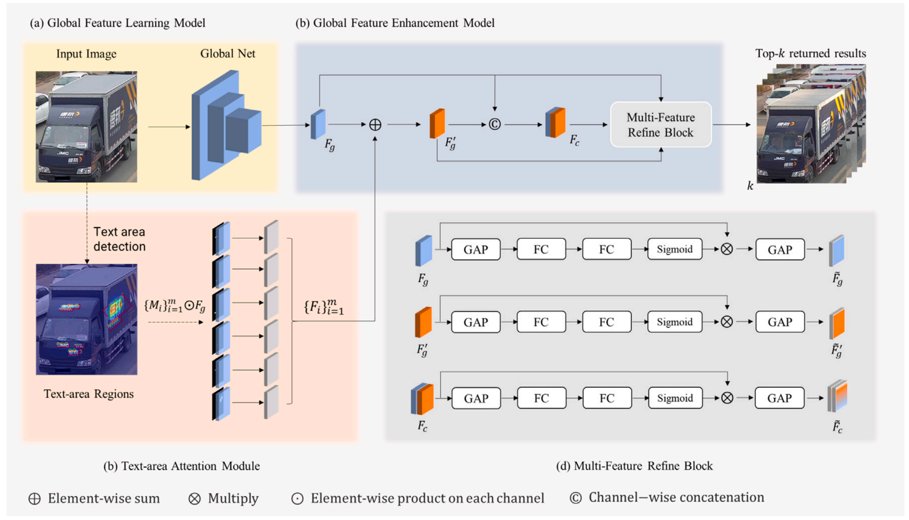
>
> **论文引用**：
>
> ```
> @article{hu2024tanet,
>   title={TANet: Text region attention learning for vehicle re-identification},
>   author={Hu, Wenbo and Zhan, Hongjian and Shivakumara, Palaiahnakote and Pal, Umapada and Lu, Yue},
>   journal={Engineering Applications of Artificial Intelligence},
>   volume={133},
>   pages={108448},
>   year={2024},
>   publisher={Elsevier}
> }
> ```
>


#### A Blockchain-enabled Distributed System for Trustworthy and Collaborative Intelligent Vehicle Re-identification

> **IEEE Transactions on Intelligent Vehicles** [(PDF)](/Users/huangkaiwen/Desktop/Paper/vehicle-reid/2024-A_Blockchain-Enabled_Distributed_System_for_Trustworthy_and_Collaborative_Intelligent_Vehicle_Re-Identification.pdf) [link](https://scholar.google.com/scholar?hl=zh-CN&as_sdt=0%2C5&q=A+Blockchain-Enabled+Distributed+System+for+Trustworthy+and+Collaborative+Intelligent+Vehicle+Re-Identification&btnG=)
>
> 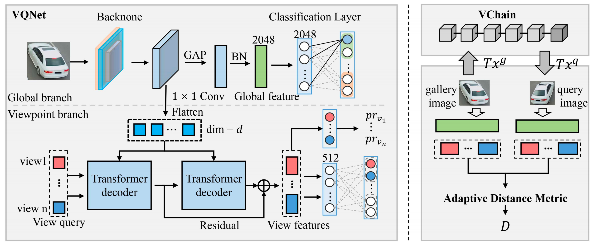
>
> **论文引用**：
>
> ```
> @article{wang2023blockchain,
>   title={A Blockchain-enabled Distributed System for Trustworthy and Collaborative Intelligent Vehicle Re-identification},
>   author={Wang, Shuai and Yang, Da and Sheng, Hao and Shen, Jiahao and Zhang, Yang and Ke, Wei},
>   journal={IEEE Transactions on Intelligent Vehicles},
>   year={2023},
>   publisher={IEEE}
> }
> ```


#### Day-Night Cross-domain Vehicle Re-identification

> **CVPR **2024. [(PDF)](/Users/huangkaiwen/Desktop/Paper/vehicle-reid/2024-Li_Day-Night_Cross-domain_Vehicle_Re-identification_CVPR_2024_paper.pdf) **[link](https://scholar.google.com/scholar?hl=zh-CN&as_sdt=0%2C5&q=Day-Night+Cross-domain+Vehicle+Re-identification&btnG=) 【引用数：**0】
>
> 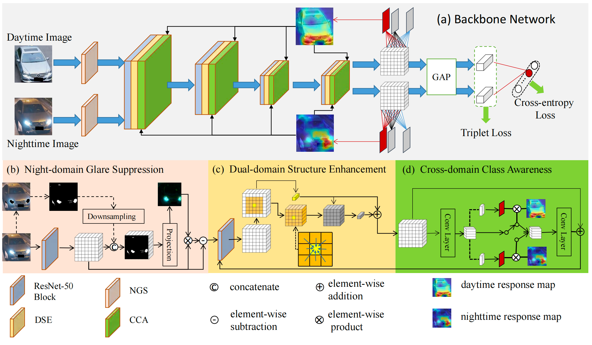
>
> **论文引用**：
>
> ```
> @inproceedings{li2024day,
>   title={Day-Night Cross-domain Vehicle Re-identification},
>   author={Li, Hongchao and Chen, Jingong and Zheng, Aihua and Wu, Yong and Luo, Yonglong},
>   booktitle={Proceedings of the IEEE/CVF Conference on Computer Vision and Pattern Recognition},
>   pages={12626--12635},
>   year={2024}
> }
> ```


#### Multi-Branch Enhanced Discriminative Network for Vehicle Re-Identification

> **IEEE Transactions on Intelligent Transportation Systems **2024. [(PDF)](/Users/huangkaiwen/Desktop/Paper/vehicle-reid/2024-Multi-Branch_Enhanced_Discriminative_Network_for_Vehicle_Re-Identification.pdf) **[link](https://scholar.google.com/scholar?hl=zh-CN&as_sdt=0%2C5&q=Multi-Branch+Enhanced+Discriminative+Network+for+Vehicle+Re-Identification&btnG=) **
>
> 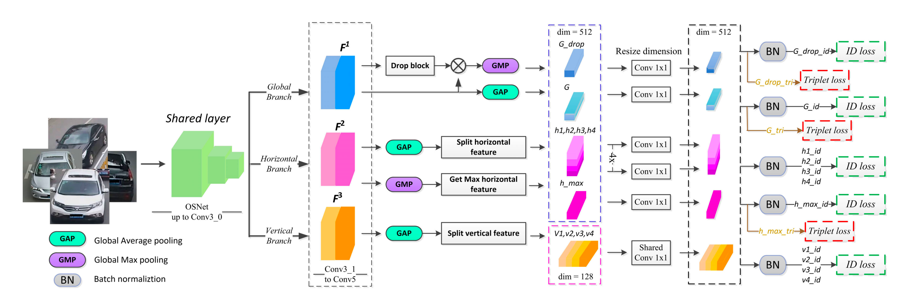
>
> **论文引用**：
>
> ```
> @article{lian2023multi,
>   title={Multi-Branch Enhanced Discriminative Network for Vehicle Re-Identification},
>   author={Lian, Jiawei and Wang, Da-Han and Wu, Yun and Zhu, Shunzhi},
>   journal={IEEE Transactions on Intelligent Transportation Systems},
>   year={2023},
>   publisher={IEEE}
> }
> ```


#### ccDair-v2xreid: A new real-world vehicle-infrastructure cooperative re-id dataset and cross-shot feature aggregation network perception method

> **IEEE Transactions on Intelligent Transportation Systems **. [(PDF)](/Users/huangkaiwen/Desktop/Paper/vehicle-reid/2024-DAIR-V2XReid_A_New_Real-World_Vehicle-Infrastructure_Cooperative_Re-ID_Dataset_and_Cross-Shot_Feature_Aggregation_Network_Perception_Method.pdf) **[link](https://scholar.google.com/scholar?hl=zh-CN&as_sdt=0%2C5&q=DAIR-V2XReid%3A+A+New+Real-World+Vehicle-Infrastructure+Cooperative+Re-ID+Dataset+and+Cross-Shot+Feature+Aggregation+Network+Perception+Method&btnG=#d=gs_cit&t=1725270793202&u=%2Fscholar%3Fq%3Dinfo%3AQgTu_Dy-6BgJ%3Ascholar.google.com%2F%26output%3Dcite%26scirp%3D0%26hl%3Dzh-CN) **
>
> 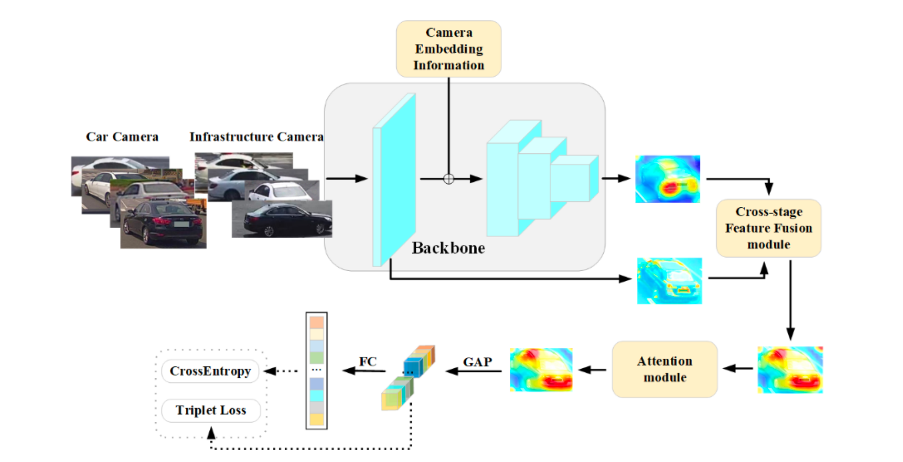
>
> **论文引用**：
>
> ```
> @article{wang2024dair,
>   title={Dair-v2xreid: A new real-world vehicle-infrastructure cooperative re-id dataset and cross-shot feature aggregation network perception method},
>   author={Wang, Hai and Niu, Yaqing and Chen, Long and Li, Yicheng and Sotelo, Miguel Angel and Li, Zhixiong and Cai, Yingfeng},
>   journal={IEEE Transactions on Intelligent Transportation Systems},
>   year={2024},
>   publisher={IEEE}
> }
> ```


## 2023

#### URRNet: A Unified Relational Reasoning Network for Vehicle Re-Identification

> **IEEE Transactions on Vehicular Technology. [(PDF)](/Users/huangkaiwen/Desktop/Paper/vehicle-reid/2023-URRNet_A_Unified_Relational_Reasoning_Network_for_Vehicle_Re-Identification.pdf) **[link](https://scholar.google.com/scholar?hl=zh-CN&as_sdt=0%2C5&q=URRNet%3A+A+unified+relational+reasoning+network+for+vehicle+re-identification&btnG=) 
>
> 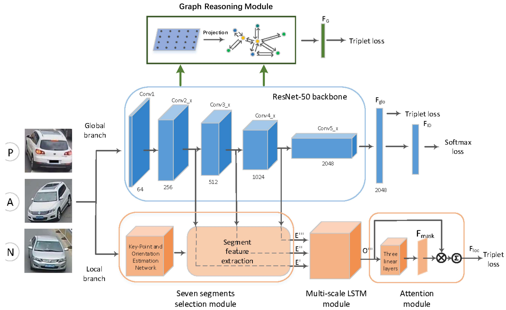
>
> **论文引用**：
>
> ```
> @article{qian2023urrnet,
>   title={URRNet: A unified relational reasoning network for vehicle re-identification},
>   author={Qian, Jiuchao and Pan, Minting and Tong, Wei and Law, Rob and Wu, Edmond Q},
>   journal={IEEE Transactions on Vehicular Technology},
>   volume={72},
>   number={9},
>   pages={11156--11168},
>   year={2023},
>   publisher={IEEE}
> }
> ```


#### A dual self-attention mechanism for vehicle re-identification

> **Pattern Recognition. [(PDF)](/Users/huangkaiwen/Desktop/Paper/vehicle-reid/2023-A Dual Self-Attention mechanism for vehicle re-Identification.pdf) **[link](https://scholar.google.com/scholar?hl=zh-CN&as_sdt=0%2C38&q=A+dual+self-attention+mechanism+for+vehicle+re-identification&btnG=) 
>
> 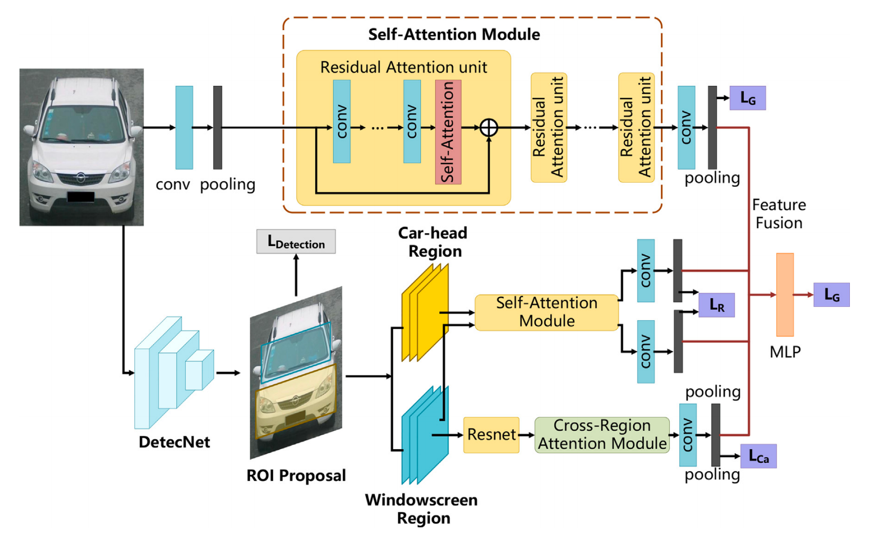
>
> **论文引用**：
>
> ```
> @article{zhu2023dual,
> title={A dual self-attention mechanism for vehicle re-identification},
> author={Zhu, Wenqian and Wang, Zhongyuan and Wang, Xiaochen and Hu, Ruimin and Liu, Huikai and Liu, Cheng and Wang, Chao and Li, Dengshi},
> journal={Pattern Recognition},
> volume={137},
> pages={109258},
> year={2023},
> publisher={Elsevier}
> }
> ```
>


#### A Dual-Branch Network for Few-Shot Vehicle Re-Identification With Enhanced Global and Local Features

> **IEEE Transactions on Instrumentation and Measurement. [(PDF)](/Users/huangkaiwen/Desktop/Paper/vehicle-reid/2023-A_Dual-Branch_Network_for_Few-Shot_Vehicle_Re-Identification_With_Enhanced_Global_and_Local_Features.pdf) **[link](https://scholar.google.com/scholar?hl=zh-CN&as_sdt=0%2C5&q=A+Dual-Branch+Network+for+Few-Shot+Vehicle+Re-Identification+With+Enhanced+Global+and+Local+Features&btnG=) 
>
> 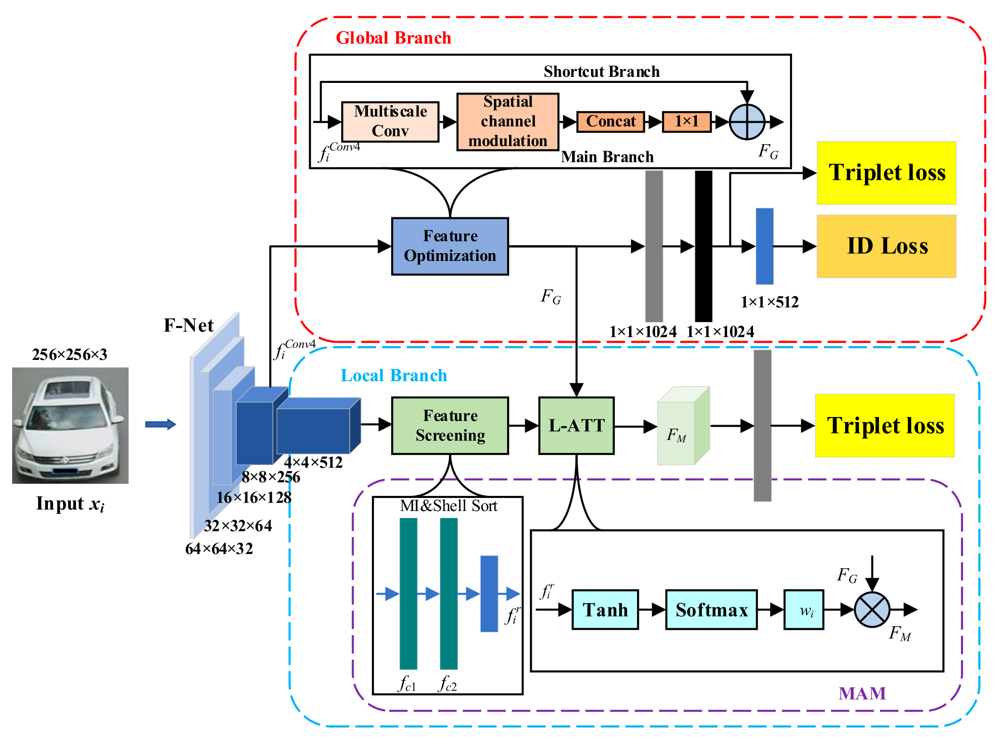
>
> **论文引用**：
>
> ```
> @article{sun2023dual,
> title={A Dual-Branch Network for Few-Shot Vehicle Re-Identification With Enhanced Global and Local Features},
> author={Sun, Wei and Xu, Fan and Zhang, Xiaorui and Hu, Yahua and Dai, Guangzhao and He, Xiaozheng},
> journal={IEEE Transactions on Instrumentation and Measurement},
> volume={72},
> pages={1--12},
> year={2023},
> publisher={IEEE}
> }
> ```
>


#### Strength in Diversity: Multi-Branch Representation Learning for Vehicle Re-Identification

> **preprint 2023. [(PDF)](/Users/huangkaiwen/Desktop/Paper/vehicle-reid/2023-Multi-Branch Representation Learning For VehicleReId.pdf) **[link](https://scholar.google.com/scholar?hl=zh-CN&as_sdt=0%2C5&q=**Strength+in+Diversity%3A+Multi-Branch+Representation+Learning+for+Vehicle+Re-Identification**+&btnG=) 【引用数：**0**】
>
> 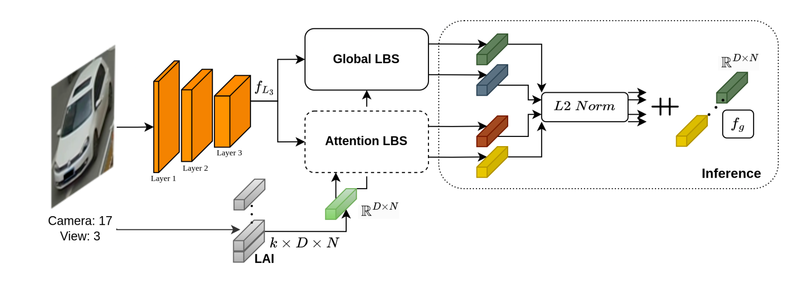
>
> **论文引用**：
>
> ```
> @article{almeida2023strength,
> title={Strength in Diversity: Multi-Branch Representation Learning for Vehicle Re-Identification},
> author={Almeida, Eurico and Silva, Bruno and Batista, Jorge},
> journal={arXiv preprint arXiv:2310.01129},
> year={2023}
> }
> ```
>


#### GiT: Graph Interactive Transformer for Vehicle Re-Identification

> **IEEE Transactions on Image Processing, 2023. [(PDF)](/Users/huangkaiwen/Desktop/Paper/vehicle-reid/2023-GiT_Graph_Interactive_Transformer_for_Vehicle_Re-Identification.pdf) **[link](https://scholar.google.com/scholar?hl=zh-CN&as_sdt=0%2C5&q=Git%3A+Graph+interactive+transformer+for+vehicle+re-identification&btnG=) 【引用数：0】
>
> 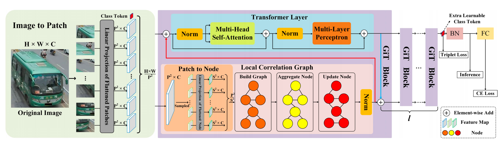
>
> **论文引用**：
>
> ```
> @article{shen2023git,
> title={Git: Graph interactive transformer for vehicle re-identification},
> author={Shen, Fei and Xie, Yi and Zhu, Jianqing and Zhu, Xiaobin and Zeng, Huanqiang},
> journal={IEEE Transactions on Image Processing},
> volume={32},
> pages={1039--1051},
> year={2023},
> publisher={IEEE}
> }
> ```
>


#### FastReID: A Pytorch Toolbox for General Instance Re-identification

> **Proceedings of the 31st ACM International Conference on Multimedia 2023. [(PDF)](/Users/huangkaiwen/Desktop/Paper/vehicle-reid/2023-FastReid.pdf) **[link](https://scholar.google.com/scholar?hl=zh-CN&as_sdt=0%2C5&q=FastReID%3A+A+Pytorch+Toolbox+for+General+Instance+Re-identification&btnG=) 【引用数：**218**】
>
> 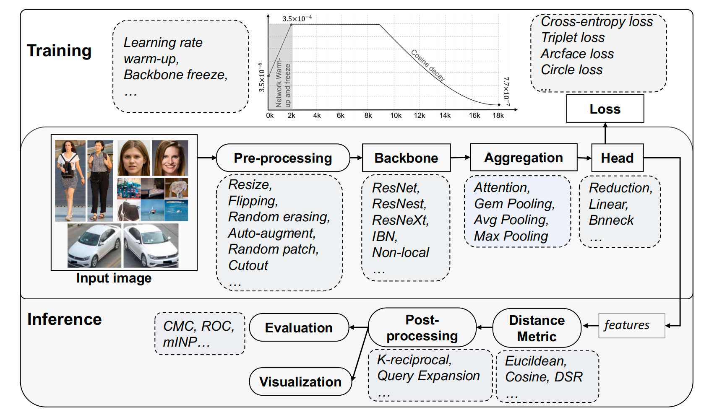
>
> **论文引用**：
>
> ```
> @inproceedings{he2023fastreid,
> title={Fastreid: A pytorch toolbox for general instance re-identification},
> author={He, Lingxiao and Liao, Xingyu and Liu, Wu and Liu, Xinchen and Cheng, Peng and Mei, Tao},
> booktitle={Proceedings of the 31st ACM International Conference on Multimedia},
> pages={9664--9667},
> year={2023}
> }
> ```
>


#### Relation Preserving Triplet Mining for Stabilising the Triplet Loss in Re-identification Systems

> **WACV, 2023. [(PDF)](/Users/huangkaiwen/Desktop/Paper/vehicle-reid/2023-Relation Preserving Triplet Mining for Stabilising the Triplet Loss.pdf) **[link](https://scholar.google.com/scholar?hl=zh-CN&as_sdt=0%2C5&q=**Relation+Preserving+Triplet+Mining+for+Stabilising+the+Triplet+Loss+in+Re-identification+Systems**&btnG=)  【引用数：**3**】
>
> 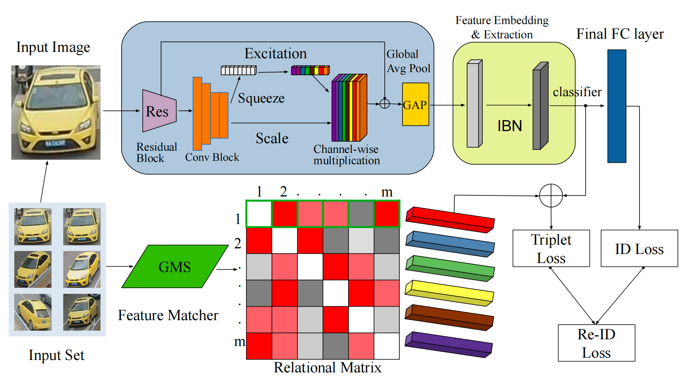
>
> **论文引用**：
>
> ```
> @inproceedings{ghosh2023relation,
> title={Relation preserving triplet mining for stabilising the triplet loss in re-identification systems},
> author={Ghosh, Adhiraj and Shanmugalingam, Kuruparan and Lin, Wen-Yan},
> booktitle={Proceedings of the IEEE/CVF Winter Conference on Applications of Computer Vision},
> pages={4840--4849},
> year={2023}
> }
> ```
>


#### **MSINet: Twins Contrastive Search of Multi-Scale Interaction for Object ReID**

> **CVPR, 2023. [(PDF)](/Users/huangkaiwen/Desktop/Paper/vehicle-reid/2023-Gu_MSINet_Twins_Contrastive_Search_of_Multi-Scale_Interaction_for_Object_ReID_CVPR_2023_paper.pdf) **[link](https://scholar.google.com/scholar?hl=zh-CN&as_sdt=0%2C5&q=MSINet%3A+Twins+Contrastive+Search+of+Multi-Scale+Interaction+for+Object+ReID&btnG=) 【引用数：**6**】
>
> 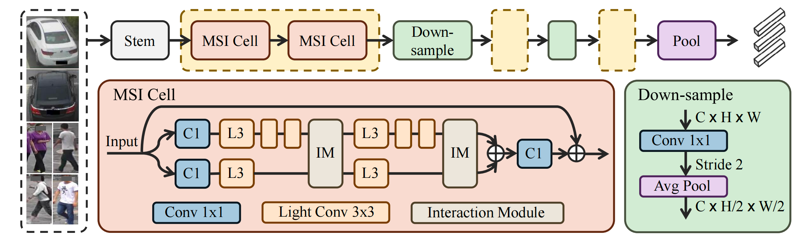
>
> **论文引用**：
>
> ```
> @inproceedings{gu2023msinet,
> title={MSINet: Twins Contrastive Search of Multi-Scale Interaction for Object ReID},
> author={Gu, Jianyang and Wang, Kai and Luo, Hao and Chen, Chen and Jiang, Wei and Fang, Yuqiang and Zhang, Shanghang and You, Yang and Zhao, Jian},
> booktitle={Proceedings of the IEEE/CVF Conference on Computer Vision and Pattern Recognition},
> pages={19243--19253},
> year={2023}
> }
> ```
>


#### Robust and Scalable Vehicle Re-Identification via Self-Supervision

> **CVPR, 2023. [(PDF)](/Users/huangkaiwen/Desktop/Paper/vehicle-reid/2023-Khorramshahi_Robust_and_Scalable_Vehicle_Re-Identification_via_Self-Supervision_CVPRW_2023_paper.pdf) **[link](https://scholar.google.com/scholar?hl=zh-CN&as_sdt=0%2C5&q=Robust+and+Scalable+Vehicle+Re-Identification+via+Self-Supervision&btnG=)  引用数：**3**】
>
> 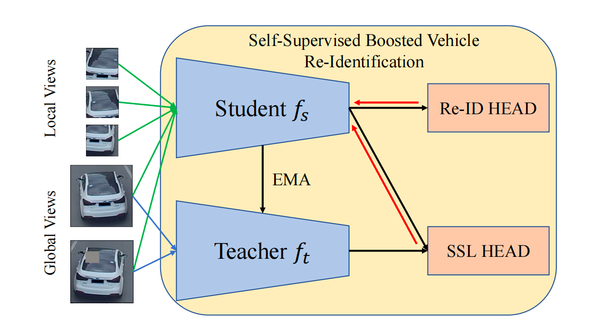
>
> **论文引用**：
>
>   ```
>  @inproceedings{khorramshahi2023robust,
>   title={Robust and Scalable Vehicle Re-Identification via Self-Supervision},
>  author={Khorramshahi, Pirazh and Shenoy, Vineet and Chellappa, Rama},
>   booktitle={Proceedings of the IEEE/CVF Conference on Computer Vision and Pattern Recognition},
> pages={5294--5303},
> year={2023}
> }
> ```
> 


#### A Meta-learning Approach for Domain Generalisation across Visual Modalities in Vehicle Re-identification

> **CVPR, 2023. [(PDF)](/Users/huangkaiwen/Desktop/Paper/vehicle-reid/2023-Kamenou_A_Meta-Learning_Approach_for_Domain_Generalisation_Across_Visual_Modalities_in_CVPRW_2023_paper.pdf) **[link](https://scholar.google.com/scholar?hl=zh-CN&as_sdt=0%2C5&q=A+Meta-learning+Approach+for+Domain+Generalisation+across+Visual+Modalities+in+Vehicle+Re-identification&btnG=) 【引用数：**1**】
>
> 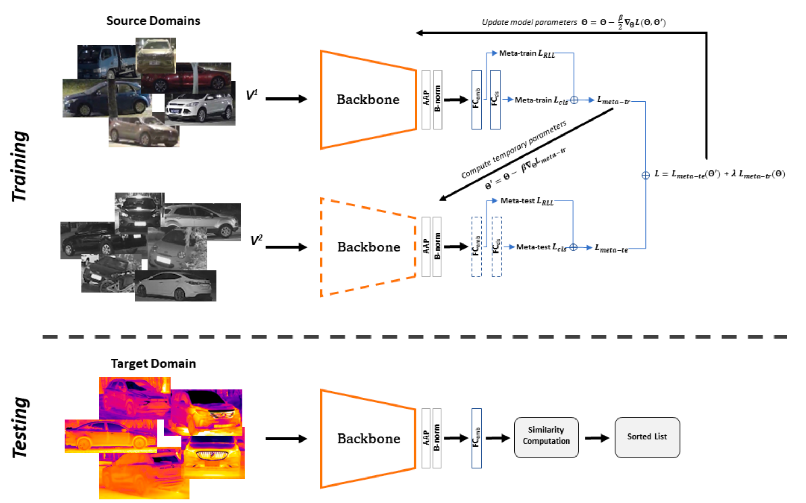
>
>
> **论文引用**：
>
> ```
> @inproceedings{kamenou2023meta,
> title={A Meta-Learning Approach for Domain Generalisation Across Visual Modalities in Vehicle Re-Identification},
> author={Kamenou, Eleni and del Rinc{\'o}n, Jes{\'u}s Mart{\'\i}nez and Miller, Paul and Devlin-Hill, Patricia},
> booktitle={Proceedings of the IEEE/CVF Conference on Computer Vision and Pattern Recognition},
> pages={385--393},
> year={2023}
> } 
> ```
>


#### CLIP-ReID: Exploiting Vision-Language Model for Image Re-Identification without Concrete Text Labels

> **AAAI, 2023 [(PDF)](/Users/huangkaiwen/Desktop/Paper/vehicle-reid/2023-CLIP_ReID Exploiting Vision_Language Model for Image Re_Identification.pdf).  [link](https://scholar.google.com/scholar?hl=zh-CN&as_sdt=0%2C5&q=CLIP-ReID%3A+Exploiting+Vision-Language+Model+for+Image+Re-Identification+without+Concrete+Text+Labels&btnG=) 【引用数：**4】
>
> 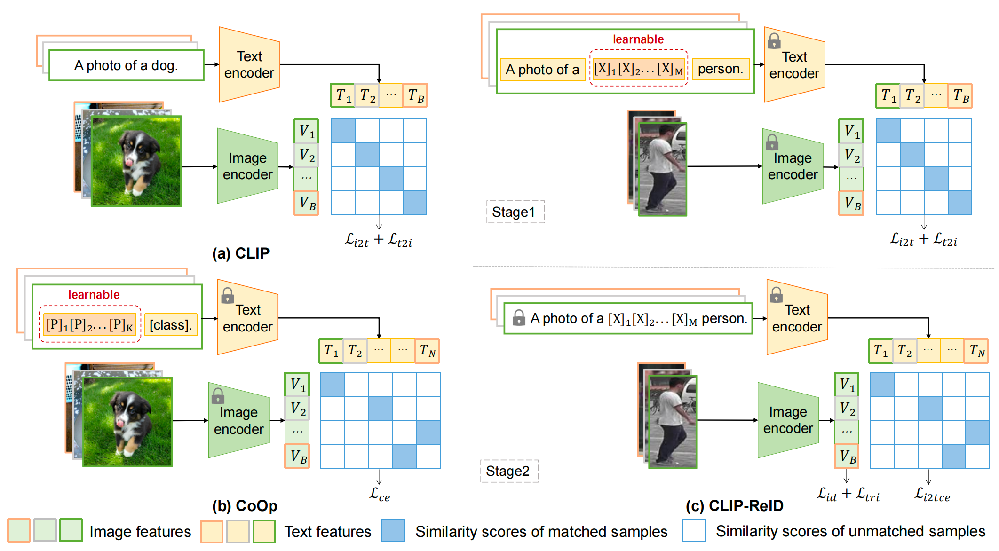
>
> **论文引用**：
>
> ```
> @inproceedings{li2023clip,
> title={Clip-reid: Exploiting vision-language model for image re-identification without concrete text labels},
> author={Li, Siyuan and Sun, Li and Li, Qingli},
> booktitle={Proceedings of the AAAI Conference on Artificial Intelligence},
> volume={37},
> number={1},
> pages={1405--1413},
> year={2023}
> }
> ```
>


#### VehicleGAN: Pair-flexible Pose Guided Image Synthesis for Vehicle Re-identification

> **CVPR, 2023 [(PDF)](/Users/huangkaiwen/Desktop/Paper/vehicle-reid/2023-VehicleGAN.pdf).  [link](https://scholar.google.com/scholar?hl=zh-CN&as_sdt=0%2C5&q=VehicleGAN%3A+Pair-flexible+Pose+Guided+Image+Synthesis+for+Vehicle+Re-identification&btnG=#d=gs_cit&t=1703302231985&u=%2Fscholar%3Fq%3Dinfo%3AiU2UsHRzAdYJ%3Ascholar.google.com%2F%26output%3Dcite%26scirp%3D0%26hl%3Dzh-CN) 【引用数：**0】
>
> 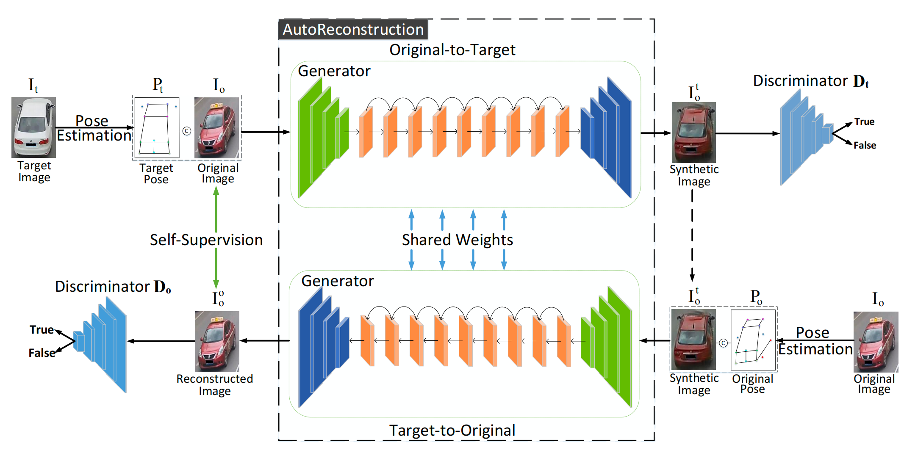
>
> **论文引用**：
>
> ```
> @article{li2023vehiclegan,
> title={VehicleGAN: Pair-flexible Pose Guided Image Synthesis for Vehicle Re-identification},
> author={Li, Baolu and Liu, Ping and Fu, Lan and Li, Jinlong and Fang, Jianwu and Xu, Zhigang and Yu, Hongkai},
> journal={arXiv preprint arXiv:2311.16278},
> year={2023}
> }
> ```
>


## 2022

#### Progressive learning with multi-scale attention network for cross-domain vehicle re-identification

> **Science China Information Sciences, 2022.** [(PDF)](/Users/huangkaiwen/Desktop/Paper/vehicle-reid/2022-Progressive learning with multi-scale attention network for cross-domain vehicle re-identification.pdf) [link](https://scholar.google.com/scholar?hl=zh-CN&as_sdt=0%2C5&q=Progressive+learning+with+multi-scale+attention+network+for+cross-domain+vehicle+re-identification&btnG=)  
>
> 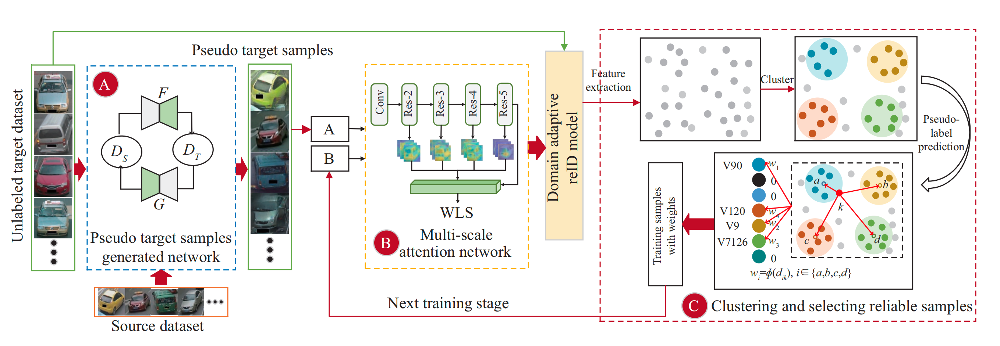
>
> **论文引用**：
>
> ```
> @article{wang2022progressive,
> title={Progressive learning with multi-scale attention network for cross-domain vehicle re-identification},
> author={Wang, Yang and Peng, Jinjia and Wang, Huibing and Wang, Meng},
> journal={Science China Information Sciences},
> volume={65},
> number={6},
> pages={160103},
> year={2022},
> publisher={Springer}
> }
> ```
>


- **V2ReID: Vision-Outlooker-Based Vehicle Re-Identification**

> **Sensors, 2022.** [(PDF)](/Users/huangkaiwen/Desktop/Paper/vehicle-reid/2022-V2ReID Vision-Outlooker-Based VehicleRe-Identification.pdf) [link](https://scholar.google.com/scholar?hl=zh-CN&as_sdt=0%2C38&q=+V2ReID%3A+Vision-Outlooker-Based+Vehicle+Re-Identiication&btnG=)  
>
> 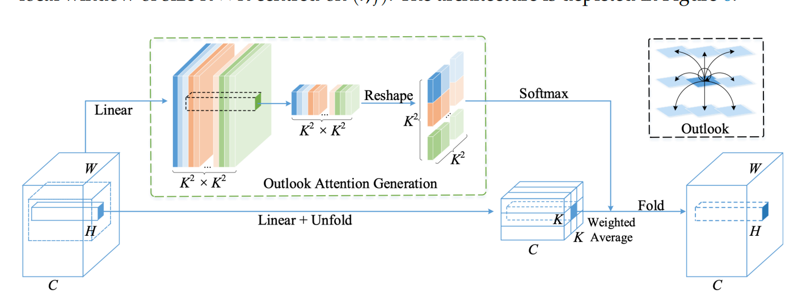
>
> **论文引用**：
>
> ```
> @article{qian2022v2reid,
>   title={V2reid: vision-outlooker-based vehicle re-identification},
>   author={Qian, Yan and Barthelemy, Johan and Iqbal, Umair and Perez, Pascal},
>   journal={Sensors},
>   volume={22},
>   number={22},
>   pages={8651},
>   year={2022},
>   publisher={MDPI}
> }
> ```


- **Vehicle Re-identification method based on Swin-Transformer network**

> **Array, 2022.** [(PDF)](/Users/huangkaiwen/Desktop/Paper/vehicle-reid/2022-swin-transformer.pdf) [link](https://scholar.google.com/scholar?hl=zh-CN&as_sdt=0,38&q=Vehicle+Re-identification+method+based+on+Swin-Transformer+network)  
>
> 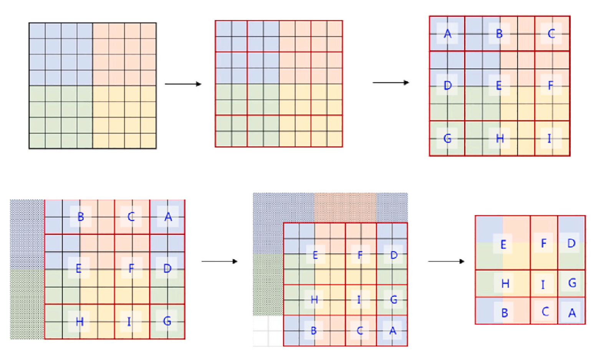
>
> **论文引用**：
>
> ```
> @article{li2022vehicle,
>   title={Vehicle re-identification method based on Swin-Transformer network},
>   author={Li, Jianrong and Yu, Chang and Shi, Jinyuan and Zhang, Chuanlei and Ke, Ting},
>   journal={Array},
>   volume={16},
>   pages={100255},
>   year={2022},
>   publisher={Elsevier}
> }
> ```


- **Unstructured Feature Decoupling for Vehicle Re-identification**

> **ECCV, 2022.** [(PDF)](/Users/huangkaiwen/Desktop/Paper/vehicle-reid/2022-unstructured-Transformer.pdf) [link](https://scholar.google.com/scholar?hl=zh-CN&as_sdt=0%2C38&q=+Unstructured+Feature+Decoupling+for+Vehicle+Re-identiication.&btnG=)  
>
> 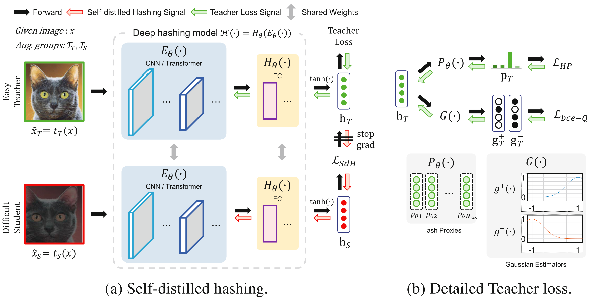
>
> **论文引用**：
>
> ```
> @inproceedings{qian2022unstructured,
>   title={Unstructured feature decoupling for vehicle re-identification},
>   author={Qian, Wen and Luo, Hao and Peng, Silong and Wang, Fan and Chen, Chen and Li, Hao},
>   booktitle={European Conference on Computer Vision},
>   pages={336--353},
>   year={2022},
>   organization={Springer}
> }
> ```


#### Multi-attribute adaptive aggregation transformer for vehicle re-identification

> **Information Processing \& Management, 2022.** [(PDF)](/Users/huangkaiwen/Desktop/Paper/vehicle-reid/2022-Multi-attribute adaptive aggregation transformer for vehicle re-identification .pdf) [link](https://scholar.google.com/scholar?hl=zh-CN&as_sdt=0%2C5&q=Multi-attribute+adaptive+aggregation+transformer+for+vehicle+re-identification&btnG=#d=gs_cit&t=1725687963552&u=%2Fscholar%3Fq%3Dinfo%3Ac9k3epAVpSgJ%3Ascholar.google.com%2F%26output%3Dcite%26scirp%3D0%26hl%3Dzh-CN)  
>
> 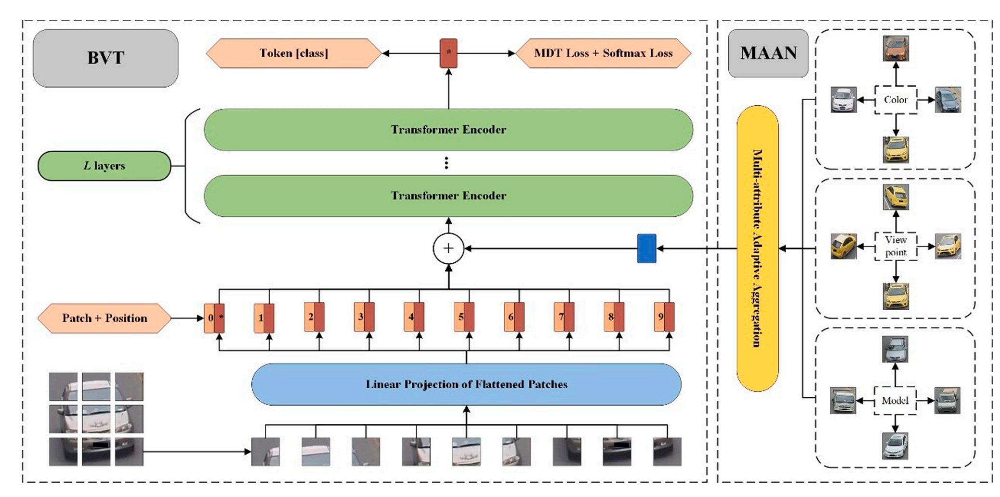
>
> **论文引用**：
>
> ```
> @article{yu2022multi,
> title={Multi-attribute adaptive aggregation transformer for vehicle re-identification},
> author={Yu, Zhi and Pei, Jiaming and Zhu, Mingpeng and Zhang, Jiwei and Li, Jinhai},
> journal={Information Processing \& Management},
> volume={59},
> number={2},
> pages={102868},
> year={2022},
> publisher={Elsevier}
> }
> ```
>


#### GAN-Siamese Network for Cross-Domain Vehicle Re-Identification in Intelligent Transport Systems

> **IEEE Transactions on Network Science and Engineering, 2022. [(PDF)](/Users/huangkaiwen/Desktop/Paper/vehicle-reid/2022-GAN-Siamese_Network_for_Cross-Domain_Vehicle_Re-Identification_in_Intelligent_Transport_Systems.pdf) [link](https://scholar.google.co.jp/scholar?hl=zh-CN&as_sdt=0%2C5&as_ylo=2022&as_yhi=2022&as_vis=1&q=GAN-Siamese+Network+for+Cross-Domain+Vehicle+Re-Identification+in+Intelligent+Transport+Systems&btnG=)  【引用数：**50】
>
> 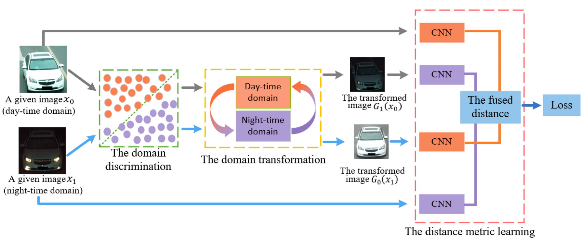
>
> **论文引用**：
>
> ```
> @article{zhou2022gan,
> title={Gan-siamese network for cross-domain vehicle re-identification in intelligent transport systems},
> author={Zhou, Zhili and Li, Yujiang and Li, Jin and Yu, Keping and Kou, Guang and Wang, Meimin and Gupta, Brij Bhooshan},
> journal={IEEE Transactions on Network Science and Engineering},
> year={2022},
> publisher={IEEE}
> }
> ```
>


#### Recall@k Surrogate Loss with Large Batches and Similarity Mixup

> **CVPR, 2022. [(PDF)](/Users/huangkaiwen/Desktop/Paper/vehicle-reid/2022-Recall@k Surrogate Loss with Large Batches and Similarity Mixup.pdf) [link](https://scholar.google.com/scholar?hl=zh-CN&as_sdt=0%2C5&q=Recall%40k+Surrogate+Loss+with+Large+Batches+and+Similarity+Mixup&btnG=)  【引用数：**35】
>
> **论文引用**：
>
> ```
> @inproceedings{patel2022recall,
>   title={Recall@ k surrogate loss with large batches and similarity mixup},
>   author={Patel, Yash and Tolias, Giorgos and Matas, Ji{\v{r}}{\'\i}},
>   booktitle={Proceedings of the IEEE/CVF Conference on Computer Vision and Pattern Recognition},
>   pages={7502--7511},
>   year={2022}
> }
> ```
>


#### Rethinking the Optimization of Average Precision: Only Penalizing Negative Instances before Positive Ones Is Enough

> **AAAI, 2022. [(PDF)](/Users/huangkaiwen/Desktop/Paper/vehicle-reid/2022-Rethinking the Optimization of Average Precision- Only Penalizing Negative Instances before Positive Ones is Enough.pdf) [link](https://scholar.google.com/scholar?hl=zh-CN&as_sdt=0%2C5&q=Rethinking+the+Optimization+of+Average+Precision%3A+Only+Penalizing+Negative+Instances+before+Positive+Ones+Is+Enough&btnG=) 【引用数：**8】
>
> **Problem:** Consider both negative and positive instances ranking before each positive
>
> **Contribution:**
>
> **论文引用**：Li Z, Min W, Song J, et al. Rethinking the optimization of average precision: only penalizing negative instances before positive ones is enough[C]//Proceedings of the AAAI Conference on Artificial Intelligence. 2022, 36(2): 1518-1526.
>
> $$
> S_\Omega = \{s_i =cos(V_q,V_i), i=0,...,m\} \tag{1}
> $$
> 
>$$
> R(i, S_N) = \sum_{j\in S_N, j\not= i}^{}{\Iota\{S_j-S_i > 0\}} \tag{2}
> $$
> 
>$$
> G(X; \tau) = \frac{1}{1+e^{-\frac{x}{\tau}}} \tag{3}
> $$
> 
>$$
> L_{AP} = 1-\frac{1}{|S_P|}\sum_{i\in S_P}^{}{\frac{1+R(i, S_P)}{(1+R(i,S_P) + R(i,S_N))}} \tag{4}
> $$
> 
>$$
> L_O = \frac{1}{|S_P|}\sum_{i\in S_P}{R(i, S_N)} \tag{5}
> $$


#### Attribute and state guided structural embedding network for vehicle re-identification

> IEEE transactions on image processing, 2022. [(PDF)](/Users/huangkaiwen/Desktop/Paper/vehicle-reid/2022-Attribute_and_State_Guided_Structural_Embedding_Network_for_Vehicle_Re-Identification.pdf) [link](https://scholar.google.com/scholar?hl=zh-CN&as_sdt=0%2C5&q=Attribute+and+State+Guided+Structural+Embedding+Network+for+Vehicle+Re-Identification&btnG=)
>
> 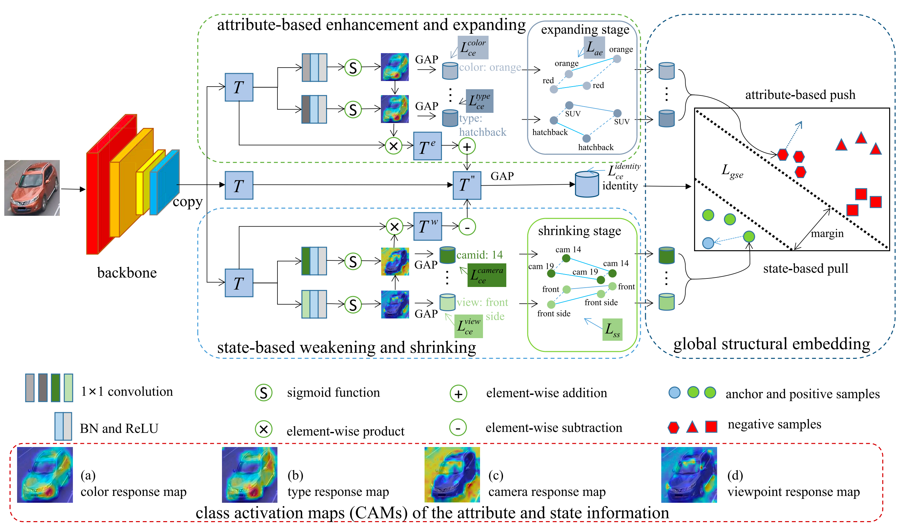
>
> **论文引用**：
>
> ```
> @article{li2022attribute,
> title={Attribute and state guided structural embedding network for vehicle re-identification},
> author={Li, Hongchao and Li, Chenglong and Zheng, Aihua and Tang, Jin and Luo, Bin},
> journal={IEEE transactions on image processing},
> volume={31},
> pages={5949--5962},
> year={2022},
> publisher={IEEE}
> }
> ```
>


## 2021

#### AttributeNet: Attribute Enhanced Vehicle Re-Identification

> **Neurocomputing, 2021. [(PDF)](/Users/huangkaiwen/Desktop/Paper/vehicle-reid/2021-Attribute_ReID.pdf) **[link](https://scholar.google.com/scholar?hl=zh-CN&as_sdt=0%2C5&q=AttributeNet%3A+Attribute+Enhanced+Vehicle+Re-Identification&btnG=)  【引用数：**18**】
>
> 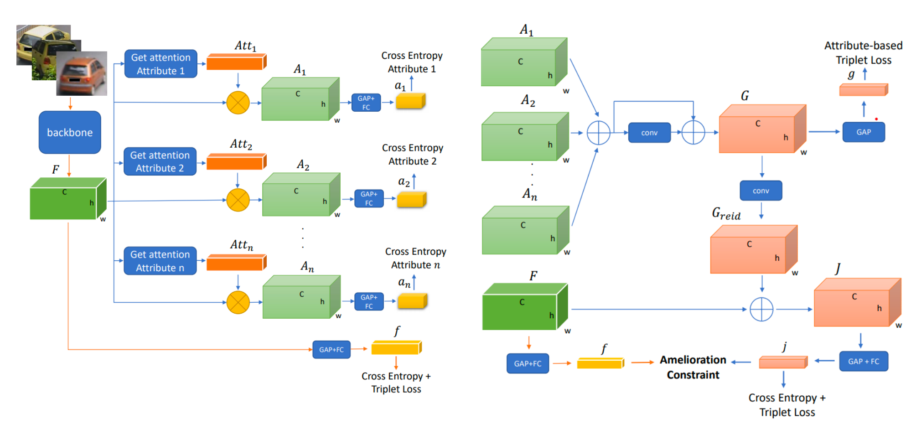
>
> **论文引用**：
>
> ```
> @article{quispe2021attributenet,
> title={Attributenet: Attribute enhanced vehicle re-identification},
> author={Quispe, Rodolfo and Lan, Cuiling and Zeng, Wenjun and Pedrini, Helio},
> journal={Neurocomputing},
> volume={465},
> pages={84--92},
> year={2021},
> publisher={Elsevier}
> }
> ```
>


#### Model Latent Views With Multi-Center Metric Learning for Vehicle Re-Identification

IEEE TRANSACTIONS ON INTELLIGENT TRANSPORTATION SYSTEMS  [(pdf)](/Users/huangkaiwen/Desktop/Paper/vehicle-reid/2021_Model_Latent_Views_With_Multi-Center_Metric_Learning_for_Vehicle_Re-Identification.pdf)  [link](https://scholar.google.com/scholar?hl=zh-CN&as_sdt=0%2C5&as_ylo=2021&as_yhi=2024&q=Model+Latent+Views+With+Multi-Center+Metric+Learning+for+Vehicle+Re-Identification&btnG=)

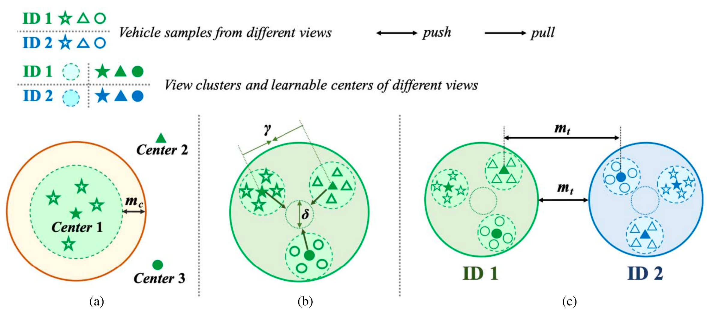

```
@article{jin2021model,
  title={Model latent views with multi-center metric learning for vehicle re-identification},
  author={Jin, Yi and Li, Chenning and Li, Yidong and Peng, Peixi and Giannopoulos, George A},
  journal={IEEE Transactions on Intelligent Transportation Systems},
  volume={22},
  number={3},
  pages={1919--1931},
  year={2021},
  publisher={IEEE}
}
```


#### Heterogeneous Relational Complement for Vehicle Re-identification

> **ICCV, 2021. [(PDF)](/Users/huangkaiwen/Desktop/Paper/vehicle-reid/2021-Zhao_Heterogeneous_Relational_Complement_for_Vehicle_Re-Identification_ICCV_2021_paper.pdf) **[link](https://scholar.google.com/scholar?hl=zh-CN&as_sdt=0%2C5&q=Heterogeneous+relational+complement+for+vehicle+&btnG=)  【引用数：**44**】
>
> 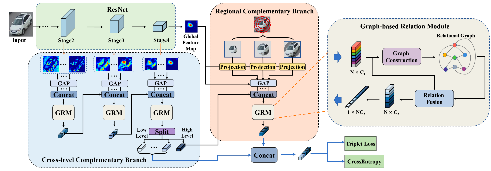
>
> **论文引用**：
>
> ```
> @inproceedings{zhao2021heterogeneous,
> title={Heterogeneous relational complement for vehicle re-identification},
> author={Zhao, Jiajian and Zhao, Yifan and Li, Jia and Yan, Ke and Tian, Yonghong},
> booktitle={Proceedings of the IEEE/CVF International Conference on Computer Vision},
> pages={205--214},
> year={2021}
> }
> ```
>


#### Attributes Guided Feature Learning for Vehicle Re-Identification

> **IEEE Transactions on Emerging Topics in Computational Intelligence, 2021. [(PDF)](/Users/huangkaiwen/Desktop/Paper/vehicle-reid/2021-AGNet.pdf) **[link](https://ieeexplore.ieee.org/abstract/document/9631874) 【引用数：**18**】
>
> 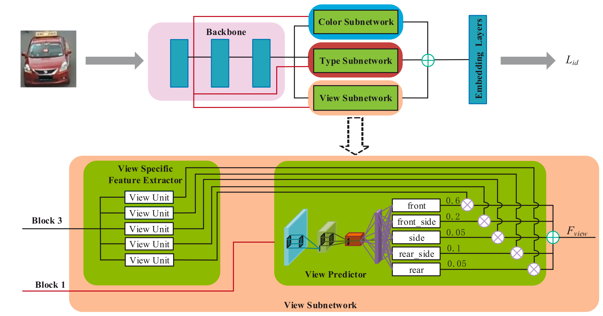
>
> **Problem: ** Large intra-class variation caused by view variations and illumination changes, and inter-class similarity for different identities with a similar appearance.
>
> **Contribution: ** 
>
> - A novel deep network architecture, which guided by meaningful attributes including camera views, vehicle types and colors for vehicle ReID
>
> **论文引用**：
>
> ```
> @article{li2021attributes,
>   title={Attributes guided feature learning for vehicle re-identification},
>   author={Li, Hongchao and Lin, Xianmin and Zheng, Aihua and Li, Chenglong and Luo, Bin and He, Ran and Hussain, Amir},
>   journal={IEEE Transactions on Emerging Topics in Computational Intelligence},
>   volume={6},
>   number={5},
>   pages={1211--1221},
>   year={2021},
>   publisher={IEEE}
> }
> ```
>


#### PhD Learning: Learning with Pompeiu-hausdorff Distances for Video-based Vehicle Re-Identification

> **CVPR, 2021. [(PDF)](/Users/huangkaiwen/Desktop/Paper/vehicle-reid/2021-Learning with Pompeiu-hausdorff Distances for Video-based.pdf) **[link](https://scholar.google.com/scholar?hl=zh-CN&as_sdt=0%2C5&q=PhD+Learning%3A+Learning+with+Pompeiu-hausdorff+Distances+for+Video-based+Vehicle+Re-Identification&btnG=)  【引用数：**23**】
>
> 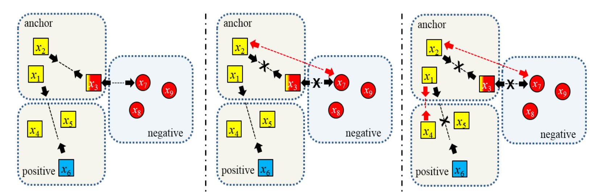
>
> **Problem: ** How to make full use of raw data, how to learn a robust re-ID model with noisy data.
>
> **Contribution: ** 
>
> - Create a video vehicle re-ID evaluation benchmark called VVeRI-901 and verify the performance of video-based re-ID is far better than static image-based one.
> - Propose a new Pompeiu-hausdorff distance (PhD) learning method for video-to-video matching.
>
> **论文引用**：
>
> ```
> @inproceedings{zhao2021phd,
>   title={Phd learning: Learning with pompeiu-hausdorff distances for video-based vehicle re-identification},
>   author={Zhao, Jianan and Qi, Fengliang and Ren, Guangyu and Xu, Lin},
>   booktitle={Proceedings of the IEEE/CVF Conference on Computer Vision and Pattern Recognition},
>   pages={2225--2235},
>   year={2021}
> }
> ```
>


#### TransReID: Transformer-based Object Re-Identification

> **CVPR, 2021. [(PDF)](/Users/huangkaiwen/Desktop/Paper/vehicle-reid/2021-TransReID.pdf) **[link](https://scholar.google.com/scholar?hl=zh-CN&as_sdt=0%2C5&q=TransReID%3A+Transformer-based+Object+Re-Identification&btnG=)【引用数 **549**】
>
> 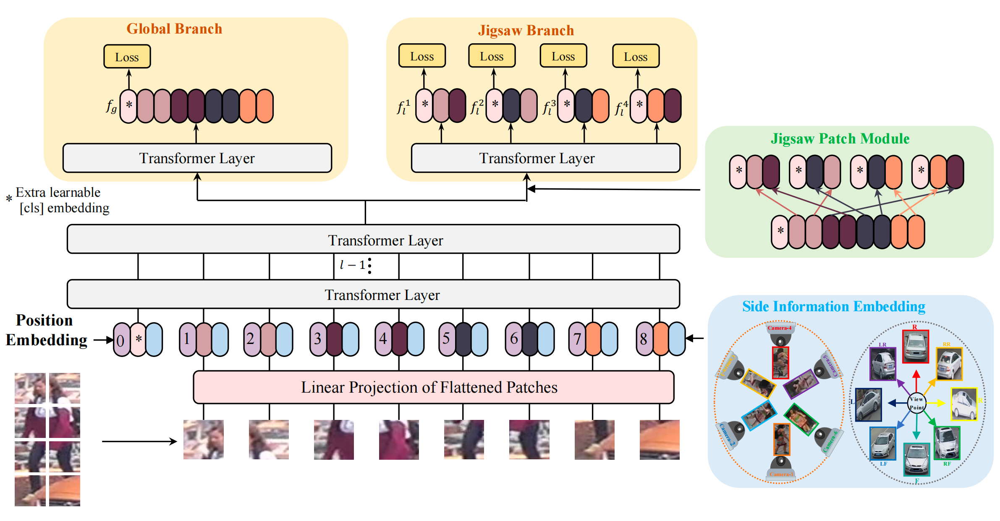
>
> **论文引用**：
>
> ```
> @inproceedings{he2021transreid,
> title={Transreid: Transformer-based object re-identification},
> author={He, Shuting and Luo, Hao and Wang, Pichao and Wang, Fan and Li, Hao and Jiang, Wei},
> booktitle={Proceedings of the IEEE/CVF international conference on computer vision},
> pages={15013--15022},
> year={2021}
> }
> ```
>


#### Embedding Adversarial Learning for Vehicle Re-Identification

> **IEEE Transactions on Image Processing, 2021. [(PDF)](/Users/huangkaiwen/Desktop/Paper/vehicle-reid/2021-Embedding_Adversarial_Learning_for_Vehicle_Re-Identification.pdf) **[link](https://scholar.google.com/scholar?hl=zh-CN&as_sdt=0%2C5&q=Embedding+Adversarial+Learning+for+Vehicle+re+identification&btnG=) 【引用数 **162**】
>
> 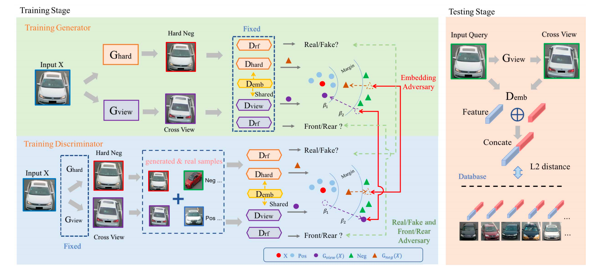
>
> **论文引用**：
>
> ```
> @article{lou2019embedding,
> title={Embedding adversarial learning for vehicle re-identification},
> author={Lou, Yihang and Bai, Yan and Liu, Jun and Wang, Shiqi and Duan, Ling-Yu},
> journal={IEEE Transactions on Image Processing},
> volume={28},
> number={8},
> pages={3794--3807},
> year={2019},
> publisher={IEEE}
> }
> ```
>


#### A Strong Baseline for Vehicle Re-Identification

> **CVPR, 2021. [(PDF)](/Users/huangkaiwen/Desktop/Paper/vehicle-reid/2021-Baseline.pdf) **[link](https://scholar.google.com/scholar?hl=zh-CN&as_sdt=0%2C5&q=A+Strong+Baseline+for+Vehicle+Re-Identification&btnG=#d=gs_cit&t=1702529752936&u=%2Fscholar%3Fq%3Dinfo%3AAht3mv2TxEMJ%3Ascholar.google.com%2F%26output%3Dcite%26scirp%3D0%26hl%3Dzh-CN)  【引用数 **41**】
>
> 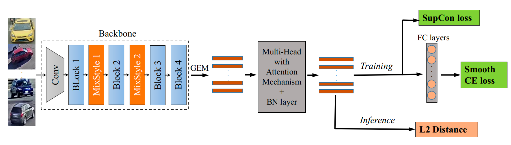
>
> **Problem: ** Algorithms must be robust in different views, resolution, occlusion and illumination conditions.
>
> **Contribution:**
>
> - Analyze the main factors hindering the Vehicle Re-ID performance.
>
> **论文引用**：
>
> ```
> @inproceedings{huynh2021strong,
>   title={A strong baseline for vehicle re-identification},
>   author={Huynh, Su V},
>   booktitle={Proceedings of the IEEE/CVF conference on computer vision and pattern recognition},
>   pages={4147--4154},
>   year={2021}
> }
> ```
>


#### Exploiting multi-view part-wise correlation via an efficient transformer for vehicle re-identification

> **IEEE Transactions on Multimedia, 2021** [(PDF)](/Users/huangkaiwen/Desktop/Paper/vehicle-reid/2021-Exploiting_Multi-View_Part-Wise_Correlation_via_an_Efficient_Transformer_for_Vehicle_Re-Identification.pdf).  [link](https://scholar.google.com/scholar?hl=zh-CN&as_sdt=0%2C5&q=Exploiting+Multi-View+Part-Wise+Correlation+via+an+Efficient+Transformer+for+Vehicle+Re-Identification&btnG=#d=gs_cit&t=1725272540903&u=%2Fscholar%3Fq%3Dinfo%3Akc6XKq8_ShMJ%3Ascholar.google.com%2F%26output%3Dcite%26scirp%3D0%26hl%3Dzh-CN) 
>
> 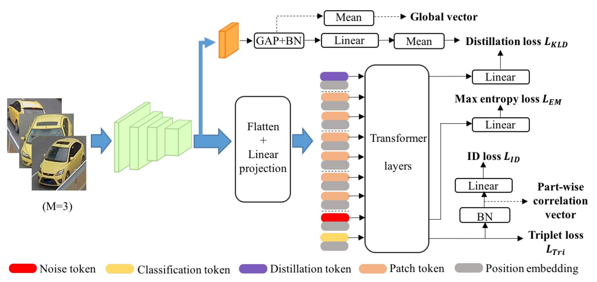
>
> **论文引用**：
>
> ```
> @article{li2021exploiting,
> title={Exploiting multi-view part-wise correlation via an efficient transformer for vehicle re-identification},
> author={Li, Ming and Liu, Jun and Zheng, Ce and Huang, Xinming and Zhang, Ziming},
> journal={IEEE Transactions on Multimedia},
> volume={25},
> pages={919--929},
> year={2021},
> publisher={IEEE}
> }
> ```
>


#### An efficient global representation constrained by Angular Triplet loss for vehicle re-identification

> **Pattern Analysis and Applications** [(PDF)](/Users/huangkaiwen/Desktop/Paper/vehicle-reid/2021-An efficient global representation constrained by Angular Triplet loss for vehicle re-identification.pdf).  [link](https://scholar.google.com/scholar?hl=zh-CN&as_sdt=0%2C5&q=Exploiting+Multi-View+Part-Wise+Correlation+via+an+Efficient+Transformer+for+Vehicle+Re-Identification&btnG=#d=gs_cit&t=1725272540903&u=%2Fscholar%3Fq%3Dinfo%3Akc6XKq8_ShMJ%3Ascholar.google.com%2F%26output%3Dcite%26scirp%3D0%26hl%3Dzh-CN) 
>
> 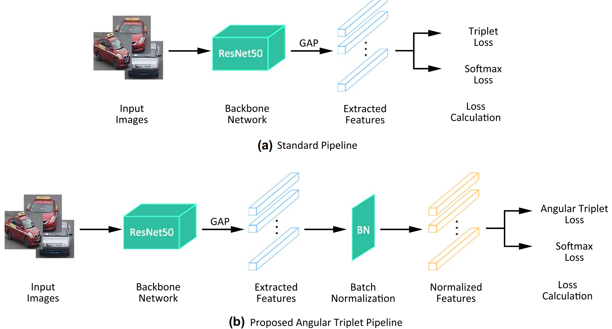
>
> **论文引用**：
>
> ```
> @article{gu2021efficient,
> title={An efficient global representation constrained by Angular Triplet loss for vehicle re-identification},
> author={Gu, Jianyang and Jiang, Wei and Luo, Hao and Yu, Hongyan},
> journal={Pattern Analysis and Applications},
> volume={24},
> pages={367--379},
> year={2021},
> publisher={Springer}
> }
> ```
>


## 2020

#### Beyond the Parts: Learning Multi-view Cross-part Correlationfor Vehicle Re-identification

> **ECCV, 2020. [(PDF)](/Users/huangkaiwen/Desktop/Paper/vehicle-reid/2020-The Devil Is in the Details- Self-supervised Attention for Vehicle Re-identification.pdf) **[link](https://scholar.google.com/scholar?hl=zh-CN&as_sdt=0%2C5&q=The+Devil+Is+in+the+Details%3A+Self-supervised+Attention+for+Vehicle+Re-identification&btnG=#d=gs_cit&t=1725271029214&u=%2Fscholar%3Fq%3Dinfo%3AEvRpPJVhiSMJ%3Ascholar.google.com%2F%26output%3Dcite%26scirp%3D0%26hl%3Dzh-CN) 
>
> **论文引用**：
>
> ```
> @inproceedings{khorramshahi2020devil,
> title={The devil is in the details: Self-supervised attention for vehicle re-identification},
> author={Khorramshahi, Pirazh and Peri, Neehar and Chen, Jun-cheng and Chellappa, Rama},
> booktitle={Computer Vision--ECCV 2020: 16th European Conference, Glasgow, UK, August 23--28, 2020, Proceedings, Part XIV 16},
> pages={369--386},
> year={2020},
> organization={Springer}
> }
> ```


#### The devil is in the details: Self-supervised attention for vehicle re-identification

> **ECCV, 2020. [(PDF)](/Users/huangkaiwen/Desktop/Paper/vehicle-reid/2020-The Devil Is in the Details- Self-supervised Attention for Vehicle Re-identification.pdf) **[link](https://scholar.google.com/scholar?hl=zh-CN&as_sdt=0%2C5&q=The+Devil+Is+in+the+Details%3A+Self-supervised+Attention+for+Vehicle+Re-identification&btnG=#d=gs_cit&t=1725271029214&u=%2Fscholar%3Fq%3Dinfo%3AEvRpPJVhiSMJ%3Ascholar.google.com%2F%26output%3Dcite%26scirp%3D0%26hl%3Dzh-CN) 
>
> **论文引用**：
>
> ```
> @inproceedings{khorramshahi2020devil,
>   title={The devil is in the details: Self-supervised attention for vehicle re-identification},
>   author={Khorramshahi, Pirazh and Peri, Neehar and Chen, Jun-cheng and Chellappa, Rama},
>   booktitle={Computer Vision--ECCV 2020: 16th European Conference, Glasgow, UK, August 23--28, 2020, Proceedings, Part XIV 16},
>   pages={369--386},
>   year={2020},
>   organization={Springer}
> }
> ```
>


#### Part-Guided Attention Learning for Vehicle Instance Retrieval

> **ITC, 2020. [(PDF)](/Users/huangkaiwen/Desktop/Paper/vehicle-reid/2020-Part-Guided Attention Learning.pdf) **[link](https://scholar.google.com/scholar?hl=zh-CN&as_sdt=0%2C5&q=Part-Guided+Attention+Learning+for+Vehicle+Instance+Retrieval&btnG=)  【引用数：**38**】
>
> 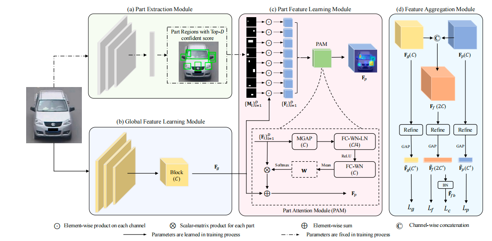
>
> **Problem：**Besides the holistic appearance of vehicles which is easily affected by the viewpoint variation and distortion, vehicle parts also provide crucial cues to differentiate near-identical vehicles.
>
> **Contribution:**  
>
> - Introduce a Part-Guided Attention Network to pinpoint the prominent part regions and effectively combine global and local information for discriminative feature learning.
>
> **论文引用**：
>
> ```
> @article{zhang2020part,
>   title={Part-guided attention learning for vehicle instance retrieval},
>   author={Zhang, Xinyu and Zhang, Rufeng and Cao, Jiewei and Gong, Dong and You, Mingyu and Shen, Chunhua},
>   journal={IEEE Transactions on Intelligent Transportation Systems},
>   volume={23},
>   number={4},
>   pages={3048--3060},
>   year={2020},
>   publisher={IEEE}
> }
> ```
>


#### Looking GLAMORous: Vehicle Re-Id in Heterogeneous Cameras Networks with Global and Local Attention

> **preprint, 2020. [(PDF)](/Users/huangkaiwen/Desktop/Paper/vehicle-reid/2020-Looking GLAMORous.pdf) **[link](https://scholar.google.com/scholar?hl=zh-CN&as_sdt=0%2C5&q=Looking+GLAMORous%3A+Vehicle+Re-Id+in+Heterogeneous+Cameras+Networks+with+Global+and+Local+Attention&btnG=)  【引用数：**29**】
>
> 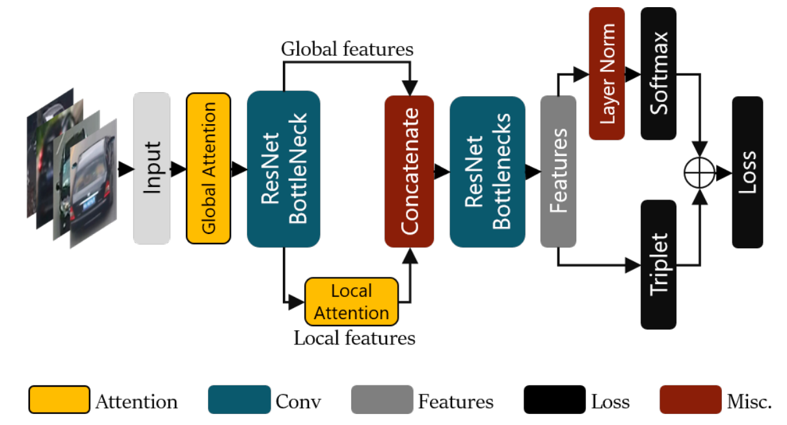
>
> **Problem：** Existing approaches for vehicle re-id utilize global features and local features for re-id by combining multiple subnetworks and losses.
>
> **Contribution:** 
>
> - Group and layer normalization to address conflicting loss targets for re-id
>
> - A novel global attention module for global feature extraction, and
>
>   a novel local attention module for self-guided part-based local feature extraction.
>
> **论文引用**：
>
> ```
> @article{suprem2020looking,
>   title={Looking glamorous: Vehicle re-id in heterogeneous cameras networks with global and local attention},
>   author={Suprem, Abhijit and Pu, Calton},
>   journal={arXiv preprint arXiv:2002.02256},
>   year={2020}
> }
> ```
>


#### Parsing-Based View-Aware Embedding Network for Vehicle Re-Identification

> **CVPR, 2020. [(PDF)](/Users/huangkaiwen/Desktop/Paper/vehicle-reid/2020-Parsing-based View-aware Embedding Network for Vehicle Re-Identification.pdf)  **[link](https://scholar.google.com/scholar?hl=zh-CN&as_sdt=0%2C5&q=Parsing-Based+View-Aware+Embedding+Network+for+Vehicle+Re-Identification&btnG=)  【引用数 **182**】
>
> 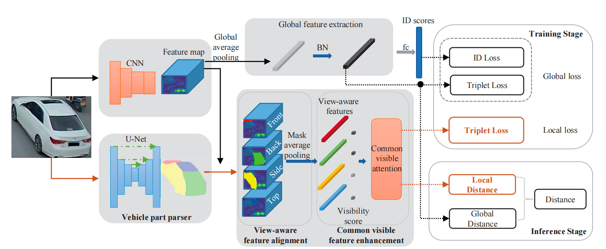
>
> **Problem:**  the large intra-instance distance caused by different views and the subtle inter-instance discrepancy caused by similar vehicles.
>
> **Contribution:** 
> 
>- Introduce a parsing network to parse a vehicle into four different views, and then align the features by mask average pooling,
> - Design a common-visible attention to focus on the common visible views, which not only shortens the distance among intra-instances, but also enlarges the discrepancy of inter-instance.
>
> **论文引用**：
> 
> ```
> @inproceedings{meng2020parsing,
>   title={Parsing-based view-aware embedding network for vehicle re-identification},
>   author={Meng, Dechao and Li, Liang and Liu, Xuejing and Li, Yadong and Yang, Shijie and Zha, Zheng-Jun and Gao, Xingyu and Wang, Shuhui and Huang, Qingming},
>   booktitle={Proceedings of the IEEE/CVF conference on computer vision and pattern recognition},
>   pages={7103--7112},
>   year={2020}
>}
> ```
>


#### VehicleNet: Learning Robust Visual Representa for Vehicle Re-identification

> **Multimedia, 2020. [(PDF)](/Users/huangkaiwen/Desktop/Paper/vehicle-reid/2020-VehicleNet.pdf) **[link](https://scholar.google.com/scholar?hl=zh-CN&as_sdt=0%2C5&q=VehicleNet%3A+Learning+Robust+Visual+Representa+for+Vehicle+Re-identification&btnG=) 【引用数 **117**】
>
> 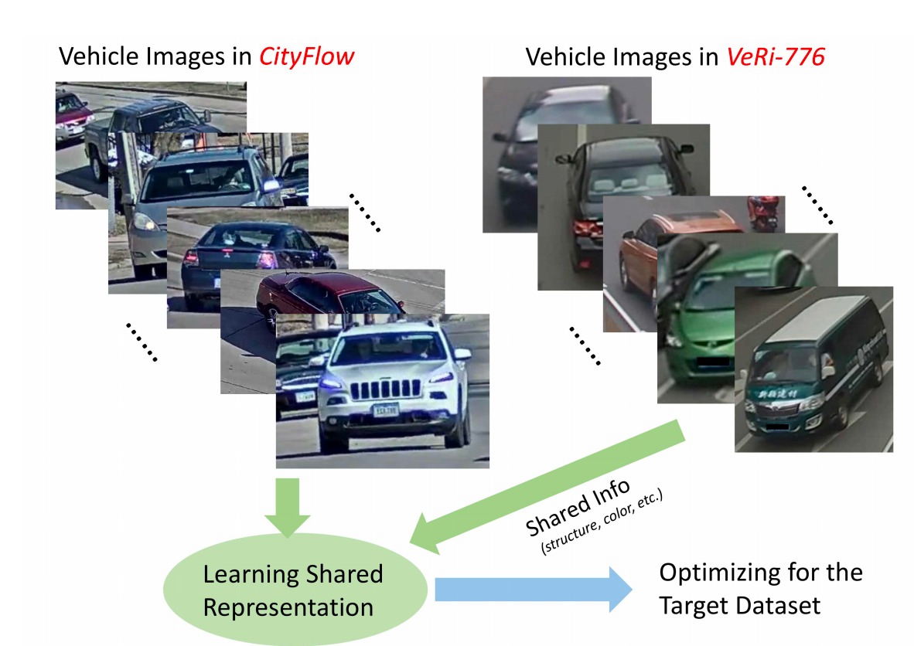
>
> **Problem:** Existing vehicle datasets are limited in terms of training images and viewpints.
>
> **Contribution:** 
>
> - Harnessing four public vehicle datasets, and design a simple yet effective two-stage progressive approach to learning more robust visual representation from VehicleNet.
>
> **论文引用**：
>
> ```
> @article{zheng2020vehiclenet,
>   title={VehicleNet: Learning robust visual representation for vehicle re-identification},
>   author={Zheng, Zhedong and Ruan, Tao and Wei, Yunchao and Yang, Yi and Mei, Tao},
>   journal={IEEE Transactions on Multimedia},
>   volume={23},
>   pages={2683--2693},
>   year={2020},
>   publisher={IEEE}
> }
> ```
>


#### VOC-ReID: Vehicle Re-identification based on Vehicle-Orientation-Camera

> **CVPR, 2020. [(PDF)](/Users/huangkaiwen/Desktop/Paper/vehicle-reid/2020-VOC-ReID_Vehicle_Re-Identification_Based_on_Vehicle-Orientation-Camera_CVPRW_2020_paper.pdf) **[link](https://scholar.google.com/scholar?hl=zh-CN&as_sdt=0%2C5&q=VOC-ReID%3A+Vehicle+Re-identification+based+on+Vehicle-Orientation-Camera&btnG=)  【引用数 **64**】
>
> 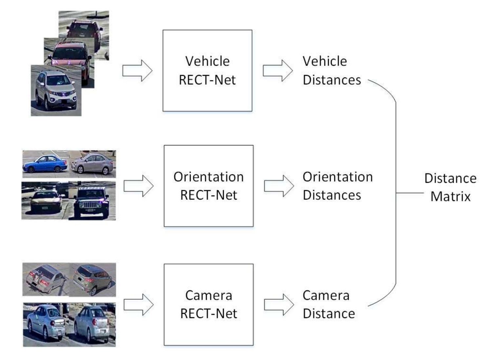
>
> **Problem: **Similarity contributed by fine-grained information would be dominated by backgroud and shape similarity.
>
> **Contribution:** 
> 
>- Propose the triplet vehicle-orientation-camera re-identification
> - $D(x_i, x_j) = D_V(x_i, x_j) - \lambda_1D_o(x_i, y_i)-\lambda_2D_c(x_i, x_j)$
>
> **论文引用**：
> 
> ```
> @inproceedings{zhu2020voc,
>   title={VOC-ReID: Vehicle re-identification based on vehicle-orientation-camera},
>   author={Zhu, Xiangyu and Luo, Zhenbo and Fu, Pei and Ji, Xiang},
>   booktitle={Proceedings of the IEEE/CVF Conference on Computer Vision and Pattern Recognition Workshops},
>   pages={602--603},
>   year={2020}
>}
> ```
>


#### Attribute-Guided Feature Learning Network for Vehicle Reidentification

> **Multimedia, 2020. [(PDF)](/Users/huangkaiwen/Desktop/Paper/vehicle-reid/2020-Attribute-Guided_Feature_Learning_Network_for_Vehicle_Reidentification.pdf) **[link](https://scholar.google.com/scholar?hl=zh-CN&as_sdt=0%2C5&q=Attribute-guided+feature+learning+network+for+vehicle+reidentification&btnG=) 【引用数 **84**】
>
> 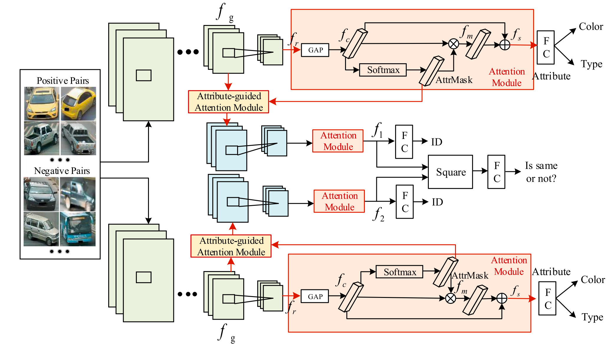
>
> **Problem:** Complicated environments and diversified illuminations.
>
> **Contribution:** 
>
> - An attribute-guided module is proposed in AGNet to generate the attribute mask(AttrMask), which inversely guides to select discriminative features for category classification.
> - An Attribute-based label smoothinf(ASL) loss is presented to better train
>
> **论文引用**：
>
> ```
> @article{wang2020attribute,
>   title={Attribute-guided feature learning network for vehicle reidentification},
>   author={Wang, Huibing and Peng, Jinjia and Chen, Dongyan and Jiang, Guangqi and Zhao, Tongtong and Fu, Xianping},
>   journal={IEEE MultiMedia},
>   volume={27},
>   number={4},
>   pages={112--121},
>   year={2020},
>   publisher={IEEE}
> }
> ```
>


## 2019

#### Structural Analysis of Attributes for Vehicle Re-Identification and Retrieval

> **IEEE Transactions on Intelligent Transportation Systems, 2019.** [(PDF)](/Users/huangkaiwen/Desktop/Paper/vehicle-reid/2019-Structural Analysis of Attributes for Vehicle Re-Identification and Retrieval.pdf).   [link](https://scholar.google.com/scholar?hl=zh-CN&as_sdt=0%2C5&q=Structural+analysis+of+attributes+for+vehicle+re-identification+and+retrieval%2C&btnG=) 【引用数：**63**】
>
> 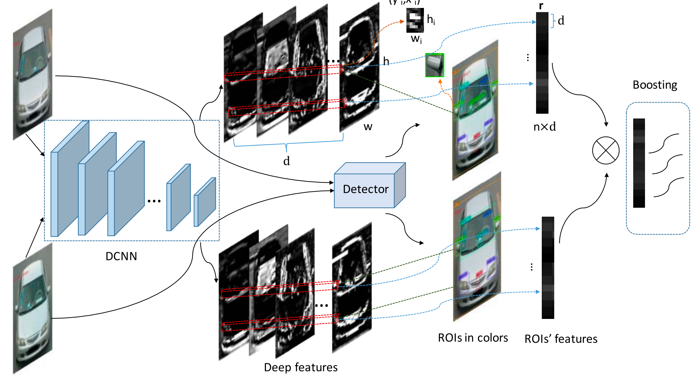
>
> **Problem: **  the key information for identification has not been well explored in the literature.
>
> **Contribution: ** 
>
> -  Collect a vehicle dataset ‘VAC21’ which contains 7129 images of five types of vehicles. Then, we carefully label the 21 classes of structural attributes hierarchically with bounding boxes.
>
> **论文引用**：
>
> ```
> @article{zhao2019structural,
>   title={Structural analysis of attributes for vehicle re-identification and retrieval},
>   author={Zhao, Yanzhu and Shen, Chunhua and Wang, Huibing and Chen, Shengyong},
>   journal={IEEE Transactions on Intelligent Transportation Systems},
>   volume={21},
>   number={2},
>   pages={723--734},
>   year={2019},
>   publisher={IEEE}
> }
> ```
>


#### Learning multi-region features for vehicle re-identification with context-based ranking method

> **Elsevier, 2019.** [(PDF)](/Users/huangkaiwen/Desktop/Paper/vehicle-reid/2019-Learning multi-region features for vehicle re-identification with context-based ranking method.pdf).   [link](https://scholar.google.com/scholar?hl=zh-CN&as_sdt=0%2C5&q=Learning+multi-region+features+for+vehicle+re-identification+with+context-based+ranking+method&btnG=) 【引用数：**42**】
>
> 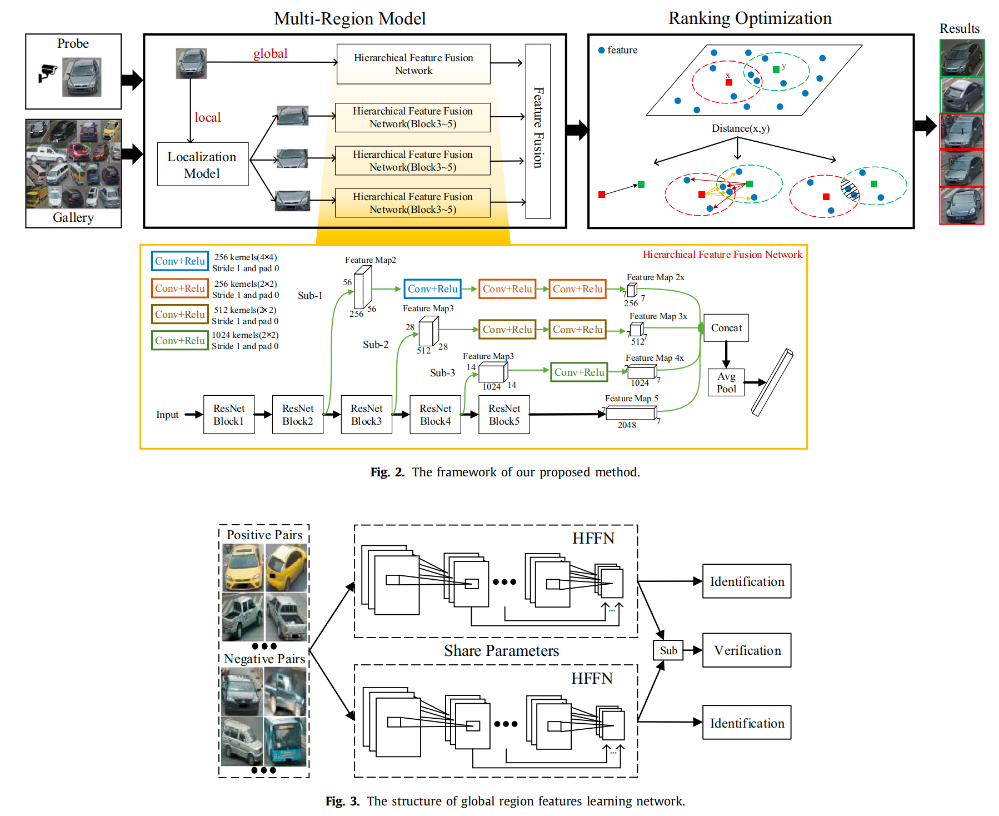
>
> **Problem: ** Most existing vehicle re-identification methods focus on learning global features, while neglecting the importance of local features
>
> **Contribution: ** 
>
> - Hierarchical feature fusion network
>
> **论文引用**：
> 
> ```
> @article{peng2019learning,
>   title={Learning multi-region features for vehicle re-identification with context-based ranking method},
>   author={Peng, Jinjia and Wang, Huibing and Zhao, Tongtong and Fu, Xianping},
>   journal={Neurocomputing},
>   volume={359},
>   pages={427--437},
>   year={2019},
>   publisher={Elsevier}
>}
> ```
>


#### Vehicle Re-identification with Viewpoint-aware Metric Learning

> **CVPR, 2019.** [(PDF)](/Users/huangkaiwen/Desktop/Paper/vehicle-reid/2019-Vehicle Re-identification with Viewpoint-aware Metric Learning.pdf).   [link](https://scholar.google.com/scholar?hl=zh-CN&as_sdt=0%2C5&q=**Vehicle+Re-identification+with+Viewpoint-aware+Metric+Learning**.&btnG=) 【引用数：**192**】
>
> 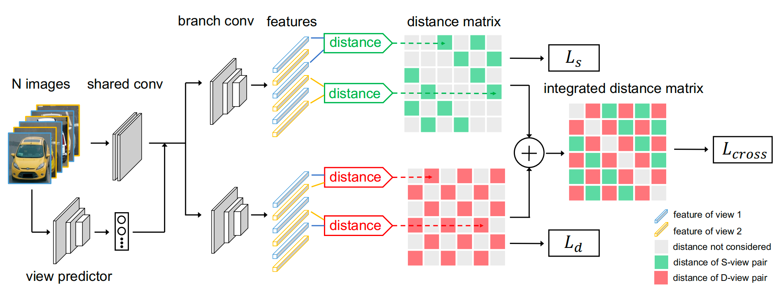
>
> **Problem: ** The extreme viewpoint variation poses great challenges for existing approaches.
>
> **Contribution: ** 
>
> - Learns two features spaces, respectively.
>
> **论文引用**：
>
> ```
> @inproceedings{chu2019vehicle,
>   title={Vehicle re-identification with viewpoint-aware metric learning},
>   author={Chu, Ruihang and Sun, Yifan and Li, Yadong and Liu, Zheng and Zhang, Chi and Wei, Yichen},
>   booktitle={Proceedings of the IEEE/CVF international conference on computer vision},
>   pages={8282--8291},
>   year={2019}
> }
> ```
>


#### Vehicle re-identification in still images: Application of semi-supervised learning and re-ranking

> **Signal Processing:, 2019.** [(PDF)](/Users/huangkaiwen/Desktop/Paper/2019-Vehicle re-identification in still images- Application of semi-supervised learning and re-ranking.pdf)  [link](https://scholar.google.com/scholar?hl=zh-CN&as_sdt=0%2C5&q=Vehicle+re-identification+in+still+images%3A+Application+of+semi-supervised+learning+and+re-ranking&btnG=)  【引用数：**20**】
>
> 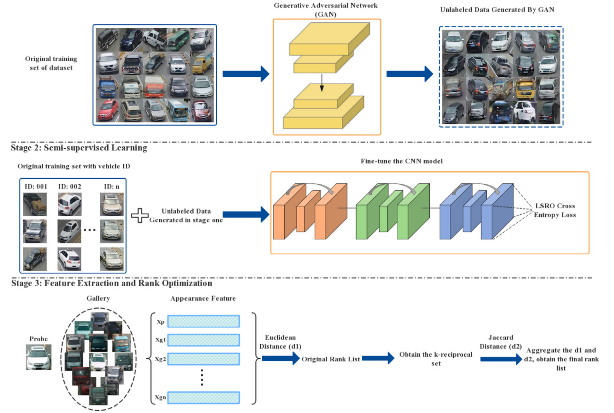
>
> **论文引用**：
>
> ```
> @article{wu2019vehicle,
> title={Vehicle re-identification in still images: Application of semi-supervised learning and re-ranking},
> author={Wu, Fangyu and Yan, Shiyang and Smith, Jeremy S and Zhang, Bailing},
> journal={Signal Processing: Image Communication},
> volume={76},
> pages={261--271},
> year={2019},
> publisher={Elsevier}
> }
> ```
>


#### Partition and Reunion: A Two-Branch Neural Network for Vehicle Re-identification

> **CVPR, 2019. [(PDF)](/Users/huangkaiwen/Desktop/Paper/vehicle-reid/2019-A Two-Branch Neural Network.pdf) **[link]([Partition and Reunion: A Two-Branch Neural Network... - Google 学术搜索](https://scholar.google.com.hk/scholar?hl=zh-CN&as_sdt=0%2C5&as_vis=1&q=Partition+and+Reunion%3A+A+Two-Branch+Neural+Network+for+Vehicle+Re-identification&btnG=)) 【引用数：**77**】
>
> 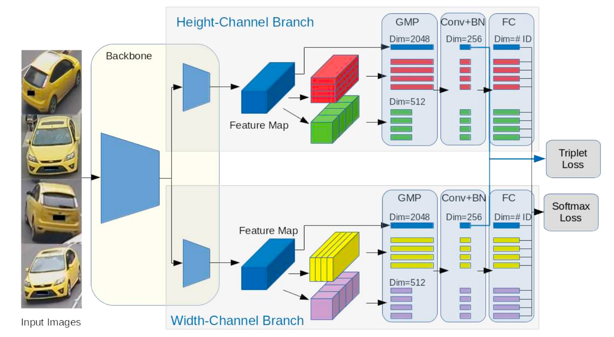
>
> **论文引用**：
>
> ```
> @inproceedings{chen2019partition,
> title={Partition and reunion: A two-branch neural network for vehicle re-identification.},
> author={Chen, Hao and Lagadec, Benoit and Bremond, Francois},
> booktitle={CVPR Workshops},
> pages={184--192},
> year={2019}
> }
> ```
>


#### Deep Feature Fusion with Multiple Granularity for Vehicle Re-identification

> **CVPR, 2019. [(PDF)](/Users/huangkaiwen/Desktop/Paper/vehicle-reid/2019-Deep Feature Fusion with Multiple Granularity.pdf) **[link](https://scholar.google.com/scholar?hl=zh-CN&as_sdt=0%2C5&q=**Deep+Feature+Fusion+with+Multiple+Granularity+for+Vehicle+Re-identification**+&btnG=) 【引用数：**22**】
>
> 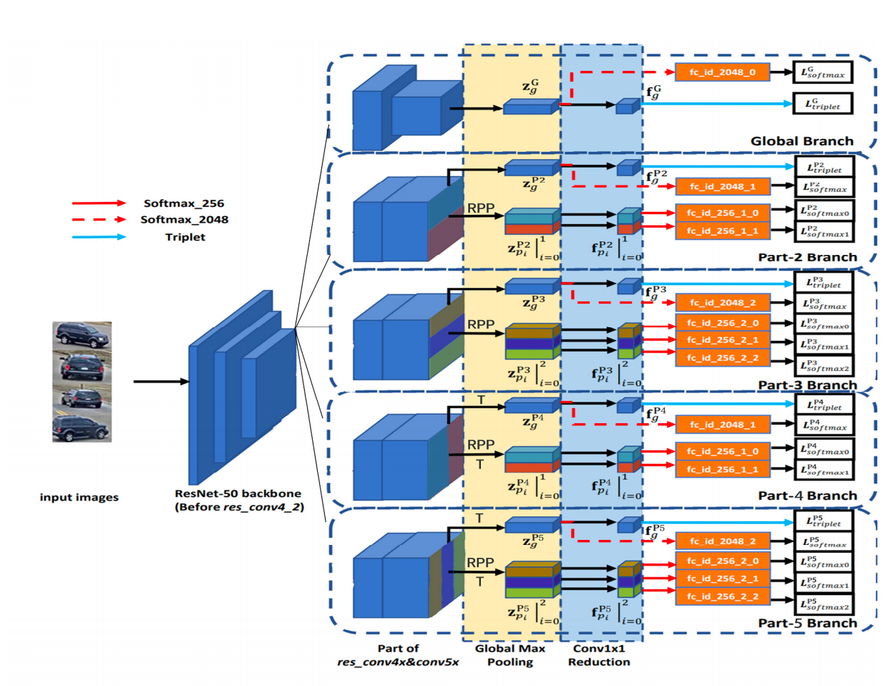
>
> **Problem:** View-point
>
> **Contribution: ** 
>
> - DFFMG is proposed for integrating discriminative information with various granularity.
>
> **论文引用**：
>
> ```
> @inproceedings{huang2019deep,
>   title={Deep Feature Fusion with Multiple Granularity for Vehicle Re-identification.},
>   author={Huang, Peixiang and Huang, Runhui and Huang, Jianjie and Yangchen, Rushi and He, Zongyao and Li, Xiying and Chen, Junzhou},
>   booktitle={CVPR Workshops},
>   pages={80--88},
>   year={2019}
> }
> ```
>


#### MULTI-VIEW LEARNING FOR VEHICLE RE-IDENTIFICATION

> **ICME, 2019. [(PDF)](/Users/huangkaiwen/Desktop/Paper/vehicle-reid/2019-Multi-View_Learning_for_Vehicle_Re-Identification.pdf) **[link](https://scholar.google.com/scholar?hl=zh-CN&as_sdt=0%2C5&q=**MULTI-VIEW+LEARNING+FOR+VEHICLE+RE-IDENTIFICATION**+&btnG=)  【引用数：**37**】
>
> 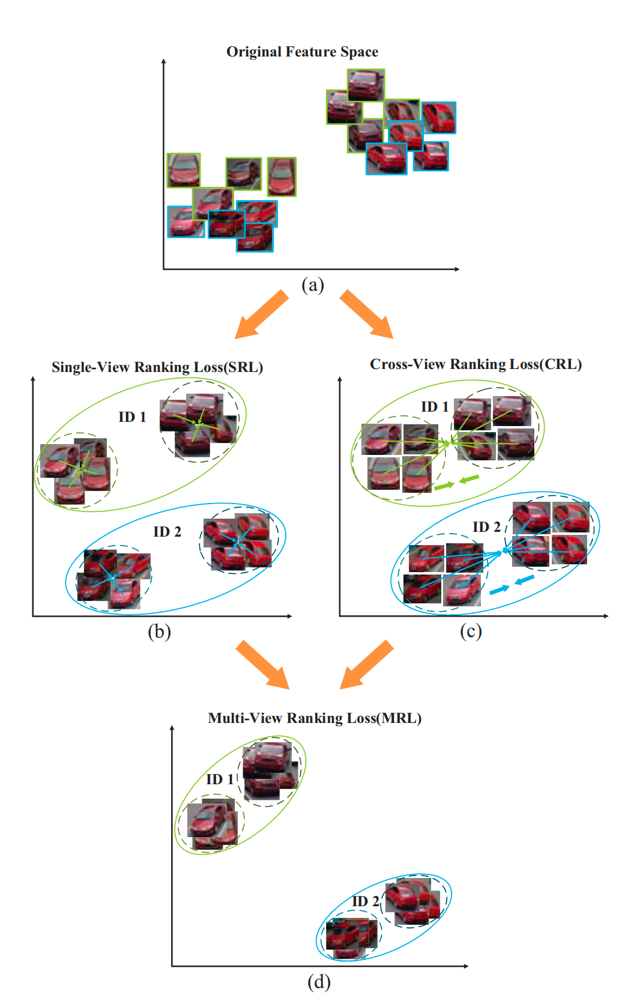
>
> ```
> @inproceedings{lin2019multi,
>   title={Multi-view learning for vehicle re-identification},
>   author={Lin, Weipeng and Li, Yidong and Yang, Xiaoliang and Peng, Peixi and Xing, Junliang},
>   booktitle={2019 IEEE international conference on multimedia and expo (ICME)},
>   pages={832--837},
>   year={2019},
>   organization={IEEE}
> }
> ```


#### Variational representation learning for vehicle re-identification

> **IEEE International Conference on Image Processing, 2019. [(PDF)](/Users/huangkaiwen/Desktop/Paper/vehicle-reid/2019-VARIATIONAL REPRESENTATION LEARNING FOR VEHICLE RE-IDENTIFICATION.pdf) **[link](https://scholar.google.com/scholar?hl=zh-CN&as_sdt=0%2C5&q=**VARIATIONAL+REPRESENTATION+LEARNING+FOR+VEHICLE+RE-IDENTIFICATION**+&btnG=)【引用数：**31**】
>
> 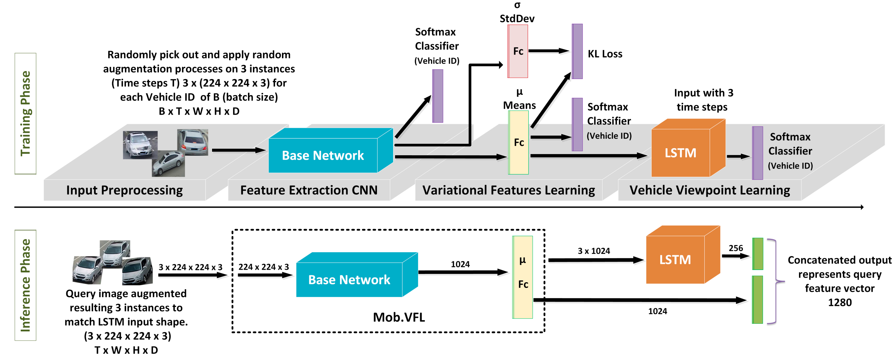
>
> **Problem:** Existing methods tend to derive features of dimension ranging from thousands to tens of thousands.
>
> **Contribution:** 
>
> - The dimension of the learned  features can be as low as 256, variational feature learning is employed to generate variational features which are more discriminating.
>
> - long short term memory (LSTM) is used to learn the relationship among different viewpoints of a vehicle. The LSTM also plays as an
>
>   encoder to downsize the features.
>
> - $D_{kl}(N((\mu,\sigma),N(0,1))= -\frac{1}{2}\sum_{i=1}^{n}{(1+log(\sigma_i)-\mu^2_i-\sigma_i)}$
>
> **论文引用**：
>
> ```
> @inproceedings{alfasly2019variational,
>   title={Variational representation learning for vehicle re-identification},
>   author={Alfasly, Saghir Ahmed Saghir and Hu, Yongjian and Liang, Tiancai and Jin, Xiaofeng and Zhao, Qingli and Liu, Beibei},
>   booktitle={2019 IEEE International Conference on Image Processing (ICIP)},
>   pages={3118--3122},
>   year={2019},
>   organization={IEEE}
> } 
> ```
>


#### Attention Driven Vehicle Re-identification and Unsupervised Anomaly Detection for Traffic Understanding

> **CVPR, 2019. [(PDF)](/Users/huangkaiwen/Desktop/Paper/vehicle-reid/2019-Khorramshahi_Attention_Driven_Vehicle_Re-identification_and_Unsupervised_Anomaly_Detection_for_Traffic_CVPRW_2019_paper.pdf) **[link](https://scholar.google.com/scholar?hl=zh-CN&as_sdt=0%2C5&q=**Attention+Driven+Vehicle+Re-identification+and+Unsupervised+Anomaly+Detection+for+Traffic+Understanding**+&btnG=)  【引用数：**43**】
>
> 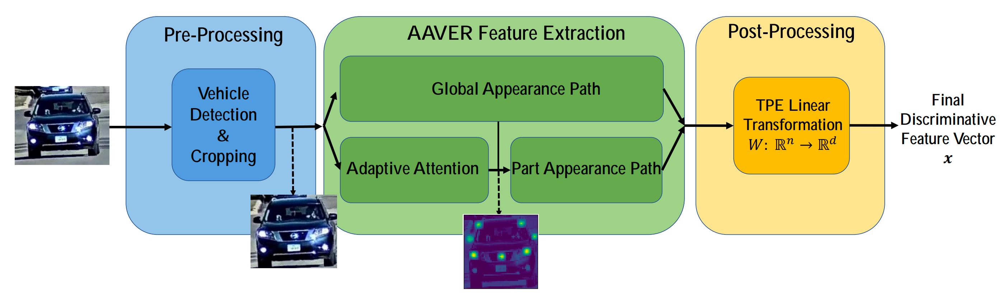
>
> **论文引用**：
>
> ```
> @inproceedings{khorramshahi2019attention,
> title={Attention Driven Vehicle Re-identification and Unsupervised Anomaly Detection for Traffic Understanding.},
> author={Khorramshahi, Pirazh and Peri, Neehar and Kumar, Amit and Shah, Anshul and Chellappa, Rama},
> booktitle={CVPR Workshops},
> pages={239--246},
> year={2019}
> } 
> ```
>


#### Vehicle Re-Identification Using Quadruple Directional Deep Learning Features

> **IEEE Transactions on Intelligent Transportation Systems**, 2019. [(PDF)](/Users/huangkaiwen/Desktop/Paper/vehicle-reid/2019-QD-DLP.pdf) **[link](https://scholar.google.com/scholar?hl=zh-CN&as_sdt=0%2C5&q=Vehicle+Re-Identification+Using+Quadruple+Directional+Deep+Learning+Features&btnG=#d=gs_cit&t=1703238457522&u=%2Fscholar%3Fq%3Dinfo%3A0rrutdKwR_4J%3Ascholar.google.com%2F%26output%3Dcite%26scirp%3D0%26hl%3Dzh-CN) 【引用数：**152】
>
> 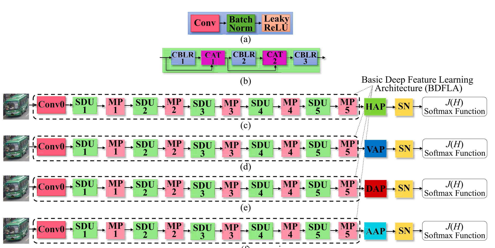
>
> **Problem:**  Resist the adverse effect of viewpoint variations
>
> **Contribution:**
>
> -  Use quadruple directional deep learning networks to extract quadruple directional deep learning features.
>
> **论文引用**：
>
> ```
> @article{zhu2019vehicle,
>   title={Vehicle re-identification using quadruple directional deep learning features},
>   author={Zhu, Jianqing and Zeng, Huanqiang and Huang, Jingchang and Liao, Shengcai and Lei, Zhen and Cai, Canhui and Zheng, Lixin},
>   journal={IEEE Transactions on Intelligent Transportation Systems},
>   volume={21},
>   number={1},
>   pages={410--420},
>   year={2019},
>   publisher={IEEE}
> }
> ```
>


#### A Dual-Path Model With Adaptive Attention For Vehicle Re-Identification

> **CVPR, 2019. [(PDF)](/Users/huangkaiwen/Desktop/Paper/vehicle-reid/2019-AAVER.pdf) **[link](https://scholar.google.com/scholar?hl=zh-CN&as_sdt=0%2C5&q=A+Dual-Path+Model+With+Adaptive+Attention+For+Vehicle+Re-Identification&btnG=#d=gs_cit&t=1702529103907&u=%2Fscholar%3Fq%3Dinfo%3AQiglIJ_1v80J%3Ascholar.google.com%2F%26output%3Dcite%26scirp%3D0%26hl%3Dzh-CN) 【引用数：**225**】
>
> 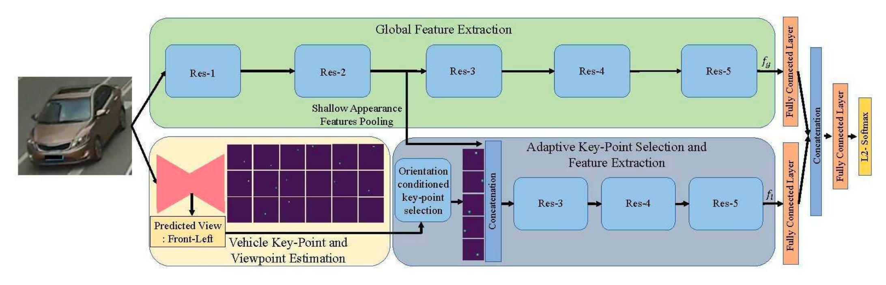
>
> **Problem: ** Most of methods are designed to focus attention on key-point locations, depending on the orientation, the contribution of each key-point varies.
>
> **Contribution: ** 
>
> - The global appearance path captures macroscopic vehicle features while the orientation conditioned part appearance path learns to catures localized discriminative features by focusing attention on the most infomative key-points.
>
> **论文引用**：
>
> ```
> @inproceedings{khorramshahi2019dual,
>   title={A dual-path model with adaptive attention for vehicle re-identification},
>   author={Khorramshahi, Pirazh and Kumar, Amit and Peri, Neehar and Rambhatla, Sai Saketh and Chen, Jun-Cheng and Chellappa, Rama},
>   booktitle={Proceedings of the IEEE/CVF international conference on computer vision},
>   pages={6132--6141},
>   year={2019}
> }
> ```
>


#### Part-regularized Near-duplicate Vehicle Re-identification 

> **CVPR, 2019. [(PDF)](/Users/huangkaiwen/Desktop/Paper/vehicle-reid/2019-He_Part-Regularized_Near-Duplicate_Vehicle_Re-Identification_CVPR_2019_paper.pdf) **[link](https://scholar.google.com/scholar?hl=zh-CN&as_sdt=0%2C5&q=Part-regularized+Near-duplicate+Vehicle+Re-identification&btnG=) 【引用数：**296**】
>
> 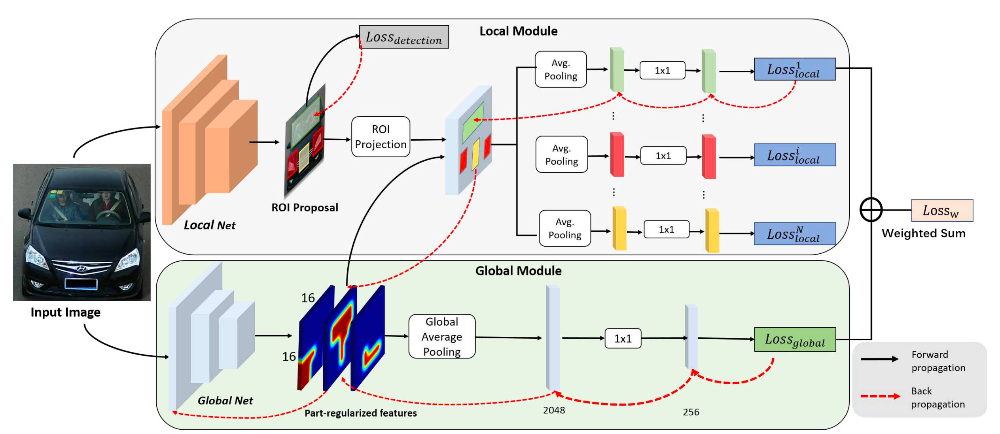
>
> **Problem:** Distinguish different instances with nearly identical appearances  
>
> **Contribution:** 
>
> -  Propose a simple but effcient part-regularized discriminative feature preserving method
> - Introduce an detection branch to integrate part constrains.
>
> **论文引用**：
>
> ```
> @inproceedings{he2019part,
>   title={Part-regularized near-duplicate vehicle re-identification},
>   author={He, Bing and Li, Jia and Zhao, Yifan and Tian, Yonghong},
>   booktitle={Proceedings of the IEEE/CVF Conference on Computer Vision and Pattern Recognition},
>   pages={3997--4005},
>   year={2019}
> }
> ```
>


#### Embedding Adversarial Learning for Vehicle Re-Identification 

> **IEEE Transactions on Image Processing**, 2019. [(PDF)](/Users/huangkaiwen/Desktop/Paper/vehicle-reid/2019-Embedding_Adversarial_Learning_for_Vehicle_Re-Identification.pdf) **[link](https://scholar.google.com/scholar?hl=zh-CN&as_sdt=0%2C5&q=Embedding+Adversarial+Learning+for+Vehicle+Re-Identification&btnG=) 【引用数：**165】
>
> 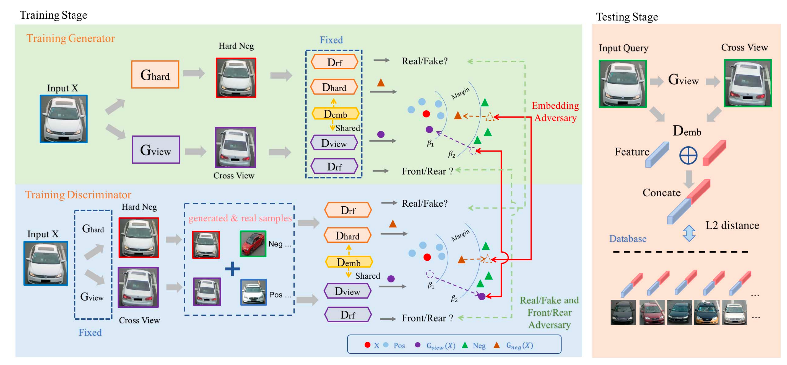
>
> **Problem:** The high similarties of different real-worl vehicles and great diversities of the acquisition views pose grand challenges 
>
> **Contribution:** 
>
> -  Propose a novel end-to-end embedding adversarial learning network(EALN) that is capable of generating samples localizaed in the embeding space.
>
> **论文引用**：
>
> ```
> @article{lou2019embedding,
>   title={Embedding adversarial learning for vehicle re-identification},
>   author={Lou, Yihang and Bai, Yan and Liu, Jun and Wang, Shiqi and Duan, Ling-Yu},
>   journal={IEEE Transactions on Image Processing},
>   volume={28},
>   number={8},
>   pages={3794--3807},
>   year={2019},
>   publisher={IEEE}
> }
> ```
>


#### Bag of Tricks and A Strong Baseline for Deep Person Re-identification

> **CVPR**, 2019. [(PDF)](/Users/huangkaiwen/Desktop/Paper/vehicle-reid/2019-Luo_Bag_of_Tricks_and_a_Strong_Baseline_for_Deep_Person_CVPRW_2019_paper.pdf) **[link](https://scholar.google.com.hk/scholar?hl=zh-CN&as_sdt=0%2C5&as_vis=1&q=Bag+of+Tricks+and+A+Strong+Baseline+for+Deep+Person+Re-identification&btnG=) 【引用数：**1156】
>
> 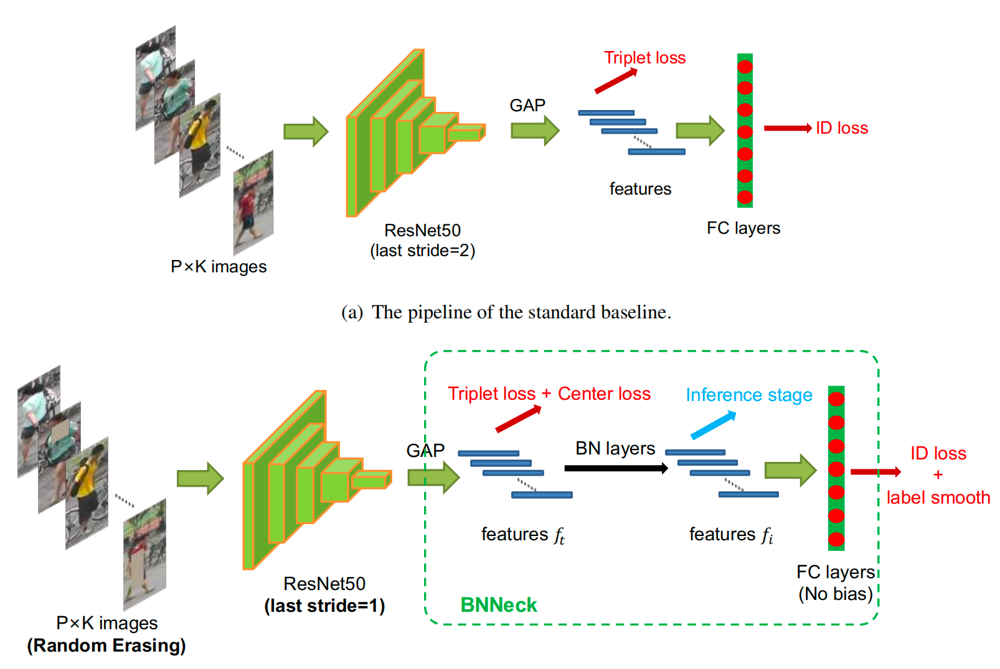
>
> **Contribution:** 
>
> -  Baseline
>
> **论文引用**：
>
> ```
> @inproceedings{luo2019bag,
>   title={Bag of tricks and a strong baseline for deep person re-identification},
>   author={Luo, Hao and Gu, Youzhi and Liao, Xingyu and Lai, Shenqi and Jiang, Wei},
>   booktitle={Proceedings of the IEEE/CVF conference on computer vision and pattern recognition workshops},
>   pages={0--0},
>   year={2019}
> }
> ```
>


## 2018

#### Vehicle re-identification by deep hidden multi-view inference

> **TIP, 2018. [(PDF)](/Users/huangkaiwen/Desktop/Paper/vehicle-reid/2018-Vehicle_Re-Identification_by_Deep_Hidden_Multi-View_Inference.pdf ) ** [link]https://scholar.google.com/scholar?hl=zh-CN&as_sdt=0%2C5&q=Vehicle+Re-Identification+by+Deep+Hidden+Multi-View+Inference&btnG=)【引用数 **130**】
>
> 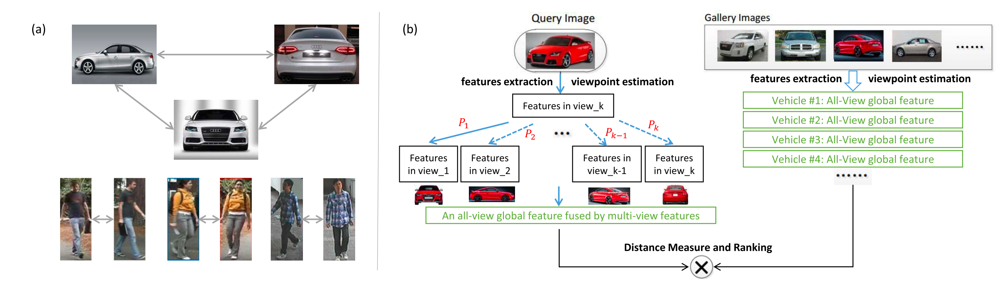
>
> **论文引用**：
>
> ```
> @article{zhou2018vehicle,
> title={Vehicle re-identification by deep hidden multi-view inference},
> author={Zhou, Yi and Liu, Li and Shao, Ling},
> journal={IEEE Transactions on Image Processing},
> volume={27},
> number={7},
> pages={3275--3287},
> year={2018},
> publisher={IEEE}
> }
> ```
>


#### Viewpoint-aware Attentive Multi-view Inference for Vehicle Re-identific ation

> **CVPR, 2018. [(PDF)](/Users/huangkaiwen/Desktop/Paper/vehicle-reid/2018-Zhou_Viewpoint-Aware_Attentive_Multi-View_CVPR_2018_paper.pdf ) ** [link](https://scholar.google.com/scholar?hl=zh-CN&as_sdt=0%2C5&q=Viewpoint-aware+Attentive+Multi-view+Inference+for+Vehicle+Re-identification&btnG=)【引用数 **339**】
>
> 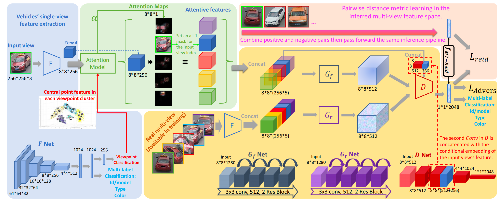
>
> **Problem:** Different vehicle identities with a similar appearance have little inter-instance discrepancy while one vehicle usually has large intra-instance differences under viewpoint and illutmination variations.
>
> **Contribution:** 
>
> - Only requires visual information to solve the multi-view vehicle re-ID problem.
>
> **论文引用**：
>
> ```
> @inproceedings{zhou2018aware,
>   title={Aware attentive multi-view inference for vehicle re-identification},
>   author={Zhou, Yi and Shao, Ling},
>   booktitle={Proceedings of the IEEE conference on computer vision and pattern recognition},
>   pages={6489--6498},
>   year={2018}
> } 
> ```
>


#### RAM: A REGION-AWARE DEEP MODEL FOR VEHICLE RE-IDENTIFICATION

> **IEEE International Conference on Multimedia and Expo, 2018. [(PDF)](/Users/huangkaiwen/Desktop/Paper/vehicle-reid/2018-RAM_A_Region-Aware_Deep_Model_for_Vehicle_Re-Identification.pdf) ** [link](https://scholar.google.com/scholar?hl=zh-CN&as_sdt=0%2C5&q=RAM%3A+A+REGION-AWARE+DEEP+MODEL+FOR+VEHICLE+RE-IDENTIFICATION&btnG=)   【引用数 **250**】
>
> 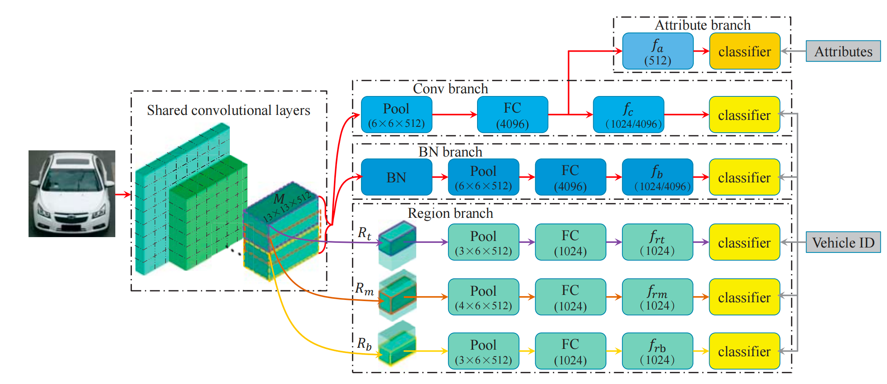
>
> **Problem:** Previous works on vehicle Re-ID mainly focus on extracting global features and learning distance metrics.
>
> **Contribution:**
>
> - Propose a Region-Aware deep model (RAM) to embed the detailed visual cues.
> - Introduce a novel learning algorithm to jointly use vehicle IDs, types/models, and colors to train the RAM.
>
> **论文引用**：
>
> ```
> @inproceedings{liu2018ram,
>   title={Ram: a region-aware deep model for vehicle re-identification},
>   author={Liu, Xiaobin and Zhang, Shiliang and Huang, Qingming and Gao, Wen},
>   booktitle={2018 IEEE International Conference on Multimedia and Expo (ICME)},
>   pages={1--6},
>   year={2018},
>   organization={IEEE}
> }
> ```
>


#### Vehicle re-identification with the space-time prior

> **IEEE conference on computer vision and pattern recognition, 2018. [(PDF)](/Users/huangkaiwen/Desktop/Paper/vehicle-reid/2018-Wu_Vehicle_Re-Identification_With_CVPR_2018_paper.pdf) ** [link](https://scholar.google.com/scholar?hl=zh-CN&as_sdt=0%2C5&q=Vehicle+re-identification+with+the+space-time+prior%2C&btnG=#d=gs_cit&t=1704346130200&u=%2Fscholar%3Fq%3Dinfo%3Aw4NG_scyUd4J%3Ascholar.google.com%2F%26output%3Dcite%26scirp%3D0%26hl%3Dzh-CN)   【引用数 **46**】
>
> 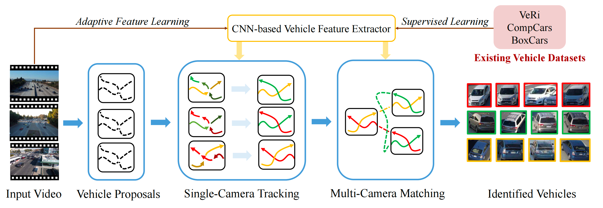
>
> **Problem:**  the difficulties in data labeling, visual domain mismatch between datasets and diverse appearance of the same vehicle.
>
> **Contribution:**
>
> -  The adaptive feature learning technique based on the space-time prior to address these issues.
>
> **论文引用**：
>
> ```
> @inproceedings{wu2018vehicle,
>   title={Vehicle re-identification with the space-time prior},
>   author={Wu, Chih-Wei and Liu, Chih-Ting and Chiang, Cheng-En and Tu, Wei-Chih and Chien, Shao-Yi},
>   booktitle={Proceedings of the IEEE conference on computer vision and pattern recognition workshops},
>   pages={121--128},
>   year={2018}
> }
> ```
>


## 2017

#### Orientation Invariant Feature Embedding and Spatial Temporal Regularization for Vehicle Re-identification

> **ICCV, 2017. [(PDF)](/Users/huangkaiwen/Desktop/Paper/vehicle-reid/2017-Orientation_Invariant_Feature_ICCV_2017_paper.pdf) ** [link](https://scholar.google.com/scholar?hl=zh-CN&as_sdt=0%2C5&q=**Orientation+Invariant+Feature+Embedding+and+Spatial+Temporal+Regularization+for+Vehicle+Re-identification**&btnG=) 【引用数 **397**】
>
> 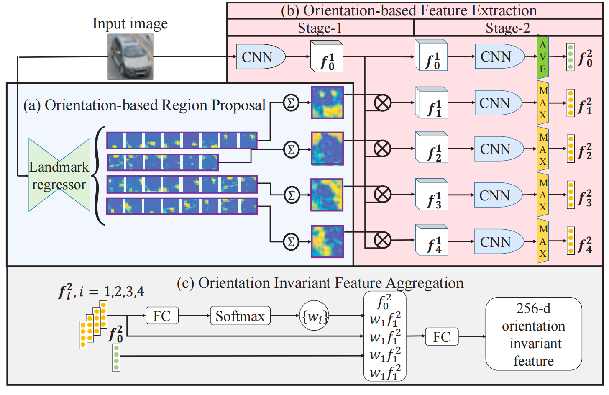
>
> **Contribution:** 
>
> - Propose an orientation invariant feature embedding module, with orientation invariant feature embedding ,  local region features of different orientations can be extracted based on 20 key point locations and can be well aligned and combined.
> - Propose a spatial-temporal regularization module, the log-normal distribution is adopted to model the spatial-temporal contrains.
>
> **论文引用**：
>
> ```
> @inproceedings{wang2017orientation,
>   title={Orientation invariant feature embedding and spatial temporal regularization for vehicle re-identification},
>   author={Wang, Zhongdao and Tang, Luming and Liu, Xihui and Yao, Zhuliang and Yi, Shuai and Shao, Jing and Yan, Junjie and Wang, Shengjin and Li, Hongsheng and Wang, Xiaogang},
>   booktitle={Proceedings of the IEEE international conference on computer vision},
>   pages={379--387},
>   year={2017}
> }
> ```
>


#### PROVID: Progressive and Multimodal Vehicle Reidentification for Large-Scale Urban Surveillance

> **IEEE Transactions on Multimedia, 2017. [(PDF)](/Users/huangkaiwen/Desktop/Paper/vehicle-reid/2017-PROVID.pdf) ** [link](https://scholar.google.com.hk/scholar?hl=zh-CN&as_sdt=0%2C5&as_vis=1&q=PROVID%3A+Progressive+and+Multimodal+Vehicle+Reidentification+for+Large-Scale+Urban+Surveillance&btnG=) 【引用数 **395**】
>
> 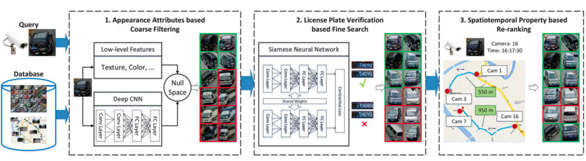
>
> **Problem:**  Most existing approaches mainly consider the general vehicle appearance for reidentification while overlooking the distinct vehicle identifier, such as the license plate number.
>
> **Contribution:**
>
> - Not only utilizes the multimodality data in large-scale video surveillance, such as visual features, license plates, camera locations, and contextual information, but also considers vehicle reidentification in two progressive procedures: coarse-to-fine search in the feature domain, and near-to-distant search in the physical space.
>
> **论文引用**：
>
> ```
> @article{liu2017provid,
>   title={Provid: Progressive and multimodal vehicle reidentification for large-scale urban surveillance},
>   author={Liu, Xinchen and Liu, Wu and Mei, Tao and Ma, Huadong},
>   journal={IEEE Transactions on Multimedia},
>   volume={20},
>   number={3},
>   pages={645--658},
>   year={2017},
>   publisher={IEEE}
> }
> ```
>


#### Improving triplet-wise training of convolutional neural network for vehicle re-identification

> **ICME, 2017. [(PDF)](/Users/huangkaiwen/Desktop/Paper/vehicle-reid/2017-triplet-wise.pdf) ** [link ](https://scholar.google.com.hk/scholar?hl=zh-CN&as_sdt=0%2C5&as_vis=1&q=Improving+triplet-wise+training+of+convolutional+neural+network+for+vehicle+re-identification&btnG=)【引用数 **114**】
>
> 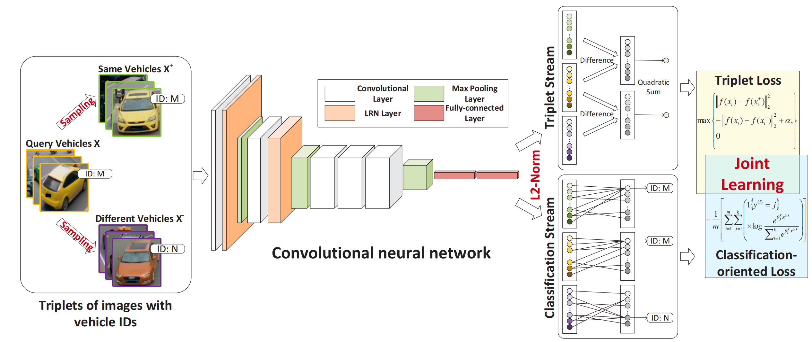
>
> **Contribution:** 
>
> - A stronger constraint namely classificaition-oriented loss is augmented with the original triplet loss
> - A new triplet sampling method based on pairwise images is designed
>
> **论文引用**：
>
> ```
> @inproceedings{zhang2017improving,
>   title={Improving triplet-wise training of convolutional neural network for vehicle re-identification},
>   author={Zhang, Yiheng and Liu, Dong and Zha, Zheng-Jun},
>   booktitle={2017 IEEE International Conference on Multimedia and Expo (ICME)},
>   pages={1386--1391},
>   year={2017},
>   organization={IEEE}
> }
> ```
>


#### MULTI-MODAL METRIC LEARNING FOR VEHICLE RE-IDENTIFICATION IN TRAFFIC SURVEILLANCE ENVIRONMENT

> **ICIP, 2017. [(PDF)](/Users/huangkaiwen/Desktop/Paper/vehicle-reid/2017-Multi-modal_metric_learning_for_vehicle_re-identification_in_traffic_surveillance_environment.pdf) ** [link](https://scholar.google.com/scholar?hl=zh-CN&as_sdt=0%2C5&q=Multi-modal+metric+learning+for+vehicle+re%02identification+in+traffic+surveillance+environment&btnG=)  【引用数 **36**】
>
> 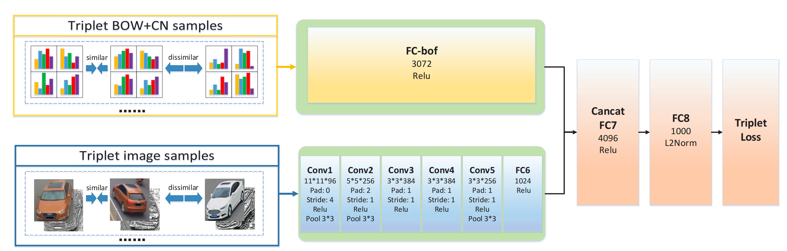
>
> **论文引用**：
>
> ```
> @inproceedings{tang2017multi,
> title={Multi-modal metric learning for vehicle re-identification in traffic surveillance environment},
> author={Tang, Yi and Wu, Di and Jin, Zhi and Zou, Wenbin and Li, Xia},
> booktitle={2017 IEEE International Conference on Image Processing (ICIP)},
> pages={2254--2258},
> year={2017},
> organization={IEEE}
> }
> ```
>


#### Learning Deep Neural Networks for Vehicle Re-ID with Visual-spatio-temporal Path Proposals

> **ICCV, 2017. [(PDF)](/Users/huangkaiwen/Desktop/Paper/vehicle-reid/2017-Shen_Learning_Deep_Neural_ICCV_2017_paper.pdf) ** [link ](https://scholar.google.com/scholar?hl=zh-CN&as_sdt=0%2C5&q=+Learning+deep+neural+networks+for+vehicle+re%02id+with+visual-spatio-temporal+path+proposals&btnG=)【引用数 **343**】
>
> 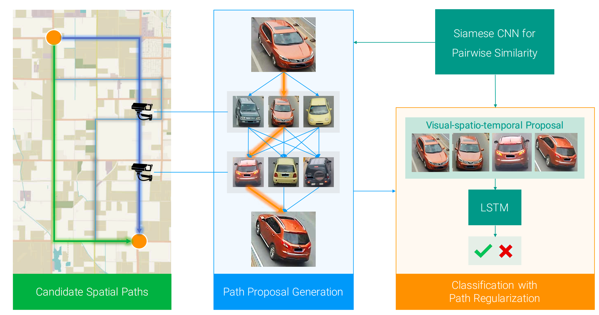
>
> **Problem: ** The visual differences between pairs of vehicle images are usually subtle, Existing vehicle re-identification methods for the spatio-temporal relations between vehicle images.
>
> **Contribution:**  
>
> - A stronger constraint namely classificaition-oriented loss is augmented with the original triplet loss
> - A new triplet sampling method based on pairwise images is designed
>
> **论文引用**：
>
> ```
> @inproceedings{shen2017learning,
>   title={Learning deep neural networks for vehicle re-id with visual-spatio-temporal path proposals},
>   author={Shen, Yantao and Xiao, Tong and Li, Hongsheng and Yi, Shuai and Wang, Xiaogang},
>   booktitle={Proceedings of the IEEE international conference on computer vision},
>   pages={1900--1909},
>   year={2017}
> }
> ```
>

# DataSet

- **Deep Relative Distance Learning: Tell the Difference Between Similar Vehicles (VehicleID)** 

> **CVPR, 2016. [(PDF)](/Users/huangkaiwen/Desktop/Paper/vehicle-reid/2016-Deep Relative Distance Learning.pdf) **[link](https://scholar.google.com/scholar?hl=zh-CN&as_sdt=0%2C5&q=**Deep+Relative+Distance+Learning%3A+Tell+the+Difference+Between+Similar+Vehicles+%28VehicleID%29**&btnG=) 【引用数：**754**】
>
> **论文引用**：
>
> ```
> @inproceedings{liu2016deep,
>   title={Deep relative distance learning: Tell the difference between similar vehicles},
>   author={Liu, Hongye and Tian, Yonghong and Yang, Yaowei and Pang, Lu and Huang, Tiejun},
>   booktitle={Proceedings of the IEEE conference on computer vision and pattern recognition},
>   pages={2167--2175},
>   year={2016}
> }
> ```

- **VERI-Wild: A Large Dataset and a New Method for Vehicle Re-Identification in the Wild (Veri-wild)** 

> **CVPR, 2019. [(PDF)](/Users/huangkaiwen/Desktop/Paper/vehicle-reid/2019-VERI_Wild.pdf) **[link](https://scholar.google.com/scholar?hl=zh-CN&as_sdt=0%2C5&q=VERI-Wild%3A+A+Large+Dataset+and+a+New+Method+for+Vehicle+Re-Identification+in+the+Wild+%28Veri-wild%29&btnG=) 【引用数：**262**】
>
> **论文引用**：
>
> ```
> @inproceedings{lou2019veri,
>   title={Veri-wild: A large dataset and a new method for vehicle re-identification in the wild},
>   author={Lou, Yihang and Bai, Yan and Liu, Jun and Wang, Shiqi and Duan, Lingyu},
>   booktitle={Proceedings of the IEEE/CVF conference on computer vision and pattern recognition},
>   pages={3235--3243},
>   year={2019}
> }
> ```

- **LARGE-SCALE VEHICLE RE-IDENTIFICATION IN URBAN SURVEILLANCE VIDEOS (Veri -FACT)**

> **ICME, 2016. [(PDF)](/Users/huangkaiwen/Desktop/Paper/vehicle-reid/2016-LARGE-SCALE VEHICLE RE-IDENTIFICATION IN URBAN SURVEILLANCE VIDEOS.pdf) **[link](https://scholar.google.com/scholar?hl=zh-CN&as_sdt=0%2C5&q=ARGE-SCALE+VEHICLE+RE-IDENTIFICATION+IN+URBAN+SURVEILLANCE+VIDEOS+%28Veri%29&btnG=)  【引用数 **502**】
>
> **论文引用**：
>
> ```
> @inproceedings{liu2016large,
>   title={Large-scale vehicle re-identification in urban surveillance videos},
>   author={Liu, Xinchen and Liu, Wu and Ma, Huadong and Fu, Huiyuan},
>   booktitle={2016 IEEE international conference on multimedia and expo (ICME)},
>   pages={1--6},
>   year={2016},
>   organization={IEEE}
> }
> ```

- **A Deep Learning-Based Approach to Progressive Vehicle Re-identification for Urban Surveillance (VERI-776)**

> **ECCV, 2016. [(PDF)](/Users/huangkaiwen/Desktop/Paper/vehicle-reid/2016-A Deep Learning-Based Approach to Progressive Vehicle Re-identification for Urban Surveillance.pdf) **[link](https://scholar.google.com/scholar?hl=zh-CN&as_sdt=0%2C5&q=A+Deep+Learning-Based+Approach+to+Progressive+Vehicle+Re-identification+for+Urban+Surveillance+%28VERI-776%29&btnG=) 【引用数 **545**】
>
> **论文引用**：
>
> ```
> @inproceedings{liu2016deep,
>   title={A deep learning-based approach to progressive vehicle re-identification for urban surveillance},
>   author={Liu, Xinchen and Liu, Wu and Mei, Tao and Ma, Huadong},
>   booktitle={Computer Vision--ECCV 2016: 14th European Conference, Amsterdam, The Netherlands, October 11-14, 2016, Proceedings, Part II 14},
>   pages={869--884},
>   year={2016},
>   organization={Springer}
> }
> ```

- **CityFlow: A City-Scale Benchmark for Multi-Target Multi-Camera Vehicle Tracking and Re-Identification (CityFlow)**

> **CVPR, 2019. [(PDF)](/Users/huangkaiwen/Desktop/Paper/vehicle-reid/2019-CityFlow.pdf) **[link](https://scholar.google.com/scholar?hl=zh-CN&as_sdt=0%2C5&q=CityFlow%3A+A+City-Scale+Benchmark+for+Multi-Target+Multi-Camera+Vehicle+Tracking+and+Re-Identification+%28CityFlow%29&btnG=)  【引用数 **360**】
>
> **论文引用**：
>
> ```
> @inproceedings{tang2019cityflow,
>   title={Cityflow: A city-scale benchmark for multi-target multi-camera vehicle tracking and re-identification},
>   author={Tang, Zheng and Naphade, Milind and Liu, Ming-Yu and Yang, Xiaodong and Birchfield, Stan and Wang, Shuo and Kumar, Ratnesh and Anastasiu, David and Hwang, Jenq-Neng},
>   booktitle={Proceedings of the IEEE/CVF Conference on Computer Vision and Pattern Recognition},
>   pages={8797--8806},
>   year={2019}
> }
> ```

- **A Large-Scale Car Dataset for Fine-Grained Categorization and Verification（CompCars）**

> **CVPR, 2015. [(PDF)](/Users/huangkaiwen/Desktop/Paper/vehicle-reid/2015-Yang_A_Large-Scale_Car_2015_CVPR_paper.pdf) **[link](https://scholar.google.com/scholar?hl=zh-CN&as_sdt=0%2C5&q=+A+large-scale+car+dataset+for+fine-grained++categorization+and+verification&btnG=)  【引用数 **955**】
>
> **论文引用**：
>
> ```
> @inproceedings{yang2015large,
>   title={A large-scale car dataset for fine-grained categorization and verification},
>   author={Yang, Linjie and Luo, Ping and Change Loy, Chen and Tang, Xiaoou},
>   booktitle={Proceedings of the IEEE conference on computer vision and pattern recognition},
>   pages={3973--3981},
>   year={2015}
> }
> ```

# Survey

- **A Survey of Vehicle Re-Identification Based on Deep Learning**

> **Access, 2019. [(PDF)](/Users/huangkaiwen/Desktop/Paper/vehicle-reid/2019-Survey on Deep learning.pdf) **[link](https://scholar.google.com/scholar?hl=zh-CN&as_sdt=0%2C5&q=A+Survey+of+Vehicle+Re-Identification+Based+on+Deep+Learning&btnG=)  【引用数 **40**】
>
> **论文引用**：
>
> ```
> @article{wang2019survey,
>   title={A survey of vehicle re-identification based on deep learning},
>   author={Wang, Hongbo and Hou, Jiaying and Chen, Na},
>   journal={IEEE Access},
>   volume={7},
>   pages={172443--172469},
>   year={2019},
>   publisher={IEEE}
> }
> ```

- **A survey of advances in vision-based vehicle re-identification**

> **CVIU, 2019. [(PDF)](/Users/huangkaiwen/Desktop/Paper/vehicle-reid/2019-Survey.pdf) **[link](https://scholar.google.com/scholar?hl=zh-CN&as_sdt=0%2C5&q=A+survey+of+advances+in+vision-based+vehicle+re-identification&btnG=) 【引用数 **136**】
>
> **论文引用**：
>
> ```
> @article{khan2019survey,
>   title={A survey of advances in vision-based vehicle re-identification},
>   author={Khan, Sultan Daud and Ullah, Habib},
>   journal={Computer Vision and Image Understanding},
>   volume={182},
>   pages={50--63},
>   year={2019},
>   publisher={Elsevier}
> }
> ```

- **Trends in Vehicle Re-Identification Past, Present, and Future: A Comprehensive Review**

> **MDPI, 2021. [(PDF)](/Users/huangkaiwen/Desktop/Paper/vehicle-reid/2021-Trends in Vehicle Re-identification Past, Present, and Future- A Comprehensive Review.pdf) **[link](https://scholar.google.com/scholar?hl=zh-CN&as_sdt=0%2C5&q=**Trends+in+Vehicle+Re-Identification+Past%2C+Present%2C+and+Future%3A+A+Comprehensive+Review**&btnG=) 
>
> **论文引用**：
>
> ```
> @article{zakria2021trends,
>   title={Trends in vehicle re-identification past, present, and future: A comprehensive review},
>   author={Zakria and Deng, Jianhua and Hao, Yang and Khokhar, Muhammad Saddam and Kumar, Rajesh and Cai, Jingye and Kumar, Jay and Aftab, Muhammad Umar},
>   journal={Mathematics},
>   volume={9},
>   number={24},
>   pages={3162},
>   year={2021},
>   publisher={MDPI}
> }
> ```

- **Paying Atention to Vehicles: A Systematic Review onTransformer-Based Vehicle Re-Identification**

> **ACM Transactions on Multimedia Computing, Communications and Applications, 2024. [(PDF)](/Users/huangkaiwen/Desktop/Paper/vehicle-reid/2024-Survey-Transformer.pdf) **[link](https://scholar.google.com/scholar?hl=zh-CN&as_sdt=0%2C5&q=Paying+Atention+to+Vehicles%3A+A+Systematic+Review+onTransformer-Based+Vehicle+Re-Identification&btnG=) 
>
> **论文引用**：
>
> ```
> @article{qian2024paying,
>   title={Paying attention to vehicles: A systematic review on transformer-based vehicle re-identification},
>   author={Qian, Yan and Barth{\'e}lemy, Johan and Du, Bo and Shen, Jun},
>   journal={ACM Transactions on Multimedia Computing, Communications and Applications},
>   year={2024},
>   publisher={ACM New York, NY}
> }
> ```

- **Vehicle Re-Identification and Tracking: Algorithmic Approach, Challenges and Future Directions**

> **IEEE Open Journal of Intelligent Transportation Systems, 2025. [(PDF)](/Users/huangkaiwen/Desktop/Paper/vehicle-reid/2025-Vehicle_Re-Identification_and_Tracking_Algorithmic_Approach_Challenges_and_Future_Directions.pdf) **[link](https://scholar.google.com/scholar?hl=zh-CN&as_sdt=0%2C38&as_ylo=2021&q=Vehicle+Re-Identification+and+Tracking%3A+Algorithmic+Approach%2C+Challenges+and+Future+Directions&btnG=) 
>
> **论文引用**：
>
> ```
> @article{holla2025vehicle,
>   title={Vehicle Re-Identification and Tracking: Algorithmic Approach, Challenges and Future Directions},
>   author={Holla, Ashutosh and MM, Manohara Pai and Verma, Ujjwal and Pai, Radhika M},
>   journal={IEEE Open Journal of Intelligent Transportation Systems},
>   year={2025},
>   publisher={IEEE}
> }
> ```

- **Advances in vehicle re-identification techniques: A survey**

> **Neurocomputing**, 2025. [(PDF)](/Users/huangkaiwen/Desktop/Paper/vehicle-reid/2025-advance-survery.pdf) [link](https://scholar.google.com/scholar?hl=zh-CN&as_sdt=0%2C38&as_ylo=2021&q=Advances+in+vehicle+re-identification+techniques%3A+A+survey&btnG=) 
>
> **论文引用**：
>
> ```
> @article{yi2025advances,
>   title={Advances in vehicle re-identification techniques: A survey},
>   author={Yi, Xiaoying and Wang, Qi and Liu, Qi and Rui, Yikang and Ran, Bin},
>   journal={Neurocomputing},
>   volume={614},
>   pages={128745},
>   year={2025},
>   publisher={Elsevier}
> }
> ```

# Tool

- **GroupFace: Learning Latent Groups and Constructing Group-based Representations for Face Recognition**

> **CVPR, 2020. [(PDF)](/Users/huangkaiwen/Desktop/Paper/vehicle-reid/2020-MultiHeads.pdf) ** [link](https://scholar.google.com/scholar?hl=zh-CN&as_sdt=0%2C5&q=GroupFace%3A+Learning+Latent+Groups+and+Constructing+Group-based+Representations+for+Face+Recognition&btnG=) 【引用数 **100**】
>
> **论文引用**：
>
> ```
> @inproceedings{kim2020groupface,
>   title={Groupface: Learning latent groups and constructing group-based representations for face recognition},
>   author={Kim, Yonghyun and Park, Wonpyo and Roh, Myung-Cheol and Shin, Jongju},
>   booktitle={Proceedings of the IEEE/CVF Conference on Computer Vision and Pattern Recognition},
>   pages={5621--5630},
>   year={2020}
> }
> ```

- **A Survey on Curriculum Learning**

> **IEEE Transactions on Pattern Analysis and Machine, 2021. [(PDF)](/Users/huangkaiwen/Desktop/Paper/2021-Survey on Curriculum Learning.pdf) ** [link](https://scholar.google.com/scholar?hl=zh-CN&as_sdt=0%2C5&q=GroupFace%3A+Learning+Latent+Groups+and+Constructing+Group-based+Representations+for+Face+Recognition&btnG=) 【引用数 **321**】
>
> **论文引用**：
>
> ```
> @article{wang2021survey,
>   title={A survey on curriculum learning},
>   author={Wang, Xin and Chen, Yudong and Zhu, Wenwu},
>   journal={IEEE Transactions on Pattern Analysis and Machine Intelligence},
>   volume={44},
>   number={9},
>   pages={4555--4576},
>   year={2021},
>   publisher={IEEE}
> }
> ```

- **Curriculum Learning**

> **Proceedings of the 26th annual international conference on machine learning, 2009. [(PDF)](/Users/huangkaiwen/Desktop/Paper/vehicle-reid/2009-curriculum learning.pdf) ** [link](https://scholar.google.com/scholar?hl=zh-CN&as_sdt=0%2C5&q=Curriculum+learning&btnG=) 【引用数 **5565**】 
>
> **论文引用**：
>
> ```
> @inproceedings{bengio2009curriculum,
>   title={Curriculum learning},
>   author={Bengio, Yoshua and Louradour, J{\'e}r{\^o}me and Collobert, Ronan and Weston, Jason},
>   booktitle={Proceedings of the 26th annual international conference on machine learning},
>   pages={41--48},
>   year={2009}
> }
> ```

- **GMS: Grid-based Motion Statistics for Fast, Ultra-robust Feature Correspondence**

> **CVPR, 2017. [(PDF)](/Users/huangkaiwen/Desktop/Paper/2017-Bian_GMS_Grid-based_Motion_CVPR_2017_paper.pdf) ** [link](https://scholar.google.com/scholar?hl=zh-CN&as_sdt=0%2C5&q=GMS%3A+Grid-based+Motion+Statistics+for+Fast%2C+Ultra-robust+Feature+Correspondence&btnG=) 【引用数: **680**】
>
> **论文引用**：
>
> ```
> @inproceedings{bian2017gms,
>   title={Gms: Grid-based motion statistics for fast, ultra-robust feature correspondence},
>   author={Bian, JiaWang and Lin, Wen-Yan and Matsushita, Yasuyuki and Yeung, Sai-Kit and Nguyen, Tan-Dat and Cheng, Ming-Ming},
>   booktitle={Proceedings of the IEEE conference on computer vision and pattern recognition},
>   pages={4181--4190},
>   year={2017}
> }
> ```


 .
