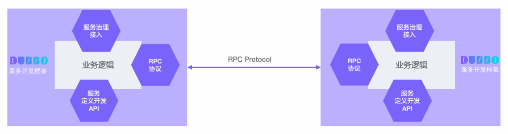
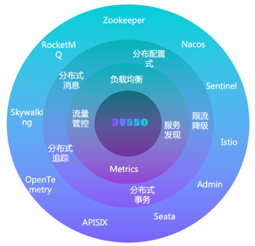
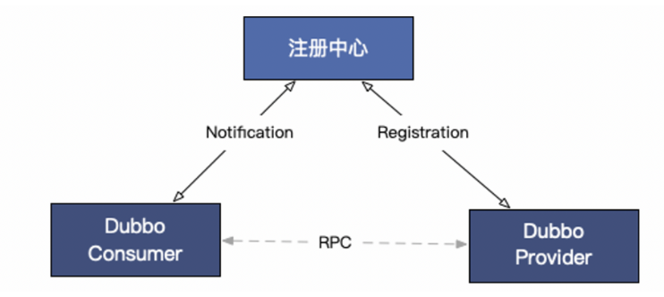

# Dubbo

## 概念与架构


以上是Dubbo的工作原理图，从抽象架构上分为两层：服务治理抽象控制面 和 Dubbo数据面

- 服务治理控制面：不是特指如注册中心的单个具体组件，而是对dubbo治理体系的抽象表达。控制面包含协调服务发现的注册中心，流量管控策略、Dubbo Admin控制台等
- Dubbo 数据面：代码集群部署的所有Dubbo进程，进程之间还通过RPC协议实现数据交换，Dubbo定义了微服务应用开发与调用规范并负责完成数据传输的编解码工作
  - 服务消费者：发起业务调用或RPC通信的Dubbo进程
  - 服务提供者：接受业务调用或RPC通信的Dubbo进程

**Dubbo 数据面**

从数据面视角，Dubbo 帮助解决了微服务实践中的以下问题：

- Dubbo 作为 **服务开发框架** 约束了微服务定义、开发与调用的规范，定义了服务治理流程及适配模式
- Dubbo 作为 **RPC 通信协议实现** 解决服务间数据传输的编解码问题



**服务开发框架**

微服务的目标是构建足够小的、自包含的、独立演进的、可以随时部署运行的分布式应用程序，几乎每个语言都有类似的应用开发框架来帮助开发者快速构建此类微服务应用，比如 Java 微服务体系的 Spring Boot，它帮 Java 微服务开发者以最少的配置、最轻量的方式快速开发、打包、部署与运行应用。

微服务的分布式特性，使得应用间的依赖、网络交互、数据传输变得更频繁，因此不同的**应用需要定义、暴露或调用 RPC 服务，那么这些 RPC 服务如何定义、如何与应用开发框架结合、服务调用行为如何控制？这就是 Dubbo 服务开发框架的含义，Dubbo 在微服务应用开发框架之上抽象了一套 RPC 服务定义、暴露、调用与治理的编程范式**，比如 Dubbo Java 作为服务开发框架，当运行在 Spring 体系时就是构建在 Spring Boot 应用开发框架之上的微服务开发框架，并在此之上抽象了一套 RPC 服务定义、暴露、调用与治理的编程范式。


Dubbo 作为服务开发框架包含的具体内容如下：

- **RPC 服务定义、开发范式**。比如 Dubbo 支持通过 IDL 定义服务，也支持编程语言特有的服务开发定义方式，如通过 Java Interface 定义服务。
- **RPC 服务发布与调用 API**。Dubbo 支持同步、异步、Reactive Streaming 等服务调用编程模式，还支持请求上下文 API、设置超时时间等。
- **服务治理策略、流程与适配方式等**。作为服务框架数据面，Dubbo 定义了服务地址发现、负载均衡策略、基于规则的流量路由、Metrics 指标采集等服务治理抽象，并适配到特定的产品实现。

**通信协议**

**Dubbo 从设计上不绑定任何一款特定通信协议，HTTP/2、REST、gRPC、JsonRPC、Thrift、Hessian2 等几乎所有主流的通信协议，Dubbo 框架都可以提供支持。** 这样的 Protocol 设计模式给构建微服务带来了最大的灵活性，开发者可以根据需要如性能、通用型等选择不同的通信协议，不再需要任何的代理来实现协议转换，甚至你还可以通过 Dubbo 实现不同协议间的迁移。


Dubbo Protocol 被设计支持扩展，您可以将内部私有协议适配到 Dubbo 框架上，进而将私有协议接入 Dubbo 体系，以享用 Dubbo 的开发体验与服务治理能力。比如 Dubbo3 的典型用户阿里巴巴，就是通过扩展支持 HSF 协议实现了内部 HSF 框架到 Dubbo3 框架的整体迁移。

Dubbo 还支持多协议暴露，您可以在单个端口上暴露多个协议，Dubbo Server 能够自动识别并确保请求被正确处理，也可以将同一个 RPC 服务发布在不同的端口（协议），为不同技术栈的调用方服务。

Dubbo 提供了两款内置高性能 Dubbo2、Triple (兼容 gRPC) 协议实现，以满足部分微服务用户对高性能通信的诉求，两者最开始都设计和诞生于阿里巴巴内部的高性能通信业务场景。

- Dubbo2 协议是在 TCP 传输层协议之上设计的二进制通信协议
- Triple 则是基于 HTTP/2 之上构建的支持流式模式的通信协议，并且 Triple 完全兼容 gRPC 但实现上做了更多的符合 Dubbo 框架特点的优化。

总的来说，Dubbo 对通信协议的支持具有以下特点：

- 不绑定通信协议
- 提供高性能通信协议实现
- 支持流式通信模型
- 不绑定序列化协议
- 支持单个服务的多协议暴露
- 支持单端口多协议发布
- 支持一个应用内多个服务使用不同通信协议

**Dubbo服务治理**

服务开发框架解决了开发与通信的问题，但是在微服务集群环境下，我们仍需要解决无状态服务节点动态变化、外部化配置、日志跟踪、可观测性、流量管理、高可用性、数据一致性等一系列问题，我们将这些问题统称为服务治理。

Dubbo 抽象了一套微服务治理模式并发布了对应的官方实现，服务治理可帮助简化微服务开发与运维，让开发者更专注在微服务业务本身。

**服务治理抽象**

以下展示了 Dubbo 核心的服务治理功能定义



- **地址发现**

Dubbo 服务发现具备高性能、支持大规模集群、服务级元数据配置等优势，默认提供 Nacos、Zookeeper、Consul 等多种注册中心适配，与 Spring Cloud、Kubernetes Service 模型打通，支持自定义扩展。

- **负载均衡**

Dubbo 默认提供加权随机、加权轮询、最少活跃请求数优先、最短响应时间优先、一致性哈希和自适应负载等策略

- **流量路由**

Dubbo 支持通过一系列流量规则控制服务调用的流量分布与行为，基于这些规则可以实现基于权重的比例流量分发、灰度验证、金丝雀发布、按请求参数的路由、同区域优先、超时配置、重试、限流降级等能力。

- **链路追踪**

Dubbo 官方通过适配 OpenTelemetry 提供了对 Tracing 全链路追踪支持，用户可以接入支持 OpenTelemetry 标准的产品如 Skywalking、Zipkin 等。另外，很多社区如 Skywalking、Zipkin 等在官方也提供了对 Dubbo 的适配。

- **可观测性**

Dubbo 实例通过 Prometheus 等上报 QPS、RT、请求次数、成功率、异常次数等多维度的可观测指标帮助了解服务运行状态，通过接入 Grafana、Admin 控制台帮助实现数据指标可视化展示。

Dubbo 服务治理生态还提供了对 **API 网关**、**限流降级**、**数据一致性**、**认证鉴权**等场景的适配支持。

## 功能

### 微服务开发

Dubbo 解决企业微服务从开发、部署到治理运维的一系列挑战，Dubbo为开发者提供从项目创建、开发测试，到部署、可视化监测、流量治理，再到生态继承的全套服务

- **开发层面**，Dubbo 提供了 Java、Go、Rust、Node.js 等语言实现并定义了一套微服务开发范式，配套脚手架可用于快速创建微服务项目骨架
- **部署层面**，Dubbo 应用支持虚拟机、Docker 容器、Kubernetes、服务网格架构部署
- **服务治理层面**，Dubbo 提供了地址发现、负载均衡、流量管控等治理能力，官方还提供 Admin 可视化控制台、丰富的微服务生态集成

**开发**：

接下来以 Java 体系 Spring Boot 项目为例讲解 Dubbo 应用开发的基本步骤，整个过程非常直观简单，其他语言开发过程类似。

**创建项目**

[Dubbo 微服务项目脚手架](https://start.dubbo.apache.org/bootstrap.html)（支持浏览器页面、命令行和 IDE）可用于快速创建微服务项目，只需要告诉脚手架期望包含的功能或组件，脚手架最终可以帮助开发者生成具有必要依赖的微服务工程。更多脚手架使用方式的讲解，请参见任务模块的 [通过模板生成项目脚手架](https://cn.dubbo.apache.org/zh-cn/overview/what/tasks/develop/template/)

**开发服务**

**1. 定义服务**

```java
public interface DemoService {
    String hello(String arg);
}
```

**2. 提供业务逻辑实现**

```java
@DubboService
public class DemoServiceImpl implements DemoService {
    public String hello(String arg) {
        // put your microservice logic here
    }
}
```

**发布服务**

**1. 发布服务定义**

为使消费方顺利调用服务，服务提供者首先要将服务定义以 Jar 包形式发布到 Maven 中央仓库。

**2. 对外暴露服务**

补充 Dubbo 配置并启动 Dubbo Server

```yaml
dubbo:
  application:
    name: dubbo-demo
  protocol:
    name: dubbo
    port: -1
  registry:
    address: zookeeper://127.0.0.1:2181
```

**调用服务**

首先，消费方通过 Maven/Gradle 引入 `DemoService` 服务定义依赖。

```xml
<dependency>
    <groupId>org.apache.dubbo</groupId>
    <artifactId>dubbo-demo-interface</artifactId>
    <version>3.2.0</version>
</dependency>
```

编程注入远程 Dubbo 服务实例

```java
@Bean
public class Consumer {
    @DubboReference
    private DemoService demoService;
}
```

**部署**

Dubbo 原生服务可打包部署到 Docker 容器、Kubernetes、服务网格 等云原生基础设施和微服务架构。

关于不同环境的部署示例，可参考：

- [部署 Dubbo 服务到 Docker 容器](https://cn.dubbo.apache.org/zh-cn/overview/what/tasks/deploy/deploy-on-docker)
- [部署 Dubbo 服务到 Kubernetes](https://cn.dubbo.apache.org/zh-cn/overview/what/tasks/deploy/deploy-on-k8s-docker)

**治理**

对于服务治理，绝大多数应用只需要增加以下配置即可，Dubbo 应用将具备地址发现和负载均衡能力。

```yaml
dubbo:
  registry:
    address: zookeeper://127.0.0.1:2181
```

部署并打开 [Dubbo Admin 控制台](https://cn.dubbo.apache.org/zh-cn/overview/what/tasks/deploy)，可以看到集群的服务部署和调用数据


除此之外，Dubbo Amin 还可以通过以下能力提升研发测试效率

- 文档管理，提供普通服务、IDL 文档管理
- 服务测试 & 服务 Mock
- 服务状态查询

对于更复杂的微服务实践场景，Dubbo 还提供了更多高级服务治理特性，具体请参见文档了解更多。包括：

- 流量治理
- 动态配置
- 限流降级
- 数据一致性
- 可观测性
- 多协议
- 多注册中心
- 服务网格

### 服务发现

Dubbo 提供的是一种Client-Based 的服务发现机制，依赖第三方组件来协调服务发现过程，支持常用的注册中心如 Nacos、Consul、Zookeeper 等。

以下是 Dubbo 服务发现机制的基本工作原理图：




服务发现包含提供者、消费者和注册中心三个参与角色，其中，Dubbo 提供者实例注册 URL 地址到注册中心，注册中心负责对数据进行聚合，Dubbo 消费者从注册中心读取地址列表并订阅变更，每当地址列表发生变化，注册中心将最新的列表通知到所有订阅的消费者实例。

**面向百万实例集群的服务发现机制**

区别于其他很多微服务框架的是，**Dubbo3 的服务发现机制诞生于阿里巴巴超大规模微服务电商集群实践场景，因此，其在性能、可伸缩性、易用性等方面的表现大幅领先于业界大多数主流开源产品**。是企业面向未来构建可伸缩的微服务集群的最佳选择。


- 首先，Dubbo 注册中心以应用粒度聚合实例数据，消费者按消费需求精准订阅，避免了大多数开源框架如 Istio、Spring Cloud 等全量订阅带来的性能瓶颈。
- 其次，Dubbo SDK 在实现上对消费端地址列表处理过程做了大量优化，地址通知增加了异步、缓存、bitmap 等多种解析优化，避免了地址更新常出现的消费端进程资源波动。
- 最后，在功能丰富度和易用性上，服务发现除了同步 ip、port 等端点基本信息到消费者外，Dubbo 还将服务端的 RPC/HTTP 服务及其配置的元数据信息同步到消费端，这让消费者、提供者两端的更细粒度的协作成为可能，Dubbo 基于此机制提供了很多差异化的治理能力

**高效地址推送实现**

从注册中心视角来看，它负责以应用名 (dubbo.application.name) 对整个集群的实例地址进行聚合，每个对外提供服务的实例将自身的应用名、实例ip:port 地址信息 (通常还包含少量的实例元数据，如机器所在区域、环境等) 注册到注册中心。

> Dubbo2 版本注册中心以服务粒度聚合实例地址，比应用粒度更细，也就意味着传输的数据量更大，因此在大规模集群下也遇到一些性能问题。 针对 Dubbo2 与 Dubbo3 跨版本数据模型不统一的问题，Dubbo3 给出了[平滑迁移方案](https://cn.dubbo.apache.org/zh-cn/overview/mannual/java-sdk/upgrades-and-compatibility/service-discovery/migration-service-discovery/)，可做到模型变更对用户无感。


每个消费服务的实例从注册中心订阅实例地址列表，相比于一些产品直接将注册中心的全量数据 (应用 + 实例地址) 加载到本地进程，Dubbo 实现了按需精准订阅地址信息。比如一个消费者应用依赖 app1、app2，则只会订阅 app1、app2 的地址列表更新，大幅减轻了冗余数据推送和解析的负担。


