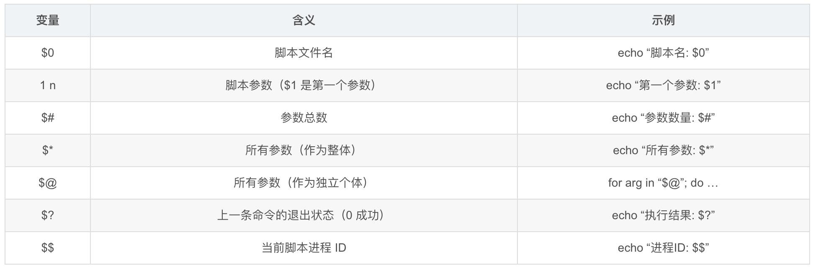
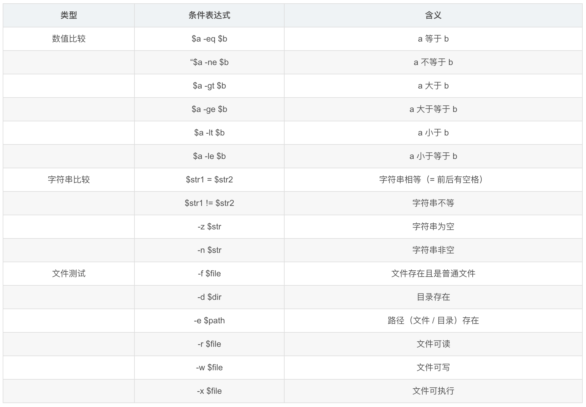

# Shell

## 一、基础知识

### 1、什么是 Shell 脚本？

Shell 脚本是一种为 Shell 编写的脚本程序，Shell 是用户与操作系统内核之间的接口。Shell 脚本可以自动化执行一系列命令，提高工作效率。
每个 Shell 脚本通常以 **shebang** 开头，指定解释器路径。

```shell
#!/bin/bash
echo "Hello, World!"
```

### 2、创建和执行脚本

创建一个新文件，添加执行权限，然后运行：

```shell
# 创建脚本文件
touch hello.sh

# 添加执行权限
chmod +x hello.sh

# 运行脚本
./hello.sh
```

### 3、变量与注释

在 Shell 脚本中定义变量和使用注释：

``` shell
# 这是一个注释
NAME="Shell学习者"
AGE=25

# 使用变量
echo "你好, $NAME!"
echo "年龄: $AGE"
```

## 二、语法精讲

### 条件判断

使用 if 语句进行条件判断：

```shell
if [ $NUM -gt 10 ]; then
  echo "数字大于10"
elif [ $NUM -eq 10 ]; then
  echo "数字等于10"
else
  echo "数字小于10"
fi
```

### 循环结构

使用 for 和 while 循环：

```shell
# for循环
for i in 1 2 3 4 5; do
  echo "数字: $i"
done

# while循环
COUNT=1
while [ $COUNT -le 5 ]; do
  echo "计数: $COUNT"
  COUNT=$((COUNT+1))
done
```

### 函数定义

创建可重用的代码块

```shell
# 定义函数
greet() {
  echo "你好, $1!"
}

# 调用函数
greet "世界"
greet "Shell学习者"
```

## 三、实战示例

### 系统监控脚本

创建一个监控系统资源控制的脚本

```shell
#!/bin/bash

# 磁盘使用率检查
DISK_THRESHOLD=90
DISK_USE=$(df / | awk 'NR==2 {print $5}' | sed 's/%//')

# 内存使用率检查
MEM_THRESHOLD=80
MEM_USE=$(free | awk 'NR==2{printf "%.0f", $3*100/$2}')

# 检查并输出警告
if [ $DISK_USE -gt $DISK_THRESHOLD ]; then
  echo "警告: 磁盘使用率 $DISK_USE% 超过阈值 $DISK_THRESHOLD%"
fi

if [ $MEM_USE -gt $MEM_THRESHOLD ]; then
  echo "警告: 内存使用率 $MEM_USE% 超过阈值 $MEM_THRESHOLD%"
fi
```

### 文件备份脚本

创建一个自动备份文件的脚本

```shell
#!/bin/bash

# 备份配置
BACKUP_SRC="/home/user/documents"
BACKUP_DEST="/home/user/backups"
DATE=$(date +%Y%m%d_%H%M%S)

# 创建备份
tar -czf $BACKUP_DEST/backup_$DATE.tar.gz $BACKUP_SRC

# 检查备份结果
if [ $? -eq 0 ]; then
  echo "备份成功完成: backup_$DATE.tar.gz"
else
  echo "备份失败!"
fi
```

## 四、Shell 脚本常用语法速查表

### 一、变量

1. **变量定义与使用**

```shell
# 定义变量（等号前后无空格）
name="Shell"
age=20

# 使用变量（$变量名 或 ${变量名}）
echo "名称: $name"       # 输出：名称: Shell
echo "年龄: ${age}岁"    # 输出：年龄: 20岁
```

2. **特殊变量**



3. **环境变量与只读变量**

```shell
# 环境变量（全局可用，通常大写）
echo "当前用户: $USER"    # 输出当前登录用户
echo "路径: $PATH"        # 输出系统命令路径

# 只读变量（不可修改）
readonly pi=3.14
pi=3.1415  # 报错：无法修改只读变量
```

### 二、条件判断

1. **基本预发（if 语句）**

```shell
if [ 条件 ]; then
  # 条件成立时执行
elif [ 条件 ]; then
  # 否则若条件成立时执行
else
  # 所有条件不成立时执行
fi
```

2. **常见判断条件**



3. **示例**

```shell
# 数值比较
num=5
if [ $num -gt 3 ]; then
  echo "$num 大于 3"  # 输出：5 大于 3
fi

# 文件测试
file="test.sh"
if [ -f $file ]; then
  echo "$file 是普通文件"
else
  echo "$file 不存在或不是文件"
fi

# case 语句（多条件匹配）
fruit="apple"
case $fruit in
  "apple") echo "这是苹果" ;;
  "banana") echo "这是香蕉" ;;
  *) echo "未知水果" ;;  # 其他情况
esac
```

### 三、循环

1. **for 循环**

```shell
# 遍历列表
for name in "Alice" "Bob" "Charlie"; do
  echo "Hello, $name"
done

# 遍历文件（当前目录下的 .sh 文件）
for file in *.sh; do
  echo "脚本文件: $file"
done

# C 风格循环（i 从 1 到 5）
for ((i=1; i<=5; i++)); do
  echo "计数: $i"
done
```

2. **while 循环（条件为真时执行）**

```shell
count=1
while [ $count -le 3 ]; do
  echo "循环次数: $count"
  count=$((count + 1))  # 自增（注意双括号）
done
# 输出：
# 循环次数: 1
# 循环次数: 2
# 循环次数: 3
```

3. **until 循环（条件为假时执行）**

```shell
# break：跳出整个循环
for i in 1 2 3 4 5; do
  if [ $i -eq 3 ]; then
    break  # 当 i=3 时跳出循环
  fi
  echo $i
done  # 输出：1 2

# continue：跳过当前循环，执行下一次
for i in 1 2 3 4 5; do
  if [ $i -eq 3 ]; then
    continue  # 跳过 i=3
  fi
  echo $i
done  # 输出：1 2 4 5
```

### 四、函数

1. **函数定义与调用**

```shell
# 定义函数
greet() {
  echo "Hello, $1!"  # $1 是函数的第一个参数
}

# 调用函数（传递参数）
greet "World"  # 输出：Hello, World!
greet "Shell"  # 输出：Hello, Shell!
```

2. **函数返回值**

```shell
# 用 return 返回状态码（0-255）
add() {
  return $(( $1 + $2 ))  # 返回和（仅状态码，非实际值）
}

add 3 5
echo "结果: $?"  # 输出：8（通过 $? 获取返回值）

# 用 echo 返回实际值（更常用）
sum() {
  echo $(( $1 + $2 ))  # 直接输出计算结果
}

result=$(sum 3 5)  # 用 $() 捕获输出
echo "3+5=$result"  # 输出：3+5=8
```

### 五、输入输出

1. **输出（echo/printf）**

```shell
echo "Hello World"  # 基本输出
echo -n "不换行"    # 不自动换行（输出：不换行）
echo -e "换行\n制表\t符"  # 解析转义字符（-e 启用）

# printf（格式化输出，类似 C 语言）
printf "姓名: %s, 年龄: %d\n" "Alice" 20  # 输出：姓名: Alice, 年龄: 20
```

2. **输入（read）**

```shell
echo "请输入姓名:"
read name  # 读取用户输入到 name 变量
echo "你好, $name!"

# 带提示的简化写法
read -p "请输入年龄: " age
echo "你的年龄是 $age"
```

3. **重定向与管道**

```shell
# 输出重定向（> 覆盖，>> 追加）
echo "测试内容" > test.txt    # 写入文件（覆盖原有内容）
echo "追加内容" >> test.txt  # 追加到文件

# 输入重定向（从文件读取）
while read line; do
  echo "行内容: $line"
done < test.txt  # 从 test.txt 读取内容

# 管道（|：将前一个命令的输出作为后一个命令的输入）
ls -l | grep ".sh"  # 列出所有 .sh 文件
```

### 六、字符串处理

```shell
str="hello shell"

# 字符串长度
echo "长度: ${#str}"  # 输出：10

# 截取子串（从索引 6 开始，取 5 个字符）
echo "子串: ${str:6:5}"  # 输出：shell

# 替换（仅替换第一个匹配）
echo "替换1: ${str/shell/bash}"  # 输出：hello bash

# 全局替换（所有匹配）
echo "替换2: ${str//l/L}"  # 输出：heLLo sheLL
```

### 七、数组

```shell
# 定义数组
fruits=("apple" "banana" "cherry")

# 访问数组元素（索引从 0 开始）
echo "第一个元素: ${fruits[0]}"  # 输出：apple

# 遍历数组
for fruit in "${fruits[@]}"; do
  echo $fruit
done

# 数组长度
echo "数组长度: ${#fruits[@]}"  # 输出：3
```


